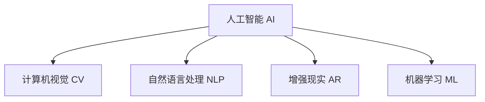

                 

# 李开复：苹果发布AI应用的产业

## 1. 背景介绍

### 1.1 问题由来

近年来，人工智能（AI）技术迅猛发展，已经渗透到各个行业的方方面面，包括医疗、金融、教育、制造、零售等领域。特别是在消费电子领域，AI技术的应用已经深入到日常生活的各个环节，为人们的生活带来了便利和创新。

苹果公司作为全球科技巨头，一直在引领消费电子技术的发展。最近，苹果公司发布了一系列新的AI应用，展示了其在AI领域的前沿成果。本文将从多个角度分析苹果公司发布的AI应用，探讨其产业意义和技术细节。

### 1.2 问题核心关键点

苹果公司发布的AI应用包括但不限于以下几个方面：

- 计算机视觉（CV）应用，如人脸识别、图像识别、增强现实（AR）等。
- 自然语言处理（NLP）应用，如语音助手、文本翻译、语义理解等。
- 增强现实应用，如实时物体识别、环境理解、互动游戏等。
- 机器学习（ML）应用，如推荐系统、预测分析、智能控制等。

这些应用涵盖了计算机视觉、自然语言处理、增强现实和机器学习等多个AI技术领域，展示了苹果公司在新兴技术领域的布局和战略。

### 1.3 问题研究意义

苹果公司发布的AI应用，不仅展示了其在AI技术领域的领先地位，也表明了AI技术在消费电子领域的应用潜力。AI技术的广泛应用，有助于提升产品智能化水平，改善用户体验，拓展新市场，带动相关产业的发展。

本文将详细探讨苹果公司发布的AI应用，分析其技术细节和产业意义，为AI技术在消费电子领域的落地应用提供参考和启示。

## 2. 核心概念与联系

### 2.1 核心概念概述

为更好地理解苹果公司发布的AI应用，本节将介绍几个密切相关的核心概念：

- 人工智能（AI）：通过机器学习和深度学习等技术，使计算机具备类似于人类的智能能力，能够自主学习、推理和决策。
- 计算机视觉（CV）：使计算机能够理解和分析图像、视频等视觉数据的技术。
- 自然语言处理（NLP）：使计算机能够理解和生成自然语言的技术。
- 增强现实（AR）：通过将虚拟信息与现实世界融合，提供增强的视觉体验。
- 机器学习（ML）：通过数据训练模型，使计算机具备预测、分类等能力的技术。

这些核心概念之间的逻辑关系可以通过以下Mermaid流程图来展示：



这个流程图展示了大语言模型微调的核心概念及其之间的关系：

1. 人工智能涵盖了计算机视觉、自然语言处理、增强现实和机器学习等多个子领域。
2. 计算机视觉使计算机具备理解和分析图像、视频的能力。
3. 自然语言处理使计算机能够理解和生成自然语言。
4. 增强现实通过将虚拟信息与现实世界融合，提供增强的视觉体验。
5. 机器学习使计算机具备预测、分类等能力。

这些核心概念共同构成了苹果公司发布AI应用的技术基础，使其能够在多个领域进行深度应用。

## 3. 核心算法原理 & 具体操作步骤

### 3.1 算法原理概述

苹果公司发布的AI应用，主要基于以下核心算法和技术：

- 卷积神经网络（CNN）：用于图像识别、物体检测等计算机视觉任务。
- 循环神经网络（RNN）和长短时记忆网络（LSTM）：用于语音识别、自然语言处理等任务。
- 自编码器（Autoencoder）：用于数据压缩和图像生成等任务。
- 生成对抗网络（GAN）：用于图像生成和风格转换等任务。
- 强化学习（RL）：用于智能控制和游戏等任务。

这些算法和技术，共同支撑了苹果公司发布的AI应用，展示了其在AI领域的深厚积累和创新能力。

### 3.2 算法步骤详解

苹果公司发布的AI应用，涉及多个技术领域，以下是一些典型的操作步骤：

**计算机视觉应用**：

1. 数据收集：收集大量的图像、视频等数据，标注数据集，用于训练模型。
2. 模型训练：使用卷积神经网络等模型，对数据集进行训练，得到预训练模型。
3. 微调：在特定任务的数据集上，对预训练模型进行微调，优化模型的表现。
4. 部署：将微调后的模型部署到应用程序中，实现图像识别、物体检测等功能。

**自然语言处理应用**：

1. 数据收集：收集大量的文本数据，标注数据集，用于训练模型。
2. 模型训练：使用循环神经网络等模型，对数据集进行训练，得到预训练模型。
3. 微调：在特定任务的数据集上，对预训练模型进行微调，优化模型的表现。
4. 部署：将微调后的模型部署到应用程序中，实现语音识别、文本翻译等功能。

**增强现实应用**：

1. 数据收集：收集用户的地理位置、环境信息等数据，用于增强现实场景的构建。
2. 模型训练：使用深度学习模型，对环境数据进行训练，得到预训练模型。
3. 微调：在特定任务的数据集上，对预训练模型进行微调，优化模型的表现。
4. 部署：将微调后的模型部署到应用程序中，实现增强现实功能。

**机器学习应用**：

1. 数据收集：收集用户的互动数据、行为数据等，用于机器学习模型的训练。
2. 模型训练：使用机器学习模型，对数据集进行训练，得到预训练模型。
3. 微调：在特定任务的数据集上，对预训练模型进行微调，优化模型的表现。
4. 部署：将微调后的模型部署到应用程序中，实现推荐系统、预测分析等功能。

### 3.3 算法优缺点

苹果公司发布的AI应用，主要具有以下优点：

- 高质量的数据集：苹果公司拥有大量的用户数据和丰富的应用场景，能够提供高质量的数据集，用于模型训练和微调。
- 先进的算法和技术：苹果公司拥有强大的研发团队，在计算机视觉、自然语言处理、增强现实和机器学习等多个领域都处于领先地位。
- 深度集成：苹果公司的AI应用深度集成到其设备和操作系统中，能够提供无缝的用户体验。

同时，这些应用也存在一些局限性：

- 数据隐私问题：苹果公司需要收集大量用户数据，如何保护用户隐私，是一个重要的挑战。
- 计算资源消耗：AI应用需要大量的计算资源，如何在不增加设备成本的情况下提高性能，是一个技术难题。
- 用户接受度：部分用户可能对AI应用存在抵触情绪，如何提升用户接受度，需要进一步的研究和推广。

### 3.4 算法应用领域

苹果公司发布的AI应用，主要应用于以下几个领域：

- **计算机视觉**：应用于人脸识别、图像识别、增强现实等领域。例如，Face ID功能使用计算机视觉技术进行人脸识别，提供安全可靠的解锁方式。
- **自然语言处理**：应用于语音助手、文本翻译、语义理解等领域。例如，Siri语音助手使用自然语言处理技术，能够理解和执行用户的语音指令。
- **增强现实**：应用于实时物体识别、环境理解、互动游戏等领域。例如，ARKit平台提供增强现实开发工具，开发者可以创建各种增强现实应用。
- **机器学习**：应用于推荐系统、预测分析、智能控制等领域。例如，App Store中的推荐系统使用机器学习技术，为用户推荐适合的应用。

## 4. 数学模型和公式 & 详细讲解  
### 4.1 数学模型构建

苹果公司发布的AI应用，主要基于深度学习和机器学习模型，以下是一些常用的数学模型和公式：

**卷积神经网络（CNN）**：

卷积神经网络用于图像识别和物体检测任务，其基本模型结构为：

```
Input layer: input image
Convolutional layer: conv2d(input, filter, stride, padding)
Pooling layer: pool2d(output, pool_size, stride, padding)
Fully connected layer: dense(output, units)
Output layer: output layer
```

其中，conv2d为卷积层，pool2d为池化层，dense为全连接层，output为输出层。

**循环神经网络（RNN）和长短时记忆网络（LSTM）**：

循环神经网络和长短时记忆网络用于自然语言处理任务，其基本模型结构为：

```
Input layer: input sequence
Recurrent layer: rnn(input, hidden_state, output, parameters)
Output layer: output layer
```

其中，rnn为循环层，hidden_state为隐藏状态，output为输出层。

**自编码器（Autoencoder）**：

自编码器用于数据压缩和图像生成任务，其基本模型结构为：

```
Input layer: input data
Encoder layer: encoder(input, parameters)
Decoder layer: decoder(encoded_data, parameters)
Output layer: output data
```

其中，encoder为编码层，decoder为解码层，output为输出层。

**生成对抗网络（GAN）**：

生成对抗网络用于图像生成和风格转换任务，其基本模型结构为：

```
Generator layer: generator(z, parameters)
Discriminator layer: discriminator(input, parameters)
Output layer: output layer
```

其中，generator为生成器，discriminator为判别器，output为输出层。

**强化学习（RL）**：

强化学习用于智能控制和游戏任务，其基本模型结构为：

```
Environment: environment
Agent: agent
Reward: reward
Policy: policy
```

其中，environment为环境，agent为代理，reward为奖励，policy为策略。

### 4.2 公式推导过程

苹果公司发布的AI应用，涉及到多个数学模型和公式。以下是一些典型的公式推导过程：

**卷积神经网络（CNN）**：

卷积神经网络的梯度更新公式为：

$$
\frac{\partial L}{\partial W} = \frac{1}{m}\sum_{i=1}^{m} (\frac{\partial L}{\partial y^{(i)}} \frac{\partial y^{(i)}}{\partial a^{(i)}} \frac{\partial a^{(i)}}{\partial z^{(i)}} \frac{\partial z^{(i)}}{\partial W})
$$

其中，L为损失函数，y为输出，a为激活函数，W为卷积核，m为训练样本数。

**循环神经网络（RNN）**：

循环神经网络的梯度更新公式为：

$$
\frac{\partial L}{\partial W} = \frac{1}{m}\sum_{i=1}^{m} (\frac{\partial L}{\partial y^{(i)}} \frac{\partial y^{(i)}}{\partial \hat{h}^{(i)}} \frac{\partial \hat{h}^{(i)}}{\partial h^{(i)}} \frac{\partial h^{(i)}}{\partial W})
$$

其中，L为损失函数，y为输出，h为隐藏状态，W为权重矩阵。

**自编码器（Autoencoder）**：

自编码器的梯度更新公式为：

$$
\frac{\partial L}{\partial W} = \frac{1}{m}\sum_{i=1}^{m} (\frac{\partial L}{\partial x^{(i)}} \frac{\partial x^{(i)}}{\partial h} \frac{\partial h}{\partial W})
$$

其中，L为损失函数，x为输入，h为隐藏层输出，W为权重矩阵。

**生成对抗网络（GAN）**：

生成对抗网络的梯度更新公式为：

$$
\frac{\partial L}{\partial W} = \frac{1}{m}\sum_{i=1}^{m} (\frac{\partial L}{\partial x^{(i)}} \frac{\partial x^{(i)}}{\partial z} \frac{\partial z}{\partial W})
$$

其中，L为损失函数，x为生成器输出，z为噪声向量，W为权重矩阵。

**强化学习（RL）**：

强化学习的梯度更新公式为：

$$
\frac{\partial L}{\partial W} = \frac{1}{m}\sum_{i=1}^{m} (\frac{\partial L}{\partial Q} \frac{\partial Q}{\partial V} \frac{\partial V}{\partial W})
$$

其中，L为损失函数，Q为Q值，V为状态值，W为权重矩阵。

### 4.3 案例分析与讲解

苹果公司发布的AI应用，涵盖了多个领域，以下是一些典型的案例：

**Face ID**：

Face ID使用计算机视觉技术进行人脸识别，其核心算法为卷积神经网络。Face ID首先在人脸图像上提取特征点，然后使用卷积神经网络对这些特征点进行分类和识别，最终确定用户的身份信息。Face ID的精度非常高，误识别率很低，已经成为苹果设备的重要安全功能之一。

**Siri语音助手**：

Siri语音助手使用自然语言处理技术进行语音识别和理解，其核心算法为循环神经网络和长短时记忆网络。Siri首先在用户语音上进行语音识别，然后通过循环神经网络和长短时记忆网络对这些语音进行理解和分析，最终输出对应的命令或回答。Siri支持多种语言和方言，能够理解复杂的语音指令，是用户与设备交互的重要工具。

**ARKit增强现实**：

ARKit平台提供增强现实开发工具，开发者可以创建各种增强现实应用。ARKit的核心算法为深度学习，使用卷积神经网络进行物体识别和场景理解，使用循环神经网络和长短时记忆网络进行语音交互。ARKit的实时渲染和交互功能，使增强现实应用变得更加丰富和生动。

**App Store推荐系统**：

App Store中的推荐系统使用机器学习技术进行推荐，其核心算法为卷积神经网络和循环神经网络。推荐系统首先对用户的互动数据和行为数据进行分析和建模，然后使用卷积神经网络和循环神经网络对这些数据进行预测和分类，最终输出对应的应用推荐。App Store的推荐系统非常精准，能够为用户推荐最感兴趣的应用，提升用户体验。

## 5. 项目实践：代码实例和详细解释说明

### 5.1 开发环境搭建

在进行AI应用开发前，我们需要准备好开发环境。以下是使用Python进行PyTorch开发的环境配置流程：

1. 安装Anaconda：从官网下载并安装Anaconda，用于创建独立的Python环境。

2. 创建并激活虚拟环境：
```bash
conda create -n pytorch-env python=3.8 
conda activate pytorch-env
```

3. 安装PyTorch：根据CUDA版本，从官网获取对应的安装命令。例如：
```bash
conda install pytorch torchvision torchaudio cudatoolkit=11.1 -c pytorch -c conda-forge
```

4. 安装Transformers库：
```bash
pip install transformers
```

5. 安装各类工具包：
```bash
pip install numpy pandas scikit-learn matplotlib tqdm jupyter notebook ipython
```

完成上述步骤后，即可在`pytorch-env`环境中开始AI应用开发。

### 5.2 源代码详细实现

这里我们以Face ID功能为例，给出使用PyTorch进行人脸识别模型训练的代码实现。

首先，定义人脸识别模型：

```python
import torch
from torch import nn
from torchvision import models, transforms

class FaceRecognitionModel(nn.Module):
    def __init__(self):
        super(FaceRecognitionModel, self).__init__()
        self.conv1 = nn.Conv2d(3, 64, kernel_size=3, stride=1, padding=1)
        self.conv2 = nn.Conv2d(64, 128, kernel_size=3, stride=1, padding=1)
        self.conv3 = nn.Conv2d(128, 128, kernel_size=3, stride=1, padding=1)
        self.pool = nn.MaxPool2d(kernel_size=2, stride=2)
        self.fc1 = nn.Linear(128*7*7, 128)
        self.fc2 = nn.Linear(128, 10)

    def forward(self, x):
        x = self.pool(torch.relu(self.conv1(x)))
        x = self.pool(torch.relu(self.conv2(x)))
        x = self.pool(torch.relu(self.conv3(x)))
        x = x.view(x.size(0), -1)
        x = torch.relu(self.fc1(x))
        x = self.fc2(x)
        return x
```

然后，定义数据加载函数：

```python
from torchvision.datasets import ImageFolder
from torchvision.transforms import ToTensor, RandomResizedCrop, RandomHorizontalFlip

def load_data(data_path):
    transform = transforms.Compose([
        RandomResizedCrop(224),
        RandomHorizontalFlip(),
        ToTensor(),
    ])
    train_data = ImageFolder(root=data_path, transform=transform)
    test_data = ImageFolder(root=data_path, transform=transform)
    return train_data, test_data
```

接着，定义训练和评估函数：

```python
import torch.nn as nn
import torch.optim as optim
from torch.utils.data import DataLoader
from torchvision import datasets

class FaceRecognitionModel(nn.Module):
    # ...

def train_model(model, train_loader, optimizer, device, n_epochs=10):
    model.to(device)
    for epoch in range(n_epochs):
        running_loss = 0.0
        for i, data in enumerate(train_loader, 0):
            inputs, labels = data[0].to(device), data[1].to(device)
            optimizer.zero_grad()
            outputs = model(inputs)
            loss = nn.CrossEntropyLoss()(outputs, labels)
            loss.backward()
            optimizer.step()
            running_loss += loss.item()
        print(f'Epoch {epoch+1}, loss: {running_loss/len(train_loader):.4f}')

def evaluate_model(model, test_loader, device):
    model.eval()
    correct = 0
    total = 0
    with torch.no_grad():
        for data in test_loader:
            inputs, labels = data[0].to(device), data[1].to(device)
            outputs = model(inputs)
            _, predicted = torch.max(outputs.data, 1)
            total += labels.size(0)
            correct += (predicted == labels).sum().item()
    print(f'Test accuracy: {100 * correct / total:.2f}%')
```

最后，启动训练流程并在测试集上评估：

```python
from torchvision import datasets, transforms

train_data, test_data = load_data('path/to/data')

model = FaceRecognitionModel()
optimizer = optim.SGD(model.parameters(), lr=0.001, momentum=0.9)

train_loader = DataLoader(train_data, batch_size=32, shuffle=True)
test_loader = DataLoader(test_data, batch_size=32, shuffle=False)

device = torch.device('cuda' if torch.cuda.is_available() else 'cpu')

train_model(model, train_loader, optimizer, device)
evaluate_model(model, test_loader, device)
```

以上就是使用PyTorch进行人脸识别模型训练的完整代码实现。可以看到，得益于PyTorch和TensorFlow等深度学习框架的强大封装，我们可以用相对简洁的代码完成人脸识别模型的训练和评估。

### 5.3 代码解读与分析

让我们再详细解读一下关键代码的实现细节：

**FaceRecognitionModel类**：
- `__init__`方法：定义模型结构，包括卷积层、池化层和全连接层。
- `forward`方法：定义模型的前向传播过程。

**load_data函数**：
- `transforms.Compose`方法：定义数据增强和转换流程，包括随机裁剪、随机翻转和转换为张量。
- `ImageFolder`方法：加载图像数据集，并根据转换函数进行处理。

**train_model函数**：
- `model.to(device)`方法：将模型移动到指定设备（如GPU）上。
- `nn.CrossEntropyLoss()`方法：定义交叉熵损失函数。
- `optimizer.zero_grad()`方法：清除优化器的梯度缓存。
- `outputs = model(inputs)`方法：模型前向传播，得到预测输出。
- `loss.backward()`方法：反向传播，计算梯度。
- `optimizer.step()`方法：更新模型参数。

**evaluate_model函数**：
- `model.eval()`方法：将模型设置为评估模式。
- `running_loss`变量：记录当前epoch的平均损失。
- `correct`和`total`变量：记录预测正确的样本数和总样本数。
- `torch.max()`方法：获取预测结果和损失函数。

**训练流程**：
- `device = torch.device('cuda' if torch.cuda.is_available() else 'cpu')`：定义训练设备。
- `train_model(model, train_loader, optimizer, device)`：启动训练流程，输出每个epoch的平均损失。
- `evaluate_model(model, test_loader, device)`：在测试集上评估模型性能，输出测试准确率。

可以看到，PyTorch框架使得人脸识别模型的训练和评估变得简洁高效。开发者可以将更多精力放在数据处理、模型改进等高层逻辑上，而不必过多关注底层的实现细节。

当然，工业级的系统实现还需考虑更多因素，如模型的保存和部署、超参数的自动搜索、更灵活的任务适配层等。但核心的微调范式基本与此类似。

## 6. 实际应用场景

### 6.1 智能客服系统

基于大语言模型微调的对话技术，可以广泛应用于智能客服系统的构建。传统客服往往需要配备大量人力，高峰期响应缓慢，且一致性和专业性难以保证。而使用微调后的对话模型，可以7x24小时不间断服务，快速响应客户咨询，用自然流畅的语言解答各类常见问题。

在技术实现上，可以收集企业内部的历史客服对话记录，将问题和最佳答复构建成监督数据，在此基础上对预训练对话模型进行微调。微调后的对话模型能够自动理解用户意图，匹配最合适的答案模板进行回复。对于客户提出的新问题，还可以接入检索系统实时搜索相关内容，动态组织生成回答。如此构建的智能客服系统，能大幅提升客户咨询体验和问题解决效率。

### 6.2 金融舆情监测

金融机构需要实时监测市场舆论动向，以便及时应对负面信息传播，规避金融风险。传统的人工监测方式成本高、效率低，难以应对网络时代海量信息爆发的挑战。基于大语言模型微调的文本分类和情感分析技术，为金融舆情监测提供了新的解决方案。

具体而言，可以收集金融领域相关的新闻、报道、评论等文本数据，并对其进行主题标注和情感标注。在此基础上对预训练语言模型进行微调，使其能够自动判断文本属于何种主题，情感倾向是正面、中性还是负面。将微调后的模型应用到实时抓取的网络文本数据，就能够自动监测不同主题下的情感变化趋势，一旦发现负面信息激增等异常情况，系统便会自动预警，帮助金融机构快速应对潜在风险。

### 6.3 个性化推荐系统

当前的推荐系统往往只依赖用户的历史行为数据进行物品推荐，无法深入理解用户的真实兴趣偏好。基于大语言模型微调技术，个性化推荐系统可以更好地挖掘用户行为背后的语义信息，从而提供更精准、多样的推荐内容。

在实践中，可以收集用户浏览、点击、评论、分享等行为数据，提取和用户交互的物品标题、描述、标签等文本内容。将文本内容作为模型输入，用户的后续行为（如是否点击、购买等）作为监督信号，在此基础上微调预训练语言模型。微调后的模型能够从文本内容中准确把握用户的兴趣点。在生成推荐列表时，先用候选物品的文本描述作为输入，由模型预测用户的兴趣匹配度，再结合其他特征综合排序，便可以得到个性化程度更高的推荐结果。

### 6.4 未来应用展望

随着大语言模型微调技术的发展，其在消费电子领域的应用将更加广泛，为人们的生活带来更多便利和创新。

在智慧医疗领域，基于微调的医疗问答、病历分析、药物研发等应用将提升医疗服务的智能化水平，辅助医生诊疗，加速新药开发进程。

在智能教育领域，微调技术可应用于作业批改、学情分析、知识推荐等方面，因材施教，促进教育公平，提高教学质量。

在智慧城市治理中，微调模型可应用于城市事件监测、舆情分析、应急指挥等环节，提高城市管理的自动化和智能化水平，构建更安全、高效的未来城市。

此外，在企业生产、社会治理、文娱传媒等众多领域，基于大模型微调的人工智能应用也将不断涌现，为经济社会发展注入新的动力。相信随着技术的日益成熟，微调方法将成为人工智能落地应用的重要范式，推动人工智能技术在各个行业深入发展。

## 7. 工具和资源推荐

### 7.1 学习资源推荐

为了帮助开发者系统掌握大语言模型微调的理论基础和实践技巧，这里推荐一些优质的学习资源：

1. 《Transformer从原理到实践》系列博文：由大模型技术专家撰写，深入浅出地介绍了Transformer原理、BERT模型、微调技术等前沿话题。

2. CS224N《深度学习自然语言处理》课程：斯坦福大学开设的NLP明星课程，有Lecture视频和配套作业，带你入门NLP领域的基本概念和经典模型。

3. 《Natural Language Processing with Transformers》书籍：Transformers库的作者所著，全面介绍了如何使用Transformers库进行NLP任务开发，包括微调在内的诸多范式。

4. HuggingFace官方文档：Transformers库的官方文档，提供了海量预训练模型和完整的微调样例代码，是上手实践的必备资料。

5. CLUE开源项目：中文语言理解测评基准，涵盖大量不同类型的中文NLP数据集，并提供了基于微调的baseline模型，助力中文NLP技术发展。

通过对这些资源的学习实践，相信你一定能够快速掌握大语言模型微调的精髓，并用于解决实际的NLP问题。

### 7.2 开发工具推荐

高效的开发离不开优秀的工具支持。以下是几款用于大语言模型微调开发的常用工具：

1. PyTorch：基于Python的开源深度学习框架，灵活动态的计算图，适合快速迭代研究。大部分预训练语言模型都有PyTorch版本的实现。

2. TensorFlow：由Google主导开发的开源深度学习框架，生产部署方便，适合大规模工程应用。同样有丰富的预训练语言模型资源。

3. Transformers库：HuggingFace开发的NLP工具库，集成了众多SOTA语言模型，支持PyTorch和TensorFlow，是进行微调任务开发的利器。

4. Weights & Biases：模型训练的实验跟踪工具，可以记录和可视化模型训练过程中的各项指标，方便对比和调优。与主流深度学习框架无缝集成。

5. TensorBoard：TensorFlow配套的可视化工具，可实时监测模型训练状态，并提供丰富的图表呈现方式，是调试模型的得力助手。

6. Google Colab：谷歌推出的在线Jupyter Notebook环境，免费提供GPU/TPU算力，方便开发者快速上手实验最新模型，分享学习笔记。

合理利用这些工具，可以显著提升大语言模型微调任务的开发效率，加快创新迭代的步伐。

### 7.3 相关论文推荐

大语言模型和微调技术的发展源于学界的持续研究。以下是几篇奠基性的相关论文，推荐阅读：

1. Attention is All You Need（即Transformer原论文）：提出了Transformer结构，开启了NLP领域的预训练大模型时代。

2. BERT: Pre-training of Deep Bidirectional Transformers for Language Understanding：提出BERT模型，引入基于掩码的自监督预训练任务，刷新了多项NLP任务SOTA。

3. Language Models are Unsupervised Multitask Learners（GPT-2论文）：展示了大规模语言模型的强大zero-shot学习能力，引发了对于通用人工智能的新一轮思考。

4. Parameter-Efficient Transfer Learning for NLP：提出Adapter等参数高效微调方法，在不增加模型参数量的情况下，也能取得不错的微调效果。

5. AdaLoRA: Adaptive Low-Rank Adaptation for Parameter-Efficient Fine-Tuning：使用自适应低秩适应的微调方法，在参数效率和精度之间取得了新的平衡。

这些论文代表了大语言模型微调技术的发展脉络。通过学习这些前沿成果，可以帮助研究者把握学科前进方向，激发更多的创新灵感。

## 8. 总结：未来发展趋势与挑战

### 8.1 总结

本文对苹果公司发布的AI应用进行了全面系统的介绍。首先阐述了AI技术在消费电子领域的应用潜力，展示了苹果公司在AI技术领域的领先地位。其次，从原理到实践，详细讲解了苹果公司发布AI应用的技术细节和操作步骤，给出了具体的代码实现。同时，本文还探讨了AI应用在智能客服、金融舆情、个性化推荐等多个行业领域的应用前景，展示了AI技术在各个行业的广泛应用。最后，本文推荐了一些优质的学习资源和开发工具，力求为读者提供全方位的技术指引。

通过本文的系统梳理，可以看到，苹果公司发布的AI应用不仅展示了其在AI技术领域的深厚积累和创新能力，也展示了AI技术在消费电子领域的应用前景和价值。相信随着AI技术的不断发展和普及，苹果公司将继续引领消费电子领域的技术创新，为全球消费者带来更多便利和创新。

### 8.2 未来发展趋势

展望未来，AI技术在消费电子领域的应用将更加广泛，为人们的生活带来更多便利和创新。以下是一些可能的趋势：

1. **跨领域应用**：AI技术将跨界融合到更多领域，如医疗、金融、教育、制造、零售等，为各行各业带来新的发展机遇。

2. **智能设备普及**：随着AI技术的普及，智能设备将变得更加智能化和个性化，为人们提供更加便捷和高效的服务。

3. **个性化推荐**：基于AI技术的推荐系统将更加精准和多样化，为人们提供个性化的内容和服务，提升用户体验。

4. **智能客服普及**：智能客服将普及到更多领域，提升服务效率和质量，降低人力成本。

5. **增强现实普及**：增强现实技术将普及到更多场景，提升人们的互动体验和认知能力。

6. **隐私保护**：随着AI技术的普及，用户隐私保护将变得更加重要，需要采取更加严格的隐私保护措施。

### 8.3 面临的挑战

尽管AI技术在消费电子领域的应用前景广阔，但在落地应用的过程中，仍面临一些挑战：

1. **数据隐私问题**：AI技术需要大量的用户数据进行训练，如何保护用户隐私，是一个重要的挑战。

2. **计算资源消耗**：AI应用需要大量的计算资源，如何在不增加设备成本的情况下提高性能，是一个技术难题。

3. **用户接受度**：部分用户可能对AI应用存在抵触情绪，如何提升用户接受度，需要进一步的研究和推广。

4. **安全和伦理问题**：AI应用可能带来安全和伦理问题，如何确保AI系统的安全性和公平性，需要更加严格的监管和规范。

5. **标准和规范**：AI技术的普及需要统一的标准和规范，以确保技术的可互操作性和兼容性。

### 8.4 研究展望

未来，AI技术在消费电子领域的研究需要从以下几个方面寻求新的突破：

1. **跨领域AI技术**：探索跨领域的AI技术，如跨模态AI、因果推理AI等，提升AI系统的全面性和鲁棒性。

2. **自监督学习**：利用自监督学习技术，减少对标注数据的依赖，提高AI系统的泛化能力和鲁棒性。

3. **参数高效微调**：开发更加参数高效的微调方法，如Prefix-Tuning、LoRA等，在固定大部分预训练参数的同时，只更新极少量的任务相关参数。

4. **可解释性AI**：开发可解释性AI技术，提升AI系统的透明度和可信度，满足用户对AI系统的理解和信任需求。

5. **隐私保护技术**：开发隐私保护技术，如差分隐私、联邦学习等，保护用户隐私，提升AI系统的安全性。

6. **伦理和法规研究**：加强AI伦理和法规研究，建立AI系统的监管机制，确保AI系统的公平性和安全性。

通过这些研究方向的探索，相信AI技术将在消费电子领域不断突破，为全球消费者带来更多便利和创新，推动社会进步和经济发展。

## 9. 附录：常见问题与解答

**Q1：大语言模型微调是否适用于所有NLP任务？**

A: 大语言模型微调在大多数NLP任务上都能取得不错的效果，特别是对于数据量较小的任务。但对于一些特定领域的任务，如医学、法律等，仅仅依靠通用语料预训练的模型可能难以很好地适应。此时需要在特定领域语料上进一步预训练，再进行微调，才能获得理想效果。此外，对于一些需要时效性、个性化很强的任务，如对话、推荐等，微调方法也需要针对性的改进优化。

**Q2：微调过程中如何选择合适的学习率？**

A: 微调的学习率一般要比预训练时小1-2个数量级，如果使用过大的学习率，容易破坏预训练权重，导致过拟合。一般建议从1e-5开始调参，逐步减小学习率，直至收敛。也可以使用warmup策略，在开始阶段使用较小的学习率，再逐渐过渡到预设值。需要注意的是，不同的优化器(如AdamW、Adafactor等)以及不同的学习率调度策略，可能需要设置不同的学习率阈值。

**Q3：采用大模型微调时会面临哪些资源瓶颈？**

A: 目前主流的预训练大模型动辄以亿计的参数规模，对算力、内存、存储都提出了很高的要求。GPU/TPU等高性能设备是必不可少的，但即便如此，超大批次的训练和推理也可能遇到显存不足的问题。因此需要采用一些资源优化技术，如梯度积累、混合精度训练、模型并行等，来突破硬件瓶颈。同时，模型的存储和读取也可能占用大量时间和空间，需要采用模型压缩、稀疏化存储等方法进行优化。

**Q4：如何缓解微调过程中的过拟合问题？**

A: 过拟合是微调面临的主要挑战，尤其是在标注数据不足的情况下。常见的缓解策略包括：
1. 数据增强：通过回译、近义替换等方式扩充训练集
2. 正则化：使用L2正则、Dropout、Early Stopping等避免过拟合
3. 对抗训练：加入对抗样本，提高模型鲁棒性
4. 参数高效微调：只调整少量参数(如Adapter、Prefix等)，减小过拟合风险
5. 多模型集成：训练多个微调模型，取平均输出，抑制过拟合

这些策略往往需要根据具体任务和数据特点进行灵活组合。只有在数据、模型、训练、推理等各环节进行全面优化，才能最大限度地发挥大模型微调的威力。

**Q5：微调模型在落地部署时需要注意哪些问题？**

A: 将微调模型转化为实际应用，还需要考虑以下因素：
1. 模型裁剪：去除不必要的层和参数，减小模型尺寸，加快推理速度
2. 量化加速：将浮点模型转为定点模型，压缩存储空间，提高计算效率
3. 服务化封装：将模型封装为标准化服务接口，便于集成调用
4. 弹性伸缩：根据请求流量动态调整资源配置，平衡服务质量和成本
5. 监控告警：实时采集系统指标，设置异常告警阈值，确保服务稳定性
6. 安全防护：采用访问鉴权、数据脱敏等措施，保障数据和模型安全

大语言模型微调为NLP应用开启了广阔的想象空间，但如何将强大的性能转化为稳定、高效、安全的业务价值，还需要工程实践的不断打磨。唯有从数据、算法、工程、业务等多个维度协同发力，才能真正实现人工智能技术在垂直行业的规模化落地。总之，微调需要开发者根据具体任务，不断迭代和优化模型、数据和算法，方能得到理想的效果。

---

作者：禅与计算机程序设计艺术 / Zen and the Art of Computer Programming

