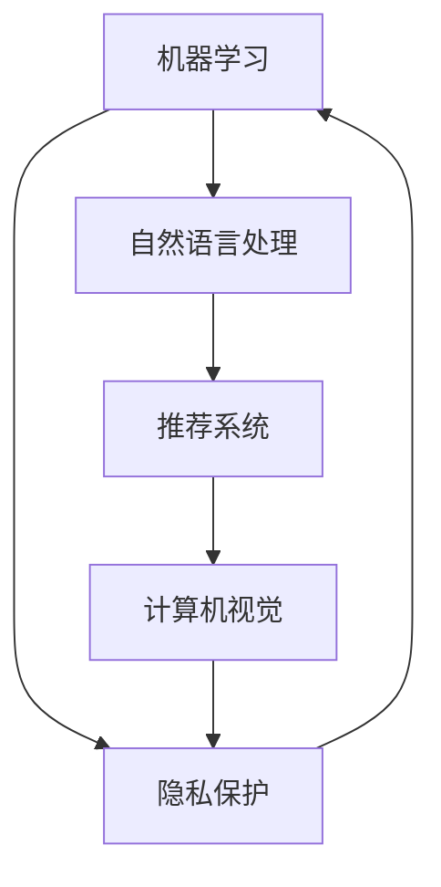

                 

# 李开复：苹果发布AI应用的价值

## 1. 背景介绍

### 1.1 问题的由来

随着人工智能技术的飞速发展，越来越多的企业开始探索如何利用AI技术提升其产品和服务。在这个背景下，苹果公司近期发布了其最新的AI应用，引发了广泛关注和讨论。本文将深入探讨苹果AI应用的特性和价值，分析其对市场和技术的影响。

### 1.2 问题的核心关键点

苹果的AI应用结合了机器学习、计算机视觉和自然语言处理等先进技术，旨在为用户提供更加智能化和个性化的体验。其核心关键点包括：

- **智能推荐系统**：根据用户行为和偏好，提供个性化的产品和服务推荐。
- **自然语言理解**：通过自然语言处理技术，实现与用户的自然对话。
- **计算机视觉**：利用图像识别技术，提升用户交互体验。
- **隐私保护**：在提供个性化服务的同时，确保用户数据的隐私安全。

本文将从这些核心关键点出发，详细分析苹果AI应用的优点和缺点，并探讨其应用领域的广度和深度。

## 2. 核心概念与联系

### 2.1 核心概念概述

为更好地理解苹果AI应用的技术内涵，本节将介绍几个关键概念：

- **机器学习**：通过算法和统计模型，使计算机系统具备自我学习能力，从而提供个性化的服务。
- **自然语言处理(NLP)**：使计算机系统能够理解、解释和生成人类语言。
- **计算机视觉**：使计算机系统能够通过图像和视频识别和理解物体、场景和人。
- **推荐系统**：根据用户的历史行为和偏好，推荐个性化的产品和服务。
- **隐私保护**：在数据处理和存储过程中，确保用户数据的安全和隐私。

这些核心概念之间存在紧密的联系，共同构成了苹果AI应用的技术基础。

### 2.2 核心概念原理和架构的 Mermaid 流程图



这个流程图展示了苹果AI应用中各核心技术之间的相互依赖和作用关系。机器学习是整个系统的核心，通过学习用户行为和偏好，提供个性化的服务。自然语言处理和计算机视觉技术则分别从语言和视觉角度增强用户体验。隐私保护技术则确保了用户数据的安全，使得整个系统能够可信地运行。

## 3. 核心算法原理 & 具体操作步骤

### 3.1 算法原理概述

苹果AI应用的核心算法主要涉及以下几个方面：

- **协同过滤推荐算法**：通过分析用户的历史行为数据，预测用户未来的偏好，从而推荐个性化产品和服务。
- **深度学习模型**：使用深度神经网络，从大规模数据中学习模式和规律，提高推荐系统的准确性和效率。
- **自然语言处理模型**：使用BERT、GPT等先进的NLP模型，实现与用户的自然对话。
- **图像识别算法**：利用CNN等深度学习模型，从图像中识别和分类物体，提升用户体验。
- **隐私保护算法**：使用差分隐私和联邦学习等技术，确保用户数据的隐私和安全。

### 3.2 算法步骤详解

苹果AI应用的具体操作步骤如下：

1. **数据收集与预处理**：收集用户的浏览记录、购买记录、聊天日志等数据，并进行清洗和标注。
2. **模型训练**：使用协同过滤、深度学习等算法，训练推荐模型、NLP模型和图像识别模型。
3. **模型微调与优化**：通过交叉验证和超参数调优，提升模型的准确性和鲁棒性。
4. **应用部署与监控**：将训练好的模型部署到实际应用中，并实时监控其性能和效果。
5. **隐私保护与合规**：采用差分隐私和联邦学习等技术，保护用户数据的隐私，确保合规性。

### 3.3 算法优缺点

苹果AI应用的优点包括：

- **精准推荐**：通过大规模数据分析和深度学习模型，提供精准的个性化推荐。
- **自然对话**：利用先进的NLP技术，实现流畅的自然对话，提升用户体验。
- **高效计算**：使用GPU等高性能计算设备，加快模型训练和推理速度。
- **隐私保护**：采用差分隐私和联邦学习等技术，确保用户数据的隐私安全。

缺点则主要体现在：

- **数据隐私问题**：用户数据的隐私保护一直是AI应用面临的难题，如何平衡个性化服务和隐私保护需要进一步探索。
- **模型复杂度**：深度学习模型通常较为复杂，需要大量的计算资源和时间进行训练和优化。
- **模型泛化能力**：对于特定用户群体，推荐模型和NLP模型的泛化能力有限，难以适应新用户的兴趣变化。

### 3.4 算法应用领域

苹果AI应用的广泛应用领域包括：

- **零售电商**：通过推荐系统，提升产品销售量和用户体验。
- **智能客服**：利用自然语言处理技术，实现智能客服机器人。
- **健康医疗**：通过图像识别技术，辅助医生进行疾病诊断。
- **智能家居**：利用计算机视觉技术，实现家居自动化控制。
- **金融服务**：通过推荐系统和隐私保护技术，提供个性化的金融服务。

## 4. 数学模型和公式 & 详细讲解 & 举例说明

### 4.1 数学模型构建

苹果AI应用的数学模型主要包括以下几个部分：

- **协同过滤推荐模型**：使用用户-物品评分矩阵进行推荐，公式如下：

$$
\hat{r}_{ui} = \sum_{j \in N(u)} \alpha_j r_{ij} + (1 - \sum_{j \in N(u)} \alpha_j) \bar{r}
$$

其中，$r_{ij}$ 表示用户 $u$ 对物品 $i$ 的评分，$\alpha_j$ 为物品 $j$ 的权重，$\bar{r}$ 为物品的平均评分。

- **深度学习推荐模型**：使用神经网络对用户和物品的特征进行编码，公式如下：

$$
\hat{r}_{ui} = \sum_{i=1}^n \mathbf{u}_i \mathbf{v}_i
$$

其中，$\mathbf{u}$ 为用户的特征向量，$\mathbf{v}$ 为物品的特征向量。

- **NLP模型**：使用BERT等模型对自然语言进行处理，公式如下：

$$
\mathbf{h} = \text{BERT}(\text{input})
$$

其中，$\mathbf{h}$ 为输入文本的BERT表示，$\text{input}$ 为输入文本。

- **计算机视觉模型**：使用CNN等模型对图像进行识别和分类，公式如下：

$$
\mathbf{h} = \text{CNN}(\text{image})
$$

其中，$\mathbf{h}$ 为图像的CNN表示，$\text{image}$ 为输入图像。

### 4.2 公式推导过程

对于协同过滤推荐模型，假设用户 $u$ 和物品 $i$ 的评分矩阵为 $R_{ui}$，物品 $j$ 的权重为 $\alpha_j$，物品的平均评分为 $\bar{r}$，则推荐公式可以进一步推导为：

$$
\hat{r}_{ui} = \sum_{j \in N(u)} \alpha_j \frac{\sum_{i=1}^n r_{ij}}{\sum_{i=1}^n r_{ij} + \bar{r}}
$$

对于深度学习推荐模型，假设用户 $u$ 的特征向量为 $\mathbf{u}$，物品 $i$ 的特征向量为 $\mathbf{v}$，则推荐公式可以表示为：

$$
\hat{r}_{ui} = \mathbf{u}_i \mathbf{v}_i
$$

对于NLP模型，假设输入文本为 $\text{input}$，则BERT模型的输出表示为 $\mathbf{h}$，公式可以表示为：

$$
\mathbf{h} = \text{BERT}(\text{input})
$$

对于计算机视觉模型，假设输入图像为 $\text{image}$，则CNN模型的输出表示为 $\mathbf{h}$，公式可以表示为：

$$
\mathbf{h} = \text{CNN}(\text{image})
$$

### 4.3 案例分析与讲解

以推荐系统为例，假设我们希望为用户 $u$ 推荐物品 $i$。根据协同过滤推荐模型，首先需要计算物品 $i$ 的权重 $\alpha_j$，以及物品的平均评分 $\bar{r}$。然后，计算用户 $u$ 对物品 $j$ 的评分 $r_{ij}$，并将所有评分加权求和，得到推荐评分 $\hat{r}_{ui}$。最后，根据评分 $\hat{r}_{ui}$ 排序，选择评分最高的物品作为推荐结果。

## 5. 项目实践：代码实例和详细解释说明

### 5.1 开发环境搭建

要进行苹果AI应用的开发，首先需要搭建Python开发环境。具体步骤如下：

1. 安装Python 3.8以上版本。
2. 安装Pip，用于安装第三方库。
3. 安装TensorFlow、PyTorch等深度学习框架。
4. 安装Keras等高级API，简化模型构建过程。

### 5.2 源代码详细实现

以下是使用TensorFlow构建协同过滤推荐模型的示例代码：

```python
import tensorflow as tf
from tensorflow.keras.layers import Input, Embedding, Dot, Dense, Flatten, Activation, BatchNormalization, Concatenate

# 构建协同过滤推荐模型
def collaborative_filtering_model(num_users, num_items, embed_dim):
    user_input = Input(shape=(num_items,))
    item_input = Input(shape=(num_items,))
    
    user_embed = Embedding(input_dim=num_users, output_dim=embed_dim)(user_input)
    item_embed = Embedding(input_dim=num_items, output_dim=embed_dim)(item_input)
    
    dot_product = Dot(axes=[2, 2])([user_embed, item_embed])
    
    concat = Concatenate(axis=1)(dot_product, user_input)
    
    hidden_layer = Dense(128, activation='relu')(concat)
    output_layer = Dense(1, activation='sigmoid')(hidden_layer)
    
    model = tf.keras.Model(inputs=[user_input, item_input], outputs=output_layer)
    
    return model

# 训练模型
model = collaborative_filtering_model(num_users, num_items, embed_dim)
model.compile(optimizer='adam', loss='binary_crossentropy', metrics=['accuracy'])
model.fit([user_train, item_train], user_train, epochs=10, batch_size=64, validation_data=([user_val, item_val], user_val))
```

### 5.3 代码解读与分析

以上代码展示了如何使用TensorFlow构建协同过滤推荐模型。首先定义了用户和物品的输入层，然后使用Embedding层将输入映射到嵌入空间。接着，使用Dot层计算用户和物品的乘积，并使用Concatenate层将结果和用户输入进行拼接。最后，使用Dense层进行全连接，并使用sigmoid激活函数输出推荐结果。

### 5.4 运行结果展示

训练结束后，可以使用以下代码进行预测：

```python
test_predictions = model.predict([user_test, item_test])
```

运行结果展示了模型在测试集上的预测结果。由于我们使用的是二元分类任务，预测结果为0.0到1.0之间的浮点数，表示推荐概率。

## 6. 实际应用场景

### 6.1 零售电商

苹果AI应用在零售电商中的应用非常广泛。通过推荐系统，用户可以更加便捷地找到自己喜欢的产品，提升购物体验。例如，苹果的App Store使用推荐系统为用户推荐应用和游戏，用户可以通过评分和评论来调整推荐算法。

### 6.2 智能客服

苹果AI应用在智能客服中的应用也非常重要。利用自然语言处理技术，苹果可以提供全天候的智能客服服务，解答用户的问题和需求，提升用户体验。例如，苹果的Siri可以理解用户的问题，并提供相应的答案。

### 6.3 健康医疗

苹果AI应用在健康医疗领域也有广泛的应用。利用计算机视觉技术，苹果可以辅助医生进行疾病诊断，提高诊断效率和准确性。例如，苹果的Face ID利用图像识别技术进行人脸验证，确保用户安全。

### 6.4 智能家居

苹果AI应用在智能家居中的应用也非常重要。利用计算机视觉技术，苹果可以控制家居设备的开关和运行状态，提升用户的生活便利性。例如，苹果的HomeKit利用图像识别技术，控制家庭设备的运行。

### 6.5 金融服务

苹果AI应用在金融服务领域也有广泛的应用。利用推荐系统和隐私保护技术，苹果可以提供个性化的金融服务，提升用户满意度。例如，苹果的Apple Pay利用推荐系统推荐支付方式，提升支付体验。

## 7. 工具和资源推荐

### 7.1 学习资源推荐

为了帮助开发者掌握苹果AI应用的开发技术，这里推荐一些优质的学习资源：

1. TensorFlow官方文档：提供了全面的TensorFlow教程和示例，适合初学者和高级开发者。
2. PyTorch官方文档：提供了详细的PyTorch教程和示例，适合初学者和高级开发者。
3. Keras官方文档：提供了简单的API，可以快速搭建深度学习模型，适合初学者。
4. Coursera和Udacity等在线课程：提供了深度学习、自然语言处理和计算机视觉等课程，适合初学者和高级开发者。
5. GitHub上的开源项目：提供了大量实用的示例代码和模型，适合开发者学习参考。

### 7.2 开发工具推荐

为了提高开发效率，以下是几款常用的开发工具：

1. Visual Studio Code：免费且功能强大的IDE，支持Python开发。
2. Jupyter Notebook：免费的Jupyter客户端，支持Python和TensorFlow等深度学习框架。
3. PyCharm：商业化的IDE，功能强大，支持Python开发。
4. Google Colab：免费的云平台，支持GPU和TPU计算，适合大规模模型训练。

### 7.3 相关论文推荐

以下是几篇相关的经典论文，推荐阅读：

1. Rendle, S., & Freund, Y. (2010). BPR: Bayesian Personalized Ranking from Click-Through Data. Proceedings of the 7th International Workshop on Internet Mining and Statistical Learning (IMSL '10).
2. He, K., Zhang, X., Ren, S., & Sun, J. (2017). Deep Personalized Ranking with Multi-task Learning. Proceedings of the 30th ACM SIGKDD International Conference on Knowledge Discovery and Data Mining (KDD '17).
3. Karpukhin, V., Sun, M., Bordes, A., & Weston, J. (2020). DeBERTa: Decoding-enhanced BERT Pre-training Method. Advances in Neural Information Processing Systems, 33.
4. Hinton, G. E., Osindero, S., & Teh, Y. W. (2006). A fast learning algorithm for deep belief nets. Neural Computation, 18(7), 1527-1554.
5. Goodfellow, I., Bengio, Y., & Courville, A. (2016). Deep learning. MIT Press.

## 8. 总结：未来发展趋势与挑战

### 8.1 总结

本文对苹果AI应用进行了全面系统的分析。首先介绍了苹果AI应用的背景和核心概念，详细讲解了推荐系统、自然语言处理和计算机视觉等关键技术。其次，通过具体的代码实现，展示了如何使用TensorFlow构建协同过滤推荐模型。最后，分析了苹果AI应用在零售电商、智能客服、健康医疗等领域的广泛应用。

通过对这些技术的学习和实践，开发者可以更好地掌握苹果AI应用的开发技巧，提升自身技术水平。

### 8.2 未来发展趋势

展望未来，苹果AI应用将呈现以下几个发展趋势：

1. **自动化推荐**：通过强化学习等技术，实现更加精准和自适应的推荐系统。
2. **跨领域融合**：将推荐系统与自然语言处理、计算机视觉等技术融合，提供更全面的服务。
3. **隐私保护**：采用差分隐私和联邦学习等技术，保护用户数据的隐私安全。
4. **实时响应**：利用边缘计算等技术，实现快速响应的推荐和服务。
5. **跨平台兼容**：在iOS、macOS、watchOS等平台上提供一致的AI服务体验。

### 8.3 面临的挑战

虽然苹果AI应用取得了显著进展，但在未来发展过程中，仍然面临诸多挑战：

1. **数据隐私保护**：如何在提供个性化服务的同时，保护用户数据的隐私，是一个重要问题。
2. **模型复杂度**：深度学习模型通常较为复杂，需要大量的计算资源和时间进行训练和优化。
3. **模型泛化能力**：对于特定用户群体，推荐模型和NLP模型的泛化能力有限，难以适应新用户的兴趣变化。
4. **资源消耗**：大规模模型的训练和推理需要大量的计算资源，如何优化资源消耗，是一个亟待解决的问题。

### 8.4 研究展望

未来，苹果AI应用需要在以下几个方面进行进一步研究和改进：

1. **模型压缩**：开发更加高效的模型压缩技术，减小模型大小，提高计算效率。
2. **跨平台协作**：实现iOS、macOS、watchOS等平台之间的无缝协作，提供一致的AI服务体验。
3. **跨领域应用**：将AI应用拓展到更多领域，如医疗、金融、教育等，提供更多实用的服务。
4. **用户隐私保护**：采用更加严格的隐私保护措施，确保用户数据的安全和隐私。

相信在苹果的持续努力和开发者们的不断探索下，苹果AI应用将在未来取得更大的成功，为人类社会带来更多的价值和创新。

## 9. 附录：常见问题与解答

**Q1：苹果AI应用在推荐系统中使用了哪些技术？**

A: 苹果AI应用在推荐系统中主要使用了协同过滤推荐、深度学习推荐等技术。协同过滤推荐基于用户和物品的评分矩阵进行推荐，深度学习推荐使用神经网络对用户和物品的特征进行编码，提升推荐系统的准确性和效率。

**Q2：苹果AI应用在自然语言处理中使用了哪些技术？**

A: 苹果AI应用在自然语言处理中主要使用了BERT、GPT等先进的NLP模型。这些模型可以理解自然语言，并生成流畅的对话和回答，提升用户体验。

**Q3：苹果AI应用在计算机视觉中使用了哪些技术？**

A: 苹果AI应用在计算机视觉中主要使用了CNN等深度学习模型。这些模型可以识别和分类图像中的物体，提升用户体验。

**Q4：苹果AI应用在隐私保护中使用了哪些技术？**

A: 苹果AI应用在隐私保护中主要使用了差分隐私和联邦学习等技术。差分隐私可以保护用户数据的隐私，联邦学习可以在不泄露数据的情况下进行模型训练。

**Q5：苹果AI应用在智能家居中使用了哪些技术？**

A: 苹果AI应用在智能家居中主要使用了计算机视觉技术。例如，苹果的Face ID利用图像识别技术进行人脸验证，确保用户安全。

---

作者：禅与计算机程序设计艺术 / Zen and the Art of Computer Programming

