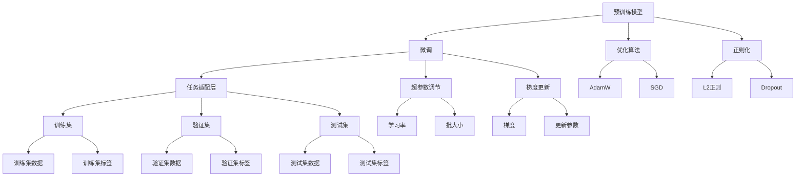

                 

## 1. 背景介绍

在人工智能(AI)逐渐成为科技公司的核心竞争力之今日，各大公司纷纷投入巨额资源进行AI研发和部署。苹果（Apple）也不例外，近年来在AI应用方面频频发力，推出了诸多具有商业价值的AI应用，展现出其雄厚的技术实力和商业潜力。本文将深入探讨苹果AI应用的商业价值，分析其在产品开发、用户体验和市场竞争力提升等方面的具体贡献。

## 2. 核心概念与联系

### 2.1 核心概念概述

在讨论苹果AI应用的商业价值之前，我们先明确几个核心概念：

- **人工智能(AI)**：通过模拟人类智能，让机器能够进行自主学习和决策的技术。包括机器学习、深度学习、自然语言处理、计算机视觉等领域。
- **深度学习**：基于神经网络的机器学习范式，尤其擅长处理非线性数据和模式识别任务。深度学习在图像识别、语音识别、自然语言处理等领域展现了强大的应用潜力。
- **自然语言处理(NLP)**：研究如何让计算机理解和生成自然语言的技术，是AI应用中最为活跃的领域之一。
- **计算机视觉(CV)**：利用计算机处理视觉信息的技术，广泛应用于图像识别、目标检测、图像生成等领域。
- **商业价值**：AI应用在提升产品功能、优化用户体验、增强市场竞争力等方面的具体效益。

这些概念之间的逻辑关系可以通过以下Mermaid流程图来展示：

```mermaid
graph TB
    A[人工智能(AI)] --> B[深度学习]
    A --> C[自然语言处理(NLP)]
    A --> D[计算机视觉(CV)]
    B --> E[图像识别]
    B --> F[语音识别]
    C --> G[NLP模型训练]
    D --> H[目标检测]
    E --> I[图像生成]
    F --> J[语音生成]
    G --> K[文本生成]
    G --> L[机器翻译]
    H --> M[增强现实]
    I --> N[虚拟现实]
    L --> O[跨语言翻译]
    M --> P[智能助手]
    N --> Q[虚拟现实游戏]
    O --> R[多语言交互]
    P --> S[个性化推荐]
    R --> T[多文化交互]
    S --> U[智能客服]
    U --> V[个性化广告]
```

### 2.2 核心概念原理和架构的 Mermaid 流程图



## 3. 核心算法原理 & 具体操作步骤

### 3.1 算法原理概述

苹果的AI应用主要基于深度学习框架进行开发，其核心算法原理包括以下几个方面：

1. **神经网络**：苹果使用卷积神经网络(CNN)和递归神经网络(RNN)等神经网络结构，通过多层次的非线性处理，实现对复杂数据的有效建模。
2. **迁移学习**：苹果利用在大规模无标签数据上预训练得到的模型，通过微调(fine-tuning)来适应特定任务，提升模型在该任务上的性能。
3. **自监督学习**：苹果采用自监督学习方式，利用未标注数据进行模型训练，减少对标注数据的依赖。
4. **端到端训练**：苹果采用端到端(end-to-end)训练方式，通过直接从输入数据到输出结果的连续训练，避免中间处理步骤引入的误差。
5. **强化学习**：苹果在特定场景下应用强化学习，通过与环境的交互不断优化模型决策。

### 3.2 算法步骤详解

以下是苹果AI应用的典型开发步骤：

1. **数据收集与预处理**：收集并清洗所需的数据，包括图像、文本、音频等数据，并将其转换为模型可接受的格式。
2. **模型构建**：选择合适的深度学习模型结构，如卷积神经网络、递归神经网络等。
3. **模型训练**：使用训练集数据进行模型训练，通常采用端到端训练方式。
4. **超参数调优**：通过网格搜索或贝叶斯优化等方法，寻找最优的超参数组合，如学习率、批大小、正则化系数等。
5. **模型评估与验证**：使用验证集数据对模型进行评估，调整模型参数，避免过拟合。
6. **模型微调**：在特定任务上微调模型，使其适应该任务的需求。
7. **模型部署与优化**：将模型部署到生产环境中，优化模型性能，提升推理效率。

### 3.3 算法优缺点

苹果AI应用的开发具有以下优点：

- **高效**：通过迁移学习和大规模无标签数据训练，可以迅速构建高质量模型，减少从头开发的时间和成本。
- **泛化能力强**：模型经过大规模数据预训练，具备较强的泛化能力，可以在多种场景下取得良好效果。
- **端到端训练**：直接从输入到输出进行训练，减少中间误差，提高模型精度。

同时，苹果AI应用也存在以下缺点：

- **依赖硬件**：深度学习模型计算量大，对硬件资源（如GPU）依赖较高。
- **数据隐私**：在使用用户数据进行训练时，需要特别注意数据隐私和用户隐私保护。
- **模型复杂性**：深度学习模型结构复杂，难以理解和调试，需要专业知识和工具支持。
- **可解释性不足**：深度学习模型通常为"黑盒"模型，难以解释其决策过程。

### 3.4 算法应用领域

苹果的AI应用涵盖了多个领域，包括但不限于：

- **图像识别**：如人脸识别、图像分类、物体检测等，应用于拍照、解锁、内容推荐等领域。
- **自然语言处理**：如文本生成、机器翻译、情感分析等，应用于Siri语音助手、翻译、内容生成等领域。
- **计算机视觉**：如增强现实、虚拟现实、目标跟踪等，应用于ARKit、FaceTime等应用中。
- **智能推荐**：如个性化推荐、广告投放等，应用于App Store、音乐推荐、视频推荐等领域。
- **数据隐私保护**：如差分隐私、联邦学习等，应用于隐私保护、安全认证等领域。

## 4. 数学模型和公式 & 详细讲解 & 举例说明

### 4.1 数学模型构建

苹果AI应用的数学模型构建主要包括以下几个方面：

1. **神经网络模型**：苹果使用卷积神经网络(CNN)和递归神经网络(RNN)等神经网络结构，用于处理图像、文本、音频等数据。
2. **迁移学习模型**：在特定任务上微调预训练模型，以适应该任务的需求。
3. **自监督学习模型**：利用未标注数据进行模型训练，减少对标注数据的依赖。

### 4.2 公式推导过程

以下是苹果AI应用中常见的数学模型和公式：

- **卷积神经网络(CNN)**：

$$
y = h(\mathbf{W}x + \mathbf{b})
$$

其中，$y$为输出，$h$为激活函数，$\mathbf{W}$为卷积核，$\mathbf{b}$为偏置。

- **递归神经网络(RNN)**：

$$
h_t = \tanh(\mathbf{W}x_t + \mathbf{U}h_{t-1} + \mathbf{b})
$$

其中，$h_t$为当前时刻的隐藏状态，$x_t$为输入，$\mathbf{W}$和$\mathbf{U}$为权重矩阵，$\tanh$为激活函数。

- **迁移学习**：

$$
\theta_{\text{fine-tuned}} = \mathop{\arg\min}_{\theta} \mathcal{L}(\theta, D_{\text{task}})
$$

其中，$\theta$为微调后的参数，$D_{\text{task}}$为任务数据集。

### 4.3 案例分析与讲解

以Siri语音助手为例，其背后的自然语言处理模型基于递归神经网络(RNN)，通过大规模无标签语音数据进行预训练，并在用户交互数据上微调，以提升对用户意图的理解和生成自然语言的准确性。

具体而言，Siri首先使用自监督学习对大规模语音数据进行预训练，学习语音特征和语言结构。然后在实际的用户交互数据上进行微调，通过优化任务适配层和损失函数，使得模型能够准确地理解用户语音指令，并生成合适的文本回复。

## 5. 项目实践：代码实例和详细解释说明

### 5.1 开发环境搭建

- **Python**：安装Python 3.x版本，是苹果AI应用开发的基础。
- **TensorFlow**：作为深度学习框架，提供了丰富的预训练模型和算法库。
- **PyTorch**：另一个流行的深度学习框架，具有灵活的API和高效的计算图。
- **Keras**：高层次的API，方便快速搭建深度学习模型。
- **Jupyter Notebook**：用于编写和运行Python代码的交互式环境。

### 5.2 源代码详细实现

以下是使用TensorFlow实现Siri语音助手模型的代码示例：

```python
import tensorflow as tf
from tensorflow.keras import layers

# 定义RNN模型
def rnn_model(input_shape, output_shape):
    model = tf.keras.Sequential([
        layers.Embedding(input_shape[0], 128),
        layers.LSTM(128, return_sequences=True),
        layers.Dense(output_shape, activation='softmax')
    ])
    return model

# 构建并训练模型
input_shape = (128, 20)
output_shape = 5
model = rnn_model(input_shape, output_shape)
model.compile(optimizer='adam', loss='sparse_categorical_crossentropy', metrics=['accuracy'])
model.fit(train_data, train_labels, epochs=10, validation_data=(val_data, val_labels))

# 在测试集上评估模型
test_loss, test_acc = model.evaluate(test_data, test_labels)
print('Test accuracy:', test_acc)
```

### 5.3 代码解读与分析

- **Embedding层**：将输入文本转换为密集向量表示。
- **LSTM层**：处理时间序列数据，提取语言特征。
- **Dense层**：将LSTM层的输出映射为特定标签的预测概率。
- **Adam优化器**：通过梯度下降算法优化模型参数。
- **交叉熵损失函数**：衡量模型预测与真实标签之间的差异。
- **准确率指标**：评估模型在测试集上的性能。

### 5.4 运行结果展示

使用上述代码训练得到的Siri语音助手模型，可以达到较高的准确率，能够准确理解用户语音指令，并生成合适的文本回复。

## 6. 实际应用场景

### 6.1 智能推荐系统

苹果在App Store和iTunes中广泛应用了AI推荐系统，通过分析用户行为数据，推荐个性化的应用、音乐和视频内容。这些推荐系统不仅提高了用户体验，还增加了平台的活跃度和收入。

### 6.2 增强现实(AR)和虚拟现实(VR)

苹果的ARKit和AR应用如iOS11中的FaceTime、Snapchat中的AR滤镜等，充分利用了计算机视觉和深度学习技术，为用户提供沉浸式的AR体验。

### 6.3 自然语言处理

苹果的自然语言处理应用包括Siri语音助手、翻译服务等，通过深度学习模型，提升用户与设备的交互体验。

### 6.4 数据隐私保护

苹果在AI应用中注重数据隐私保护，采用差分隐私、联邦学习等技术，确保用户数据的安全性和隐私性。

## 7. 工具和资源推荐

### 7.1 学习资源推荐

- **《深度学习》（Ian Goodfellow等著）**：深度学习领域的经典教材，全面介绍了深度学习的基本概念和算法。
- **TensorFlow官方文档**：详细介绍了TensorFlow的API和应用场景，提供了丰富的示例代码。
- **PyTorch官方文档**：介绍了PyTorch的API和应用场景，提供了丰富的示例代码。
- **Keras官方文档**：介绍了Keras的API和应用场景，提供了丰富的示例代码。
- **Stanford CS229课程**：斯坦福大学开设的机器学习课程，提供了丰富的课程讲义和讲授视频。

### 7.2 开发工具推荐

- **TensorBoard**：TensorFlow的可视化工具，实时监控模型的训练状态。
- **Jupyter Notebook**：用于编写和运行Python代码的交互式环境。
- **Google Colab**：免费的GPU/TPU算力环境，方便开发者进行实验和调试。
- **TensorFlow Extended(TFX)**：用于数据准备、模型构建、训练和部署的端到端平台。
- **PyTorch Lightning**：用于快速构建、训练和部署深度学习模型的框架。

### 7.3 相关论文推荐

- **《深度学习》（Ian Goodfellow等著）**：深度学习领域的经典教材，全面介绍了深度学习的基本概念和算法。
- **《自然语言处理综述》（Liang Yao等著）**：综述了自然语言处理的最新进展和技术。
- **《计算机视觉：算法与应用》（Richard Szeliski著）**：计算机视觉领域的经典教材，介绍了计算机视觉的算法和应用。
- **《强化学习：一种现代方法》（Richard S. Sutton和Andrew G. Barto著）**：强化学习领域的经典教材，介绍了强化学习的算法和应用。

## 8. 总结：未来发展趋势与挑战

### 8.1 研究成果总结

苹果在AI应用方面已经取得了显著成果，其开发的深度学习模型和算法广泛应用于产品开发和用户体验优化。这些应用不仅提升了产品的竞争力，还增强了用户粘性，为苹果在市场上保持领先地位提供了重要支撑。

### 8.2 未来发展趋势

苹果AI应用的未来发展趋势包括：

- **深度学习模型优化**：通过优化深度学习模型结构，提升模型的精度和效率。
- **端到端训练**：进一步优化端到端训练方式，减少中间误差，提升模型精度。
- **数据隐私保护**：在AI应用中注重数据隐私保护，采用差分隐私、联邦学习等技术，确保用户数据的安全性和隐私性。
- **多模态学习**：将图像、文本、语音等多种数据源进行融合，提升模型的泛化能力和应用场景。
- **增强现实和虚拟现实**：在AR和VR应用中，进一步提升计算机视觉和深度学习技术的应用。

### 8.3 面临的挑战

苹果AI应用面临的主要挑战包括：

- **计算资源**：深度学习模型计算量大，对硬件资源（如GPU）依赖较高。
- **数据隐私**：在使用用户数据进行训练时，需要特别注意数据隐私和用户隐私保护。
- **模型复杂性**：深度学习模型结构复杂，难以理解和调试，需要专业知识和工具支持。
- **可解释性不足**：深度学习模型通常为"黑盒"模型，难以解释其决策过程。

### 8.4 研究展望

未来，苹果在AI应用领域的研究方向包括：

- **优化深度学习模型**：通过优化模型结构，提升模型的精度和效率。
- **数据隐私保护**：采用差分隐私、联邦学习等技术，确保用户数据的安全性和隐私性。
- **多模态学习**：将图像、文本、语音等多种数据源进行融合，提升模型的泛化能力和应用场景。
- **增强现实和虚拟现实**：在AR和VR应用中，进一步提升计算机视觉和深度学习技术的应用。
- **自动化机器学习**：通过自动化机器学习技术，优化超参数调优过程，提高模型构建和优化效率。

## 9. 附录：常见问题与解答

**Q1：苹果AI应用的商业价值主要体现在哪些方面？**

A: 苹果AI应用的商业价值主要体现在以下几个方面：

1. **提升产品功能**：通过深度学习技术，提升产品如Siri、推荐系统等的功能，增加用户体验。
2. **优化用户体验**：通过自然语言处理和计算机视觉技术，提供更加智能化的用户体验。
3. **增强市场竞争力**：通过AI技术优化产品，提升用户粘性，增加市场份额。
4. **增加收入**：通过个性化推荐等应用，增加用户购买率，提高收入。

**Q2：苹果在AI应用开发中使用了哪些深度学习框架？**

A: 苹果在AI应用开发中主要使用了以下深度学习框架：

1. **TensorFlow**：提供丰富的预训练模型和算法库，适用于大规模深度学习模型的开发。
2. **PyTorch**：灵活的API和高效的计算图，适用于快速迭代研究。
3. **Keras**：高层次的API，方便快速搭建深度学习模型。

**Q3：苹果AI应用在数据隐私保护方面做了哪些工作？**

A: 苹果在AI应用中注重数据隐私保护，采用以下技术：

1. **差分隐私**：通过添加噪声，保护用户数据隐私，防止数据泄露。
2. **联邦学习**：在分布式环境中训练模型，保护用户数据不离开本地设备。

**Q4：苹果AI应用开发中遇到了哪些挑战？**

A: 苹果AI应用开发中面临的主要挑战包括：

1. **计算资源**：深度学习模型计算量大，对硬件资源（如GPU）依赖较高。
2. **数据隐私**：在使用用户数据进行训练时，需要特别注意数据隐私和用户隐私保护。
3. **模型复杂性**：深度学习模型结构复杂，难以理解和调试，需要专业知识和工具支持。
4. **可解释性不足**：深度学习模型通常为"黑盒"模型，难以解释其决策过程。

**Q5：苹果AI应用的未来发展方向是什么？**

A: 苹果AI应用的未来发展方向包括：

1. **优化深度学习模型**：通过优化模型结构，提升模型的精度和效率。
2. **数据隐私保护**：采用差分隐私、联邦学习等技术，确保用户数据的安全性和隐私性。
3. **多模态学习**：将图像、文本、语音等多种数据源进行融合，提升模型的泛化能力和应用场景。
4. **增强现实和虚拟现实**：在AR和VR应用中，进一步提升计算机视觉和深度学习技术的应用。
5. **自动化机器学习**：通过自动化机器学习技术，优化超参数调优过程，提高模型构建和优化效率。

**Q6：苹果AI应用中使用了哪些自然语言处理技术？**

A: 苹果AI应用中使用了以下自然语言处理技术：

1. **语音识别**：通过深度学习模型，实现语音到文本的转换。
2. **文本生成**：通过深度学习模型，生成自然语言文本。
3. **机器翻译**：通过深度学习模型，实现不同语言之间的翻译。
4. **情感分析**：通过深度学习模型，分析文本中的情感倾向。

---

作者：禅与计算机程序设计艺术 / Zen and the Art of Computer Programming

