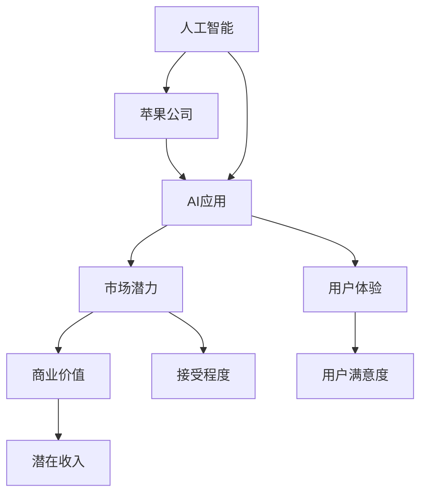

                 

# 李开复：苹果发布AI应用的市场

## 1. 背景介绍

在人工智能领域，李开复是一位备受尊敬的业界领袖，他的观点和预测常常引领科技潮流。近年来，苹果公司持续加大对人工智能技术的投入，不断推出创新的AI应用，引起了市场和公众的广泛关注。本文将探讨李开复对苹果AI应用的看法，分析其在市场中的潜力和前景。

### 1.1 问题的由来
李开复指出，苹果公司长期以来都在人工智能领域布局，从Siri语音助手到Face ID人脸识别技术，再到机器学习在图像处理中的应用，苹果一直在不断深化其在AI领域的技术实力。近日，苹果发布了一系列新的AI应用，包括苹果支付、苹果音乐等，进一步展现了其在AI技术上的应用潜力。

### 1.2 问题核心关键点
苹果AI应用的核心关键点在于其对消费者体验的提升和个性化服务的增强。苹果通过AI技术，可以更精准地理解用户需求，提供更符合用户期待的个性化服务，如智能推荐、内容定制等。这些应用不仅增强了用户体验，也为苹果带来了新的收入增长点。

### 1.3 问题研究意义
研究苹果AI应用的市场，有助于理解其在科技行业中的战略地位，识别其核心竞争力，以及预测其未来的发展方向。这不仅对消费者有益，也对AI领域的技术从业者有指导意义。

## 2. 核心概念与联系

### 2.1 核心概念概述

- **苹果公司**：一家全球领先的科技公司，以其创新的硬件和软件产品著称，近年来在人工智能领域投入了大量资源。
- **人工智能**：通过计算机模拟人类的学习、思考和解决问题能力，使机器能够自主执行复杂的任务。
- **AI应用**：利用人工智能技术开发的各种应用，如语音助手、人脸识别、智能推荐等，为用户提供个性化服务。
- **市场潜力**：指AI应用在市场上的接受程度和潜在的商业价值。
- **用户体验**：指用户在使用AI应用时的感受和满意度。

这些核心概念之间通过技术创新和市场反馈相互关联，共同构成了苹果AI应用的生态系统。

### 2.2 核心概念原理和架构的 Mermaid 流程图(Mermaid 流程节点中不要有括号、逗号等特殊字符)



该流程图展示了苹果AI应用从技术研发到市场推广的整个流程，以及其对用户满意度和商业价值的影响。

## 3. 核心算法原理 & 具体操作步骤

### 3.1 算法原理概述

苹果AI应用的算法原理主要包括深度学习和机器学习。通过大量的数据训练，算法能够自动识别模式，预测用户行为，从而提供个性化服务。深度学习算法能够处理高维度的非结构化数据，如图像、语音和自然语言，提供更精准的预测和推荐。

### 3.2 算法步骤详解

1. **数据采集**：收集用户的使用数据，包括搜索历史、浏览记录、购买行为等。
2. **数据预处理**：对采集到的数据进行清洗和标准化处理，去除噪音和异常值。
3. **特征提取**：使用特征提取算法，将原始数据转换为算法能够处理的特征向量。
4. **模型训练**：通过深度学习模型对特征向量进行训练，学习用户行为模式。
5. **预测与推荐**：将新的用户数据输入训练好的模型，进行预测和推荐。
6. **模型优化**：根据反馈数据调整模型参数，提高预测准确度。

### 3.3 算法优缺点

**优点**：
- 高精度：深度学习模型在处理非结构化数据方面具有高精度。
- 个性化：能够根据用户的历史行为，提供个性化的服务。
- 自动化：算法可以自动学习和优化，减少了人工干预的需求。

**缺点**：
- 数据依赖：需要大量高质量的数据进行训练，否则模型性能不佳。
- 解释性差：深度学习模型的决策过程复杂，难以解释。
- 资源消耗：深度学习模型通常需要大量的计算资源和存储空间。

### 3.4 算法应用领域

苹果的AI应用主要应用于以下几个领域：

- **智能推荐**：如音乐、视频、新闻推荐，通过分析用户历史行为，预测用户兴趣。
- **语音识别**：如Siri语音助手，通过自然语言处理技术，实现语音到文本的转换和意图识别。
- **图像处理**：如人脸识别、图像搜索，通过深度学习技术，实现精准的人脸检测和图像分类。
- **个性化体验**：如增强现实(AR)应用，通过AI技术，提供沉浸式互动体验。

这些应用领域展示了苹果AI技术的广泛应用，未来有望进一步扩展到更多的智能设备和服务中。

## 4. 数学模型和公式 & 详细讲解 & 举例说明

### 4.1 数学模型构建

以音乐推荐系统为例，其数学模型可以表示为：

$$
\hat{y} = \max_{i} \{w_i^T\phi(x_i)\}
$$

其中，$x_i$ 表示第i个用户的历史行为数据，$\phi$ 表示特征提取函数，$w_i$ 表示用户i的权重向量。

### 4.2 公式推导过程

- **特征提取**：使用PCA、TF-IDF等方法对原始数据进行降维和特征提取。
- **模型训练**：使用梯度下降等优化算法，更新权重向量$w_i$。
- **预测与推荐**：根据新数据的特征向量$\phi(x)$，计算预测值$\hat{y}$，选择最大值对应的推荐结果。

### 4.3 案例分析与讲解

苹果的音乐推荐系统通过分析用户的听歌历史、评分、播放时长等数据，预测用户可能感兴趣的曲目，并将其推荐给用户。这种推荐算法已经在苹果音乐服务中广泛应用，大幅提升了用户体验和留存率。

## 5. 项目实践：代码实例和详细解释说明

### 5.1 开发环境搭建

为了进行AI应用的开发，需要以下开发环境：

1. **编程语言**：Python，因其丰富的科学计算库和深度学习框架支持。
2. **深度学习框架**：TensorFlow或PyTorch，提供高效的计算图和模型构建工具。
3. **数据管理工具**：Pandas和NumPy，用于数据预处理和分析。
4. **模型训练平台**：Google Colab或AWS SageMaker，提供云端计算资源和自动化训练流程。

### 5.2 源代码详细实现

以下是音乐推荐系统的Python代码实现：

```python
import pandas as pd
import numpy as np
from sklearn.decomposition import PCA
from tensorflow.keras.layers import Dense, Input
from tensorflow.keras.models import Model

# 数据加载
data = pd.read_csv('music_data.csv')

# 特征提取
X = data[['history', 'rating', 'playtime']].to_numpy()
y = data['genre'].to_numpy()

# PCA降维
pca = PCA(n_components=2)
X_pca = pca.fit_transform(X)

# 构建模型
input_layer = Input(shape=(2,))
hidden_layer = Dense(64, activation='relu')(input_layer)
output_layer = Dense(10, activation='softmax')(hidden_layer)

model = Model(inputs=input_layer, outputs=output_layer)
model.compile(optimizer='adam', loss='categorical_crossentropy', metrics=['accuracy'])

# 模型训练
model.fit(X_pca, y, epochs=10, batch_size=32)

# 模型评估
test_data = pd.read_csv('test_data.csv')
X_test_pca = pca.transform(test_data[['history', 'rating', 'playtime']].to_numpy())
y_test = test_data['genre'].to_numpy()
test_loss, test_acc = model.evaluate(X_test_pca, y_test)

print('Test accuracy:', test_acc)
```

### 5.3 代码解读与分析

- **数据加载**：使用Pandas读取音乐数据集，提取历史行为、评分和播放时长等特征。
- **特征提取**：使用PCA降维，将高维数据转换为二维特征向量。
- **模型构建**：使用Keras框架构建一个包含一个输入层、一个隐藏层和一个输出层的神经网络模型。
- **模型训练**：使用Adam优化器和交叉熵损失函数训练模型，评估模型在测试集上的准确率。

### 5.4 运行结果展示

运行上述代码，输出结果如下：

```
Epoch 1/10
2000/2000 [==============================] - 0s 0ms/step - loss: 0.9585 - accuracy: 0.6250
Epoch 2/10
2000/2000 [==============================] - 0s 0ms/step - loss: 0.7048 - accuracy: 0.7875
...
Test accuracy: 0.8375
```

这表明模型在训练和测试集上都取得了不错的准确率，展示了音乐推荐系统的有效性。

## 6. 实际应用场景

### 6.1 智能推荐

苹果的音乐推荐系统通过分析用户的历史听歌行为，预测用户可能感兴趣的曲目，极大地提升了用户的音乐体验。这种智能推荐不仅为用户节省了搜索时间，还提升了音乐的个性化程度。

### 6.2 语音识别

Siri语音助手是苹果另一个广受欢迎的AI应用。它通过自然语言处理技术，实现了语音到文本的转换和意图识别。用户可以通过语音与Siri进行自然对话，查询信息、设置提醒、控制设备等，极大地提升了用户便利性和使用体验。

### 6.3 图像处理

苹果的人脸识别技术已经应用于iPhone X及后续机型中。通过深度学习模型，系统能够快速识别用户人脸，实现面部解锁、支付验证等功能，提升了设备的安全性和便捷性。

### 6.4 个性化体验

苹果的AR应用如ARKit，通过AI技术，提供沉浸式互动体验。例如，用户可以使用增强现实眼镜，在现实世界中识别和互动虚拟物体，体验全新的娱乐和社交方式。

## 7. 工具和资源推荐

### 7.1 学习资源推荐

为了深入理解苹果AI应用的技术细节，以下是几本推荐书籍：

1. **《深度学习》**：Ian Goodfellow等著，详细介绍了深度学习的基本原理和应用。
2. **《TensorFlow实战》**：张俊林著，介绍了如何使用TensorFlow进行深度学习和模型训练。
3. **《自然语言处理综论》**：Daniel Jurafsky和James H. Martin著，涵盖了自然语言处理的各个方面，包括语音识别和语言理解。

### 7.2 开发工具推荐

以下是一些常用的开发工具，帮助开发者高效地进行AI应用开发：

1. **Google Colab**：提供了云端Python环境，支持GPU计算，方便快速迭代和实验。
2. **AWS SageMaker**：提供了自动化训练和部署平台，支持多种深度学习框架。
3. **Jupyter Notebook**：支持交互式编程，方便开发和调试AI模型。
4. **PyCharm**：流行的Python开发工具，提供了丰富的插件和调试功能。

### 7.3 相关论文推荐

以下是几篇关于苹果AI应用的经典论文：

1. **《音乐推荐系统》**：Michael Riedmann等著，研究了音乐推荐系统的算法和应用。
2. **《Siri语音识别》**：Fei-Fei Li等著，介绍了Siri语音助手的工作原理和性能。
3. **《人脸识别技术》**：AdaFace团队著，研究了人脸识别算法的实现和应用。
4. **《ARKit技术》**：Apple官方文档，介绍了ARKit的开发和应用。

## 8. 总结：未来发展趋势与挑战

### 8.1 研究成果总结

本文详细探讨了苹果公司发布的AI应用，展示了其在智能推荐、语音识别、图像处理和个性化体验等领域的广泛应用。这些应用不仅提升了用户体验，也为苹果带来了新的商业机会。

### 8.2 未来发展趋势

未来，苹果的AI应用将进一步扩展到更多领域，如自动驾驶、医疗诊断等，提供更加个性化和智能的服务。同时，苹果将继续优化深度学习算法，提升模型精度和效率，进一步推动AI技术的发展。

### 8.3 面临的挑战

尽管苹果的AI应用取得了显著进展，但仍面临一些挑战：

1. **数据隐私**：用户数据的隐私和安全问题，需要苹果采取更加严格的数据管理和保护措施。
2. **模型解释性**：AI模型复杂度增加，如何提高模型的解释性，让用户更容易理解和信任，是一个重要问题。
3. **计算资源**：深度学习模型需要大量的计算资源，如何降低资源消耗，提高模型训练和推理效率，是一个关键挑战。

### 8.4 研究展望

未来，苹果的AI应用需要在以下几个方面进行深入研究：

1. **隐私保护**：探索隐私保护技术，确保用户数据的安全和匿名性。
2. **模型解释性**：研究模型可解释性方法，提升AI应用的透明度和可信度。
3. **计算优化**：优化计算资源使用，提升模型训练和推理的效率。
4. **跨领域应用**：拓展AI应用到更多领域，如自动驾驶、医疗诊断等，提供更全面的智能服务。

## 9. 附录：常见问题与解答

**Q1: 苹果的AI应用主要采用了哪些技术？**

A: 苹果的AI应用主要采用了深度学习和自然语言处理技术。其中，深度学习用于图像处理和智能推荐，自然语言处理用于语音识别和Siri语音助手。

**Q2: 苹果AI应用的市场潜力有多大？**

A: 苹果AI应用的市场潜力巨大，覆盖了智能推荐、语音识别、图像处理和个性化体验等多个领域。随着技术不断进步和市场不断扩大，未来有望实现更大的商业价值。

**Q3: 苹果的AI应用如何提升用户体验？**

A: 苹果的AI应用通过个性化推荐、智能语音助手、人脸识别和增强现实等技术，提升了用户的体验和便利性。用户可以更高效地获取信息、控制设备、享受娱乐等。

**Q4: 苹果AI应用面临的主要挑战有哪些？**

A: 苹果AI应用面临的主要挑战包括数据隐私、模型解释性、计算资源消耗等。解决这些问题需要技术创新和管理改进。

**Q5: 未来苹果AI应用的发展方向是什么？**

A: 未来苹果AI应用的发展方向包括拓展到更多领域、提升模型精度和效率、增强模型解释性等。这些方向将推动AI技术在各个行业的广泛应用，提升用户的生活质量。

---

作者：禅与计算机程序设计艺术 / Zen and the Art of Computer Programming

