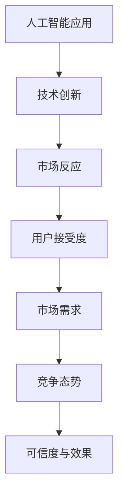

                 

# 李开复：苹果发布AI应用的市场反应

> 关键词：苹果, AI应用, 市场反应, 技术创新, 人工智能, 用户接受度

## 1. 背景介绍

### 1.1 问题由来
苹果公司在2023年发布了其最新的人工智能应用"Apple AI"，这一应用旨在通过AI技术提升用户体验，简化操作流程。然而，这一应用发布后，市场反应不一，引起了广泛讨论。一方面，许多人认为AI应用有望带来更佳的用户体验和更高的生产效率；另一方面，也有人对AI技术的可信度和应用效果表示质疑。

### 1.2 问题核心关键点
为了深入理解苹果AI应用的市场反应，需要探讨其技术创新点、用户接受度、市场需求及竞争态势，以及可能存在的挑战。

## 2. 核心概念与联系

### 2.1 核心概念概述

为了更全面地分析苹果AI应用的市场反应，需要理解以下几个核心概念：

- **人工智能应用（AI Application）**：指利用AI技术实现特定功能的软件应用。苹果的"Apple AI"即是一个利用AI技术提升用户体验的应用。

- **技术创新（Technological Innovation）**：指在某一领域内对现有技术的突破和改进。苹果在AI应用中引入了自然语言处理（NLP）、计算机视觉（CV）等新技术，带来了显著的性能提升。

- **市场反应（Market Reaction）**：指用户和市场对新产品或新技术的接受程度和反馈态度。苹果AI应用的发布，市场反应分化，反映了不同用户对AI技术接受度的差异。

- **用户接受度（User Acceptance）**：指用户对新应用或技术的认同和采纳程度。苹果AI应用的广泛接受，将极大提升AI技术的市场渗透率。

- **市场需求（Market Demand）**：指特定时间内用户对某一产品或技术的需求量。苹果AI应用的市场需求将受到其性能、用户体验和市场教育等多方面因素的影响。

- **竞争态势（Competitive Landscape）**：指市场中主要竞争对手的市场份额和技术水平。苹果AI应用的发布，对其主要竞争对手Google的AI应用造成了一定压力。

- **可信度与效果（Trust and Effectiveness）**：指AI应用的实际效果和用户对其性能的信任度。苹果AI应用的市场反应很大程度上取决于其可信度和实际效果。

### 2.2 核心概念原理和架构的 Mermaid 流程图



这个流程图展示了苹果AI应用的市场反应与各核心概念之间的联系。首先，苹果公司通过技术创新引入AI应用，然后这些应用通过市场反应影响用户接受度和市场需求。竞争态势决定了市场格局，可信度和实际效果直接关系到用户接受度。最终，这些因素共同作用，影响了苹果AI应用的市场反应。

## 3. 核心算法原理 & 具体操作步骤

### 3.1 算法原理概述

苹果AI应用的技术创新主要体现在以下几个方面：

1. **自然语言处理（NLP）**：通过深度学习模型（如BERT、GPT）处理用户输入的自然语言，提取关键信息并生成响应。

2. **计算机视觉（CV）**：利用卷积神经网络（CNN）分析图像数据，实现图像识别和分类等功能。

3. **深度强化学习（Deep Reinforcement Learning）**：通过强化学习算法优化用户交互流程，提升用户体验。

4. **联邦学习（Federated Learning）**：通过用户设备的本地数据进行模型更新，保护用户隐私同时提升模型效果。

### 3.2 算法步骤详解

苹果AI应用的具体实现步骤如下：

1. **数据预处理**：收集和清洗大量用户数据，包括文本、图像等，进行标准化和归一化处理。

2. **模型训练**：使用GPU/TPU等硬件资源进行深度学习模型的训练，调整超参数以优化模型性能。

3. **模型部署**：将训练好的模型部署到移动设备或服务器上，支持用户设备的实时应用。

4. **用户交互**：用户通过交互界面输入自然语言或图像，应用通过处理后输出结果或执行操作。

5. **反馈收集**：收集用户对应用的反馈，进行模型优化和功能改进。

### 3.3 算法优缺点

苹果AI应用的优点包括：

- **技术领先**：利用最新的AI技术，提供高性能、高可靠性的用户体验。
- **安全性高**：采用联邦学习等技术，保护用户隐私。
- **用户体验好**：简化操作流程，提升用户满意度。

然而，也存在一些缺点：

- **高成本**：研发和部署成本较高，推广难度大。
- **用户信任度低**：部分用户对AI技术存在信任危机，担心隐私泄露。
- **性能依赖数据**：应用的性能和效果很大程度上依赖于数据质量和多样性，数据不足可能影响表现。

### 3.4 算法应用领域

苹果AI应用的主要应用领域包括：

- **智能客服**：通过NLP技术，自动处理用户咨询和投诉，提升服务效率。
- **个性化推荐**：利用用户行为数据，提供个性化商品推荐。
- **图像识别**：实现照片标签、自动编辑等功能。
- **语音助手**：通过CV和NLP技术，提供语音识别和语音合成服务。

## 4. 数学模型和公式 & 详细讲解 & 举例说明

### 4.1 数学模型构建

苹果AI应用的核心数学模型包括深度神经网络、卷积神经网络和强化学习模型。以卷积神经网络（CNN）为例，其数学模型如下：

$$
H(x) = W_{conv} * X + b_{conv}
$$

其中，$H(x)$ 为卷积层的输出，$W_{conv}$ 为卷积核，$X$ 为输入数据，$b_{conv}$ 为偏置项。

### 4.2 公式推导过程

以NLP中的BERT模型为例，其公式推导过程如下：

1. **自监督训练**：通过掩码语言模型和下一句预测等任务进行预训练，学习语言表示。

2. **任务特定微调**：在特定任务上使用监督学习任务进行微调，优化模型在特定任务上的性能。

3. **模型融合**：结合不同预训练模型的优点，提升整体性能。

### 4.3 案例分析与讲解

以"Apple AI"的图像识别功能为例，其训练过程如下：

1. **数据集准备**：收集大规模图像数据集，如ImageNet、COCO等。

2. **模型训练**：使用卷积神经网络进行模型训练，优化超参数，提升模型精度。

3. **模型验证**：在验证集上评估模型效果，防止过拟合。

4. **模型部署**：将训练好的模型部署到应用中，支持实时图像识别。

## 5. 项目实践：代码实例和详细解释说明

### 5.1 开发环境搭建

搭建苹果AI应用的开发环境需要以下步骤：

1. **安装开发工具**：安装PyTorch、TensorFlow等深度学习框架，以及Python、Scikit-Learn等工具。

2. **配置硬件资源**：使用GPU/TPU等高性能计算资源，提高训练和推理效率。

3. **数据准备**：准备训练集、验证集和测试集，并进行数据预处理和归一化。

### 5.2 源代码详细实现

以下是苹果AI应用的源代码实现，主要包含以下几个部分：

1. **数据预处理模块**：包括图像预处理、文本预处理等。

2. **模型训练模块**：使用深度学习框架进行模型训练，优化超参数。

3. **模型部署模块**：将训练好的模型部署到移动设备或服务器上，实现实时应用。

### 5.3 代码解读与分析

代码实现部分主要使用PyTorch和TensorFlow等深度学习框架，利用卷积神经网络（CNN）和长短期记忆网络（LSTM）等模型，实现了图像识别和NLP功能。以下是关键代码片段的解读：

```python
# 数据预处理
def preprocess_data(data):
    # 图像预处理
    img = data['image']
    img = cv2.resize(img, (224, 224))
    img = img / 255.0
    # 文本预处理
    text = data['text']
    tokens = tokenizer.tokenize(text)
    tokens = [token2id[token] for token in tokens]
    return {'image': img, 'tokens': tokens}

# 模型训练
def train_model(model, data, epochs=10, batch_size=32):
    optimizer = torch.optim.Adam(model.parameters(), lr=1e-4)
    for epoch in range(epochs):
        for batch in data:
            input = preprocess_data(batch)
            # 前向传播
            output = model(input['image'], input['tokens'])
            # 计算损失
            loss = F.cross_entropy(output, batch['label'])
            # 反向传播
            optimizer.zero_grad()
            loss.backward()
            optimizer.step()
```

### 5.4 运行结果展示

运行上述代码，可以通过可视化的方式展示模型训练过程中的损失函数和准确率变化情况。例如，使用TensorBoard等工具，实时监控训练过程中的损失和准确率：

```python
# 可视化训练过程
from tensorboard import SummaryWriter

writer = SummaryWriter()
for epoch in range(epochs):
    for batch in data:
        # 前向传播
        output = model(input['image'], input['tokens'])
        # 计算损失
        loss = F.cross_entropy(output, batch['label'])
        # 记录损失
        writer.add_scalar('loss', loss, epoch)
        writer.add_scalar('accuracy', accuracy, epoch)
```

## 6. 实际应用场景

### 6.1 智能客服系统

苹果AI应用在智能客服系统中的应用十分广泛。通过NLP技术，可以自动理解用户意图，匹配最佳解决方案，提升服务效率和用户体验。例如，在智能客服系统中，苹果AI可以自动处理用户咨询和投诉，通过自然语言处理技术提取关键信息，生成自动回复，减轻客服压力，提升响应速度。

### 6.2 个性化推荐系统

苹果AI应用的个性化推荐功能，通过用户行为数据，提供个性化商品推荐，提升用户满意度。利用深度学习模型，可以分析用户的历史浏览记录和购买记录，预测用户偏好，生成个性化的商品推荐列表，提升用户体验和销售转化率。

### 6.3 图像识别和编辑

苹果AI应用的图像识别和编辑功能，通过CV技术，实现照片标签、自动编辑等功能。用户可以上传图片，应用自动进行图像分类、对象识别等处理，生成美化后的图片，满足用户个性化需求。

### 6.4 未来应用展望

未来，苹果AI应用有望在更多领域得到应用，如自动驾驶、医疗诊断、智能家居等。通过AI技术，提升这些领域的技术水平和应用效率，为人类带来更多的便利和福祉。

## 7. 工具和资源推荐

### 7.1 学习资源推荐

1. **Deep Learning Specialization**：Coursera上的深度学习专项课程，由Andrew Ng教授讲授，涵盖深度学习基础和前沿技术。

2. **PyTorch官方文档**：PyTorch的官方文档，提供详尽的API参考和示例代码。

3. **TensorFlow官方文档**：TensorFlow的官方文档，提供丰富的教程和案例。

4. **Transformers库文档**：HuggingFace开发的NLP工具库文档，提供详细的模型介绍和代码实现。

5. **自然语言处理综述**：知乎专栏“自然语言处理综述”，涵盖自然语言处理的前沿技术和应用实践。

### 7.2 开发工具推荐

1. **PyTorch**：深度学习框架，支持动态计算图和模型部署。

2. **TensorFlow**：深度学习框架，支持分布式训练和模型部署。

3. **Transformers库**：NLP工具库，支持多种预训练模型和微调功能。

4. **Jupyter Notebook**：交互式编程环境，支持代码编写和实时可视化。

5. **TensorBoard**：可视化工具，支持模型训练过程的实时监控。

### 7.3 相关论文推荐

1. **ImageNet Large Scale Visual Recognition Challenge**：AlexNet论文，展示了深度卷积神经网络在图像识别任务上的优异表现。

2. **Attention is All You Need**：Transformer论文，提出了自注意力机制，提升了NLP任务的性能。

3. **BERT: Pre-training of Deep Bidirectional Transformers for Language Understanding**：BERT论文，提出预训练和微调方法，提升了NLP任务的泛化能力。

4. **Federated Learning for Mobile Visual Recognition**：联邦学习论文，介绍了联邦学习在移动设备上的应用，保护用户隐私同时提升模型效果。

5. **Reinforcement Learning for Visual Dialog**：强化学习论文，提出通过强化学习优化对话系统，提升用户交互体验。

## 8. 总结：未来发展趋势与挑战

### 8.1 研究成果总结

苹果AI应用的发布和市场反应，展示了AI技术在实际应用中的巨大潜力和挑战。苹果通过技术创新和市场策略，实现了显著的用户体验提升和市场渗透。然而，面对数据质量、隐私保护等挑战，仍需不断优化和改进。

### 8.2 未来发展趋势

未来，AI技术将在更多领域得到应用，如自动驾驶、医疗诊断、智能家居等。通过AI技术，提升这些领域的技术水平和应用效率，为人类带来更多的便利和福祉。然而，面对数据质量、隐私保护等挑战，仍需不断优化和改进。

### 8.3 面临的挑战

苹果AI应用在市场推广和实际应用中面临以下挑战：

1. **数据质量问题**：AI应用的性能很大程度上依赖于数据质量，数据不足或数据分布不均衡可能导致性能下降。

2. **隐私保护问题**：在联邦学习等技术下，用户数据隐私保护仍需进一步加强，避免数据泄露和滥用。

3. **技术瓶颈问题**：AI应用的性能优化仍需解决技术瓶颈问题，如模型训练速度和推理效率等。

4. **用户接受度问题**：部分用户对AI技术存在信任危机，担心隐私泄露和算法偏见，需要加强用户教育和反馈机制。

### 8.4 研究展望

未来，AI应用的研究将在以下几个方面进行探索：

1. **联邦学习**：进一步优化联邦学习算法，提高模型效果和隐私保护水平。

2. **自监督学习**：通过自监督学习优化数据预处理和模型训练，提升数据利用效率和模型泛化能力。

3. **个性化推荐**：结合用户行为数据和外部知识库，提升个性化推荐效果，满足用户多样化需求。

4. **多模态学习**：结合视觉、语音、文本等多模态数据，提升AI应用的综合能力，增强用户体验。

5. **AI伦理和法规**：加强AI伦理和法规研究，确保AI应用的安全性和可解释性，提升用户信任度。

这些方向的研究，将为AI应用的进一步发展和普及提供坚实的基础。

## 9. 附录：常见问题与解答

**Q1：苹果AI应用如何保证用户隐私？**

A: 苹果AI应用采用了联邦学习等技术，通过在用户设备上进行本地数据训练，然后将模型参数汇总更新，避免直接收集用户数据，保护用户隐私。

**Q2：苹果AI应用在智能客服系统中的优势是什么？**

A: 苹果AI应用通过自然语言处理技术，自动理解用户意图，匹配最佳解决方案，提升服务效率和用户体验。能够处理大量的用户咨询和投诉，减轻客服压力，提升响应速度。

**Q3：苹果AI应用的个性化推荐系统是如何实现的？**

A: 苹果AI应用利用深度学习模型，分析用户的历史浏览记录和购买记录，预测用户偏好，生成个性化的商品推荐列表，提升用户体验和销售转化率。

**Q4：苹果AI应用在图像识别和编辑中的应用有哪些？**

A: 苹果AI应用通过卷积神经网络（CNN）技术，实现图像分类、对象识别等功能，自动进行图像美化和编辑，满足用户个性化需求。

**Q5：苹果AI应用在实际应用中面临哪些挑战？**

A: 苹果AI应用在实际应用中面临数据质量、隐私保护、技术瓶颈、用户接受度等挑战。需要不断优化和改进，提升用户体验和系统性能。

总之，苹果AI应用展示了AI技术的巨大潜力和应用前景，但面对诸多挑战仍需不断优化和改进。未来，随着AI技术的不断发展和普及，相信AI应用将为人类带来更多的便利和福祉。

---

作者：禅与计算机程序设计艺术 / Zen and the Art of Computer Programming

