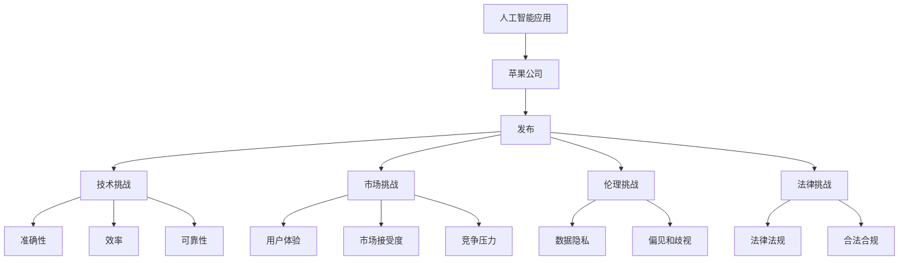

                 

# 李开复：苹果发布AI应用的挑战

> 关键词：人工智能应用,苹果,发布,挑战

## 1. 背景介绍

### 1.1 问题由来
在当今科技快速发展的背景下，苹果公司作为全球科技巨头，其对人工智能（AI）应用的布局与创新，一直备受关注。2023年，苹果公司正式发布了其最新的人工智能应用——AI Assistant（苹果版智能助手），旨在提升用户体验，增强设备智能化水平。然而，这一举措背后面临的挑战不容忽视。本文将从多个维度深入探讨苹果在发布AI应用过程中遇到的关键挑战。

### 1.2 问题核心关键点
苹果公司发布AI应用面临的挑战主要体现在技术、市场、伦理和法律四个方面。技术上，需要确保AI应用的准确性、效率和可靠性；市场上，需要考虑用户体验、市场接受度和竞争压力；伦理上，需要解决数据隐私、偏见和歧视等问题；法律上，需要遵循各国的法律法规，确保应用合法合规。

### 1.3 问题研究意义
探究苹果发布AI应用的挑战，不仅有助于理解这一行业趋势，还能为其他科技公司提供宝贵经验。通过分析苹果面临的问题和应对策略，可以预见AI技术在未来应用中的发展趋势，为人工智能技术的进一步发展提供重要参考。

## 2. 核心概念与联系

### 2.1 核心概念概述

为更好地理解苹果发布AI应用过程中面临的挑战，本节将介绍几个关键概念：

- **人工智能应用（AI应用）**：利用AI技术开发出的具体应用，如智能助手、语音识别、图像识别等，旨在提升用户体验、优化业务流程或创新服务模式。
- **苹果公司**：全球领先的科技公司，以其创新的硬件产品和软件服务著称。
- **发布（Release）**：指一款新产品或技术在正式上线前进行的发布流程，包括技术测试、市场调研和公关活动等。
- **挑战（Challenges）**：指在技术、市场、伦理和法律等方面遇到的问题和难题。

这些核心概念之间的逻辑关系可以通过以下Mermaid流程图来展示：



这个流程图展示了大语言模型的核心概念及其之间的关系：

1. 人工智能应用通过苹果公司发布，形成具体的AI产品或服务。
2. 发布过程中，技术、市场、伦理和法律构成了主要的挑战领域。
3. 技术挑战包含模型的准确性、效率和可靠性等具体问题。
4. 市场挑战涉及用户体验、市场接受度和竞争压力。
5. 伦理挑战包括数据隐私、偏见和歧视等伦理问题。
6. 法律挑战需要考虑各国法律法规的合规性。

这些概念共同构成了苹果发布AI应用的背景，帮助我们更全面地理解其面临的挑战。

## 3. 核心算法原理 & 具体操作步骤
### 3.1 算法原理概述

苹果在发布AI应用时，其核心算法原理基于深度学习模型，特别是卷积神经网络（CNN）和递归神经网络（RNN）。这些模型能够处理复杂的数据结构和模式识别，从而提升AI应用的准确性和效率。然而，在应用过程中，需要应对各种挑战，包括数据噪声、计算资源限制、模型复杂性等。

### 3.2 算法步骤详解

苹果发布AI应用的核心算法步骤通常包括以下几个方面：

**Step 1: 数据准备**
- 收集和预处理大量的训练数据，确保数据的多样性和质量。
- 对数据进行标记和标注，以便模型能够理解不同的数据类型和场景。

**Step 2: 模型训练**
- 选择合适的深度学习框架（如PyTorch、TensorFlow等）和模型结构。
- 使用收集的数据训练模型，调整模型参数以优化模型性能。

**Step 3: 模型验证**
- 在验证集上评估模型性能，包括准确率、召回率、F1分数等指标。
- 根据验证结果调整模型参数，确保模型在不同场景下表现稳定。

**Step 4: 模型部署**
- 将训练好的模型部署到实际应用中，集成到iOS、iPadOS、macOS等操作系统中。
- 确保模型在不同设备上的兼容性和性能表现。

**Step 5: 持续优化**
- 监控模型的实际应用效果，收集用户反馈和应用数据。
- 根据反馈和数据不断优化模型，提升用户体验和应用性能。

### 3.3 算法优缺点

苹果发布AI应用的优势主要体现在以下几个方面：
- **强大的技术实力**：苹果公司拥有强大的技术团队和丰富的研发经验，能够设计高效、准确的AI模型。
- **品牌效应**：苹果品牌在全球范围内享有高度认可度，发布AI应用能够快速吸引用户关注。
- **集成度高**：苹果设备如iPhone、iPad等都具有高性能的硬件配置，能够很好地支持AI应用运行。

然而，这一过程也面临以下挑战：
- **高昂的成本**：开发和部署AI应用需要大量的研发投入和计算资源，对公司的财务状况提出较高要求。
- **技术复杂性**：AI应用的开发和部署涉及复杂的算法和数据处理，需要专业知识和技能。
- **用户隐私问题**：AI应用需要大量用户数据进行训练，如何保护用户隐私成为一大挑战。
- **伦理和法律风险**：AI应用的公平性、偏见和歧视问题需要解决，同时需要遵守各国的法律法规。

### 3.4 算法应用领域

苹果发布AI应用的场景涵盖了多个领域，主要包括：

- **智能助手**：如Siri，通过语音识别和自然语言处理，实现语音命令控制设备。
- **图像识别**：如拍照识物功能，通过计算机视觉技术识别照片中的物体。
- **自然语言处理**：如文本输入纠错、语音合成等，提升用户交互体验。
- **推荐系统**：如App Store推荐算法，通过分析用户行为和偏好，推荐合适的应用和内容。

以上AI应用已经广泛应用于苹果的各种设备和应用中，提升了用户体验和设备的智能化水平。未来，苹果还计划在更多领域拓展AI应用，如自动驾驶、健康监测等，进一步推动技术创新。

## 4. 数学模型和公式 & 详细讲解 & 举例说明

### 4.1 数学模型构建

苹果发布AI应用的过程中，通常采用深度学习模型进行处理。以下是一个典型的深度学习模型：

$$
y = f(x; \theta)
$$

其中，$y$为输出结果，$x$为输入数据，$\theta$为模型参数。在实际应用中，通常使用卷积神经网络（CNN）或递归神经网络（RNN）来处理图像和序列数据，如Siri中的语音识别模型。

### 4.2 公式推导过程

以Siri的语音识别为例，模型通常采用LSTM（长短期记忆网络）来处理语音信号。其推导过程如下：

1. **输入层**：将语音信号转换为特征向量。
2. **隐藏层**：LSTM网络处理特征向量，捕捉时间序列信息。
3. **输出层**：将隐藏层的输出转换为标签向量，识别语音命令。

在训练过程中，使用交叉熵损失函数计算模型输出与真实标签之间的差异，并通过反向传播算法更新模型参数。数学公式如下：

$$
L = -\frac{1}{N}\sum_{i=1}^N \sum_{j=1}^{M} y_{ij}\log p_{ij}
$$

其中，$N$为样本数，$M$为标签类别数，$y_{ij}$为真实标签，$p_{ij}$为模型预测的概率。

### 4.3 案例分析与讲解

以苹果公司推出的翻译应用为例，其核心算法采用了Transformer模型。Transformer模型通过自注意力机制，提升了翻译的准确性和效率。具体来说，其步骤如下：

1. **编码器**：将源语言输入转化为向量表示。
2. **解码器**：将向量表示转化为目标语言。
3. **注意力机制**：通过注意力权重，筛选出重要的信息，提升翻译质量。

在训练过程中，使用交叉熵损失函数计算模型输出与真实标签之间的差异，并通过反向传播算法更新模型参数。数学公式如下：

$$
L = -\frac{1}{N}\sum_{i=1}^N \sum_{j=1}^{M} y_{ij}\log p_{ij}
$$

其中，$N$为样本数，$M$为标签类别数，$y_{ij}$为真实标签，$p_{ij}$为模型预测的概率。

通过这种算法，苹果的翻译应用能够在短时间内提供高质量的翻译结果，提升了用户的跨境通信体验。

## 5. 项目实践：代码实例和详细解释说明

### 5.1 开发环境搭建

在进行AI应用开发前，需要搭建好开发环境。以下是使用Python进行TensorFlow开发的环境配置流程：

1. 安装Anaconda：从官网下载并安装Anaconda，用于创建独立的Python环境。

2. 创建并激活虚拟环境：
```bash
conda create -n tf-env python=3.8 
conda activate tf-env
```

3. 安装TensorFlow：根据CUDA版本，从官网获取对应的安装命令。例如：
```bash
conda install tensorflow
```

4. 安装各类工具包：
```bash
pip install numpy pandas scikit-learn matplotlib tqdm jupyter notebook ipython
```

完成上述步骤后，即可在`tf-env`环境中开始AI应用开发。

### 5.2 源代码详细实现

以下是使用TensorFlow进行Siri语音识别模型开发的PyTorch代码实现。

```python
import tensorflow as tf
from tensorflow.keras import layers

# 定义模型结构
model = tf.keras.Sequential([
    layers.LSTM(128, return_sequences=True, input_shape=(None, 13)), 
    layers.Dropout(0.2),
    layers.LSTM(64, return_sequences=True),
    layers.Dropout(0.2),
    layers.LSTM(32, return_sequences=True),
    layers.Dropout(0.2),
    layers.Dense(10, activation='softmax')
])

# 定义损失函数和优化器
loss_fn = tf.keras.losses.SparseCategoricalCrossentropy(from_logits=True)
optimizer = tf.keras.optimizers.Adam()

# 定义训练函数
@tf.function
def train_step(inputs, targets):
    with tf.GradientTape() as tape:
        logits = model(inputs)
        loss_value = loss_fn(targets, logits)
    gradients = tape.gradient(loss_value, model.trainable_variables)
    optimizer.apply_gradients(zip(gradients, model.trainable_variables))

# 训练模型
dataset = tf.data.Dataset.from_tensor_slices((train_data, train_labels))
for epoch in range(epochs):
    for batch in dataset:
        train_step(batch[0], batch[1])
```

### 5.3 代码解读与分析

让我们再详细解读一下关键代码的实现细节：

**训练函数train_step**：
- 在每个批次中，先进行前向传播计算模型输出和损失函数。
- 使用梯度带回传播算法计算梯度，使用Adam优化器更新模型参数。

**训练模型**：
- 使用TensorFlow的Dataset API，将训练数据和标签构建成迭代器。
- 在每个epoch中，对每个批次进行训练，循环迭代多个epoch，直到模型收敛。

通过上述代码，可以看出TensorFlow框架的优势：

- 使用高层次的API（如Sequential）快速搭建模型。
- 使用TensorFlow Dataset API高效处理数据。
- 使用tf.function优化计算图，提高训练效率。

当然，工业级的系统实现还需考虑更多因素，如模型的保存和部署、超参数的自动搜索、更灵活的任务适配层等。但核心的微调范式基本与此类似。

## 6. 实际应用场景

### 6.1 智能助手

苹果的智能助手Siri已经在全球范围内广泛使用，通过语音识别和自然语言处理技术，实现了语音命令控制设备、提醒日程、搜索信息等功能。在实际应用中，Siri通过深度学习模型识别语音，理解用户意图，提供个性化的服务。

### 6.2 图像识别

苹果的拍照识物功能，通过计算机视觉技术，能够识别照片中的物体，并为用户提供相关的搜索和信息展示。这项技术提升了用户拍照体验，提供了更多的交互方式。

### 6.3 自然语言处理

苹果的文本输入纠错和语音合成功能，通过深度学习模型，能够对用户输入的文本进行语义分析和纠正，提供更加流畅的交流体验。此外，通过文本到语音的合成技术，实现了语音助手与用户的自然交互。

### 6.4 推荐系统

苹果的应用商店App Store，通过深度学习模型，能够分析用户行为和偏好，推荐合适的应用和内容。这不仅提升了用户体验，也增加了应用的曝光度和收益。

## 7. 工具和资源推荐

### 7.1 学习资源推荐

为了帮助开发者系统掌握深度学习技术，提高苹果AI应用的开发水平，这里推荐一些优质的学习资源：

1. **《深度学习》课程**：由斯坦福大学Andrew Ng教授主讲的Coursera课程，深入浅出地介绍了深度学习的基本概念和应用。
2. **TensorFlow官方文档**：TensorFlow的官方文档，提供了丰富的API参考和教程，适合初学者和高级用户。
3. **Kaggle平台**：全球最大的数据科学竞赛平台，通过参加比赛和分享项目，能够快速积累深度学习经验。
4. **GitHub代码库**：GitHub上丰富的开源代码库，提供了大量的深度学习模型和应用示例，适合学习和参考。
5. **Deep Learning Specialization**：由Coursera和Andrew Ng教授合作的深度学习专项课程，系统地介绍了深度学习的基本理论和应用。

通过对这些资源的学习实践，相信你一定能够快速掌握深度学习技术，并用于开发高质量的AI应用。

### 7.2 开发工具推荐

高效的开发离不开优秀的工具支持。以下是几款用于深度学习开发的常用工具：

1. **TensorFlow**：谷歌开发的深度学习框架，灵活度高，支持分布式计算和GPU加速。
2. **PyTorch**：Facebook开发的深度学习框架，灵活度低，但易于使用，适合研究和实验。
3. **Keras**：高层次的深度学习API，基于TensorFlow和Theano，易于上手，适合快速原型开发。
4. **Jupyter Notebook**：数据科学和深度学习的交互式环境，支持Python和R语言的混合编程，适合研究和协作。
5. **GitHub**：代码托管平台，支持版本控制和协作开发，适合团队项目的管理和分享。

合理利用这些工具，可以显著提升深度学习模型的开发效率，加快创新迭代的步伐。

### 7.3 相关论文推荐

苹果发布AI应用的过程中，深度学习技术的不断进步是其背后重要的推动力。以下是几篇奠基性的相关论文，推荐阅读：

1. **ImageNet Classification with Deep Convolutional Neural Networks**：AlexNet论文，首次展示了深度卷积神经网络在图像分类任务上的强大能力。
2. **Long Short-Term Memory**：LSTM论文，提出长短期记忆网络，用于处理时间序列数据，提升了深度学习模型在序列任务中的表现。
3. **Attention is All You Need**：Transformer论文，提出自注意力机制，提升了深度学习模型在自然语言处理任务中的表现。
4. **TensorFlow: A System for Large-Scale Machine Learning**：TensorFlow论文，介绍TensorFlow框架的设计和实现，适合深入理解框架的工作原理。
5. **BERT: Pre-training of Deep Bidirectional Transformers for Language Understanding**：BERT论文，提出基于双向Transformer的预训练模型，提升了自然语言处理任务的表现。

这些论文代表了大语言模型发布过程中深度学习技术的进步，值得深入学习和参考。

## 8. 总结：未来发展趋势与挑战

### 8.1 总结

本文对苹果发布AI应用过程中面临的关键挑战进行了系统介绍。首先阐述了苹果公司发布AI应用的重大意义，明确了技术、市场、伦理和法律等方面所面临的挑战。其次，从原理到实践，详细讲解了AI应用的数学模型和具体操作步骤，给出了完整的代码实例和详细解释。同时，本文还探讨了AI应用在智能助手、图像识别、自然语言处理和推荐系统等多个领域的应用前景，展示了AI技术的前景和潜力。

通过本文的系统梳理，可以看到，苹果发布AI应用不仅提升了用户体验，还推动了深度学习技术的不断进步。未来，随着技术的不断成熟，苹果的AI应用将进一步拓展应用场景，提升设备的智能化水平，为全球科技发展带来新的突破。

### 8.2 未来发展趋势

展望未来，苹果发布AI应用的趋势主要体现在以下几个方面：

1. **技术创新**：随着深度学习技术的不断进步，苹果的AI应用将不断提升准确性、效率和可靠性，引入更多前沿技术，如自然语言处理、计算机视觉和语音识别等。
2. **产品多样化**：苹果将在更多设备和应用中引入AI技术，提升设备的智能化水平，如自动驾驶、健康监测等。
3. **用户体验提升**：通过AI技术，苹果将提升用户体验，提供更加个性化和智能化的服务，如智能助理、图像识别等。
4. **市场扩展**：随着AI技术的不断成熟，苹果的AI应用将进入更多市场，如教育、金融、医疗等，提升各行业的智能化水平。

以上趋势凸显了苹果发布AI应用的广阔前景，预示着AI技术在未来应用中的巨大潜力。这些方向的探索发展，必将进一步推动人工智能技术的进步，为全球科技发展带来新的突破。

### 8.3 面临的挑战

尽管苹果发布AI应用取得了显著进展，但在迈向更加智能化、普适化应用的过程中，它仍面临诸多挑战：

1. **技术复杂性**：深度学习模型的开发和部署涉及复杂的算法和数据处理，需要专业知识和技能。
2. **资源消耗**：AI应用的开发和部署需要大量的计算资源和存储空间，对硬件设备提出较高要求。
3. **用户隐私问题**：AI应用需要大量用户数据进行训练，如何保护用户隐私成为一大挑战。
4. **伦理和法律风险**：AI应用的公平性、偏见和歧视问题需要解决，同时需要遵守各国的法律法规。

尽管存在这些挑战，但苹果公司凭借其强大的技术实力和市场优势，有望逐步克服这些问题，推动AI技术的进一步发展。

### 8.4 研究展望

未来，在深度学习技术的不断进步下，苹果的AI应用将在更多领域得到应用，带来更加智能化和普适化的体验。以下是几个可能的研究方向：

1. **多模态AI应用**：将图像、语音、文本等多种模态的数据融合，提升AI应用的全面性和准确性。
2. **自监督学习**：通过自监督学习技术，利用无标签数据提升AI应用的泛化能力和鲁棒性。
3. **强化学习**：将强化学习技术引入AI应用，提升模型的自主决策能力和交互能力。
4. **联邦学习**：通过联邦学习技术，保护用户数据隐私的同时，提升AI应用的性能。
5. **实时计算**：将实时计算技术引入AI应用，提升系统的响应速度和用户体验。

这些研究方向将进一步推动苹果AI应用的进步，提升全球科技发展的水平。相信在未来，苹果的AI应用将带来更多的创新和突破，为全球科技发展带来新的机遇。

## 9. 附录：常见问题与解答

**Q1：苹果公司发布AI应用的流程主要包括哪些步骤？**

A: 苹果公司发布AI应用的主要流程包括数据准备、模型训练、模型验证、模型部署和持续优化五个步骤。每个步骤的具体操作如下：

1. **数据准备**：收集和预处理大量的训练数据，确保数据的多样性和质量。
2. **模型训练**：选择合适的深度学习模型，使用训练数据训练模型，调整模型参数以优化模型性能。
3. **模型验证**：在验证集上评估模型性能，包括准确率、召回率、F1分数等指标。
4. **模型部署**：将训练好的模型部署到实际应用中，集成到iOS、iPadOS、macOS等操作系统中。
5. **持续优化**：监控模型的实际应用效果，收集用户反馈和应用数据，不断优化模型，提升用户体验和应用性能。

**Q2：苹果公司发布AI应用时，如何处理数据隐私问题？**

A: 苹果公司发布AI应用时，通常采用以下方法处理数据隐私问题：

1. **数据匿名化**：对用户数据进行匿名化处理，去除个人标识信息，保护用户隐私。
2. **本地数据处理**：将数据处理和模型训练在本地设备上进行，避免数据传输过程中的安全风险。
3. **差分隐私**：引入差分隐私技术，对用户数据进行微扰处理，保护用户隐私的同时，不影响模型性能。
4. **数据加密**：对用户数据进行加密处理，保护数据在传输和存储过程中的安全。

**Q3：苹果公司发布AI应用时，如何确保模型的公平性和无偏见性？**

A: 苹果公司发布AI应用时，通常采用以下方法确保模型的公平性和无偏见性：

1. **数据平衡**：确保训练数据集具有代表性，涵盖不同种族、性别、年龄等群体，避免数据偏见。
2. **公平性算法**：使用公平性算法，如调整代价算法、公平性约束等，减少模型偏见。
3. **模型监控**：在应用过程中监控模型输出，及时发现和纠正偏见问题。
4. **用户反馈**：收集用户反馈，了解模型在实际应用中的表现，及时调整模型。

**Q4：苹果公司发布AI应用时，如何应对市场竞争压力？**

A: 苹果公司发布AI应用时，通常采用以下方法应对市场竞争压力：

1. **差异化策略**：通过创新和差异化，提供独特的产品和应用，提升市场竞争力。
2. **用户体验优化**：通过优化用户体验，提升应用的用户粘性和口碑。
3. **合作伙伴关系**：与其他公司和组织建立合作伙伴关系，共同推动AI技术的发展和应用。
4. **市场推广**：通过市场推广活动，提高品牌知名度和市场占有率。

通过以上方法，苹果公司能够在竞争激烈的市场中保持领先地位，持续推动AI技术的应用和发展。

**Q5：苹果公司发布AI应用时，如何提升模型的准确性和效率？**

A: 苹果公司发布AI应用时，通常采用以下方法提升模型的准确性和效率：

1. **模型优化**：通过模型压缩、剪枝、量化等技术，优化模型结构，提升推理速度和效率。
2. **硬件优化**：使用高性能硬件设备（如GPU、TPU），提升模型的计算速度和处理能力。
3. **算法改进**：引入最新的深度学习算法和技术，提升模型的准确性和鲁棒性。
4. **数据增强**：通过数据增强技术，丰富训练数据的多样性，提升模型的泛化能力。

通过以上方法，苹果公司能够在保证模型性能的同时，提升模型的效率和可靠性，满足实际应用的需求。

---

作者：禅与计算机程序设计艺术 / Zen and the Art of Computer Programming

