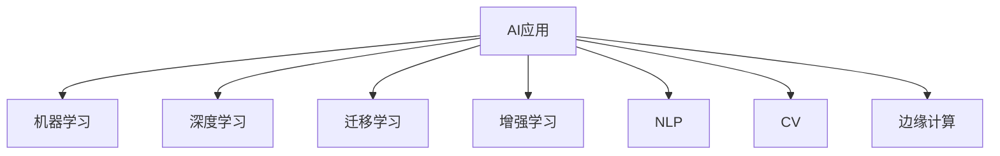
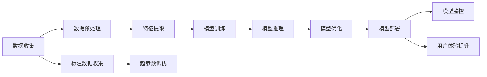

                 

# 李开复：苹果发布AI应用的挑战

## 1. 背景介绍

随着人工智能技术的迅猛发展，各大科技公司纷纷将AI技术引入到自己的产品和服务中，试图通过智能化升级提升用户体验。苹果公司作为全球知名的科技企业，近年来也在AI应用方面发力，推出了多款搭载AI功能的设备和应用。然而，从其发布的多款AI应用来看，苹果在AI技术的应用上仍面临诸多挑战，本文将从多个角度探讨这些挑战，并给出相应的解决方案。

## 2. 核心概念与联系

### 2.1 核心概念概述

为更好地理解苹果在AI应用中所面临的挑战，我们先介绍几个核心概念：

- **AI应用**：指在产品和服务中集成AI技术，通过机器学习、深度学习等方法提升产品智能化程度，增强用户体验。
- **机器学习**：指通过对数据进行学习，构建模型以实现预测、分类、聚类等任务的技术。
- **深度学习**：机器学习的高级形式，通过多层神经网络模型进行特征提取和复杂模式识别。
- **迁移学习**：指将一个领域学习到的知识，迁移到另一个不同但相关的领域的学习方式。
- **增强学习**：通过与环境的交互，不断优化决策策略，以最大化累积奖励的技术。
- **自然语言处理（NLP）**：指计算机对自然语言的理解、处理和生成，是AI应用中重要的技术之一。
- **计算机视觉（CV）**：指计算机对图像和视频的理解、处理和生成，是AI应用中重要的技术之一。
- **边缘计算**：指在设备端进行数据处理和计算，以降低延迟和带宽消耗的技术。

这些核心概念之间的逻辑关系可以通过以下Mermaid流程图来展示：



### 2.2 核心概念原理和架构的 Mermaid 流程图



## 3. 核心算法原理 & 具体操作步骤

### 3.1 算法原理概述

苹果在AI应用中使用的核心算法主要包括机器学习、深度学习、迁移学习、增强学习等。这些算法通过在大量数据上进行训练，构建能够对特定任务进行预测、分类、聚类等功能的模型，并通过模型推理实现智能化的应用场景。

### 3.2 算法步骤详解

苹果的AI应用开发过程通常包括以下几个关键步骤：

1. **数据收集**：收集与AI应用相关的数据，这些数据可以是用户行为数据、社交媒体数据、设备传感器数据等。
2. **数据预处理**：对收集到的数据进行清洗、去重、标注等处理，以提高数据的质量和可用性。
3. **特征提取**：使用机器学习或深度学习模型对预处理后的数据进行特征提取，构建出可用于模型训练的特征向量。
4. **模型训练**：使用标注数据对特征向量进行训练，构建出能够在特定任务上进行预测或分类的模型。
5. **模型推理**：将训练好的模型部署到设备上，对新的数据进行推理预测，实现AI功能的智能化应用。
6. **模型优化**：根据模型在实际应用中的表现，通过超参数调优、模型微调等手段不断优化模型性能。
7. **模型部署**：将优化后的模型部署到实际设备上，实现实时推理和用户交互。
8. **模型监控**：对部署后的模型进行实时监控，及时发现和修复模型中的问题，保障系统稳定运行。

### 3.3 算法优缺点

苹果在AI应用中使用的主要算法具有以下优点：

- **泛化能力强**：通过大量数据训练构建的模型，能够对新数据进行泛化预测，提升应用场景的智能化程度。
- **自动化程度高**：机器学习、深度学习等算法能够自动进行特征提取和模式识别，减少了人工干预的复杂度。
- **可扩展性强**：迁移学习和增强学习等技术，可以在不同的应用场景和设备上进行迁移，提升应用的灵活性和可扩展性。

同时，这些算法也存在一些缺点：

- **计算资源消耗大**：大规模数据训练和深度学习模型推理需要大量的计算资源，对硬件配置提出了较高要求。
- **模型复杂度高**：复杂的算法模型在推理时需要进行大量的计算，容易导致延迟和功耗问题。
- **数据隐私风险**：大量的用户数据和隐私信息需要存储和处理，存在数据泄露和隐私侵害的风险。
- **模型可解释性差**：AI模型通常被视为“黑盒”，难以解释模型的决策过程，缺乏透明度。
- **鲁棒性不足**：AI模型在面对异常数据或攻击时，容易发生错误或失效，缺乏鲁棒性。

### 3.4 算法应用领域

苹果的AI应用主要集中在以下几个领域：

1. **图像识别**：如人脸识别、图像分类、物体检测等，提升设备拍照、视频录制等功能。
2. **语音识别**：如Siri语音助手，通过深度学习模型实现对自然语言语音的识别和理解。
3. **智能推荐**：如App Store和iTunes中基于用户行为和偏好的智能推荐功能。
4. **增强现实**：如ARKit框架，利用计算机视觉和深度学习技术实现增强现实应用。
5. **健康与健身**：如Apple Watch中的健康监测功能，利用机器学习模型进行心率、步数等健康数据的分析。

这些AI应用涵盖了设备智能化、用户体验优化、健康监测等多个领域，体现了苹果在AI技术上的广泛应用和深入挖掘。

## 4. 数学模型和公式 & 详细讲解 & 举例说明

### 4.1 数学模型构建

苹果的AI应用通常基于深度学习模型进行构建，以实现对数据的复杂特征提取和模式识别。以下以图像识别为例，介绍深度学习模型的构建过程：

1. **输入数据**：将输入图像进行预处理，转换为可用于深度学习的张量格式。
2. **卷积层**：通过多层卷积核对输入图像进行特征提取，提取出图像中的局部特征。
3. **池化层**：对卷积层的输出进行下采样，减小特征图尺寸，降低计算复杂度。
4. **全连接层**：将池化层的输出进行扁平化处理，输入到全连接层进行分类预测。
5. **softmax层**：对全连接层的输出进行softmax处理，得到每个类别的概率分布。
6. **损失函数**：根据预测结果和真实标签，计算模型的损失函数，如交叉熵损失。
7. **优化器**：使用梯度下降等优化算法，根据损失函数的梯度更新模型参数。

### 4.2 公式推导过程

以图像识别中的卷积神经网络（CNN）为例，介绍其关键公式的推导过程：

1. **卷积层公式**：假设输入图像大小为$h \times w$，卷积核大小为$k \times k$，步幅为$s$，填充为$p$，则卷积层输出的特征图大小为$\frac{h-w+2p}{s}+1$，特征图数量为$o$。

2. **池化层公式**：假设池化层输入大小为$h \times w$，池化核大小为$k \times k$，步幅为$s$，则池化层输出的特征图大小为$\frac{h-w+2p}{s}+1$，特征图数量为$\frac{h-w+2p}{s}+1$。

3. **softmax公式**：假设模型输出为$y_i$，真实标签为$y$，则交叉熵损失函数为：

$$
L(y_i,y) = -\sum_{i=1}^n y_i \log \frac{e^{y_i}}{\sum_{j=1}^n e^{y_j}}
$$

### 4.3 案例分析与讲解

以苹果的Face ID技术为例，介绍其在人脸识别中的深度学习模型构建和应用：

1. **模型构建**：Face ID技术使用了深度卷积神经网络，对用户脸部图像进行特征提取和分类。其模型结构包括卷积层、池化层、全连接层等。
2. **数据训练**：使用大量的脸部图像数据进行模型训练，学习脸部特征和身份分类之间的映射关系。
3. **模型推理**：在用户使用时，设备会采集用户脸部图像，通过预训练的模型进行特征提取和分类，判断是否为合法用户。
4. **用户隐私保护**：Face ID技术在训练和推理过程中，均采用了差分隐私等技术手段，保护用户隐私。

## 5. 项目实践：代码实例和详细解释说明

### 5.1 开发环境搭建

在搭建苹果AI应用的开发环境时，需要注意以下几点：

1. **硬件配置**：需要高性能的GPU或TPU，以支持深度学习模型的训练和推理。
2. **软件开发工具**：使用Xcode、Python、TensorFlow等工具进行模型开发和调试。
3. **数据存储和管理**：使用AWS、Google Cloud等云存储平台，对数据进行存储和管理。

### 5.2 源代码详细实现

以下是一个简单的图像识别应用，介绍如何使用TensorFlow构建CNN模型：

```python
import tensorflow as tf
from tensorflow.keras import layers

# 定义模型
model = tf.keras.Sequential([
    layers.Conv2D(32, (3, 3), activation='relu', input_shape=(28, 28, 1)),
    layers.MaxPooling2D((2, 2)),
    layers.Conv2D(64, (3, 3), activation='relu'),
    layers.MaxPooling2D((2, 2)),
    layers.Flatten(),
    layers.Dense(10, activation='softmax')
])

# 编译模型
model.compile(optimizer='adam', loss='categorical_crossentropy', metrics=['accuracy'])

# 训练模型
model.fit(x_train, y_train, epochs=10, validation_data=(x_test, y_test))

# 推理预测
predictions = model.predict(x_test)
```

### 5.3 代码解读与分析

- **定义模型**：使用Sequential模型定义卷积神经网络结构，包括卷积层、池化层、全连接层等。
- **编译模型**：定义优化器、损失函数和评估指标，准备进行模型训练。
- **训练模型**：使用训练集数据进行模型训练，并在验证集上进行评估。
- **推理预测**：使用测试集数据进行模型推理，预测样本的分类结果。

## 6. 实际应用场景

### 6.1 智能推荐

苹果的智能推荐系统广泛应用在App Store、iTunes等应用中，通过深度学习模型分析用户行为和偏好，推荐相关的应用和内容。其技术架构包括数据收集、特征提取、模型训练、推荐排序等环节。

### 6.2 图像识别

苹果的图像识别技术广泛应用于设备拍照、视频录制、AR应用等多个场景。其技术架构包括数据预处理、卷积神经网络构建、模型训练和推理预测等环节。

### 6.3 健康监测

苹果的健康监测系统利用机器学习模型对用户健康数据进行分析和预测，如Apple Watch中的心率监测、步数记录等。其技术架构包括数据收集、特征提取、模型训练和推理预测等环节。

### 6.4 未来应用展望

未来，苹果的AI应用将继续向更加智能化、个性化、实时化方向发展。以下是几个可能的发展方向：

1. **边缘计算**：利用设备端计算能力，实现实时数据处理和推理，降低延迟和带宽消耗。
2. **多模态融合**：结合图像、语音、文本等多种模态数据，提升应用场景的智能化程度。
3. **联邦学习**：通过设备端联合训练，保护用户隐私的同时提升模型性能。
4. **深度强化学习**：在智能推荐、游戏等领域引入深度强化学习，优化用户行为和体验。
5. **可解释性AI**：提升AI模型的可解释性，增强用户信任和透明度。

## 7. 工具和资源推荐

### 7.1 学习资源推荐

为了帮助开发者掌握苹果AI应用的开发技能，我们推荐以下学习资源：

1. **《深度学习基础》（李开复著）**：介绍深度学习的基本原理和应用，适合初学者入门。
2. **《机器学习实战》（Peter Harrington著）**：介绍机器学习算法和实战案例，适合有一定基础的开发者。
3. **《TensorFlow实战》（Manning出版社）**：介绍TensorFlow的开发和使用，适合TensorFlow用户。
4. **《苹果AI开发指南》**：苹果官方发布的AI应用开发指南，提供详细的技术文档和代码示例。

### 7.2 开发工具推荐

苹果AI应用开发常用的工具包括：

1. **TensorFlow**：谷歌开源的深度学习框架，支持多种设备端推理。
2. **PyTorch**：Facebook开源的深度学习框架，适合研究和实验。
3. **Xcode**：苹果官方的开发工具，支持iOS、macOS等平台应用开发。
4. **Python**：广泛使用的编程语言，适合科学计算和AI开发。

### 7.3 相关论文推荐

为了深入了解苹果在AI应用上的最新进展，我们推荐以下相关论文：

1. **《深度学习在Apple Health中的实践》（Jieru Wang等）**：介绍苹果在健康监测领域的深度学习应用。
2. **《苹果设备上的图像识别》（Yuxin Du等）**：介绍苹果在图像识别技术上的研究和应用。
3. **《苹果设备上的语音识别》（David Howe等）**：介绍苹果在语音识别技术上的研究和应用。

## 8. 总结：未来发展趋势与挑战

### 8.1 研究成果总结

苹果在AI应用上的研究成果主要集中在图像识别、语音识别、智能推荐等多个领域，涵盖了设备智能化、用户体验优化、健康监测等多个方面。其技术架构包括数据收集、特征提取、模型训练、推理预测等环节，具有较强的实用性和可扩展性。

### 8.2 未来发展趋势

未来，苹果的AI应用将继续向智能化、个性化、实时化方向发展，主要趋势包括：

1. **边缘计算**：利用设备端计算能力，实现实时数据处理和推理。
2. **多模态融合**：结合图像、语音、文本等多种模态数据，提升应用场景的智能化程度。
3. **联邦学习**：通过设备端联合训练，保护用户隐私的同时提升模型性能。
4. **深度强化学习**：在智能推荐、游戏等领域引入深度强化学习，优化用户行为和体验。
5. **可解释性AI**：提升AI模型的可解释性，增强用户信任和透明度。

### 8.3 面临的挑战

苹果在AI应用上也面临诸多挑战，主要包括以下几点：

1. **计算资源消耗大**：大规模数据训练和深度学习模型推理需要大量的计算资源，对硬件配置提出了较高要求。
2. **模型复杂度高**：复杂的算法模型在推理时需要进行大量的计算，容易导致延迟和功耗问题。
3. **数据隐私风险**：大量的用户数据和隐私信息需要存储和处理，存在数据泄露和隐私侵害的风险。
4. **模型可解释性差**：AI模型通常被视为“黑盒”，难以解释模型的决策过程，缺乏透明度。
5. **鲁棒性不足**：AI模型在面对异常数据或攻击时，容易发生错误或失效，缺乏鲁棒性。

### 8.4 研究展望

未来，苹果在AI应用上的研究需要在以下几个方面进行深入探索：

1. **资源优化**：开发更加参数高效的微调方法，减少计算资源消耗。
2. **模型压缩**：采用模型压缩、稀疏化存储等技术手段，降低模型内存占用和推理延迟。
3. **隐私保护**：采用差分隐私、联邦学习等技术手段，保护用户数据隐私。
4. **可解释性AI**：开发更加可解释的AI模型，增强模型的透明度和用户信任。
5. **鲁棒性提升**：引入对抗训练、鲁棒回归等技术手段，提升模型的鲁棒性和抗干扰能力。

## 9. 附录：常见问题与解答

### Q1: 苹果的AI应用在开发过程中面临哪些挑战？

A: 苹果的AI应用在开发过程中面临以下挑战：
1. **计算资源消耗大**：大规模数据训练和深度学习模型推理需要大量的计算资源，对硬件配置提出了较高要求。
2. **模型复杂度高**：复杂的算法模型在推理时需要进行大量的计算，容易导致延迟和功耗问题。
3. **数据隐私风险**：大量的用户数据和隐私信息需要存储和处理，存在数据泄露和隐私侵害的风险。
4. **模型可解释性差**：AI模型通常被视为“黑盒”，难以解释模型的决策过程，缺乏透明度。
5. **鲁棒性不足**：AI模型在面对异常数据或攻击时，容易发生错误或失效，缺乏鲁棒性。

### Q2: 苹果的AI应用在哪些领域有应用？

A: 苹果的AI应用主要在以下几个领域有应用：
1. **图像识别**：如人脸识别、图像分类、物体检测等，提升设备拍照、视频录制等功能。
2. **语音识别**：如Siri语音助手，通过深度学习模型实现对自然语言语音的识别和理解。
3. **智能推荐**：如App Store和iTunes中基于用户行为和偏好的智能推荐功能。
4. **增强现实**：如ARKit框架，利用计算机视觉和深度学习技术实现增强现实应用。
5. **健康与健身**：如Apple Watch中的健康监测功能，利用机器学习模型进行心率、步数等健康数据的分析。

### Q3: 苹果的AI应用在未来有哪些发展趋势？

A: 苹果的AI应用在未来有以下发展趋势：
1. **边缘计算**：利用设备端计算能力，实现实时数据处理和推理。
2. **多模态融合**：结合图像、语音、文本等多种模态数据，提升应用场景的智能化程度。
3. **联邦学习**：通过设备端联合训练，保护用户隐私的同时提升模型性能。
4. **深度强化学习**：在智能推荐、游戏等领域引入深度强化学习，优化用户行为和体验。
5. **可解释性AI**：提升AI模型的可解释性，增强用户信任和透明度。

### Q4: 苹果的AI应用开发过程中有哪些技术工具？

A: 苹果的AI应用开发常用的技术工具包括：
1. **TensorFlow**：谷歌开源的深度学习框架，支持多种设备端推理。
2. **PyTorch**：Facebook开源的深度学习框架，适合研究和实验。
3. **Xcode**：苹果官方的开发工具，支持iOS、macOS等平台应用开发。
4. **Python**：广泛使用的编程语言，适合科学计算和AI开发。

### Q5: 苹果的AI应用在数据隐私保护方面有哪些措施？

A: 苹果的AI应用在数据隐私保护方面有以下措施：
1. **差分隐私**：在数据收集和处理过程中，采用差分隐私技术手段，保护用户隐私。
2. **联邦学习**：通过设备端联合训练，保护用户数据隐私。
3. **数据加密**：在数据传输和存储过程中，采用数据加密技术手段，保护数据安全。

综上所述，苹果在AI应用上的研究和应用已经取得了显著进展，但仍面临诸多挑战。未来，苹果需要在资源优化、模型压缩、隐私保护、可解释性和鲁棒性等方面进行深入探索，以实现AI应用的持续发展和创新。

