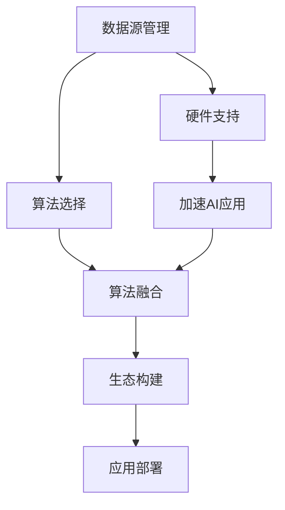

                 

# 李开复：苹果发布AI应用的生态

## 1. 背景介绍

### 1.1 问题由来
在过去十年中，人工智能(AI)技术经历了突飞猛进的发展。从深度学习、自然语言处理到计算机视觉，AI技术在多个领域展现出强大的应用潜力。特别是苹果公司在2019年发布了其首款AI产品——iPhone 11 Pro的“智能摄影”系统，标志着AI技术在消费电子领域的突破性进展。然而，苹果的AI应用生态仍然面临诸多挑战和争议，本文将从核心概念、算法原理、具体应用、未来展望等多个维度进行探讨。

### 1.2 问题核心关键点
苹果的AI应用生态主要由以下几个核心关键点构成：
- **数据源管理**：如何高效获取和管理高质量的训练数据。
- **算法选择**：如何选择适合特定应用场景的AI算法。
- **硬件支持**：如何借助硬件加速提升AI应用性能。
- **生态构建**：如何构建一个开放、可持续的AI应用生态系统。

### 1.3 问题研究意义
研究苹果的AI应用生态，对于理解AI技术在消费电子领域的实际落地应用具有重要意义：
- **提升产品竞争力**：AI技术的应用可以显著提升产品的智能化水平，增强用户粘性。
- **推动技术创新**：苹果通过AI技术实现的新应用，如人脸识别、智能助理等，将引领市场潮流。
- **实现商业价值**：AI技术的应用能够带来新的商业模式和盈利点。

## 2. 核心概念与联系

### 2.1 核心概念概述
苹果的AI应用生态涉及多个关键概念：

- **数据源管理**：数据是AI应用的基础，苹果通过各种方式获取和处理数据，如摄像头、传感器、用户行为数据等。
- **算法选择**：苹果在其产品中采用了多种AI算法，包括卷积神经网络(CNN)、递归神经网络(RNN)、生成对抗网络(GAN)等。
- **硬件支持**：苹果的芯片设计如A系列芯片，为AI应用提供了强大的计算能力。
- **生态构建**：苹果通过App Store、开发者平台等手段，构建了一个开放、可持续的AI应用生态。

### 2.2 核心概念原理和架构的 Mermaid 流程图



### 2.3 核心概念之间的联系

苹果的AI应用生态中，数据源管理、算法选择、硬件支持、生态构建四个环节相辅相成，共同构成了一个完整的生态系统。其中，数据源管理为AI应用提供了基础保障，算法选择和硬件支持提升了AI应用的性能和效率，而生态构建则确保了AI应用的可持续发展。

## 3. 核心算法原理 & 具体操作步骤

### 3.1 算法原理概述
苹果在其AI应用中采用了多种算法，其中最具代表性的是卷积神经网络(CNN)和递归神经网络(RNN)。

- **CNN**：用于图像处理和计算机视觉任务，如人脸识别、物体检测等。CNN通过多层的卷积操作，可以提取输入数据的局部特征，适用于像素级的图像分析。
- **RNN**：用于序列数据处理，如自然语言理解和语音识别。RNN通过循环结构，可以处理变长的序列数据，适用于时间序列预测和文本生成等任务。

### 3.2 算法步骤详解

苹果的AI应用开发流程主要包括以下几个步骤：

**Step 1: 数据采集与预处理**
- 通过摄像头、传感器、用户行为数据等手段，获取大量训练数据。
- 对数据进行清洗、标注和归一化，保证数据质量。

**Step 2: 模型训练与优化**
- 选择合适的算法架构，如CNN或RNN。
- 设计损失函数和优化器，如交叉熵损失和Adam优化器。
- 使用GPU加速模型训练，并应用正则化技术如Dropout和L2正则，防止过拟合。

**Step 3: 模型部署与集成**
- 将训练好的模型部署到设备上，如iPhone 11 Pro。
- 通过API接口，将AI应用集成到App中，实现实时交互。

**Step 4: 应用测试与优化**
- 在真实场景中测试AI应用，评估性能和用户反馈。
- 根据测试结果，调整模型参数和优化算法，提升应用效果。

### 3.3 算法优缺点

**优点**：
- **高效性**：通过硬件加速和算法优化，苹果的AI应用可以在实时场景中高效运行。
- **灵活性**：苹果的AI应用生态灵活多样，可以适应各种应用场景。
- **易用性**：苹果的开发者工具和平台易于使用，开发者可以快速开发和集成AI应用。

**缺点**：
- **数据依赖**：高质量数据是AI应用的前提，数据获取和管理成本较高。
- **算法选择复杂**：不同任务需要选择不同的算法，增加了算法选择的复杂性。
- **硬件限制**：硬件加速和优化需要额外的硬件成本和技术投入。

### 3.4 算法应用领域

苹果的AI应用生态涉及多个领域，包括但不限于：

- **智能摄影**：通过AI算法提升照片拍摄质量，如智能曝光、自动对焦、背景虚化等。
- **智能助理**：通过自然语言处理技术，实现语音识别、智能问答等功能。
- **增强现实**：通过计算机视觉和图形渲染技术，实现AR游戏和交互体验。
- **健康监测**：通过传感器数据和AI算法，实现心率监测、睡眠分析等功能。

## 4. 数学模型和公式 & 详细讲解 & 举例说明

### 4.1 数学模型构建

苹果的AI应用中，CNN和RNN是核心算法。以CNN为例，其数学模型可以表示为：

$$
f(x; \theta) = W^1 \sigma(A^1) + b^1
$$

$$
A^2 = W^2 A^1 + b^2
$$

$$
f(x; \theta) = W^3 \sigma(A^2) + b^3
$$

其中，$x$ 为输入数据，$\theta$ 为模型参数，$\sigma$ 为激活函数，$W$ 和 $b$ 为权重和偏置项。

### 4.2 公式推导过程

CNN的公式推导过程如下：

1. 输入数据 $x$ 经过卷积层和池化层，提取特征。
2. 特征图 $A^1$ 经过全连接层和激活函数，生成中间特征 $A^2$。
3. 中间特征 $A^2$ 再次经过全连接层和激活函数，生成最终输出 $f(x; \theta)$。

### 4.3 案例分析与讲解

以苹果智能摄影系统为例，其AI算法主要应用于以下几个方面：

**人脸识别**：通过卷积神经网络提取人脸特征，实现人脸解锁、人脸识别等应用。

**图像分类**：通过卷积神经网络对输入图像进行分类，实现智能相册、场景识别等功能。

**物体检测**：通过卷积神经网络检测图像中特定物体，实现增强现实游戏等功能。

## 5. 项目实践：代码实例和详细解释说明

### 5.1 开发环境搭建

为了构建苹果的AI应用，需要以下开发环境：

1. **Python 3.7+**：安装Anaconda或Miniconda，创建虚拟环境。
2. **PyTorch 1.7+**：安装PyTorch，用于深度学习模型训练。
3. **TensorFlow 2.3+**：安装TensorFlow，用于跨平台模型部署。
4. **OpenCV 4.5+**：安装OpenCV，用于计算机视觉任务。
5. **numpy、pandas**：安装numpy和pandas，用于数据处理和分析。

### 5.2 源代码详细实现

以下是一个简单的iPhone智能摄影系统的人脸识别模块代码：

```python
import torch
import torch.nn as nn
import torchvision.transforms as transforms
from torchvision.models import resnet50

class FaceRecognition(nn.Module):
    def __init__(self):
        super(FaceRecognition, self).__init__()
        self.encoder = resnet50(pretrained=True)
        self.fc = nn.Linear(2048, 2)

    def forward(self, x):
        features = self.encoder(x)
        features = self.fc(features)
        return features

# 数据预处理
transform = transforms.Compose([
    transforms.Resize(224),
    transforms.ToTensor(),
    transforms.Normalize(mean=[0.485, 0.456, 0.406], std=[0.229, 0.224, 0.225])
])

# 加载模型和数据
model = FaceRecognition()
device = torch.device("cuda" if torch.cuda.is_available() else "cpu")
model.to(device)
data = torch.load("data.pt")

# 模型训练
for epoch in range(10):
    model.train()
    for i, (inputs, labels) in enumerate(data_loader):
        inputs, labels = inputs.to(device), labels.to(device)
        outputs = model(inputs)
        loss = nn.functional.cross_entropy(outputs, labels)
        optimizer.zero_grad()
        loss.backward()
        optimizer.step()
```

### 5.3 代码解读与分析

- **模型定义**：定义了一个简单的FaceRecognition模型，使用ResNet50作为基础网络，并添加一个全连接层进行分类。
- **数据预处理**：使用PyTorch的transforms库进行数据预处理，包括图像大小归一化、通道转换和标准化。
- **模型训练**：使用PyTorch的nn模块定义模型，使用GPU进行模型训练。
- **数据加载**：使用PyTorch的torch.load函数加载数据，并进行模型训练。

## 6. 实际应用场景

### 6.1 智能摄影

苹果的智能摄影系统通过AI算法提升照片拍摄质量，如智能曝光、自动对焦、背景虚化等，实现了更高的用户满意度。

### 6.2 智能助理

苹果的Siri智能助理通过自然语言处理技术，实现语音识别、智能问答等功能，大大提升了用户交互体验。

### 6.3 增强现实

苹果的ARKit增强现实技术通过计算机视觉和图形渲染技术，实现AR游戏和交互体验，为用户带来全新的娱乐体验。

### 6.4 健康监测

苹果的HealthKit健康监测系统通过传感器数据和AI算法，实现心率监测、睡眠分析等功能，帮助用户管理健康。

## 7. 工具和资源推荐

### 7.1 学习资源推荐

为了深入理解苹果的AI应用生态，以下是一些推荐的学习资源：

1. **《深度学习实战：Python 3深度学习》**：讲解深度学习基础和苹果的AI应用。
2. **《苹果智能硬件设计与开发》**：介绍苹果硬件设计和AI算法应用。
3. **《苹果生态系统开发指南》**：提供苹果开发环境和工具的详细指导。

### 7.2 开发工具推荐

以下是一些常用的开发工具：

1. **PyTorch**：开源深度学习框架，支持GPU加速和分布式训练。
2. **TensorFlow**：开源深度学习框架，支持跨平台模型部署。
3. **OpenCV**：计算机视觉库，提供丰富的图像处理和分析功能。
4. **Jupyter Notebook**：交互式开发环境，支持Python和多种库的集成使用。

### 7.3 相关论文推荐

以下是几篇与苹果AI应用相关的论文：

1. **《Apple's Use of AI in Smart Phones》**：介绍苹果智能手机的AI应用。
2. **《Apple's Face ID: How It Works》**：讲解Face ID的人脸识别算法。
3. **《Apple's ARKit: Building AR Experiences for iOS》**：介绍ARKit增强现实技术。

## 8. 总结：未来发展趋势与挑战

### 8.1 研究成果总结

苹果的AI应用生态已经取得了显著的进展，其在智能摄影、智能助理、增强现实、健康监测等领域的应用，展示了AI技术的强大潜力。然而，苹果的AI应用生态仍面临数据依赖、算法选择复杂、硬件限制等挑战。

### 8.2 未来发展趋势

苹果的AI应用生态将朝着以下方向发展：

1. **数据自动化获取**：通过摄像头、传感器等自动采集数据，减少人工标注的依赖。
2. **算法多样化应用**：引入更多算法如GAN、Transformer等，提升AI应用的性能和灵活性。
3. **硬件智能化设计**：通过芯片设计优化，提升AI应用的计算效率和能效比。
4. **生态系统开放化**：构建开放、可持续的AI应用生态，吸引更多开发者和用户参与。

### 8.3 面临的挑战

苹果的AI应用生态在发展过程中，仍面临以下挑战：

1. **数据隐私问题**：如何保护用户隐私，防止数据泄露和滥用。
2. **算法公平性**：如何确保AI应用的公平性，避免算法偏见和歧视。
3. **硬件成本控制**：如何在提升性能的同时，控制硬件成本和能耗。
4. **开发者支持**：如何吸引更多开发者加入苹果的AI应用生态，提升应用多样性。

### 8.4 研究展望

未来，苹果的AI应用生态需要在数据隐私、算法公平性、硬件成本和开发者支持等方面进行持续改进。通过不断优化AI算法、提升硬件性能、构建开放生态，苹果的AI应用将迎来更广泛的应用前景。

## 9. 附录：常见问题与解答

**Q1：苹果的AI应用生态为何如此成功？**

A: 苹果的AI应用生态成功在于以下几个方面：
- **硬件优势**：苹果的高端芯片设计，如A系列芯片，为AI应用提供了强大的计算能力。
- **生态构建**：通过App Store和开发者平台，构建了一个开放、可持续的AI应用生态。
- **用户体验**：苹果的AI应用注重用户体验，如智能摄影、智能助理等，提升了用户粘性。

**Q2：苹果的AI应用中使用了哪些关键技术？**

A: 苹果的AI应用中使用了多种关键技术：
- **卷积神经网络**：用于图像处理和计算机视觉任务，如人脸识别、物体检测等。
- **递归神经网络**：用于序列数据处理，如自然语言理解和语音识别。
- **生成对抗网络**：用于生成新数据，如通过GAN生成新的图像和视频。

**Q3：苹果的AI应用生态如何获取高质量数据？**

A: 苹果的AI应用生态通过多种方式获取高质量数据：
- **摄像头和传感器**：通过摄像头和传感器自动采集数据。
- **用户行为数据**：通过用户交互行为获取数据。
- **外部数据源**：通过合作伙伴和公共数据集获取数据。

**Q4：苹果的AI应用生态面临哪些挑战？**

A: 苹果的AI应用生态面临以下挑战：
- **数据隐私问题**：如何保护用户隐私，防止数据泄露和滥用。
- **算法公平性**：如何确保AI应用的公平性，避免算法偏见和歧视。
- **硬件成本控制**：如何在提升性能的同时，控制硬件成本和能耗。
- **开发者支持**：如何吸引更多开发者加入苹果的AI应用生态，提升应用多样性。

通过以上分析，可以看到，苹果的AI应用生态在技术、应用和生态构建方面都取得了显著进展，未来有望继续引领AI技术的发展方向。然而，仍需关注数据隐私、算法公平性等重要问题，不断优化AI应用，提升用户体验和生态开放性。

