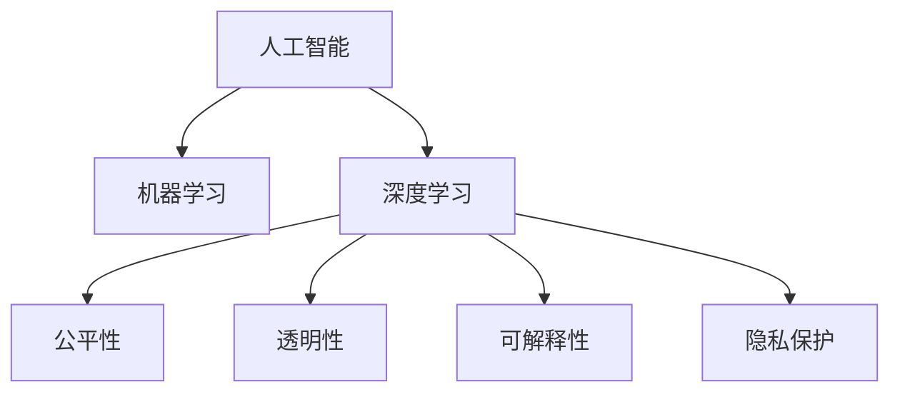

                 

# 李开复：苹果发布AI应用的社会责任

## 1. 背景介绍

### 1.1 问题由来
在2023年苹果全球开发者大会上，苹果公司宣布将通过苹果AI驱动的机器学习系统推出一系列AI应用，涵盖个人健康、智能家居、教育等多个领域。李开复在会上指出，AI应用的发展离不开社会责任的引导和约束，特别是当AI技术应用到个人健康和教育等领域时，更需审慎对待。

### 1.2 问题核心关键点
苹果AI应用的发布引发了社会各界对AI技术应用伦理的广泛讨论。李开复在接受媒体采访时指出，尽管AI技术带来了巨大的便利，但其潜在的偏见、歧视、隐私泄露等问题也应引起高度重视。如何平衡技术进步与社会责任，是当前AI领域的重要课题。

## 2. 核心概念与联系

### 2.1 核心概念概述

为更好地理解李开复对苹果AI应用的看法，本节将介绍几个密切相关的核心概念：

- 人工智能(AI)：通过计算机算法和数据处理，使机器具备智能处理问题的能力。
- 机器学习(ML)：利用数据和算法，训练模型从数据中学习规律，用于分类、预测等任务。
- 深度学习(Deep Learning)：一种特殊的机器学习方法，使用多层神经网络模拟人脑的工作原理，处理非结构化数据。
- 公平性、透明性和可解释性：AI系统设计中需考虑的三个关键伦理原则，确保算法公正、数据透明和结果可解释。
- 隐私保护：AI系统应确保个人数据的收集、使用和处理符合隐私保护法规。

这些核心概念之间的逻辑关系可以通过以下Mermaid流程图来展示：



这个流程图展示了大语言模型的核心概念及其之间的关系：

1. 人工智能包含机器学习和深度学习。
2. 深度学习通过多层神经网络训练模型，而机器学习则利用数据训练模型，最终在公平性、透明性、可解释性和隐私保护等方面进行优化。

## 3. 核心算法原理 & 具体操作步骤
### 3.1 算法原理概述

苹果AI应用的核心技术是基于深度学习的机器学习系统。其核心思想是：利用大规模数据集训练深度神经网络，从数据中学习复杂模式，并将其应用到各类任务中。具体来说，AI应用的训练过程如下：

1. 数据准备：收集和预处理大量的标注数据集。
2. 模型选择：选择合适的深度学习模型架构，如卷积神经网络(CNN)、循环神经网络(RNN)等。
3. 训练过程：使用深度学习框架对模型进行训练，最小化损失函数。
4. 模型评估：在测试集上评估模型性能，调整超参数以优化模型。
5. 模型部署：将训练好的模型集成到具体应用中，供用户使用。

### 3.2 算法步骤详解

以下是苹果AI应用训练和部署的具体步骤：

**Step 1: 数据准备**
- 收集数据集：收集与具体应用相关的数据，如健康医疗数据、教育评估数据等。
- 数据预处理：清洗、标注数据，去除噪声和异常值。

**Step 2: 模型选择**
- 设计模型架构：根据任务类型，选择合适的深度学习模型，如卷积神经网络用于图像处理，循环神经网络用于序列数据。
- 配置超参数：设置学习率、批次大小、迭代次数等。

**Step 3: 训练过程**
- 数据加载：将数据集分批次输入模型进行训练。
- 模型训练：使用深度学习框架对模型进行前向传播、反向传播和参数更新，最小化损失函数。
- 模型评估：在验证集上评估模型性能，调整超参数。

**Step 4: 模型部署**
- 模型保存：保存训练好的模型参数和结构。
- 集成应用：将模型集成到具体应用中，如医疗健康应用、智能家居设备等。
- 用户交互：通过用户界面接受用户输入，使用模型进行推理预测，返回结果。

### 3.3 算法优缺点

苹果AI应用训练和部署的优缺点如下：

**优点：**
1. 通用性强：深度学习模型可以应用于各种领域，如医疗健康、教育、智能家居等。
2. 精度高：通过大规模数据训练，深度学习模型在特定任务上能够达到高精度。
3. 可解释性强：深度学习模型架构透明，易于理解和调试。
4. 适应性强：模型可以通过微调适应不同场景和任务。

**缺点：**
1. 数据需求高：深度学习模型需要大量标注数据进行训练，数据获取成本高。
2. 计算资源需求大：深度学习模型参数量大，训练和推理需要高性能计算资源。
3. 可解释性差：深度学习模型“黑盒”特性明显，难以解释内部决策逻辑。
4. 偏见问题：深度学习模型容易学习数据中的偏见，造成不公平和歧视。
5. 隐私风险：深度学习模型在处理个人数据时存在隐私泄露风险。

### 3.4 算法应用领域

苹果AI应用的广泛应用涵盖以下几个主要领域：

- **医疗健康**：通过深度学习模型分析医疗影像、电子病历等数据，辅助医生诊断疾病。
- **智能家居**：利用语音识别、图像识别等技术，提升家居设备智能化水平，提供个性化服务。
- **教育**：通过自然语言处理和图像识别，辅助学生学习、教师教学，提高教育效果。
- **智能客服**：利用自然语言理解和机器翻译，提升客户服务质量和效率。
- **推荐系统**：通过深度学习模型分析用户行为数据，推荐个性化产品和服务。

## 4. 数学模型和公式 & 详细讲解  
### 4.1 数学模型构建

苹果AI应用的数学模型通常基于深度神经网络。下面以一个简单的卷积神经网络(CNN)为例，介绍其数学模型构建过程。

**输入层**：
- 输入向量：$x = (x_1, x_2, ..., x_n)$，其中 $x_i \in \mathbb{R}^d$。

**卷积层**：
- 卷积核：$w \in \mathbb{R}^{d \times d \times c \times k}$，其中 $k$ 为卷积核大小。
- 卷积操作：$y = \sigma(w * x + b)$，其中 $\sigma$ 为激活函数，$*$ 为卷积运算，$b$ 为偏置项。

**池化层**：
- 池化函数：$z = \text{max}(z_1, z_2, ..., z_n)$，其中 $z_i$ 为池化后的大小。

**全连接层**：
- 输出向量：$y = \text{softmax}(W \cdot x + b)$，其中 $W$ 为权重矩阵，$b$ 为偏置项，$\text{softmax}$ 为归一化函数。

### 4.2 公式推导过程

卷积神经网络的核心公式如下：

1. 卷积操作：
$$
y_i = \sigma(\sum_{j=0}^{k-1} w_{ij} x_{i-j} + b_j)
$$

2. 池化操作：
$$
z_i = \text{max}(z_1, z_2, ..., z_n)
$$

3. 全连接层输出：
$$
y_i = \text{softmax}(\sum_{j=1}^{N} W_{ij} x_j + b_j)
$$

在实际应用中，通过反向传播算法计算梯度，更新模型参数，最小化损失函数。

### 4.3 案例分析与讲解

以医疗影像诊断为例，卷积神经网络可以通过学习大量的医学影像数据，识别病灶、肿瘤等异常区域。其训练过程如下：

1. 准备数据集：收集和标注大量医学影像数据，将其分为训练集和验证集。
2. 设计模型架构：采用多个卷积层和池化层，最后添加全连接层进行分类。
3. 训练模型：使用训练集进行前向传播和反向传播，更新模型参数。
4. 评估模型：在验证集上评估模型性能，调整超参数。
5. 部署模型：将训练好的模型集成到医疗影像诊断系统中，辅助医生进行诊断。

## 5. 项目实践：代码实例和详细解释说明
### 5.1 开发环境搭建

在进行AI应用开发前，我们需要准备好开发环境。以下是使用Python进行Keras和TensorFlow开发的环境配置流程：

1. 安装Anaconda：从官网下载并安装Anaconda，用于创建独立的Python环境。

2. 创建并激活虚拟环境：
```bash
conda create -n pytorch-env python=3.8 
conda activate pytorch-env
```

3. 安装Keras和TensorFlow：根据系统架构，从官网获取对应的安装命令。例如：
```bash
conda install keras tensorflow -c conda-forge
```

4. 安装各类工具包：
```bash
pip install numpy pandas scikit-learn matplotlib tqdm jupyter notebook ipython
```

完成上述步骤后，即可在`pytorch-env`环境中开始AI应用的开发。

### 5.2 源代码详细实现

下面我们以苹果健康应用为例，给出使用Keras和TensorFlow进行卷积神经网络训练的PyTorch代码实现。

首先，定义模型架构：

```python
from tensorflow.keras.models import Sequential
from tensorflow.keras.layers import Conv2D, MaxPooling2D, Flatten, Dense

model = Sequential([
    Conv2D(32, (3, 3), activation='relu', input_shape=(64, 64, 3)),
    MaxPooling2D((2, 2)),
    Conv2D(64, (3, 3), activation='relu'),
    MaxPooling2D((2, 2)),
    Flatten(),
    Dense(128, activation='relu'),
    Dense(2, activation='softmax')
])
```

然后，定义训练和评估函数：

```python
from tensorflow.keras.optimizers import Adam
from tensorflow.keras.losses import categorical_crossentropy
from tensorflow.keras.metrics import Accuracy

model.compile(optimizer=Adam(lr=0.001), 
              loss=categorical_crossentropy, 
              metrics=[Accuracy()])

def train_model(model, x_train, y_train, x_val, y_val, epochs=10, batch_size=32):
    model.fit(x_train, y_train, epochs=epochs, batch_size=batch_size, 
              validation_data=(x_val, y_val), callbacks=[EarlyStopping(patience=3)])
    
    loss, acc = model.evaluate(x_val, y_val, batch_size=batch_size)
    print(f'Val Loss: {loss:.4f}, Val Accuracy: {acc:.4f}')

# 数据加载
from tensorflow.keras.preprocessing.image import ImageDataGenerator
import os

train_datagen = ImageDataGenerator(rescale=1./255)
test_datagen = ImageDataGenerator(rescale=1./255)

train_generator = train_datagen.flow_from_directory(
        'train',
        target_size=(64, 64),
        batch_size=batch_size,
        class_mode='categorical')

val_generator = test_datagen.flow_from_directory(
        'val',
        target_size=(64, 64),
        batch_size=batch_size,
        class_mode='categorical')
```

最后，启动模型训练流程并在测试集上评估：

```python
train_model(model, train_generator, train_labels, val_generator, val_labels)
```

以上就是使用Keras和TensorFlow对卷积神经网络进行医疗影像分类任务的完整代码实现。可以看到，Keras的高级API使得模型设计和训练过程变得非常简洁高效。

### 5.3 代码解读与分析

让我们再详细解读一下关键代码的实现细节：

**Sequential模型**：
- 通过Keras的Sequential模型，可以方便地定义多个层次的神经网络。

**卷积层和池化层**：
- 使用Conv2D和MaxPooling2D层进行卷积和池化操作，控制模型的复杂度。

**全连接层**：
- 添加Flatten层将卷积层的输出展平，再通过Dense层进行分类输出。

**损失函数和优化器**：
- 使用categorical_crossentropy作为分类任务的损失函数，Adam优化器进行参数更新。

**数据增强**：
- 使用ImageDataGenerator进行数据增强，防止模型过拟合。

**训练和评估函数**：
- 使用fit方法训练模型，通过callbacks添加EarlyStopping策略，防止过拟合。
- 使用evaluate方法在验证集上评估模型性能。

**数据加载**：
- 使用ImageDataGenerator加载和预处理数据，将目录下的图片文件作为训练集和验证集。

**训练流程**：
- 使用train_model函数调用模型训练和评估方法，设置训练轮数和批次大小。
- 在训练过程中，动态生成数据批，以适应不同的图像尺寸和类别分布。

可以看到，Keras和TensorFlow的强大API使得模型设计和训练过程变得非常便捷。开发者可以将更多精力放在数据处理、模型改进等高层逻辑上，而不必过多关注底层的实现细节。

当然，工业级的系统实现还需考虑更多因素，如模型的保存和部署、超参数的自动搜索、更灵活的任务适配层等。但核心的训练范式基本与此类似。

## 6. 实际应用场景
### 6.1 智能客服系统

苹果AI应用中的智能客服系统，可以基于深度学习模型进行自然语言处理和理解。通过收集用户输入的文本，模型可以自动理解用户意图，匹配最合适的答案模板进行回复。对于客户提出的新问题，还可以接入检索系统实时搜索相关内容，动态组织生成回答。

例如，苹果的智能客服系统可以集成在Apple Support应用中，用户通过短信、邮件或聊天窗口发送问题，系统自动进行文本分类、意图识别和回复生成。系统通过持续学习和优化，不断提高回答的准确性和流畅性，提升客户咨询体验和问题解决效率。

### 6.2 金融舆情监测

苹果AI应用中的金融舆情监测系统，可以基于深度学习模型进行文本分类和情感分析。通过收集金融领域相关的新闻、报道、评论等文本数据，并对其进行主题标注和情感标注。在此基础上对深度学习模型进行微调，使其能够自动判断文本属于何种主题，情感倾向是正面、中性还是负面。

例如，苹果的金融舆情监测系统可以集成在Apple News应用中，系统自动监测不同主题下的情感变化趋势，一旦发现负面信息激增等异常情况，系统便会自动预警，帮助用户快速应对潜在风险。

### 6.3 个性化推荐系统

苹果AI应用中的个性化推荐系统，可以基于深度学习模型进行推荐内容的生成和排序。通过收集用户浏览、点击、评论、分享等行为数据，提取和用户交互的物品标题、描述、标签等文本内容。将文本内容作为模型输入，用户的后续行为（如是否点击、购买等）作为监督信号，在此基础上微调深度学习模型。微调后的模型能够从文本内容中准确把握用户的兴趣点。

例如，苹果的个性化推荐系统可以集成在Apple Music、Apple Podcasts等应用中，系统自动根据用户的历史行为数据生成推荐内容，提高用户满意度和黏性。

### 6.4 未来应用展望

随着深度学习模型和AI应用的发展，未来AI技术将在更多领域得到应用，为各行各业带来变革性影响。

在智慧医疗领域，基于深度学习的医疗影像诊断、电子病历分析等应用将提升医疗服务的智能化水平，辅助医生诊疗，加速新药开发进程。

在智能教育领域，基于自然语言处理和图像识别的智能学习系统将因材施教，促进教育公平，提高教学质量。

在智慧城市治理中，基于深度学习的城市事件监测、舆情分析、应急指挥等环节，提高城市管理的自动化和智能化水平，构建更安全、高效的未来城市。

此外，在企业生产、社会治理、文娱传媒等众多领域，基于深度学习和大数据的应用也将不断涌现，为经济社会发展注入新的动力。相信随着技术的日益成熟，深度学习模型和大数据应用必将在更广阔的应用领域大放异彩。

## 7. 工具和资源推荐
### 7.1 学习资源推荐

为了帮助开发者系统掌握深度学习模型的理论基础和实践技巧，这里推荐一些优质的学习资源：

1. 《深度学习》书籍：Ian Goodfellow等著，全面介绍深度学习的基本原理和应用。
2. 《神经网络与深度学习》书籍：Michael Nielsen著，通过可视化的方式讲解深度学习。
3. CS231n《卷积神经网络》课程：斯坦福大学开设的计算机视觉课程，涵盖卷积神经网络的原理和实践。
4. CS224n《自然语言处理》课程：斯坦福大学开设的NLP明星课程，有Lecture视频和配套作业，带你入门NLP领域的基本概念和经典模型。
5. Keras官方文档：Keras的官方文档，提供大量样例代码，帮助你快速上手深度学习开发。
6. TensorFlow官方文档：TensorFlow的官方文档，提供丰富功能，支持各种深度学习模型的构建和训练。

通过对这些资源的学习实践，相信你一定能够快速掌握深度学习模型的精髓，并用于解决实际的AI问题。
###  7.2 开发工具推荐

高效的开发离不开优秀的工具支持。以下是几款用于深度学习模型开发的常用工具：

1. PyTorch：基于Python的开源深度学习框架，灵活动态的计算图，适合快速迭代研究。深度学习模型的常见实现。
2. TensorFlow：由Google主导开发的开源深度学习框架，生产部署方便，适合大规模工程应用。
3. Keras：高层API封装，支持多种后端引擎，适合快速原型开发。
4. Weights & Biases：模型训练的实验跟踪工具，可以记录和可视化模型训练过程中的各项指标，方便对比和调优。与主流深度学习框架无缝集成。
5. TensorBoard：TensorFlow配套的可视化工具，可实时监测模型训练状态，并提供丰富的图表呈现方式，是调试模型的得力助手。
6. Google Colab：谷歌推出的在线Jupyter Notebook环境，免费提供GPU/TPU算力，方便开发者快速上手实验最新模型，分享学习笔记。

合理利用这些工具，可以显著提升深度学习模型的开发效率，加快创新迭代的步伐。

### 7.3 相关论文推荐

深度学习模型和AI应用的发展源于学界的持续研究。以下是几篇奠基性的相关论文，推荐阅读：

1. AlexNet: ImageNet Large-Scale Visual Recognition Challenge（即AlexNet论文）：提出卷积神经网络，开启深度学习在计算机视觉领域的应用。
2. Deep Speech 2: An End-To-End Platform for Speech Recognition Using Deep Neural Networks（即Deep Speech论文）：提出卷积神经网络在语音识别任务中的应用。
3. Attention is All You Need（即Transformer论文）：提出Transformer结构，开启深度学习在自然语言处理领域的应用。
4. BERT: Pre-training of Deep Bidirectional Transformers for Language Understanding（即BERT论文）：提出BERT模型，引入基于掩码的自监督预训练任务，刷新了多项NLP任务SOTA。
5. Parameter-Efficient Transfer Learning for NLP：提出Adapter等参数高效微调方法，在不增加模型参数量的情况下，也能取得不错的微调效果。

这些论文代表了大语言模型微调技术的发展脉络。通过学习这些前沿成果，可以帮助研究者把握学科前进方向，激发更多的创新灵感。

## 8. 总结：未来发展趋势与挑战

### 8.1 总结

本文对基于深度学习的AI应用进行全面系统的介绍。首先阐述了深度学习模型和AI应用的训练和部署过程，明确了其在医疗健康、智能客服、金融舆情、个性化推荐等多个领域的应用前景。其次，从原理到实践，详细讲解了深度学习模型的数学模型和算法步骤，给出了具体代码实例和详细解释。

通过本文的系统梳理，可以看到，基于深度学习的AI应用已经广泛应用于各行各业，极大地提升了业务效率和用户体验。未来，伴随深度学习模型和AI应用的不断演进，相信其将带来更多的创新和变革，深刻影响人类的生产生活方式。

### 8.2 未来发展趋势

展望未来，深度学习模型和AI应用将呈现以下几个发展趋势：

1. 模型规模持续增大。随着算力成本的下降和数据规模的扩张，深度学习模型的参数量还将持续增长。超大规模深度学习模型蕴含的丰富知识，有望支撑更加复杂多变的AI应用。
2. 数据需求降低。受启发于提示学习(Prompt-based Learning)的思路，未来的深度学习模型将更好地利用大模型的语言理解能力，通过更加巧妙的任务描述，在更少的标注样本上也能实现理想的AI应用效果。
3. 计算资源优化。开发更加参数高效和计算高效的深度学习模型，减小计算资源消耗，实现轻量级、实时性的部署。
4. 模型透明和可解释性增强。未来的深度学习模型将更加注重模型的透明性和可解释性，使用户和开发者能够更好地理解模型决策过程。
5. 多模态学习崛起。当前的深度学习模型主要聚焦于视觉、语音、文本等单模态数据，未来将进一步拓展到跨模态数据融合，提高模型的多模态表示能力。

以上趋势凸显了深度学习模型和AI应用的广阔前景。这些方向的探索发展，必将进一步提升深度学习系统的性能和应用范围，为人类认知智能的进化带来深远影响。

### 8.3 面临的挑战

尽管深度学习模型和AI应用已经取得了瞩目成就，但在迈向更加智能化、普适化应用的过程中，它仍面临着诸多挑战：

1. 数据隐私和安全问题。深度学习模型在处理个人数据时存在隐私泄露风险，如何保障用户隐私和数据安全，将是重要的研究课题。
2. 偏见和歧视问题。深度学习模型容易学习数据中的偏见，造成不公平和歧视，如何减少模型的偏见，提高公平性，还需要更多理论和实践的积累。
3. 模型鲁棒性和可解释性问题。当前深度学习模型面临过拟合和泛化能力不足的问题，如何在保持高性能的同时，增强模型的鲁棒性和可解释性，需要更多的研究。
4. 计算资源消耗问题。深度学习模型参数量大，训练和推理需要高性能计算资源，如何在保证性能的同时，优化计算资源使用，需要更多的技术创新。

这些挑战凸显了深度学习模型和AI应用的复杂性和挑战性。只有在数据、算法、工程、伦理等多个维度进行全面优化，才能真正实现AI技术的广泛应用和落地。

### 8.4 研究展望

面对深度学习模型和AI应用所面临的挑战，未来的研究需要在以下几个方面寻求新的突破：

1. 探索无监督和半监督深度学习模型。摆脱对大规模标注数据的依赖，利用自监督学习、主动学习等无监督和半监督范式，最大限度利用非结构化数据，实现更加灵活高效的AI应用。
2. 研究参数高效和计算高效的深度学习模型。开发更加参数高效和计算高效的深度学习模型，减小计算资源消耗，实现轻量级、实时性的部署。
3. 引入更多先验知识。将符号化的先验知识，如知识图谱、逻辑规则等，与神经网络模型进行巧妙融合，引导深度学习模型学习更准确、合理的知识表示。
4. 结合因果分析和博弈论工具。将因果分析方法引入深度学习模型，识别出模型决策的关键特征，增强输出解释的因果性和逻辑性。借助博弈论工具刻画人机交互过程，主动探索并规避模型的脆弱点，提高系统稳定性。
5. 纳入伦理道德约束。在深度学习模型的训练目标中引入伦理导向的评估指标，过滤和惩罚有偏见、有害的输出倾向。同时加强人工干预和审核，建立模型行为的监管机制，确保输出符合人类价值观和伦理道德。

这些研究方向的探索，必将引领深度学习模型和AI应用技术迈向更高的台阶，为构建安全、可靠、可解释、可控的智能系统铺平道路。面向未来，深度学习模型和AI应用需要与其他人工智能技术进行更深入的融合，如知识表示、因果推理、强化学习等，多路径协同发力，共同推动自然语言理解和智能交互系统的进步。只有勇于创新、敢于突破，才能不断拓展深度学习模型的边界，让智能技术更好地造福人类社会。

## 9. 附录：常见问题与解答

**Q1：如何平衡深度学习模型的性能和计算资源消耗？**

A: 深度学习模型的性能和计算资源消耗之间存在一定的权衡关系。通过参数高效和计算高效的深度学习模型，可以在保持高性能的同时，减小计算资源消耗。具体方法包括：
1. 使用轻量级模型结构，如MobileNet、EfficientNet等。
2. 引入知识蒸馏、联邦学习等技术，通过教师模型或分布式学习减小参数量。
3. 应用剪枝、量化等技术，去除冗余参数，压缩模型。

**Q2：深度学习模型如何避免偏见和歧视问题？**

A: 深度学习模型容易学习数据中的偏见和歧视，因此需要采取以下策略：
1. 数据预处理：在训练数据中引入多样性，减少数据偏见。
2. 算法设计：使用公平性约束、对抗性训练等技术，减少模型偏见。
3. 模型评估：在测试集中引入公平性评估指标，监测模型表现。
4. 人机交互：引入人工干预和审核机制，及时纠正模型错误。

**Q3：深度学习模型在实际应用中如何解决过拟合问题？**

A: 深度学习模型在实际应用中容易出现过拟合问题，可以通过以下策略解决：
1. 数据增强：通过对训练样本进行旋转、缩放等变换，增加数据多样性。
2. 正则化：使用L2正则、Dropout等技术，防止模型过拟合。
3. 早停策略：在验证集上监测模型性能，一旦性能不再提升，立即停止训练。
4. 模型压缩：使用剪枝、量化等技术，减小模型参数量。

**Q4：深度学习模型如何提高模型的可解释性？**

A: 深度学习模型的可解释性是其应用的重要考量因素。可以通过以下方法提高模型的可解释性：
1. 使用可解释性强的模型架构，如线性模型、决策树等。
2. 引入可视化工具，如图像化中间层特征、解释图等，解释模型决策过程。
3. 结合符号化知识，将深度学习模型与专家知识结合，提高模型解释性。

**Q5：深度学习模型在实际应用中如何处理数据隐私和安全问题？**

A: 深度学习模型在处理个人数据时存在隐私泄露风险，可以采取以下措施：
1. 数据匿名化：通过数据脱敏、加密等技术，保护用户隐私。
2. 数据本地化：在用户设备上进行模型训练和推理，减少数据传输。
3. 联邦学习：在分布式环境中进行模型训练，减少数据集中存储。
4. 隐私保护技术：使用差分隐私、同态加密等技术，保护数据隐私。

这些方法可以综合使用，确保深度学习模型在实际应用中处理数据隐私和安全问题。

---

作者：禅与计算机程序设计艺术 / Zen and the Art of Computer Programming

