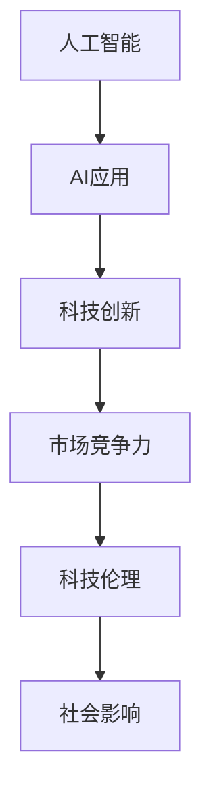

                 

# 李开复：苹果发布AI应用的科技价值

> 关键词：人工智能,苹果,AI应用,科技创新,市场竞争力,科技伦理

## 1. 背景介绍

### 1.1 问题由来
随着人工智能（AI）技术的不断成熟和普及，各大科技巨头纷纷加大对AI应用的布局。近期，苹果公司发布了其最新的AI应用成果，再次引发了行业内外对AI技术的高度关注。本文将从科技价值、市场竞争力和科技伦理三个维度，深入探讨苹果AI应用的发布对技术发展和产业竞争的影响，并对AI技术的未来发展提出几点思考。

### 1.2 问题核心关键点
- 苹果发布的AI应用包括哪些？
- 这些应用在科技创新上有哪些突破？
- AI应用对市场竞争格局有何影响？
- 苹果在发布AI应用时，是否考虑了科技伦理问题？

## 2. 核心概念与联系

### 2.1 核心概念概述

苹果公司作为全球领先的科技企业，其最新AI应用的发布，无疑再次展示了其在技术创新和市场竞争上的领先地位。为了更好地理解这些应用背后的科技价值和市场意义，本节将介绍几个核心概念及其相互联系：

- **人工智能（AI）**：指由计算机系统模拟的人类智能过程，包括机器学习、深度学习、自然语言处理、计算机视觉等技术。
- **AI应用**：指将AI技术应用于特定场景和问题，解决实际问题的软件和硬件解决方案。
- **科技创新**：指通过技术突破和新产品发布，引领行业发展的过程。
- **市场竞争力**：指企业通过技术优势、产品创新、商业模式等手段，在市场竞争中占据有利地位的能力。
- **科技伦理**：指在AI技术研发和应用过程中，对隐私、安全、公平等伦理问题的考量和处理。

这些概念之间的逻辑关系可以通过以下Mermaid流程图来展示：



这个流程图展示了从AI基础技术到具体应用，再到市场竞争和伦理社会影响的完整链条。通过理解这些核心概念，我们可以更好地把握苹果AI应用的科技价值和市场意义。

## 3. 核心算法原理 & 具体操作步骤

### 3.1 算法原理概述

苹果公司发布的AI应用主要基于深度学习技术，特别是卷积神经网络（CNN）和递归神经网络（RNN）等模型。这些模型通过大量数据训练，学习到输入数据的特征表示，从而实现图像识别、语音识别、自然语言处理等任务。

在实际应用中，这些模型的训练和推理过程通常涉及以下几个关键步骤：

1. **数据准备**：收集和预处理训练数据，确保数据的质量和多样性。
2. **模型构建**：选择合适的神经网络架构，进行模型训练。
3. **参数优化**：通过梯度下降等优化算法，最小化损失函数，调整模型参数。
4. **模型评估**：在验证集和测试集上评估模型性能，选择合适的超参数。
5. **部署应用**：将训练好的模型部署到实际应用场景中，进行推理预测。

### 3.2 算法步骤详解

以下是苹果AI应用在模型训练和部署过程中的详细步骤：

1. **数据准备**：
   - 收集与应用程序相关的数据，如图像、语音、文本等。
   - 对数据进行清洗、标注，确保数据的准确性和一致性。
   - 对数据进行增强处理，如旋转、裁剪、噪声添加等，以提高模型鲁棒性。

2. **模型构建**：
   - 根据应用场景选择合适的神经网络架构，如CNN、RNN、Transformer等。
   - 设计损失函数和优化算法，选择合适的超参数。
   - 在GPU或TPU上训练模型，调整模型参数。

3. **参数优化**：
   - 使用梯度下降等优化算法，最小化损失函数。
   - 通过早停（Early Stopping）等技术，防止模型过拟合。
   - 使用正则化技术，如L1正则、L2正则、Dropout等，提高模型泛化能力。

4. **模型评估**：
   - 在验证集上评估模型性能，如准确率、召回率、F1值等。
   - 调整超参数，如学习率、批大小、网络深度等，以提升模型性能。
   - 使用混淆矩阵、ROC曲线等工具，可视化模型性能。

5. **部署应用**：
   - 将训练好的模型导出，生成推理框架。
   - 在实际应用场景中，将模型集成到产品中。
   - 通过API接口，接收输入数据，返回推理结果。

### 3.3 算法优缺点

苹果公司的AI应用在技术上具有以下优点：

- **精度高**：基于深度学习模型的AI应用，通过大量数据训练，能够学习到复杂的特征表示，提高推理准确率。
- **响应快**：利用GPU/TPU等高性能硬件，模型推理速度较快，满足实时应用需求。
- **泛化能力强**：通过数据增强和正则化技术，模型泛化能力较强，适应不同数据分布。

同时，这些应用也存在一些缺点：

- **数据依赖性强**：模型训练和推理依赖于大量的标注数据，数据质量对模型效果有重要影响。
- **计算资源消耗大**：模型训练和推理需要高性能硬件支持，对计算资源和存储资源消耗较大。
- **模型复杂度高**：深度学习模型结构复杂，调试和优化难度大，开发和部署成本较高。

### 3.4 算法应用领域

苹果公司发布的AI应用主要应用于以下几个领域：

- **图像识别**：如人脸识别、物体检测等，用于解锁、支付、图像搜索等场景。
- **语音识别**：如语音助手、自动字幕等，用于语音控制、会议记录、视频字幕等场景。
- **自然语言处理**：如文本翻译、情感分析等，用于智能客服、内容推荐、机器翻译等场景。
- **智能推荐**：如个性化推荐、广告投放等，用于电商平台、社交媒体、新闻推荐等场景。
- **自动驾驶**：如自动驾驶系统、智能交通管理等，用于车辆控制、交通预测等场景。

这些AI应用涵盖了计算机视觉、自然语言处理、语音识别等多个领域，展示了苹果在AI技术应用上的广泛和深入。

## 4. 数学模型和公式 & 详细讲解 & 举例说明

### 4.1 数学模型构建

苹果公司发布的AI应用主要基于深度学习技术，其中卷积神经网络（CNN）和递归神经网络（RNN）是常用的模型结构。以下以图像识别为例，介绍CNN模型的构建。

一个简单的卷积神经网络由卷积层、池化层、全连接层等组成。其数学模型构建如下：

设输入图像大小为$H\times W\times C$，卷积核大小为$K\times K$，步长为$S$，特征图数量为$N$。卷积层的操作可以表示为：

$$
x_i^n = \sum_{j=1}^{C} w_{jki} \star x_{i-S(j-1)} + b_n
$$

其中，$x_i^n$表示输出特征图$n$在位置$i$的特征值，$w_{jki}$表示卷积核$j$在位置$k$的权重，$b_n$表示偏置项。

池化层用于减小特征图尺寸，减少计算量。常用的池化操作有最大池化、平均池化等，其数学模型为：

$$
x'_{i'}^n = \max_k (x_i^n)
$$

其中，$x'_{i'}^n$表示池化后特征图在位置$i'$的特征值，$k$表示池化窗口的大小。

全连接层用于将特征图转换为分类结果。其数学模型为：

$$
z = Wx + b
$$

$$
y = \sigma(z)
$$

其中，$z$表示全连接层的输出，$W$表示权重矩阵，$b$表示偏置项，$\sigma$表示激活函数。

### 4.2 公式推导过程

CNN模型的训练过程涉及前向传播和反向传播两个阶段。以图像识别任务为例，训练过程如下：

1. **前向传播**：将输入图像通过卷积层、池化层、全连接层等，最终得到分类结果。
2. **损失计算**：将分类结果与真实标签进行比较，计算损失函数。
3. **反向传播**：计算损失函数对每个参数的梯度，更新模型参数。

以分类任务为例，常用的损失函数为交叉熵损失函数。其公式为：

$$
L(y, \hat{y}) = -\frac{1}{N} \sum_{i=1}^N \sum_{j=1}^C y_i^j \log \hat{y}_i^j
$$

其中，$y$表示真实标签，$\hat{y}$表示模型预测结果。

通过反向传播算法，可以得到损失函数对每个参数的梯度：

$$
\frac{\partial L(y, \hat{y})}{\partial w} = -\frac{1}{N} \sum_{i=1}^N \sum_{j=1}^C \hat{y}_i^j \frac{\partial \sigma(z_i)}{\partial w}
$$

其中，$\frac{\partial \sigma(z_i)}{\partial w}$表示激活函数对权重$w$的梯度。

通过梯度下降等优化算法，最小化损失函数，更新模型参数。

### 4.3 案例分析与讲解

以人脸识别为例，苹果公司发布的AI应用基于深度学习模型进行训练。以下是一个典型的人脸识别流程：

1. **数据准备**：收集人脸图像，并对图像进行预处理，如裁剪、缩放、灰度化等。
2. **模型训练**：使用卷积神经网络模型对图像进行特征提取和分类。
3. **参数优化**：通过梯度下降等优化算法，最小化损失函数，更新模型参数。
4. **模型评估**：在验证集上评估模型性能，如准确率、召回率等。
5. **模型部署**：将训练好的模型导出，生成推理框架，部署到实际应用场景中。

以人脸解锁为例，用户首次使用时，系统会对人脸进行注册和校验，通过深度学习模型提取人脸特征，与注册时的人脸特征进行比对，判断是否为本人。

## 5. 项目实践：代码实例和详细解释说明

### 5.1 开发环境搭建

在进行AI应用开发前，需要准备好开发环境。以下是使用Python进行TensorFlow开发的环境配置流程：

1. 安装Anaconda：从官网下载并安装Anaconda，用于创建独立的Python环境。

2. 创建并激活虚拟环境：
```bash
conda create -n tf-env python=3.8 
conda activate tf-env
```

3. 安装TensorFlow：根据CUDA版本，从官网获取对应的安装命令。例如：
```bash
pip install tensorflow-gpu==2.4.0
```

4. 安装TensorFlow Addons：
```bash
pip install tensorflow-addons==0.15.0
```

5. 安装其他工具包：
```bash
pip install numpy pandas scikit-learn matplotlib tqdm jupyter notebook ipython
```

完成上述步骤后，即可在`tf-env`环境中开始AI应用开发。

### 5.2 源代码详细实现

下面以人脸识别为例，给出使用TensorFlow实现深度学习模型的PyTorch代码实现。

首先，定义数据预处理函数：

```python
import tensorflow as tf
from tensorflow.keras.preprocessing.image import ImageDataGenerator

def preprocess_data(data_dir):
    datagen = ImageDataGenerator(
        rescale=1./255,
        rotation_range=10,
        width_shift_range=0.1,
        height_shift_range=0.1,
        shear_range=0.1,
        zoom_range=0.1,
        horizontal_flip=True,
        fill_mode='nearest'
    )
    
    train_generator = datagen.flow_from_directory(
        data_dir,
        target_size=(224, 224),
        batch_size=32,
        class_mode='binary'
    )
    
    test_generator = datagen.flow_from_directory(
        data_dir + '/test',
        target_size=(224, 224),
        batch_size=32,
        class_mode='binary'
    )
    
    return train_generator, test_generator
```

然后，定义模型和优化器：

```python
from tensorflow.keras import layers, models

model = models.Sequential([
    layers.Conv2D(32, (3, 3), activation='relu', input_shape=(224, 224, 3)),
    layers.MaxPooling2D((2, 2)),
    layers.Conv2D(64, (3, 3), activation='relu'),
    layers.MaxPooling2D((2, 2)),
    layers.Conv2D(128, (3, 3), activation='relu'),
    layers.MaxPooling2D((2, 2)),
    layers.Flatten(),
    layers.Dense(128, activation='relu'),
    layers.Dense(1, activation='sigmoid')
])

optimizer = tf.keras.optimizers.Adam(lr=0.001)
```

接着，定义训练和评估函数：

```python
def train_epoch(model, train_generator, batch_size, optimizer):
    dataloader = tf.data.Dataset.from_generator(
        train_generator,
        output_signature=(tf.float32, tf.int64, tf.int64)
    ).batch(batch_size)
    
    model.compile(
        optimizer=optimizer,
        loss=tf.keras.losses.BinaryCrossentropy(),
        metrics=[tf.keras.metrics.BinaryAccuracy()]
    )
    
    model.fit(dataloader, epochs=10)
    
def evaluate(model, test_generator):
    dataloader = tf.data.Dataset.from_generator(
        test_generator,
        output_signature=(tf.float32, tf.int64, tf.int64)
    ).batch(batch_size)
    
    model.evaluate(dataloader, verbose=0)
```

最后，启动训练流程并在测试集上评估：

```python
batch_size = 32

train_generator, test_generator = preprocess_data(data_dir)
train_epoch(model, train_generator, batch_size, optimizer)
evaluate(model, test_generator)
```

以上就是使用TensorFlow对深度学习模型进行人脸识别的完整代码实现。可以看到，通过TensorFlow的高级API，模型的定义、训练和评估过程变得简洁高效。

### 5.3 代码解读与分析

让我们再详细解读一下关键代码的实现细节：

**preprocess_data函数**：
- 定义了数据增强和预处理管道，包括缩放、旋转、平移、翻转等操作，增强数据多样性。
- 使用ImageDataGenerator类，将图像数据流生成器化，方便批量处理。

**model定义**：
- 使用了Sequential模型，方便定义线性堆叠的层。
- 包括卷积层、池化层、全连接层等，最终输出二分类结果。

**train_epoch函数**：
- 定义了模型编译和训练过程，使用Adam优化器，损失函数为交叉熵，评估指标为准确率。
- 使用tf.data.Dataset将生成器数据转换为TensorFlow数据集，方便批量处理。

**evaluate函数**：
- 定义了模型评估过程，使用测试集数据集进行评估。
- 使用evaluate方法，计算准确率。

通过这些代码，可以看出TensorFlow的高效性和易用性，使得深度学习模型的开发和训练变得轻松快捷。

## 6. 实际应用场景

### 6.1 智能客服系统

苹果公司的人脸识别应用，可以应用于智能客服系统中。通过摄像头捕获用户人脸，实时识别用户身份，快速匹配到对应的客服系统，提供个性化服务。这种应用可以提升客服系统的响应速度和效率，改善用户体验。

### 6.2 金融安全系统

苹果公司的人脸解锁应用，可以应用于金融安全系统中。用户解锁时，系统通过人脸识别验证身份，防止未经授权的访问。这种应用可以提高金融系统的安全性和可靠性，保障用户资金安全。

### 6.3 智能家居系统

苹果公司的人脸识别应用，可以应用于智能家居系统中。用户通过人脸解锁家门、控制灯光等，实现智能家居的自动化和便捷化。这种应用可以提高家居系统的智能性和便捷性，提升用户生活质量。

### 6.4 未来应用展望

随着深度学习技术的不断进步，苹果公司发布的AI应用将会在更多领域得到应用，为各行各业带来变革性影响。

在智慧医疗领域，人脸识别可以用于身份验证、病情监测等，辅助医生进行诊断和治疗。

在智能教育领域，人脸识别可以用于考勤管理、课堂互动等，提高教学质量和效率。

在智慧城市治理中，人脸识别可以用于智能监控、公共安全等，提高城市管理的智能化水平。

此外，在企业生产、社会治理、文娱传媒等众多领域，基于深度学习的人脸识别应用也将不断涌现，为经济社会发展注入新的动力。相信随着技术的日益成熟，人脸识别等AI应用将会在更广阔的应用领域大放异彩。

## 7. 工具和资源推荐

### 7.1 学习资源推荐

为了帮助开发者系统掌握深度学习技术的理论基础和实践技巧，这里推荐一些优质的学习资源：

1. **《深度学习》系列书籍**：由Ian Goodfellow等作者所著，系统讲解了深度学习的基本概念和核心算法。

2. **CS231n《卷积神经网络》课程**：斯坦福大学开设的计算机视觉课程，涵盖卷积神经网络、图像识别等内容。

3. **Coursera《深度学习专项课程》**：由Andrew Ng教授主讲，系统介绍了深度学习的基本理论和实践技巧。

4. **Kaggle竞赛平台**：提供大量数据集和竞赛题目，帮助开发者实践深度学习模型，提升实战能力。

5. **GitHub开源项目**：收集了大量深度学习模型的代码和应用案例，方便开发者学习参考。

通过对这些资源的学习实践，相信你一定能够快速掌握深度学习模型的开发和应用。

### 7.2 开发工具推荐

高效的开发离不开优秀的工具支持。以下是几款用于深度学习模型开发的常用工具：

1. **TensorFlow**：由Google主导开发的开源深度学习框架，功能强大，生态完善，支持CPU、GPU和TPU等高性能计算。

2. **PyTorch**：Facebook开发的深度学习框架，灵活便捷，支持动态计算图，适合研究开发。

3. **MXNet**：由亚马逊开发的深度学习框架，支持多种编程语言，具备高效的分布式计算能力。

4. **Keras**：基于TensorFlow的高级API，简单易用，支持快速搭建和训练深度学习模型。

5. **Jupyter Notebook**：交互式编程环境，支持代码编写、数据可视化、模型调试等，适合科研和开发。

合理利用这些工具，可以显著提升深度学习模型的开发效率，加快创新迭代的步伐。

### 7.3 相关论文推荐

深度学习技术的发展源于学界的持续研究。以下是几篇奠基性的相关论文，推荐阅读：

1. **《ImageNet大规模视觉识别挑战》**：AlexNet等模型的出现，开启了深度学习在计算机视觉领域的革命性应用。

2. **《GoogleNet：Inception模型》**：Google提出的Inception模型，提升了深度学习的计算效率和模型精度。

3. **《Attention is All You Need》**：Transformer模型的提出，推动了自然语言处理领域的深度学习应用。

4. **《BERT: Pre-training of Deep Bidirectional Transformers for Language Understanding》**：BERT模型的出现，刷新了NLP任务的最先进性能。

5. **《Generative Adversarial Nets》**：GAN模型的提出，开创了生成式对抗网络的新方向。

这些论文代表了大模型微调技术的发展脉络。通过学习这些前沿成果，可以帮助研究者把握学科前进方向，激发更多的创新灵感。

## 8. 总结：未来发展趋势与挑战

### 8.1 总结

本文对苹果公司发布的AI应用进行了系统介绍。通过分析这些应用的科技价值、市场竞争力和科技伦理，我们得以更全面地理解AI技术的优势和局限，为未来的AI发展提供有益参考。

### 8.2 未来发展趋势

展望未来，AI技术将呈现以下几个发展趋势：

1. **智能化程度提升**：随着算力、数据和算法的发展，AI应用的智能化程度将进一步提升，能够处理更复杂、更抽象的任务。
2. **应用领域扩展**：AI技术将应用到更多领域，如医疗、教育、交通等，推动各行各业的数字化转型。
3. **跨模态融合**：AI模型将融合视觉、语音、文本等多种模态信息，实现多模态数据协同建模。
4. **人机协作增强**：AI系统将更好地理解和处理人类需求，提升人机协作效率和用户体验。
5. **伦理与安全并重**：AI技术的伦理和安全问题将受到更多关注，构建透明、可控的AI系统成为重要目标。

### 8.3 面临的挑战

尽管AI技术取得了巨大进展，但在实际应用中仍面临诸多挑战：

1. **数据隐私问题**：AI模型依赖大量数据训练，如何保护用户隐私成为重要课题。
2. **模型偏见问题**：AI模型可能学习到数据中的偏见和歧视，如何消除偏见、确保公平性是关键问题。
3. **计算资源消耗**：AI模型的计算资源消耗较大，如何降低计算成本、优化模型性能是重要挑战。
4. **模型可解释性**：AI模型的决策过程缺乏可解释性，如何提升模型的可解释性和透明度是一个重要方向。

### 8.4 研究展望

面对这些挑战，未来的AI研究需要在以下几个方面寻求新的突破：

1. **隐私保护技术**：开发更加安全的隐私保护技术，确保数据使用中的隐私和安全性。
2. **公平性算法**：研究消除模型偏见的算法，确保模型在公平性、可解释性方面的提升。
3. **高效计算技术**：开发更高效的计算技术，如模型压缩、量化加速、分布式训练等，降低计算资源消耗。
4. **可解释性模型**：研究可解释性模型，提升模型的透明度和可信度。

只有不断攻克这些挑战，AI技术才能更好地服务于人类，推动社会进步。相信随着技术的持续进步，AI应用将会在更广泛的领域大放异彩，为人类带来更多的福祉。

## 9. 附录：常见问题与解答

**Q1：苹果公司发布的AI应用对市场竞争格局有何影响？**

A: 苹果公司发布的AI应用，展示了其在AI技术研发和应用上的领先优势。这些应用不仅提升了苹果的市场竞争力，还带动了整个行业的发展。竞争对手需要加大投入，提升自身AI技术水平，以保持竞争力。

**Q2：AI技术在实际应用中是否存在伦理问题？**

A: AI技术在实际应用中确实存在伦理问题，如隐私保护、数据偏见、决策透明度等。因此，苹果公司发布的AI应用也需要在设计和部署过程中，充分考虑这些问题，确保应用的合规性和公平性。

**Q3：AI技术的未来发展方向是什么？**

A: AI技术的未来发展方向包括智能化程度提升、应用领域扩展、跨模态融合、人机协作增强、伦理与安全并重等。这些方向将推动AI技术在更多领域得到应用，为人类带来更多福祉。

**Q4：AI技术的实际应用中是否存在技术瓶颈？**

A: AI技术的实际应用中确实存在技术瓶颈，如数据隐私、模型偏见、计算资源消耗、模型可解释性等。只有不断攻克这些挑战，AI技术才能更好地服务于人类，推动社会进步。

通过本文的系统梳理，我们得以更全面地理解苹果公司发布的AI应用，把握AI技术的发展趋势和挑战。希望本文能够为AI技术的研究和应用提供有益参考，推动AI技术的发展与应用。

---

作者：禅与计算机程序设计艺术 / Zen and the Art of Computer Programming

