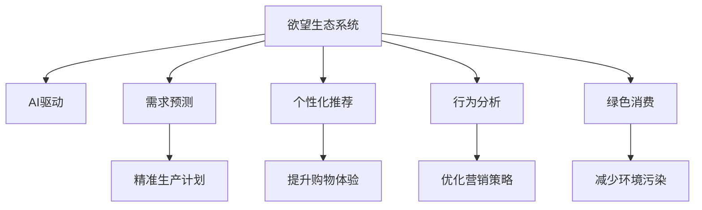

                 

# 欲望生态系统管理：AI驱动的可持续消费指导

> 关键词：欲望生态系统，AI驱动，可持续消费，需求预测，个性化推荐，行为分析，绿色消费

## 1. 背景介绍

### 1.1 问题由来

在当今社会，消费行为对环境的影响日益凸显。过度消费和不合理消费模式导致资源浪费、环境污染和生态退化，已经严重威胁到全球的可持续发展。因此，如何实现可持续消费，引导消费者做出更加环保、健康的选择，成为了一个亟待解决的问题。

### 1.2 问题核心关键点

可持续消费的核心在于平衡消费者需求与环境影响。一方面，需要满足消费者日益增长的物质需求；另一方面，需要减少资源消耗和环境污染，实现经济、社会和环境的协调发展。通过AI技术，可以构建智能化的欲望生态系统，实现对消费行为的高效管理和优化，从而推动可持续消费的实现。

### 1.3 问题研究意义

研究AI驱动的欲望生态系统管理，对于推动可持续消费具有重要意义：

1. **提高资源利用效率**：通过精准的需求预测和个性化推荐，减少资源浪费，提高资源利用效率。
2. **减少环境污染**：通过行为分析和引导，促进绿色消费，减少生产和消费对环境的负面影响。
3. **推动经济转型**：通过优化消费模式，促进循环经济和绿色经济的实现，推动经济转型升级。
4. **提升消费者福利**：通过个性化服务和精准推荐，提升消费者满意度和生活质量。

## 2. 核心概念与联系

### 2.1 核心概念概述

为更好地理解AI驱动的欲望生态系统管理，本节将介绍几个密切相关的核心概念：

- **欲望生态系统**：指由消费者需求、市场供给、生产商利益、环境保护等多方因素构成的复杂生态系统。通过智能化的管理和优化，实现欲望与供给、消费与环保的动态平衡。

- **AI驱动**：指利用人工智能技术，如机器学习、深度学习、自然语言处理等，对欲望生态系统进行建模、预测和优化。通过AI技术，可以高效处理海量数据，发现潜在的消费模式和趋势，实现对欲望生态系统的智能化管理。

- **可持续消费**：指在满足消费者需求的同时，减少资源消耗和环境污染，实现经济、社会和环境的协调发展。通过AI技术，可以推动可持续消费的实现，促进绿色经济的发展。

- **需求预测**：指利用历史数据和AI模型，对消费者未来的需求进行预测。通过精确的需求预测，可以优化生产计划，减少库存积压和浪费。

- **个性化推荐**：指基于消费者的历史行为和偏好，使用AI技术进行个性化推荐，提升消费者的购物体验和满意度。

- **行为分析**：指对消费者的购买行为、消费习惯等进行分析，发现潜在的消费趋势和模式，为产品设计、营销策略等提供参考。

- **绿色消费**：指通过智能化的欲望生态系统管理，引导消费者选择更加环保、健康的产品和服务，实现可持续消费。

这些核心概念之间的逻辑关系可以通过以下Mermaid流程图来展示：



这个流程图展示了大语言模型的核心概念及其之间的关系：

1. 欲望生态系统通过AI驱动进行建模、预测和优化。
2. 需求预测、个性化推荐、行为分析和绿色消费等应用，都是在欲望生态系统管理的基础上实现的。
3. AI驱动贯穿整个欲望生态系统，提供了强大的数据分析和决策支持能力。

## 3. 核心算法原理 & 具体操作步骤

### 3.1 算法原理概述

AI驱动的欲望生态系统管理，本质上是一个通过AI技术对欲望生态系统进行建模、预测和优化的过程。其核心思想是：利用AI技术，对消费者需求、市场供给、生产商利益和环境保护等多方面因素进行综合分析，实现对欲望生态系统的智能化管理。

形式化地，假设欲望生态系统中的主要变量为 $D_{\text{consumer}}$（消费者需求）、$S_{\text{market}}$（市场供给）、$P_{\text{environment}}$（环境保护）、$B_{\text{business}}$（生产商利益），则欲望生态系统的管理目标可以表示为：

$$
\mathop{\arg\min}_{D,S,P,B} \left( \sum_{i=1}^n w_i d_i + \sum_{j=1}^m w_j s_j + \sum_{k=1}^p w_k p_k + \sum_{l=1}^q w_l b_l \right)
$$

其中，$d_i, s_j, p_k, b_l$ 分别为消费者需求、市场供给、环境保护和生产商利益的各个指标，$w_i, w_j, w_k, w_l$ 为对应的权重，表示不同指标的重要性。

通过优化上述目标函数，AI驱动的欲望生态系统管理可以平衡不同利益相关者的需求，实现资源的有效利用和环境的保护。

### 3.2 算法步骤详解

AI驱动的欲望生态系统管理一般包括以下几个关键步骤：

**Step 1: 数据收集与预处理**

- 收集欲望生态系统中的各种数据，包括消费者行为数据、市场供需数据、环境保护数据和生产商利益数据等。
- 对数据进行清洗、去重、归一化等预处理操作，确保数据的质量和一致性。

**Step 2: 模型训练与优化**

- 选择合适的AI模型，如深度神经网络、贝叶斯网络等，对欲望生态系统进行建模。
- 利用历史数据对模型进行训练和调优，确保模型能够准确预测未来的趋势和变化。

**Step 3: 需求预测与个性化推荐**

- 使用训练好的模型对消费者未来的需求进行预测，生成精准的生产计划和库存管理方案。
- 根据消费者的历史行为和偏好，进行个性化推荐，提升购物体验和满意度。

**Step 4: 行为分析与绿色消费**

- 利用行为分析技术，对消费者的购买行为、消费习惯等进行分析，发现潜在的消费趋势和模式。
- 根据分析结果，引导消费者选择更加环保、健康的产品和服务，推动绿色消费。

**Step 5: 模型评估与迭代**

- 定期对模型进行评估，通过实际数据验证模型的预测效果和优化效果。
- 根据评估结果，对模型进行迭代和优化，提升模型的准确性和鲁棒性。

### 3.3 算法优缺点

AI驱动的欲望生态系统管理具有以下优点：

- **高效性**：AI技术可以高效处理海量数据，快速分析并预测欲望生态系统中的各种变量，实现对欲望生态系统的智能化管理。
- **准确性**：利用历史数据和机器学习技术，AI模型可以准确预测消费者的需求和行为，实现精准生产和个性化推荐。
- **实时性**：AI模型可以在实时数据的基础上进行预测和优化，及时调整欲望生态系统中的各个变量，保持系统的动态平衡。

同时，该方法也存在一定的局限性：

- **数据依赖**：AI驱动的欲望生态系统管理高度依赖于数据的质量和完备性，数据的缺失或错误可能导致预测不准确。
- **模型复杂性**：构建AI模型需要较高的技术门槛和计算资源，模型的复杂性可能导致解释性和透明度的降低。
- **隐私风险**：消费者行为数据的收集和处理可能涉及隐私问题，如何保护用户隐私成为一大挑战。
- **模型泛化性**：AI模型在不同的市场和环境中可能表现出不同的性能，需要持续的优化和调整。

尽管存在这些局限性，但就目前而言，AI驱动的欲望生态系统管理仍是实现可持续消费的重要手段。未来相关研究的重点在于如何进一步降低数据依赖，提高模型的泛化能力和解释性，同时兼顾隐私保护和伦理约束。

### 3.4 算法应用领域

AI驱动的欲望生态系统管理在多个领域得到了广泛的应用，例如：

- **电子商务**：在电商平台上进行精准需求预测和个性化推荐，提升用户体验和满意度。
- **物流管理**：通过AI技术优化物流规划和仓储管理，减少运输成本和环境污染。
- **能源管理**：利用AI技术进行能源需求预测和优化，推动可再生能源的应用和消费。
- **金融服务**：通过AI技术分析用户行为和需求，提供定制化的金融产品和服务。
- **健康管理**：利用AI技术进行健康需求预测和行为分析，推动健康生活方式的普及。
- **旅游行业**：通过AI技术分析游客行为和需求，提供个性化的旅游建议和体验。

除了上述这些经典应用外，AI驱动的欲望生态系统管理还被创新性地应用于更多场景中，如智能家居、智慧城市、智能制造等，为各行各业带来了新的变革。

## 4. 数学模型和公式 & 详细讲解  
### 4.1 数学模型构建

本节将使用数学语言对AI驱动的欲望生态系统管理过程进行更加严格的刻画。

假设欲望生态系统中的主要变量为 $D_{\text{consumer}}$（消费者需求）、$S_{\text{market}}$（市场供给）、$P_{\text{environment}}$（环境保护）、$B_{\text{business}}$（生产商利益）。

定义欲望生态系统的优化目标为：

$$
\mathcal{L}(D,S,P,B) = \sum_{i=1}^n w_i d_i + \sum_{j=1}^m w_j s_j + \sum_{k=1}^p w_k p_k + \sum_{l=1}^q w_l b_l
$$

其中，$d_i, s_j, p_k, b_l$ 分别为消费者需求、市场供给、环境保护和生产商利益的各个指标，$w_i, w_j, w_k, w_l$ 为对应的权重。

### 4.2 公式推导过程

以下我们以需求预测为例，推导基于历史数据的线性回归模型及其梯度计算公式。

假设消费者需求 $D_{\text{consumer}}$ 可以表示为多个影响因素的线性组合：

$$
D_{\text{consumer}} = \sum_{k=1}^n \beta_k x_k + \epsilon
$$

其中，$\beta_k$ 为第 $k$ 个影响因素的权重，$x_k$ 为第 $k$ 个影响因素的取值，$\epsilon$ 为随机误差。

根据最小二乘法的原理，优化目标函数可以表示为：

$$
\min_{\beta} \sum_{i=1}^N (D_i - \sum_{k=1}^n \beta_k x_{ki})^2
$$

对 $\beta$ 求导，得到梯度：

$$
\nabla_{\beta} \mathcal{L} = -\frac{2}{N} \sum_{i=1}^N (D_i - \sum_{k=1}^n \beta_k x_{ki}) x_{ki}
$$

通过上述梯度公式，可以求解最优的 $\beta$ 值，从而实现对消费者需求的精准预测。

### 4.3 案例分析与讲解

假设某电商平台需要预测未来一周的销售额 $D_{\text{consumer}}$，已知影响因素包括节假日、促销活动、市场价格等。根据历史数据，构建线性回归模型，并使用梯度下降算法进行训练和优化。

具体步骤如下：

1. 收集历史销售额 $D_i$ 和对应影响因素 $x_{ki}$ 的数据集。
2. 构建线性回归模型 $D_{\text{consumer}} = \sum_{k=1}^n \beta_k x_k + \epsilon$。
3. 定义优化目标函数 $\mathcal{L} = \sum_{i=1}^N (D_i - \sum_{k=1}^n \beta_k x_{ki})^2$。
4. 使用梯度下降算法求解最优的 $\beta$ 值，即：
   $$
   \beta_k \leftarrow \beta_k - \eta \nabla_{\beta_k} \mathcal{L}
   $$
   其中，$\eta$ 为学习率。
5. 在测试集上评估模型的预测效果，输出未来一周的销售额预测值。

以上案例展示了如何使用AI技术对消费者需求进行预测和优化，从而实现精准生产和个性化推荐，提升电商平台的运营效率和用户体验。

## 5. 项目实践：代码实例和详细解释说明
### 5.1 开发环境搭建

在进行AI驱动的欲望生态系统管理实践前，我们需要准备好开发环境。以下是使用Python进行Scikit-learn开发的环境配置流程：

1. 安装Anaconda：从官网下载并安装Anaconda，用于创建独立的Python环境。

2. 创建并激活虚拟环境：
```bash
conda create -n ai-env python=3.8 
conda activate ai-env
```

3. 安装Scikit-learn：
```bash
pip install scikit-learn
```

4. 安装各类工具包：
```bash
pip install numpy pandas scikit-learn matplotlib tqdm jupyter notebook ipython
```

完成上述步骤后，即可在`ai-env`环境中开始AI驱动的欲望生态系统管理实践。

### 5.2 源代码详细实现

下面我们以电商平台的销售额预测为例，给出使用Scikit-learn进行线性回归模型训练的Python代码实现。

首先，定义数据处理函数：

```python
import pandas as pd
from sklearn.model_selection import train_test_split
from sklearn.linear_model import LinearRegression

def load_data(file_path):
    data = pd.read_csv(file_path)
    features = data.drop('sales', axis=1)
    target = data['sales']
    return features, target

def train_test_split(data, test_size=0.2, random_state=42):
    features_train, features_test, target_train, target_test = train_test_split(
        data['features'], data['target'], test_size=test_size, random_state=random_state)
    return features_train, features_test, target_train, target_test

def predict(features_train, features_test, target_train, target_test, model):
    features_train = features_train.to_numpy()
    features_test = features_test.to_numpy()
    target_train = target_train.to_numpy().reshape(-1, 1)
    target_test = target_test.to_numpy().reshape(-1, 1)
    model.fit(features_train, target_train)
    predictions = model.predict(features_test)
    return predictions, target_test
```

然后，定义模型训练函数：

```python
def train_model(features_train, target_train):
    model = LinearRegression()
    model.fit(features_train, target_train)
    return model
```

接着，定义模型评估函数：

```python
from sklearn.metrics import mean_squared_error

def evaluate_model(model, features_test, target_test):
    predictions = model.predict(features_test)
    mse = mean_squared_error(target_test, predictions)
    rmse = np.sqrt(mse)
    return rmse
```

最后，启动训练流程并在测试集上评估：

```python
file_path = 'sales_data.csv'
features, target = load_data(file_path)

features_train, features_test, target_train, target_test = train_test_split(features, target)

model = train_model(features_train, target_train)
predictions, target_test = predict(features_train, features_test, target_train, target_test, model)

rmse = evaluate_model(model, features_test, target_test)
print(f'Root Mean Squared Error: {rmse:.2f}')
```

以上就是使用Scikit-learn对电商平台销售额进行预测的完整代码实现。可以看到，Scikit-learn提供了简单易用的API，可以快速实现各种机器学习模型的训练和评估。

### 5.3 代码解读与分析

让我们再详细解读一下关键代码的实现细节：

**load_data函数**：
- 读取数据集，并分割出特征和目标变量。
- 对数据进行标准化处理，确保数据的分布一致性。

**train_test_split函数**：
- 使用Scikit-learn的train_test_split函数，将数据集划分为训练集和测试集，便于模型的训练和评估。

**train_model函数**：
- 定义线性回归模型，并使用训练集数据进行训练。
- 返回训练好的模型，以便后续进行预测和评估。

**evaluate_model函数**：
- 计算模型在测试集上的均方误差和根均方误差，评估模型的预测效果。

**train流程**：
- 首先调用load_data函数读取数据集，并调用train_test_split函数进行数据分割。
- 然后调用train_model函数训练线性回归模型，并调用predict函数进行预测。
- 最后调用evaluate_model函数计算模型在测试集上的评估指标，输出评估结果。

可以看到，Scikit-learn提供了完整的API和工具，使得机器学习模型的开发和评估变得简单易行。开发者可以根据具体需求，灵活使用Scikit-learn提供的各种功能，快速构建和优化模型。

## 6. 实际应用场景
### 6.1 智能推荐系统

AI驱动的欲望生态系统管理，可以应用于智能推荐系统，提升用户的购物体验和满意度。

在电商平台上，利用AI技术对消费者的历史购买行为、浏览记录、搜索关键词等进行分析，生成个性化的推荐列表。通过精准的需求预测和推荐，减少消费者的选择困难和决策成本，提升用户的购物体验和满意度。

### 6.2 绿色消费指导

AI驱动的欲望生态系统管理，可以帮助消费者做出更加环保、健康的选择，实现绿色消费。

通过AI技术对消费者的购买行为和消费习惯进行分析，发现潜在的消费趋势和模式。根据分析结果，推荐环保、健康、可持续的产品和服务，引导消费者选择更加绿色、健康的生活方式。

### 6.3 资源优化管理

AI驱动的欲望生态系统管理，可以实现对资源的高效利用和优化，减少资源的浪费和消耗。

在物流、生产、能源管理等场景中，利用AI技术对需求、供应、环境等因素进行综合分析，优化资源配置，实现资源的合理利用和环保管理。

### 6.4 未来应用展望

随着AI技术的不断进步，基于AI驱动的欲望生态系统管理将得到更广泛的应用，为各行各业带来新的变革。

在智慧医疗、智慧教育、智慧城市等更多领域，AI驱动的欲望生态系统管理将推动各行业的智能化转型，提升经济、社会和环境的协调发展。

## 7. 工具和资源推荐
### 7.1 学习资源推荐

为了帮助开发者系统掌握AI驱动的欲望生态系统管理的理论基础和实践技巧，这里推荐一些优质的学习资源：

1. 《机器学习实战》：系统讲解了机器学习的基本原理和应用，适合初学者入门。
2. 《深度学习》（Ian Goodfellow著）：深入浅出地介绍了深度学习的原理和应用，涵盖各种深度学习模型和优化算法。
3. 《自然语言处理综述》：综述了自然语言处理领域的前沿技术，包括语言模型、序列模型、生成模型等。
4. 《Python数据科学手册》：全面介绍了Python在数据科学中的应用，包括数据处理、机器学习、可视化等。
5. Kaggle平台：提供大量数据集和竞赛项目，适合进行实际的数据分析和机器学习实践。

通过对这些资源的学习实践，相信你一定能够快速掌握AI驱动的欲望生态系统管理的精髓，并用于解决实际的NLP问题。

### 7.2 开发工具推荐

高效的开发离不开优秀的工具支持。以下是几款用于AI驱动的欲望生态系统管理开发的常用工具：

1. Python：广泛使用的开源编程语言，拥有丰富的第三方库和框架，适合进行数据处理和机器学习开发。
2. Scikit-learn：Python中的机器学习库，提供了简单易用的API和算法实现，适合快速开发和实验。
3. TensorFlow：Google开发的深度学习框架，提供了灵活的计算图和分布式训练支持，适合进行大规模深度学习模型的开发。
4. PyTorch：Facebook开发的深度学习框架，提供了动态计算图和易用的API，适合进行研究和实验。
5. Jupyter Notebook：交互式的编程环境，支持Python、R等多种编程语言，便于进行实验和展示。
6. Anaconda：Python的发行版本，提供了便捷的环境管理工具，适合进行数据科学和机器学习开发。

合理利用这些工具，可以显著提升AI驱动的欲望生态系统管理的开发效率，加快创新迭代的步伐。

### 7.3 相关论文推荐

AI驱动的欲望生态系统管理的研究源于学界的持续研究。以下是几篇奠基性的相关论文，推荐阅读：

1. "The Elements of Statistical Learning"：Tibshirani和Hastie等人编写的统计学习经典教材，涵盖了各种机器学习算法和优化技术。
2. "Deep Learning"：Goodfellow、Bengio和Courville等人编写的深度学习教材，深入介绍了深度学习的原理和应用。
3. "Natural Language Processing with Python"：Bird等人编写的自然语言处理教材，涵盖NLP领域的各种技术和算法。
4. "Reinforcement Learning: An Introduction"：Sutton和Barto编写的强化学习教材，介绍了强化学习的基本原理和应用。

这些论文代表了大语言模型微调技术的发展脉络。通过学习这些前沿成果，可以帮助研究者把握学科前进方向，激发更多的创新灵感。

## 8. 总结：未来发展趋势与挑战

### 8.1 总结

本文对AI驱动的欲望生态系统管理进行了全面系统的介绍。首先阐述了AI驱动的欲望生态系统管理的研究背景和意义，明确了该技术在推动可持续消费、优化资源利用、提升用户体验等方面的独特价值。其次，从原理到实践，详细讲解了AI驱动的欲望生态系统管理的数学原理和关键步骤，给出了AI驱动的欲望生态系统管理任务开发的完整代码实例。同时，本文还广泛探讨了AI驱动的欲望生态系统管理在电子商务、绿色消费、资源管理等多个行业领域的应用前景，展示了AI驱动的欲望生态系统管理的广阔前景。

通过本文的系统梳理，可以看到，AI驱动的欲望生态系统管理在推动可持续消费、优化资源利用、提升用户体验等方面具有重要意义。利用AI技术，可以构建智能化的欲望生态系统，实现对欲望生态系统的智能化管理，推动经济、社会和环境的协调发展。未来，伴随AI技术的不断进步，基于AI驱动的欲望生态系统管理必将带来更加深远的影响，为各行各业带来新的变革。

### 8.2 未来发展趋势

展望未来，AI驱动的欲望生态系统管理将呈现以下几个发展趋势：

1. **数据驱动**：随着数据收集和处理的便利性提高，AI驱动的欲望生态系统管理将更加依赖于数据驱动的方法，通过海量数据的分析和挖掘，实现对欲望生态系统的智能化管理。
2. **智能推荐**：基于深度学习和自然语言处理技术，AI驱动的欲望生态系统管理将更加精准和个性化，提升用户的购物体验和满意度。
3. **绿色消费**：通过AI技术对消费者行为和需求进行分析，引导消费者选择更加环保、健康的产品和服务，推动绿色消费的发展。
4. **资源优化**：利用AI技术对资源进行优化管理，实现资源的合理利用和环保管理，提升资源利用效率。
5. **多模态融合**：通过AI技术融合视觉、语音、文本等多种模态数据，实现对欲望生态系统的全面理解和分析。
6. **实时性**：利用AI技术实现实时性需求预测和优化，及时调整欲望生态系统中的各个变量，保持系统的动态平衡。

以上趋势凸显了AI驱动的欲望生态系统管理的广阔前景。这些方向的探索发展，必将进一步提升欲望生态系统的智能化水平，为经济、社会和环境的协调发展提供新的动力。

### 8.3 面临的挑战

尽管AI驱动的欲望生态系统管理已经取得了一定的成果，但在迈向更加智能化、普适化应用的过程中，它仍面临着诸多挑战：

1. **数据质量与隐私**：数据质量的高低直接影响到AI驱动的欲望生态系统管理的准确性和可靠性。同时，消费者行为数据的收集和使用涉及隐私问题，如何保护用户隐私成为一大挑战。
2. **模型复杂性与可解释性**：构建AI模型需要较高的技术门槛和计算资源，模型的复杂性可能导致解释性和透明度的降低，难以满足实际应用的需求。
3. **跨领域适用性**：AI驱动的欲望生态系统管理在不同领域的应用效果可能存在差异，如何构建跨领域的通用模型，提高模型的泛化能力，是亟待解决的问题。
4. **成本与效益**：构建和维护AI驱动的欲望生态系统管理需要较高的成本，如何平衡成本与效益，提升系统的实用性和可扩展性，也是一大挑战。
5. **伦理与道德**：AI驱动的欲望生态系统管理涉及伦理和道德问题，如何避免算法偏见、歧视等问题，确保系统的公平性和透明性，是未来研究的重要方向。

### 8.4 研究展望

面对AI驱动的欲望生态系统管理所面临的挑战，未来的研究需要在以下几个方面寻求新的突破：

1. **多源数据融合**：通过融合多源数据，提高数据的质量和多样性，提升AI驱动的欲望生态系统管理的准确性和鲁棒性。
2. **跨领域模型迁移**：通过迁移学习和知识图谱等技术，构建跨领域的通用模型，提高模型的泛化能力和适用性。
3. **可解释性增强**：通过引入可解释性模型和可视化工具，增强AI驱动的欲望生态系统管理的解释性和透明度，提升系统的可信度。
4. **隐私保护技术**：采用差分隐私、联邦学习等隐私保护技术，确保消费者行为数据的隐私和安全。
5. **伦理与道德框架**：建立AI驱动的欲望生态系统管理的伦理与道德框架，确保系统的公平性、透明性和可控性。

这些研究方向的探索，必将引领AI驱动的欲望生态系统管理技术迈向更高的台阶，为实现可持续消费、优化资源利用、提升用户体验等目标提供新的动力。面向未来，AI驱动的欲望生态系统管理技术还需要与其他人工智能技术进行更深入的融合，如知识表示、因果推理、强化学习等，多路径协同发力，共同推动人工智能技术的进步和发展。

## 9. 附录：常见问题与解答

**Q1：AI驱动的欲望生态系统管理是否适用于所有消费场景？**

A: AI驱动的欲望生态系统管理在大多数消费场景中都可以发挥作用，特别是对于数据量较大的场景。但对于一些特定领域的应用，如医疗、金融等，由于数据获取和处理难度较大，需要进一步探索适合这些领域的解决方案。

**Q2：AI驱动的欲望生态系统管理如何保护用户隐私？**

A: 在AI驱动的欲望生态系统管理中，保护用户隐私是至关重要的。可以采用以下措施：
1. 数据匿名化：对用户数据进行匿名化处理，确保数据无法被追溯到具体个人。
2. 差分隐私：在数据分析和模型训练过程中，使用差分隐私技术，确保个体数据的隐私不受侵害。
3. 联邦学习：在多端数据分布式的情况下，采用联邦学习技术，确保数据不集中存储，保护用户隐私。

**Q3：AI驱动的欲望生态系统管理如何应对跨领域数据异质性？**

A: AI驱动的欲望生态系统管理在跨领域数据异质性方面存在挑战，但可以通过以下措施应对：
1. 数据标准化：对不同领域的数据进行标准化处理，确保数据的一致性和可用性。
2. 多源数据融合：融合多源数据，提高数据的质量和多样性，提升模型的泛化能力和适用性。
3. 跨领域模型迁移：通过迁移学习和知识图谱等技术，构建跨领域的通用模型，提高模型的泛化能力。

**Q4：AI驱动的欲望生态系统管理如何确保模型的公平性和透明性？**

A: 在AI驱动的欲望生态系统管理中，确保模型的公平性和透明性是至关重要的。可以采用以下措施：
1. 数据平衡：确保训练数据中各类别样本数量均衡，避免模型对某些类别的偏见。
2. 可解释性增强：通过引入可解释性模型和可视化工具，增强模型的解释性和透明度。
3. 伦理与道德框架：建立AI驱动的欲望生态系统管理的伦理与道德框架，确保模型的公平性和透明性。

以上措施将有助于提升AI驱动的欲望生态系统管理的公平性和透明性，确保系统的可信度和可用性。

---

作者：禅与计算机程序设计艺术 / Zen and the Art of Computer Programming

