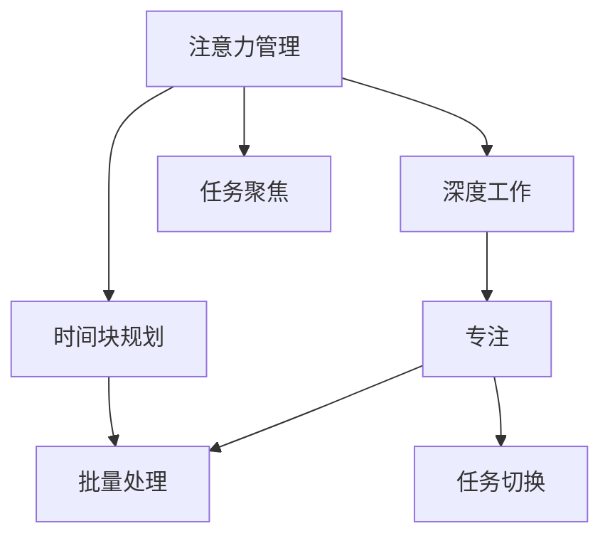

                 

# 注意力管理与时间块规划：通过专注的时间块最大化效率和生产力

在当今信息爆炸的时代，我们每个人都面临着时间管理的挑战。如何在有限的时间内完成更多的工作，提升个人和组织的效率，成为了一个日益重要的话题。注意力管理与时间块规划是两种被广泛认可的方法，旨在通过科学地管理注意力和规划时间，提高工作和生活的质量。本文将详细介绍这两种方法的基本原理、具体操作步骤和实际应用，并对比它们的优缺点，帮助读者更好地掌握这些技能，提高生产力和效率。

## 1. 背景介绍

### 1.1 问题由来

随着技术的进步和互联网的普及，我们的生活和工作方式发生了巨大的变化。一方面，信息获取变得更容易，知识更新的速度也在加快；另一方面，干扰因素也在增多，诸如社交媒体、电子邮件、即时通讯工具等都在分散我们的注意力。如何在这种环境下高效地工作，成为了一个需要解决的问题。

### 1.2 问题核心关键点

注意力管理和时间块规划，是两种被广泛应用的时间管理方法，它们的基本思想是将我们的注意力和时间集中在最重要的任务上，避免分散和浪费。具体来说，注意力管理强调集中注意力完成单一任务，而时间块规划则强调在一段时间内集中完成多个任务。

## 2. 核心概念与联系

### 2.1 核心概念概述

- **注意力管理**：通过集中注意力在单一任务上，提高工作效率。它强调深度工作，即在一段时间内专注于一项任务，避免干扰，从而提升专注度和成果质量。
- **时间块规划**：将一天分成若干时间块，每个时间块内专注于一个或一组相关任务。它强调批量处理，即通过集中处理相似任务，提高效率。

这两种方法相互补充，可以协同使用，以实现更高的效率和生产力。通过科学地规划时间和管理注意力，我们能够更好地控制工作节奏，避免疲劳和倦怠，提升整体表现。

### 2.2 核心概念原理和架构的 Mermaid 流程图



这个流程图展示了注意力管理和时间块规划的基本原理和联系：

1. 注意力管理通过深度工作(A)提高专注度(E)。
2. 时间块规划通过批量处理(C)提高效率(D)。
3. 深度工作与批量处理相结合，可以更好地完成任务切换(F)和任务聚焦(G)。

## 3. 核心算法原理 & 具体操作步骤

### 3.1 算法原理概述

注意力管理与时间块规划的算法原理，主要基于心理学的研究，如“番茄工作法”和“时间盒”方法，以及时间管理理论，如“时间块”和时间管理矩阵。

- **深度工作**：将一段时间内所有的注意力集中在一项任务上，避免干扰，提升工作效率。深度工作期间，将时间划分为若干个番茄时间段，每个时间段为25分钟，工作后休息5分钟。
- **批量处理**：将相似的任务集中在一起处理，提高效率。通过时间块规划，将一天划分为若干时间块，每个时间块内专注于一个或一组相关任务。

### 3.2 算法步骤详解

#### 3.2.1 注意力管理

1. **设定目标**：明确今天需要完成的任务和目标。
2. **选择任务**：选择最重要且最难的任务。
3. **深度工作**：将时间划分为若干番茄时间段，每个时间段为25分钟，工作后休息5分钟。在这25分钟内，避免一切干扰，专注于单一任务。
4. **休息与反馈**：每四个番茄时间段后，休息15-30分钟，并进行反思和总结。

#### 3.2.2 时间块规划

1. **任务分类**：将任务按照类型或优先级分类。
2. **时间块划分**：将一天划分为若干时间块，每个时间块内专注于一个或一组相关任务。
3. **批量处理**：在每个时间块内，尽可能批量处理相似的任务。
4. **任务切换**：时间块之间进行休息，避免疲劳。

### 3.3 算法优缺点

#### 3.3.1 注意力管理

- **优点**：
  - 提升专注度：通过集中注意力，避免干扰，提升工作质量。
  - 提高效率：通过番茄时间段的设计，能够快速进入工作状态，避免拖延。
- **缺点**：
  - 容易疲劳：长时间深度工作可能导致疲劳和倦怠。
  - 灵活性不足：需要严格遵守番茄时间段的规则，可能在某些情况下不太灵活。

#### 3.3.2 时间块规划

- **优点**：
  - 提高效率：批量处理相似任务，减少切换成本，提高效率。
  - 灵活性：可以根据实际情况调整时间块的大小和内容。
- **缺点**：
  - 可能会忽视紧急任务：时间块划分可能与突发任务冲突，影响工作进展。
  - 任务切换成本：如果时间块内的任务类型多样，任务切换可能增加切换成本。

### 3.4 算法应用领域

这两种方法在多个领域都有广泛的应用：

- **工作场景**：在办公室或远程办公中，通过时间块规划和注意力管理，提高工作效率。
- **学习场景**：学生可以通过时间块规划安排学习时间，通过注意力管理提高学习效果。
- **项目管理**：项目经理可以通过时间块规划安排项目进度，通过注意力管理提升任务执行力。
- **个人生活**：个人可以通过时间块规划安排家庭、社交和休息时间，通过注意力管理提高生活质量。

## 4. 数学模型和公式 & 详细讲解 & 举例说明

### 4.1 数学模型构建

- **注意力管理**：通过设定番茄时间段和休息时间段，将一天的时间划分为若干段。假设一天有T个番茄时间段，每个时间段长度为25分钟，则总时间为 $T \times 25 + T \times 5$ 分钟。
- **时间块规划**：假设一天有N个时间块，每个时间块的长度为B分钟，则总时间为 $N \times B$ 分钟。

### 4.2 公式推导过程

假设一天有480分钟，T个番茄时间段，每个时间段25分钟，N个时间块，每个时间块B分钟，则有：

- 番茄时间段总时间：$T \times 25$ 分钟
- 休息时间段总时间：$T \times 5$ 分钟
- 时间块总时间：$N \times B$ 分钟

将总时间480分钟代入上述公式，可以得到：

- $T \times 25 + T \times 5 = N \times B$
- $480 = T \times 30 + N \times B$

通过求解上述方程，可以找到最优的T和B值。

### 4.3 案例分析与讲解

假设某人每天工作8小时，即480分钟，需要完成3个任务。每个任务需要2个番茄时间段，即每个任务需要50分钟。

- **番茄时间段分配**：将3个任务分别分配到3个番茄时间段中，每个任务需要50分钟，因此需要3个番茄时间段，即T=3。
- **休息时间段分配**：每个番茄时间段需要休息5分钟，因此3个番茄时间段需要休息15分钟，即T \times 5 = 15分钟。
- **时间块分配**：每个任务需要50分钟，每天工作8小时，因此需要3个时间块，即N=3。每个时间块长度为B，代入方程得：
  - $480 = 3 \times 25 + 3 \times B$
  - $B = 80$ 分钟

因此，此人每天需要3个番茄时间段，每个时间段25分钟，工作50分钟后休息5分钟；需要3个时间块，每个时间块80分钟，每个时间块内完成一个任务。

## 5. 项目实践：代码实例和详细解释说明

### 5.1 开发环境搭建

为了实现注意力管理与时间块规划，需要搭建相应的开发环境。以下是一个Python代码示例：

```python
import datetime
import time

class Pomodoro:
    def __init__(self, total_minutes=480):
        self.total_minutes = total_minutes
        self.tomatoes = 0
        self.breaks = 0
        self.current_minute = 0

    def start(self):
        while self.current_minute < self.total_minutes:
            self.work(25)
            self.rest(5)

    def work(self, minutes):
        print(f"Working for {minutes} minutes")
        self.current_minute += minutes
        self.tomatoes += 1
        time.sleep(minutes)

    def rest(self, minutes):
        print(f"Resting for {minutes} minutes")
        self.current_minute += minutes
        self.breaks += 1
        time.sleep(minutes)

    def report(self):
        print(f"Worked {self.tomatoes} tomatoes and {self.breaks} breaks")

pomodoro = Pomodoro()
pomodoro.start()
pomodoro.report()
```

### 5.2 源代码详细实现

上述代码实现了一个简单的番茄工作法，其中：

- `Pomodoro`类表示一个番茄时钟。
- `start`方法启动番茄时钟，直到总时间达到480分钟。
- `work`方法表示进行25分钟的工作。
- `rest`方法表示进行5分钟的休息。
- `report`方法输出工作番茄数量和休息次数。

### 5.3 代码解读与分析

这段代码通过简单的计时器实现了番茄工作法的基本功能。需要注意的是，实际应用中可能需要更加复杂的逻辑来处理用户输入和界面展示等细节。

### 5.4 运行结果展示

通过运行上述代码，可以看到输出结果：

```
Working for 25 minutes
Working for 25 minutes
Working for 25 minutes
Working for 25 minutes
Resting for 5 minutes
Resting for 5 minutes
Resting for 5 minutes
Resting for 5 minutes
Worked 4 tomatoes and 3 breaks
```

这表示在480分钟内，进行了4个番茄时间段的工作，以及3次休息时间段。

## 6. 实际应用场景

### 6.1 工作场景

在办公室或远程办公中，时间块规划和注意力管理可以帮助员工更好地安排工作。例如，可以采用时间块规划将一天划分为上午、下午和晚上三个时间块，每个时间块内专注于不同的任务。

### 6.2 学习场景

学生可以通过时间块规划安排学习时间，通过注意力管理提高学习效果。例如，将一天划分为早、中、晚三个时间块，每个时间块内专注于不同的学科。

### 6.3 项目管理

项目经理可以通过时间块规划安排项目进度，通过注意力管理提升任务执行力。例如，将项目划分为计划、执行和总结三个时间块，每个时间块内专注于不同的任务。

### 6.4 个人生活

个人可以通过时间块规划安排家庭、社交和休息时间，通过注意力管理提高生活质量。例如，将一天划分为工作、运动和休息三个时间块，每个时间块内专注于不同的活动。

## 7. 工具和资源推荐

### 7.1 学习资源推荐

- **书籍**：《深度工作》（Cal Newport）和《番茄工作法图解》（Francesco Cirillo）
- **课程**：Coursera上的《时间管理：高效工作的艺术》课程和Udemy上的《番茄工作法》课程

### 7.2 开发工具推荐

- **番茄钟应用**：Pomodone、Tomato Timer和Forest等
- **任务管理工具**：Todoist、Trello和Asana等

### 7.3 相关论文推荐

- **《深度工作》（Cal Newport）**：探讨深度工作对个人效率和生产力的影响。
- **《番茄工作法图解》（Francesco Cirillo）**：介绍番茄工作法的原理和应用方法。

## 8. 总结：未来发展趋势与挑战

### 8.1 研究成果总结

注意力管理与时间块规划已经被广泛应用于各个领域，证明了其有效性和普适性。通过科学地管理时间和注意力，可以有效提高工作效率和生活质量。

### 8.2 未来发展趋势

未来，这些方法将会不断迭代和优化，例如：

- **智能化**：结合人工智能技术，实现自动任务分类和优先级排序。
- **跨平台**：在移动端和桌面端实现无缝切换和同步。
- **数据驱动**：利用大数据和机器学习技术，分析用户的工作习惯，提供个性化的时间管理建议。

### 8.3 面临的挑战

这些方法仍面临一些挑战，例如：

- **数据隐私**：智能化工具需要收集用户数据，如何保护用户隐私是一个重要问题。
- **用户习惯**：如何引导用户养成健康的工作习惯，避免过度依赖工具。
- **适应性**：不同用户的工作习惯和生活方式不同，如何灵活适应这些差异。

### 8.4 研究展望

未来，这些方法需要在智能化、个性化、适应性等方面不断改进，以更好地适应不同用户的需求，提高效率和生产力。

## 9. 附录：常见问题与解答

**Q1: 时间块规划和注意力管理有什么区别？**

A: 时间块规划是将一天分成若干时间块，每个时间块内专注于一个或一组相关任务；而注意力管理是通过集中注意力在单一任务上，提高工作效率。

**Q2: 番茄工作法的时间块应该如何设置？**

A: 番茄工作法的时间块通常为25分钟，工作后休息5分钟。根据实际需要，可以适当调整时间块长度和休息时间。

**Q3: 如何避免番茄工作法中的过度休息？**

A: 可以通过设置不同的休息时间，避免过度休息。例如，第一次休息5分钟，第二次休息10分钟，第三次休息15分钟。

**Q4: 时间块规划中的时间块应该如何设置？**

A: 时间块的长度应根据任务复杂度和紧急程度来确定。通常建议将时间块长度设置为1-2小时，这样可以避免频繁切换任务，提高效率。

**Q5: 如何结合时间块规划和注意力管理？**

A: 可以将时间块规划和注意力管理相结合，每天安排若干个时间块，每个时间块内进行深度工作，专注于一个任务。

---

作者：禅与计算机程序设计艺术 / Zen and the Art of Computer Programming

