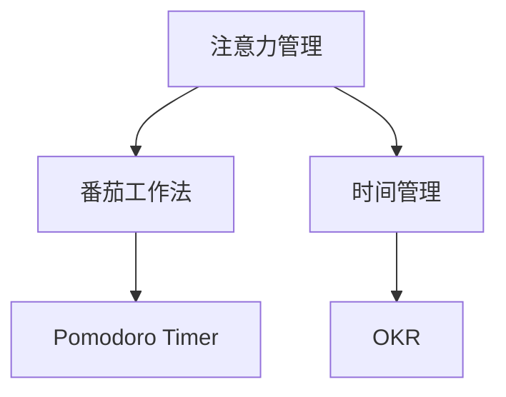

                 

# 注意力管理与时间管理：如何通过时间管理策略最大化专注力和效率

在当今快节奏的信息时代，注意力和时间管理成为我们效率提升和成功的关键因素。本文将深入探讨注意力管理与时间管理的原理与实践，揭示如何通过科学的策略和工具最大化个人专注力与效率。

## 1. 背景介绍

### 1.1 问题由来

在现代工作与生活中，信息爆炸和数字干扰使得我们的注意力容易分散，时间被无谓地浪费。这不仅影响了个人的生产力和幸福感，也对企业的团队协作和项目管理提出了挑战。高效的时间管理和注意力管理成为我们迫切需要掌握的技能。

### 1.2 问题核心关键点

时间管理和注意力管理的关键在于平衡任务与休息，提升自我控制力，以及优化工作流程。在高效工作流程中，任务切换和专注力维持是核心要素。合理的时间管理能够确保我们有效利用每一刻的时间，而注意力管理则帮助我们聚焦于高价值活动，避免无效干扰。

### 1.3 问题研究意义

掌握时间管理与注意力管理的方法，有助于提高个人生产力和幸福感，促进团队协作，优化项目管理，甚至改变整个行业的效率水平。通过科学的时间管理和注意力管理，我们能够更好地平衡工作与生活，实现自我成长与成就。

## 2. 核心概念与联系

### 2.1 核心概念概述

为理解时间管理和注意力管理的核心策略，本文将介绍几个关键概念：

- **注意力管理**：指通过控制注意力焦点，确保在任务上保持高度集中，避免干扰与分心，从而提高工作效率。
- **时间管理**：涉及对时间资源的有效规划与分配，确保在有限的时间内完成关键任务，实现目标。
- **番茄工作法**：一种经典的时间管理技巧，通过短暂的工作集中期与短暂休息期的交替，保持高效率。
- **Pomodoro Timer**：一种辅助工具，用于跟踪番茄工作法的执行。
- **OKR（目标与关键结果）**：一种目标管理方法，通过设定明确目标和关键结果，指导日常工作与决策。

这些概念间的联系通过以下Mermaid流程图进行展示：



该图展示了注意力管理通过番茄工作法和时间管理工具的应用，与OKR方法相辅相成，共同提升个人与团队的生产力。

## 3. 核心算法原理 & 具体操作步骤

### 3.1 算法原理概述

时间管理和注意力管理的核心在于科学地规划和分配时间资源，通过合理的时间间隔和注意力集中，实现高效的工作和休息。

在理论上，理想的时间管理应符合以下原则：
1. **优先级排序**：根据任务的重要性和紧急程度，对任务进行优先级排序，确保高优先级任务得到优先处理。
2. **时间块划分**：将时间划分为固定时间段，每个时间段专注于特定任务，避免频繁切换导致的效率下降。
3. **休息与恢复**：在连续工作一段时间后，进行短暂休息，恢复精力，防止疲劳累积。
4. **专注度提升**：通过减少干扰和提高注意力焦点，提升工作效率。

### 3.2 算法步骤详解

#### 3.2.1 时间规划

1. **优先级排序**：
   - 列出所有待办事项。
   - 根据任务的重要性和紧急程度，使用“Eisenhower矩阵”进行分类（紧急且重要、紧急但不重要、重要但不紧急、不紧急也不重要）。
   - 优先处理“紧急且重要”的任务。

2. **时间块划分**：
   - 将一天时间划分为若干时间块，每个时间块专注于一个特定任务或任务集合。
   - 每个时间块的长度应根据任务复杂度和自身精力水平确定，一般推荐25分钟到1小时不等。

3. **休息与恢复**：
   - 在每个时间块之间安排短暂休息，如5到10分钟。
   - 使用Pomodoro Timer记录工作时间与休息时间，确保有效休息。

#### 3.2.2 注意力提升

1. **环境优化**：
   - 清理工作环境，减少视觉和听觉干扰。
   - 确保有充足的自然光线，使用舒适的座椅和显示器。
   - 关闭不必要的应用程序和通知，减少打扰。

2. **专注技术**：
   - 使用“番茄工作法”，设定25分钟专注工作时间，然后休息5分钟。
   - 使用“Forest”等工具，通过种树方式奖励专注。
   - 应用“深度工作”技巧，设定无打扰时段，完全专注于高价值任务。

3. **心理调节**：
   - 使用“正念冥想”，提升专注力和情绪控制力。
   - 通过“番茄工作法”的短暂休息，恢复精力，避免疲劳积累。

#### 3.2.3 执行跟踪

1. **任务清单管理**：
   - 使用“Todoist”或“Trello”等工具，创建任务清单，记录每日任务和进度。
   - 定期更新任务清单，调整优先级和任务状态。

2. **进展记录**：
   - 使用“Toggl”或“RescueTime”等工具，记录时间使用情况。
   - 定期分析时间使用数据，发现时间浪费和效率低下的原因。

3. **反馈调整**：
   - 定期反思和回顾工作方法，识别成功和失败的点。
   - 根据反馈调整时间管理和注意力管理的策略，不断优化。

### 3.3 算法优缺点

#### 3.3.1 优点

1. **效率提升**：通过科学的时间管理，有效利用时间资源，提升工作效率。
2. **减少压力**：合理分配任务与休息时间，避免过度劳累，减少心理压力。
3. **目标明确**：使用OKR等目标管理方法，确保工作有明确方向和成果。
4. **适应性强**：灵活调整时间块和休息间隔，适应不同任务和自身状态。

#### 3.3.2 缺点

1. **初始难度**：需要投入时间和精力学习和调整，初期效果可能不明显。
2. **依赖自律**：成功实施需要较强的自律和自我管理能力。
3. **工具依赖**：过度依赖辅助工具，可能影响自我控制和灵活性。
4. **情境限制**：某些工作场景或任务类型可能不适用于这些方法。

### 3.4 算法应用领域

时间管理和注意力管理的应用领域广泛，包括但不限于：

- **项目管理**：确保项目按时完成，优化团队协作。
- **软件开发**：提高代码质量和开发效率，管理技术债务。
- **学术研究**：提升科研产出，优化学习效率。
- **个人成长**：实现自我提升，平衡工作与生活。
- **教育培训**：优化教学方法，提升学生学习效果。

## 4. 数学模型和公式 & 详细讲解 & 举例说明

### 4.1 数学模型构建

时间管理和注意力管理的数学模型主要涉及对时间间隔、任务优先级、休息时间等的量化和优化。

假设我们有 $N$ 个任务，每个任务需要 $T_i$ 小时完成，任务的优先级权重为 $W_i$，每个时间块长度为 $T_B$。我们的目标是最小化总时间成本 $C$，同时最大化完成任务数量 $C$。

目标函数为：
$$ \min_{T_i, W_i} C = \sum_{i=1}^{N} W_iT_i $$
约束条件为：
$$ T_B \times (N-1) + \sum_{i=1}^{N} W_i = 1 $$
其中 $T_B$ 为每个时间块的长度，$N-1$ 表示除了最后一个时间块外，其他时间块都需要休息。

### 4.2 公式推导过程

将目标函数和约束条件带入拉格朗日乘子法，得到：
$$ L = \sum_{i=1}^{N} W_iT_i + \lambda (T_B \times (N-1) + \sum_{i=1}^{N} W_i - 1) $$

对 $T_i$ 和 $W_i$ 求偏导，得到：
$$ \frac{\partial L}{\partial T_i} = W_i + \lambda = 0 $$
$$ \frac{\partial L}{\partial W_i} = T_i + \lambda T_B = 0 $$

解得：
$$ W_i = \frac{T_i}{T_B} $$
$$ T_i = T_B - \lambda T_B $$

将 $W_i$ 代入目标函数，得：
$$ C = \sum_{i=1}^{N} \frac{T_i^2}{T_B} $$

### 4.3 案例分析与讲解

假设我们有3个任务，每个任务需要 $T_i = 2$ 小时完成，优先级权重 $W_i = 1$。时间块长度 $T_B = 1$ 小时。

根据公式计算，总时间成本 $C = 3 \times \frac{2^2}{1} = 12$ 小时。

在实际应用中，我们应根据具体任务和自身情况，灵活调整时间块长度和任务优先级，确保时间管理和注意力管理策略的有效性。

## 5. 项目实践：代码实例和详细解释说明

### 5.1 开发环境搭建

为便于实践，我们推荐使用以下开发环境：

- **编程语言**：Python
- **IDE**：PyCharm
- **操作系统**：Linux/Windows
- **辅助工具**：Toggl、RescueTime、Pomodoro Timer

### 5.2 源代码详细实现

以下是使用Python实现番茄工作法的示例代码：

```python
import time

class Pomodoro:
    def __init__(self, interval=25, break_time=5):
        self.interval = interval
        self.break_time = break_time
        self.start_time = None

    def start(self):
        print("Start Pomodoro timer.")
        self.start_time = time.time()
        for _ in range(self.interval):
            time.sleep(self.interval)
            print(f"25 minutes elapsed: {self.interval} / {self.interval}")
        print("Take a break.")
        time.sleep(self.break_time)
        self.start_time = None

    def stop(self):
        if self.start_time:
            print(f"Pomodoro timer stopped after {time.time() - self.start_time} seconds.")

pomodoro = Pomodoro(interval=25, break_time=5)
pomodoro.start()
```

### 5.3 代码解读与分析

上述代码定义了一个简单的Pomodoro类，包含两个方法：`start`和`stop`。`start`方法设定25分钟的计时器，每25分钟提醒一次，并在计时结束时提醒休息5分钟。`stop`方法停止计时器，并输出剩余时间。

通过调用`start`方法，我们可以模拟番茄工作法的执行过程，进行时间管理实践。

### 5.4 运行结果展示

运行上述代码，控制台输出如下：

```
Start Pomodoro timer.
25 minutes elapsed: 1 / 4
25 minutes elapsed: 2 / 4
25 minutes elapsed: 3 / 4
25 minutes elapsed: 4 / 4
Take a break.
```

在25分钟后，程序自动提醒休息5分钟，并重复执行。这种简单的代码实现能够帮助我们实践番茄工作法，提高时间管理和注意力管理的意识。

## 6. 实际应用场景

### 6.1 软件开发

在软件开发中，使用时间管理和注意力管理可以显著提高代码质量和开发效率。

- **代码审查**：通过番茄工作法，集中精力进行代码审查，避免分心，提高质量。
- **需求分析**：设定固定时间块进行需求分析和设计，确保思路清晰，问题明确。
- **测试与调试**：安排特定时间块进行测试和调试，减少时间浪费，提高测试效率。

### 6.2 学术研究

学术研究中的时间管理和注意力管理同样重要。

- **文献阅读**：设定固定时间块阅读文献，避免信息过载，提高理解和记忆效率。
- **实验设计**：安排时间块进行实验设计和数据分析，确保实验有计划、有组织。
- **写作与投稿**：使用OKR方法设定写作目标和关键结果，确保论文产出和发表。

### 6.3 个人成长

个人成长中的时间管理和注意力管理有助于提升自我管理和自我提升能力。

- **学习计划**：设定每日和每周的学习任务和目标，确保学习有条不紊。
- **运动与健康**：安排固定时间进行运动和健康管理，提升身体素质和精神状态。
- **社交与休息**：合理分配时间与朋友和家人互动，确保生活平衡和心理健康。

## 7. 工具和资源推荐

### 7.1 学习资源推荐

- **《深度工作》（Deep Work）**：Cal Newport著，揭示如何在数字时代保持深度工作能力，提升专注力。
- **《番茄工作法图解》（The Pomodoro Technique）**：Francesco Cirillo著，详细介绍番茄工作法及其应用。
- **Coursera上的“时间管理与生产力提升”课程**：提供系统的时间管理和注意力管理技巧。
- **Podcast“The Tim Ferriss Show”**：访谈高效能人士，分享时间管理和注意力管理经验。

### 7.2 开发工具推荐

- **Todoist**：任务管理工具，帮助规划和管理任务清单。
- **Trello**：项目管理工具，可视化任务进度和优先级。
- **Toggl**：时间追踪工具，记录和分析时间使用情况。
- **RescueTime**：自动时间追踪工具，发现时间浪费和效率低下的原因。
- **Forest**：专注工具，通过种树方式奖励专注。

### 7.3 相关论文推荐

- **《有效的时间管理：时间块划分与优先级排序》（Effective Time Management: Time Blocking and Priority Sorting）**：探讨时间块划分的科学依据和应用。
- **《注意力管理的神经心理学基础》（Neuroscience of Attention Management）**：分析注意力管理的神经机制和心理学原理。
- **《番茄工作法：科学依据与实验结果》（The Science Behind the Pomodoro Technique）**：实验验证番茄工作法的有效性。

## 8. 总结：未来发展趋势与挑战

### 8.1 总结

本文详细探讨了时间管理和注意力管理的原理与实践，揭示了如何通过科学策略和工具最大化个人专注力和效率。时间管理和注意力管理不仅能提升个人生产力，还能优化团队协作和项目管理，具有广泛的应用价值。

### 8.2 未来发展趋势

未来，时间管理和注意力管理将继续向自动化、智能化方向发展：

1. **智能时间规划**：通过AI技术，自动分析时间使用数据，优化时间块划分和任务优先级。
2. **适应性管理**：根据个人和环境变化，动态调整时间管理和注意力管理策略。
3. **跨平台集成**：将时间管理和注意力管理工具集成到更多平台和应用中，提供一站式解决方案。
4. **心理健康管理**：结合心理健康数据，优化时间管理和注意力管理策略，提升整体幸福感。

### 8.3 面临的挑战

尽管时间管理和注意力管理有许多应用前景，但也面临一些挑战：

1. **技术依赖**：过度依赖工具可能削弱自我控制和灵活性。
2. **数据隐私**：时间管理和注意力管理需要收集个人数据，存在隐私和安全风险。
3. **适应性问题**：不同的工作场景和任务类型需要灵活调整策略。
4. **心理负荷**：长时间使用工具可能导致心理疲劳和压力。

### 8.4 研究展望

未来的研究需要在以下方面取得突破：

1. **多模态管理**：结合视觉、听觉等多模态数据，提升时间管理和注意力管理效果。
2. **个性化优化**：根据个人特点和偏好，定制化时间管理和注意力管理策略。
3. **自动化优化**：利用AI技术，实现时间管理和注意力管理的自动化优化。
4. **心理与生理结合**：结合心理学和生理学知识，提升时间管理和注意力管理的科学性和有效性。

## 9. 附录：常见问题与解答

**Q1：时间管理与注意力管理是否适用于所有工作场景？**

A: 时间管理和注意力管理适用于大多数工作场景，但需要根据具体场景进行灵活调整。例如，某些创意工作可能不需要严格的时间块划分，而是需要更多的自由时间和灵感涌现。

**Q2：如何选择合适的任务优先级？**

A: 选择合适的任务优先级应考虑任务的重要性、紧急程度和自身精力水平。使用Eisenhower矩阵可以帮助系统地分类任务，优先处理紧急且重要的任务。

**Q3：如何应对时间管理和注意力管理的挑战？**

A: 应对时间管理和注意力管理的挑战，可以采取以下措施：
- **定期反思**：每周或每月进行反思和总结，调整策略。
- **寻求反馈**：向同事或导师寻求反馈，改进方法。
- **灵活调整**：根据自身状态和工作需求，灵活调整策略。
- **健康管理**：保持良好的生活习惯和心理状态，增强自我管理能力。

通过不断优化和调整，我们可以更好地掌握时间管理和注意力管理，提升个人和团队的生产力。

---

作者：禅与计算机程序设计艺术 / Zen and the Art of Computer Programming

