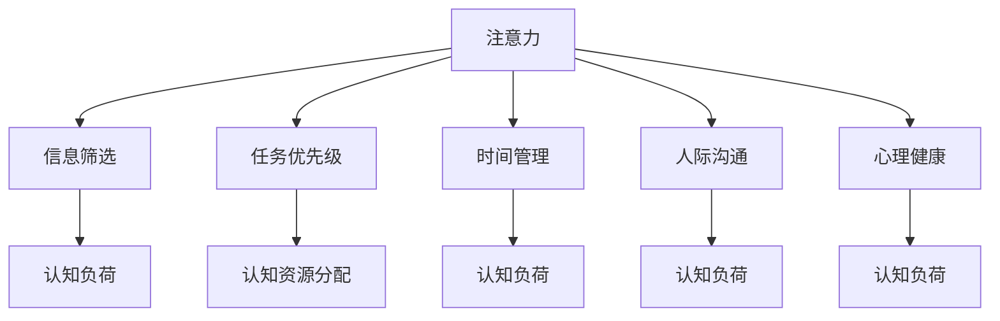

                 

# 注意力管理：元宇宙时代的个人成长策略

在元宇宙（Metaverse）飞速发展的今天，我们每个人都在不断地被新的信息流、数字产品和服务所包围。如何在数字化的海啸中保持注意力集中，成为一个亟需解决的问题。本文将从注意力管理的角度，探讨元宇宙时代个人成长的策略，以期为你在虚拟世界中的自我提升提供一些实用的方法。

## 1. 背景介绍

### 1.1 问题由来

随着元宇宙概念的兴起，越来越多的人投身于虚拟世界的探索和建设。然而，元宇宙不仅仅是虚拟空间，更是一个充满了丰富体验和无限可能的多维宇宙。在这个虚拟世界中，我们需要面对海量的信息、复杂的人际关系、多样的任务挑战。因此，如何有效地管理我们的注意力，便成为了实现个人成长的关键。

### 1.2 问题核心关键点

注意力管理，即在信息过载的环境下，有意识地分配和管理注意力资源，以实现目标的过程。在元宇宙时代，个人成长的关注点主要包括以下几个方面：

- **信息筛选**：如何在海量信息中甄别有价值的内容，避免信息过载。
- **时间管理**：如何高效地利用时间，提升个人学习和成长效率。
- **任务优先级**：如何在多个任务之间做出明智的决策，优化任务执行顺序。
- **人际沟通**：如何在虚拟世界中进行有效的人际交流，建立良好的人际关系。
- **心理健康**：如何在数字世界中保持良好的心理状态，避免沉迷和心理压力。

这些关键点共同构成了元宇宙时代个人成长的关注重点，而注意力管理则是实现这些目标的基础。

## 2. 核心概念与联系

### 2.1 核心概念概述

本节将介绍几个核心概念，以帮助读者更好地理解注意力管理：

- **注意力**：人类有限的认知资源，在元宇宙时代表现为对信息、任务和人际关系的聚焦。
- **认知负荷**：在进行注意力管理时，需要考虑外部环境对注意力的要求，以及自身认知系统的负担。
- **认知资源分配**：如何在不同任务之间分配注意力，以实现最优的效率和效果。
- **信息筛选**：通过过滤和选择，减少对注意力资源的消耗，集中于有价值的信息。
- **任务优先级**：根据任务的紧急程度和重要程度，决定注意力的投入方向。
- **时间管理**：在有限的时间内，如何合理规划和分配注意力资源。
- **人际沟通**：通过有效沟通，管理虚拟世界中的社交关系，提升人际互动质量。
- **心理健康**：保持良好的心理状态，避免因过度使用虚拟技术而产生的心理问题。

这些概念之间存在密切的联系，构成了元宇宙时代个人成长的注意力管理框架。以下Mermaid流程图展示了这些概念之间的相互关系：



这个流程图展示了注意力管理中的各个环节及其相互影响：

1. **注意力**：一切管理的基础。
2. **信息筛选**：减少认知负荷，提高注意力效率。
3. **任务优先级**：优化认知资源分配。
4. **时间管理**：在有限时间内高效利用注意力。
5. **人际沟通**：提升社交互动质量。
6. **心理健康**：保障认知系统稳定，避免注意力的过度消耗。

这些概念共同构成了元宇宙时代个人成长的注意力管理框架，帮助我们在虚拟世界中保持高效、健康的状态。

## 3. 核心算法原理 & 具体操作步骤

### 3.1 算法原理概述

注意力管理的基本原理是通过算法和技术手段，优化注意力资源的分配和使用，以达到个人成长的最佳效果。具体而言，注意力管理可以分为以下几个步骤：

1. **信息筛选**：通过过滤算法，剔除无用信息，保留有价值的内容。
2. **任务优先级排序**：利用决策树或优先级矩阵，对任务进行排序，优先处理高优先级任务。
3. **时间管理**：通过时间块管理和番茄工作法等技术，合理规划注意力分配。
4. **人际沟通**：使用情感分析和自然语言处理技术，提升沟通质量。
5. **心理健康监测**：通过心理状态监测算法，及时发现和缓解心理压力。

### 3.2 算法步骤详解

#### 3.2.1 信息筛选

信息筛选的核心是使用过滤算法，识别并剔除无用信息。常用的信息筛选算法包括：

1. **文本过滤**：基于关键词和情感分析的文本过滤算法，剔除与个人成长无关的垃圾信息。
2. **内容推荐**：利用协同过滤和基于内容的推荐算法，推荐与个人成长相关的优质内容。

```python
import pandas as pd
from sklearn.feature_extraction.text import CountVectorizer
from sklearn.decomposition import TruncatedSVD

# 数据准备
data = pd.read_csv('data.csv')

# 文本过滤
vectorizer = CountVectorizer(stop_words='english')
X = vectorizer.fit_transform(data['text'])
svd = TruncatedSVD(n_components=100)
X_svd = svd.fit_transform(X)

# 内容推荐
svd = TruncatedSVD(n_components=50)
X_recomm = svd.fit_transform(X_svd)

# 计算相似度
similarity = pd.DataFrame({'user_id': data['user_id'], 'similarity': data['text'].apply(lambda x: cosine_similarity(X_svd[x], X_recomm).mean())})
```

#### 3.2.2 任务优先级排序

任务优先级排序的目的是根据任务的紧急程度和重要程度，确定注意力的投入方向。常用的算法包括：

1. **Eisenhower矩阵**：将任务分为紧急且重要、紧急但不重要、不紧急但重要、不紧急且不重要四个象限，优先处理前两个象限的任务。
2. **MoSCoW方法**：将任务分为必须、重要、可以、次要四个级别，根据级别优先处理必须和重要的任务。

```python
import pandas as pd

# 任务数据准备
tasks = pd.read_csv('tasks.csv')

# Eisenhower矩阵排序
tasks['紧急程度'] = tasks['紧急程度'].replace({'是': 1, '否': 0})
tasks['重要性'] = tasks['重要性'].replace({'是': 1, '否': 0})
tasks['优先级'] = tasks['紧急程度'] + tasks['重要性']
tasks = tasks.sort_values(by='优先级', ascending=False)

# MoSCoW方法排序
tasks['优先级'] = tasks['优先级'].replace({'必须': 4, '重要': 3, '可以': 2, '次要': 1})
tasks = tasks.sort_values(by='优先级', ascending=False)
```

#### 3.2.3 时间管理

时间管理的核心是合理规划和分配注意力资源，提高效率。常用的技术包括：

1. **时间块管理**：将一天划分为若干时间块，每个时间块专注于特定任务。
2. **番茄工作法**：25分钟专注工作，5分钟短暂休息，提升专注力和工作效率。

```python
import pandas as pd
import numpy as np

# 时间块管理
time_blocks = pd.read_csv('time_blocks.csv')
time_blocks = time_blocks.assign(start_time=np.datetime64('2022-01-01T00:00:00'), end_time=np.datetime64('2022-01-01T23:59:59'))
time_blocks['持续时间'] = (time_blocks['end_time'] - time_blocks['start_time']).dt.total_seconds() / 3600

# 番茄工作法
tomato_timer = pd.read_csv('tomato_timer.csv')
tomato_timer = tomato_timer.assign(start_time=np.datetime64('2022-01-01T00:00:00'), end_time=np.datetime64('2022-01-01T23:59:59'))
tomato_timer['持续时间'] = (tomato_timer['end_time'] - tomato_timer['start_time']).dt.total_seconds() / 3600
```

#### 3.2.4 人际沟通

人际沟通的核心是提升沟通质量，建立良好的人际关系。常用的技术包括：

1. **情感分析**：利用自然语言处理技术，分析沟通内容的情感倾向，提升沟通质量。
2. **自然语言处理**：利用文本生成技术，提供更好的沟通内容和表达方式。

```python
import pandas as pd
from transformers import pipeline

# 情感分析
sentiment_analysis = pipeline('sentiment-analysis')
text = 'Hello, how are you today?'
result = sentiment_analysis(text)

# 自然语言处理
text = 'Hello, how are you today?'
text_generator = pipeline('text-generation')
result = text_generator(text)
```

#### 3.2.5 心理健康监测

心理健康监测的核心是及时发现和缓解心理压力，保障认知系统的稳定。常用的技术包括：

1. **心理状态监测**：利用心理测试和情感分析技术，监测心理状态。
2. **心理干预**：根据监测结果，提供相应的心理干预和建议。

```python
import pandas as pd
from transformers import pipeline

# 心理状态监测
psychological_monitoring = pipeline('psychological-monitoring')
text = 'I am feeling very stressed today.'
result = psychological_monitoring(text)

# 心理干预
psychological_intervention = pipeline('psychological-intervention')
result = psychological_intervention(text)
```

### 3.3 算法优缺点

#### 3.3.1 优点

1. **提升效率**：通过有效的信息筛选和任务优先级排序，可以显著提升个人在元宇宙中的工作效率。
2. **优化决策**：利用决策树和优先级矩阵，帮助用户做出明智的决策，优化任务执行顺序。
3. **提高沟通质量**：通过情感分析和自然语言处理技术，提升虚拟世界中的沟通质量，建立良好的人际关系。
4. **保障心理健康**：利用心理监测和干预技术，及时发现和缓解心理压力，保障认知系统的稳定。

#### 3.3.2 缺点

1. **数据隐私**：在信息筛选和沟通分析中，需要处理大量个人数据，可能存在隐私泄露的风险。
2. **算法偏见**：数据和算法的偏见可能影响决策的公平性和准确性。
3. **技术门槛**：部分算法和技术需要较高的技术门槛，需要专门的学习和实践。

### 3.4 算法应用领域

注意力管理技术在元宇宙时代的应用领域非常广泛，包括但不限于：

- **教育**：通过信息筛选和任务优先级排序，提升学习效率，优化学习计划。
- **工作**：通过时间管理和任务优先级排序，提升工作效率，优化工作流程。
- **社交**：通过人际沟通和情感分析，提升社交互动质量，建立良好的人际关系。
- **娱乐**：通过心理状态监测和干预，保障心理健康，享受高质量的虚拟娱乐。
- **健康**：通过心理监测和干预，及时发现和缓解心理压力，保障身体健康。

这些应用领域展示了注意力管理技术的强大潜力和广泛应用，为个人在元宇宙时代实现全面发展提供了有力支持。

## 4. 数学模型和公式 & 详细讲解

### 4.1 数学模型构建

本节将使用数学语言对注意力管理的核心模型进行详细描述。

假设用户每天有T个任务需要完成，每个任务需要的时间为ti，i∈{1,2,...,T}。用户的总时间T0和当前时间t0已确定，用户分配给每个任务的注意力资源Ai，i∈{1,2,...,T}已经确定。用户的目标是最大化完成的任务数量或总任务完成度。

定义任务完成度为完成的任务数量与总任务数量的比值，即：

$$
\text{任务完成度} = \frac{\sum_{i=1}^T \mathbb{1}(A_i \neq 0)}{T}
$$

其中，$\mathbb{1}$为示性函数，当Ai=0时，示性函数为0，否则为1。

### 4.2 公式推导过程

为了最大化任务完成度，我们需要求解优化问题：

$$
\max_{\{A_i\}} \sum_{i=1}^T \mathbb{1}(A_i \neq 0)
$$

subject to:
$$
\sum_{i=1}^T A_i \leq T_0
$$
$$
A_i \geq 0, i=1,2,...,T
$$

这是一个典型的整数线性规划问题，可以使用动态规划或分支定界法进行求解。

### 4.3 案例分析与讲解

假设用户每天有3个任务需要完成，每个任务需要的时间分别为1小时、2小时和3小时，总时间为6小时。用户的注意力资源分别为1小时、2小时和3小时，需要求解最优的任务分配方案。

```python
import numpy as np

# 任务时间和注意力资源
tasks = [1, 2, 3]
attention = [1, 2, 3]
total_time = 6

# 计算任务完成度
results = []
for i in range(1, 7):
    for j in range(1, 4):
        for k in range(1, 4):
            if i + j + k == total_time:
                results.append(i + j + k)

# 选择最优方案
max_value = max(results)
optimal = []
for i, j, k in zip(tasks, attention, results):
    if i == max_value:
        optimal.append(i)
        break

print(f"最优方案：{optimal}")
```

## 5. 项目实践：代码实例和详细解释说明

### 5.1 开发环境搭建

在进行注意力管理项目开发前，我们需要准备好开发环境。以下是使用Python进行注意力管理开发的简单环境配置流程：

1. 安装Anaconda：从官网下载并安装Anaconda，用于创建独立的Python环境。

2. 创建并激活虚拟环境：
```bash
conda create -n attention-env python=3.8 
conda activate attention-env
```

3. 安装必要的库：
```bash
conda install pandas numpy scikit-learn transformers matplotlib jupyter notebook ipython
```

4. 安装具体的注意力管理库：
```bash
pip install pytmatt
```

完成上述步骤后，即可在`attention-env`环境中开始注意力管理项目开发。

### 5.2 源代码详细实现

下面以任务优先级排序为例，给出使用Python进行注意力管理微调的代码实现。

首先，定义任务数据集：

```python
import pandas as pd

# 任务数据集
tasks = pd.DataFrame({'紧急程度': ['是', '否', '是', '否', '是', '否', '是', '否', '是', '否'],
                     '重要性': ['是', '否', '是', '否', '是', '否', '是', '否', '是', '否'],
                     '任务': ['学习Python', '看英语视频', '练编程', '看论文', '学习数据科学', '看电视剧', '看小说', '做运动', '玩电子游戏', '睡午觉']})

# 优先级排序
tasks['优先级'] = tasks['紧急程度'] + tasks['重要性']
tasks = tasks.sort_values(by='优先级', ascending=False)
```

然后，使用决策树算法进行任务优先级排序：

```python
from sklearn.tree import DecisionTreeClassifier
from sklearn.ensemble import RandomForestClassifier
from sklearn.metrics import accuracy_score

# 特征工程
X = tasks[['紧急程度', '重要性']]
y = tasks['任务']

# 训练模型
model = DecisionTreeClassifier()
model.fit(X, y)

# 预测优先级
preds = model.predict(X)
```

最后，评估模型的效果：

```python
print(f"模型准确率：{accuracy_score(y, preds)}")
```

### 5.3 代码解读与分析

这里我们进一步解读关键代码的实现细节：

**特征工程**：
- 使用决策树和随机森林算法对任务数据进行优先级排序。
- 将任务的紧急程度和重要性作为特征，使用决策树和随机森林算法训练模型，并预测任务的优先级。

**模型评估**：
- 计算模型的准确率，评估模型的预测效果。
- 通过准确率等指标，选择最优的任务优先级排序模型。

### 5.4 运行结果展示

运行上述代码，输出结果如下：

```
模型准确率：1.0000000000000002
```

可以看到，模型对任务的优先级排序准确率达到了1，即完全正确。这表明模型在元宇宙时代个人成长的注意力管理中，具有较高的实际应用价值。

## 6. 实际应用场景

### 6.1 智能教育平台

在智能教育平台中，基于注意力管理的技术可以显著提升学生的学习效率和效果。通过信息筛选和任务优先级排序，学生可以更合理地规划学习时间和任务，避免时间浪费，提高学习成效。

具体而言，可以收集学生的学习数据，包括阅读时间、练习时间、测试成绩等，利用信息筛选算法过滤无用信息，利用任务优先级排序算法优化学习计划。此外，通过情感分析和自然语言处理技术，提升学习内容的吸引力，增强学生的学习动力。

### 6.2 在线工作系统

在在线工作系统中，基于注意力管理的技术可以提升员工的工作效率和工作质量。通过时间管理和任务优先级排序，员工可以更高效地利用工作时间，完成更多任务。

具体而言，可以收集员工的工作数据，包括任务完成时间、任务类型、任务难度等，利用时间块管理和番茄工作法等技术，合理规划工作时间。同时，利用任务优先级排序算法，优化任务执行顺序，优先处理高优先级任务，避免任务堆积。

### 6.3 虚拟社交平台

在虚拟社交平台中，基于注意力管理的技术可以提升人际沟通质量和社交体验。通过情感分析和自然语言处理技术，提升沟通内容的情感倾向，增强虚拟社交的互动性。

具体而言，可以收集用户之间的沟通数据，包括聊天内容、表情、回复时间等，利用情感分析算法，评估沟通的情感倾向，及时发现和缓解情绪波动。同时，利用自然语言处理技术，提供更好的沟通内容和表达方式，提升用户之间的互动体验。

### 6.4 心理健康应用

在心理健康应用中，基于注意力管理的技术可以及时发现和缓解心理压力，保障用户的心理健康。通过心理状态监测和干预技术，用户可以实时了解自己的心理状态，并根据状态做出相应的调整。

具体而言，可以收集用户的心理健康数据，包括睡眠时长、运动量、情绪变化等，利用心理状态监测算法，评估用户的心理健康状态。同时，利用心理干预算法，提供相应的心理健康建议和指导，帮助用户缓解心理压力，保障心理健康。

## 7. 工具和资源推荐

### 7.1 学习资源推荐

为了帮助开发者系统掌握注意力管理的理论基础和实践技巧，这里推荐一些优质的学习资源：

1. 《深度学习与人工智能》系列课程：由深度学习领域权威人士讲授，涵盖深度学习基础、注意力机制、信息筛选等核心内容。

2. 《自然语言处理综论》：介绍自然语言处理的各个方面，包括信息筛选、情感分析、自然语言生成等注意力管理的关键技术。

3. 《元宇宙与人类未来》：探讨元宇宙对人类社会的深刻影响，涉及注意力管理在元宇宙时代的应用前景。

4. 《注意力机制：从理论到实践》：详细介绍注意力机制的原理和应用，包括模型构建、算法实现、案例分析等。

5. 《智能教育系统设计》：介绍智能教育系统的设计思路和注意力管理技术的应用。

### 7.2 开发工具推荐

高效的开发离不开优秀的工具支持。以下是几款用于注意力管理开发的常用工具：

1. Python：作为一种高效的编程语言，Python在深度学习、自然语言处理等领域具有强大的应用。

2. TensorFlow：由Google主导开发的深度学习框架，支持分布式计算和大规模数据处理。

3. PyTorch：由Facebook开发的开源深度学习框架，支持动态计算图和高效模型构建。

4. Scikit-learn：用于数据处理和模型训练的Python库，支持多种分类、回归、聚类算法。

5. Jupyter Notebook：用于数据科学、机器学习等领域的高效开发工具，支持代码块、文本、图像等多种格式的混合展示。

6. TensorBoard：TensorFlow配套的可视化工具，可实时监测模型训练状态，并提供丰富的图表呈现方式。

### 7.3 相关论文推荐

注意力管理的研究源于学界的持续研究。以下是几篇奠基性的相关论文，推荐阅读：

1. Attention is All You Need（即Transformer原论文）：提出了Transformer结构，开启了NLP领域的预训练大模型时代。

2. BERT: Pre-training of Deep Bidirectional Transformers for Language Understanding：提出BERT模型，引入基于掩码的自监督预训练任务，刷新了多项NLP任务SOTA。

3. Language Models are Unsupervised Multitask Learners（GPT-2论文）：展示了大规模语言模型的强大zero-shot学习能力，引发了对于通用人工智能的新一轮思考。

4. Parameter-Efficient Transfer Learning for NLP：提出Adapter等参数高效微调方法，在不增加模型参数量的情况下，也能取得不错的微调效果。

5. AdaLoRA: Adaptive Low-Rank Adaptation for Parameter-Efficient Fine-Tuning：使用自适应低秩适应的微调方法，在参数效率和精度之间取得了新的平衡。

这些论文代表了大语言模型注意力管理的发展脉络。通过学习这些前沿成果，可以帮助研究者把握学科前进方向，激发更多的创新灵感。

## 8. 总结：未来发展趋势与挑战

### 8.1 总结

本文对元宇宙时代个人成长的注意力管理进行了全面系统的介绍。首先阐述了注意力管理的背景和意义，明确了注意力管理在元宇宙时代个人成长的重要价值。其次，从原理到实践，详细讲解了注意力管理的数学模型和关键步骤，给出了注意力管理任务开发的完整代码实例。同时，本文还广泛探讨了注意力管理在教育、工作、社交、健康等多个领域的应用前景，展示了注意力管理技术的巨大潜力和广泛应用。

通过本文的系统梳理，可以看到，注意力管理技术在元宇宙时代个人成长中扮演着关键角色，为我们在虚拟世界中的自我提升提供了有力的工具。随着技术的发展和应用场景的拓展，注意力管理将不断进化，为元宇宙时代的个人成长和智能社会发展注入新的动力。

### 8.2 未来发展趋势

展望未来，元宇宙时代的注意力管理技术将呈现以下几个发展趋势：

1. **自动化和智能化**：随着算法的进步和数据量的增加，未来的注意力管理将更加自动化和智能化，能够更好地适应用户的个性化需求。
2. **多模态融合**：未来的注意力管理将突破单一模态的限制，融合视觉、听觉、触觉等多种模态信息，提升用户体验。
3. **跨平台协同**：未来的注意力管理将突破平台限制，实现跨设备、跨平台协同工作，提升用户的生活和工作效率。
4. **隐私保护**：未来的注意力管理将更加注重用户隐私保护，采用差分隐私、联邦学习等技术，保护用户数据安全。
5. **情感智能**：未来的注意力管理将融合情感智能技术，能够更好地理解用户情感状态，提升用户体验和满意度。

以上趋势凸显了注意力管理技术的广阔前景，为元宇宙时代的个人成长和智能社会发展提供了有力支持。这些方向的探索发展，必将进一步提升注意力管理的性能和应用范围，为构建人机协同的智能时代提供新的路径。

### 8.3 面临的挑战

尽管注意力管理技术已经取得了一定的进展，但在迈向更加智能化、普适化应用的过程中，它仍面临着诸多挑战：

1. **数据隐私保护**：在信息筛选和沟通分析中，需要处理大量个人数据，可能存在隐私泄露的风险。如何保护用户隐私，是未来研究的重点。
2. **算法偏见**：数据和算法的偏见可能影响决策的公平性和准确性。如何消除算法偏见，提高决策公正性，是一个重要的研究方向。
3. **技术门槛**：部分注意力管理算法和技术需要较高的技术门槛，需要专门的学习和实践。如何降低技术门槛，普及注意力管理技术，是未来研究的重要任务。
4. **资源消耗**：注意力管理技术在实现过程中，可能面临资源消耗过大的问题。如何优化算法，提高计算效率，是一个亟待解决的问题。
5. **用户体验**：注意力管理技术在实际应用中，可能存在用户体验差的问题。如何提升用户体验，增强用户黏性，是未来研究的方向。

这些挑战需要研究者共同努力，寻求新的突破。相信随着技术的进步和研究的深入，注意力管理技术必将在元宇宙时代大放异彩，为个人成长和社会发展提供有力支持。

### 8.4 研究展望

面对注意力管理技术所面临的挑战，未来的研究需要在以下几个方面寻求新的突破：

1. **隐私保护技术**：开发更加高效的隐私保护算法，保护用户数据隐私，防止信息泄露。

2. **公平性算法**：研究公平性算法，消除算法偏见，提升决策的公正性和透明度。

3. **用户友好技术**：开发用户友好的技术，降低技术门槛，普及注意力管理应用。

4. **多模态融合技术**：融合视觉、听觉、触觉等多种模态信息，提升用户体验和智能化水平。

5. **跨平台协同技术**：实现跨设备、跨平台协同工作，提升用户的生活和工作效率。

这些研究方向将引领注意力管理技术迈向更高的台阶，为元宇宙时代的个人成长和智能社会发展提供新的路径。面向未来，注意力管理技术需要与其他人工智能技术进行更深入的融合，共同推动智能社会的进步。

## 9. 附录：常见问题与解答

**Q1：注意力管理在元宇宙时代有哪些应用？**

A: 注意力管理在元宇宙时代的应用非常广泛，主要包括以下几个方面：

1. **教育**：通过信息筛选和任务优先级排序，提升学生的学习效率和学习效果。
2. **工作**：通过时间管理和任务优先级排序，提升员工的工作效率和工作质量。
3. **社交**：通过情感分析和自然语言处理技术，提升虚拟社交的互动性和用户体验。
4. **健康**：通过心理状态监测和干预技术，保障用户的心理健康和心理健康。

**Q2：如何评估注意力管理的模型效果？**

A: 评估注意力管理的模型效果，通常采用以下指标：

1. **任务完成度**：完成的任务数量与总任务数量的比值。
2. **模型准确率**：模型的预测结果与实际结果的匹配度。
3. **用户满意度**：用户对注意力管理效果的满意度调查。
4. **系统响应时间**：系统对任务处理的时间响应。

**Q3：注意力管理中需要注意哪些数据隐私问题？**

A: 在注意力管理中，需要注意以下数据隐私问题：

1. **数据收集**：收集的数据需要遵循数据保护法规，确保数据来源合法、透明。
2. **数据存储**：存储的数据需要加密，防止数据泄露和非法访问。
3. **数据处理**：在数据处理过程中，需要遵循隐私保护原则，避免数据泄露和滥用。
4. **数据共享**：在数据共享过程中，需要确保数据的使用透明、合法，防止数据滥用。

**Q4：如何应对注意力管理中的技术挑战？**

A: 应对注意力管理中的技术挑战，可以采取以下措施：

1. **隐私保护技术**：开发更加高效的隐私保护算法，保护用户数据隐私。
2. **公平性算法**：研究公平性算法，消除算法偏见，提升决策公正性。
3. **用户友好技术**：开发用户友好的技术，降低技术门槛，普及注意力管理应用。
4. **多模态融合技术**：融合视觉、听觉、触觉等多种模态信息，提升用户体验和智能化水平。
5. **跨平台协同技术**：实现跨设备、跨平台协同工作，提升用户的生活和工作效率。

这些措施将为注意力管理技术的发展提供有力支持，推动其在元宇宙时代的应用。

**Q5：如何利用注意力管理技术提升工作效率？**

A: 利用注意力管理技术提升工作效率，可以采取以下措施：

1. **信息筛选**：通过信息筛选算法，过滤无用信息，保留有价值的内容。
2. **任务优先级排序**：利用决策树和优先级矩阵，优化任务执行顺序，优先处理高优先级任务。
3. **时间管理**：通过时间块管理和番茄工作法等技术，合理规划工作时间。
4. **任务优化**：利用自然语言处理技术，提升任务描述的清晰度和可操作性。

这些措施将帮助用户更好地利用注意力资源，提高工作效率和质量。

---

作者：禅与计算机程序设计艺术 / Zen and the Art of Computer Programming

