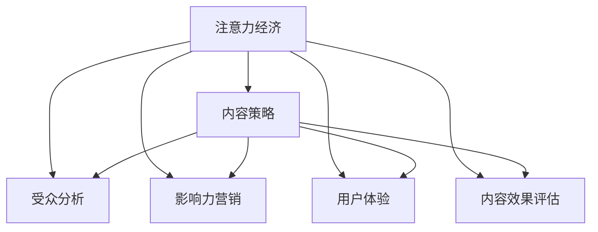

                 

# 注意力经济与内容策略规划与实践：为受众创建有影响力的内容

> 关键词：注意力经济,内容策略,社交媒体,受众分析,影响力营销,用户体验

## 1. 背景介绍

### 1.1 问题由来

在信息爆炸的时代，注意力成为最稀缺的资源。传统媒体时代，人们获取信息主要依靠报纸、电视等有限的渠道，但互联网和社交媒体的普及，彻底颠覆了这一格局。信息过载、误导性信息泛滥，使得人们对于有价值的内容越来越难以分辨。

### 1.2 问题核心关键点

注意力经济的核心在于如何吸引和保持受众的注意力，从而将注意力转化为经济价值。在内容生态中，制定科学合理的内容策略，提升内容质量，是增强内容影响力的关键。本文聚焦于基于数据分析和机器学习的内容策略规划与实践，以期为内容创作者和营销人员提供实用的技术指引。

### 1.3 问题研究意义

内容策略规划与实践是互联网和社交媒体时代成功运营的基石。合理的内容策略不仅能够提高内容的曝光率和点击率，还能增强用户粘性和忠诚度，进而带来更多的流量和收入。

本文研究的目的在于：
- 分析注意力经济的特点，提出有效的注意力吸引策略。
- 通过数据科学方法，指导内容创作者制定科学的策略。
- 分享实际案例，展示内容策略在实际运营中的应用效果。
- 展望未来发展趋势，为内容生态的持续优化提供参考。

## 2. 核心概念与联系

### 2.1 核心概念概述

为更好地理解注意力经济与内容策略，本节将介绍几个密切相关的核心概念：

- 注意力经济（Attention Economy）：指在信息过载的时代，通过吸引受众的注意力来获取经济价值的现象。内容创造者通过优质的内容吸引受众的关注，从而实现品牌曝光和用户转化。

- 内容策略（Content Strategy）：指基于受众分析、市场研究等，制定具有明确目标和方向的内容创作和传播方案。内容策略的目标在于提升内容的曝光率、点击率和互动率，增强品牌影响力。

- 受众分析（Audience Analysis）：指通过数据分析和调研，理解目标受众的需求、兴趣和行为，从而制定更具针对性的内容策略。

- 影响力营销（Influencer Marketing）：指通过具有一定影响力的意见领袖或网红，在社交媒体上推广品牌和内容，吸引更多普通受众的关注。

- 用户体验（User Experience, UX）：指内容从设计到传播的各个环节，给用户带来的整体感受和满意度。优质的用户体验能够提高用户粘性和忠诚度，增强品牌美誉度。

- 内容效果评估（Content Performance Metrics）：指通过量化指标（如阅读量、转发量、互动率等）来评估内容的效果，为策略调整提供依据。

这些核心概念之间的逻辑关系可以通过以下Mermaid流程图来展示：



这个流程图展示了一些关键概念的相互关系，即：

1. 注意力经济是内容策略制定的基础，吸引受众的注意力是经济价值转化的前提。
2. 内容策略需要结合受众分析，了解目标受众的需求和兴趣，制定更具针对性的方案。
3. 影响力营销可以通过意见领袖或网红的推广，进一步扩大内容的覆盖范围和影响力。
4. 用户体验是内容策略的执行细节，优质的用户体验能够增强用户粘性和品牌美誉度。
5. 内容效果评估是内容策略的反馈环节，通过量化指标评估内容的效果，为策略优化提供数据支持。

## 3. 核心算法原理 & 具体操作步骤

### 3.1 算法原理概述

基于数据分析和机器学习的内容策略规划与实践，其核心在于：
1. 收集和分析用户行为数据，理解受众需求和兴趣。
2. 利用机器学习算法，挖掘受众特征和内容效果，进行模型预测。
3. 根据预测结果，制定和调整内容策略，提高内容的曝光率和点击率。

具体而言，内容策略的制定包括以下几个步骤：
1. 数据收集与预处理：收集用户行为数据（如浏览记录、点击行为等），并进行清洗和预处理。
2. 受众特征分析：利用聚类、分类等算法，对受众进行细分，理解不同群体的需求和兴趣。
3. 内容效果建模：利用回归、分类等算法，建立内容曝光、点击、互动等效果的预测模型。
4. 策略优化与调整：根据模型预测结果，调整内容策略，如内容主题、形式、发布时间等，提升内容效果。

### 3.2 算法步骤详解

以下是具体的算法步骤，每一步将详细讲解：

**Step 1: 数据收集与预处理**

1. 数据源选择：确定数据收集的来源，如社交媒体、网站分析工具等。
2. 数据收集：通过API接口、爬虫等方式，获取用户行为数据。
3. 数据清洗与预处理：去除噪音和异常值，填充缺失值，标准化数据格式。

**Step 2: 受众特征分析**

1. 数据特征工程：提取用户行为数据中的关键特征，如浏览时长、点击路径、社交网络关系等。
2. 特征编码与选择：将数据特征进行编码，选择对受众分析最有意义的特征。
3. 聚类与分类：利用K-Means、PCA、SVM等算法，对受众进行聚类或分类，理解不同受众群体的特征。

**Step 3: 内容效果建模**

1. 目标设定：确定内容效果预测的目标，如点击率、转发率等。
2. 模型选择：根据目标选择合适的预测模型，如线性回归、决策树、随机森林等。
3. 模型训练与验证：使用训练集训练模型，使用验证集进行参数调优和模型选择。
4. 模型评估与优化：使用测试集评估模型效果，根据结果进行模型优化。

**Step 4: 策略优化与调整**

1. 内容策略设计：根据受众特征和模型预测结果，设计具有针对性的内容策略。
2. 策略实施与测试：在实际环境中实施内容策略，使用A/B测试等方式评估效果。
3. 策略迭代与优化：根据测试结果，不断迭代和优化内容策略，提升效果。

### 3.3 算法优缺点

基于数据分析和机器学习的内容策略规划与实践具有以下优点：
1. 数据驱动：通过数据科学方法，制定科学合理的内容策略，避免主观偏见。
2. 效果可量化：通过模型预测，量化内容效果，为策略调整提供依据。
3. 动态优化：通过持续测试和迭代，不断优化内容策略，提高效果。

但同时，该方法也存在以下局限性：
1. 数据质量要求高：需要大量高质量的数据才能获得准确的预测结果。
2. 模型复杂度高：模型选择和调优较为复杂，需要专业知识和技能。
3. 结果依赖性强：模型预测结果可能受到数据偏差和特征选择的影响。
4. 人机协同：模型预测结果需要结合人工经验进行综合判断。

### 3.4 算法应用领域

基于数据分析和机器学习的内容策略规划与实践，在以下领域得到了广泛应用：

1. **社交媒体运营**：利用用户行为数据，优化社交媒体内容的发布策略，提高品牌曝光率和用户互动。
2. **广告投放**：通过受众分析，选择目标受众，设计具有针对性的广告内容，提升广告效果。
3. **内容营销**：结合受众特征和内容效果，制定内容营销方案，提升内容传播力和影响力。
4. **用户推荐系统**：通过用户行为预测，设计个性化推荐策略，提高用户粘性和转化率。
5. **SEO优化**：利用内容效果模型，优化网站内容，提升搜索引擎排名和流量。
6. **用户行为分析**：通过受众分析，理解用户行为模式，优化产品设计和服务体验。

## 4. 数学模型和公式 & 详细讲解 & 举例说明

### 4.1 数学模型构建

本节将使用数学语言对内容策略规划与实践的数学模型进行更加严格的刻画。

记用户行为数据为 $D=\{x_i\}_{i=1}^N$，其中 $x_i$ 为第 $i$ 个用户的浏览记录，包括访问时间、访问路径、浏览时长等特征。设内容策略为 $C$，内容策略效果为 $y$，目标为最大化 $y$。

定义内容策略 $C$ 的效果函数 $f(x,C)$，表示在内容策略 $C$ 下，用户行为数据 $x$ 的效果。则内容策略优化的目标函数为：

$$
\mathop{\arg\min}_{C} \sum_{i=1}^N \|y_i - f(x_i,C)\|^2
$$

其中 $\|.\|$ 为范数，$\|y_i - f(x_i,C)\|^2$ 为损失函数，用于衡量模型预测效果与真实效果之间的差异。

### 4.2 公式推导过程

以点击率预测为例，进行公式推导：

设点击率目标为 $y_i$，内容策略为 $C$，效果函数为 $f(x_i,C)$，则有：

$$
f(x_i,C) = g(w_i \cdot x_i + b_i)
$$

其中 $w_i$ 和 $b_i$ 为模型参数，$g(.)$ 为激活函数（如Sigmoid函数）。

目标函数可写为：

$$
\mathop{\arg\min}_{w_i,b_i} \sum_{i=1}^N \|y_i - g(w_i \cdot x_i + b_i)\|^2
$$

假设 $w_i$ 和 $b_i$ 已知，则目标函数可写为：

$$
\mathop{\arg\min}_{C} \sum_{i=1}^N (y_i - g(w_i \cdot x_i + b_i))^2
$$

通过梯度下降等优化算法，不断迭代更新 $C$，最小化目标函数，得到最优策略。

### 4.3 案例分析与讲解

以电商平台为例，分析内容策略的制定与优化。

1. **数据收集与预处理**：
   - 收集用户浏览记录、点击记录、购买记录等数据。
   - 清洗数据，去除噪音和异常值，填充缺失值，标准化数据格式。

2. **受众特征分析**：
   - 提取用户行为数据中的关键特征，如浏览时长、点击路径、购买金额等。
   - 利用K-Means聚类算法，将用户分为不同群体。
   - 分析不同群体的兴趣和需求，制定个性化推荐策略。

3. **内容效果建模**：
   - 设定点击率预测目标，使用线性回归模型进行训练和预测。
   - 选择重要的特征，如浏览时长、点击路径、购买金额等。
   - 使用A/B测试验证模型效果，调整特征选择和模型参数。

4. **策略优化与调整**：
   - 根据模型预测结果，设计具有针对性的内容策略，如推荐商品、展示促销信息等。
   - 实施策略，使用A/B测试评估效果，优化策略参数。
   - 持续监测和优化内容策略，提升用户粘性和转化率。

## 5. 项目实践：代码实例和详细解释说明

### 5.1 开发环境搭建

在进行内容策略规划与实践前，我们需要准备好开发环境。以下是使用Python进行TensorFlow开发的环境配置流程：

1. 安装Anaconda：从官网下载并安装Anaconda，用于创建独立的Python环境。

2. 创建并激活虚拟环境：
```bash
conda create -n tf-env python=3.8 
conda activate tf-env
```

3. 安装TensorFlow：根据CUDA版本，从官网获取对应的安装命令。例如：
```bash
conda install tensorflow -c conda-forge -c pypi
```

4. 安装其他依赖包：
```bash
pip install pandas numpy matplotlib scikit-learn tqdm jupyter notebook ipython
```

完成上述步骤后，即可在`tf-env`环境中开始内容策略规划与实践。

### 5.2 源代码详细实现

这里我们以电商平台用户行为分析为例，给出使用TensorFlow进行内容策略规划的PyTorch代码实现。

首先，定义数据处理函数：

```python
import pandas as pd
import numpy as np
from sklearn.preprocessing import StandardScaler
from sklearn.model_selection import train_test_split
from tensorflow.keras.layers import Dense, Input
from tensorflow.keras.models import Model
from tensorflow.keras.optimizers import Adam

# 数据处理函数
def preprocess_data(df):
    # 标准化处理
    scaler = StandardScaler()
    df[['特征1', '特征2', '特征3']] = scaler.fit_transform(df[['特征1', '特征2', '特征3']])
    # 划分训练集和测试集
    X_train, X_test, y_train, y_test = train_test_split(df[['特征1', '特征2', '特征3']], df['点击率'], test_size=0.2, random_state=42)
    return X_train, X_test, y_train, y_test
```

然后，定义模型和优化器：

```python
from tensorflow.keras import Sequential

# 定义模型
model = Sequential()
model.add(Dense(64, input_dim=3, activation='relu'))
model.add(Dense(1, activation='sigmoid'))

# 定义优化器
optimizer = Adam(lr=0.001)
```

接着，定义训练和评估函数：

```python
from tensorflow.keras.callbacks import EarlyStopping

# 训练函数
def train_model(model, X_train, y_train, X_test, y_test, epochs=10, batch_size=32):
    # 编译模型
    model.compile(loss='binary_crossentropy', optimizer=optimizer, metrics=['accuracy'])
    # 训练模型
    model.fit(X_train, y_train, validation_data=(X_test, y_test), epochs=epochs, batch_size=batch_size, callbacks=[EarlyStopping(patience=5)])
    # 评估模型
    _, acc = model.evaluate(X_test, y_test)
    print(f'Test accuracy: {acc:.2f}')
    return model

# 评估函数
def evaluate_model(model, X_test, y_test):
    # 评估模型
    _, acc = model.evaluate(X_test, y_test)
    print(f'Test accuracy: {acc:.2f}')
    return model
```

最后，启动训练流程并在测试集上评估：

```python
# 加载数据
df = pd.read_csv('user_behavior.csv')
X_train, X_test, y_train, y_test = preprocess_data(df)

# 训练模型
model = train_model(model, X_train, y_train, X_test, y_test)

# 评估模型
evaluate_model(model, X_test, y_test)
```

以上就是使用TensorFlow进行内容策略规划的完整代码实现。可以看到，通过TensorFlow的高级API，我们能够较为简洁地搭建和训练预测模型，实现内容效果的预测与优化。

### 5.3 代码解读与分析

让我们再详细解读一下关键代码的实现细节：

**preprocess_data函数**：
- 标准化处理：使用sklearn的标准化函数对特征进行归一化处理。
- 划分训练集和测试集：使用sklearn的train_test_split函数进行数据集划分。

**train_model函数**：
- 模型编译：使用model.compile函数编译模型，定义损失函数、优化器和评估指标。
- 模型训练：使用model.fit函数进行模型训练，设置训练轮数和批次大小。
- 模型评估：使用model.evaluate函数在测试集上评估模型性能，输出测试准确率。

**evaluate_model函数**：
- 模型评估：使用model.evaluate函数在测试集上评估模型性能，输出测试准确率。

**模型训练**：
- 使用Adam优化器进行模型训练。
- 使用EarlyStopping回调函数，当模型在验证集上的性能未提升时，提前停止训练，避免过拟合。

这些代码能够帮助我们较为完整地了解内容策略规划与实践的实现细节，进一步提升了我们对内容策略的理解和应用能力。

## 6. 实际应用场景

### 6.1 电商平台

在电商平台中，内容策略规划与实践可以显著提升用户体验和转化率。例如：
- 通过用户行为数据，分析用户的浏览记录、点击路径、购买金额等，理解用户的兴趣和需求。
- 利用聚类算法，将用户分为不同群体，制定个性化推荐策略，提高用户的购买率和满意度。
- 结合点击率预测模型，优化商品展示和推荐内容，提高用户点击率和购买率。

### 6.2 社交媒体

在社交媒体中，内容策略规划与实践可以提升品牌曝光和用户互动。例如：
- 收集用户点赞、评论、分享等行为数据，分析用户的兴趣和需求。
- 利用情感分析算法，识别用户的情感倾向，设计符合用户情绪的内容策略。
- 结合影响力营销，通过网红和意见领袖的推广，扩大品牌的曝光范围和影响力。

### 6.3 内容营销

在内容营销中，内容策略规划与实践可以提升内容传播力和影响力。例如：
- 收集用户阅读、转发、评论等行为数据，分析内容的吸引力和传播效果。
- 利用回归模型，预测不同内容主题的阅读量和转发量，优化内容策略。
- 结合数据可视化工具，呈现内容效果分析结果，指导内容创作和传播。

### 6.4 未来应用展望

随着深度学习技术的发展，基于数据分析和机器学习的内容策略规划与实践将不断进步。未来可能的方向包括：
- 引入更多先验知识：结合专家知识库、规则库等，增强模型的预测准确性和鲁棒性。
- 拓展模型应用领域：将内容策略应用于更多场景，如视频推荐、广告投放等。
- 提升模型的可解释性：通过因果分析和解释技术，增强模型的可解释性和透明性。
- 实现多模态融合：结合视觉、音频等多模态数据，提升内容策略的全面性和智能化。

这些方向将进一步推动内容策略规划与实践的发展，为内容生态带来更多的创新和突破。

## 7. 工具和资源推荐

### 7.1 学习资源推荐

为了帮助开发者系统掌握内容策略规划与实践的理论基础和实践技巧，这里推荐一些优质的学习资源：

1. 《内容策略与SEO优化》课程：由知名互联网营销专家授课，系统讲解内容策略的核心原理和实践方法。

2. 《深度学习自然语言处理》课程：斯坦福大学开设的NLP明星课程，涵盖大量内容策略相关的技术内容。

3. 《自然语言处理综述》书籍：全面介绍NLP领域的最新研究成果，包括内容策略的相关内容。

4. Kaggle竞赛：参加内容策略相关的Kaggle竞赛，积累实战经验，提升分析能力和模型应用水平。

5. GitHub代码库：通过GitHub查找和分享内容策略相关的代码实现，获取开源社区的支持和帮助。

通过对这些资源的学习实践，相信你一定能够快速掌握内容策略规划与实践的精髓，并用于解决实际的NLP问题。

### 7.2 开发工具推荐

高效的开发离不开优秀的工具支持。以下是几款用于内容策略规划与实践开发的常用工具：

1. TensorFlow：由Google主导开发的开源深度学习框架，生产部署方便，适合大规模工程应用。

2. PyTorch：基于Python的开源深度学习框架，灵活高效，适合快速迭代研究。

3. Scikit-learn：基于Python的机器学习库，包含丰富的模型和算法，适用于数据预处理和特征工程。

4. Keras：基于TensorFlow的高级API，简化模型搭建和训练过程，适合快速开发原型。

5. Pandas：基于Python的数据处理库，灵活高效，适用于数据清洗和分析。

6. Jupyter Notebook：交互式笔记本环境，方便代码调试和共享。

合理利用这些工具，可以显著提升内容策略规划与实践的开发效率，加快创新迭代的步伐。

### 7.3 相关论文推荐

内容策略规划与实践的研究源于学界的持续研究。以下是几篇奠基性的相关论文，推荐阅读：

1. Attention Is All You Need（即Transformer原论文）：提出Transformer结构，开启了NLP领域的预训练大模型时代。

2. Content-Based Recommendation Systems：介绍基于用户行为数据的推荐系统，结合内容策略进行内容推荐。

3. Adaptive Content Strategy for Social Media Marketing：结合社交媒体用户行为数据，制定适应的内容策略。

4. Natural Language Processing in Marketing：介绍NLP技术在市场营销中的应用，包括内容策略规划。

5. Deep Learning for Recommendation Systems：介绍深度学习在推荐系统中的应用，包括内容策略的优化。

这些论文代表了大语言模型微调技术的发展脉络。通过学习这些前沿成果，可以帮助研究者把握学科前进方向，激发更多的创新灵感。

## 8. 总结：未来发展趋势与挑战

### 8.1 总结

本文对基于数据分析和机器学习的内容策略规划与实践进行了全面系统的介绍。首先阐述了注意力经济的特点和内容策略的重要性，明确了内容策略在提升用户粘性和转化率方面的独特价值。其次，从原理到实践，详细讲解了内容策略规划与实践的数学模型和关键步骤，给出了内容策略规划与实践的完整代码实例。同时，本文还广泛探讨了内容策略在电商平台、社交媒体、内容营销等多个行业领域的应用前景，展示了内容策略的巨大潜力。此外，本文精选了内容策略规划与实践的学习资源，力求为读者提供全方位的技术指引。

通过本文的系统梳理，可以看到，基于数据分析和机器学习的内容策略规划与实践已经成为互联网和社交媒体时代成功运营的重要手段，极大地提升了内容效果和用户体验。未来，伴随深度学习技术的发展，内容策略规划与实践必将在更多领域得到应用，为内容生态的持续优化提供新的动力。

### 8.2 未来发展趋势

展望未来，内容策略规划与实践的发展将呈现以下几个趋势：

1. 数据驱动：基于大规模数据进行内容策略规划，提升策略的科学性和准确性。

2. 模型复杂化：引入更多先进算法和技术，如深度学习、强化学习等，提高内容策略的效果。

3. 多模态融合：结合视觉、音频等多模态数据，提升内容策略的全面性和智能化。

4. 持续优化：通过A/B测试和持续迭代，不断优化内容策略，提高效果。

5. 动态调整：根据实时数据和反馈，动态调整内容策略，适应市场变化。

6. 跨平台融合：将内容策略应用于更多平台和场景，实现内容生态的整合。

以上趋势凸显了内容策略规划与实践的广阔前景。这些方向的探索发展，将进一步提升内容效果和用户体验，为内容生态的持续优化提供新的动力。

### 8.3 面临的挑战

尽管内容策略规划与实践已经取得了显著成效，但在迈向更加智能化、普适化应用的过程中，它仍面临着诸多挑战：

1. 数据获取难度：获取高质量用户行为数据需要较高的时间和成本，尤其在非公开平台和移动端，数据获取难度更大。

2. 模型复杂度高：内容策略规划涉及多个模型的组合和调优，对专业知识和技能要求较高。

3. 结果依赖性强：模型预测结果可能受到数据偏差和特征选择的影响，难以保证预测的准确性。

4. 人机协同：模型预测结果需要结合人工经验进行综合判断，对内容创作者和营销人员的综合素质要求较高。

5. 数据隐私和安全：用户行为数据的收集和处理可能涉及隐私和数据安全问题，需要严格遵守法律法规和伦理规范。

6. 结果可解释性：模型的预测结果缺乏解释性和透明性，难以理解其内部工作机制和决策逻辑。

正视内容策略规划与实践面临的这些挑战，积极应对并寻求突破，将是大语言模型微调走向成熟的必由之路。相信随着学界和产业界的共同努力，这些挑战终将一一被克服，内容策略规划与实践必将在构建人机协同的智能内容生态中扮演越来越重要的角色。

### 8.4 研究展望

面对内容策略规划与实践所面临的挑战，未来的研究需要在以下几个方面寻求新的突破：

1. 探索无监督和半监督内容策略规划方法：摆脱对大规模标注数据的依赖，利用自监督学习、主动学习等无监督和半监督范式，最大限度利用非结构化数据，实现更加灵活高效的内容策略。

2. 研究更加复杂和多模态的内容策略模型：引入更多先进算法和技术，如深度学习、强化学习等，提高内容策略的效果。

3. 提升模型的可解释性和透明性：通过因果分析和解释技术，增强模型的可解释性和透明性，提升用户对内容策略的信任度。

4. 结合大数据和AI技术，实现跨平台和跨领域的内容策略整合：通过数据共享和算法集成，将内容策略应用于更多平台和场景，实现内容生态的整合。

5. 引入多学科交叉，提升内容策略的全面性和智能化：结合市场学、心理学、社会学等多学科知识，提升内容策略的全面性和科学性。

这些研究方向的探索，将引领内容策略规划与实践技术迈向更高的台阶，为内容生态的持续优化提供新的动力。

## 9. 附录：常见问题与解答

**Q1：内容策略规划与实践是否适用于所有NLP任务？**

A: 内容策略规划与实践在大多数NLP任务上都能取得不错的效果，特别是对于数据量较小的任务。但对于一些特定领域的任务，如医学、法律等，仅仅依靠通用语料预训练的模型可能难以很好地适应。此时需要在特定领域语料上进一步预训练，再进行策略规划与实践。

**Q2：如何选择合适的数据源和特征？**

A: 数据源和特征的选择需要结合具体任务和目标受众进行。一般而言，数据源应选择具有代表性的平台和渠道，特征应选择与目标受众需求和兴趣紧密相关的变量。可以参考相关的研究论文和案例，选择合适的数据源和特征。

**Q3：内容策略的执行与效果评估如何结合？**

A: 内容策略的执行需要结合具体的平台和渠道，通过A/B测试等手段，验证内容策略的效果。效果评估可以包括用户行为数据（如点击率、互动率等）、用户反馈数据（如满意度调查等）等多种指标。根据效果评估结果，不断优化内容策略。

**Q4：内容策略规划与实践是否需要人工智能支持？**

A: 内容策略规划与实践的核心在于数据驱动，虽然可以借助人工智能工具进行分析和优化，但最终的效果仍需结合人工经验和判断。人工智能技术可以提供数据驱动的辅助工具，提高内容策略的科学性和效率。

**Q5：如何避免内容策略规划与实践中的偏见和歧视？**

A: 内容策略规划与实践需要综合考虑多方面的因素，如用户需求、市场趋势、法律法规等。在策略设计中，避免偏见和歧视的关键在于多样性和公正性。需要综合多方面的数据和观点，设计公平、公正、无偏见的内容策略。

这些问题的解答，可以帮助内容创作者和营销人员更好地理解内容策略规划与实践的理论基础和实践方法，从而在实际应用中取得更好的效果。

---

作者：禅与计算机程序设计艺术 / Zen and the Art of Computer Programming

