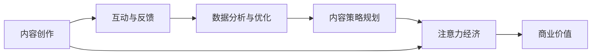

                 

# 注意力经济与内容策略规划：创建吸引并留住受众的内容

在当今信息爆炸的时代，如何吸引并留住受众的注意力成为企业和内容创作者亟待解决的问题。注意力经济的概念应运而生，通过科学的内容策略规划，有效提升内容的吸引力和受众的黏性，实现从内容到经济的转化。本文将深入探讨注意力经济的原理、核心算法、操作步骤，并给出案例分析与讲解，旨在为内容创作者和市场营销者提供实用的建议和工具。

## 1. 背景介绍

### 1.1 问题由来

随着互联网的发展，信息传播的渠道和方式日益多样化，用户获取信息的成本也逐渐降低。这导致了信息过载和用户注意力稀缺的问题。据统计，人们在每天接收的信息中，能够被真正关注和记住的不到1%。因此，如何在海量信息中脱颖而出，成为内容创作者和营销者必须面对的挑战。

注意力经济应运而生，它通过科学的内容策略规划，提高内容的吸引力，从而获取用户的关注和信任，实现从内容到经济的转化。这不仅关系到内容的传播效果，还直接影响着企业的商业价值。

### 1.2 问题核心关键点

注意力经济的核心在于如何最大化地利用用户注意力资源，实现内容价值的最大化。这一过程中涉及的关键点包括：

- **内容质量与创新**：高质量且富有创意的内容更容易吸引受众，提升其对内容的关注度和互动性。
- **用户画像与需求分析**：了解目标受众的兴趣、需求和偏好，量身定制符合其期望的内容。
- **互动与反馈机制**：通过有效的互动与反馈机制，提升用户粘性，增强内容的社会化传播。
- **数据分析与优化**：利用大数据分析用户行为和反馈，不断优化内容策略，提升内容价值。

这些关键点构成了一个闭环，从内容创作到用户互动，再到数据分析和内容优化，不断迭代升级，实现内容的持续优化和价值的最大化。

### 1.3 问题研究意义

注意力经济的研究意义在于，它为内容创作者和营销者提供了一个科学的方法论，帮助他们在纷繁复杂的信息环境中，通过有效的策略规划，实现内容的成功传播和商业价值的最大化。这不仅有助于提升内容的吸引力，还能降低营销成本，提升品牌形象和市场竞争力。

## 2. 核心概念与联系

### 2.1 核心概念概述

为了更好地理解注意力经济，我们需要了解以下几个关键概念：

- **注意力经济**：指在信息过载的背景下，通过高质量、创新性、互动性内容，吸引并留住受众的注意力，实现内容价值的最大化。
- **内容策略规划**：通过分析受众需求、优化内容形式和发布策略，提升内容的传播效果和受众粘性。
- **互动与反馈机制**：包括评论、点赞、分享等形式，通过用户互动获取反馈，调整优化内容。
- **数据分析与优化**：利用大数据分析用户行为和反馈，不断优化内容策略，提升内容价值。

这些概念相互关联，共同构成了一个全面的内容策略框架，帮助内容创作者和营销者实现从内容到经济的有效转化。

### 2.2 核心概念原理和架构的 Mermaid 流程图



这个流程图展示了注意力经济的核心概念及其之间的关系：

1. 内容创作是注意力经济的基础，通过高质量和创意的内容吸引受众。
2. 互动与反馈机制是内容优化的重要手段，通过用户互动获取反馈，调整优化内容。
3. 数据分析与优化是提升内容价值的工具，利用大数据分析用户行为和反馈，优化内容策略。
4. 内容策略规划是将上述所有环节整合起来，实现内容的最大化传播和商业价值的转化。
5. 最终，注意力经济实现了内容到经济的成功转化，提升企业的市场竞争力和品牌形象。

## 3. 核心算法原理 & 具体操作步骤

### 3.1 算法原理概述

注意力经济的核心算法主要包括内容推荐算法和用户画像分析算法。内容推荐算法旨在通过分析用户历史行为，推荐符合其兴趣和需求的内容；用户画像分析算法则是通过数据分析，构建用户行为模型，预测用户兴趣，制定内容策略。

**内容推荐算法**：通过协同过滤、基于内容的推荐、基于模型的推荐等方法，根据用户的历史行为数据，推荐潜在感兴趣的内容。

**用户画像分析算法**：利用机器学习、深度学习等技术，构建用户行为模型，分析用户兴趣、需求和偏好，预测用户行为，从而制定符合用户期望的内容策略。

### 3.2 算法步骤详解

#### 3.2.1 内容推荐算法步骤

1. **数据采集**：收集用户的历史行为数据，如浏览记录、点击记录、购买记录等。
2. **特征提取**：对用户行为数据进行特征提取，包括内容标签、用户标签、时间戳等。
3. **相似度计算**：计算用户和内容之间的相似度，可以使用余弦相似度、Jaccard相似度等。
4. **推荐排序**：根据相似度计算结果，对潜在感兴趣的内容进行排序，并推荐给用户。

#### 3.2.2 用户画像分析算法步骤

1. **数据收集**：收集用户的行为数据，包括浏览记录、点击记录、搜索记录、购买记录等。
2. **数据预处理**：对收集到的数据进行清洗、归一化、分词等预处理操作。
3. **特征工程**：设计特征提取函数，提取与用户行为相关的特征，如内容标签、时间戳、用户兴趣标签等。
4. **模型训练**：使用机器学习或深度学习模型，对用户行为数据进行训练，构建用户行为模型。
5. **用户画像生成**：根据用户行为模型，生成用户画像，分析用户的兴趣、需求和偏好。
6. **内容策略制定**：根据用户画像，制定符合用户期望的内容策略，提升内容的吸引力和受众粘性。

### 3.3 算法优缺点

#### 3.3.1 内容推荐算法优缺点

**优点**：
- 通过分析用户历史行为，推荐符合其兴趣和需求的内容，提升用户满意度。
- 可以减少用户的搜索成本，提高内容的点击率和转化率。

**缺点**：
- 数据收集和特征提取需要大量的时间和计算资源。
- 算法模型过于简单，可能无法捕捉到用户的多样化需求。

#### 3.3.2 用户画像分析算法优缺点

**优点**：
- 通过构建用户行为模型，可以精确预测用户兴趣和需求，制定符合用户期望的内容策略。
- 可以动态调整内容策略，提升内容的吸引力和受众粘性。

**缺点**：
- 数据收集和预处理需要大量的时间和计算资源。
- 用户行为模型过于复杂，可能无法在短时间内训练完成。

### 3.4 算法应用领域

注意力经济的应用领域广泛，涵盖社交媒体、电商平台、新闻网站、在线教育等多个行业。

- **社交媒体**：通过推荐算法，根据用户的历史行为和互动数据，推荐潜在的兴趣内容和社交关系。
- **电商平台**：利用用户画像分析算法，预测用户购物行为，制定个性化推荐策略，提升销售额。
- **新闻网站**：通过内容推荐算法，推荐用户感兴趣的新闻内容，提升用户停留时间和点击率。
- **在线教育**：根据用户学习行为和反馈，推荐适合的课程和教材，提升学习效果和用户满意度。

## 4. 数学模型和公式 & 详细讲解 & 举例说明

### 4.1 数学模型构建

注意力经济的数学模型主要涉及用户行为分析和内容推荐两个方面。

**用户行为分析模型**：
$$
P(\text{user}, \text{item}) = \alpha \times F(\text{user}) \times F(\text{item}) + (1-\alpha) \times G(\text{user}, \text{item})
$$

其中，$P(\text{user}, \text{item})$ 表示用户$u$对物品$i$的兴趣概率，$\alpha$ 为兴趣相似度权重，$F(\text{user})$ 表示用户$u$的特征向量，$F(\text{item})$ 表示物品$i$的特征向量，$G(\text{user}, \text{item})$ 表示用户和物品之间的交互历史。

**内容推荐模型**：
$$
R(\text{user}, \text{item}) = \sum_{i=1}^n w_i \times C(\text{user}, \text{item}_i)
$$

其中，$R(\text{user}, \text{item})$ 表示用户$u$对物品$i$的评分，$w_i$ 表示物品$i$的权重，$C(\text{user}, \text{item}_i)$ 表示用户$u$对物品$i$的特征评分。

### 4.2 公式推导过程

以协同过滤算法为例，其推导过程如下：

1. **余弦相似度计算**：
$$
\cos(\theta) = \frac{\sum_{i=1}^n x_i \times y_i}{\sqrt{\sum_{i=1}^n x_i^2} \times \sqrt{\sum_{i=1}^n y_i^2}}
$$

其中，$x$ 表示用户$u$的特征向量，$y$ 表示物品$i$的特征向量。

2. **相似度排序**：
$$
\text{similarity}_{ui} = \cos(\theta)
$$

3. **推荐排序**：
$$
R(\text{user}, \text{item}) = \text{similarity}_{ui} \times C(\text{user}, \text{item})
$$

其中，$C(\text{user}, \text{item})$ 表示用户$u$对物品$i$的评分。

### 4.3 案例分析与讲解

**案例一：社交媒体推荐系统**

某社交媒体平台通过分析用户的历史互动数据，推荐潜在感兴趣的内容和社交关系。其算法步骤如下：

1. **数据采集**：收集用户的浏览记录、点赞记录、评论记录等。
2. **特征提取**：提取用户和内容的标签、时间戳等特征。
3. **相似度计算**：使用余弦相似度计算用户和内容之间的相似度。
4. **推荐排序**：根据相似度计算结果，对潜在感兴趣的内容进行排序，并推荐给用户。

**案例二：电商平台个性化推荐**

某电商平台通过分析用户的历史购买记录和浏览行为，推荐潜在的兴趣商品。其算法步骤如下：

1. **数据采集**：收集用户的浏览记录、购买记录、评价记录等。
2. **特征提取**：提取商品标签、时间戳、价格、用户标签等特征。
3. **相似度计算**：使用协同过滤算法计算用户和商品的相似度。
4. **推荐排序**：根据相似度计算结果，对潜在感兴趣的商品进行排序，并推荐给用户。

## 5. 项目实践：代码实例和详细解释说明

### 5.1 开发环境搭建

在实践注意力经济的内容策略规划时，我们需要准备好开发环境。以下是使用Python进行TensorFlow开发的环境配置流程：

1. 安装Anaconda：从官网下载并安装Anaconda，用于创建独立的Python环境。

2. 创建并激活虚拟环境：
```bash
conda create -n attention-env python=3.8 
conda activate attention-env
```

3. 安装TensorFlow：根据CUDA版本，从官网获取对应的安装命令。例如：
```bash
conda install tensorflow tensorflow-gpu -c tf
```

4. 安装PyTorch：
```bash
pip install torch
```

5. 安装各类工具包：
```bash
pip install pandas numpy scikit-learn matplotlib tqdm
```

完成上述步骤后，即可在`attention-env`环境中开始开发。

### 5.2 源代码详细实现

下面以电商平台的个性化推荐系统为例，给出使用TensorFlow实现的内容推荐算法的Python代码实现。

首先，定义推荐系统的输入输出：

```python
import tensorflow as tf

# 定义输入
user_input = tf.keras.layers.Input(shape=(1,))
item_input = tf.keras.layers.Input(shape=(1,))

# 定义输出
rating_output = tf.keras.layers.Dense(1, activation='sigmoid')(tf.keras.layers.Dot(axes=(1, 1), normalize=True)([user_input, item_input]))
```

然后，定义推荐模型的损失函数和优化器：

```python
# 定义损失函数
rating_loss = tf.keras.losses.BinaryCrossentropy(from_logits=True)

# 定义优化器
optimizer = tf.keras.optimizers.Adam(learning_rate=0.01)
```

接着，定义推荐模型的训练函数：

```python
def train_recommender(model, user_input, item_input, rating_output, rating_loss, optimizer):
    # 编译模型
    model.compile(optimizer=optimizer, loss=rating_loss)
    
    # 训练模型
    model.fit([user_input, item_input], rating_output, epochs=10, batch_size=32)
```

最后，调用训练函数进行模型训练：

```python
user_input = tf.keras.layers.Input(shape=(1,))
item_input = tf.keras.layers.Input(shape=(1,))

rating_output = tf.keras.layers.Dense(1, activation='sigmoid')(tf.keras.layers.Dot(axes=(1, 1), normalize=True)([user_input, item_input]))

rating_loss = tf.keras.losses.BinaryCrossentropy(from_logits=True)
optimizer = tf.keras.optimizers.Adam(learning_rate=0.01)

train_recommender(tf.keras.models.Model(inputs=[user_input, item_input], outputs=rating_output), user_input, item_input, rating_output, rating_loss, optimizer)
```

以上就是使用TensorFlow实现内容推荐算法的完整代码实现。

### 5.3 代码解读与分析

让我们再详细解读一下关键代码的实现细节：

**train_recommender函数**：
- 首先，通过`compile`方法编译模型，指定优化器和损失函数。
- 然后，调用`fit`方法进行模型训练，指定训练数据、批次大小、迭代轮数等参数。

**推荐模型定义**：
- 使用`Input`层定义用户和物品的输入。
- 使用`Dot`层计算用户和物品的相似度。
- 使用`Dense`层将相似度转化为评分。
- 使用`BinaryCrossentropy`损失函数进行评分预测的误差计算。
- 使用`Adam`优化器进行参数更新。

该代码实现了基于协同过滤的推荐算法，通过计算用户和物品的相似度，进行推荐排序。

## 6. 实际应用场景

### 6.1 社交媒体

社交媒体平台通过推荐算法，帮助用户发现潜在的兴趣内容和社交关系。以微信为例，其推荐算法通过分析用户的浏览记录、点赞记录、评论记录等数据，推荐符合用户兴趣的内容和好友关系。

### 6.2 电商平台

电商平台通过个性化推荐，提升用户购物体验和销售额。以亚马逊为例，其推荐算法通过分析用户的浏览记录、购买记录、评价记录等数据，推荐潜在的兴趣商品。

### 6.3 新闻网站

新闻网站通过内容推荐算法，提升用户停留时间和点击率。以今日头条为例，其推荐算法通过分析用户的历史浏览记录和点击行为，推荐符合用户兴趣的新闻内容。

### 6.4 未来应用展望

未来，随着注意力经济技术的发展，将有更多领域应用该技术，提升用户黏性和内容价值。例如：

- **在线教育**：通过个性化推荐和互动反馈，提升学习效果和用户满意度。
- **金融理财**：利用用户画像分析，推荐合适的理财方案和金融产品。
- **健康医疗**：通过个性化推荐，推荐适合的医疗方案和健康产品。

## 7. 工具和资源推荐

### 7.1 学习资源推荐

为了帮助开发者系统掌握注意力经济的核心技术和应用，这里推荐一些优质的学习资源：

1. 《深度学习与推荐系统》书籍：介绍深度学习在推荐系统中的应用，包括协同过滤、基于内容的推荐等。
2. 《用户画像分析与推荐系统》课程：介绍用户画像分析的核心算法和技术，适合初学者入门。
3. Kaggle：提供大量推荐系统相关的比赛和数据集，可以通过实践学习推荐算法。
4. Coursera：提供多门关于推荐系统和用户画像分析的课程，涵盖推荐算法、用户画像分析等。

通过对这些资源的学习实践，相信你一定能够快速掌握注意力经济的核心技术和应用，并用于解决实际的推荐问题。

### 7.2 开发工具推荐

高效的开发离不开优秀的工具支持。以下是几款用于注意力经济开发的常用工具：

1. TensorFlow：基于Python的开源深度学习框架，适合构建复杂的推荐系统。
2. PyTorch：灵活的深度学习框架，适合快速迭代研究。
3. Apache Spark：大数据处理工具，适合处理大规模推荐系统数据。
4. Elasticsearch：搜索引擎，适合构建实时推荐系统的查询和索引。
5. Scikit-learn：简单易用的机器学习库，适合进行用户画像分析和特征工程。

合理利用这些工具，可以显著提升注意力经济开发的效率，加速创新迭代的步伐。

### 7.3 相关论文推荐

注意力经济的研究源于学界的持续研究。以下是几篇奠基性的相关论文，推荐阅读：

1. The Bellman Equation of Attention（隐马尔可夫注意力模型）：提出基于注意力机制的推荐系统，提升推荐效果。
2. Recommender Systems with Explicit and Implicit Feedback（带显式和隐式反馈的推荐系统）：介绍显式反馈和隐式反馈的推荐算法。
3. Collaborative Filtering：介绍协同过滤算法，提升推荐系统的准确性和鲁棒性。
4. Deep Personalized Recommendation with Attention（基于注意力机制的个性化推荐）：使用深度学习进行个性化推荐，提升推荐效果。
5. A Systematic Literature Review of Recommender Systems for the Stream Data：综述基于流数据的推荐系统，涵盖推荐算法、用户画像分析等。

这些论文代表了大数据推荐系统的研究进展，通过学习这些前沿成果，可以帮助研究者把握学科前进方向，激发更多的创新灵感。

## 8. 总结：未来发展趋势与挑战

### 8.1 研究成果总结

本文详细介绍了注意力经济的原理、核心算法和操作步骤，并给出了代码实现和案例分析。通过学习本文，可以系统掌握注意力经济的核心技术和应用方法。

### 8.2 未来发展趋势

展望未来，注意力经济技术将呈现以下几个发展趋势：

1. **个性化推荐**：随着深度学习和大数据分析技术的进步，个性化推荐将更加精准和高效，提升用户满意度。
2. **实时推荐**：通过流数据处理和实时计算，实现实时推荐，提升用户粘性。
3. **跨平台推荐**：实现跨平台的内容推荐，提升用户覆盖范围和互动效果。
4. **多模态推荐**：将文本、图片、视频等多模态数据融合，提升推荐效果。
5. **智能推荐**：结合自然语言处理、图像识别等技术，提升推荐的智能化水平。

### 8.3 面临的挑战

尽管注意力经济技术已经取得了一定进展，但在实际应用中仍面临诸多挑战：

1. **数据隐私和安全**：在数据采集和处理过程中，如何保护用户隐私，防止数据泄露和滥用。
2. **算法复杂度**：推荐算法过于复杂，可能无法在短时间内训练完成，且难以解释和优化。
3. **计算资源**：推荐系统的复杂性带来了计算资源的需求，如何降低计算成本，提升计算效率。
4. **模型泛化能力**：推荐系统需要具备较强的泛化能力，以适应不同的用户群体和数据分布。
5. **用户行为变化**：用户行为和兴趣可能随时变化，推荐系统需要实时调整，以适应用户变化的需求。

### 8.4 研究展望

未来的研究需要在以下几个方面寻求新的突破：

1. **数据隐私保护**：研究如何保护用户隐私，防止数据泄露和滥用，提升用户信任度。
2. **算法优化**：优化推荐算法，提升算法的准确性和鲁棒性，降低计算成本。
3. **模型解释性**：提升推荐模型的可解释性，便于用户理解和信任。
4. **跨模态推荐**：将多模态数据融合，提升推荐效果。
5. **实时推荐**：实现实时推荐，提升用户粘性。

通过这些研究方向，可以推动注意力经济技术的不断发展，提升推荐系统的性能和应用范围，为用户创造更多价值。

## 9. 附录：常见问题与解答

**Q1：如何理解注意力经济中的“注意力”概念？**

A: 在注意力经济中，“注意力”指的是用户对内容的关注度和互动程度。通过优化内容的呈现方式和互动机制，吸引用户注意，提升用户黏性。

**Q2：如何构建有效的用户画像？**

A: 构建用户画像需要收集和分析用户的多种数据，包括浏览记录、购买记录、评价记录、社交互动等。通过数据挖掘和机器学习算法，提取与用户行为相关的特征，构建用户行为模型，分析用户的兴趣、需求和偏好。

**Q3：如何提升推荐系统的性能？**

A: 提升推荐系统的性能需要优化推荐算法、改进特征工程、增强模型泛化能力。可以使用深度学习模型进行个性化推荐，引入多模态数据融合，实现实时推荐等。

**Q4：如何保护用户隐私？**

A: 保护用户隐私需要采用匿名化处理、数据加密、访问控制等措施，确保用户数据的安全性和匿名性。同时，在数据采集和处理过程中，需要遵守相关法律法规，如GDPR、CCPA等。

**Q5：如何实现跨平台推荐？**

A: 实现跨平台推荐需要统一用户画像和推荐模型，不同平台之间的数据可以进行联合建模和推荐。同时，需要考虑不同平台的特性和用户行为差异，进行适应性调整。

通过本文的系统梳理，可以看到，注意力经济技术正在成为推荐系统的重要范式，极大地提升内容的吸引力和用户粘性。未来，伴随注意力经济技术的不断演进，推荐系统将变得更加精准、高效、实时，为内容创作者和营销者带来更多的商业价值。

---

作者：禅与计算机程序设计艺术 / Zen and the Art of Computer Programming

