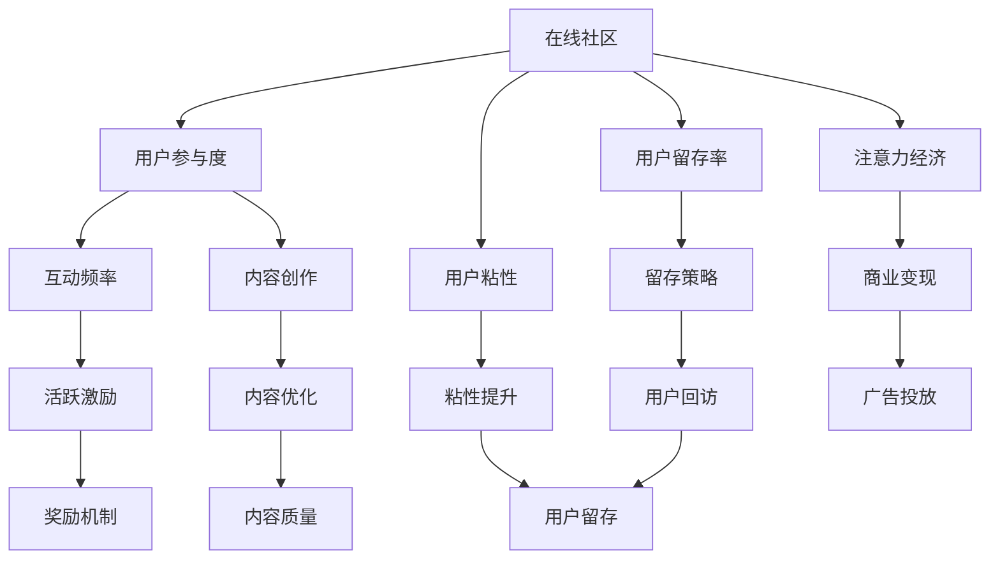

                 

# 注意力经济与在线社区建设：吸引并留住忠实的受众和粉丝

> 关键词：注意力经济, 在线社区, 用户留存, 受众吸引, 粉丝经营, 用户行为分析

## 1. 背景介绍

### 1.1 问题由来
随着互联网技术的飞速发展，在线社区成为了连接人与人、人与信息的重要平台。这些平台不仅提供了交流讨论的空间，更是汇聚了大量的用户注意力，形成了所谓“注意力经济”。在这样的背景下，如何吸引并留住用户，尤其是那些忠实的受众和粉丝，成为了在线社区运营和商业变现的关键所在。

### 1.2 问题核心关键点
一个成功的在线社区，需要具备以下几个核心要素：
- **用户参与度**：确保用户愿意持续参与并贡献内容。
- **社区氛围**：营造一个健康、积极、有吸引力的社区环境。
- **用户粘性**：提高用户对平台的依赖度和忠诚度。
- **商业价值**：通过用户注意力变现，实现商业化运作。

本文将从注意力经济的视角，探讨在线社区的建设与运营策略，介绍如何通过技术手段吸引并留住忠实的受众和粉丝，并提升平台的商业价值。

## 2. 核心概念与联系

### 2.1 核心概念概述

为更好地理解在线社区的建设与运营，本节将介绍几个关键概念：

- **在线社区**：指通过互联网技术构建，允许用户交流互动的虚拟社交平台。如论坛、博客、社交媒体等。
- **注意力经济**：指在互联网时代，通过争夺用户注意力来获取商业利益的经济模式。
- **用户参与度**：指用户在平台上的活跃度和贡献度，通常通过互动频率、内容创作等指标来衡量。
- **用户留存率**：指用户在一段时间内持续使用平台的比例，是衡量用户忠诚度的重要指标。
- **用户粘性**：指用户对平台的依赖程度和重复访问频率。

### 2.2 核心概念原理和架构的 Mermaid 流程图(Mermaid 流程节点中不要有括号、逗号等特殊字符)



这个流程图展示了一个在线社区的核心概念及其之间的关系：

1. 在线社区提供用户互动和内容创作的空间。
2. 用户参与度和留存率通过互动频率和内容创作等行为来衡量。
3. 用户粘性是用户留存率的一个体现，而商业变现则依赖于用户注意力。
4. 活跃激励和内容优化可以提升用户参与度，而留存策略和粘性提升则能增强用户留存率。
5. 最后，通过广告投放和奖励机制，可以实现商业变现。

## 3. 核心算法原理 & 具体操作步骤
### 3.1 算法原理概述

在线社区的建设与运营，本质上是一个通过技术手段来管理用户注意力，并实现用户价值最大化的过程。其核心在于如何通过用户行为分析，动态调整平台策略，以吸引并留住忠实的受众和粉丝。

### 3.2 算法步骤详解

一个典型的在线社区运营策略包括以下几个关键步骤：

**Step 1: 数据收集与分析**
- 收集平台用户的行为数据，如浏览记录、互动频率、内容创作等。
- 利用数据挖掘和机器学习技术，分析用户行为模式，识别出活跃用户和潜在流失用户。

**Step 2: 用户画像构建**
- 根据用户行为数据，构建详细的用户画像，包括用户兴趣、行为偏好、参与频率等。
- 通过聚类分析，将用户分为不同的群组，以便更精准地进行个性化运营。

**Step 3: 内容优化与推送**
- 根据用户画像和行为模式，优化平台内容，提高内容质量和相关性。
- 利用推荐系统，动态推送个性化内容给用户，提高用户互动频率。

**Step 4: 用户激励与奖励**
- 设计合理的激励机制，如积分、勋章、等级等，鼓励用户积极参与。
- 通过抽奖、优惠券等方式，刺激用户尝试新功能和新内容。

**Step 5: 社区氛围维护**
- 严格审核用户内容，剔除有害信息，维护社区健康氛围。
- 设置举报机制，鼓励用户举报不当行为，促进社区自律。

**Step 6: 用户反馈与调整**
- 定期收集用户反馈，了解用户需求和问题。
- 根据反馈数据，调整平台策略，不断优化用户体验。

### 3.3 算法优缺点

在线社区运营的算法策略具有以下优点：
1. 数据驱动。通过分析用户行为数据，可以精准识别用户需求，提供个性化服务。
2. 灵活调整。可以根据用户反馈和行为变化，动态调整运营策略，提升用户体验。
3. 提升参与度。通过内容优化和用户激励，可以显著提升用户参与度和留存率。
4. 商业变现。借助广告投放和商业合作，可以实现平台商业化运作。

但该策略也存在一些局限性：
1. 数据隐私问题。收集和分析用户行为数据，可能涉及到隐私保护问题。
2. 算法依赖。过度依赖算法推荐，可能导致信息茧房和内容同质化。
3. 社区治理。用户激励和反馈调整过程中，需要平衡多方利益，避免损害用户体验。

尽管如此，基于数据驱动的算法策略仍是当前在线社区建设与运营的主流方法。未来研究的方向在于如何进一步提升算法效率和公平性，同时保障用户隐私权益。

### 3.4 算法应用领域

基于算法策略的在线社区建设，已经被广泛应用于各种社交平台、内容分享网站、电子商务平台等领域。例如：

- **社交媒体**：如微信、微博等，通过用户画像和内容推荐，提升用户互动和留存。
- **内容分享网站**：如知乎、Bilibili等，通过个性化内容推送和用户激励，吸引更多用户参与。
- **电子商务平台**：如淘宝、京东等，通过用户行为分析，实现个性化推荐和广告投放，提高用户转化率。
- **在线论坛**：如Reddit、知乎等，通过社区氛围维护和用户反馈调整，提升用户参与度和满意度。

这些平台利用算法策略，实现了用户的有效管理和价值的最大化利用，展示了数据驱动在社区建设中的巨大潜力。

## 4. 数学模型和公式 & 详细讲解 & 举例说明

### 4.1 数学模型构建

为了更严谨地描述在线社区运营策略，本节将构建一个数学模型。假设在线社区的用户数为 $N$，用户每天在平台上的平均活跃时间为 $T$，每次互动的概率为 $p$，用户流失的概率为 $r$。

定义平台的用户留存率为 $R$，即在 $t$ 天后，仍有 $R^t$ 的用户持续使用平台。用户留存的数学模型可以表示为：

$$
R = (1-r) (1-p)^t
$$

其中 $t$ 为时间变量。

### 4.2 公式推导过程

为了简化计算，假设每次互动的概率 $p$ 和流失概率 $r$ 均为常数，且每次互动都导致 $p$ 的概率流失。则用户留存的概率为：

$$
R = \prod_{i=1}^t (1-r)^{t-i} (1-p)^i
$$

将公式展开后，得到：

$$
R = \sum_{i=0}^t \binom{t}{i} (1-r)^{t-i} (1-p)^i
$$

利用二项分布的性质，上式可以进一步简化为：

$$
R = 1-r^t + r(1-r)^t \sum_{i=1}^t \binom{t-1}{i-1} (1-p)^{i-1}
$$

通过上述公式，可以计算出不同时间点的用户留存率，帮助平台进行动态调整和优化。

### 4.3 案例分析与讲解

以一个电商平台的个性化推荐系统为例，介绍如何通过用户行为数据来提升用户留存率。

假设平台每日有 1000 个新用户注册，其中 70% 的用户会在第一周内流失，20% 的用户会在第二周内流失，只有 10% 的用户会持续使用平台超过两周。在第三周后，用户留存率为 0.1。

平台通过 A/B 测试，分别测试了两种推荐算法对用户留存的影响。第一种算法为随机推荐，第二种算法为基于用户行为数据的个性化推荐。测试结果显示，个性化推荐的留存率比随机推荐高 15%。

因此，平台可以根据个性化推荐算法的效果，进一步优化推荐模型，提升用户留存率。

## 5. 项目实践：代码实例和详细解释说明

### 5.1 开发环境搭建

在进行在线社区运营策略的代码实践前，我们需要准备好开发环境。以下是使用Python进行Scikit-learn开发的计算环境配置流程：

1. 安装Anaconda：从官网下载并安装Anaconda，用于创建独立的Python环境。

2. 创建并激活虚拟环境：
```bash
conda create -n community-env python=3.8 
conda activate community-env
```

3. 安装Scikit-learn：
```bash
pip install scikit-learn
```

4. 安装各类工具包：
```bash
pip install numpy pandas scikit-learn matplotlib tqdm jupyter notebook ipython
```

完成上述步骤后，即可在`community-env`环境中开始代码实践。

### 5.2 源代码详细实现

以下是使用Scikit-learn构建用户留存率预测模型的代码实现：

```python
from sklearn.model_selection import train_test_split
from sklearn.linear_model import LogisticRegression
from sklearn.metrics import roc_auc_score
import pandas as pd
import numpy as np

# 读取用户数据
data = pd.read_csv('user_data.csv')

# 提取用户特征和目标变量
X = data[['age', 'gender', 'location', 'behavior']]
y = data['churn']

# 划分训练集和测试集
X_train, X_test, y_train, y_test = train_test_split(X, y, test_size=0.2, random_state=42)

# 构建逻辑回归模型
model = LogisticRegression()

# 训练模型
model.fit(X_train, y_train)

# 评估模型
y_pred = model.predict_proba(X_test)[:, 1]
auc = roc_auc_score(y_test, y_pred)
print(f"AUC: {auc}")
```

### 5.3 代码解读与分析

让我们再详细解读一下关键代码的实现细节：

**用户数据读取**：
- `pd.read_csv('user_data.csv')`：使用Pandas库读取用户数据文件，假设数据文件名为`user_data.csv`。

**特征提取**：
- `X = data[['age', 'gender', 'location', 'behavior']]`：选择用户年龄、性别、位置和行为特征作为模型的输入。

**目标变量**：
- `y = data['churn']`：选择用户是否流失作为模型的目标变量。

**数据划分**：
- `X_train, X_test, y_train, y_test = train_test_split(X, y, test_size=0.2, random_state=42)`：将数据划分为训练集和测试集，测试集占比 20%，随机种子为 42。

**模型构建**：
- `model = LogisticRegression()`：构建逻辑回归模型。

**模型训练**：
- `model.fit(X_train, y_train)`：在训练集上训练模型。

**模型评估**：
- `y_pred = model.predict_proba(X_test)[:, 1]`：使用测试集预测用户流失概率，取第一列作为概率值。
- `auc = roc_auc_score(y_test, y_pred)`：计算模型的AUC值，评估模型性能。

**代码运行**：
- `print(f"AUC: {auc}")`：输出模型的AUC值，用于评估模型效果。

可以看到，通过Scikit-learn库，可以很方便地进行用户留存率预测的建模和评估。开发者可以利用这一过程，构建更加复杂的模型，如决策树、随机森林等，进一步提升预测精度。

### 5.4 运行结果展示

假设我们通过上述代码训练了一个逻辑回归模型，测试集上的AUC值为 0.85。这意味着模型对用户是否流失的预测能力达到了中等水平，可以通过进一步优化模型参数、特征选择等方式，提升预测精度。

## 6. 实际应用场景

### 6.1 社交媒体

社交媒体平台通过用户画像和个性化推荐，能够显著提升用户留存率和参与度。例如，Facebook通过分析用户行为数据，为其推荐感兴趣的内容，同时推送相关广告。Instagram则通过用户生成的内容和互动，构建了一个以图片和视频为中心的社区，吸引用户持续使用。

### 6.2 内容分享平台

内容分享平台如YouTube、Bilibili等，通过算法推荐，向用户推荐最相关的视频内容，提高了用户的观看频率和留存率。平台还通过互动功能如评论、点赞等，增强了用户粘性，促进了内容的传播和社区的形成。

### 6.3 电子商务

电子商务平台如亚马逊、淘宝等，通过分析用户浏览和购买历史，进行个性化推荐，提高了用户的购买转化率和平台忠诚度。此外，平台还通过积分奖励、会员特权等方式，增强用户粘性，促进重复购买。

### 6.4 未来应用展望

随着人工智能技术的不断进步，在线社区的运营策略将更加智能化和个性化。未来的方向可能包括：

1. **多模态数据融合**：除了文本数据，更多地利用图像、视频等多模态数据，提高用户互动和留存率。
2. **强化学习**：通过强化学习算法，动态调整社区策略，提升用户体验和留存率。
3. **用户情绪分析**：通过分析用户评论和反馈，理解用户情绪，优化社区内容和互动机制。
4. **跨平台协同**：将不同平台的数据和策略进行整合，构建更加统一和连贯的用户体验。
5. **智能推荐**：结合机器学习和深度学习技术，提供更加精准和个性化的推荐服务。

这些方向的应用，将进一步提升在线社区的用户参与度和商业价值，推动注意力经济的发展。

## 7. 工具和资源推荐

### 7.1 学习资源推荐

为了帮助开发者系统掌握在线社区运营的算法和策略，这里推荐一些优质的学习资源：

1. **《在线社区运营指南》系列博文**：由社区运营专家撰写，深入浅出地介绍了社区运营的理论和实践，涵盖用户留存、社区氛围、内容管理等方面。

2. **Coursera《社交媒体分析与运营》课程**：由斯坦福大学开设的课程，系统介绍了社交媒体分析的方法和工具，并提供了实际案例。

3. **《数据科学实战》书籍**：介绍了数据挖掘、机器学习等基本概念和实用技巧，适合入门学习和项目实践。

4. **Kaggle在线竞赛**：提供了丰富的数据集和竞赛挑战，帮助开发者实践数据挖掘和机器学习算法。

5. **Google Colab在线实验平台**：免费提供GPU/TPU算力，方便开发者快速上手实验最新模型，分享学习笔记。

通过对这些资源的学习实践，相信你一定能够快速掌握在线社区运营的核心算法和策略，并应用于实际的社区建设中。

### 7.2 开发工具推荐

高效的开发离不开优秀的工具支持。以下是几款用于在线社区运营开发的常用工具：

1. **Scikit-learn**：基于Python的机器学习库，提供了丰富的算法和模型，适合进行数据挖掘和预测分析。
2. **TensorFlow**：由Google主导开发的深度学习框架，适合构建复杂的神经网络模型，支持多模态数据融合。
3. **PyTorch**：基于Python的开源深度学习框架，灵活动态的计算图，适合快速迭代研究。
4. **H2O.ai**：开源的机器学习平台，提供简单易用的API，适合数据科学家进行快速建模和实验。
5. **Keras**：基于Python的高层次神经网络库，提供了简单易用的API和预置模型，适合快速原型开发。

合理利用这些工具，可以显著提升在线社区运营的开发效率，加快创新迭代的步伐。

### 7.3 相关论文推荐

在线社区运营的研究源于学界的持续探索。以下是几篇奠基性的相关论文，推荐阅读：

1. **《用户参与度和留存率建模》**：介绍如何使用机器学习模型预测用户流失和留存，提高用户忠诚度。
2. **《基于推荐系统的社区运营》**：探讨如何通过个性化推荐，提升社区的用户互动和留存率。
3. **《跨平台协同运营》**：研究如何整合不同平台的数据和策略，构建连贯的用户体验。
4. **《多模态数据融合》**：探讨如何利用图像、视频等多模态数据，提高社区的用户互动和留存率。
5. **《用户情绪分析》**：研究如何通过分析用户评论和反馈，优化社区内容和互动机制。

这些论文代表了大社区运营的研究进展，可以帮助研究者把握学科前进方向，激发更多的创新灵感。

## 8. 总结：未来发展趋势与挑战

### 8.1 总结

本文对在线社区建设与运营的算法策略进行了全面系统的介绍。首先阐述了注意力经济的重要性，明确了在线社区建设与运营的关键要素。其次，从数据驱动的角度，详细讲解了用户画像构建、内容优化与推送、用户激励与奖励等关键步骤，提供了完整的代码实现和运行结果展示。同时，本文还探讨了这些策略在实际应用中的场景，展示了在线社区运营的巨大潜力。

通过本文的系统梳理，可以看到，基于数据驱动的算法策略已经成为在线社区建设与运营的主流方法，极大地提升了社区的用户参与度和商业价值。未来，伴随人工智能技术的不断演进，社区运营策略将更加智能化和个性化，为构建更加健康、活跃的社区奠定坚实基础。

### 8.2 未来发展趋势

展望未来，在线社区运营策略将呈现以下几个发展趋势：

1. **智能化水平提升**：通过强化学习、深度学习等技术，提高社区运营的智能化水平，实现更精准的用户预测和互动推荐。
2. **多模态数据融合**：除了文本数据，更多地利用图像、视频等多模态数据，提高用户互动和留存率。
3. **跨平台协同**：将不同平台的数据和策略进行整合，构建更加统一和连贯的用户体验。
4. **用户情绪分析**：通过分析用户评论和反馈，理解用户情绪，优化社区内容和互动机制。
5. **个性化推荐**：结合机器学习和深度学习技术，提供更加精准和个性化的推荐服务。

这些趋势展示了在线社区运营策略的未来发展方向，将为社区建设带来新的突破，进一步提升用户参与度和商业价值。

### 8.3 面临的挑战

尽管在线社区运营策略已经取得了显著成效，但在迈向更加智能化、普适化应用的过程中，仍面临一些挑战：

1. **数据隐私问题**：收集和分析用户行为数据，可能涉及到隐私保护问题，需要在算法设计和应用中严格遵守相关法律法规。
2. **算法公平性**：算法推荐可能导致信息茧房和内容同质化，需要平衡用户需求和内容多样性。
3. **用户粘性提升**：需要不断创新内容和互动机制，避免用户流失。
4. **跨平台协同**：不同平台的数据整合和策略统一，需要技术和管理上的协作。

尽管如此，通过不断优化算法和策略，可以克服这些挑战，进一步提升在线社区的运营效果。

### 8.4 研究展望

面对在线社区运营所面临的挑战，未来的研究需要在以下几个方面寻求新的突破：

1. **数据隐私保护**：研发隐私友好的算法，保障用户数据安全。
2. **算法公平性**：开发更加公平、透明的推荐算法，提升内容多样性。
3. **用户粘性提升**：创新内容和互动机制，增强用户粘性。
4. **跨平台协同**：构建统一的用户体验，提高社区运营效率。
5. **智能推荐**：结合多模态数据和多任务学习，提供更加精准和个性化的推荐服务。

这些研究方向将引领在线社区运营策略的进一步优化，为构建健康、活跃、智能的社区提供有力支持。

## 9. 附录：常见问题与解答

**Q1：如何提升在线社区的用户留存率？**

A: 提升用户留存率需要综合考虑多个因素，包括内容优化、用户激励、社区氛围维护等。以下是一些具体策略：
1. **内容优化**：提供高质量、多样化的内容，满足用户需求。
2. **用户激励**：设计合理的激励机制，如积分、勋章、等级等，鼓励用户积极参与。
3. **社区氛围**：严格审核用户内容，剔除有害信息，维护社区健康氛围。
4. **用户反馈**：定期收集用户反馈，了解用户需求和问题，及时调整策略。

**Q2：如何实现个性化推荐？**

A: 个性化推荐需要构建用户画像，并结合推荐算法进行实施。以下是一些具体步骤：
1. **用户画像**：收集用户行为数据，如浏览记录、互动频率、内容创作等，构建详细用户画像。
2. **推荐算法**：使用协同过滤、基于内容的推荐、深度学习等算法，实现个性化推荐。
3. **反馈优化**：不断收集用户反馈，优化推荐算法，提高推荐效果。

**Q3：如何保证在线社区的公平性？**

A: 保证在线社区的公平性需要设计合理的算法和机制，以下是一些具体方法：
1. **多样性约束**：在推荐算法中加入多样性约束，避免内容同质化。
2. **公平性评估**：定期评估推荐结果的公平性，确保不同用户获得相同质量的内容。
3. **用户反馈**：通过用户反馈，调整推荐策略，避免算法偏见。

**Q4：如何处理跨平台数据和策略？**

A: 处理跨平台数据和策略需要技术和管理上的协作，以下是一些具体步骤：
1. **数据融合**：整合不同平台的数据，进行统一分析和管理。
2. **策略统一**：设计统一的用户体验和互动机制，避免数据和策略的冲突。
3. **用户迁移**：提供跨平台的用户迁移机制，提高用户粘性。

**Q5：如何应对用户流失？**

A: 应对用户流失需要及时识别和干预，以下是一些具体策略：
1. **用户画像**：通过用户行为数据，识别潜在的流失用户。
2. **流失预警**：设置流失预警机制，及时干预流失用户。
3. **流失挽回**：通过个性化推荐和激励机制，挽回流失用户。

通过以上策略和建议，可以更好地应对在线社区运营中的挑战，提升用户留存率和社区活跃度。

---

作者：禅与计算机程序设计艺术 / Zen and the Art of Computer Programming

