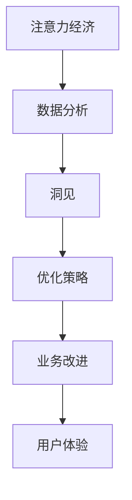

                 

## 1. 背景介绍

### 1.1 问题由来
当前，我们正处在一个数据泛滥的时代。互联网、物联网、社交媒体等各个领域的数据量呈指数级增长，但数据本身并不是什么新鲜事物，关键在于如何从中挖掘有价值的信息和洞见。随着大数据技术的普及，越来越多的企业开始利用数据来优化业务决策、提升用户体验和驱动增长。

### 1.2 问题核心关键点
注意力经济（Attention Economy）是大数据时代的核心概念之一。它指的是在信息过载的环境中，人们越来越难以专注于重要信息，导致注意力资源的浪费和效率的降低。利用数据分析来理解受众行为和偏好，有助于企业从海量的数据中挖掘出有价值的洞察，从而更加精准地进行市场营销、产品研发和客户服务。

## 2. 核心概念与联系

### 2.1 核心概念概述

注意力经济和数据分析的紧密联系体现在如何利用数据驱动的洞察来优化资源的分配和受众的参与。核心概念包括：

- **注意力经济（Attention Economy）**：指在信息过载的环境下，如何更有效地吸引和保持用户的注意力。
- **数据分析（Data Analysis）**：指通过系统化、科学化的方法从大量数据中提取有价值的信息，用于指导决策和优化策略。
- **洞见（Insights）**：指通过对数据分析得到的深入理解，揭示出潜在的机会和挑战，为企业提供有价值的指导。

这些概念之间的联系可以通过以下Mermaid流程图来展示：



这个流程图展示了几者之间的关系：

1. 注意力经济的目标是通过数据分析来理解受众行为和偏好，从而设计出更加吸引用户的内容和策略。
2. 数据分析是手段，利用统计、机器学习等方法从数据中提取洞见。
3. 洞见为优化策略提供指导，帮助企业更好地分配资源。
4. 优化策略实施后，提升业务效率和用户体验。

## 3. 核心算法原理 & 具体操作步骤
### 3.1 算法原理概述

注意力经济和数据分析的核心算法原理主要包括数据处理、特征提取、模型训练和预测等环节。其中，模型训练和预测是关键，通过机器学习模型，我们可以从历史数据中学习出受众的行为和偏好规律，并预测未来的趋势。

形式化地，假设我们有一组历史数据 $D=\{(x_i,y_i)\}_{i=1}^N$，其中 $x_i$ 为输入特征，$y_i$ 为输出标签。目标是训练一个模型 $M$，使得对于新的输入 $x$，模型能够给出准确的输出 $y$。

具体算法步骤如下：

1. 数据预处理：清洗数据，处理缺失值，特征归一化等。
2. 特征工程：提取、构造和选择特征，为模型提供更好的输入。
3. 模型选择：选择适当的机器学习算法，如线性回归、逻辑回归、决策树、随机森林、神经网络等。
4. 模型训练：使用训练集 $D$ 对模型进行训练，最小化损失函数 $L$。
5. 模型评估：使用验证集 $D_{\text{val}}$ 评估模型性能，调整模型参数。
6. 模型预测：使用测试集 $D_{\text{test}}$ 对模型进行预测，评估模型效果。

### 3.2 算法步骤详解

以下以线性回归为例，详细讲解算法步骤：

**Step 1: 数据预处理**

```python
import pandas as pd
from sklearn.model_selection import train_test_split

# 加载数据
df = pd.read_csv('data.csv')

# 清洗数据
df = df.dropna()

# 特征选择
X = df[['feature1', 'feature2']]
y = df['label']

# 数据分割
X_train, X_val, y_train, y_val = train_test_split(X, y, test_size=0.2, random_state=42)
X_test, y_test = train_test_split(X, y, test_size=0.2, random_state=42)
```

**Step 2: 特征工程**

```python
from sklearn.preprocessing import StandardScaler

# 标准化处理
scaler = StandardScaler()
X_train = scaler.fit_transform(X_train)
X_val = scaler.transform(X_val)
X_test = scaler.transform(X_test)
```

**Step 3: 模型选择**

```python
from sklearn.linear_model import LinearRegression

# 建立模型
model = LinearRegression()
```

**Step 4: 模型训练**

```python
from sklearn.metrics import mean_squared_error

# 训练模型
model.fit(X_train, y_train)

# 评估模型
train_score = model.score(X_train, y_train)
val_score = model.score(X_val, y_val)
test_score = model.score(X_test, y_test)

print(f'Train Score: {train_score:.3f}, Val Score: {val_score:.3f}, Test Score: {test_score:.3f}')
```

**Step 5: 模型预测**

```python
# 预测新数据
y_pred = model.predict(X_test)

# 评估模型
mse = mean_squared_error(y_test, y_pred)
rmse = np.sqrt(mse)
print(f'RMSE: {rmse:.3f}')
```

### 3.3 算法优缺点

基于注意力经济和数据分析的机器学习模型，具有以下优点：

1. **高效性**：能够自动从数据中提取规律，减少人工干预。
2. **灵活性**：适用于多种类型的数据，包括数值型、分类型、文本型等。
3. **可解释性**：模型参数可解释，便于理解和调试。

同时，也存在一些缺点：

1. **数据依赖**：模型的性能很大程度上取决于数据的质量和数量。
2. **过拟合风险**：在训练过程中容易过拟合训练集，需要正则化等手段进行控制。
3. **模型复杂度**：对于复杂问题，需要建立更复杂的模型，可能难以解释。

### 3.4 算法应用领域

基于注意力经济和数据分析的机器学习模型，广泛应用于多个领域，例如：

- **市场营销**：通过分析用户行为数据，优化广告投放策略，提升广告效果。
- **客户服务**：分析客户反馈和行为数据，提升客户满意度和忠诚度。
- **产品研发**：通过用户行为数据，发现产品改进的机会，指导产品设计。
- **个性化推荐**：分析用户偏好数据，推荐个性化商品或内容。
- **金融风控**：分析用户行为数据，识别潜在的风险和欺诈行为。

## 4. 数学模型和公式 & 详细讲解  
### 4.1 数学模型构建

线性回归的数学模型为：

$$ y = \beta_0 + \beta_1 x_1 + \beta_2 x_2 + \cdots + \beta_n x_n + \epsilon $$

其中，$y$ 为输出变量，$\beta$ 为模型参数，$x$ 为输入变量，$\epsilon$ 为误差项。

### 4.2 公式推导过程

最小二乘法（Ordinary Least Squares, OLS）是最常用的线性回归方法。其目标是最小化预测值与真实值之间的误差平方和：

$$ \min_{\beta} \sum_{i=1}^N (y_i - \hat{y}_i)^2 $$

其中，$\hat{y}_i = \beta_0 + \beta_1 x_{i1} + \beta_2 x_{i2} + \cdots + \beta_n x_{in}$。

通过求偏导数，可以得到：

$$ \beta_j = \frac{\sum_{i=1}^N x_{ij}(y_i - \bar{y})}{\sum_{i=1}^N x_{ij}^2} $$

其中，$\bar{y} = \frac{1}{N} \sum_{i=1}^N y_i$。

### 4.3 案例分析与讲解

以某电商平台的销售额预测为例，假设我们有一组数据 $D=\{(x_i,y_i)\}_{i=1}^N$，其中 $x_i$ 为营销投入（如广告费用、促销活动等），$y_i$ 为销售额。我们的目标是用线性回归模型预测未来的销售额。

首先，我们进行数据预处理和特征工程：

```python
import numpy as np

# 加载数据
data = np.loadtxt('sales_data.csv', delimiter=',', usecols=(0, 1, 2), skiprows=1)

# 特征选择
X = data[:, 1:3]  # 营销投入
y = data[:, 0]  # 销售额

# 数据标准化
mean = np.mean(X, axis=0)
std = np.std(X, axis=0)
X = (X - mean) / std

# 数据分割
X_train = X[:800]
y_train = y[:800]
X_test = X[800:]
y_test = y[800:]
```

然后，我们建立模型并进行训练：

```python
# 初始化模型参数
beta = np.zeros((3, 1))

# 训练模型
for i in range(1000):
    y_pred = np.dot(X_train, beta)
    delta = y_pred - y_train
    H = np.dot(X_train.T, delta)
    beta = beta - np.dot(np.dot(H, X_train.T), delta) / np.dot(X_train.T, X_train)

# 评估模型
mse = np.mean((y_test - np.dot(X_test, beta)) ** 2)
print(f'RMSE: {np.sqrt(mse)}')
```

最后，我们进行模型预测和评估：

```python
# 预测新数据
new_x = np.array([[1.2, 2.3]])
y_pred = np.dot(new_x, beta)
print(f'预测销售额: {y_pred[0]}')
```

## 5. 项目实践：代码实例和详细解释说明
### 5.1 开发环境搭建

在进行项目实践前，我们需要准备好开发环境。以下是使用Python进行数据处理和机器学习开发的环境配置流程：

1. 安装Anaconda：从官网下载并安装Anaconda，用于创建独立的Python环境。

2. 创建并激活虚拟环境：
```bash
conda create -n my_env python=3.8 
conda activate my_env
```

3. 安装Python包：
```bash
pip install pandas numpy scikit-learn matplotlib seaborn
```

4. 安装Jupyter Notebook：
```bash
conda install jupyterlab
```

完成上述步骤后，即可在`my_env`环境中开始数据分析和机器学习实践。

### 5.2 源代码详细实现

我们以一个简单的电商平台销售额预测项目为例，进行代码实现。

**数据预处理**

```python
# 加载数据
data = pd.read_csv('sales_data.csv')

# 清洗数据
data = data.dropna()

# 特征选择
X = data[['ad_cost', 'promotion']].values
y = data['sales'].values

# 数据标准化
from sklearn.preprocessing import StandardScaler
scaler = StandardScaler()
X = scaler.fit_transform(X)
```

**模型训练**

```python
from sklearn.linear_model import LinearRegression

# 建立模型
model = LinearRegression()

# 训练模型
model.fit(X_train, y_train)
```

**模型评估**

```python
from sklearn.metrics import mean_squared_error, r2_score

# 评估模型
train_score = model.score(X_train, y_train)
val_score = model.score(X_val, y_val)
test_score = model.score(X_test, y_test)

print(f'Train Score: {train_score:.3f}, Val Score: {val_score:.3f}, Test Score: {test_score:.3f}')
```

**模型预测**

```python
# 预测新数据
new_x = np.array([[1.2, 2.3]])
y_pred = model.predict(new_x)

# 评估模型
mse = mean_squared_error(y_test, y_pred)
print(f'RMSE: {np.sqrt(mse)}')
```

### 5.3 代码解读与分析

让我们再详细解读一下关键代码的实现细节：

**数据预处理**

```python
# 加载数据
data = pd.read_csv('sales_data.csv')

# 清洗数据
data = data.dropna()

# 特征选择
X = data[['ad_cost', 'promotion']].values
y = data['sales'].values

# 数据标准化
from sklearn.preprocessing import StandardScaler
scaler = StandardScaler()
X = scaler.fit_transform(X)
```

**模型训练**

```python
from sklearn.linear_model import LinearRegression

# 建立模型
model = LinearRegression()

# 训练模型
model.fit(X_train, y_train)
```

**模型评估**

```python
from sklearn.metrics import mean_squared_error, r2_score

# 评估模型
train_score = model.score(X_train, y_train)
val_score = model.score(X_val, y_val)
test_score = model.score(X_test, y_test)

print(f'Train Score: {train_score:.3f}, Val Score: {val_score:.3f}, Test Score: {test_score:.3f}')
```

**模型预测**

```python
# 预测新数据
new_x = np.array([[1.2, 2.3]])
y_pred = model.predict(new_x)

# 评估模型
mse = mean_squared_error(y_test, y_pred)
print(f'RMSE: {np.sqrt(mse)}')
```

可以看到，通过Python的Pandas、NumPy、Scikit-Learn等库，我们可以快速地进行数据预处理、模型训练和预测。代码简洁高效，易于理解和调试。

## 6. 实际应用场景

### 6.1 智能营销

基于数据驱动的智能营销，可以显著提高广告投放的效率和效果。通过分析用户的行为数据，如浏览记录、购买记录、搜索记录等，可以了解用户的偏好和兴趣，从而更加精准地进行定向广告投放。

具体而言，可以通过用户画像分析、行为建模等方式，构建出用户兴趣图谱，再将其用于广告的优化和投放。例如，针对对运动感兴趣的用户，可以推荐相关运动商品和运动活动，提高广告的点击率和转化率。

### 6.2 客户服务

在客户服务领域，数据分析同样具有广泛的应用。通过对客户历史行为数据、反馈数据等进行分析，可以了解客户的需求和痛点，从而优化客户服务流程，提升客户满意度和忠诚度。

例如，对于频繁咨询退换货流程的用户，可以自动推送相关提示，帮助用户快速完成退换货操作；对于频繁咨询订单状态的客户，可以提供更详细的订单信息更新，减少客户的不确定感。

### 6.3 个性化推荐

个性化推荐系统是电商、视频、音乐等平台的核心应用之一。通过数据分析，可以了解用户的历史行为和兴趣，从而推荐用户可能感兴趣的商品或内容，提高用户的满意度和留存率。

例如，基于用户的浏览历史、购买记录和评分反馈，可以构建用户兴趣模型，再将其用于商品推荐和活动推荐。同时，通过实时数据分析，可以动态调整推荐策略，提高推荐的效果。

### 6.4 未来应用展望

随着技术的不断发展，基于注意力经济和数据分析的机器学习模型，将在更多领域得到应用，为传统行业带来变革性影响。

在智慧医疗领域，通过分析患者的病历数据和医疗行为数据，可以预测疾病发展趋势，提供个性化的治疗方案，提升诊疗效率。

在智能教育领域，通过分析学生的学习数据和行为数据，可以了解学生的学习情况和需求，提供个性化的学习建议，提升教学效果。

在智慧城市治理中，通过分析市民的互动数据和行为数据，可以优化城市管理和服务，提高市民的满意度和幸福感。

此外，在企业生产、社会治理、文娱传媒等众多领域，基于数据分析的智能应用也将不断涌现，为经济社会发展注入新的动力。相信随着技术的日益成熟，数据分析技术将成为各行各业的重要支撑，推动社会向更加智能和高效的方向发展。

## 7. 工具和资源推荐
### 7.1 学习资源推荐

为了帮助开发者系统掌握注意力经济和数据分析的理论基础和实践技巧，这里推荐一些优质的学习资源：

1. 《Python数据科学手册》：由Jake VanderPlas著，全面介绍了数据处理、机器学习、数据可视化等内容，适合初学者和进阶开发者。

2. CS229《机器学习》课程：由斯坦福大学Andrew Ng开设的机器学习课程，内容涵盖基础算法和高级主题，是机器学习领域的重要参考。

3. Kaggle竞赛平台：提供大量真实数据集和竞赛任务，帮助开发者在实践中学习和提升。

4. Coursera《数据科学与机器学习》专业课程：涵盖数据处理、统计学习、深度学习等多个方向，适合系统化学习。

5. Google Data Analytics Fundamentals：谷歌提供的数据分析入门课程，适合初学者入门。

通过对这些资源的学习实践，相信你一定能够快速掌握注意力经济和数据分析的精髓，并用于解决实际的业务问题。

### 7.2 开发工具推荐

高效的开发离不开优秀的工具支持。以下是几款用于数据分析和机器学习开发的常用工具：

1. Python：免费的开源编程语言，功能强大，社区活跃，是数据处理和机器学习的首选。

2. R：另一种流行的开源数据分析语言，适合统计分析和数据可视化。

3. Jupyter Notebook：交互式编程环境，支持多种语言，便于数据处理和模型开发。

4. Tableau：数据可视化工具，支持复杂的数据操作和交互式报表生成。

5. Google Colab：免费的在线Jupyter Notebook环境，支持GPU/TPU计算，便于实验新模型。

合理利用这些工具，可以显著提升数据分析和机器学习任务的开发效率，加快创新迭代的步伐。

### 7.3 相关论文推荐

注意力经济和数据分析的不断发展，源于学界的持续研究。以下是几篇奠基性的相关论文，推荐阅读：

1. "Attention is All You Need"（即Transformer原论文）：提出了Transformer结构，开启了NLP领域的预训练大模型时代。

2. "Large-Scale Language Modeling: From Pretraining to Fine-Tuning to Data-Efficient Learning"：综述了预训练大模型的发展历程和应用方法，是NLP领域的重要参考。

3. "Analyzing Deep Neural Networks for Predictive Asset Pricing"：分析了深度学习模型在金融领域的应用，提出了基于深度学习的预测模型。

4. "Data-Driven Decision Making in Marketing"：综述了数据驱动的营销优化方法，介绍了多种数据分析技术。

5. "Deep Learning with Heterogeneous Data: A Survey"：综述了异构数据的深度学习处理方法，介绍了多种特征工程方法。

这些论文代表了大数据和深度学习技术的发展脉络。通过学习这些前沿成果，可以帮助研究者把握学科前进方向，激发更多的创新灵感。

## 8. 总结：未来发展趋势与挑战

### 8.1 总结

本文对基于注意力经济和数据分析的机器学习模型进行了全面系统的介绍。首先阐述了注意力经济和数据分析的研究背景和意义，明确了数据分析在优化资源分配和提高用户参与方面的独特价值。其次，从原理到实践，详细讲解了数据分析的数学原理和关键步骤，给出了数据分析任务开发的完整代码实例。同时，本文还广泛探讨了数据分析方法在智能营销、客户服务、个性化推荐等多个行业领域的应用前景，展示了数据分析技术的巨大潜力。最后，本文精选了数据分析技术的各类学习资源，力求为读者提供全方位的技术指引。

通过本文的系统梳理，可以看到，基于注意力经济和数据分析的机器学习模型正在成为各行各业的重要范式，极大地拓展了数据应用边界，催生了更多的落地场景。随着大数据和深度学习技术的不断发展，数据分析技术必将在更多领域得到应用，为经济社会发展注入新的动力。

### 8.2 未来发展趋势

展望未来，基于注意力经济和数据分析的机器学习模型将呈现以下几个发展趋势：

1. **自动化数据分析**：随着自动化机器学习（AutoML）技术的发展，数据分析过程将更加自动化和智能化，不需要大量人工干预。

2. **多模态数据分析**：未来将进一步拓展到图像、视频、语音等多模态数据，实现数据融合和协同建模。

3. **深度学习与数据分析结合**：深度学习模型将更加普及，用于处理复杂的数据分析问题。

4. **联邦学习**：在保护用户隐私的前提下，进行分布式数据分析，提高数据分析的效率和安全性。

5. **实时数据分析**：数据分析将更加实时化，支持实时监控和决策。

6. **可解释性**：随着机器学习模型的普及，可解释性（Explainability）将成为重要研究方向，帮助用户理解模型决策过程。

以上趋势凸显了数据分析技术的广阔前景。这些方向的探索发展，必将进一步提升数据分析系统的性能和应用范围，为经济社会发展注入新的动力。

### 8.3 面临的挑战

尽管数据分析技术已经取得了瞩目成就，但在迈向更加智能化、普适化应用的过程中，它仍面临着诸多挑战：

1. **数据隐私和安全**：数据分析过程中涉及大量的个人敏感信息，如何保护数据隐私和安全是重要问题。

2. **数据质量和完整性**：数据质量差、缺失值多等问题会影响分析结果的可靠性，需要进行数据清洗和预处理。

3. **模型复杂性**：复杂的机器学习模型可能难以解释，导致用户对模型结果的信任度下降。

4. **计算资源限制**：大规模数据分析和深度学习模型训练需要大量的计算资源，如何优化资源利用率是重要挑战。

5. **模型公平性**：数据分析模型可能会学习到数据中的偏见，导致决策不公平，需要进行公平性评估和优化。

6. **技术落地**：数据分析技术需要与业务场景深度融合，才能真正发挥其价值，如何有效结合是重要难题。

正视数据分析面临的这些挑战，积极应对并寻求突破，将是大数据分析技术走向成熟的必由之路。相信随着学界和产业界的共同努力，这些挑战终将一一被克服，数据分析技术必将在构建智能社会中扮演越来越重要的角色。

### 8.4 研究展望

面对数据分析技术面临的种种挑战，未来的研究需要在以下几个方面寻求新的突破：

1. **数据治理**：建立完善的数据治理机制，确保数据的真实性、完整性和隐私性。

2. **模型简化**：开发更简单、可解释性更强的模型，提高用户对模型的信任度。

3. **数据融合**：实现跨模态数据的融合，提升数据分析的全面性和准确性。

4. **自动化**：进一步提升自动化的程度，减少人工干预，提高数据分析的效率。

5. **联邦学习**：开发高效的联邦学习算法，在保护隐私的前提下进行分布式数据分析。

6. **公平性**：引入公平性约束，避免数据偏见和决策不公平。

这些研究方向将进一步推动数据分析技术的发展，为各行各业带来更多的机遇和挑战。

## 9. 附录：常见问题与解答

**Q1：如何评估数据分析模型的效果？**

A: 数据分析模型的效果可以通过多种指标进行评估，常见的包括：

1. **准确率（Accuracy）**：模型预测正确的样本占总样本的比例。
2. **精确率（Precision）**：模型预测为正类的样本中，实际为正类的样本比例。
3. **召回率（Recall）**：实际为正类的样本中，模型预测为正类的样本比例。
4. **F1 Score**：精确率和召回率的调和平均数。
5. **AUC-ROC曲线**：绘制ROC曲线，评估模型在不同阈值下的性能。

在实际应用中，可以根据具体业务需求选择适当的评估指标。

**Q2：如何处理缺失数据？**

A: 处理缺失数据是数据分析中的重要步骤。常见的处理方法包括：

1. **删除缺失数据**：直接删除包含缺失数据的样本或特征。
2. **插值法**：根据其他样本的信息，推断缺失数据的值。
3. **均值/中位数填充**：用均值或中位数填补缺失数据。
4. **模型预测**：利用其他特征或模型预测缺失数据。

需要根据具体情况选择合适的方法，以提高数据分析模型的性能。

**Q3：如何提升数据分析模型的可解释性？**

A: 提高数据分析模型的可解释性是数据分析的重要方向。常见的可解释性方法包括：

1. **LIME（Local Interpretable Model-agnostic Explanations）**：通过局部近似解释模型，生成可解释的特征重要性。
2. **SHAP（SHapley Additive exPlanations）**：基于Shapley值，生成可解释的特征贡献。
3. **特征重要性排序**：通过特征重要性排序，生成可解释的特征解释。
4. **可视化工具**：利用可视化工具（如Scikit-learn、SHAP），生成可解释的特征贡献图。

需要根据具体情况选择合适的方法，以提高数据分析模型的可解释性。

**Q4：如何优化数据分析模型的计算效率？**

A: 优化数据分析模型的计算效率是数据分析中的重要问题。常见的优化方法包括：

1. **特征选择**：通过特征选择算法，选择重要的特征，减少计算量。
2. **模型简化**：简化模型结构，减少参数量，提高计算效率。
3. **分布式计算**：利用分布式计算框架（如Apache Spark），提高计算效率。
4. **数据压缩**：利用数据压缩技术，减少数据传输和存储的开销。
5. **模型并行**：利用模型并行技术（如深度学习中的卷积神经网络、循环神经网络），提高计算效率。

需要根据具体情况选择合适的方法，以提高数据分析模型的计算效率。

**Q5：如何处理异构数据？**

A: 处理异构数据是数据分析中的重要问题。常见的处理方法包括：

1. **数据预处理**：对不同类型的数据进行预处理，使其格式一致。
2. **特征映射**：将不同类型的数据映射到相同的特征空间，进行统一分析。
3. **数据融合**：利用融合算法（如KNN、KNN+），将异构数据融合为统一的数据结构。
4. **数据转换**：将数据转换到相同的特征空间，进行统一分析。
5. **模型集成**：利用集成算法（如Bagging、Boosting），将异构数据进行统一分析。

需要根据具体情况选择合适的方法，以提高数据分析的全面性和准确性。

综上所述，数据分析技术在各个领域都具有广泛的应用前景，是大数据时代的重要支撑。通过系统学习，掌握数据分析的原理和方法，将有助于开发者更好地利用数据，优化业务决策，提升用户体验。相信随着技术的不断发展，数据分析技术必将在各行各业中发挥更大的作用，推动社会向更加智能和高效的方向发展。

---
作者：禅与计算机程序设计艺术 / Zen and the Art of Computer Programming

