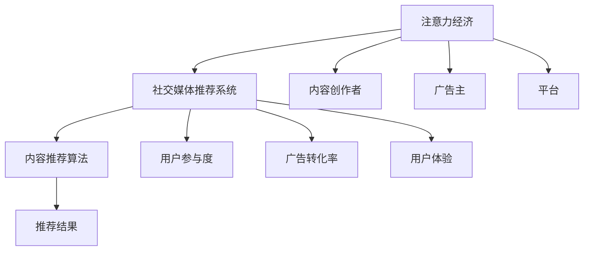

                 

# 注意力经济与社交媒体营销最佳实践：在不牺牲用户体验的情况下吸引受众

## 1. 背景介绍

### 1.1 问题由来
在数字化时代，注意力资源变得日益稀缺。如何有效地吸引和利用注意力，成为各个行业共同关注的焦点。特别是对于社交媒体平台，如何在保持用户高满意度的前提下，增加用户参与度和互动量，提高商业价值，成为平台和广告主都在探索的重要课题。社交媒体营销的本质，在于通过高质量的内容和精准的推荐，吸引用户的注意力，并促使其转化为实际的用户行为。

### 1.2 问题核心关键点
社交媒体营销的关键在于如何通过精确的内容推荐，最大化地利用用户的注意力资源。需要考虑的核心点包括：
- 内容质量：确保推荐内容的质量，吸引用户的兴趣和关注。
- 推荐算法：设计有效的推荐算法，精准匹配用户偏好。
- 用户反馈：及时获取用户反馈，持续优化推荐策略。
- 广告转化：提高广告的点击率和转化率，最大化广告收益。
- 用户体验：确保推荐过程不破坏用户体验，增强用户的满意度和粘性。

### 1.3 问题研究意义
掌握社交媒体营销的最佳实践，对于提高用户参与度和平台商业价值具有重要意义：

1. 提升用户满意度：通过精准推荐，使内容与用户兴趣匹配，满足用户需求，提高用户满意度和平台粘性。
2. 增加用户互动：精准匹配用户的社交行为和兴趣点，促使他们更频繁地参与互动，形成活跃的用户社区。
3. 优化广告效果：精准定向用户，提高广告的曝光率和点击率，实现更高的广告转化和收益。
4. 数据驱动决策：通过数据分析，理解用户行为和需求，优化平台策略和产品功能，实现业务迭代和提升。

## 2. 核心概念与联系

### 2.1 核心概念概述

要实现高效的社交媒体营销，需要理解并掌握以下几个核心概念：

- **注意力经济**：以吸引和利用用户的注意力为核心的经济模式。内容创作者通过优质的内容吸引用户关注，广告主通过精准投放广告获取流量，平台通过高流量实现商业变现。

- **社交媒体推荐系统**：基于用户的社交行为和历史数据，通过算法推荐用户可能感兴趣的内容。推荐系统旨在最大化地利用用户注意力，提高平台流量和用户参与度。

- **内容推荐算法**：指通过模型训练，预测用户可能感兴趣的个性化内容，并推荐给用户的算法。推荐算法的设计直接影响推荐的准确性和用户满意度。

- **用户参与度**：指用户在社交媒体平台上进行各种互动活动的频率和时长。包括点赞、评论、分享、观看、点击等行为。提高用户参与度是社交媒体营销的核心目标之一。

- **广告转化率**：指广告被点击后，转化为实际购买或互动的比例。高广告转化率意味着广告投放效果的最大化。

- **用户体验**：指用户在社交媒体平台上的主观体验。推荐系统需注意避免频繁打扰用户，保持界面简洁和互动流畅。

这些核心概念之间的逻辑关系可以通过以下Mermaid流程图来展示：



这个流程图展示了几大核心概念的相互联系：

1. 注意力经济是整个社交媒体生态的基础。
2. 社交媒体推荐系统通过精准推荐，最大化利用用户注意力。
3. 内容推荐算法通过模型训练，提供个性化推荐。
4. 用户参与度反映用户互动行为，是推荐系统优化的重要指标。
5. 广告转化率衡量广告投放效果，是平台收益的重要来源。
6. 用户体验影响用户粘性，是推荐系统持续优化需要关注的关键点。

这些概念共同构成了社交媒体营销的全面框架，其间的平衡与协同将决定推荐效果和用户体验。

## 3. 核心算法原理 & 具体操作步骤

### 3.1 算法原理概述

社交媒体营销的核心在于构建一个精准、高效的内容推荐系统，以吸引和利用用户的注意力。其核心算法包括基于协同过滤的推荐算法、基于内容的推荐算法和深度学习推荐算法。

协同过滤算法（Collaborative Filtering）通过分析用户历史行为，推测用户可能感兴趣的内容。基于内容的推荐算法则直接分析内容的特征，将其与用户偏好进行匹配。深度学习推荐算法（如神经网络、CNN、RNN、Transformer等）通过学习用户和内容的交互模式，提供更精准的推荐结果。

### 3.2 算法步骤详解

以下详细介绍深度学习推荐算法的实现步骤：

**Step 1: 数据预处理**
- 收集用户行为数据，包括点赞、评论、分享、观看等。
- 对文本数据进行分词、去除停用词、词向量表示等预处理。

**Step 2: 特征工程**
- 提取用户特征，如用户ID、兴趣标签、社交关系等。
- 提取内容特征，如文本长度、词汇频率、情感极性等。

**Step 3: 模型构建**
- 设计神经网络模型，如图卷积网络（GCN）、长短时记忆网络（LSTM）、Transformer等。
- 选择合适的损失函数，如均方误差、交叉熵等。

**Step 4: 模型训练**
- 将数据划分为训练集和验证集，使用训练集训练模型。
- 根据验证集性能调整超参数，如学习率、正则化强度等。
- 进行梯度下降等优化算法，最小化损失函数。

**Step 5: 推荐测试**
- 在测试集上评估模型的性能，如准确率、召回率、F1分数等。
- 生成推荐结果，供广告主和内容创作者参考。

**Step 6: 实时推荐**
- 对实时数据进行特征提取和模型推理。
- 实时生成推荐结果，提高用户互动和广告效果。

### 3.3 算法优缺点

深度学习推荐算法具有以下优点：
1. 能处理高维稀疏数据，效果优于传统的协同过滤算法。
2. 能学习用户行为模式，提供更精准的个性化推荐。
3. 可扩展性强，能处理大规模数据和复杂模型。

然而，深度学习推荐算法也存在以下缺点：
1. 模型复杂度高，训练和推理速度较慢。
2. 需要大量标注数据，难以在大规模社交平台中有效应用。
3. 对噪声数据和异常数据敏感，可能影响推荐结果。
4. 难以解释，难以发现模型的决策逻辑。

尽管存在这些局限性，但深度学习推荐算法在社交媒体推荐系统中仍表现出色，成为当前的主流推荐技术。

### 3.4 算法应用领域

深度学习推荐算法广泛应用于以下领域：

- 社交媒体推荐：如微博、微信、抖音等平台的内容推荐系统。
- 电商平台推荐：如淘宝、京东等平台的商品推荐系统。
- 视频平台推荐：如YouTube、Netflix等平台的内容推荐系统。
- 广告推荐：如广告投放系统中的定向推荐。

## 4. 数学模型和公式 & 详细讲解 & 举例说明

### 4.1 数学模型构建

社交媒体推荐系统通常基于深度神经网络模型构建。假设模型输入为用户行为数据 $x$，模型参数为 $\theta$，输出为推荐结果 $y$。目标是最小化预测值与真实标签之间的损失函数 $\ell(y, \hat{y})$。

$$
\mathcal{L}(\theta) = \frac{1}{N} \sum_{i=1}^N \ell(y_i, \hat{y}_i)
$$

其中 $\ell$ 为损失函数，$y_i$ 为真实标签，$\hat{y}_i$ 为模型预测。

### 4.2 公式推导过程

以基于Transformer的推荐系统为例，假设模型由编码器和解码器组成，输入为 $x$，输出为 $y$。编码器将输入 $x$ 映射到隐层表示 $h$，解码器将隐层表示 $h$ 映射到输出 $y$。

假设模型的参数为 $\theta$，其预测输出为 $\hat{y}$，则模型可以表示为：

$$
\hat{y} = f(\theta, x)
$$

其中 $f$ 为模型前向传播过程。

假设真实标签为 $y$，则损失函数 $\ell$ 可以表示为：

$$
\ell(y, \hat{y}) = -\frac{1}{N}\sum_{i=1}^N y_i\log \hat{y}_i
$$

### 4.3 案例分析与讲解

以基于Transformer的推荐系统为例，展示其推荐过程。

假设模型输入为用户行为数据 $x$，编码器对 $x$ 进行编码，输出隐层表示 $h$。解码器对隐层表示 $h$ 进行解码，输出推荐结果 $y$。假设 $y$ 为0或1，表示是否推荐给用户。

训练过程如下：

1. 将用户行为数据 $x$ 输入编码器，得到隐层表示 $h$。
2. 将隐层表示 $h$ 输入解码器，输出推荐结果 $\hat{y}$。
3. 计算损失函数 $\ell(y, \hat{y})$。
4. 反向传播更新模型参数 $\theta$。

重复以上步骤，直至模型收敛。

## 5. 项目实践：代码实例和详细解释说明

### 5.1 开发环境搭建

在进行推荐系统开发前，需要准备好开发环境。以下是使用Python进行TensorFlow开发的准备步骤：

1. 安装Anaconda：从官网下载并安装Anaconda，用于创建独立的Python环境。

2. 创建并激活虚拟环境：
```bash
conda create -n tf-env python=3.8 
conda activate tf-env
```

3. 安装TensorFlow：根据CUDA版本，从官网获取对应的安装命令。例如：
```bash
conda install tensorflow -c conda-forge -c pypi
```

4. 安装相关库：
```bash
pip install numpy pandas sklearn matplotlib tensorflow
```

完成上述步骤后，即可在`tf-env`环境中开始推荐系统开发。

### 5.2 源代码详细实现

以下是基于TensorFlow实现的内容推荐系统的代码实现：

```python
import tensorflow as tf
import numpy as np
import pandas as pd

# 定义数据预处理函数
def preprocess_data(data):
    # 数据清洗、特征提取、编码等
    return X_train, y_train, X_test, y_test

# 定义模型构建函数
def build_model(X, y):
    # 构建神经网络模型
    model = tf.keras.Sequential([
        tf.keras.layers.Dense(256, activation='relu', input_shape=(X.shape[1],)),
        tf.keras.layers.Dense(128, activation='relu'),
        tf.keras.layers.Dense(1, activation='sigmoid')
    ])
    model.compile(loss='binary_crossentropy', optimizer='adam', metrics=['accuracy'])
    return model

# 定义模型训练函数
def train_model(model, X_train, y_train, X_test, y_test):
    # 模型训练
    history = model.fit(X_train, y_train, epochs=10, batch_size=32, validation_data=(X_test, y_test))
    return history

# 定义模型评估函数
def evaluate_model(model, X_test, y_test):
    # 模型评估
    loss, accuracy = model.evaluate(X_test, y_test)
    print(f'Test loss: {loss}, Test accuracy: {accuracy}')

# 准备数据
X_train, y_train, X_test, y_test = preprocess_data(data)

# 构建模型
model = build_model(X_train, y_train)

# 训练模型
history = train_model(model, X_train, y_train, X_test, y_test)

# 评估模型
evaluate_model(model, X_test, y_test)
```

代码解读与分析：

**preprocess_data函数**：
- 用于数据预处理，包括数据清洗、特征提取、编码等。

**build_model函数**：
- 定义神经网络模型，包含输入层、隐藏层和输出层。

**train_model函数**：
- 使用训练数据训练模型，输出模型训练的历史记录。

**evaluate_model函数**：
- 使用测试数据评估模型性能。

**train_model和evaluate_model函数**：
- 调用上述函数进行模型训练和评估。

### 5.3 运行结果展示

训练结果和评估结果可以通过TensorBoard可视化：

```bash
tensorboard --logdir=log
```

可以在浏览器中查看训练过程和评估结果，帮助调试模型和超参数设置。

## 6. 实际应用场景

### 6.1 社交媒体推荐

社交媒体平台如微博、微信、抖音等，通过推荐系统为用户推荐可能感兴趣的内容，提高平台粘性和用户参与度。

在实际操作中，可以收集用户的行为数据，如点赞、评论、分享等，并结合内容的文本特征、用户兴趣标签等信息，训练推荐模型，生成推荐结果。例如，在微信朋友圈中，根据用户的浏览历史和点赞行为，推荐可能感兴趣的文章和视频。

### 6.2 电商平台推荐

电商平台如淘宝、京东等，通过推荐系统向用户推荐可能感兴趣的商品，提高点击率和购买转化率。

具体实现时，可以收集用户的浏览历史、购物车记录、购买行为等数据，并结合商品的文本描述、价格、评价等信息，训练推荐模型。例如，在电商平台上，根据用户的浏览历史和购物车记录，推荐可能感兴趣的商品。

### 6.3 视频平台推荐

视频平台如YouTube、Netflix等，通过推荐系统为用户推荐可能感兴趣的视频内容，提高观看率和观看时长。

具体实现时，可以收集用户的观看历史、点赞、评论等数据，并结合视频的标题、标签、时长等信息，训练推荐模型。例如，在视频平台上，根据用户的观看历史和点赞行为，推荐可能感兴趣的视频。

### 6.4 未来应用展望

未来，社交媒体推荐系统将向更精准、高效、个性化的方向发展：

1. 智能个性化推荐：通过深度学习等先进技术，实现更精准的用户兴趣建模，提供更个性化的推荐结果。
2. 实时推荐系统：通过实时数据处理和预测，提供实时的推荐服务，提高用户互动和广告效果。
3. 多模态推荐：结合文本、图像、视频等多种模态数据，提高推荐系统的泛化能力和鲁棒性。
4. 联合推荐：结合不同平台的推荐系统，为用户提供更加全面和一致的推荐结果。
5. 强化推荐：结合强化学习技术，优化推荐策略，提高用户满意度和平台收益。

## 7. 工具和资源推荐

### 7.1 学习资源推荐

为了帮助开发者系统掌握推荐系统的开发和优化，这里推荐一些优质的学习资源：

1. 《推荐系统》课程：由斯坦福大学开设的推荐系统课程，涵盖推荐系统原理、算法、工程实践等。

2. 《深度学习推荐系统》书籍：Google资深工程师所著，全面介绍了深度学习在推荐系统中的应用，包括算法实现、模型训练、性能优化等。

3. TensorFlow官方文档：TensorFlow的官方文档，提供丰富的推荐系统开发样例和API接口。

4. Kaggle推荐系统竞赛：Kaggle平台上的推荐系统竞赛，提供实际数据集和模型训练任务，帮助开发者提升实战能力。

5. GitHub推荐系统开源项目：GitHub上的推荐系统开源项目，包括TensorFlow、PyTorch、Scikit-Learn等推荐系统实现。

通过对这些资源的学习实践，相信你一定能够快速掌握推荐系统的精髓，并用于解决实际的推荐问题。

### 7.2 开发工具推荐

高效的推荐系统开发离不开优秀的工具支持。以下是几款用于推荐系统开发的常用工具：

1. TensorFlow：基于Python的深度学习框架，支持分布式计算和大规模数据处理，适合推荐系统开发。

2. PyTorch：基于Python的深度学习框架，灵活高效的动态图机制，适合推荐系统研究。

3. Scikit-Learn：基于Python的机器学习库，包含多种推荐算法实现，适合推荐系统工程应用。

4. Elasticsearch：分布式搜索引擎，适合处理大规模数据和实时推荐。

5. Hadoop/Spark：大数据处理框架，适合处理海量数据和实时推荐。

合理利用这些工具，可以显著提升推荐系统开发的效率，加快创新迭代的步伐。

### 7.3 相关论文推荐

推荐系统领域的研究非常活跃，以下是几篇奠基性的相关论文，推荐阅读：

1. Bellkamp, S., Rendle, S., & Giese, D. (2017). LightGBM: A Highly Efficient Gradient Boosting Decision Tree. In Proceedings of the 22nd ACM SIGKDD International Conference on Knowledge Discovery and Data Mining (KDD '17). Association for Computing Machinery.

2. Bengio, Y., Courville, A., & Vincent, P. (2015). Deep learning. MIT press.

3. Koren, Y. (2009). Factorization machines. Computer Science, 1(1), 3-7.

4. He, K., Zhang, X., Ren, S., & Sun, J. (2016). Deep residual learning for image recognition. In Proceedings of the IEEE conference on computer vision and pattern recognition (CVPR), 770-778.

这些论文代表了大数据推荐系统的最新进展，通过学习这些前沿成果，可以帮助研究者把握学科前进方向，激发更多的创新灵感。

## 8. 总结：未来发展趋势与挑战

### 8.1 总结

本文对社交媒体推荐系统的核心算法和操作步骤进行了全面系统的介绍。首先阐述了社交媒体推荐系统的背景和意义，明确了推荐系统优化用户参与度和平台收益的核心目标。其次，从原理到实践，详细讲解了推荐算法的数学模型和实现步骤，给出了推荐系统开发的完整代码实例。同时，本文还广泛探讨了推荐系统在社交媒体、电商、视频等领域的实际应用场景，展示了推荐系统的巨大潜力。最后，本文精选了推荐系统的各类学习资源，力求为读者提供全方位的技术指引。

通过本文的系统梳理，可以看到，社交媒体推荐系统正在成为推荐算法的重要应用范式，极大地提高了用户参与度和平台商业价值。未来，伴随推荐算法的持续演进和工程优化，相信推荐系统将在更多的领域发挥关键作用，为社会带来深远影响。

### 8.2 未来发展趋势

展望未来，社交媒体推荐系统将呈现以下几个发展趋势：

1. 推荐系统将向深度学习等先进技术深入，实现更精准的用户兴趣建模。
2. 实时推荐系统将得到广泛应用，提高推荐服务的及时性和用户互动。
3. 多模态推荐系统将结合文本、图像、视频等多种数据，提高推荐系统的泛化能力和鲁棒性。
4. 联合推荐系统将集成不同平台的推荐结果，提供更全面和一致的推荐服务。
5. 强化推荐系统将结合强化学习技术，优化推荐策略，提高用户满意度和平台收益。

以上趋势凸显了推荐系统技术的进步和应用前景，必将推动社交媒体和电商等领域的数字化转型和智能化升级。

### 8.3 面临的挑战

尽管推荐系统在推荐效果上取得了显著进展，但在实际应用中也面临着诸多挑战：

1. 数据隐私和安全问题。推荐系统需要收集大量的用户数据，如何保护用户隐私和数据安全，成为亟需解决的难题。
2. 数据冷启动问题。对于新用户和新商品，推荐系统难以提供精准推荐，需要进行用户画像和商品标签的快速建立。
3. 对抗攻击问题。对抗攻击可能导致推荐系统失效，如虚假用户行为和虚假商品点击。
4. 公平性和多样性问题。推荐系统容易产生推荐偏好和推荐结果的单一性，如何实现公平和多样性，提升推荐系统的社会价值。
5. 算法透明性和可解释性问题。推荐算法的复杂性和黑箱特性，使得其决策过程难以理解和解释，如何提升算法的透明性和可解释性，成为亟需解决的问题。

### 8.4 研究展望

面对推荐系统面临的挑战，未来的研究需要在以下几个方面寻求新的突破：

1. 探索基于隐私保护的数据挖掘和推荐算法。通过差分隐私、联邦学习等技术，保护用户隐私和数据安全。
2. 研发快速冷启动的用户画像和商品标签生成算法。利用图神经网络、序列模型等技术，快速建立新用户和商品的兴趣画像。
3. 结合对抗生成网络（GAN）等技术，提高推荐系统的鲁棒性和抗攻击能力。
4. 结合公平学习、多样性约束等技术，提升推荐系统的公平性和多样性。
5. 引入可解释性工具和方法，提高推荐算法的透明性和可解释性。

这些研究方向的探索，必将引领推荐系统技术迈向更高的台阶，为构建智能推荐系统提供更全面的技术支撑。总之，推荐系统需要从技术、工程、伦理等多个维度进行全面优化，才能真正实现其社会价值和经济效益。

## 9. 附录：常见问题与解答

**Q1：推荐系统如何解决冷启动问题？**

A: 推荐系统在处理冷启动问题时，通常有以下几种方法：
1. 用户画像生成：通过收集用户的其他行为数据，如搜索、浏览、收藏等，生成初步的用户画像。
2. 商品标签生成：通过分析商品的分类信息、属性信息等，生成商品的标签信息。
3. 协同过滤：通过分析已有用户的行为数据，推测新用户可能感兴趣的商品。
4. 深度学习：通过模型训练，预测新用户和新商品的可能匹配度。

这些方法可以结合使用，快速建立新用户和商品的兴趣画像，实现精准推荐。

**Q2：推荐系统如何应对对抗攻击？**

A: 对抗攻击可能导致推荐系统失效，需要采取以下措施应对：
1. 数据清洗：清洗异常数据和虚假行为，减少攻击数据的影响。
2. 对抗训练：训练模型对对抗样本具有鲁棒性，减少攻击对推荐结果的影响。
3. 多模型集成：通过多个推荐模型的集成，提升系统的稳定性和抗攻击能力。
4. 动态更新：实时更新推荐策略，避免攻击对推荐结果的长期影响。

**Q3：推荐系统如何实现公平性和多样性？**

A: 推荐系统在实现公平性和多样性时，可以采取以下措施：
1. 数据预处理：清洗包含偏见的数据，避免推荐结果的偏斜。
2. 算法设计：设计公平性的优化目标，如平衡推荐结果的覆盖率、多样性等。
3. 多样性约束：设置多样性约束，如推荐结果中包含一定比例的多样性商品。
4. 用户反馈：收集用户反馈，优化推荐策略，减少推荐结果的偏斜。

通过这些方法，可以实现推荐系统的公平性和多样性，提升系统的社会价值。

---

作者：禅与计算机程序设计艺术 / Zen and the Art of Computer Programming

