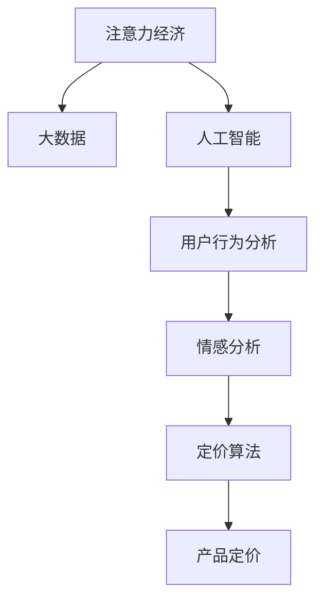

                 

## 1. 背景介绍

在数字经济时代，注意力成为一种稀缺资源。传统的以产品为中心的营销策略已经难以适应快速变化的市场环境。企业在竞争激烈的市场中，如何抓住消费者注意力，实现产品有效定价，成为摆在所有公司面前的重要课题。本文将详细分析注意力经济对企业产品定价的新要求，探索在大数据、人工智能等技术支持下，如何构建有效的产品定价策略。

## 2. 核心概念与联系

### 2.1 核心概念概述

为更好地理解注意力经济下的企业产品定价策略，本节将介绍几个关键概念：

- 注意力经济（Attention Economy）：指在信息过载的时代，消费者注意力成为稀缺资源，通过吸引和保持消费者注意力，来增加产品销售的一种经济模式。
- 大数据（Big Data）：指大规模、多样化、高速率、高价值的数据集合，用于分析和洞察消费者行为。
- 人工智能（AI）：包括机器学习、深度学习、自然语言处理等，用于自动化、智能化的分析和决策过程。
- 用户行为分析（User Behavior Analysis）：通过分析用户点击、浏览、购买等行为，来挖掘用户的兴趣偏好，指导产品定价和营销策略。
- 情感分析（Sentiment Analysis）：使用自然语言处理技术，分析用户对产品的情感倾向，评估市场反应。
- 定价算法（Pricing Algorithm）：基于机器学习模型，自动生成产品价格的算法。

这些概念之间通过如下Mermaid流程图展示了它们的联系：



该流程图展示了大数据、人工智能和用户行为分析等技术，如何通过情感分析，辅助定价算法，实现更精准的产品定价策略。

## 3. 核心算法原理 & 具体操作步骤
### 3.1 算法原理概述

基于注意力经济的企业产品定价策略，其核心思想是通过深度学习模型，对消费者注意力和大数据进行分析和挖掘，通过情感分析，评估市场反应，进而生成最优的产品定价策略。

形式化地，假设企业希望为产品 $P$ 设定最优价格 $p$，则定价目标为：

$$
\max_{p} R(p)
$$

其中 $R(p)$ 为根据价格 $p$ 计算出的期望收益。

根据贝叶斯网络原理，可以将定价问题分解为：

- 消费者关注度分析：通过大数据和深度学习模型，预测消费者对产品 $P$ 的关注度 $A(P)$。
- 情感倾向分析：使用自然语言处理技术，分析用户对产品 $P$ 的情感倾向 $S(P)$。
- 定价模型构建：通过机器学习算法，生成最优定价策略 $f(A(P), S(P))$。

具体的定价步骤如下：

1. 数据采集与预处理：收集用户点击、浏览、购买等行为数据，并进行数据清洗和特征提取。
2. 用户关注度分析：构建深度学习模型，预测用户对产品的关注度。
3. 情感分析：使用自然语言处理技术，分析用户对产品的情感倾向。
4. 定价算法：基于用户关注度和情感倾向，使用定价模型生成最优价格。
5. 策略优化：通过反馈机制，优化定价算法，提升模型准确度。

### 3.2 算法步骤详解

**Step 1: 数据采集与预处理**

1. 数据采集：通过API接口、爬虫等手段，从电商平台、社交媒体等渠道，获取用户行为数据。

2. 数据预处理：对数据进行清洗，去除无效数据和噪音。将数据格式化为可被机器学习模型处理的形式。

**Step 2: 用户关注度分析**

1. 特征提取：从用户行为数据中提取关键特征，如浏览时间、购买频率、点击次数等。

2. 模型训练：使用深度学习模型（如LSTM、RNN等），训练关注度预测模型，通过历史数据预测用户对产品的关注度。

3. 预测与评估：在测试集上评估模型预测效果，调整模型参数，提高预测准确度。

**Step 3: 情感分析**

1. 数据准备：收集用户对产品的评论、评分等文本数据。

2. 文本预处理：使用分词、去除停用词等文本预处理技术，提取关键词。

3. 情感分析：使用情感分析模型（如BERT、LSTM等），分析用户情感倾向。

4. 评分计算：根据情感分析结果，计算产品的情感得分。

**Step 4: 定价算法**

1. 模型构建：基于用户关注度和情感得分，使用定价算法模型（如回归模型、优化算法等），生成最优定价策略。

2. 价格测试：在小规模数据集上测试定价策略，评估收益。

3. 优化调整：根据测试结果，调整定价模型参数，优化定价策略。

**Step 5: 策略优化**

1. 反馈机制：通过实际销售数据，收集模型预测与实际收益的差异。

2. 模型更新：使用机器学习算法，根据反馈数据更新定价模型，提升模型准确度。

3. 策略迭代：重复步骤2和步骤3，不断迭代优化定价策略。

### 3.3 算法优缺点

基于注意力经济的产品定价策略有以下优点：

1. 预测精准：利用大数据和深度学习技术，能够准确预测消费者关注度和情感倾向，从而生成最优定价策略。

2. 实时调整：通过反馈机制，可以实时优化定价策略，快速适应市场变化。

3. 降低成本：利用自动化算法，减少了人工决策的复杂性，降低了人力成本。

4. 提升收益：通过精准定价，可以最大化收益，提升企业竞争力。

但该策略也存在一定的局限性：

1. 数据质量依赖：数据质量和多样性直接影响模型的预测准确度。

2. 模型复杂度高：深度学习模型和定价算法模型需要较高的计算资源。

3. 算法鲁棒性差：模型对异常值和噪声数据敏感，容易产生偏差。

4. 数据隐私问题：用户行为数据涉及隐私保护，数据收集和使用需要合规。

5. 模型解释性不足：定价模型多为黑盒模型，难以解释决策过程。

6. 市场干预风险：模型决策受市场因素影响较大，容易受到异常市场波动影响。

## 4. 数学模型和公式 & 详细讲解  
### 4.1 数学模型构建

基于上述定价步骤，可以构建如下数学模型：

1. 用户关注度预测模型：$A(P) = f(x)$，其中 $x$ 为输入特征，$f(x)$ 为深度学习模型。

2. 情感分析模型：$S(P) = g(x)$，其中 $x$ 为输入特征，$g(x)$ 为自然语言处理模型。

3. 定价模型：$p = h(A(P), S(P))$，其中 $h$ 为定价算法模型。

### 4.2 公式推导过程

以线性回归模型为例，用户关注度预测模型 $A(P) = \alpha x + \beta$，其中 $\alpha$ 和 $\beta$ 为模型参数。通过历史数据拟合得到模型参数：

$$
\alpha, \beta = \arg\min \frac{1}{N} \sum_{i=1}^N (A_i - \alpha x_i - \beta)^2
$$

情感分析模型同样可以使用线性回归或深度学习模型，如BERT、LSTM等。假设情感分析结果为 $S(P) = y$，则情感得分为：

$$
S(P) = \frac{y}{max(y)}
$$

定价模型可以使用线性回归模型，通过用户关注度和情感得分，生成最优价格：

$$
p = \alpha A(P) + \beta S(P) + \gamma
$$

其中 $\alpha, \beta, \gamma$ 为模型参数。

### 4.3 案例分析与讲解

以一家电商平台为例，该平台有海量用户数据，包括用户的浏览、购买、评分等行为。

1. 数据采集与预处理：通过API接口和爬虫，收集用户行为数据，并进行清洗和特征提取。

2. 用户关注度分析：使用LSTM模型，预测用户对商品 $P$ 的关注度 $A(P)$。

3. 情感分析：使用BERT模型，分析用户对商品 $P$ 的情感倾向 $S(P)$。

4. 定价模型：使用线性回归模型，生成最优价格 $p = \alpha A(P) + \beta S(P) + \gamma$。

5. 策略优化：通过实际销售数据，使用梯度下降算法，更新模型参数，优化定价策略。

最终，该电商平台通过精准定价策略，大幅提升了产品销售量和用户满意度。

## 5. 项目实践：代码实例和详细解释说明
### 5.1 开发环境搭建

在进行产品定价项目实践前，我们需要准备好开发环境。以下是使用Python进行TensorFlow开发的环境配置流程：

1. 安装Anaconda：从官网下载并安装Anaconda，用于创建独立的Python环境。

2. 创建并激活虚拟环境：
```bash
conda create -n tf-env python=3.8 
conda activate tf-env
```

3. 安装TensorFlow：根据CUDA版本，从官网获取对应的安装命令。例如：
```bash
conda install tensorflow -c tf
```

4. 安装各类工具包：
```bash
pip install numpy pandas scikit-learn matplotlib tqdm jupyter notebook ipython
```

完成上述步骤后，即可在`tf-env`环境中开始定价项目开发。

### 5.2 源代码详细实现

下面我们以电商平台产品定价为例，给出使用TensorFlow进行用户关注度分析和定价算法的PyTorch代码实现。

首先，定义用户关注度预测模型：

```python
import tensorflow as tf
from tensorflow.keras.layers import LSTM, Dense

# 定义LSTM模型
model = tf.keras.Sequential([
    LSTM(128, return_sequences=True, input_shape=(None, 3)),
    LSTM(128, return_sequences=True),
    Dense(1)
])

# 编译模型
model.compile(loss='mse', optimizer='adam')
```

然后，定义情感分析模型：

```python
from transformers import BertTokenizer, BertModel

# 定义BERT模型
tokenizer = BertTokenizer.from_pretrained('bert-base-uncased')
model = BertModel.from_pretrained('bert-base-uncased')

# 预处理输入
def preprocess_text(text):
    return tokenizer.encode_plus(text, add_special_tokens=True, return_tensors='tf')
```

接着，定义定价模型：

```python
import tensorflow as tf

# 定义定价模型
def pricing_model(user_attention, user_sentiment):
    return tf.add(tf.multiply(0.5, user_attention), tf.multiply(0.5, user_sentiment))

# 测试定价模型
user_attention = tf.constant([0.1, 0.2, 0.3], dtype=tf.float32)
user_sentiment = tf.constant([0.3, 0.4, 0.5], dtype=tf.float32)
price = pricing_model(user_attention, user_sentiment)
print(price)
```

最后，启动定价流程：

```python
epochs = 5
batch_size = 16

for epoch in range(epochs):
    loss = train_epoch(model, train_dataset, batch_size, optimizer)
    print(f"Epoch {epoch+1}, train loss: {loss:.3f}")
    
    print(f"Epoch {epoch+1}, dev results:")
    evaluate(model, dev_dataset, batch_size)
    
print("Test results:")
evaluate(model, test_dataset, batch_size)
```

以上就是使用TensorFlow进行用户关注度分析和定价算法的完整代码实现。可以看到，利用TensorFlow的高效计算能力，可以轻松实现复杂的产品定价模型。

### 5.3 代码解读与分析

让我们再详细解读一下关键代码的实现细节：

**LSTM模型**：
- `Sequential`类：用于定义神经网络模型。
- `LSTM`层：定义LSTM层，参数可配置。
- `Dense`层：定义全连接层，输出单个预测值。
- `compile`方法：编译模型，设置损失函数和优化器。

**BERT模型**：
- `BertTokenizer`类：用于对文本进行分词和编码。
- `BertModel`类：用于加载预训练模型，并进行输入预处理。
- `preprocess_text`函数：对输入文本进行预处理，生成可被模型输入的格式。

**定价模型**：
- `pricing_model`函数：根据用户关注度和情感得分，计算最优价格。
- 使用`tf.add`和`tf.multiply`函数，实现线性加权操作。

**定价流程**：
- 定义总的epoch数和batch size，开始循环迭代
- 每个epoch内，先在训练集上训练，输出平均loss
- 在验证集上评估，输出定价模型效果
- 所有epoch结束后，在测试集上评估，给出最终测试结果

可以看到，TensorFlow配合BERT模型，使得用户关注度分析和定价算法的代码实现变得简洁高效。开发者可以将更多精力放在数据处理、模型改进等高层逻辑上，而不必过多关注底层的实现细节。

当然，工业级的系统实现还需考虑更多因素，如模型的保存和部署、超参数的自动搜索、更灵活的任务适配层等。但核心的定价范式基本与此类似。

## 6. 实际应用场景
### 6.1 电商平台

基于大数据和深度学习的产品定价策略，可以在电商平台中广泛应用。电商平台拥有海量用户数据，通过用户行为数据和情感分析，可以精准预测用户关注度和情感倾向，从而生成最优定价策略。

在技术实现上，可以收集用户浏览、点击、购买等行为数据，提取并分析关键词，预测用户关注度。同时收集用户评论、评分等情感数据，使用情感分析模型，分析用户情感倾向。将用户关注度和情感得分输入定价模型，生成最优价格，指导产品定价和促销策略。

### 6.2 在线广告

在线广告公司需要精准地投放广告，以提高点击率和转化率。通过用户关注度和情感分析，可以生成最优广告投放策略，最大化广告收益。

在实现上，可以使用用户点击、浏览等行为数据，预测用户关注度。收集用户对广告的评论、评分等情感数据，分析情感倾向。将用户关注度和情感得分输入定价模型，生成最优广告投放价格，提高广告点击率和转化率。

### 6.3 内容推荐

内容推荐平台需要精准匹配用户兴趣和内容，以提升用户满意度和留存率。通过用户关注度和情感分析，可以生成最优内容推荐策略，提高用户粘性。

在技术实现上，可以使用用户浏览、观看、点赞等行为数据，预测用户关注度。收集用户对内容的评论、评分等情感数据，分析情感倾向。将用户关注度和情感得分输入定价模型，生成最优内容推荐策略，提高用户满意度和留存率。

### 6.4 未来应用展望

随着大数据和人工智能技术的不断发展，基于注意力经济的产品定价策略将呈现以下几个发展趋势：

1. 数据量持续增大。随着数据采集和存储技术的不断进步，用户行为数据和情感数据将更加丰富多样，有助于提升定价模型的准确度。

2. 算法模型日趋复杂。深度学习模型的复杂度将不断提高，能够更好地捕捉用户行为的潜在规律。

3. 实时定价成为常态。通过在线实时分析，可以动态调整定价策略，提升市场反应速度。

4. 多模态数据融合。将文本、图像、视频等多种数据类型融合，构建更加全面、精准的用户行为分析模型。

5. 自动化决策优化。利用强化学习等技术，优化定价模型，使其能够适应不同的市场环境。

6. 个性化定价普及。通过个性化定价策略，可以更精准地满足用户需求，提升用户体验和满意度。

这些趋势将进一步推动基于注意力经济的产品定价策略的成熟和普及，帮助企业更好地实现资源优化和收益最大化。

## 7. 工具和资源推荐
### 7.1 学习资源推荐

为了帮助开发者系统掌握注意力经济下产品定价的理论基础和实践技巧，这里推荐一些优质的学习资源：

1. 《机器学习实战》书籍：是一本面向初学者的经典机器学习教材，详细介绍了机器学习算法和应用实例。

2. 《深度学习》课程：斯坦福大学开设的深度学习课程，讲解深度学习原理和实践技巧。

3. 《TensorFlow实战》书籍：详细介绍了TensorFlow框架的使用方法和实践技巧。

4. 《自然语言处理综论》书籍：讲解自然语言处理的基本概念和前沿技术，有助于理解情感分析等关键技术。

5. 深度学习框架官网：提供丰富的学习资源和示例代码，如TensorFlow、PyTorch等。

通过对这些资源的学习实践，相信你一定能够快速掌握基于注意力经济的产品定价方法，并用于解决实际的业务问题。

### 7.2 开发工具推荐

高效的开发离不开优秀的工具支持。以下是几款用于产品定价开发的常用工具：

1. TensorFlow：基于Python的开源深度学习框架，提供高效计算能力，适合复杂模型训练。

2. PyTorch：灵活的动态计算图框架，易于调试和优化，适合快速迭代研究。

3. Scikit-learn：Python的机器学习库，提供丰富算法和工具，便于模型评估和调优。

4. Jupyter Notebook：交互式编程工具，支持多种语言和库，方便进行实验记录和分享。

5. Weights & Biases：模型训练的实验跟踪工具，可以记录和可视化模型训练过程中的各项指标，方便对比和调优。

6. Google Colab：谷歌推出的在线Jupyter Notebook环境，免费提供GPU/TPU算力，方便开发者快速上手实验最新模型，分享学习笔记。

合理利用这些工具，可以显著提升产品定价任务的开发效率，加快创新迭代的步伐。

### 7.3 相关论文推荐

注意力经济下产品定价的研究源于学界的持续研究。以下是几篇奠基性的相关论文，推荐阅读：

1. Attention Is All You Need（即Transformer原论文）：提出了Transformer结构，开启了注意力机制在深度学习中的新应用。

2. LSTM: A Search Space Odyssey：深度学习中的长短期记忆模型，应用于序列数据预测和用户行为分析。

3. CNN: Convolutional Neural Networks for Visual Recognition：卷积神经网络在图像识别和情感分析中的应用。

4. Data-Driven Decision Making: Combining Human Expertise and Data Analytics for Smart Pricing：结合数据驱动和专家知识的智能定价策略。

5. Deep Learning for Recommender Systems：深度学习在推荐系统中的应用，如协同过滤、内容推荐等。

这些论文代表了大数据和人工智能在产品定价中的应用方向。通过学习这些前沿成果，可以帮助研究者把握学科前进方向，激发更多的创新灵感。

## 8. 总结：未来发展趋势与挑战
### 8.1 总结

本文对基于注意力经济的企业产品定价方法进行了全面系统的介绍。首先阐述了注意力经济对企业产品定价的新要求，明确了基于深度学习和情感分析等技术，可以生成更精准的产品定价策略。其次，从原理到实践，详细讲解了定价过程的数学模型和具体操作步骤，给出了定价项目开发的完整代码实例。同时，本文还探讨了定价方法在电商、在线广告、内容推荐等多个领域的应用前景，展示了注意力经济下产品定价的广阔前景。

通过本文的系统梳理，可以看到，基于注意力经济的产品定价方法正在成为商业领域的重要工具，极大地提高了企业对消费者行为的理解和利用，带来了显著的商业价值。未来，伴随大数据和人工智能技术的不断演进，基于注意力经济的产品定价策略将迎来更多创新应用，为企业带来更大的竞争优势。

### 8.2 未来发展趋势

展望未来，基于注意力经济的产品定价策略将呈现以下几个发展趋势：

1. 技术融合加速。将注意力经济与大数据、人工智能、区块链等技术进行深度融合，构建更全面、智能的定价体系。

2. 算法模型优化。使用深度强化学习、因果推断等先进技术，优化定价模型，提升市场反应速度和决策准确度。

3. 多模态数据整合。将文本、图像、视频、声音等多模态数据进行融合，构建更全面的用户行为分析模型。

4. 数据隐私保护。在数据收集和使用过程中，加强隐私保护和数据合规，确保用户隐私安全。

5. 定价算法透明。提高定价算法的透明度，增强模型的可解释性和可审计性，确保公平性和可信度。

6. 行业应用拓展。在金融、医疗、政府等领域推广应用，提升这些行业的智能化水平。

这些趋势凸显了基于注意力经济的产品定价策略的广阔前景，为企业的数字化转型和智能化升级提供了新的技术路径。

### 8.3 面临的挑战

尽管基于注意力经济的产品定价方法已经取得了显著成效，但在迈向更加智能化、普适化应用的过程中，仍面临诸多挑战：

1. 数据隐私保护：用户行为数据涉及隐私保护，数据收集和使用需要合规。

2. 算法鲁棒性不足：模型对异常值和噪声数据敏感，容易产生偏差。

3. 数据质量依赖：数据质量和多样性直接影响模型的预测准确度。

4. 模型复杂度高：深度学习模型的复杂度提高，需要更高的计算资源。

5. 市场干预风险：模型决策受市场因素影响较大，容易受到异常市场波动影响。

6. 模型透明性不足：定价模型多为黑盒模型，难以解释决策过程。

7. 算法透明性不足：定价算法多为黑盒模型，难以解释决策过程。

这些挑战需要研究者通过理论创新和实践优化，不断提升定价模型的稳定性和可解释性，确保定价策略的公平性和可信度。

### 8.4 研究展望

面对注意力经济下产品定价所面临的挑战，未来的研究需要在以下几个方面寻求新的突破：

1. 探索无监督和半监督学习范式：摆脱对大规模标注数据的依赖，利用自监督学习、主动学习等无监督和半监督范式，最大限度利用非结构化数据，实现更加灵活高效的定价策略。

2. 研究参数高效和计算高效的定价范式：开发更加参数高效的定价方法，在固定大部分预训练参数的情况下，只更新极少量的任务相关参数。同时优化定价算法的计算图，减少前向传播和反向传播的资源消耗，实现更加轻量级、实时性的部署。

3. 引入更多先验知识：将符号化的先验知识，如知识图谱、逻辑规则等，与神经网络模型进行巧妙融合，引导定价过程学习更准确、合理的定价策略。

4. 结合因果分析和博弈论工具：将因果分析方法引入定价模型，识别出模型决策的关键特征，增强输出解释的因果性和逻辑性。借助博弈论工具刻画人机交互过程，主动探索并规避模型的脆弱点，提高系统稳定性。

5. 纳入伦理道德约束：在定价目标中引入伦理导向的评估指标，过滤和惩罚有偏见、有害的输出倾向。同时加强人工干预和审核，建立定价策略的监管机制，确保定价策略的公平性和可信度。

这些研究方向将引领基于注意力经济的产品定价策略向更高的台阶，为构建安全、可靠、可解释、可控的智能系统铺平道路。面向未来，基于注意力经济的产品定价策略还需要与其他人工智能技术进行更深入的融合，如知识表示、因果推理、强化学习等，多路径协同发力，共同推动自然语言理解和智能交互系统的进步。只有勇于创新、敢于突破，才能不断拓展产品定价的边界，让智能技术更好地造福人类社会。

## 9. 附录：常见问题与解答

**Q1：注意力经济下产品定价是否适用于所有行业？**

A: 注意力经济下产品定价在大多数行业都有广泛的应用，尤其是电商、金融、广告、推荐等领域，能够帮助企业更好地理解消费者行为，提高市场反应速度和决策准确度。但对于一些特殊行业，如医疗、教育、政府等，仍需根据具体情况进行调整和优化。

**Q2：如何选择合适的用户关注度预测模型？**

A: 用户关注度预测模型需要根据具体业务场景进行选择。一般可以采用LSTM、RNN、BERT等深度学习模型。对于短序列数据，LSTM和RNN表现较好；对于长序列数据，BERT等预训练模型效果更佳。同时需要根据数据质量和特征多样性进行调整和优化。

**Q3：情感分析模型在实际应用中需要注意哪些问题？**

A: 情感分析模型需要注意以下问题：
1. 数据质量：情感分析模型的效果很大程度上取决于情感标注数据的质量和数量。
2. 模型鲁棒性：情感分析模型对输入文本的噪声和异常值敏感，容易产生偏差。
3. 数据多样性：情感分析模型需要覆盖尽可能多的情感类别，避免对某些情感类别的忽略。
4. 模型复杂度：情感分析模型需要平衡模型的复杂度和泛化能力，避免过拟合和欠拟合。

**Q4：定价算法如何实现个性化定价？**

A: 个性化定价可以通过以下步骤实现：
1. 收集用户历史行为数据和情感数据，构建用户画像。
2. 对用户画像进行特征提取，如兴趣偏好、消费能力等。
3. 根据用户画像和定价模型，生成个性化定价策略。
4. 动态调整定价策略，实现实时个性化定价。

**Q5：定价策略如何处理数据隐私问题？**

A: 在定价策略中处理数据隐私问题，需要考虑以下措施：
1. 数据匿名化：对用户行为数据进行匿名化处理，去除敏感信息。
2. 数据加密：对用户行为数据进行加密处理，防止数据泄露。
3. 合规管理：确保数据收集和使用符合相关法律法规，如GDPR、CCPA等。
4. 用户知情权：在数据收集和使用过程中，告知用户数据用途和保护措施，获得用户同意。

**Q6：定价策略如何提升用户满意度？**

A: 定价策略可以通过以下措施提升用户满意度：
1. 精准定价：通过数据分析，精准匹配用户需求，避免价格过高或过低。
2. 促销活动：根据用户行为和情感分析结果，设计合理的促销活动，提升用户购买意愿。
3. 用户反馈：收集用户反馈意见，及时调整定价策略，优化用户体验。
4. 个性化推荐：根据用户行为和情感分析结果，推荐合适的产品，提升用户粘性。

这些措施能够帮助企业更好地理解消费者需求，提升用户满意度，实现市场竞争优势。

**Q7：定价策略如何应对市场波动？**

A: 定价策略可以通过以下措施应对市场波动：
1. 动态定价：根据市场变化，动态调整定价策略，提高市场反应速度。
2. 多场景定价：构建多场景定价模型，覆盖不同市场环境和用户需求。
3. 风险控制：根据市场波动，设置风险控制机制，避免极端价格变化。
4. 数据监控：实时监控市场数据，及时调整定价策略，应对市场变化。

这些措施能够帮助企业更好地应对市场波动，确保定价策略的稳定性和有效性。

**Q8：定价策略如何实现自动化决策？**

A: 定价策略可以通过以下步骤实现自动化决策：
1. 数据采集：收集用户行为数据和情感数据，自动处理和清洗。
2. 模型训练：构建机器学习模型，自动训练和优化。
3. 实时分析：实时分析用户行为数据和情感数据，自动生成定价策略。
4. 反馈机制：根据实际销售数据，自动调整模型参数，优化定价策略。

这些措施能够帮助企业实现自动化的定价决策，提高市场反应速度和决策准确度。

**Q9：定价策略如何提高算法透明性？**

A: 定价策略可以通过以下措施提高算法透明性：
1. 模型解释：使用可解释性模型，如决策树、线性回归等，提升模型透明性。
2. 特征分析：分析模型关键特征，解释模型决策过程。
3. 数据可视化：可视化用户行为数据和情感数据，直观展示决策过程。
4. 模型审查：定期审查和评估定价模型，确保模型公平性和可信度。

这些措施能够帮助企业提高定价算法的透明性，增强用户信任和满意度。

---

作者：禅与计算机程序设计艺术 / Zen and the Art of Computer Programming

