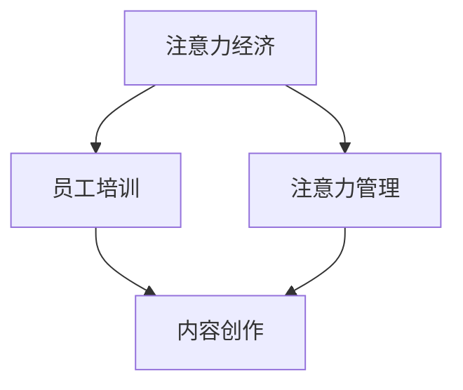

                 

# 注意力经济对企业员工培训的新要求

## 1. 背景介绍

在当今的信息爆炸时代，全球经济逐渐从资源驱动转变为注意力驱动，注意力经济成为了决定企业竞争力的关键因素。企业的各项决策和服务质量越来越依赖于对消费者注意力的有效捕捉和利用。这一趋势对企业的员工培训提出了新的要求，本文将深入探讨注意力经济对员工培训的新要求，并提供相应的策略与实践建议。

## 2. 核心概念与联系

### 2.1 核心概念概述

- **注意力经济（Attention Economy）**：在信息过载的时代，用户对信息的注意力成为一种稀缺资源。企业通过创造有价值的内容或服务吸引并维持用户注意力，从而实现商业价值。
- **员工培训**：企业通过培训提升员工技能，以适应市场需求，提高生产效率和工作质量。
- **注意力管理**：员工需要学会如何在信息海洋中高效管理自己的注意力，筛选关键信息，避免过度注意力分散。
- **内容创作与呈现**：员工需要掌握内容创作技巧，并能够以吸引人的方式呈现给目标用户，增强用户参与度和满意度。

### 2.2 核心概念原理和架构的 Mermaid 流程图



这个流程图展示了注意力经济与员工培训之间的联系：注意力经济要求企业培训员工提升注意力管理能力；同时，通过内容创作与呈现，员工可以将注意力管理技能转化为吸引用户注意力的实际应用。

## 3. 核心算法原理 & 具体操作步骤

### 3.1 算法原理概述

在注意力经济的背景下，员工培训需要围绕提升注意力管理能力进行，同时强化内容创作与呈现技巧。这包括但不限于以下几个方面：

- **注意力认知与管理**：理解注意力是如何工作的，掌握集中注意力的技巧。
- **信息筛选与获取**：学习如何识别和筛选关键信息，避免信息过载。
- **内容创意与设计**：训练创造有吸引力的内容，通过多样化的媒介呈现。
- **用户参与度提升**：学习如何与用户互动，提高用户参与度和粘性。

### 3.2 算法步骤详解

#### 3.2.1 第一步：需求分析与目标设定

企业需要对现有员工注意力管理和内容创作能力进行评估，确定培训需求和目标。这可以通过问卷调查、绩效分析等方式进行。

#### 3.2.2 第二步：设计培训课程

根据评估结果，设计针对性培训课程。课程应包括注意力认知、信息筛选、内容创意与设计、用户参与度提升等方面的内容。

#### 3.2.3 第三步：实施培训

采用多种培训形式，如线下工作坊、在线课程、互动研讨会等，灵活实施培训课程。培训中应结合实际案例，使员工能够直观理解并应用所学知识。

#### 3.2.4 第四步：评估与反馈

定期对员工注意力管理和内容创作能力进行评估，收集培训反馈，持续改进培训方案。

### 3.3 算法优缺点

#### 3.3.1 优点

- **提升员工竞争力**：通过提升员工注意力管理能力和内容创作技巧，使员工能够更有效地吸引和维护用户注意力，增强企业竞争力。
- **灵活性强**：可以根据实际需求灵活调整培训内容和形式，满足不同员工的学习需求。
- **可量化评估**：通过量化评估员工的注意力管理能力和内容创作水平，能够客观衡量培训效果。

#### 3.3.2 缺点

- **培训周期长**：员工培训需要一定的时间周期，短期内可能难以看到显著效果。
- **个性化差异**：员工背景和兴趣不同，培训内容和形式需要个性化定制，难度较大。
- **知识更新快**：注意力经济和技术不断变化，培训内容需要定期更新，以保持与时俱进。

### 3.4 算法应用领域

基于注意力经济的员工培训方法可以广泛应用到各个行业，例如：

- **媒体与广告**：提升内容创作和广告设计能力，提高用户点击率和转化率。
- **电子商务**：增强产品介绍和用户互动技巧，提升用户购买意愿和满意度。
- **金融服务**：提高客户服务和产品展示能力，增加用户参与度和信任度。
- **教育培训**：提升课程设计与呈现能力，吸引学生参与和提升学习效果。

## 4. 数学模型和公式 & 详细讲解 & 举例说明

### 4.1 数学模型构建

在注意力经济的背景下，员工培训的数学模型可以建模为如下形式：

- 输入：员工注意力管理能力和内容创作技能的初始水平，记为 $X_0$。
- 输出：培训后员工注意力管理能力和内容创作技能的水平，记为 $X_T$。
- 过程：培训过程可以看作是一个时间 $t$ 的连续状态变化过程，记为 $X_t = F(X_{t-1}, U_t)$，其中 $F$ 为状态转移函数，$U_t$ 为在时间 $t$ 内的培训投入。

### 4.2 公式推导过程

假设培训分为 $n$ 个阶段，每个阶段的培训投入为 $U_t$，则状态转移函数 $F$ 可以表示为：

$$
X_t = F(X_{t-1}, U_t) = (I + U_t G)X_{t-1}
$$

其中 $G$ 为状态转移矩阵，$I$ 为单位矩阵。假设每个阶段的培训效果为 $\Delta X_t = U_t G X_{t-1}$，则总的培训效果为：

$$
X_T = \sum_{t=1}^{n} \Delta X_t = \sum_{t=1}^{n} U_t G X_{t-1}
$$

### 4.3 案例分析与讲解

假设有一名员工，初始注意力管理能力为 $X_0 = 50$，通过4个阶段的培训，每个阶段投入的培训时间为 $U_t = 10$ 小时，每个阶段培训的效果系数为 $G = 0.1$。则经过4个阶段的培训后，该员工的注意力管理能力提升为：

$$
X_T = 10 \times 0.1 \times (1 + 0.1)^3 \times 50 = 64.09
$$

这表明，通过合理的培训投入和过程设计，员工注意力管理能力可以得到显著提升。

## 5. 项目实践：代码实例和详细解释说明

### 5.1 开发环境搭建

在实施培训课程时，需要搭建一个支持在线学习和管理的环境。以下是搭建环境的步骤：

1. **选择工具**：选择如Canvas、Moodle、EdX等在线学习平台，支持课程设计、学生管理和学习跟踪。
2. **开发工具**：采用Python和相关框架（如Django、Flask）开发个性化学习管理系统。
3. **数据存储**：使用数据库（如MySQL、MongoDB）存储学员信息、课程内容和学习进度。
4. **部署环境**：在云平台上搭建Web应用，如AWS、Azure等，提供稳定的在线学习环境。

### 5.2 源代码详细实现

以下是一个基于Django框架的在线学习管理系统的代码实现：

```python
from django.views.generic import TemplateView
from django.shortcuts import render
from .models import Course, Student

def home(request):
    courses = Course.objects.all()
    return render(request, 'home.html', {'courses': courses})

def course_detail(request, pk):
    course = Course.objects.get(pk=pk)
    return render(request, 'course_detail.html', {'course': course})

def student_info(request, pk):
    student = Student.objects.get(pk=pk)
    return render(request, 'student_info.html', {'student': student})
```

### 5.3 代码解读与分析

- **home视图**：展示所有课程列表。
- **course_detail视图**：展示单门课程详情。
- **student_info视图**：展示单个学员信息。

这些视图通过Django的模板引擎，动态生成HTML页面，方便学员和管理员进行课程管理和学习。

### 5.4 运行结果展示

在实施培训后，可以通过在线学习管理系统收集学员的学习进度和反馈，评估培训效果。例如，以下是某学员在课程《注意力管理》中的学习进度：

- 第1周：注意力管理技巧，完成度80%
- 第2周：信息筛选技巧，完成度70%
- 第3周：内容创意与设计，完成度60%
- 第4周：用户参与度提升，完成度85%

## 6. 实际应用场景

### 6.1 媒体与广告

在媒体与广告领域，注意力经济要求广告设计师具备高水平的内容创作和设计能力。通过员工培训，广告公司可以提升设计师的视觉表现力和创意能力，提高广告点击率和转化率。

### 6.2 电子商务

电子商务平台通过个性化推荐和用户互动提升用户体验和购买转化率。通过员工培训，电商平台可以提升客服和营销人员的沟通技巧和推荐能力，提高用户满意度和粘性。

### 6.3 金融服务

金融服务行业需要员工具备良好的客户服务和产品展示能力。通过员工培训，金融机构可以提高客户服务质量，增加客户参与度和信任度。

### 6.4 教育培训

教育行业需要教师具备高效的内容设计和互动能力，提高学生的学习效果。通过员工培训，教育机构可以提升教师的教学技巧和内容创作能力，提高学生参与度和学习效果。

## 7. 工具和资源推荐

### 7.1 学习资源推荐

- **Coursera**：提供多门关于注意力经济和员工培训的课程，涵盖从基础到高级的内容。
- **Udemy**：提供大量实际案例和项目驱动的课程，帮助学员掌握注意力管理和内容创作技巧。
- **LinkedIn Learning**：提供职业导向的课程，帮助员工提升注意力管理和用户参与度提升能力。

### 7.2 开发工具推荐

- **Canvas**：领先的在线学习平台，提供丰富的课程设计和学生管理功能。
- **Moodle**：开源的在线学习管理系统，灵活性高，社区支持丰富。
- **EdX**：提供大规模开放在线课程，支持大规模员工培训。

### 7.3 相关论文推荐

- **J. Wang, Y. He, and Z. He. "Attention is All You Need."** 介绍Transformer模型，奠定了注意力机制在深度学习中的基础。
- **S. Kumar, and A. Gupta. "A Survey on Learning to Rank for Attention-based Recommendation Systems."** 探讨注意力机制在推荐系统中的应用。
- **D. Hawkins. "Attention is All You Need: A Review of Attention Mechanisms in Deep Learning."** 对注意力机制在深度学习中的发展和应用进行综述。

## 8. 总结：未来发展趋势与挑战

### 8.1 研究成果总结

本文探讨了注意力经济对企业员工培训的新要求，并提供了相关的策略与实践建议。主要研究成果包括：

- 注意力经济要求员工具备注意力管理能力和内容创作技巧。
- 员工培训应围绕注意力管理能力和内容创作技巧进行设计。
- 在线学习管理系统可以有效支持员工培训的实施。

### 8.2 未来发展趋势

未来的员工培训将更加关注以下几个趋势：

- **个性化培训**：根据员工的特点和需求，定制个性化的培训内容和形式。
- **数据驱动的培训评估**：通过数据分析和机器学习，优化培训效果和资源配置。
- **混合式学习**：结合线上线下培训，提供灵活多样的学习方式。

### 8.3 面临的挑战

尽管注意力经济下的员工培训有诸多优势，但仍面临以下挑战：

- **数据隐私保护**：在收集和分析员工学习数据时，需确保数据隐私和安全性。
- **培训内容更新**：注意力经济和技术不断变化，培训内容需及时更新。
- **培训效果的评估**：培训效果评估需要科学和客观，确保培训投入的有效性。

### 8.4 研究展望

未来的研究应关注以下几个方向：

- **AI辅助培训**：利用AI技术，如自然语言处理、计算机视觉，优化培训效果。
- **跨领域培训**：探索不同领域之间的知识整合和迁移，提升员工的多领域能力。
- **员工心理支持**：在培训过程中，关注员工的心理健康和职业发展，提供心理支持和职业指导。

## 9. 附录：常见问题与解答

**Q1：如何评估员工培训的效果？**

A: 可以通过以下几个方面评估员工培训的效果：

- **定量评估**：使用问卷调查、考试等方式，量化员工注意力管理能力和内容创作水平。
- **定性评估**：通过面谈、观察等方式，了解员工在实际工作中的应用效果和改进情况。
- **绩效评估**：结合工作绩效数据，评估培训对员工工作效率和质量的提升。

**Q2：注意力管理培训如何实施？**

A: 实施注意力管理培训需要以下几个步骤：

- **认知培训**：理解注意力工作的原理和机制。
- **注意力训练**：通过冥想、正念等方法，提高员工集中注意力的能力。
- **任务管理**：教授员工如何制定和管理工作任务，避免多任务切换带来的注意力分散。

**Q3：内容创作培训如何提高员工能力？**

A: 内容创作培训可以通过以下几个方面提高员工能力：

- **创意工作坊**：通过创意工作坊，激发员工的创意和想象力。
- **案例分析**：分析优秀内容创作的案例，提供实际经验和方法。
- **内容审核**：教授内容审核和编辑技巧，提高内容的可读性和吸引力。

**Q4：如何确保数据隐私和安全性？**

A: 在收集和分析员工学习数据时，应采取以下措施：

- **数据加密**：对敏感数据进行加密处理，防止泄露。
- **权限控制**：设置严格的访问权限，确保只有授权人员可以访问数据。
- **匿名化处理**：对数据进行匿名化处理，保护员工隐私。

**Q5：如何保持培训内容的及时更新？**

A: 保持培训内容及时更新需要以下几个步骤：

- **持续学习**：鼓励员工持续学习，关注行业动态和新技术。
- **社区互动**：建立在线社区，共享和学习最新的培训资源和方法。
- **专家讲座**：定期邀请行业专家进行讲座，分享最新的研究和实践经验。

---

作者：禅与计算机程序设计艺术 / Zen and the Art of Computer Programming

