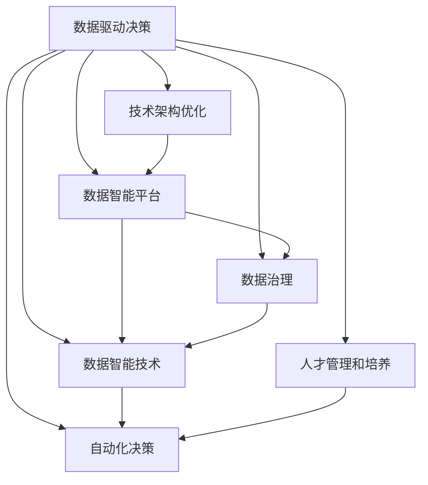

                 

# 注意力经济对企业组织结构的影响

> 关键词：注意力经济, 数据驱动决策, 企业组织结构, 数据智能, 自动化, 人才管理, 数字化转型

## 1. 背景介绍

### 1.1 问题由来

在数字化时代，信息的增长速度远远超过了人类的处理能力。这种信息过载现象，不仅存在于用户的日常消费中，也深刻影响了企业的运营和决策。面对海量数据的洪流，企业需要在信息采集、存储、分析、应用等环节进行全面变革，以提升决策效率和竞争力。

注意力经济（Economics of Attention）便是在这种背景下提出的新概念。它强调在信息爆炸的时代，获取、利用和分配注意力资源的重要性。企业在决策过程中，需要对各种数据进行筛选和分析，从而得出更有价值的结论。这就要求企业具备高水平的数据处理和分析能力，以及灵活应对市场变化的能力。

### 1.2 问题核心关键点

面对注意力经济带来的挑战，企业需要从以下几个方面入手：

- **数据驱动决策**：通过数据收集、清洗、分析，准确识别市场趋势和用户需求，驱动业务决策。
- **技术架构优化**：构建数据智能平台，实现数据的高效存储、管理和分析，提升决策效率。
- **人才管理和培养**：培养具备数据智能、技术架构和商业思维的综合型人才，支撑企业数字化转型。
- **组织结构调整**：调整组织结构，适应数据驱动和自动化带来的变化，确保企业灵活应对市场。

## 2. 核心概念与联系

### 2.1 核心概念概述

为更好地理解注意力经济对企业组织结构的影响，本节将介绍几个密切相关的核心概念：

- **数据驱动决策**：以数据为驱动因素，基于数据分析和模型预测进行决策的过程。数据驱动决策强调客观事实，减少了主观偏见对决策的影响。

- **技术架构优化**：构建支持数据智能应用的技术架构，包括数据湖、数据仓库、数据管道等，确保数据的高效流动和分析。

- **数据智能平台**：将数据处理、分析、应用等过程进行整合，构建一体化的数据智能平台，提升决策效率和质量。

- **数据治理**：定义和实施数据管理策略，确保数据质量、安全、合规，保障数据智能应用的可靠性和可扩展性。

- **数据智能技术**：包括但不限于机器学习、深度学习、自然语言处理等，用于从海量数据中提取有价值的信息。

- **自动化决策**：通过机器学习和自然语言处理等技术，实现业务流程的自动化，提高效率和准确性。

- **人才管理和培养**：通过数据智能培训、岗位轮岗、职业发展路径规划等措施，培养具备数据智能能力的人才，满足企业数字化转型的需求。

这些核心概念之间的逻辑关系可以通过以下Mermaid流程图来展示：



这个流程图展示了一系列核心概念及其之间的关系：

1. 数据驱动决策以数据为驱动因素，是技术架构优化的基础。
2. 技术架构优化构建了数据智能平台，支持数据治理和数据智能技术的应用。
3. 数据智能平台提供了数据存储、管理和分析的功能，支撑自动化决策。
4. 数据治理确保数据质量和安全，保障数据智能应用的可靠性。
5. 数据智能技术用于从数据中提取价值，支持自动化决策。
6. 自动化决策提升业务流程效率和准确性。
7. 人才管理和培养提升员工数据智能能力，支撑自动化决策。

## 3. 核心算法原理 & 具体操作步骤
### 3.1 算法原理概述

注意力经济对企业组织结构的影响，主要体现在数据驱动决策和技术架构优化的过程中。以下将从这两个方面详细介绍核心算法原理。

### 3.2 算法步骤详解

#### 3.2.1 数据驱动决策

数据驱动决策的算法步骤主要包括：

1. **数据采集**：通过各种渠道获取相关数据，包括但不限于市场数据、用户行为数据、社交媒体数据等。
2. **数据清洗**：对采集到的数据进行去重、去噪、格式化等处理，确保数据质量。
3. **数据分析**：应用数据智能技术，如机器学习、深度学习等，对数据进行分析和挖掘，识别出有价值的信息。
4. **数据可视化**：将分析结果进行可视化展示，帮助决策者直观理解数据。
5. **决策制定**：根据数据可视化的结果，制定业务决策，指导行动。

#### 3.2.2 技术架构优化

技术架构优化的算法步骤主要包括：

1. **架构设计**：根据企业需求，设计符合数据智能应用的技术架构，包括数据湖、数据仓库、数据管道等。
2. **技术选型**：选择合适的技术栈和工具，确保架构的高效性和可扩展性。
3. **平台构建**：构建一体化的数据智能平台，支持数据采集、存储、分析和应用。
4. **系统集成**：将不同数据智能应用进行集成，实现数据的无缝流动和协同分析。
5. **监控和优化**：实时监控系统性能，根据需求进行优化调整。

### 3.3 算法优缺点

#### 3.3.1 数据驱动决策

数据驱动决策的优点包括：

- **客观性强**：数据驱动决策减少了主观偏见对决策的影响，提高了决策的客观性和科学性。
- **效率高**：数据智能技术可以自动化处理海量数据，提高决策效率。
- **适应性强**：数据驱动决策可以实时调整，适应市场变化。

缺点包括：

- **数据质量依赖**：数据驱动决策的效果依赖于数据的质量和准确性，如果数据存在偏差，可能导致错误决策。
- **技术门槛高**：需要具备数据智能技术的应用能力，对人才要求较高。

#### 3.3.2 技术架构优化

技术架构优化的优点包括：

- **高效性**：架构优化确保数据的高效存储和分析，提升了决策效率。
- **可扩展性**：架构优化支持大规模数据处理，具备良好的可扩展性。
- **灵活性**：架构优化可以根据业务需求进行调整，适应不同的应用场景。

缺点包括：

- **复杂性高**：架构设计和管理复杂，需要高水平的技术能力和经验。
- **成本高**：架构优化需要投入大量资源，包括人力、时间和资金。

### 3.4 算法应用领域

数据驱动决策和技术架构优化在多个领域有广泛应用，例如：

- **零售业**：通过分析用户行为数据，优化商品推荐和定价策略。
- **金融业**：利用市场数据和用户交易数据，进行风险管理和投资决策。
- **制造业**：通过生产数据和质量数据，优化生产流程和质量控制。
- **医疗业**：通过医疗数据和患者行为数据，提高诊断和治疗的准确性。
- **教育业**：通过学生学习数据和行为数据，个性化推荐学习内容和改进教学方法。

## 4. 数学模型和公式 & 详细讲解 & 举例说明

### 4.1 数学模型构建

在数据驱动决策中，常用的数学模型包括回归模型、分类模型、聚类模型等。以下以回归模型为例，介绍其数学模型构建。

假设我们有 $n$ 个样本 $(x_i, y_i)$，其中 $x_i$ 为特征向量，$y_i$ 为目标变量。回归模型的目标是最小化预测值 $\hat{y}_i$ 和真实值 $y_i$ 之间的差距，即：

$$
\min_{\theta} \sum_{i=1}^n (y_i - \hat{y}_i)^2
$$

其中 $\theta$ 为模型参数，包括线性回归模型的截距和斜率。

### 4.2 公式推导过程

线性回归模型的最小二乘解公式为：

$$
\hat{y}_i = \theta_0 + \theta_1 x_{i,1} + \cdots + \theta_p x_{i,p}
$$

其中 $\theta_0, \theta_1, \cdots, \theta_p$ 为模型参数，可以通过求解以下矩阵方程得到：

$$
\hat{\theta} = (X^T X)^{-1} X^T Y
$$

其中 $X = [x_{i,1}, \cdots, x_{i,p}]^T$，$Y = [y_1, \cdots, y_n]^T$。

### 4.3 案例分析与讲解

假设某零售公司希望通过用户购买历史数据，预测用户未来的购买行为。他们收集了10万个用户的历史购买记录，包括购买时间、购买金额、购买频率等。通过线性回归模型，他们预测用户未来的购买金额，并据此优化库存和促销策略。

具体步骤如下：

1. **数据收集**：收集用户购买历史数据，包括购买时间、购买金额、购买频率等。
2. **数据预处理**：对数据进行清洗和归一化处理，确保数据质量。
3. **模型训练**：构建线性回归模型，对数据进行训练。
4. **模型评估**：使用测试数据集对模型进行评估，调整模型参数。
5. **应用预测**：将模型应用于新用户，预测其未来购买金额，优化库存和促销策略。

## 5. 项目实践：代码实例和详细解释说明

### 5.1 开发环境搭建

在进行数据驱动决策和技术架构优化的实践前，我们需要准备好开发环境。以下是使用Python进行PyTorch和TensorFlow开发的环境配置流程：

1. 安装Anaconda：从官网下载并安装Anaconda，用于创建独立的Python环境。

2. 创建并激活虚拟环境：
```bash
conda create -n pytorch-env python=3.8 
conda activate pytorch-env
```

3. 安装PyTorch：根据CUDA版本，从官网获取对应的安装命令。例如：
```bash
conda install pytorch torchvision torchaudio cudatoolkit=11.1 -c pytorch -c conda-forge
```

4. 安装TensorFlow：
```bash
pip install tensorflow
```

5. 安装各类工具包：
```bash
pip install numpy pandas scikit-learn matplotlib tqdm jupyter notebook ipython
```

完成上述步骤后，即可在`pytorch-env`环境中开始数据驱动决策和技术架构优化的实践。

### 5.2 源代码详细实现

下面我们以零售业的数据驱动决策为例，给出使用PyTorch和TensorFlow进行数据驱动决策的代码实现。

首先，定义数据处理函数：

```python
import numpy as np
from sklearn.model_selection import train_test_split
from sklearn.linear_model import LinearRegression
from sklearn.metrics import mean_squared_error

def load_data():
    # 假设数据以csv格式存储，加载数据
    data = pd.read_csv('purchase_data.csv')
    # 处理缺失值和异常值
    data = data.dropna().replace({'Negative': 0, 'Positive': 1})
    # 划分训练集和测试集
    X = data.drop('Amount', axis=1)
    y = data['Amount']
    X_train, X_test, y_train, y_test = train_test_split(X, y, test_size=0.2)
    return X_train, X_test, y_train, y_test

def train_model(X_train, y_train, X_test, y_test):
    # 创建线性回归模型
    model = LinearRegression()
    # 训练模型
    model.fit(X_train, y_train)
    # 预测并计算MSE
    y_pred = model.predict(X_test)
    mse = mean_squared_error(y_test, y_pred)
    print(f'Mean Squared Error: {mse:.2f}')
    return model
```

然后，定义数据智能平台构建函数：

```python
def build_data_intelligence_platform():
    # 假设已经构建好了数据湖和数据仓库，可以使用Hadoop、Spark等技术
    # 设计数据管道
    data_pipelines = []
    # 集成数据管道到数据智能平台
    platform.add_data_pipelines(data_pipelines)
    # 构建数据管道可视化界面
    platform.build_data_pipelines_visualization()
    return platform
```

最后，启动数据驱动决策和技术架构优化的流程：

```python
# 加载数据
X_train, X_test, y_train, y_test = load_data()

# 训练模型
model = train_model(X_train, y_train, X_test, y_test)

# 构建数据智能平台
platform = build_data_intelligence_platform()
```

以上就是使用PyTorch和TensorFlow进行数据驱动决策和技术架构优化的完整代码实现。可以看到，通过数据智能平台的设计，可以方便地集成和优化数据驱动决策的技术架构。

### 5.3 代码解读与分析

让我们再详细解读一下关键代码的实现细节：

**数据处理函数**：
- `load_data`函数：用于加载数据，并进行缺失值处理和特征划分。
- `train_model`函数：用于构建线性回归模型，训练模型，并计算预测结果的均方误差（MSE）。

**数据智能平台构建函数**：
- `build_data_intelligence_platform`函数：用于构建数据智能平台，包括设计数据管道，集成数据管道到平台，以及构建数据管道可视化界面。

**数据驱动决策流程**：
- 加载数据：使用`load_data`函数加载数据，并进行处理。
- 训练模型：使用`train_model`函数训练线性回归模型，得到预测结果和MSE。
- 构建平台：使用`build_data_intelligence_platform`函数构建数据智能平台，实现数据的高效管理和分析。

## 6. 实际应用场景

### 6.1 零售业

在零售业中，数据驱动决策和技术架构优化有广泛应用。例如：

- **销售预测**：通过分析历史销售数据，预测未来销售趋势，优化库存和促销策略。
- **客户细分**：利用用户行为数据，将客户进行细分，制定个性化营销方案。
- **价格优化**：根据市场需求和竞争情况，动态调整商品价格，提高盈利能力。

### 6.2 金融业

在金融业中，数据驱动决策和技术架构优化也有广泛应用。例如：

- **风险管理**：通过分析历史交易数据，评估风险，制定风控策略。
- **投资决策**：利用市场数据和用户交易数据，进行投资组合优化。
- **信贷评估**：通过分析信用数据，评估客户的信用风险，制定信贷策略。

### 6.3 制造业

在制造业中，数据驱动决策和技术架构优化也有广泛应用。例如：

- **生产优化**：通过分析生产数据，优化生产流程和设备维护计划。
- **质量控制**：利用质量数据，提高产品质量和生产效率。
- **供应链管理**：通过供应链数据，优化供应链管理和物流配送。

### 6.4 未来应用展望

随着数据驱动决策和技术架构优化的不断发展，未来在更多领域将得到应用，为各行各业带来变革性影响。

在智慧城市治理中，数据驱动决策和技术架构优化可以用于城市事件监测、舆情分析、应急指挥等环节，提高城市管理的自动化和智能化水平，构建更安全、高效的未来城市。

在智慧医疗领域，数据驱动决策和技术架构优化可以用于医疗问答、病历分析、药物研发等应用，提升医疗服务的智能化水平，辅助医生诊疗，加速新药开发进程。

在智能教育领域，数据驱动决策和技术架构优化可以用于作业批改、学情分析、知识推荐等方面，因材施教，促进教育公平，提高教学质量。

此外，在企业生产、社会治理、文娱传媒等众多领域，数据驱动决策和技术架构优化也将不断涌现，为经济社会发展注入新的动力。

## 7. 工具和资源推荐
### 7.1 学习资源推荐

为了帮助开发者系统掌握数据驱动决策和技术架构优化的理论基础和实践技巧，这里推荐一些优质的学习资源：

1. **《深度学习》课程**：斯坦福大学开设的深度学习课程，介绍了深度学习的基本概念和核心算法，适合初学者入门。

2. **《数据科学导论》书籍**：一本系统介绍数据科学和机器学习的书籍，涵盖数据预处理、模型训练、特征工程等多个方面。

3. **《TensorFlow官方文档》**：TensorFlow的官方文档，提供了全面的API文档、示例代码和使用指南，是学习和使用TensorFlow的重要资源。

4. **Kaggle竞赛平台**：Kaggle是一个数据科学竞赛平台，可以参加各种数据科学竞赛，锻炼数据驱动决策的能力。

5. **Coursera课程**：Coursera提供了多种数据科学和机器学习的课程，包括数据驱动决策、大数据技术等多个主题。

通过对这些资源的学习实践，相信你一定能够快速掌握数据驱动决策和技术架构优化的精髓，并用于解决实际的商业问题。

### 7.2 开发工具推荐

高效的开发离不开优秀的工具支持。以下是几款用于数据驱动决策和技术架构优化的常用工具：

1. **PyTorch**：基于Python的开源深度学习框架，灵活动态的计算图，适合快速迭代研究。

2. **TensorFlow**：由Google主导开发的开源深度学习框架，生产部署方便，适合大规模工程应用。

3. **Pandas**：Python的数据处理库，提供高效的数据处理和分析能力。

4. **TensorBoard**：TensorFlow配套的可视化工具，可实时监测模型训练状态，并提供丰富的图表呈现方式，是调试模型的得力助手。

5. **Jupyter Notebook**：支持Python和R等多种语言的交互式编程环境，方便开发者进行数据驱动决策的实验和展示。

合理利用这些工具，可以显著提升数据驱动决策和技术架构优化的开发效率，加快创新迭代的步伐。

### 7.3 相关论文推荐

数据驱动决策和技术架构优化领域的研究进展迅速，以下是几篇奠基性的相关论文，推荐阅读：

1. **《深度学习》论文**：深度学习领域的奠基性论文，介绍了深度学习的基本概念和核心算法。

2. **《数据驱动决策》论文**：介绍了数据驱动决策的基本框架和关键技术，具有很高的理论价值和实践意义。

3. **《数据智能平台》论文**：介绍了数据智能平台的构建和应用，推动了数据驱动决策技术的发展。

4. **《自动化决策》论文**：介绍了自动化决策的基本方法和应用场景，提升了业务流程的效率和准确性。

这些论文代表了大数据驱动决策和技术架构优化领域的发展脉络。通过学习这些前沿成果，可以帮助研究者把握学科前进方向，激发更多的创新灵感。

## 8. 总结：未来发展趋势与挑战

### 8.1 总结

本文对数据驱动决策和技术架构优化的影响进行了全面系统的介绍。首先阐述了数据驱动决策和技术架构优化的研究背景和意义，明确了其在提升决策效率和应对市场变化中的独特价值。其次，从原理到实践，详细讲解了数据驱动决策和技术架构优化的数学模型和算法步骤，给出了数据驱动决策和技术架构优化的完整代码实例。同时，本文还广泛探讨了数据驱动决策和技术架构优化在零售、金融、制造等多个行业领域的应用前景，展示了其巨大的潜力和广泛的应用空间。

通过本文的系统梳理，可以看到，数据驱动决策和技术架构优化在提升企业决策效率和应对市场变化方面具有重要意义。未来的研究和应用将进一步推动企业数字化转型，提升竞争力和创新能力。

### 8.2 未来发展趋势

展望未来，数据驱动决策和技术架构优化将呈现以下几个发展趋势：

1. **智能化程度提升**：随着AI技术的发展，数据驱动决策将更加智能化，能够处理更加复杂的数据模式和业务场景。

2. **多模态融合**：未来数据驱动决策将更加注重多模态数据的融合，如文本、图像、语音等，提升决策的全面性和准确性。

3. **实时化应用**：数据驱动决策将更加注重实时性，能够实时处理和分析数据，提升决策的时效性和适应性。

4. **自适应系统**：数据驱动决策系统将更加注重自适应能力，能够根据市场变化自动调整决策模型和参数。

5. **边缘计算**：数据驱动决策将更加注重边缘计算，能够在本地处理和分析数据，减少数据传输和存储的负担。

6. **跨领域应用**：数据驱动决策将更加注重跨领域应用，能够应用于更多行业和场景，提升数据的普适性和应用范围。

这些趋势凸显了数据驱动决策和技术架构优化的广阔前景。这些方向的探索发展，必将进一步提升企业的数据处理和分析能力，为业务决策提供更科学、更高效的支持。

### 8.3 面临的挑战

尽管数据驱动决策和技术架构优化已经取得了瞩目成就，但在迈向更加智能化、普适化应用的过程中，仍面临诸多挑战：

1. **数据质量问题**：数据驱动决策的效果依赖于数据的质量和准确性，数据噪声和缺失值等问题可能导致错误决策。

2. **技术复杂性**：数据驱动决策和技术架构优化需要具备较高的技术门槛，对人才和资源要求较高。

3. **隐私与安全**：在处理大量个人数据时，数据隐私和安全问题需要特别关注，需要设计合理的隐私保护机制。

4. **法律合规性**：数据驱动决策和技术架构优化需要符合相关法律法规，确保数据使用的合法性。

5. **技术兼容性**：不同数据驱动决策和技术架构优化技术之间的兼容性问题需要解决，以实现无缝集成。

6. **系统稳定性**：数据驱动决策和技术架构优化系统需要具备较高的稳定性和可靠性，避免系统故障和数据丢失。

### 8.4 研究展望

未来的研究需要在以下几个方面寻求新的突破：

1. **数据增强与清洗**：研究更加高效的数据增强和清洗技术，提升数据质量，降低噪声和缺失值的影响。

2. **自动化模型构建**：研究自动化的模型构建和选择技术，减少人工干预，提升模型构建效率和质量。

3. **数据治理与隐私保护**：研究数据治理和隐私保护技术，确保数据的安全性和合规性。

4. **跨领域应用与融合**：研究跨领域数据驱动决策和技术架构优化技术，推动数据智能在更多行业和场景的应用。

5. **模型解释与可解释性**：研究模型的解释与可解释性技术，提高模型的透明度和可信度。

这些研究方向的探索，必将引领数据驱动决策和技术架构优化的技术进步，为构建高效、智能、安全的数据驱动决策系统提供坚实的基础。

## 9. 附录：常见问题与解答

**Q1：数据驱动决策和技术架构优化是否适用于所有行业？**

A: 数据驱动决策和技术架构优化在大多数行业都有广泛应用，特别是对于数据密集型的行业，如零售、金融、制造等。但对于一些传统行业，如农业、服务业等，由于数据收集和处理成本较高，可能需要结合实际情况进行适当的调整。

**Q2：如何选择合适的数据驱动决策模型？**

A: 选择合适的数据驱动决策模型需要考虑以下几个因素：

1. 数据类型：不同类型的数据适用于不同的模型，如分类问题适用于分类模型，回归问题适用于回归模型。

2. 数据量：数据量较小的问题适合使用简单模型，如线性回归；数据量较大的问题适合使用复杂模型，如深度学习。

3. 数据质量：数据质量较差的问题需要更加注重模型鲁棒性和泛化能力。

4. 模型复杂度：模型复杂度越高，需要的数据量越大，训练和推理时间也越长。

综合考虑这些因素，可以选用最适合的数据驱动决策模型。

**Q3：如何优化数据驱动决策的技术架构？**

A: 优化数据驱动决策的技术架构需要从以下几个方面入手：

1. 数据治理：定义和实施数据管理策略，确保数据质量和安全。

2. 数据存储：选择适合的数据存储技术，如Hadoop、Spark等，确保数据的可靠性和可扩展性。

3. 数据管道：设计高效的数据管道，确保数据的实时流动和分析。

4. 自动化工具：引入自动化工具，如Kubernetes、Spark等，提高数据驱动决策的效率和灵活性。

5. 监控和优化：实时监控系统性能，根据需求进行优化调整。

通过优化技术架构，可以显著提升数据驱动决策的效率和质量，满足企业的实际需求。

**Q4：数据驱动决策和技术架构优化对企业有哪些具体影响？**

A: 数据驱动决策和技术架构优化对企业有以下具体影响：

1. 提升决策效率：通过数据驱动决策，企业可以更加快速地分析市场变化和用户需求，制定更为科学的决策方案。

2. 优化资源配置：通过技术架构优化，企业可以实现数据的高效存储和分析，优化资源配置，降低成本。

3. 增强竞争力：数据驱动决策和技术架构优化可以帮助企业更好地理解市场，抓住机遇，提升竞争力。

4. 提高客户满意度：通过数据分析，企业可以更好地了解客户需求，提供个性化服务，提高客户满意度。

5. 提升运营效率：通过技术架构优化，企业可以实现业务流程的自动化，提高运营效率。

总之，数据驱动决策和技术架构优化可以带来多方面的好处，推动企业的数字化转型和智能化升级。

---

作者：禅与计算机程序设计艺术 / Zen and the Art of Computer Programming

