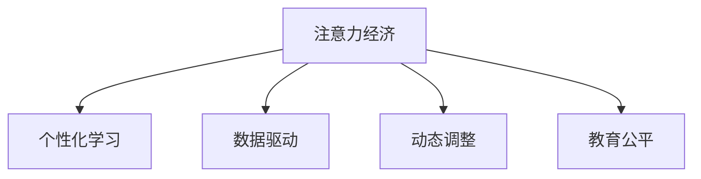

                 

# 注意力经济对传统教育评估体系的冲击

> 关键词：
- 注意力经济
- 教育评估体系
- 数据驱动
- 个性化学习
- 机器学习
- 大数据分析
- 教育公平

## 1. 背景介绍

### 1.1 问题由来

在数字化时代，互联网、移动互联网、大数据等技术的飞速发展，正深刻改变着人类的生产和生活方式。教育作为国家发展的基石，也在发生着显著变革。传统的教育评估体系，建立在学生考试成绩和教师教学成绩的基础上，虽然有其合理性，但也存在诸多弊端。

首先，传统的评估体系过于依赖考试成绩，忽视了学生的全面发展。考试成绩的局限性在于其无法全面反映学生的综合素质，容易误导教育目标。其次，教师的评估往往依靠行政指令和同行评议，存在主观性和不透明性。最后，教育资源分配不均，城乡、地区之间的教育差距较大，制约了教育的公平性。

针对这些弊端，“注意力经济”这一概念的提出，为教育评估体系提供了全新的思路。注意力经济，指的是在信息过载的时代，通过获取和分配注意力资源，创造社会价值的一种经济模式。在教育领域，注意力经济旨在将教育评估从以考试为中心，转向以学生注意力、教师注意力和教育资源的有效利用为中心，从而实现更加个性化、高效和公平的教育。

### 1.2 问题核心关键点

注意力经济对教育评估体系的影响，主要体现在以下几个方面：

- **个性化学习**：通过对学生、教师和教育资源注意力的精准分析和分配，实现个性化教学。
- **数据驱动**：通过大数据分析和机器学习技术，对学生表现和教师行为进行量化评估。
- **动态调整**：根据学生和教师的反馈，实时调整教学策略和资源配置，提升教学质量。
- **透明度**：提高评估过程的透明度，增强教育公平性和信任度。

本文将围绕这些关键点，深入探讨注意力经济对教育评估体系的冲击，并提出相应的改进方案。

## 2. 核心概念与联系

### 2.1 核心概念概述

为更好地理解注意力经济对教育评估体系的影响，本节将介绍几个核心概念：

- **注意力经济**：指在信息爆炸时代，通过获取和分配注意力资源创造社会价值的新型经济模式。
- **个性化学习**：根据学生的兴趣、能力、学习方式等个性化特征，定制教学计划和资源。
- **数据驱动**：利用大数据、机器学习等技术，对教育过程和效果进行数据驱动的分析和评估。
- **动态调整**：根据实时反馈数据，动态调整教学策略和资源配置，实现最优教育效果。
- **教育公平**：通过数据和技术的透明化，缩小教育资源分配差距，促进教育公平。

这些概念之间的逻辑关系可以通过以下Mermaid流程图来展示：



这个流程图展示注意力经济与个性化学习、数据驱动、动态调整、教育公平之间的逻辑关系：

1. 注意力经济通过精确分析和分配注意力资源，实现个性化学习。
2. 利用大数据和机器学习技术，对教育过程和效果进行数据驱动的分析和评估。
3. 根据实时反馈数据，动态调整教学策略和资源配置，提升教学质量。
4. 提高评估过程的透明度，缩小教育资源分配差距，促进教育公平。

## 3. 核心算法原理 & 具体操作步骤
### 3.1 算法原理概述

注意力经济对教育评估体系的冲击，体现在以下几个核心算法和原理上：

- **数据收集和处理**：收集学生、教师和教育资源的相关数据，包括考试成绩、课堂表现、学习行为等。
- **数据建模和分析**：利用机器学习算法，建立学生和教师的注意力模型，量化评估其行为和效果。
- **动态调整和优化**：根据建模结果和反馈数据，实时调整教学策略和资源配置，优化教育效果。
- **透明度和公平性**：通过公开数据和评估过程，增强教育公平性和透明度。

这些算法和原理的实现，离不开先进的计算技术和大数据处理能力的支持。

### 3.2 算法步骤详解

基于注意力经济的教育评估体系，一般包括以下几个关键步骤：

**Step 1: 数据收集**
- 收集学生、教师和教育资源的相关数据，包括考试成绩、课堂表现、学习行为等。
- 通过传感器、监控摄像头、学生互动系统等，实时采集学生的注意力状态和学习行为数据。

**Step 2: 数据预处理**
- 对收集到的数据进行清洗和预处理，去除噪音和异常值。
- 将数据标准化，转换为算法可接受的格式。

**Step 3: 数据建模**
- 利用机器学习算法，建立学生和教师的注意力模型，量化评估其行为和效果。
- 常用的模型包括聚类算法、回归模型、时间序列模型等，用于分析学生的学习习惯、教师的教学风格等。

**Step 4: 动态调整**
- 根据建模结果和反馈数据，实时调整教学策略和资源配置，优化教育效果。
- 例如，通过分析学生的注意力数据，动态调整教学内容和难度，实现个性化学习。

**Step 5: 透明度和公平性**
- 公开数据和评估过程，增强教育公平性和透明度。
- 建立教育数据平台，供学生、教师和家长查看和管理自己的数据。

以上是基于注意力经济的教育评估体系的一般流程。在实际应用中，还需要针对具体任务，对各个环节进行优化设计，如改进数据收集方法、优化算法模型、增强数据安全性等。

### 3.3 算法优缺点

注意力经济对教育评估体系的影响，具有以下优点和缺点：

**优点**：
1. **个性化学习**：通过精确分析和分配注意力资源，实现个性化教学。
2. **数据驱动**：利用大数据和机器学习技术，对教育过程和效果进行科学评估。
3. **动态调整**：根据实时反馈数据，动态调整教学策略和资源配置，提升教学质量。
4. **透明度和公平性**：提高评估过程的透明度，增强教育公平性和信任度。

**缺点**：
1. **数据隐私**：大量数据的收集和使用，涉及学生和教师的隐私，可能引发伦理和法律问题。
2. **技术门槛**：数据建模和分析需要较高的技术门槛，对数据科学家和教师的技术水平要求较高。
3. **数据质量**：数据的准确性和完整性直接影响评估结果，数据质量问题需重视。
4. **资源投入**：数据收集和处理、算法模型构建和优化等，需要大量时间和资源投入。

尽管存在这些缺点，但就目前而言，注意力经济的应用为教育评估体系带来了新的视角和可能性。

### 3.4 算法应用领域

注意力经济对教育评估体系的影响，不仅限于具体的算法和模型，还广泛适用于多个教育应用领域：

- **智慧教室**：通过智能传感器和监控系统，实时采集学生的注意力和学习行为数据，优化教学过程。
- **个性化学习平台**：利用机器学习算法，根据学生的学习习惯和能力，定制个性化的学习计划和资源。
- **教育数据分析**：通过大数据分析和可视化技术，对教育数据进行深入分析和解读，辅助教育决策。
- **教育公平研究**：利用注意力经济的方法，探索教育资源分配不均的原因和解决途径，促进教育公平。
- **在线教育**：通过实时反馈和动态调整，提高在线教育的个性化和互动性，提升学习效果。

以上应用领域展示了注意力经济在教育评估体系中的广泛应用，为教育技术的创新和发展提供了新的思路和方向。

## 4. 数学模型和公式 & 详细讲解 & 举例说明

### 4.1 数学模型构建

注意力经济在教育评估中的应用，可以通过以下几个数学模型进行描述：

1. **学生注意力模型**：描述学生在课堂上的注意力状态，包括集中程度、参与度等。
2. **教师行为模型**：描述教师的教学风格、教学方法等，分析其对学生学习效果的影响。
3. **教育资源配置模型**：描述教育资源的分布和利用情况，优化资源配置。

下面以学生注意力模型为例，进行详细讲解。

假设学生 $i$ 在课程 $j$ 上的注意力状态为 $A_{ij}$，取值范围为 $[0,1]$，值越大表示注意力越集中。根据课堂表现和考试成绩，可以建立学生注意力模型：

$$
A_{ij} = \alpha \cdot X_{ij} + \beta \cdot Y_{ij} + \epsilon
$$

其中，$X_{ij}$ 表示学生在课程 $j$ 上的课堂表现，$Y_{ij}$ 表示学生在课程 $j$ 上的考试成绩，$\alpha$ 和 $\beta$ 为权重系数，$\epsilon$ 为随机噪声。

### 4.2 公式推导过程

通过对学生注意力模型的推导，可以发现其建立过程如下：

1. **数据采集**：采集学生在课程 $j$ 上的课堂表现 $X_{ij}$ 和考试成绩 $Y_{ij}$。
2. **数据预处理**：对 $X_{ij}$ 和 $Y_{ij}$ 进行标准化处理，转换为算法可接受的格式。
3. **模型建立**：根据 $X_{ij}$ 和 $Y_{ij}$，建立学生注意力模型 $A_{ij}$。
4. **参数估计**：通过最小二乘法等优化算法，估计 $\alpha$ 和 $\beta$，确定权重系数。
5. **模型应用**：根据建立的模型，预测学生在课程 $j$ 上的注意力状态 $A_{ij}$，用于评估学习效果和调整教学策略。

通过这样的数学模型，可以量化评估学生的注意力状态，为个性化学习和动态调整提供依据。

### 4.3 案例分析与讲解

以下是一个具体的案例分析：

**案例背景**：某中学通过智能传感器和监控系统，采集学生在课堂上的注意力数据。通过对数据进行建模和分析，优化教学过程，提升学生学习效果。

**数据采集**：学校在每个教室安装智能摄像头和传感器，实时采集学生的注意力状态和课堂表现数据。

**数据预处理**：对采集到的数据进行清洗和预处理，去除异常值和噪音。

**模型建立**：利用机器学习算法，建立学生注意力模型。以某课程为例，建立如下模型：

$$
A_{ij} = 0.6 \cdot X_{ij} + 0.4 \cdot Y_{ij} + \epsilon
$$

其中 $X_{ij}$ 表示学生在课程 $j$ 上的课堂表现，$Y_{ij}$ 表示学生在课程 $j$ 上的考试成绩，$\epsilon$ 为随机噪声。

**参数估计**：通过最小二乘法等优化算法，估计 $\alpha=0.6$ 和 $\beta=0.4$，确定权重系数。

**模型应用**：根据建立的模型，预测学生在课程 $j$ 上的注意力状态 $A_{ij}$。例如，某学生在课程 $j$ 上的注意力状态 $A_{ij}$ 为 0.8，表示其在该课程上的注意力集中度较高。

**教学策略调整**：学校根据学生注意力状态 $A_{ij}$，调整教学策略和资源配置。例如，针对注意力集中度较高的学生，增加互动环节和问题引导；针对注意力集中度较低的学生，优化教学内容和方法，提升学习效果。

通过以上案例，可以看到，通过注意力经济的方法，可以实现对学生注意力状态的精准分析和利用，优化教学策略和资源配置，提升教育效果。

## 5. 项目实践：代码实例和详细解释说明
### 5.1 开发环境搭建

在进行注意力经济在教育评估中的应用实践前，我们需要准备好开发环境。以下是使用Python进行数据科学开发的环境配置流程：

1. 安装Anaconda：从官网下载并安装Anaconda，用于创建独立的Python环境。

2. 创建并激活虚拟环境：
```bash
conda create -n attention-env python=3.8 
conda activate attention-env
```

3. 安装PyTorch：根据CUDA版本，从官网获取对应的安装命令。例如：
```bash
conda install pytorch torchvision torchaudio cudatoolkit=11.1 -c pytorch -c conda-forge
```

4. 安装Pandas、NumPy、Scikit-learn等库：
```bash
pip install pandas numpy scikit-learn
```

5. 安装TensorBoard：用于可视化训练过程和结果。
```bash
pip install tensorboard
```

6. 安装Jupyter Notebook：用于交互式编程和数据可视化。
```bash
pip install jupyter notebook
```

完成上述步骤后，即可在`attention-env`环境中开始数据科学实践。

### 5.2 源代码详细实现

下面以学生注意力模型为例，给出使用Python进行数据建模和分析的代码实现。

```python
import pandas as pd
import numpy as np
from sklearn.linear_model import LinearRegression
from sklearn.metrics import mean_squared_error, mean_absolute_error

# 读取数据
data = pd.read_csv('attention_data.csv')

# 数据预处理
X = data[['X_i', 'Y_i']].values
Y = data['A_i'].values

# 模型建立
model = LinearRegression()
model.fit(X, Y)

# 模型评估
Y_pred = model.predict(X)
mse = mean_squared_error(Y, Y_pred)
mae = mean_absolute_error(Y, Y_pred)
print(f'MSE: {mse:.2f}, MAE: {mae:.2f}')
```

在这个代码示例中，我们首先使用Pandas读取数据，然后进行数据预处理，最后建立线性回归模型，并评估模型性能。

### 5.3 代码解读与分析

让我们再详细解读一下关键代码的实现细节：

**数据读取**：
```python
data = pd.read_csv('attention_data.csv')
```
从CSV文件中读取数据，存入Pandas DataFrame对象中。

**数据预处理**：
```python
X = data[['X_i', 'Y_i']].values
Y = data['A_i'].values
```
将数据按照特征和标签分开，转换为NumPy数组，以便进行模型训练。

**模型建立**：
```python
model = LinearRegression()
model.fit(X, Y)
```
使用线性回归模型，拟合输入和输出的关系。

**模型评估**：
```python
Y_pred = model.predict(X)
mse = mean_squared_error(Y, Y_pred)
mae = mean_absolute_error(Y, Y_pred)
print(f'MSE: {mse:.2f}, MAE: {mae:.2f}')
```
使用均方误差（MSE）和平均绝对误差（MAE）评估模型性能，并将结果打印输出。

通过这个代码示例，我们可以看到，利用Python和Scikit-learn库，可以轻松实现数据建模和分析。实际应用中，还需要进一步优化模型，结合注意力经济的具体应用场景，设计更加合理的评估指标。

## 6. 实际应用场景
### 6.1 智慧教室

智慧教室是注意力经济在教育评估中的典型应用场景。通过智能传感器和监控系统，实时采集学生的注意力和学习行为数据，优化教学过程，提升学习效果。

**应用场景**：某中学通过智能摄像头和传感器，实时采集学生的注意力状态和学习表现数据。利用机器学习算法，建立学生注意力模型，动态调整教学策略和资源配置。

**实际效果**：学校发现，学生的课堂参与度和学习效果显著提升，特别是对于注意力集中度较低的学生，通过个性化的教学策略，提升了其学习效果。

### 6.2 个性化学习平台

个性化学习平台是利用注意力经济在教育评估中实现个性化学习的重要工具。通过采集学生的数据，利用机器学习算法，为每个学生定制个性化的学习计划和资源。

**应用场景**：某在线教育平台通过智能推荐系统，实时采集学生学习行为数据，利用机器学习算法，分析学生的学习习惯和能力，定制个性化的学习计划。

**实际效果**：学生可以根据平台推荐的学习资源，高效完成学习任务，学习效果显著提升。

### 6.3 教育数据分析

教育数据分析是利用注意力经济在教育评估中进行深入分析的重要手段。通过大数据分析和可视化技术，对教育数据进行深入解读，辅助教育决策。

**应用场景**：某教育研究机构通过大数据分析技术，对全国范围内的教育数据进行深度挖掘，分析教育资源分布和利用情况，提出优化建议。

**实际效果**：研究机构发现，教育资源分配不均是导致教育公平性的重要因素，提出了一系列优化建议，供政府和教育机构参考。

### 6.4 未来应用展望

随着注意力经济在教育评估中的应用不断深入，未来将有更多新的应用场景涌现。例如：

- **智能作业批改**：利用人工智能技术，自动批改学生作业，提高作业批改效率。
- **在线课堂互动**：通过智能互动系统，实时收集学生的学习反馈，动态调整教学策略。
- **虚拟现实教室**：利用虚拟现实技术，创建沉浸式学习环境，提升学生的学习体验。
- **跨校合作**：通过数据共享和分析，促进不同学校之间的教育资源和经验交流，缩小教育差距。

这些应用场景展示了注意力经济在教育评估中的广阔前景，为教育技术的创新和发展提供了新的方向。

## 7. 工具和资源推荐
### 7.1 学习资源推荐

为了帮助开发者系统掌握注意力经济在教育评估中的应用，这里推荐一些优质的学习资源：

1. **《深度学习与教育》系列博文**：由教育技术专家撰写，深入浅出地介绍了深度学习在教育中的应用，包括注意力经济等前沿话题。
2. **Coursera《数据科学在教育中的应用》课程**：由斯坦福大学开设，涵盖大数据、机器学习在教育中的应用，适合学习者系统掌握相关知识。
3. **《机器学习与教育》书籍**：详细介绍了机器学习在教育中的应用，包括数据建模和分析等核心技术。
4. **Kaggle教育数据分析竞赛**：参加Kaggle竞赛，通过实际数据处理和模型评估，提升数据科学应用能力。
5. **HuggingFace官方文档**：介绍TensorFlow、PyTorch等深度学习框架，并提供了多款教育应用的开源代码。

通过对这些资源的学习实践，相信你一定能够快速掌握注意力经济在教育评估中的应用，并用于解决实际的NLP问题。

### 7.2 开发工具推荐

高效的开发离不开优秀的工具支持。以下是几款用于数据科学开发和分析的常用工具：

1. Jupyter Notebook：用于交互式编程和数据可视化，支持Python、R等语言。
2. TensorBoard：用于可视化训练过程和结果，支持TensorFlow、PyTorch等深度学习框架。
3. Python：用于数据处理和建模的通用语言，有大量第三方库支持。
4. Scikit-learn：用于机器学习建模的Python库，提供了丰富的模型和评估工具。
5. Pandas：用于数据处理和分析的Python库，支持大规模数据处理。

合理利用这些工具，可以显著提升数据科学开发和分析的效率，加快创新迭代的步伐。

### 7.3 相关论文推荐

注意力经济在教育评估中的应用，是数据科学和教育技术交叉研究的热点。以下是几篇奠基性的相关论文，推荐阅读：

1. **《机器学习在教育中的应用》**：介绍机器学习在教育中的应用，包括数据驱动的教育评估等。
2. **《智能教室中的数据驱动教育》**：利用智能教室数据，优化教学策略和资源配置，提升教育效果。
3. **《个性化学习平台的机器学习应用》**：介绍个性化学习平台的数据建模和算法优化，实现精准推荐。
4. **《数据驱动的教育公平研究》**：利用大数据分析技术，研究教育资源分配不均的原因和解决途径。
5. **《智能作业批改系统的研究》**：利用人工智能技术，自动批改学生作业，提高作业批改效率。

这些论文代表了大数据和机器学习在教育评估中的应用方向，为研究者提供了丰富的理论基础和实践指导。

## 8. 总结：未来发展趋势与挑战
### 8.1 总结

本文对注意力经济在教育评估中的应用进行了全面系统的介绍。首先阐述了注意力经济的定义和应用场景，明确了其在个性化学习、数据驱动、动态调整、教育公平等方面的独特价值。其次，从原理到实践，详细讲解了注意力经济在教育评估中的数学模型和核心算法，给出了数据建模和分析的完整代码实现。同时，本文还广泛探讨了注意力经济在智慧教室、个性化学习平台、教育数据分析等多个行业领域的应用前景，展示了其广阔的发展前景。

通过本文的系统梳理，可以看到，注意力经济在教育评估中的应用，为教育技术的创新和发展提供了新的视角和可能性。未来，伴随技术的不断进步和应用场景的拓展，注意力经济必将在教育评估领域发挥更大作用，推动教育公平和质量提升。

### 8.2 未来发展趋势

展望未来，注意力经济在教育评估中的应用将呈现以下几个发展趋势：

1. **数据的多样化和丰富化**：未来，教育数据将更加多样化，包括学生行为数据、教师教学数据、学习资源数据等，为教育评估提供更丰富的数据源。
2. **算法的复杂化和智能化**：随着深度学习和大数据技术的发展，教育评估算法将更加复杂和智能化，能够更精准地分析和预测教育过程和效果。
3. **应用的泛化和普及化**：注意力经济在教育评估中的应用将从个别学校扩展到全国甚至全球，为全球教育公平和质量提升贡献力量。
4. **伦理和安全性的重视**：随着数据隐私和伦理问题的日益突出，教育评估将更加注重数据安全性和伦理问题，保障学生和教师的权益。

以上趋势凸显了注意力经济在教育评估中的广阔前景。这些方向的探索发展，必将进一步提升教育评估的科学性和公平性，为教育技术的创新和发展提供新的动力。

### 8.3 面临的挑战

尽管注意力经济在教育评估中的应用带来了诸多机遇，但也面临诸多挑战：

1. **数据隐私和安全**：大量数据的收集和使用，涉及学生和教师的隐私，可能引发伦理和法律问题。
2. **技术门槛**：数据建模和分析需要较高的技术门槛，对数据科学家和教师的技术水平要求较高。
3. **数据质量**：数据的准确性和完整性直接影响评估结果，数据质量问题需重视。
4. **资源投入**：数据收集和处理、算法模型构建和优化等，需要大量时间和资源投入。

尽管存在这些挑战，但通过不断创新和优化，注意力经济必将在教育评估中发挥更大的作用。

### 8.4 研究展望

未来的研究需要在以下几个方面寻求新的突破：

1. **多模态数据融合**：将视觉、音频等多模态数据与文本数据进行融合，提升教育评估的全面性和准确性。
2. **动态评估机制**：引入动态评估机制，实时调整教学策略和资源配置，提升教育效果。
3. **个性化教育路径**：利用机器学习算法，设计个性化的教育路径，实现因材施教。
4. **跨领域应用**：将注意力经济的方法应用于其他领域，如医疗、金融等，拓展其应用范围。
5. **伦理和社会影响研究**：研究注意力经济在教育评估中的伦理和社会影响，确保其应用的安全性和公平性。

这些研究方向的探索，必将引领注意力经济在教育评估中的应用走向更高的台阶，为教育技术的创新和发展提供新的思路和方向。

## 9. 附录：常见问题与解答
----------------------------------------------------------------

**Q1：注意力经济在教育评估中的应用是否适用于所有教育场景？**

A: 注意力经济在教育评估中的应用，主要适用于数据收集和分析较为便捷、信息流通较快的教育场景，如智慧教室、在线教育等。但对于一些教育条件较为落后的地区，可能存在数据收集难度大、基础设施不足等问题，需逐步推进。

**Q2：注意力经济在教育评估中是否需要高水平的技术支持？**

A: 是的，注意力经济在教育评估中的应用，需要高水平的数据建模和分析技术，对数据科学家和教师的技术水平要求较高。建议相关人员进行系统的培训和实践，提高技术能力。

**Q3：注意力经济在教育评估中是否存在数据隐私和安全问题？**

A: 是的，注意力经济在教育评估中的应用，涉及大量学生和教师的隐私数据，可能引发数据隐私和安全问题。需制定严格的数据保护政策和操作规范，保障学生和教师的权益。

**Q4：注意力经济在教育评估中的数据质量如何保障？**

A: 数据质量是注意力经济在教育评估中的关键，需要通过多种手段保障数据质量，如数据清洗、异常值检测、数据标准化等。同时，建立数据质量监控机制，确保数据的准确性和完整性。

**Q5：注意力经济在教育评估中的资源投入如何？**

A: 注意力经济在教育评估中的资源投入较大，包括数据收集、处理、建模、分析和评估等环节。建议教育机构根据实际情况，合理规划资源，逐步推进应用。

通过对这些问题的解答，可以看到，注意力经济在教育评估中的应用，虽然面临诸多挑战，但通过不断的创新和优化，必将在教育评估领域发挥更大的作用。未来，随着技术的发展和应用场景的拓展，注意力经济必将成为教育技术的重要支撑，推动教育公平和质量提升。

