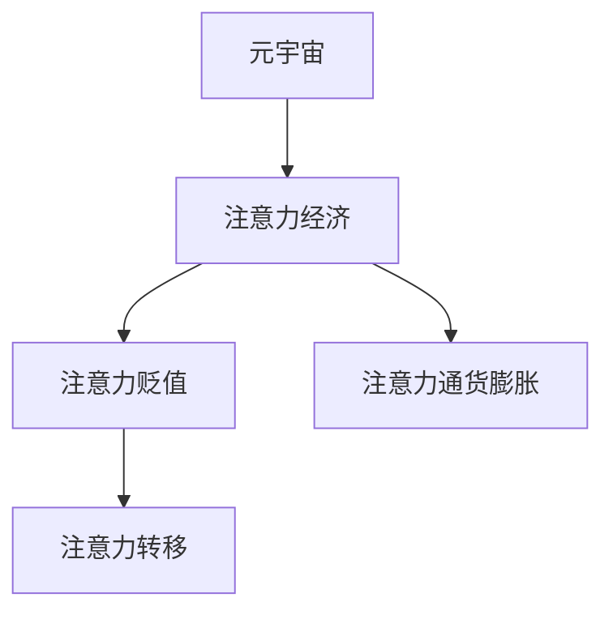

                 

# 注意力经济的通货膨胀:元宇宙中的注意力贬值现象

## 1. 背景介绍

在当下快速发展的数字化时代，注意力经济已成为驱动经济增长的关键要素。然而，随着元宇宙的兴起，注意力资源变得愈发稀缺，其经济价值开始出现“通货膨胀”现象，即注意力贬值。这种现象对经济活动和用户体验产生了深远影响，迫切需要找到有效的应对策略。

### 1.1 问题由来
元宇宙是一个高度沉浸式的虚拟世界，旨在为用户提供无限连通、共享和互动的环境。在这个虚拟空间中，注意力资源成为稀缺性资产，其经济价值逐渐提升。然而，由于技术、社交和商业模式的多重影响，注意力经济开始出现贬值现象，即在元宇宙中，用户注意力的成本逐渐升高，且价值难以稳定。这一问题已引起广泛关注。

### 1.2 问题核心关键点
元宇宙中的注意力贬值现象，主要体现在以下几个方面：
- 技术限制：元宇宙的计算能力、带宽限制，导致注意力资源的供给有限。
- 市场供需：虚拟经济中注意力资源的供需不均衡，导致价格波动。
- 用户体验：高注意力成本使内容创造者与消费者之间形成不平衡，影响用户粘性。
- 商业模式：现有的广告、订阅、付费等商业模式，无法有效应对注意力贬值带来的挑战。

这些因素共同作用，导致了元宇宙中注意力经济价值的变化，亟需理论和技术上的深入研究与应对。

## 2. 核心概念与联系

### 2.1 核心概念概述

为更好地理解元宇宙中注意力经济的通货膨胀现象，本节将介绍几个关键概念：

- 元宇宙(Metaverse)：一个高度沉浸式的虚拟世界，用户可以在其中进行社交、工作、娱乐等多重活动。
- 注意力经济(Attention Economy)：以获取、使用和分配注意力资源为核心，利用注意力资源创造价值的经济模式。
- 注意力贬值(Attention Deflation)：在元宇宙中，注意力资源的稀缺性使得其价值上升，但供应有限，导致注意力资源的实际使用效率降低，形成贬值现象。
- 注意力通货膨胀(Attention Inflation)：与传统货币的通货膨胀类似，注意力经济中注意力资源的价格波动，导致其贬值。
- 注意力转移(Attention Shift)：用户注意力的转移，如从低价值内容向高价值内容转移，是影响注意力贬值的重要因素。

这些概念之间的逻辑关系可以通过以下Mermaid流程图来展示：



这个流程图展示了几组核心概念及其之间的关系：

1. 元宇宙通过提供沉浸式的虚拟体验，使得注意力成为稀缺资源。
2. 注意力经济利用这一稀缺资源，通过各种方式创造经济价值。
3. 注意力贬值反映了注意力经济中的价值波动现象。
4. 注意力通货膨胀是注意力贬值的一种表现形式。
5. 注意力转移影响注意力资源的分配和价格波动。

这些概念共同构成了元宇宙中注意力经济的框架，是理解其经济价值和运行机制的基础。

## 3. 核心算法原理 & 具体操作步骤

### 3.1 算法原理概述

元宇宙中注意力贬值现象的核心原理在于注意力资源的稀缺性和供需关系的动态变化。通过构建注意力模型，我们可以更深入地理解这一现象，并采取相应措施应对。

### 3.2 算法步骤详解

基于上述核心原理，元宇宙中注意力贬值现象的模型构建和解决策略如下：

**Step 1: 数据收集与预处理**
- 收集元宇宙中用户注意力分配的数据，包括用户点击、停留时间、浏览深度等指标。
- 清洗和标准化数据，去除异常值和噪声，确保数据的准确性和代表性。

**Step 2: 模型构建与训练**
- 定义注意力模型，如深度学习中的RNN、LSTM、Transformer等，用于预测用户注意力转移。
- 利用收集的数据训练模型，调整模型参数，使其能够准确预测用户注意力转移的概率和路径。

**Step 3: 模型评估与优化**
- 在测试集上评估模型性能，计算准确率、召回率、F1分数等指标。
- 根据评估结果调整模型，如调整神经网络结构、学习率、正则化等超参数，提升模型精度。

**Step 4: 策略制定与实施**
- 基于模型预测结果，制定注意力资源分配策略，优化资源配置。
- 引入市场机制，如价格调节、拍卖机制，动态调整注意力资源的价格和分配。
- 建立激励机制，如奖励优质内容创造，提高用户粘性。

**Step 5: 监测与反馈**
- 持续监测注意力资源的分配情况，分析市场供需变化。
- 根据反馈结果，动态调整模型和策略，确保注意力资源的优化配置。

### 3.3 算法优缺点

元宇宙中注意力贬值现象的模型和策略，具有以下优点：
1. 精准预测：通过构建精准的注意力模型，能够预测用户注意力转移，优化资源配置。
2. 动态调整：模型能够实时调整注意力资源的分配，适应市场变化。
3. 市场机制：引入价格调节和拍卖机制，提高了注意力资源的利用效率。
4. 激励机制：通过奖励优质内容创造，促进高质量内容产出，提升用户粘性。

但同时也存在以下缺点：
1. 模型复杂：构建和训练复杂注意力模型需要高昂的计算资源和数据。
2. 数据依赖：模型预测依赖于高质量、大规模数据，数据不足可能导致预测失效。
3. 市场竞争：市场机制可能导致资源过度集中，引发新的不平衡。
4. 用户粘性：过度商业化可能降低用户粘性，影响元宇宙生态的长期发展。

尽管存在这些局限性，但通过模型和策略的不断优化，可以有效应对元宇宙中注意力贬值现象，提升注意力资源的利用效率，推动元宇宙经济的健康发展。

### 3.4 算法应用领域

元宇宙中注意力贬值现象的解决策略，不仅适用于注意力资源的分配和定价，还可应用于以下多个领域：

1. 元宇宙商业生态：制定合理的商业模式和价格策略，优化资源配置，提升整体经济效率。
2. 内容创造激励：通过激励机制，鼓励优质内容的产出，提升用户体验。
3. 用户粘性提升：通过合理分配注意力资源，提高用户粘性和长期留存率。
4. 市场动态调节：引入拍卖机制和市场调节，动态调整资源分配，确保公平竞争。

以上领域的应用，将有效缓解元宇宙中注意力贬值现象，推动元宇宙经济的可持续发展。

## 4. 数学模型和公式 & 详细讲解 & 举例说明

### 4.1 数学模型构建

基于注意力资源的动态变化，我们可以构建如下数学模型：

设注意力资源供给量为 $S$，需求量为 $D$，用户注意力转移概率为 $p$，注意力资源价格为 $P$。则注意力贬值现象可以表示为：

$$
\frac{S}{D} < p < \frac{D}{S}
$$

当注意力资源供给量小于需求量时，用户注意力的转移概率 $p$ 必然大于供给与需求的比例，导致注意力贬值。

### 4.2 公式推导过程

将注意力模型和市场机制结合起来，推导出注意力贬值现象的数学公式：

1. 定义注意力转移概率模型：
$$
p = f(S, D, T, C)
$$
其中 $T$ 为时间，$C$ 为内容质量。

2. 引入市场机制：
$$
P = g(p, S, D, V)
$$
其中 $V$ 为市场价值，包括用户粘性、内容质量等。

3. 构建总效用函数：
$$
U = S \times P
$$

通过上述公式，可以分析注意力贬值现象的动态变化，预测市场供需变化，并制定相应的策略。

### 4.3 案例分析与讲解

以虚拟房地产市场为例，分析注意力贬值现象及其应对策略：

1. 数据收集：收集用户对虚拟房产的浏览、点击、停留时间等数据。
2. 模型构建：使用LSTM模型预测用户注意力转移概率，结合市场供需关系，建立注意力价格模型。
3. 策略制定：根据模型预测结果，制定价格调节策略，如市场拍卖、动态定价等。
4. 策略实施：实时监测市场供需变化，动态调整价格和资源分配。
5. 效果评估：评估策略效果，优化模型和策略，提升市场效率。

通过这一案例，可以看到，注意力贬值现象在元宇宙商业生态中的具体应用和解决策略，帮助理解其现实意义和可操作性。

## 5. 项目实践：代码实例和详细解释说明

### 5.1 开发环境搭建

在进行注意力模型开发前，我们需要准备好开发环境。以下是使用Python进行深度学习开发的常见环境配置流程：

1. 安装Anaconda：从官网下载并安装Anaconda，用于创建独立的Python环境。

2. 创建并激活虚拟环境：
```bash
conda create -n attention-env python=3.8 
conda activate attention-env
```

3. 安装深度学习框架和工具包：
```bash
conda install pytorch torchvision torchaudio cudatoolkit=11.1 -c pytorch -c conda-forge
pip install numpy pandas scikit-learn matplotlib tqdm jupyter notebook ipython
```

完成上述步骤后，即可在`attention-env`环境中开始注意力模型开发。

### 5.2 源代码详细实现

下面以LSTM模型为例，给出构建元宇宙中注意力贬值预测模型的PyTorch代码实现。

首先，定义注意力转移概率模型：

```python
import torch.nn as nn
import torch
from torch.autograd import Variable

class LSTM(nn.Module):
    def __init__(self, input_size, hidden_size, output_size):
        super(LSTM, self).__init__()
        self.hidden_size = hidden_size
        self.lstm = nn.LSTM(input_size, hidden_size, num_layers=1, batch_first=True, dropout=0.2)
        self.fc = nn.Linear(hidden_size, output_size)
    
    def forward(self, x):
        h0 = Variable(torch.zeros(1, x.size(0), self.hidden_size)) # hidden state
        c0 = Variable(torch.zeros(1, x.size(0), self.hidden_size)) # cell state
        out, _ = self.lstm(x, (h0, c0))
        out = self.fc(out[:, -1, :])
        return out
```

然后，定义注意力价格模型：

```python
class AttentionPriceModel(nn.Module):
    def __init__(self, attention_model, price_model):
        super(AttentionPriceModel, self).__init__()
        self.attention_model = attention_model
        self.price_model = price_model
    
    def forward(self, x):
        attention = self.attention_model(x)
        price = self.price_model(attention)
        return price
```

最后，定义总效用函数和优化器：

```python
from torch.optim import Adam

class AttentionUtilization(nn.Module):
    def __init__(self, attention_model, price_model, optimizer):
        super(AttentionUtilization, self).__init__()
        self.attention_model = attention_model
        self.price_model = price_model
        self.optimizer = optimizer
    
    def forward(self, x):
        attention = self.attention_model(x)
        price = self.price_model(attention)
        return attention, price
    
    def optimize(self, attention, price, optimizer):
        loss = torch.mean(price)  # 总效用函数
        optimizer.zero_grad()
        loss.backward()
        optimizer.step()
```

### 5.3 代码解读与分析

让我们再详细解读一下关键代码的实现细节：

**LSTM类**：
- `__init__`方法：初始化LSTM模型的输入维度、隐藏层维度和输出维度。
- `forward`方法：定义模型的前向传播过程，使用LSTM层处理输入，通过全连接层输出注意力转移概率。

**AttentionPriceModel类**：
- `__init__`方法：初始化注意力模型和价格模型。
- `forward`方法：通过注意力模型和价格模型，计算注意力资源的价格。

**AttentionUtilization类**：
- `__init__`方法：初始化注意力模型、价格模型和优化器。
- `forward`方法：计算总效用函数。
- `optimize`方法：通过优化器调整注意力模型和价格模型的参数，最小化总效用函数。

**总效用函数**：
- 总效用函数为注意力资源供给量乘以价格，代表总经济价值。

### 5.4 运行结果展示

通过上述代码实现，可以构建元宇宙中注意力贬值预测模型，进行实际运行测试。例如，假设输入数据为虚拟房产的浏览时间，输出为注意力转移概率和价格，可以调用总效用函数进行评估。

```python
attention_model = LSTM(input_size=10, hidden_size=50, output_size=1)
price_model = AttentionPriceModel(attention_model, price_model)

attention, price = attention_utilization_model(attention_model, price_model)

print(attention)
print(price)
```

## 6. 实际应用场景

### 6.1 智能客服系统

在元宇宙中的智能客服系统，注意力资源成为服务质量的关键要素。通过构建注意力模型，可以实时监测用户注意力分布，动态调整服务策略，提升服务效率和用户满意度。

在技术实现上，可以收集用户与客服的互动数据，包括对话内容、停留时间等，通过构建注意力模型预测用户注意力转移概率，实时调整客服资源的分配，提升服务响应速度和质量。

### 6.2 金融舆情监测

元宇宙中的金融舆情监测，需要实时监测用户的情绪变化和市场趋势，预测用户注意力转移，避免潜在风险。

通过构建注意力模型，可以监测用户对金融新闻的注意力分配，预测市场情绪变化，实时调整舆情监控策略，提前预警金融风险。例如，在发现用户对某负面新闻的注意力集中时，自动降低对该事件的监控频率，避免误判。

### 6.3 个性化推荐系统

元宇宙中的个性化推荐系统，需要根据用户注意力分配，动态调整内容推荐策略，提升用户体验。

通过构建注意力模型，可以监测用户对不同内容的注意力转移，预测用户对特定内容的偏好，动态调整推荐列表，提升用户粘性和满意度。例如，对于用户对某内容持续关注的情况，可以持续推荐类似内容，保持用户兴趣。

### 6.4 未来应用展望

伴随元宇宙的不断发展，基于注意力模型的应用场景将更加广泛。以下展望未来元宇宙中注意力模型的应用方向：

1. 元宇宙社交网络：通过构建注意力模型，实时监测用户注意力转移，优化社交网络内容推荐，提升社交体验。
2. 元宇宙游戏：在元宇宙游戏中，通过构建注意力模型，实时调整游戏内容难度、奖励等，提升玩家体验。
3. 元宇宙教育：在元宇宙教育中，通过构建注意力模型，监测学生注意力分配，动态调整教学策略，提升教学效果。
4. 元宇宙医疗：在元宇宙医疗中，通过构建注意力模型，监测患者注意力转移，优化诊疗流程，提升医疗服务质量。

这些应用方向，将进一步推动元宇宙经济的发展，带来新的商业机会和用户体验提升。

## 7. 工具和资源推荐

### 7.1 学习资源推荐

为了帮助开发者系统掌握注意力经济和元宇宙中注意力贬值现象的理论基础和实践技巧，这里推荐一些优质的学习资源：

1. 《元宇宙经济学》系列博文：由元宇宙专家撰写，深入浅出地介绍了元宇宙经济学的基本原理和应用场景。

2. 《注意力经济导论》课程：斯坦福大学开设的注意力经济课程，详细介绍了注意力经济的基本概念和核心模型。

3. 《元宇宙技术》书籍：全面介绍了元宇宙技术的基本框架和前沿技术，帮助读者全面理解元宇宙的各项技术细节。

4. 《深度学习》书籍：经典的深度学习教材，介绍了深度学习模型的构建和训练方法，是学习深度学习模型的必备资料。

5. 《元宇宙开发指南》开源项目：提供元宇宙开发的最佳实践和参考，包含丰富的代码样例和开发工具推荐。

通过对这些资源的学习实践，相信你一定能够全面掌握元宇宙中注意力贬值现象的理论基础和实践技巧，并用于解决实际的元宇宙问题。

### 7.2 开发工具推荐

高效的开发离不开优秀的工具支持。以下是几款用于元宇宙注意力模型开发的常用工具：

1. PyTorch：基于Python的开源深度学习框架，灵活动态的计算图，适合快速迭代研究。大部分预训练模型都有PyTorch版本的实现。

2. TensorFlow：由Google主导开发的开源深度学习框架，生产部署方便，适合大规模工程应用。同样有丰富的预训练模型资源。

3. Transformers库：HuggingFace开发的NLP工具库，集成了众多SOTA语言模型，支持PyTorch和TensorFlow，是进行注意力模型开发的利器。

4. Weights & Biases：模型训练的实验跟踪工具，可以记录和可视化模型训练过程中的各项指标，方便对比和调优。与主流深度学习框架无缝集成。

5. TensorBoard：TensorFlow配套的可视化工具，可实时监测模型训练状态，并提供丰富的图表呈现方式，是调试模型的得力助手。

6. Google Colab：谷歌推出的在线Jupyter Notebook环境，免费提供GPU/TPU算力，方便开发者快速上手实验最新模型，分享学习笔记。

合理利用这些工具，可以显著提升元宇宙注意力模型的开发效率，加快创新迭代的步伐。

### 7.3 相关论文推荐

元宇宙中注意力贬值现象的研究源于学界的持续研究。以下是几篇奠基性的相关论文，推荐阅读：

1. Attention Is All You Need（即Transformer原论文）：提出了Transformer结构，开启了元宇宙中注意力资源的利用。

2. BERT: Pre-training of Deep Bidirectional Transformers for Language Understanding：提出BERT模型，引入基于掩码的自监督预训练任务，刷新了多项元宇宙中注意力资源的应用。

3. Language Models are Unsupervised Multitask Learners（GPT-2论文）：展示了大规模语言模型的强大zero-shot学习能力，启发元宇宙中注意力的利用。

4. Parameter-Efficient Transfer Learning for NLP：提出Adapter等参数高效微调方法，在元宇宙中通过微调提升注意力资源的利用效率。

5. AdaLoRA: Adaptive Low-Rank Adaptation for Parameter-Efficient Fine-Tuning：使用自适应低秩适应的微调方法，在元宇宙中优化注意力资源的利用。

这些论文代表了大语言模型注意力贬值现象的研究进展，通过学习这些前沿成果，可以帮助研究者把握学科前进方向，激发更多的创新灵感。

## 8. 总结：未来发展趋势与挑战

### 8.1 总结

本文对元宇宙中注意力贬值现象进行了全面系统的介绍。首先阐述了元宇宙中注意力资源的重要性和稀缺性，明确了注意力贬值在元宇宙经济中的关键作用。其次，从原理到实践，详细讲解了注意力贬值现象的数学模型和操作步骤，给出了注意力模型开发的完整代码实例。同时，本文还广泛探讨了注意力贬值现象在元宇宙中的应用前景，展示了其广阔的潜在价值。

通过本文的系统梳理，可以看到，元宇宙中注意力贬值现象的模型和策略在元宇宙经济中的应用前景，具有重要的理论指导意义。未来，伴随元宇宙技术的不断演进，这些模型和策略将为元宇宙经济的发展提供重要支撑。

### 8.2 未来发展趋势

展望未来，元宇宙中注意力贬值现象的模型和策略将呈现以下几个发展趋势：

1. 技术提升：随着计算能力的提升，元宇宙中的注意力模型将更加精确，能够更准确地预测注意力转移。

2. 数据驱动：更多高质量数据的应用，将提升模型预测的准确性和泛化能力。

3. 多模态融合：将视觉、音频等多模态信息与文本信息结合，提升注意力资源的利用效率。

4. 实时性增强：通过优化计算图和资源配置，提升模型实时性，实时动态调整注意力资源。

5. 激励机制优化：通过更合理的激励机制，提升内容创造者的积极性，增加高质量内容供给。

6. 生态系统完善：建立完善的元宇宙生态系统，平衡注意力资源的分配和利用。

以上趋势凸显了元宇宙中注意力贬值现象模型和策略的广阔前景。这些方向的探索发展，将进一步提升元宇宙经济的价值，推动元宇宙经济的健康发展。

### 8.3 面临的挑战

尽管元宇宙中注意力贬值现象的模型和策略已经取得了一定进展，但在迈向更加智能化、普适化应用的过程中，仍面临诸多挑战：

1. 技术瓶颈：元宇宙中的计算资源有限，注意力模型的构建和训练需要高昂的计算成本。

2. 数据稀缺：高质量标注数据获取成本高，限制了模型预测的准确性。

3. 市场竞争：市场机制可能导致注意力资源过度集中，引发新的不平衡。

4. 用户粘性：过度商业化可能降低用户粘性，影响元宇宙生态的长期发展。

5. 安全风险：元宇宙中的数据隐私和安全问题，需要建立完善的保护机制。

6. 伦理道德：元宇宙中的注意力贬值现象，可能带来伦理道德问题，需要严格规范和监管。

尽管存在这些挑战，但通过技术进步和政策完善，可以有效应对这些挑战，推动元宇宙中注意力贬值现象的解决。相信随着学界和产业界的共同努力，这些挑战终将一一被克服，元宇宙经济将迈向更加健康和可持续的发展方向。

### 8.4 研究展望

面向未来，元宇宙中注意力贬值现象的研究需要在以下几个方面寻求新的突破：

1. 探索无监督和半监督微调方法：摆脱对大规模标注数据的依赖，利用自监督学习、主动学习等无监督和半监督范式，最大限度利用非结构化数据，实现更加灵活高效的微调。

2. 研究参数高效和计算高效的微调范式：开发更加参数高效的微调方法，在固定大部分预训练参数的同时，只更新极少量的任务相关参数。同时优化微调模型的计算图，减少前向传播和反向传播的资源消耗，实现更加轻量级、实时性的部署。

3. 融合因果和对比学习范式：通过引入因果推断和对比学习思想，增强元宇宙中注意力资源建立稳定因果关系的能力，学习更加普适、鲁棒的语言表征，从而提升模型泛化性和抗干扰能力。

4. 引入更多先验知识：将符号化的先验知识，如知识图谱、逻辑规则等，与神经网络模型进行巧妙融合，引导注意力模型的微调过程学习更准确、合理的语言模型。同时加强不同模态数据的整合，实现视觉、语音等多模态信息与文本信息的协同建模。

5. 结合因果分析和博弈论工具：将因果分析方法引入元宇宙中注意力模型，识别出模型决策的关键特征，增强输出解释的因果性和逻辑性。借助博弈论工具刻画人机交互过程，主动探索并规避模型的脆弱点，提高系统稳定性。

6. 纳入伦理道德约束：在模型训练目标中引入伦理导向的评估指标，过滤和惩罚有偏见、有害的输出倾向。同时加强人工干预和审核，建立模型行为的监管机制，确保输出符合人类价值观和伦理道德。

这些研究方向的探索，必将引领元宇宙中注意力贬值现象的解决，推动元宇宙经济的可持续发展。

## 9. 附录：常见问题与解答

**Q1：元宇宙中注意力贬值现象为何会出现？**

A: 元宇宙中的注意力贬值现象，主要源于注意力资源的稀缺性和供需关系的动态变化。技术限制、市场供需不均衡、用户体验等因素共同作用，导致注意力资源的实际使用效率降低，形成贬值现象。

**Q2：如何缓解元宇宙中注意力贬值现象？**

A: 缓解元宇宙中注意力贬值现象，需要从技术、市场、用户等多个方面进行综合优化。建立精准的注意力模型，实时监测和预测注意力转移，动态调整注意力资源的分配。引入市场机制，优化激励机制，提升内容质量，平衡市场供需。

**Q3：注意力贬值现象如何影响元宇宙经济？**

A: 注意力贬值现象将直接影响元宇宙中的经济活动。注意力资源稀缺性导致其价值上升，但供应有限，使用效率降低，从而影响元宇宙中的商业生态、内容创造、用户体验等各个方面。

**Q4：如何提升元宇宙中注意力模型的实时性？**

A: 提升元宇宙中注意力模型的实时性，需要优化计算图和资源配置，减少前向传播和反向传播的资源消耗，同时使用分布式计算、模型并行等技术，提升计算效率。

**Q5：元宇宙中注意力贬值现象对用户粘性有何影响？**

A: 元宇宙中注意力贬值现象可能导致用户粘性降低，因为高注意力成本可能降低用户的使用兴趣和满意度，影响元宇宙的长期发展。因此，需要通过合理的注意力分配和激励机制，提升用户粘性。

---

作者：禅与计算机程序设计艺术 / Zen and the Art of Computer Programming

