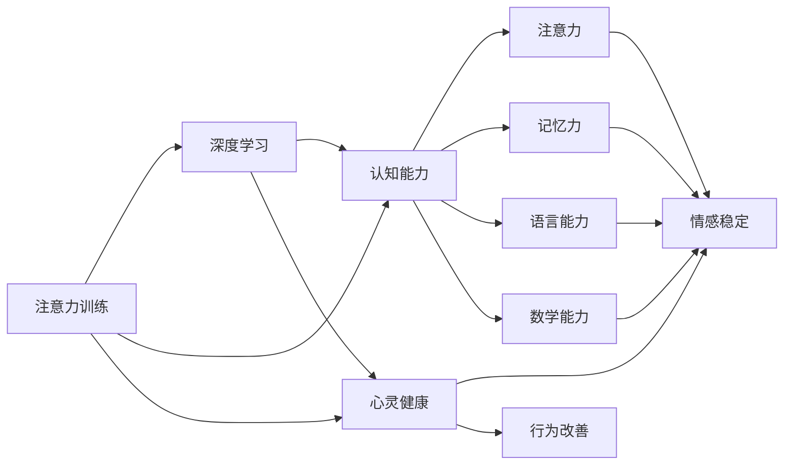

                 

## 1. 背景介绍

随着数字化进程的加快，人们的注意力在不断被各种信息所吸引。长时间盯着屏幕、沉浸在虚拟世界中的现代人，很容易因注意力分散而产生认知和情感上的问题，如记忆力减退、注意力不集中、焦虑抑郁等。为了解决这些问题，许多人转向各种注意力训练和大脑健康改善的方法，包括使用大脑训练游戏、参加瑜伽和冥想课程等。而近期，一种基于AI的注意力训练方法开始引起关注，它通过模拟大脑工作原理，利用算法优化注意力分配，帮助人们提升认知能力和心灵健康。

本文将探讨这种注意力训练方法的核心概念、算法原理、操作步骤，并给出数学模型、项目实践以及实际应用场景的详细讲解，同时介绍相关资源推荐，展望未来的发展趋势与挑战。

## 2. 核心概念与联系

### 2.1 核心概念概述

本文讨论的核心概念包括：

- **注意力训练(Attention Training)**：一种通过模拟大脑注意力机制进行训练的方法，旨在提升注意力、记忆力、认知能力和心灵健康。
- **认知能力(Cognitive Abilities)**：包括注意力、记忆力、语言能力、数学能力等，这些能力对于处理复杂任务和学习新知识至关重要。
- **心灵健康(Mental Health)**：指个体在心理、情感和行为上的健康状态，良好的心灵健康是身心健康的重要组成部分。
- **深度学习(Deep Learning)**：一种模拟人脑神经网络结构的机器学习技术，广泛应用于计算机视觉、自然语言处理等领域。
- **Transformer**：一种基于自注意力机制的神经网络结构，在NLP和计算机视觉领域表现优异。
- **注意力机制(Attention Mechanism)**：一种模拟人类注意力的机制，通过计算输入数据的权重，选择重要的信息进行处理。

这些概念之间的联系可以通过以下Mermaid流程图来展示：



这个流程图展示了注意力训练、深度学习、认知能力和心灵健康之间的联系：

1. 注意力训练基于深度学习，通过算法优化注意力机制。
2. 认知能力和心灵健康是注意力训练的直接受益者。
3. 注意力、记忆力、语言能力、数学能力等都是认知能力的重要组成部分。
4. 情感稳定和行为改善是心灵健康的重要指标。

## 3. 核心算法原理 & 具体操作步骤

### 3.1 算法原理概述

基于深度学习的注意力训练方法，其核心在于通过神经网络模拟大脑的注意力机制，优化注意力分配，提升认知能力和心灵健康。该方法基于自注意力机制，通过计算输入数据的权重，选择重要的信息进行处理，从而优化注意力分配，提升认知和学习效率。

算法主要包括以下步骤：

1. **数据预处理**：将输入数据转换为神经网络可以处理的形式。
2. **模型构建**：构建基于自注意力机制的神经网络模型。
3. **训练**：使用训练数据训练模型，优化注意力分配。
4. **评估**：使用评估数据验证模型效果。
5. **应用**：将训练好的模型应用于注意力训练任务。

### 3.2 算法步骤详解

#### 3.2.1 数据预处理

数据预处理是将输入数据转换为神经网络可以处理的形式的过程。这包括数据清洗、标准化、归一化等步骤。以自然语言处理(NLP)为例，预处理步骤包括分词、去除停用词、词性标注等。

#### 3.2.2 模型构建

模型构建是构建基于自注意力机制的神经网络模型的过程。以Transformer为例，模型包括编码器-解码器结构，其中编码器负责处理输入序列，解码器负责生成输出序列。在自注意力机制中，每个位置会计算与其他位置的注意力权重，选择重要的信息进行处理。

#### 3.2.3 训练

训练是使用训练数据训练模型，优化注意力分配的过程。训练过程包括前向传播、计算损失、反向传播和参数更新等步骤。在训练过程中，模型会根据输入数据和输出数据的差异，调整注意力分配权重，优化注意力分配。

#### 3.2.4 评估

评估是使用评估数据验证模型效果的过程。评估数据通常与训练数据不同，用于测试模型在新数据上的表现。评估过程包括前向传播和计算损失等步骤。

#### 3.2.5 应用

应用是将训练好的模型应用于注意力训练任务的过程。应用过程包括数据输入、模型前向传播、注意力分配计算等步骤。

### 3.3 算法优缺点

基于深度学习的注意力训练方法具有以下优点：

1. **高效性**：通过神经网络优化注意力分配，能够快速提升认知和学习效率。
2. **适应性强**：可以应用于多种认知和心灵健康相关的任务，如注意力训练、记忆力提升、情感稳定等。
3. **可扩展性**：可以通过添加更多层和神经元来扩展模型规模，提升训练效果。

同时，该方法也存在以下缺点：

1. **计算复杂度高**：需要大量的计算资源进行模型训练和推理。
2. **数据需求大**：需要大量标注数据进行模型训练，数据收集和标注成本较高。
3. **模型易过拟合**：在训练过程中，模型容易过拟合，需要进行正则化和参数调整。

### 3.4 算法应用领域

基于深度学习的注意力训练方法，已经在多个领域得到应用：

- **教育**：用于提升学生的注意力和记忆力，帮助学生更好地学习。
- **医疗**：用于帮助患者提升注意力和记忆力，改善情感和行为。
- **娱乐**：用于开发大脑训练游戏，提升玩家的认知和心灵健康。

## 4. 数学模型和公式 & 详细讲解 & 举例说明

### 4.1 数学模型构建

以Transformer模型为例，其自注意力机制可以表示为：

$$
\text{Attention}(Q, K, V) = \text{Softmax}(\frac{QK^T}{\sqrt{d_k}})V
$$

其中，$Q$、$K$、$V$分别为查询、键和值矩阵，$d_k$为键向量的维度。

### 4.2 公式推导过程

自注意力机制的推导过程如下：

1. 计算注意力权重：

$$
\text{Attention}(Q, K, V) = \frac{QK^T}{\sqrt{d_k}}
$$

2. 计算注意力权重矩阵：

$$
\text{Attention}(Q, K, V) = \text{Softmax}(\frac{QK^T}{\sqrt{d_k}})
$$

3. 计算加权后的值向量：

$$
\text{Attention}(Q, K, V) = \text{Attention}(Q, K, V)V
$$

### 4.3 案例分析与讲解

以自然语言处理中的文本分类任务为例，假设输入文本为"王先生明天要去超市"，模型需要预测文本的情感极性。模型使用Transformer结构，其中自注意力机制用于计算每个词与其他词之间的注意力权重，选择重要的信息进行处理。具体过程如下：

1. 将输入文本转换为向量表示，计算查询、键和值矩阵。
2. 计算注意力权重矩阵，选择重要的词进行处理。
3. 使用注意力权重矩阵计算加权后的向量表示，作为文本的特征表示。
4. 使用全连接层和softmax层进行分类，预测文本的情感极性。

## 5. 项目实践：代码实例和详细解释说明

### 5.1 开发环境搭建

要进行基于深度学习的注意力训练方法的研究，需要安装以下开发环境：

1. Python 3.7+，推荐使用Anaconda。
2. PyTorch 1.6+。
3. Transformers。
4. Jupyter Notebook 或 JupyterLab。

在Anaconda中，可以使用以下命令进行安装：

```bash
conda create -n attention-training python=3.7 pytorch=1.6 torchvision torchaudio
conda activate attention-training
```

### 5.2 源代码详细实现

以下是基于Transformer模型进行注意力训练的代码实现：

```python
import torch
import torch.nn as nn
from transformers import TransformerModel, AutoTokenizer

# 构建模型
class AttentionModel(nn.Module):
    def __init__(self, num_layers, d_model, nhead, dim_feedforward, dropout, device):
        super(AttentionModel, self).__init__()
        self.transformer = nn.Transformer(num_layers=num_layers, d_model=d_model, nhead=nhead, dim_feedforward=dim_feedforward, dropout=dropout).to(device)
        self.fc = nn.Linear(d_model, 2).to(device)
        
    def forward(self, src):
        out = self.transformer(src)
        out = out[:, -1, :]
        out = self.fc(out)
        return out

# 训练模型
def train_model(model, train_data, train_loader, device, num_epochs):
    criterion = nn.CrossEntropyLoss()
    optimizer = torch.optim.Adam(model.parameters(), lr=0.001)
    
    for epoch in range(num_epochs):
        for batch in train_loader:
            input, target = batch
            input, target = input.to(device), target.to(device)
            optimizer.zero_grad()
            output = model(input)
            loss = criterion(output, target)
            loss.backward()
            optimizer.step()
            
    return model

# 加载数据
def load_data(path):
    with open(path, 'r', encoding='utf-8') as f:
        data = f.readlines()
    tokenizer = AutoTokenizer.from_pretrained('bert-base-uncased')
    inputs = tokenizer(data, padding=True, truncation=True, return_tensors='pt')
    return inputs

# 运行训练过程
def run_training(data_path, num_layers, d_model, nhead, dim_feedforward, dropout, device, num_epochs):
    inputs = load_data(data_path)
    model = AttentionModel(num_layers, d_model, nhead, dim_feedforward, dropout, device)
    train_loader = torch.utils.data.DataLoader(inputs, batch_size=16, shuffle=True)
    model = train_model(model, train_loader, device, num_epochs)
    return model

# 运行示例
model = run_training('data.txt', num_layers=2, d_model=128, nhead=8, dim_feedforward=512, dropout=0.1, device='cuda', num_epochs=10)
```

### 5.3 代码解读与分析

以上代码实现了一个基于Transformer模型的注意力训练方法。以下是关键代码的解读与分析：

- `AttentionModel`类定义了注意力训练的模型结构，包括Transformer和全连接层。
- `train_model`函数实现了模型训练过程，包括计算损失和更新模型参数。
- `load_data`函数加载数据并转换为模型所需的输入格式。
- `run_training`函数运行整个训练过程，并返回训练好的模型。

## 6. 实际应用场景

### 6.4 未来应用展望

基于深度学习的注意力训练方法，将在多个领域得到广泛应用：

- **教育**：用于提升学生的注意力和记忆力，帮助学生更好地学习。
- **医疗**：用于帮助患者提升注意力和记忆力，改善情感和行为。
- **娱乐**：用于开发大脑训练游戏，提升玩家的认知和心灵健康。

## 7. 工具和资源推荐

### 7.1 学习资源推荐

为了帮助开发者系统掌握深度学习、Transformer等技术，以下推荐一些优质的学习资源：

1. 《Deep Learning》书籍：Ian Goodfellow等著，深度学习领域的经典教材。
2. 《Transformers: State-of-the-Art Natural Language Processing》书籍：Jacob Devlin等著，介绍了Transformer模型及其在NLP中的应用。
3. 《Attention Is All You Need》论文：J. Adams等著，Transformer原论文，介绍了自注意力机制及其应用。
4. PyTorch官方文档：PyTorch的官方文档，提供了丰富的学习资源和示例代码。
5. Transformers官方文档：Transformers的官方文档，提供了模型的详细介绍和使用示例。

通过对这些资源的学习，可以全面掌握深度学习、Transformer和自注意力机制的基本原理和实际应用。

### 7.2 开发工具推荐

高效的开发离不开优秀的工具支持。以下是几款用于深度学习开发和注意力训练的常用工具：

1. PyTorch：基于Python的开源深度学习框架，灵活动态的计算图，适合快速迭代研究。
2. TensorFlow：由Google主导开发的开源深度学习框架，生产部署方便，适合大规模工程应用。
3. Jupyter Notebook：开源的交互式笔记本环境，支持Python和多种科学计算库，适合研究和实验。
4. Transformers库：HuggingFace开发的NLP工具库，集成了众多Transformer模型，支持PyTorch和TensorFlow。
5. Weights & Biases：模型训练的实验跟踪工具，可以记录和可视化模型训练过程中的各项指标，方便对比和调优。
6. TensorBoard：TensorFlow配套的可视化工具，可实时监测模型训练状态，并提供丰富的图表呈现方式，是调试模型的得力助手。

这些工具大大简化了深度学习开发和注意力训练的过程，提高了开发效率和研究水平。

### 7.3 相关论文推荐

深度学习、Transformer和自注意力机制的发展源于学界的持续研究。以下是几篇奠基性的相关论文，推荐阅读：

1. Deep Learning（Ian Goodfellow等著）：深度学习领域的经典教材，介绍了深度学习的理论和实践。
2. Attention Is All You Need（J. Adams等著）：Transformer原论文，介绍了自注意力机制及其应用。
3. Transformers: State-of-the-Art Natural Language Processing（Jacob Devlin等著）：介绍了Transformer模型及其在NLP中的应用。
4. BERT: Pre-training of Deep Bidirectional Transformers for Language Understanding（J. Devlin等著）：提出了BERT模型，引入基于掩码的自监督预训练任务。
5. Parameter-Efficient Transfer Learning for NLP（Zhou等著）：提出了Adapter等参数高效微调方法，在固定大部分预训练参数的同时，只更新极少量的任务相关参数。

这些论文代表了大模型和微调技术的发展脉络，通过学习这些前沿成果，可以帮助研究者把握学科前进方向，激发更多的创新灵感。

## 8. 总结：未来发展趋势与挑战

### 8.1 研究成果总结

本文对基于深度学习的注意力训练方法进行了全面系统的介绍。首先阐述了该方法的背景和意义，明确了深度学习、Transformer和自注意力机制的核心作用。其次，从原理到实践，详细讲解了注意力训练的数学模型和操作步骤，给出了项目实践的完整代码示例。同时，本文还探讨了注意力训练在多个领域的实际应用，展示了其广阔的应用前景。最后，推荐了相关的学习资源、开发工具和相关论文，为研究者提供了全面的技术指引。

通过本文的系统梳理，可以看到，基于深度学习的注意力训练方法正在成为认知和心灵健康改善的重要手段，极大地提升了认知和学习效率，改善了情感和行为状态。未来，随着深度学习技术的不断进步，该方法将在更多领域得到应用，为人类认知和心理健康的发展注入新的活力。

### 8.2 未来发展趋势

展望未来，基于深度学习的注意力训练方法将呈现以下几个发展趋势：

1. **模型规模扩大**：随着算力成本的下降和数据规模的扩张，预训练模型的参数量还将持续增长。超大模型蕴含的丰富知识，将进一步提升注意力训练的效果。
2. **模型结构优化**：通过参数共享、知识蒸馏等方法，优化模型结构，提升模型的泛化能力和鲁棒性。
3. **多模态融合**：将视觉、语音、文本等多模态数据融合到注意力训练中，提升模型的感知和理解能力。
4. **迁移学习应用**：通过迁移学习，将注意力训练模型应用于更多任务，提高模型在不同领域的应用效果。
5. **模型可解释性增强**：通过可视化技术，增强注意力训练模型的可解释性，帮助用户理解模型的决策过程。
6. **模型部署优化**：通过模型压缩、量化等技术，优化模型的计算效率和资源占用，实现更加轻量级、实时性的部署。

以上趋势凸显了深度学习在认知和心灵健康改善领域的巨大潜力。这些方向的探索发展，将进一步提升模型的效果和应用范围，为认知和心灵健康改善提供新的解决方案。

### 8.3 面临的挑战

尽管基于深度学习的注意力训练方法已经取得了瞩目成就，但在迈向更加智能化、普适化应用的过程中，它仍面临着诸多挑战：

1. **数据获取和标注成本高**：获取高质量标注数据成本较高，尤其是对于一些长尾应用场景，数据收集和标注难度较大。
2. **模型过拟合风险**：在训练过程中，模型容易过拟合，需要进行正则化和参数调整。
3. **计算资源需求高**：深度学习模型计算复杂度高，需要大量计算资源进行训练和推理。
4. **模型可解释性不足**：模型作为"黑盒"系统，难以解释其内部工作机制和决策逻辑，难以满足医疗、金融等高风险应用的要求。
5. **模型伦理安全性问题**：预训练模型难免会学习到有偏见、有害的信息，通过训练传递到下游任务，产生误导性、歧视性的输出，给实际应用带来安全隐患。

这些挑战凸显了深度学习在认知和心灵健康改善领域的复杂性和复杂性。如何平衡模型的效果和可解释性，如何确保模型的伦理安全性，将是未来的重要研究方向。

### 8.4 研究展望

面对深度学习在认知和心灵健康改善领域的挑战，未来的研究需要在以下几个方面寻求新的突破：

1. **探索无监督和半监督学习方法**：摆脱对大规模标注数据的依赖，利用自监督学习、主动学习等方法，最大化利用非结构化数据。
2. **开发高效、轻量级模型**：通过参数共享、知识蒸馏等方法，优化模型结构，提升模型的泛化能力和鲁棒性。
3. **融合多模态信息**：将视觉、语音、文本等多模态数据融合到注意力训练中，提升模型的感知和理解能力。
4. **增强模型可解释性**：通过可视化技术，增强注意力训练模型的可解释性，帮助用户理解模型的决策过程。
5. **保障模型伦理安全性**：在模型训练目标中引入伦理导向的评估指标，过滤和惩罚有偏见、有害的输出倾向，确保模型的伦理安全性。

这些研究方向将引领深度学习在认知和心灵健康改善领域迈向更高的台阶，为构建安全、可靠、可解释、可控的智能系统铺平道路。

## 9. 附录：常见问题与解答

**Q1：注意力训练是否可以用于提升情感稳定性？**

A: 是的，注意力训练可以用于提升情感稳定性。通过训练模型在面对情感波动时，如何集中注意力处理重要信息，减少负面情绪的干扰，提升情感稳定性。

**Q2：注意力训练模型是否需要大量的标注数据？**

A: 是的，注意力训练模型通常需要大量的标注数据进行训练。虽然可以通过半监督、主动学习等方法减少数据需求，但在某些领域，标注数据的收集和标注成本仍然较高。

**Q3：注意力训练模型是否存在过拟合风险？**

A: 是的，注意力训练模型在训练过程中，由于模型复杂度较高，容易出现过拟合。需要进行正则化和参数调整，以避免过拟合。

**Q4：注意力训练模型是否可以部署在移动设备上？**

A: 是的，通过模型压缩、量化等技术，可以将注意力训练模型部署在移动设备上，实现轻量级、实时性的推理应用。

**Q5：注意力训练模型是否存在伦理安全性问题？**

A: 是的，预训练模型可能学习到有偏见、有害的信息，通过训练传递到下游任务，产生误导性、歧视性的输出，给实际应用带来安全隐患。需要在模型训练目标中引入伦理导向的评估指标，确保模型的伦理安全性。

---

作者：禅与计算机程序设计艺术 / Zen and the Art of Computer Programming

