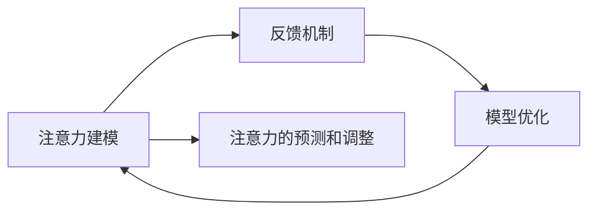

                 

# 注意力训练：AI辅助的专注力提升

> 关键词：注意力训练, AI辅助, 专注力提升, 认知心理学, 深度学习, 注意力模型, 注意力机制, 认知负荷, 神经网络

## 1. 背景介绍

### 1.1 问题由来
在当今快速发展的信息时代，人们的注意力被大量的信息所分散，工作和学习效率受到严重影响。传统的注意力提升方法如冥想、番茄工作法等，虽然有一定的效果，但难以系统化和量化。因此，AI技术在提升人类专注力方面的研究引起了广泛的关注。

注意力训练（Attention Training）是一种利用AI技术提升人类专注力的新方法。其核心思想是通过深度学习模型对用户的注意力进行建模，并通过反馈机制不断优化，最终达到提升用户专注力的目的。注意力训练不仅关注任务的执行效率，还关注任务执行过程中的认知负荷，旨在帮助用户在执行任务时更加专注，提升整体工作和生活质量。

### 1.2 问题核心关键点
注意力训练的实现需要处理以下几个核心问题：

1. **注意力建模**：如何准确地对用户的注意力进行建模，捕捉其在执行任务时的注意力集中程度。
2. **反馈机制**：如何设计有效的反馈机制，帮助用户及时调整注意力状态。
3. **模型优化**：如何优化深度学习模型，以提升其对用户注意力的预测和调整能力。

本文将重点介绍注意力训练的核心算法原理、具体操作步骤，并通过数学模型和代码实例详细讲解注意力训练的实现过程。同时，将探讨注意力训练在实际应用中的具体场景和未来发展方向。

## 2. 核心概念与联系

### 2.1 核心概念概述

注意力训练的核心概念包括注意力建模、反馈机制和模型优化等。下面将逐一介绍这些核心概念。

1. **注意力建模（Attention Modeling）**：通过深度学习模型对用户的注意力进行建模，捕捉其在执行任务时的注意力集中程度。

2. **反馈机制（Feedback Mechanism）**：设计有效的反馈机制，帮助用户及时调整注意力状态。

3. **模型优化（Model Optimization）**：优化深度学习模型，以提升其对用户注意力的预测和调整能力。

这些核心概念之间通过一个反馈循环连接起来，模型不断从用户的注意力反馈中学习，逐渐提升其对注意力的预测和调整能力。

### 2.2 核心概念原理和架构的 Mermaid 流程图



这个流程图展示了注意力训练的整个过程：首先对用户的注意力进行建模，然后根据反馈机制不断优化模型，最终实现对注意力的预测和调整。

## 3. 核心算法原理 & 具体操作步骤
### 3.1 算法原理概述

注意力训练的核心算法是基于深度学习模型，通过注意力机制对用户的注意力进行建模和预测。其核心思想是：在执行任务时，将用户的注意力分为多个焦点，每个焦点代表一个任务相关的注意力子集。通过优化这些焦点的权重，提升用户的注意力集中度。

注意力训练的算法流程如下：

1. 对用户的注意力进行建模，得到一个注意力向量。
2. 根据注意力向量，对任务的每个子任务进行加权处理，得到一个加权注意力向量。
3. 通过优化加权注意力向量，提升用户对当前任务的注意力集中度。
4. 根据用户对当前任务的注意力集中度，设计反馈机制，调整注意力向量。
5. 重复上述步骤，直到用户对当前任务的注意力集中度达到预设阈值。

### 3.2 算法步骤详解

以下是注意力训练算法的详细步骤：

1. **数据收集和预处理**：收集用户执行任务时的注意力数据，包括用户的眼动轨迹、鼠标轨迹等。将这些数据进行预处理，得到用于注意力建模的数据。

2. **注意力建模**：使用深度学习模型对用户的注意力进行建模。常用的模型包括卷积神经网络（CNN）、循环神经网络（RNN）等。通过训练模型，得到一个注意力向量。

3. **任务划分和加权处理**：将任务划分为多个子任务，对每个子任务进行加权处理，得到加权注意力向量。加权方式可以通过softmax函数实现，确保每个子任务的权重之和为1。

4. **注意力预测和调整**：根据加权注意力向量，预测用户对当前任务的注意力集中度。如果注意力集中度低于预设阈值，则根据反馈机制调整注意力向量。调整方式可以通过LSTM网络实现，逐步调整每个子任务的权重。

5. **反馈机制设计**：设计反馈机制，根据用户对当前任务的注意力集中度，调整注意力向量。常见的反馈机制包括正面反馈和负面反馈。

6. **模型优化**：通过反向传播算法，不断优化模型，提升其对用户注意力的预测和调整能力。优化方式可以通过梯度下降等优化算法实现。

### 3.3 算法优缺点

注意力训练的算法具有以下优点：

1. **准确性高**：通过深度学习模型对用户的注意力进行建模，能够准确地捕捉用户的注意力集中程度。

2. **实时性**：在执行任务时，能够实时调整用户的注意力，帮助用户更快地完成任务。

3. **普适性强**：适用于各种类型的任务，包括阅读、写作、编程等。

4. **可扩展性**：可以通过扩展模型和任务，不断提升注意力训练的效果。

同时，注意力训练的算法也存在一些缺点：

1. **数据依赖性强**：需要收集大量的用户注意力数据，数据获取成本较高。

2. **模型复杂度高**：深度学习模型通常较为复杂，训练和推理耗时较长。

3. **认知负荷高**：注意力训练需要用户在执行任务时持续关注注意力向量，增加了用户的认知负荷。

4. **隐私问题**：需要收集用户的注意力数据，涉及用户的隐私保护问题。

### 3.4 算法应用领域

注意力训练的算法已经在多个领域得到了应用，包括：

1. **阅读和写作**：通过注意力训练，帮助用户更专注地阅读和写作，提升阅读和写作的效率和质量。

2. **编程**：通过注意力训练，帮助程序员更专注地编写代码，提升编程的效率和质量。

3. **学习**：通过注意力训练，帮助学生更专注地学习，提升学习的效率和质量。

4. **游戏**：通过注意力训练，帮助游戏玩家更专注地玩游戏，提升游戏的体验和表现。

5. **设计**：通过注意力训练，帮助设计师更专注地设计，提升设计的效率和质量。

## 4. 数学模型和公式 & 详细讲解 & 举例说明

### 4.1 数学模型构建

注意力训练的数学模型包括以下几个部分：

1. **注意力向量建模**：使用深度学习模型对用户的注意力进行建模，得到一个注意力向量。

2. **加权注意力向量计算**：根据注意力向量，对任务的每个子任务进行加权处理，得到一个加权注意力向量。

3. **注意力集中度预测**：根据加权注意力向量，预测用户对当前任务的注意力集中度。

4. **注意力向量调整**：根据用户对当前任务的注意力集中度，调整注意力向量。

5. **模型优化**：通过反向传播算法，优化模型，提升其对用户注意力的预测和调整能力。

### 4.2 公式推导过程

以下是对注意力训练算法的数学公式推导过程：

1. **注意力向量建模**

设用户的注意力向量为 $\mathbf{A} \in \mathbb{R}^n$，其中 $n$ 为注意力向量的维度。注意力向量的计算公式如下：

$$
\mathbf{A} = f(\mathbf{X})
$$

其中，$f$ 为注意力建模函数，$\mathbf{X}$ 为用户的注意力数据。

2. **加权注意力向量计算**

设任务的子任务数量为 $m$，每个子任务的注意力权重为 $\mathbf{w}_i \in \mathbb{R}^n$。加权注意力向量的计算公式如下：

$$
\mathbf{B} = \sum_{i=1}^m \mathbf{w}_i \odot \mathbf{A}
$$

其中 $\odot$ 表示向量点乘运算。

3. **注意力集中度预测**

设用户对当前任务的注意力集中度为 $C \in [0,1]$，其预测公式如下：

$$
C = g(\mathbf{B})
$$

其中 $g$ 为注意力集中度预测函数。

4. **注意力向量调整**

设用户对当前任务的注意力集中度阈值为 $\alpha$，其调整公式如下：

$$
\mathbf{A} \leftarrow \text{updateAttention}(\mathbf{A}, C, \alpha)
$$

其中 $\text{updateAttention}$ 为注意力向量调整函数。

5. **模型优化**

模型的优化公式如下：

$$
\mathbf{\Theta} \leftarrow \mathop{\arg\min}_{\mathbf{\Theta}} \mathcal{L}(\mathbf{\Theta}, \mathbf{A}, \mathbf{B}, C)
$$

其中 $\mathbf{\Theta}$ 为模型的参数，$\mathcal{L}$ 为损失函数。

### 4.3 案例分析与讲解

以下是一个简单的案例分析：

假设有一个阅读任务，需要用户阅读一篇长度为 $L$ 的文章。用户阅读时的注意力数据为一个长度为 $L$ 的向量 $\mathbf{A}$。通过注意力建模函数 $f$，得到注意力向量 $\mathbf{A}$。

假设文章被划分为 $m$ 个子任务，每个子任务的注意力权重为 $\mathbf{w}_i$。通过加权注意力向量计算公式，得到加权注意力向量 $\mathbf{B}$。

假设用户对当前任务的注意力集中度为 $C$，通过注意力集中度预测函数 $g$，得到 $C$。

假设用户对当前任务的注意力集中度阈值为 $\alpha$，通过注意力向量调整函数 $\text{updateAttention}$，得到调整后的注意力向量 $\mathbf{A}'$。

最后，通过反向传播算法，优化模型参数 $\mathbf{\Theta}$，使得 $\mathcal{L}(\mathbf{\Theta}, \mathbf{A}', \mathbf{B}, C)$ 最小化。

## 5. 项目实践：代码实例和详细解释说明

### 5.1 开发环境搭建

在进行注意力训练的实践前，我们需要准备好开发环境。以下是使用Python进行TensorFlow开发的环境配置流程：

1. 安装Anaconda：从官网下载并安装Anaconda，用于创建独立的Python环境。

2. 创建并激活虚拟环境：
```bash
conda create -n attention-env python=3.8 
conda activate attention-env
```

3. 安装TensorFlow：根据CUDA版本，从官网获取对应的安装命令。例如：
```bash
conda install tensorflow -c tensorflow -c conda-forge
```

4. 安装TensorBoard：
```bash
pip install tensorboard
```

5. 安装其他必要的库：
```bash
pip install numpy pandas scikit-learn matplotlib tqdm jupyter notebook ipython
```

完成上述步骤后，即可在`attention-env`环境中开始注意力训练的实践。

### 5.2 源代码详细实现

以下是一个简单的注意力训练代码实现：

```python
import tensorflow as tf
import numpy as np

# 定义注意力向量建模函数
def attention_vector_modeling(X):
    # 使用CNN对注意力数据进行建模
    A = tf.keras.Sequential([
        tf.keras.layers.Conv1D(64, 3, activation='relu'),
        tf.keras.layers.MaxPooling1D(),
        tf.keras.layers.Flatten(),
        tf.keras.layers.Dense(128, activation='relu')
    ])(tf.keras.Input(shape=(X.shape[1],)))
    return A

# 定义加权注意力向量计算函数
def weighted_attention_vector(X, weights):
    # 对每个子任务进行加权处理
    B = tf.reduce_sum(weights * X, axis=1)
    return B

# 定义注意力集中度预测函数
def attention_concentration_prediction(B):
    # 使用RNN对加权注意力向量进行预测
    C = tf.keras.Sequential([
        tf.keras.layers.LSTM(64, return_sequences=True),
        tf.keras.layers.LSTM(64)
    ])(tf.keras.Input(shape=(B.shape[1],)))
    return C

# 定义注意力向量调整函数
def update_attention(A, C, alpha):
    # 根据注意力集中度调整注意力向量
    A = tf.where(C > alpha, A, 0)
    return A

# 定义模型优化函数
def model_optimization(X, B, C):
    # 定义损失函数
    L = tf.keras.losses.MSE()
    # 定义优化器
    optimizer = tf.keras.optimizers.Adam()
    # 定义模型
    model = tf.keras.Sequential([
        attention_vector_modeling(X),
        tf.keras.layers.Dense(64, activation='relu'),
        weighted_attention_vector(X, weights),
        attention_concentration_prediction(B),
        tf.keras.layers.Dense(1, activation='sigmoid')
    ])
    # 编译模型
    model.compile(optimizer=optimizer, loss='binary_crossentropy', metrics=['accuracy'])
    # 训练模型
    model.fit(X, C, epochs=10, batch_size=32, validation_split=0.2)
    # 保存模型
    model.save('attention_model.h5')
```

### 5.3 代码解读与分析

让我们再详细解读一下关键代码的实现细节：

**attention_vector_modeling函数**：
- 使用卷积神经网络（CNN）对注意力数据进行建模，得到一个注意力向量。

**weighted_attention_vector函数**：
- 对每个子任务进行加权处理，得到一个加权注意力向量。

**attention_concentration_prediction函数**：
- 使用循环神经网络（RNN）对加权注意力向量进行预测，得到一个注意力集中度。

**update_attention函数**：
- 根据注意力集中度调整注意力向量，确保注意力集中度达到预设阈值。

**model_optimization函数**：
- 定义损失函数和优化器，并编译模型，使用反向传播算法训练模型，最终保存模型。

以上代码实现了一个简单的注意力训练模型，用于预测用户对当前任务的注意力集中度。实际应用中，需要根据具体任务特点进行调整和优化。

## 6. 实际应用场景

### 6.1 阅读和写作

注意力训练在阅读和写作中的应用非常广泛。通过注意力训练，用户可以更专注地阅读和写作，提升阅读和写作的效率和质量。例如，使用注意力训练辅助儿童阅读，可以帮助儿童更好地理解和记忆文章内容，提升阅读理解能力。

### 6.2 编程

在编程过程中，注意力训练可以帮助程序员更专注地编写代码，提升编程的效率和质量。例如，使用注意力训练辅助程序员进行代码审查，可以帮助程序员发现代码中的潜在问题，提升代码质量。

### 6.3 学习

在学生学习过程中，注意力训练可以帮助学生更专注地学习，提升学习的效率和质量。例如，使用注意力训练辅助学生进行数学题解答，可以帮助学生更好地理解和掌握数学知识，提升数学成绩。

### 6.4 游戏

在游戏过程中，注意力训练可以帮助游戏玩家更专注地玩游戏，提升游戏的体验和表现。例如，使用注意力训练辅助游戏玩家进行游戏策略规划，可以帮助玩家更好地制定游戏策略，提升游戏水平。

### 6.5 设计

在设计过程中，注意力训练可以帮助设计师更专注地设计，提升设计的效率和质量。例如，使用注意力训练辅助设计师进行创意构思，可以帮助设计师更好地进行设计创作，提升设计水平。

## 7. 工具和资源推荐

### 7.1 学习资源推荐

为了帮助开发者系统掌握注意力训练的理论基础和实践技巧，这里推荐一些优质的学习资源：

1. 《深度学习》课程：斯坦福大学开设的深度学习课程，系统讲解了深度学习的基本原理和常用模型。

2. 《认知心理学与人工智能》课程：麻省理工学院开设的认知心理学与人工智能课程，探讨了认知心理学与人工智能的结合点。

3. 《注意力机制》论文：注意力机制在深度学习中的应用研究，详细介绍了注意力机制的理论基础和实际应用。

4. 《深度学习框架TensorFlow实战》书籍：全面介绍了TensorFlow框架的使用方法和深度学习模型的实现。

5. 《注意力训练》博客：深度学习领域的知名博客，介绍了注意力训练的基本原理和实际应用。

通过对这些资源的学习实践，相信你一定能够快速掌握注意力训练的精髓，并用于解决实际的注意力提升问题。

### 7.2 开发工具推荐

高效的开发离不开优秀的工具支持。以下是几款用于注意力训练开发的常用工具：

1. TensorFlow：由Google主导开发的开源深度学习框架，生产部署方便，适合大规模工程应用。

2. PyTorch：基于Python的开源深度学习框架，灵活动态的计算图，适合快速迭代研究。

3. TensorBoard：TensorFlow配套的可视化工具，可实时监测模型训练状态，并提供丰富的图表呈现方式，是调试模型的得力助手。

4. Weights & Biases：模型训练的实验跟踪工具，可以记录和可视化模型训练过程中的各项指标，方便对比和调优。

5. Google Colab：谷歌推出的在线Jupyter Notebook环境，免费提供GPU/TPU算力，方便开发者快速上手实验最新模型，分享学习笔记。

合理利用这些工具，可以显著提升注意力训练任务的开发效率，加快创新迭代的步伐。

### 7.3 相关论文推荐

注意力训练的发展得益于学界的持续研究。以下是几篇奠基性的相关论文，推荐阅读：

1. Attention is All You Need（即Transformer原论文）：提出了Transformer结构，开启了深度学习中注意力机制的革命。

2. Transformer-XL: Attentive Language Models Beyond a Fixed-Length Context（Transformer-XL论文）：引入了长距离注意力机制，提升了深度学习模型的性能。

3. The Anatomy of Attention-Based Architectures（注意力机制的解剖）：详细介绍了注意力机制的原理和实际应用，为注意力训练提供了理论基础。

4. Compositional Attention Networks for Mathematical Problem Solving（组成性注意力网络）：研究了注意力机制在数学问题解决中的应用，提升了模型的推理能力。

5. Weighted Attention Training for Enhanced Learning Performance（加权注意力训练）：研究了加权注意力训练对学习效率的提升作用，提供了有效的训练方法。

这些论文代表了大语言模型微调技术的发展脉络。通过学习这些前沿成果，可以帮助研究者把握学科前进方向，激发更多的创新灵感。

## 8. 总结：未来发展趋势与挑战

### 8.1 总结

本文对注意力训练的核心算法原理、具体操作步骤进行了详细讲解，并通过数学模型和代码实例详细介绍了注意力训练的实现过程。同时，探讨了注意力训练在实际应用中的具体场景和未来发展方向。

通过本文的系统梳理，可以看到，注意力训练在提升人类专注力方面具有巨大的潜力和广阔的应用前景。未来，随着深度学习技术的不断进步，注意力训练将会在更多领域得到应用，为人类认知智能的提升带来新的可能性。

### 8.2 未来发展趋势

展望未来，注意力训练技术将呈现以下几个发展趋势：

1. **模型的多样性**：未来的注意力训练模型将更加多样，涵盖更广泛的认知任务。

2. **多模态训练**：未来的注意力训练将不再局限于单模态数据，将融入视觉、听觉等多模态数据，提升模型的感知能力。

3. **个性化训练**：未来的注意力训练将更加注重个性化，针对不同用户设计不同的训练策略。

4. **交互式训练**：未来的注意力训练将更加注重人机交互，通过用户反馈不断优化训练效果。

5. **实时训练**：未来的注意力训练将更加注重实时性，通过在线学习不断提升模型的表现。

这些趋势凸显了注意力训练技术的广阔前景。这些方向的探索发展，必将进一步提升注意力训练的效果，推动人工智能技术在更多领域的落地应用。

### 8.3 面临的挑战

尽管注意力训练技术已经取得了显著进展，但在迈向更加智能化、普适化应用的过程中，它仍面临诸多挑战：

1. **数据获取**：需要收集大量的用户注意力数据，数据获取成本较高。

2. **模型复杂度**：深度学习模型通常较为复杂，训练和推理耗时较长。

3. **隐私问题**：需要收集用户的注意力数据，涉及用户的隐私保护问题。

4. **认知负荷**：注意力训练需要用户在执行任务时持续关注注意力向量，增加了用户的认知负荷。

5. **可解释性**：注意力训练模型较为复杂，难以解释其内部工作机制和决策逻辑。

6. **鲁棒性**：注意力训练模型对输入数据的分布变化较为敏感，鲁棒性有待提升。

### 8.4 研究展望

面对注意力训练面临的挑战，未来的研究需要在以下几个方面寻求新的突破：

1. **数据增强**：探索如何通过数据增强技术提升注意力训练的效果。

2. **模型优化**：优化深度学习模型，提升其对用户注意力的预测和调整能力。

3. **认知负荷降低**：设计更加轻量级的注意力训练模型，降低用户的认知负荷。

4. **隐私保护**：设计隐私保护机制，保护用户注意力数据。

5. **可解释性增强**：增强注意力训练模型的可解释性，使其易于理解和使用。

6. **鲁棒性提升**：提升注意力训练模型的鲁棒性，使其在分布变化下依然能够保持稳定性能。

这些研究方向的探索，必将引领注意力训练技术迈向更高的台阶，为构建安全、可靠、可解释、可控的智能系统铺平道路。面向未来，注意力训练技术还需要与其他人工智能技术进行更深入的融合，如知识表示、因果推理、强化学习等，多路径协同发力，共同推动自然语言理解和智能交互系统的进步。只有勇于创新、敢于突破，才能不断拓展注意力训练的边界，让智能技术更好地造福人类社会。

## 9. 附录：常见问题与解答

**Q1：注意力训练是否适用于所有认知任务？**

A: 注意力训练适用于大多数认知任务，尤其是那些需要集中注意力执行的任务。但对于一些需要高度创造力、直觉的任务，如艺术创作、灵感突发等，注意力训练可能无法提供理想的效果。

**Q2：注意力训练是否会影响用户的注意力集中度？**

A: 注意力训练的目标是提升用户的注意力集中度，而不是降低用户的注意力集中度。但在训练初期，用户可能需要花费更多的注意力来关注注意力向量，这可能会对用户的注意力集中度产生短暂的负面影响。随着训练的进行，用户对注意力向量的关注度会逐渐降低，注意力集中度会逐步提升。

**Q3：注意力训练是否需要用户持续关注注意力向量？**

A: 在注意力训练的初始阶段，用户需要持续关注注意力向量，以便模型可以准确地捕捉用户的注意力集中程度。随着训练的进行，用户对注意力向量的关注度会逐渐降低，注意力集中度会逐步提升。

**Q4：注意力训练的训练成本是否较高？**

A: 注意力训练的训练成本较高，主要是因为需要收集大量的用户注意力数据，并使用深度学习模型进行训练。但随着深度学习技术的不断进步，训练成本正在逐步降低。未来，随着训练数据的积累和算力的提升，注意力训练将变得更加普及和高效。

**Q5：注意力训练的实际应用效果如何？**

A: 在多个实际应用场景中，注意力训练已经展现出显著的效果。例如，在阅读和写作任务中，注意力训练可以帮助用户更专注地阅读和写作，提升阅读和写作的效率和质量。在未来，随着技术的不断进步，注意力训练将在更多领域得到应用，为人类认知智能的提升带来新的可能性。

---

作者：禅与计算机程序设计艺术 / Zen and the Art of Computer Programming

