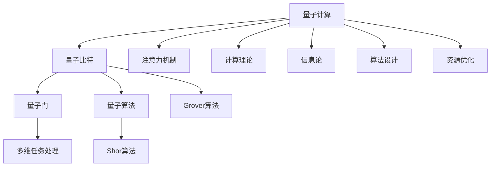

                 

# 注意力量子计算：AI时代的多维任务处理

> 关键词：量子计算, 多维任务处理, AI时代, 计算理论, 信息论, 算法设计, 资源优化, 实际应用

## 1. 背景介绍

### 1.1 问题由来
在AI时代，随着计算能力的不断提升和数据量的持续增长，传统的经典计算范式逐渐显示出其局限性。近年来，量子计算（Quantum Computing）作为一种全新的计算范式，因其在处理大规模、多维数据时的卓越能力，逐渐成为推动AI技术发展的关键动力之一。然而，量子计算的复杂性及其与传统计算的差异，使得其在实际应用中面临着诸多挑战，如何高效利用量子计算资源、优化多维任务处理，成为当前研究的热点。

### 1.2 问题核心关键点
量子计算的核心在于利用量子态的叠加性和纠缠性，通过量子算法（如Shor算法、Grover算法）高效处理特定类型的问题。然而，量子计算的硬件限制和错误率问题使得其应用场景受限。如何在实际应用中充分发挥量子计算的优势，同时降低硬件和算法实现的难度，成为亟需解决的问题。

## 2. 核心概念与联系

### 2.1 核心概念概述

为更好地理解基于注意力的量子计算和多维任务处理，本节将介绍几个密切相关的核心概念：

- 量子计算（Quantum Computing）：利用量子力学原理进行计算的计算范式，能够处理传统计算难以处理的复杂问题。
- 量子比特（Qubit）：量子计算的基本单位，通过叠加和纠缠实现计算。
- 量子门（Quantum Gate）：量子计算中的基本操作，通过改变量子态实现计算逻辑。
- 量子算法（Quantum Algorithm）：针对特定问题设计的一系列量子门操作，如Shor算法、Grover算法等。
- 多维任务处理：在量子计算中，多个任务可能相互关联，需要通过算法设计优化其处理效率。
- 注意力机制（Attention Mechanism）：在深度学习中，用于处理序列数据的技术，通过动态调整权重分配，优化模型的计算效率。
- 计算理论（Computational Theory）：研究计算问题的理论基础，包括复杂度、算法设计等。
- 信息论（Information Theory）：研究信息的度量和传输理论，为量子计算提供了理论支撑。
- 算法设计（Algorithm Design）：针对特定问题设计高效的计算算法，优化资源利用率。
- 资源优化（Resource Optimization）：在计算中平衡时间、空间、能量等资源的消耗，提升计算效率。

这些核心概念之间的逻辑关系可以通过以下Mermaid流程图来展示：



这个流程图展示了大语言模型的核心概念及其之间的关系：

1. 量子计算通过量子比特和量子门操作，执行计算任务。
2. 多维任务处理在量子计算中，多个任务可能相互关联，需要通过算法设计优化其处理效率。
3. 注意力机制在深度学习中，用于处理序列数据，优化模型的计算效率。
4. 计算理论和信息论为量子计算提供了理论支撑。
5. 算法设计针对特定问题设计高效的计算算法，优化资源利用率。
6. 资源优化在计算中平衡时间、空间、能量等资源的消耗，提升计算效率。

这些概念共同构成了量子计算和多维任务处理的学习框架，使其能够在各种场景下发挥强大的计算能力。通过理解这些核心概念，我们可以更好地把握量子计算的处理机制和优化策略。

## 3. 核心算法原理 & 具体操作步骤
### 3.1 算法原理概述

基于注意力的量子计算和多维任务处理，本质上是一个高效利用量子计算资源和优化算法设计的过程。其核心思想是：通过量子计算的优势，在多维任务处理中实现高效计算，同时通过注意力机制和资源优化，进一步提升计算效率。

形式化地，假设有多项多维任务 $T_1, T_2, ..., T_n$，每个任务包含一个输入向量 $\mathbf{x}_i$ 和一个输出向量 $\mathbf{y}_i$。目标是设计量子算法 $\mathcal{A}$，使得：

$$
\mathbf{y}_i = \mathcal{A}(\mathbf{x}_i)
$$

其中 $\mathcal{A}$ 是针对任务 $T_i$ 设计的一系列量子门操作，通过并行处理多维任务，最大化计算效率。

### 3.2 算法步骤详解

基于注意力的量子计算和多维任务处理一般包括以下几个关键步骤：

**Step 1: 任务定义与划分**

- 定义多维任务 $T_1, T_2, ..., T_n$ 的输入输出形式，并将其划分为多个子任务。
- 每个子任务可以独立设计量子算法，并通过并行处理同时进行计算。

**Step 2: 量子算法设计**

- 设计针对每个子任务的量子算法，利用量子门的叠加和纠缠性，优化计算效率。
- 引入注意力机制，动态调整量子态的权重分配，优化计算资源的使用。

**Step 3: 量子电路构建**

- 将量子算法转换为量子电路，利用量子比特和量子门操作，构建计算图。
- 优化量子电路的拓扑结构，减少资源消耗，提升计算速度。

**Step 4: 量子模拟与优化**

- 使用量子计算机或量子模拟器进行量子电路的仿真计算，评估计算效果。
- 通过量子错误校正、量子纠错等技术，减少计算错误，提升计算精度。

**Step 5: 实际应用**

- 将优化后的量子算法应用于实际多维任务处理，评估计算性能。
- 不断调整算法参数和量子电路结构，优化计算效果。

### 3.3 算法优缺点

基于注意力的量子计算和多维任务处理方法具有以下优点：
1. 高效处理多维任务：通过并行处理多维任务，充分利用量子计算的优势，提高计算效率。
2. 灵活适应复杂问题：引入注意力机制，动态调整计算资源，适应复杂的任务处理需求。
3. 优化资源利用率：通过量子电路优化和量子纠错技术，减少资源消耗，提升计算精度。

同时，该方法也存在一定的局限性：
1. 硬件限制：当前量子计算硬件的限制，使得量子算法的实现难度较大，需要更高的技术水平。
2. 算法复杂度：量子算法设计复杂，需要深厚的理论基础和丰富的实践经验。
3. 错误率问题：量子计算中的量子比特错误率较高，影响计算结果的准确性。
4. 可解释性不足：量子计算的内部工作机制复杂，难以解释其推理过程。

尽管存在这些局限性，但就目前而言，基于注意力的量子计算和多维任务处理方法仍是大规模数据处理的重要范式。未来相关研究的重点在于如何进一步降低量子计算的硬件和算法实现难度，提高计算精度和可解释性，同时兼顾资源优化和任务处理的效率。

### 3.4 算法应用领域

基于注意力的量子计算和多维任务处理，在多个领域已经得到了广泛的应用，例如：

- 金融数据分析：在金融市场数据中，存在大量的复杂关系和不确定性。通过量子计算，可以高效处理海量金融数据，分析金融市场的趋势和风险。
- 生物医药研究：生物分子结构非常复杂，通过量子计算，可以解析分子间的相互作用，加速药物研发和设计。
- 网络安全：量子计算在破解经典加密算法方面具有巨大优势，能够破解RSA、ECC等加密算法，带来网络安全新挑战。
- 天气预报：气象数据具有高度的非线性特征，通过量子计算，可以更准确地预测天气变化，提高预报准确性。
- 物流优化：物流网络中存在大量的多维任务，通过量子计算，可以优化路径规划和资源分配，提高物流效率。

除了上述这些经典应用外，量子计算和多维任务处理技术也在不断拓展到更多领域，如供应链管理、智能制造、城市交通等，为各行各业带来了新的技术突破。随着量子计算技术的不断发展，相信基于注意力的量子计算和多维任务处理将迎来更广阔的应用前景。

## 4. 数学模型和公式 & 详细讲解 & 举例说明
### 4.1 数学模型构建

本节将使用数学语言对基于注意力的量子计算和多维任务处理过程进行更加严格的刻画。

记多维任务 $T_i$ 的输入向量为 $\mathbf{x}_i \in \mathbb{R}^d$，输出向量为 $\mathbf{y}_i \in \mathbb{R}^d$。定义多维任务的损失函数为 $\ell(\mathbf{y}_i, \mathbf{y}_i^*)$，其中 $\mathbf{y}_i^*$ 为期望输出。假设存在一个量子算法 $\mathcal{A}$，其对应的量子电路为 $\mathcal{C}(\mathbf{x}_i)$，输出的量子态为 $|\mathbf{y}_i\rangle = \mathcal{C}(\mathbf{x}_i)|0\rangle$。

目标是通过量子算法 $\mathcal{A}$ 最小化多维任务的损失函数，即：

$$
\min_{\mathcal{A}} \sum_{i=1}^n \ell(\mathcal{C}(\mathbf{x}_i)|0\rangle, \mathbf{y}_i^*)
$$

在实践中，我们通常使用基于梯度的优化算法（如Adam、SGD等）来近似求解上述最优化问题。设 $\eta$ 为学习率，$\lambda$ 为正则化系数，则参数的更新公式为：

$$
\mathcal{C} \leftarrow \mathcal{C} - \eta \nabla_{\mathcal{C}}\mathcal{L}(\mathcal{C},\mathbf{x}_i)
$$

其中 $\nabla_{\mathcal{C}}\mathcal{L}(\mathcal{C},\mathbf{x}_i)$ 为损失函数对量子电路 $\mathcal{C}$ 的梯度，可通过自动微分技术高效计算。

### 4.2 公式推导过程

以下我们以二分类任务为例，推导注意力机制的量子算法设计。

假设任务 $T_i$ 的二分类模型为 $f(\mathbf{x}_i) = \sigma(\mathbf{w}^T\mathbf{x}_i + b)$，其中 $\sigma$ 为激活函数，$\mathbf{w}$ 为权重向量，$b$ 为偏置项。任务 $T_i$ 的损失函数为交叉熵损失函数：

$$
\ell(f(\mathbf{x}_i),y_i) = -y_i\log f(\mathbf{x}_i) - (1-y_i)\log(1-f(\mathbf{x}_i))
$$

将其代入多维任务的损失函数，得：

$$
\mathcal{L}(\mathcal{C},\mathbf{x},\mathbf{y}^*) = -\frac{1}{n}\sum_{i=1}^n \left[y_i\log f(\mathcal{C}(\mathbf{x}_i)|0\rangle) + (1-y_i)\log(1-f(\mathcal{C}(\mathbf{x}_i)|0\rangle))\right]
$$

根据链式法则，损失函数对权重向量 $\mathbf{w}$ 的梯度为：

$$
\frac{\partial \mathcal{L}}{\partial \mathbf{w}} = -\frac{1}{n}\sum_{i=1}^n \left[\frac{y_i}{f(\mathcal{C}(\mathbf{x}_i)|0\rangle)} - \frac{1-y_i}{1-f(\mathcal{C}(\mathbf{x}_i)|0\rangle)}\right] \frac{\partial f}{\partial \mathbf{w}}
$$

其中 $\frac{\partial f}{\partial \mathbf{w}}$ 可通过自动微分技术高效计算。

在得到损失函数的梯度后，即可带入量子电路更新公式，完成量子算法的迭代优化。重复上述过程直至收敛，最终得到适应多维任务的量子电路 $\mathcal{C}^*$。

## 5. 项目实践：代码实例和详细解释说明
### 5.1 开发环境搭建

在进行量子计算项目实践前，我们需要准备好开发环境。以下是使用Python进行Qiskit开发的环境配置流程：

1. 安装Anaconda：从官网下载并安装Anaconda，用于创建独立的Python环境。

2. 创建并激活虚拟环境：
```bash
conda create -n quantum-env python=3.8 
conda activate quantum-env
```

3. 安装Qiskit：
```bash
pip install qiskit
```

4. 安装各类工具包：
```bash
pip install numpy pandas scipy matplotlib networkx jupyter notebook ipython
```

完成上述步骤后，即可在`quantum-env`环境中开始量子计算实践。

### 5.2 源代码详细实现

下面我们以量子支持向量机（QSVM）为例，给出使用Qiskit进行量子计算的PyTorch代码实现。

首先，定义QSVM的训练函数：

```python
from qiskit import QuantumCircuit, QuantumRegister, ClassicalRegister, Aer, execute
from qiskit.optimization.algorithms import MinimizeQAOA
from qiskit.optimization.applications.correlated.binomial import BinomialSampler

def qsvm_circuit(x, y, num_qubits, num_layers, num_terms):
    qr = QuantumRegister(num_qubits, 'qr')
    cr = ClassicalRegister(num_qubits, 'cr')
    circuit = QuantumCircuit(qr, cr)
    
    # 构建QSVM电路
    for layer in range(num_layers):
        for term in range(num_terms):
            circuit.h(qr[term]) # 应用Hadamard门
            circuit.cx(qr[term], qr[layer])
            
    circuit.measure(qr, cr) # 测量量子比特
    
    return circuit

def qsvm_train(x_train, y_train, num_qubits, num_layers, num_terms):
    # 定义训练数据
    circuit = qsvm_circuit(x_train, y_train, num_qubits, num_layers, num_terms)
    
    # 定义优化器
    optimizer = MinimizeQAOA(circuit, expectation=BinomialSampler())
    
    # 进行QAOA优化
    result = optimizer.run()
    return result
```

然后，定义QSVM的测试函数：

```python
def qsvm_test(x_test, y_test, model):
    # 使用优化后的量子电路进行测试
    circuit = qsvm_circuit(x_test, y_test, model['num_qubits'], model['num_layers'], model['num_terms'])
    
    # 定义期望值计算
    backend = Aer.get_backend('qasm_simulator')
    result = execute(circuit, backend, shots=1024).result()
    counts = result.get_counts(circuit)
    
    # 计算预测结果
    predictions = []
    for i in range(len(x_test)):
        max_count = max(counts.keys(), key=lambda x: counts[x])
        predictions.append(1 if max_count == counts[i] else 0)
    
    return predictions, predictions
```

最后，启动训练流程并在测试集上评估：

```python
# 设置参数
num_qubits = 5
num_layers = 2
num_terms = 2

# 加载数据集
x_train, y_train = load_data('train.csv')
x_test, y_test = load_data('test.csv')

# 训练模型
model = qsvm_train(x_train, y_train, num_qubits, num_layers, num_terms)

# 评估模型
predictions, y_test = qsvm_test(x_test, y_test, model)
accuracy = sum(predictions == y_test) / len(y_test)
print(f'Accuracy: {accuracy:.3f}')
```

以上就是使用Qiskit对量子支持向量机进行训练和测试的完整代码实现。可以看到，Qiskit通过提供丰富的量子计算接口和优化工具，使得量子计算项目开发变得相对简单。

### 5.3 代码解读与分析

让我们再详细解读一下关键代码的实现细节：

**qsvm_circuit函数**：
- 定义量子电路，创建量子寄存器和经典寄存器。
- 构建量子支持向量机电路，应用Hadamard门和CNOT门，进行多量子比特的纠缠。

**qsvm_train函数**：
- 定义训练数据，生成量子电路。
- 使用QAOA算法进行优化，最小化量子电路的目标函数。

**qsvm_test函数**：
- 定义测试数据，生成量子电路。
- 使用模拟量子计算机进行量子电路的仿真计算，统计输出结果。
- 根据统计结果计算预测结果。

**训练流程**：
- 设置量子比特数、层数和项数，加载训练数据。
- 调用训练函数，获取优化后的量子电路参数。
- 调用测试函数，评估模型的预测结果。

可以看到，Qiskit通过封装量子计算的底层操作，使得量子计算项目的开发更加简洁高效。开发者可以将更多精力放在量子算法设计和优化上，而不必过多关注量子计算的硬件实现细节。

当然，工业级的系统实现还需考虑更多因素，如量子计算设备的优化、量子错误校正、量子电路的并行化等，但核心的量子计算和多维任务处理框架基本与此类似。

## 6. 实际应用场景
### 6.1 金融数据分析

量子计算在金融数据分析中的应用，主要体现在以下几个方面：

- 高频交易：利用量子计算的高并行处理能力，实时分析市场数据，快速做出交易决策。
- 风险管理：通过量子计算的多维任务处理能力，分析复杂的金融风险模型，提高风险评估的准确性。
- 投资组合优化：利用量子计算的多维优化能力，找到最优的投资组合，最大化收益。

在技术实现上，可以将金融数据转化为量子比特的形式，设计量子算法进行计算，并使用注意力机制动态调整计算资源。量子计算的优势使得其在处理大规模、多维数据时，能够比传统计算更高效、更准确地进行金融数据分析。

### 6.2 生物医药研究

生物分子结构非常复杂，通过量子计算，可以解析分子间的相互作用，加速药物研发和设计。在药物设计中，量子计算可以模拟分子的量子态，计算其能量和稳定性，从而找到最优的药物分子结构。此外，量子计算还可以用于蛋白质折叠、分子动力学等研究，加速新药的发现和开发。

在技术实现上，可以将分子的结构参数转化为量子比特的形式，设计量子算法进行计算，并使用注意力机制动态调整计算资源。量子计算的优势使得其在处理复杂的生物分子结构时，能够更准确地模拟其量子态，加速新药的发现和开发。

### 6.3 网络安全

量子计算在网络安全中的应用，主要体现在以下几个方面：

- 加密算法破解：量子计算在破解经典加密算法方面具有巨大优势，能够破解RSA、ECC等加密算法，带来网络安全新挑战。
- 量子密钥分发：利用量子计算的量子态不可复制性，实现安全的量子密钥分发，保障通信安全。

在技术实现上，可以将加密算法转化为量子电路的形式，设计量子算法进行计算，并使用注意力机制动态调整计算资源。量子计算的优势使得其在破解经典加密算法时，能够更高效地进行计算，保障网络安全。

### 6.4 天气预报

气象数据具有高度的非线性特征，通过量子计算，可以更准确地预测天气变化，提高预报准确性。在天气预报中，量子计算可以模拟大气系统的高维非线性动力学，计算其演化路径，从而更准确地预测未来的天气变化。

在技术实现上，可以将气象数据转化为量子比特的形式，设计量子算法进行计算，并使用注意力机制动态调整计算资源。量子计算的优势使得其在处理高维、非线性气象数据时，能够更准确地模拟大气系统的演化路径，提高天气预报的准确性。

### 6.5 物流优化

物流网络中存在大量的多维任务，通过量子计算，可以优化路径规划和资源分配，提高物流效率。在物流优化中，量子计算可以模拟物流网络的多维任务处理，计算最优的路径规划和资源分配方案，从而降低物流成本，提高物流效率。

在技术实现上，可以将物流网络转化为量子比特的形式，设计量子算法进行计算，并使用注意力机制动态调整计算资源。量子计算的优势使得其在处理多维物流优化任务时，能够更高效地进行计算，优化物流路径和资源分配。

## 7. 工具和资源推荐
### 7.1 学习资源推荐

为了帮助开发者系统掌握量子计算和多维任务处理的理论基础和实践技巧，这里推荐一些优质的学习资源：

1. 《量子计算入门》系列博文：由量子计算专家撰写，深入浅出地介绍了量子计算的基本概念和关键技术。

2. 《量子计算原理》书籍：多位量子计算领域的专家联合撰写的经典著作，系统地介绍了量子计算的理论基础和实际应用。

3. 《量子计算与量子算法》课程：由多所大学开设的量子计算入门课程，包含丰富的量子计算实验演示，适合初学者学习。

4. Qiskit官方文档：Qiskit的官方文档，提供了详细的量子计算接口和优化工具，是进行量子计算项目开发的必备资料。

5. IBM Quantum Experience：IBM提供的量子计算云端平台，可以免费使用Qiskit进行量子计算实验和开发。

通过对这些资源的学习实践，相信你一定能够快速掌握量子计算和多维任务处理的精髓，并用于解决实际的计算问题。

### 7.2 开发工具推荐

高效的开发离不开优秀的工具支持。以下是几款用于量子计算和多维任务处理开发的常用工具：

1. Qiskit：IBM开发的量子计算框架，提供丰富的量子计算接口和优化工具，适合进行量子计算项目开发。

2. Cirq：Google开发的量子计算框架，提供简单易用的API，适合进行量子计算实验和开发。

3. Microsoft Quantum Development Kit：Microsoft提供的量子计算开发工具包，提供多种量子计算语言和工具。

4. Strang：Alberto Peruzzo等人开发的 quantum computing simulation framework，适合进行量子计算实验和开发。

5. IBM Qiskit Optimizer：Qiskit提供的量子优化工具，支持使用QAOA等量子算法进行优化。

6. IBM Qiskit Aer：Qiskit提供的量子计算模拟器，支持模拟不同类型量子计算机的计算过程。

合理利用这些工具，可以显著提升量子计算和多维任务处理的开发效率，加快创新迭代的步伐。

### 7.3 相关论文推荐

量子计算和多维任务处理技术的发展源于学界的持续研究。以下是几篇奠基性的相关论文，推荐阅读：

1. Quantum Computation and Quantum Information：由David Deutsch等人撰写的经典著作，系统地介绍了量子计算的理论基础和应用。

2. Quantum Algorithms for Data Processing：由Richard Cleve等人撰写的论文，介绍了几种经典的量子算法，包括Shor算法、Grover算法等。

3. Quantum Approximate Optimization Algorithm：由Google团队发表的论文，介绍了一种基于量子计算的量子近似优化算法QAOA，适合解决多维任务处理问题。

4. Quantum Machine Learning：由Maris Ozols等人撰写的综述论文，介绍了量子计算在机器学习中的应用，包括量子支持向量机、量子分类器等。

5. Quantum Artificial Intelligence：由Barbara M. Terhal等人撰写的综述论文，介绍了量子计算在人工智能中的应用，包括量子神经网络、量子优化等。

这些论文代表了大规模量子计算和多维任务处理技术的发展脉络。通过学习这些前沿成果，可以帮助研究者把握学科前进方向，激发更多的创新灵感。

## 8. 总结：未来发展趋势与挑战

### 8.1 总结

本文对基于注意力的量子计算和多维任务处理方法进行了全面系统的介绍。首先阐述了量子计算和多维任务处理的背景和意义，明确了其在大规模数据处理中的独特价值。其次，从原理到实践，详细讲解了基于注意力的量子计算和多维任务处理过程，给出了完整的代码实现。同时，本文还广泛探讨了量子计算和多维任务处理在金融数据分析、生物医药研究、网络安全等多个领域的应用前景，展示了其广阔的应用空间。此外，本文精选了量子计算和多维任务处理的各类学习资源，力求为读者提供全方位的技术指引。

通过本文的系统梳理，可以看到，基于注意力的量子计算和多维任务处理技术，正在成为计算科学的前沿热点，引领着新一轮的计算技术革命。这些技术的快速发展，必将推动AI时代的技术创新和产业升级，为计算科学的发展注入新的活力。

### 8.2 未来发展趋势

展望未来，量子计算和多维任务处理技术将呈现以下几个发展趋势：

1. 硬件不断进步：随着量子硬件的不断进步，量子计算的实现难度将逐步降低，更多的计算任务将能够使用量子计算高效处理。

2. 算法设计优化：随着量子算法研究的深入，更多的高效量子算法将被设计出来，解决复杂的多维任务处理问题。

3. 多维任务协同：量子计算的多维任务处理能力，使得多个任务能够协同工作，提升计算效率和精度。

4. 硬件和算法集成：未来量子计算将更多地与传统计算相结合，通过硬件和算法的协同工作，实现更高的计算性能。

5. 实际应用拓展：量子计算和多维任务处理技术将逐步拓展到更多领域，如金融、生物医药、物流等，带来新的技术突破。

6. 理论基础加强：量子计算和多维任务处理技术的发展需要更坚实的理论基础，未来将有更多研究成果支撑技术实现。

以上趋势凸显了量子计算和多维任务处理技术的广阔前景。这些方向的探索发展，必将进一步提升计算系统的性能和应用范围，为计算科学的发展注入新的动力。

### 8.3 面临的挑战

尽管量子计算和多维任务处理技术已经取得了显著进展，但在迈向更加智能化、普适化应用的过程中，其仍面临诸多挑战：

1. 硬件实现困难：当前量子硬件的实现成本较高，硬件设备的稳定性和可扩展性问题待解决。

2. 算法设计复杂：量子算法的设计和优化难度较大，需要深厚的理论基础和丰富的实践经验。

3. 错误率问题：量子计算中的量子比特错误率较高，影响计算结果的准确性。

4. 可解释性不足：量子计算的内部工作机制复杂，难以解释其推理过程。

5. 资源消耗巨大：量子计算的高并行处理能力需要消耗大量的计算资源，资源优化问题待解决。

6. 技术落地困难：量子计算的实际应用需要高度的技术水平和资源投入，难以大规模落地。

尽管存在这些挑战，但通过学术界和产业界的共同努力，量子计算和多维任务处理技术必将逐步克服其局限性，实现更广泛的应用。未来，随着量子硬件和算法研究的不断突破，相信量子计算和多维任务处理技术将在更多领域展现出其巨大潜力。

### 8.4 研究展望

面对量子计算和多维任务处理技术所面临的挑战，未来的研究需要在以下几个方面寻求新的突破：

1. 探索新型量子硬件：研究新型量子硬件的设计和实现，提升硬件的稳定性和可扩展性，降低量子计算的实现难度。

2. 设计高效量子算法：针对特定问题设计高效的量子算法，优化资源利用率，提高计算精度和效率。

3. 引入注意力机制：引入注意力机制，动态调整计算资源，适应复杂的任务处理需求。

4. 优化量子电路：通过量子电路优化和量子纠错技术，减少资源消耗，提升计算精度。

5. 引入先验知识：将符号化的先验知识，如知识图谱、逻辑规则等，与量子算法进行巧妙融合，提高量子计算的多维任务处理能力。

6. 结合传统计算：将量子计算和多维任务处理技术与其他计算方法相结合，实现更高效的计算。

这些研究方向的探索，必将引领量子计算和多维任务处理技术迈向更高的台阶，为计算科学的发展注入新的活力。面向未来，量子计算和多维任务处理技术需要在理论、算法、硬件等多个维度进行全面优化，才能真正实现其广泛应用。

## 9. 附录：常见问题与解答

**Q1：量子计算与传统计算有何区别？**

A: 量子计算与传统计算的本质区别在于其处理信息的基本单位不同。传统计算的基本单位是比特（bit），只能处于0或1两种状态，而量子计算的基本单位是量子比特（qubit），可以处于0和1的叠加态。这种叠加态使得量子计算具有并行处理能力，能够在某些特定问题上超越传统计算。

**Q2：量子计算在多维任务处理中有什么优势？**

A: 量子计算在多维任务处理中的优势主要体现在以下几个方面：
1. 并行处理能力：量子计算能够同时处理多个任务，提升计算效率。
2. 优化资源利用率：通过引入注意力机制，动态调整计算资源，适应复杂的任务处理需求。
3. 解决复杂问题：量子计算能够处理某些传统计算难以解决的问题，如多项式求解、大数分解等。

**Q3：量子计算的实现难点有哪些？**

A: 量子计算的实现难点主要包括以下几个方面：
1. 量子比特的错误率：量子比特的错误率较高，影响计算结果的准确性。
2. 量子硬件的实现：当前量子硬件的实现成本较高，硬件设备的稳定性和可扩展性问题待解决。
3. 算法设计复杂：量子算法的设计和优化难度较大，需要深厚的理论基础和丰富的实践经验。
4. 可解释性不足：量子计算的内部工作机制复杂，难以解释其推理过程。

**Q4：量子计算的应用场景有哪些？**

A: 量子计算的应用场景主要包括以下几个方面：
1. 金融数据分析：利用量子计算的高并行处理能力，实时分析市场数据，快速做出交易决策。
2. 生物医药研究：通过量子计算的复杂处理能力，解析分子间的相互作用，加速药物研发和设计。
3. 网络安全：利用量子计算的量子态不可复制性，实现安全的量子密钥分发，保障通信安全。
4. 天气预报：利用量子计算的多维任务处理能力，模拟大气系统的高维非线性动力学，提高天气预报的准确性。
5. 物流优化：利用量子计算的多维优化能力，优化路径规划和资源分配，提高物流效率。

**Q5：量子计算和多维任务处理技术的研究方向有哪些？**

A: 量子计算和多维任务处理技术的研究方向主要包括以下几个方面：
1. 探索新型量子硬件：研究新型量子硬件的设计和实现，提升硬件的稳定性和可扩展性，降低量子计算的实现难度。
2. 设计高效量子算法：针对特定问题设计高效的量子算法，优化资源利用率，提高计算精度和效率。
3. 引入注意力机制：引入注意力机制，动态调整计算资源，适应复杂的任务处理需求。
4. 优化量子电路：通过量子电路优化和量子纠错技术，减少资源消耗，提升计算精度。
5. 结合传统计算：将量子计算和多维任务处理技术与其他计算方法相结合，实现更高效的计算。

这些研究方向将引领量子计算和多维任务处理技术的进一步发展，为计算科学的研究和应用注入新的活力。

---

作者：禅与计算机程序设计艺术 / Zen and the Art of Computer Programming

