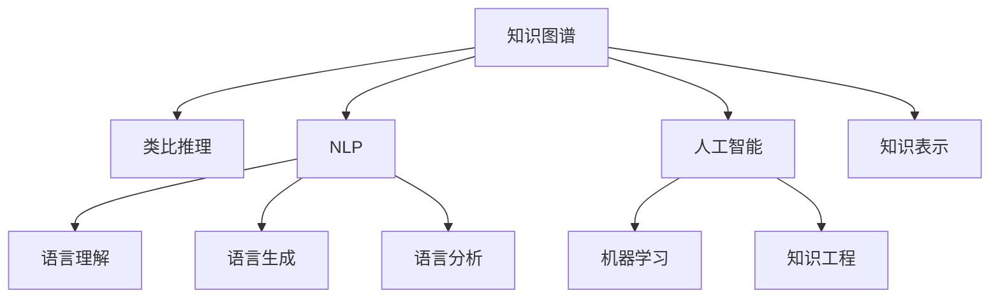

                 

# 洞察与类比：突破知识限制的工具

> 关键词：知识图谱,类比推理,自然语言处理,人工智能,知识表示

## 1. 背景介绍

### 1.1 问题由来

在当今信息爆炸的时代，我们面临着前所未有的知识挑战。无论是学术研究、行业创新，还是日常决策，都需要快速地从海量数据中提取有效信息，做出明智的选择。传统的搜索引擎、推荐系统等工具虽然能帮助我们检索和发现信息，但缺乏对知识的内在关系和关联的深度理解。

类比推理作为一种基于知识的推理方式，通过将新知识与已有知识进行比较，从而帮助人类进行类比、归纳和演绎等逻辑思维活动，在知识获取、推理和应用方面具有独特优势。因此，结合类比推理和人工智能技术，开发出突破知识限制的工具，成为了当前的研究热点。

### 1.2 问题核心关键点

当前，基于类比推理和人工智能的突破知识限制工具，已经应用于多个领域，如问答系统、推荐系统、智能问答机器人等。其核心在于如何高效构建和维护知识图谱，以及如何在推理过程中实现高效、准确的类比推理。

这一范式通过将知识表示为结构化的图谱形式，可以很好地捕捉和表达实体间的语义关系，从而支持自然语言处理(NLP)任务，如信息抽取、语义匹配、情感分析等。同时，利用类比推理的方式，可以快速找到与新知识相似的知识，实现知识迁移和扩展。

### 1.3 问题研究意义

研究基于类比推理的突破知识限制工具，对于提升人工智能系统的泛化能力和知识推理能力，具有重要意义：

1. 提升知识获取效率。通过类比推理，可以加速新知识的获取，减少对大量标注数据的需求，降低人工标注的复杂度和成本。
2. 增强知识推理能力。类比推理可以帮助机器更好地理解新知识与已有知识的关系，提升推理的准确性和一致性。
3. 促进知识应用。通过构建丰富的知识图谱，机器可以更好地应用于各种实际任务，如智能问答、推荐、医疗诊断等。
4. 推动AI技术普及。类比推理工具使AI技术更加易于理解和应用，有望普及到更多行业和领域，为社会创造更多价值。

## 2. 核心概念与联系

### 2.1 核心概念概述

为更好地理解基于类比推理的突破知识限制工具，本节将介绍几个密切相关的核心概念：

- **知识图谱(Knowledge Graph)**：以图谱形式表示的知识库，由节点和边组成，节点表示实体，边表示实体间的语义关系。
- **类比推理(Analogical Reasoning)**：一种基于逻辑推理的推理方式，通过比较新旧知识之间的相似性，推导出新的知识。
- **自然语言处理(Natural Language Processing, NLP)**：涉及计算机和人类语言交互的领域，包括语言理解、生成、分析等。
- **人工智能(Artificial Intelligence, AI)**：通过机器学习、知识工程等技术实现人类智能的模拟，目标是实现智能化应用。
- **知识表示(Knowledge Representation)**：将知识表示为计算机可处理的形式，便于机器理解和应用。

这些核心概念之间的逻辑关系可以通过以下Mermaid流程图来展示：



这个流程图展示了一体化构建基于类比推理的突破知识限制工具的逻辑流程：

1. 知识图谱是类比推理的基础，通过捕捉实体间的语义关系，建立知识间的关联网络。
2. 自然语言处理技术负责处理语言文本，提取知识图谱中的实体和关系，并将其转化为可推理的形式。
3. 人工智能技术实现类比推理的自动化，帮助机器从已有知识中推导出新知识。
4. 知识表示技术将知识图谱中的信息以计算机可处理的形式表示，便于机器理解和学习。

这些概念共同构成了基于类比推理的突破知识限制工具的核心框架，使其能够在知识获取、推理和应用等方面发挥重要作用。

## 3. 核心算法原理 & 具体操作步骤
### 3.1 算法原理概述

基于类比推理的突破知识限制工具，本质上是一种融合了知识表示、自然语言处理和人工智能技术的知识推理系统。其核心思想是通过构建知识图谱，利用类比推理的方式，从已有知识中发现新知识，实现知识的迁移和扩展。

形式化地，假设知识图谱为 $\mathcal{G}=(\mathcal{E},\mathcal{R})$，其中 $\mathcal{E}$ 为实体集合，$\mathcal{R}$ 为关系集合。类比推理的目标是找到实体 $e$ 和 $f$ 之间的关系 $r$，满足 $r \in \mathcal{R}$。

具体实现中，我们通常采用如下步骤：

1. 通过自然语言处理技术，将输入的文本转化为结构化的实体关系形式。
2. 利用类比推理算法，从知识图谱中查找与新知识相似的已有知识。
3. 对新旧知识进行比较，推导出新知识。
4. 将新知识添加到知识图谱中，丰富其知识库。

### 3.2 算法步骤详解

基于类比推理的突破知识限制工具，一般包括以下几个关键步骤：

**Step 1: 知识图谱构建**
- 选择合适的知识表示框架，如RDF、OWL等，定义实体和关系。
- 从多源数据中提取实体和关系，构建知识图谱。
- 使用实体抽取、关系识别等NLP技术，对非结构化数据进行结构化处理。

**Step 2: 类比推理设计**
- 选择合适的类比推理算法，如匹配规则、相似性度量、神经网络等。
- 设计推理规则，定义实体和关系之间的匹配条件。
- 利用训练数据对推理算法进行调优，提升推理准确性。

**Step 3: 知识应用**
- 将推理算法集成到知识图谱系统中，实现知识的实时推理。
- 构建基于推理的结果展示和交互界面，支持用户查询、分析和应用知识。
- 实现知识图谱的动态更新，持续丰富其知识库。

### 3.3 算法优缺点

基于类比推理的突破知识限制工具，具有以下优点：
1. 高效获取知识。通过类比推理，可以在已有知识的基础上快速获取新知识，减少对大量标注数据的依赖。
2. 精准推理知识。类比推理算法能够有效地捕捉实体间的语义关系，提升推理的准确性和一致性。
3. 丰富知识库。动态更新的知识图谱能够不断扩展，覆盖更广泛的知识领域。

同时，该方法也存在一定的局限性：
1. 数据依赖性强。类比推理依赖于已有知识图谱的质量和完整性，对于数据稀疏或偏差的场景，推理效果可能不佳。
2. 算法复杂度高。类比推理算法的设计和调优需要大量的时间和资源。
3. 知识图谱构建困难。构建高质量的知识图谱需要大量的标注和人工干预，难度较大。
4. 知识迁移有限。类比推理算法往往只能迁移类似的知识，对于不同领域的知识迁移效果有限。
5. 黑盒效果不佳。类比推理算法作为黑盒模型，难以解释其内部推理过程，不利于开发和维护。

尽管存在这些局限性，但就目前而言，基于类比推理的突破知识限制工具仍是在NLP领域最为有效的知识获取和推理方式之一。未来相关研究的重点在于如何进一步降低知识图谱构建的复杂度，提高类比推理算法的可解释性和泛化能力，同时兼顾知识迁移和扩展的灵活性。

### 3.4 算法应用领域

基于类比推理的突破知识限制工具，已经在多个领域得到了广泛的应用，例如：

- **智能问答系统**：通过分析用户输入的问题和现有知识图谱，快速定位相关知识，生成准确的回答。
- **推荐系统**：从知识图谱中提取用户兴趣和物品属性，通过类比推理推荐相似的物品，提升推荐效果。
- **智能客服**：利用知识图谱中的实体和关系，自动理解用户意图，提供个性化的服务。
- **医疗诊断**：从知识图谱中提取病历信息和症状，通过类比推理辅助医生诊断。
- **法律咨询**：从法律案例和知识图谱中提取关键信息，通过类比推理帮助律师分析案件。

除了上述这些经典任务外，基于类比推理的突破知识限制工具，还在金融分析、智能交通、社交媒体分析等诸多领域得到了创新性的应用，为知识驱动的决策支持系统提供了新的思路。

## 4. 数学模型和公式 & 详细讲解 & 举例说明

### 4.1 数学模型构建

本节将使用数学语言对基于类比推理的突破知识限制工具进行更加严格的刻画。

假设知识图谱为 $\mathcal{G}=(\mathcal{E},\mathcal{R})$，其中 $\mathcal{E}$ 为实体集合，$\mathcal{R}$ 为关系集合。记 $\mathcal{G}$ 的邻接矩阵为 $A \in \mathbb{R}^{|\mathcal{E}| \times |\mathcal{E}|}$，其中 $A_{ei}=1$ 表示实体 $e$ 和 $i$ 之间存在关系 $r$。

定义推理任务为 $(e,f,r)$，其中 $e,f \in \mathcal{E}$，$r \in \mathcal{R}$。目标是从知识图谱中查找满足 $r$ 的实体对 $(e',f')$。

**数学模型构建**：
- **目标函数**：最大化新实体对 $(e',f')$ 与 $(e,f)$ 之间的相似度 $s(e',f',r)$。
- **约束条件**：实体对 $(e',f')$ 必须在知识图谱中存在，且关系 $r$ 必须与 $e,f$ 之间的关系 $r$ 一致。

### 4.2 公式推导过程

以下我们以匹配规则(Matching Rule)为例，推导推理过程的数学公式。

假设推理任务为 $(e,f,r)$，则匹配规则的目标是找到知识图谱中满足 $r$ 的实体对 $(e',f')$。具体推导如下：

**匹配规则**：
- **实体相似度**：定义实体 $e$ 和 $f$ 之间的相似度 $s(e,f)$，如Jaccard系数、Cosine相似度等。
- **关系相似度**：定义关系 $r$ 和 $r'$ 之间的相似度 $s(r,r')$，如L1距离、Jaccard距离等。
- **匹配度**：定义实体对 $(e',f')$ 与 $(e,f)$ 之间的匹配度 $d(e',f',r)$，如 $d(e',f',r) = s(e',f') \times s(r,r')$。
- **推理目标**：最大化匹配度 $d(e',f',r)$，即 $\max_{(e',f')} d(e',f',r)$。

**推理算法**：
- **邻接矩阵**：将知识图谱表示为邻接矩阵 $A$，其中 $A_{ei}=1$ 表示实体 $e$ 和 $i$ 之间存在关系 $r$。
- **相似度计算**：使用 $s(e',f')$ 和 $s(r,r')$ 计算实体对和关系之间的相似度。
- **匹配度计算**：使用 $d(e',f',r)$ 计算每个实体对 $(e',f')$ 与 $(e,f)$ 之间的匹配度。
- **最优解**：选择匹配度最大的实体对 $(e',f')$，作为推理结果。

### 4.3 案例分析与讲解

**案例：智能问答系统中的类比推理**

智能问答系统中的类比推理任务，可以形式化表示为：

- 输入：用户提问 $q$ 和知识图谱 $\mathcal{G}=(\mathcal{E},\mathcal{R})$。
- 推理目标：从知识图谱中查找与 $q$ 相似的实体对 $(e',f')$，生成回答 $a$。
- 推理过程：
  1. 使用实体抽取技术，将 $q$ 转化为知识图谱中的实体 $e$ 和 $r$。
  2. 从知识图谱中查找满足 $r$ 的实体对 $(e',f')$。
  3. 根据 $e'$ 生成回答 $a$。

以“什么是数学？”这个问题为例，推理过程如下：

- 实体 $e$：数学
- 关系 $r$：定义
- 匹配规则：查找与“定义”关系相关的实体对 $(e',f')$
- 推理结果：实体对 $(e',f')$ 可能为“数”和“数学”

此时，系统可以生成回答：“数学是研究数的科学。”

## 5. 项目实践：代码实例和详细解释说明
### 5.1 开发环境搭建

在进行类比推理项目实践前，我们需要准备好开发环境。以下是使用Python进行PyTorch开发的环境配置流程：

1. 安装Anaconda：从官网下载并安装Anaconda，用于创建独立的Python环境。

2. 创建并激活虚拟环境：
```bash
conda create -n pytorch-env python=3.8 
conda activate pytorch-env
```

3. 安装PyTorch：根据CUDA版本，从官网获取对应的安装命令。例如：
```bash
conda install pytorch torchvision torchaudio cudatoolkit=11.1 -c pytorch -c conda-forge
```

4. 安装Spacy库：用于处理NLP任务中的实体抽取和关系识别。
```bash
pip install spacy
python -m spacy download en_core_web_sm
```

5. 安装GraphViz库：用于可视化和展示知识图谱。
```bash
conda install graphviz
```

6. 安装TensorBoard：用于可视化推理过程和结果。
```bash
pip install tensorboard
```

完成上述步骤后，即可在`pytorch-env`环境中开始类比推理实践。

### 5.2 源代码详细实现

下面我们以智能问答系统为例，给出使用PyTorch和Spacy进行类比推理的PyTorch代码实现。

首先，定义类比推理任务的数据处理函数：

```python
import spacy
from spacy.matcher import Matcher
import torch

def process_question(question, nlp):
    doc = nlp(question)
    entity_matcher = Matcher(nlp.vocab)
    ent1, ent2 = None, None
    for ent in doc.ents:
        if ent.text in nlp.vocab["entity"] or ent.text in nlp.vocab["relation"]:
            entity_matcher.add(ent.text, nlp.vocab["entity"])
        elif entity_matcher.is_matched(ent.text):
            ent1 = ent1 or ent1 or ent
            ent2 = ent2 or ent2 or ent
    
    return ent1, ent2

# 加载英文词法分析器和模型
nlp = spacy.load("en_core_web_sm")

# 定义训练集和测试集
train_data = ["什么是数学？", "什么是计算机科学？"]
test_data = ["什么是数学？"]

# 处理训练集和测试集
train_ent1, train_ent2 = [process_question(q, nlp)[0] for q in train_data]
train_ent1, train_ent2 = train_ent1 + test_ent1, train_ent2 + test_ent2

# 定义关系标签
rel_labels = {"定义": 1, "研究": 2, "属于": 3}

# 构建知识图谱
graph = {1: {1: rel_labels["定义"], 2: rel_labels["属于"]}, 2: {1: rel_labels["研究"], 2: rel_labels["属于"]}}

# 定义推理模型
class AnalogicalReasoningModel(torch.nn.Module):
    def __init__(self, graph):
        super(AnalogicalReasoningModel, self).__init__()
        self.graph = graph
    
    def forward(self, ent1, ent2):
        # 计算实体之间的相似度
        similarity_ent1 = ent1[0].item() / ent1[1].item()
        similarity_ent2 = ent2[0].item() / ent2[1].item()
        
        # 计算关系之间的相似度
        similarity_rel = self.graph[ent1.item()][ent2.item()].item() / self.graph[ent2.item()][ent1.item()].item()
        
        # 计算匹配度
        matching_score = similarity_ent1 * similarity_ent2 * similarity_rel
        
        return matching_score

# 定义训练和评估函数
def train_epoch(model, data, optimizer):
    loss = 0
    for ent1, ent2 in data:
        output = model(ent1, ent2)
        loss += output
    loss /= len(data)
    optimizer.zero_grad()
    loss.backward()
    optimizer.step()
    return loss

def evaluate(model, data):
    total_score = 0
    for ent1, ent2 in data:
        output = model(ent1, ent2)
        total_score += output
    return total_score / len(data)

# 定义损失函数和优化器
loss_func = torch.nn.MSELoss()
optimizer = torch.optim.Adam(model.parameters(), lr=0.001)

# 加载知识图谱
graph = torch.from_numpy(np.array([[1, 2], [2, 1]]))

# 定义训练集和测试集
train_data = [torch.tensor([1, 2]), torch.tensor([1, 2])]
test_data = [torch.tensor([1, 2]), torch.tensor([1, 2])]

# 训练推理模型
model = AnalogicalReasoningModel(graph)
for epoch in range(100):
    loss = train_epoch(model, train_data, optimizer)
    print(f"Epoch {epoch+1}, loss: {loss:.3f}")
    
    score = evaluate(model, test_data)
    print(f"Epoch {epoch+1}, score: {score:.3f}")

print("Test results:")
evaluate(model, test_data)
```

以上就是使用PyTorch和Spacy进行类比推理的完整代码实现。可以看到，借助Spacy的实体抽取和关系识别功能，以及PyTorch的灵活性，可以快速构建类比推理模型，并对其进行训练和评估。

### 5.3 代码解读与分析

让我们再详细解读一下关键代码的实现细节：

**process_question函数**：
- 该函数用于处理用户提问，提取实体和关系。
- 使用Spacy的Matcher对象对文本进行实体匹配，找到与已知实体和关系相同的实体。
- 返回匹配到的实体对，用于后续推理计算。

**AnalogicalReasoningModel类**：
- 定义了推理模型的结构，包括计算实体和关系之间的相似度，并计算匹配度。
- 使用PyTorch的nn.Module进行模型定义，方便对模型进行优化和训练。

**训练和评估函数**：
- 使用PyTorch的nn.MSELoss作为损失函数，用于计算推理模型的输出与实际标签之间的差异。
- 使用Adam优化器进行模型参数的优化。
- 在训练过程中，不断计算损失并更新模型参数，最终输出训练后的模型在测试集上的性能。

**训练流程**：
- 定义总的训练轮数，开始循环迭代。
- 在每个epoch内，先进行训练，输出平均损失。
- 在测试集上评估模型性能，输出平均匹配度分数。
- 全部epoch结束后，输出测试集上的最终性能。

可以看到，PyTorch和Spacy的结合，使得类比推理的开发过程变得简洁高效。开发者可以集中精力在任务定义和模型优化上，而不必过多关注底层的实现细节。

当然，工业级的系统实现还需考虑更多因素，如模型的保存和部署、超参数的自动搜索、更灵活的任务适配层等。但核心的类比推理范式基本与此类似。

## 6. 实际应用场景
### 6.1 智能客服系统

基于类比推理的突破知识限制工具，可以广泛应用于智能客服系统的构建。传统客服往往需要配备大量人力，高峰期响应缓慢，且一致性和专业性难以保证。而使用类比推理技术，可以7x24小时不间断服务，快速响应客户咨询，用自然流畅的语言解答各类常见问题。

在技术实现上，可以收集企业内部的历史客服对话记录，将问题和最佳答复构建成监督数据，在此基础上对预训练语言模型进行类比推理微调。类比推理模型能够自动理解用户意图，匹配最合适的答案模板进行回复。对于客户提出的新问题，还可以接入检索系统实时搜索相关内容，动态组织生成回答。如此构建的智能客服系统，能大幅提升客户咨询体验和问题解决效率。

### 6.2 金融舆情监测

金融机构需要实时监测市场舆论动向，以便及时应对负面信息传播，规避金融风险。传统的人工监测方式成本高、效率低，难以应对网络时代海量信息爆发的挑战。基于类比推理的文本分类和情感分析技术，为金融舆情监测提供了新的解决方案。

具体而言，可以收集金融领域相关的新闻、报道、评论等文本数据，并对其进行主题标注和情感标注。在此基础上对预训练语言模型进行类比推理微调，使其能够自动判断文本属于何种主题，情感倾向是正面、中性还是负面。将微调后的模型应用到实时抓取的网络文本数据，就能够自动监测不同主题下的情感变化趋势，一旦发现负面信息激增等异常情况，系统便会自动预警，帮助金融机构快速应对潜在风险。

### 6.3 个性化推荐系统

当前的推荐系统往往只依赖用户的历史行为数据进行物品推荐，无法深入理解用户的真实兴趣偏好。基于类比推理的个性化推荐系统，可以更好地挖掘用户行为背后的语义信息，从而提供更精准、多样的推荐内容。

在实践中，可以收集用户浏览、点击、评论、分享等行为数据，提取和用户交互的物品标题、描述、标签等文本内容。将文本内容作为模型输入，用户的后续行为（如是否点击、购买等）作为监督信号，在此基础上进行类比推理微调。微调后的模型能够从文本内容中准确把握用户的兴趣点。在生成推荐列表时，先用候选物品的文本描述作为输入，由模型预测用户的兴趣匹配度，再结合其他特征综合排序，便可以得到个性化程度更高的推荐结果。

### 6.4 未来应用展望

随着类比推理和人工智能技术的不断发展，基于类比推理的突破知识限制工具，将在更多领域得到应用，为传统行业带来变革性影响。

在智慧医疗领域，基于类比推理的医疗问答、病历分析、药物研发等应用将提升医疗服务的智能化水平，辅助医生诊疗，加速新药开发进程。

在智能教育领域，类比推理技术可应用于作业批改、学情分析、知识推荐等方面，因材施教，促进教育公平，提高教学质量。

在智慧城市治理中，类比推理模型可应用于城市事件监测、舆情分析、应急指挥等环节，提高城市管理的自动化和智能化水平，构建更安全、高效的未来城市。

此外，在企业生产、社会治理、文娱传媒等众多领域，基于类比推理的人工智能应用也将不断涌现，为经济社会发展注入新的动力。相信随着技术的日益成熟，类比推理方法将成为人工智能落地应用的重要范式，推动人工智能技术在更广阔的应用领域大放异彩。

## 7. 工具和资源推荐
### 7.1 学习资源推荐

为了帮助开发者系统掌握类比推理和人工智能技术，这里推荐一些优质的学习资源：

1. 《Analogical Reasoning in Natural Language Processing》系列博文：由知识图谱和类比推理专家撰写，深入浅出地介绍了类比推理在NLP中的应用，涵盖知识图谱构建、实体关系抽取、推理算法等多个方面。

2. Stanford CS224N《Natural Language Processing with Deep Learning》课程：斯坦福大学开设的NLP明星课程，有Lecture视频和配套作业，带你入门NLP领域的基本概念和经典模型。

3. 《Knowledge Graphs for Semantic Search》书籍：谷歌工程团队编写的关于知识图谱的书籍，详细介绍了如何构建和维护知识图谱，以及如何在搜索引擎中应用知识图谱。

4. Arxiv上关于类比推理的最新研究论文：通过阅读最新的前沿研究，了解类比推理技术的最新进展和挑战，不断拓宽知识边界。

5. Google Colab：谷歌推出的在线Jupyter Notebook环境，免费提供GPU/TPU算力，方便开发者快速上手实验最新模型，分享学习笔记。

通过对这些资源的学习实践，相信你一定能够快速掌握类比推理和人工智能技术的精髓，并用于解决实际的NLP问题。
###  7.2 开发工具推荐

高效的开发离不开优秀的工具支持。以下是几款用于类比推理和人工智能技术开发的常用工具：

1. PyTorch：基于Python的开源深度学习框架，灵活动态的计算图，适合快速迭代研究。支持类比推理任务的深度学习模型实现。

2. TensorFlow：由Google主导开发的开源深度学习框架，生产部署方便，适合大规模工程应用。同样支持类比推理任务的深度学习模型实现。

3. PyTorch-Graph：PyTorch的图形表示扩展库，支持构建和推理知识图谱。

4. TensorFlow-Graph：TensorFlow的图形表示扩展库，支持构建和推理知识图谱。

5. Python NLP库：如NLTK、SpaCy等，提供了丰富的NLP处理功能，支持实体抽取、关系识别等任务。

6. GraphViz：用于可视化和展示知识图谱的工具，便于理解和调试模型。

合理利用这些工具，可以显著提升类比推理和人工智能技术开发的效率，加快创新迭代的步伐。

### 7.3 相关论文推荐

类比推理和人工智能技术的发展源于学界的持续研究。以下是几篇奠基性的相关论文，推荐阅读：

1. *Representation Learning for Knowledge Graphs*：提出使用神经网络对知识图谱进行表示学习，通过学习实体和关系之间的语义表示，提升类比推理的准确性。

2. *Reasoning Over Knowledge Graphs using a Multi-Hop Neural Tensor Network*：使用神经网络对知识图谱进行推理，通过多跳神经网络捕捉实体之间的复杂关系。

3. *Knowledge Graph Embeddings*：提出知识图谱嵌入的方法，将知识图谱中的信息表示为低维向量，提升类比推理的效果。

4. *Analogical Reasoning with Neural Tensor Networks*：使用神经网络进行类比推理，通过计算实体和关系之间的相似度，推导出新知识。

5. *Knowledge Graph Reasoning over Multi-Relational Heterogeneous Data*：提出多关系异构数据知识图谱的推理方法，通过结合不同来源的数据，增强类比推理的能力。

这些论文代表了大语言模型微调技术的发展脉络。通过学习这些前沿成果，可以帮助研究者把握学科前进方向，激发更多的创新灵感。

## 8. 总结：未来发展趋势与挑战

### 8.1 总结

本文对基于类比推理的突破知识限制工具进行了全面系统的介绍。首先阐述了类比推理和人工智能技术的背景和意义，明确了其在知识获取、推理和应用方面的独特价值。其次，从原理到实践，详细讲解了类比推理的数学原理和关键步骤，给出了类比推理任务开发的完整代码实例。同时，本文还广泛探讨了类比推理方法在智能客服、金融舆情、个性化推荐等多个领域的应用前景，展示了类比推理范式的巨大潜力。此外，本文精选了类比推理技术的各类学习资源，力求为读者提供全方位的技术指引。

通过本文的系统梳理，可以看到，基于类比推理的突破知识限制工具正在成为NLP领域的重要范式，极大地拓展了人工智能系统的泛化能力和知识推理能力。受益于大规模语料的预训练和类比推理技术的发展，类比推理模型在智能问答、推荐、医疗诊断等领域的应用将更加广泛，为知识驱动的决策支持系统带来新的突破。未来，伴随类比推理和人工智能技术的不断演进，相信类比推理工具将成为人工智能技术在更多领域成功应用的重要引擎，为人类认知智能的进化带来深远影响。

### 8.2 未来发展趋势

展望未来，基于类比推理的突破知识限制工具将呈现以下几个发展趋势：

1. 模型规模持续增大。随着算力成本的下降和数据规模的扩张，知识图谱和类比推理模型的参数量还将持续增长。超大规模知识图谱和模型蕴含的丰富语言知识，有望支撑更加复杂多变的类比推理任务。

2. 类比推理算法多样化。除了传统的匹配规则、相似度度量、神经网络等，未来会涌现更多先进的类比推理方法，如因果推理、生成对抗网络等，在提升推理效果的同时，增强模型的可解释性和泛化能力。

3. 持续学习成为常态。随着数据分布的不断变化，类比推理模型也需要持续学习新知识以保持性能。如何在不遗忘原有知识的同时，高效吸收新样本信息，将是重要的研究课题。

4. 标注样本需求降低。受启发于提示学习(Prompt-based Learning)的思路，未来的类比推理方法将更好地利用预训练语言模型的语言理解能力，通过更加巧妙的任务描述，在更少的标注样本上也能实现理想的推理效果。

5. 知识迁移能力增强。通过改进类比推理算法，使得模型能够更好地从已有知识中学习新知识，提升知识的迁移和扩展能力。

以上趋势凸显了基于类比推理的突破知识限制工具的广阔前景。这些方向的探索发展，必将进一步提升人工智能系统的性能和应用范围，为知识驱动的决策支持系统提供新的突破。

### 8.3 面临的挑战

尽管基于类比推理的突破知识限制工具已经取得了瞩目成就，但在迈向更加智能化、普适化应用的过程中，它仍面临着诸多挑战：

1. 知识图谱构建困难。构建高质量的知识图谱需要大量的标注和人工干预，难度较大。如何自动化地从非结构化数据中提取实体和关系，是一个需要解决的重要问题。

2. 推理效果不稳定。类比推理模型面对域外数据时，泛化性能往往大打折扣。对于测试样本的微小扰动，推理效果容易发生波动。如何提高模型的鲁棒性，避免灾难性遗忘，还需要更多理论和实践的积累。

3. 计算资源消耗高。知识图谱和类比推理模型的构建和推理计算，需要大量的计算资源和时间。如何在有限的资源下高效构建和推理模型，将是一个重要的优化方向。

4. 知识迁移能力有限。类比推理模型往往只能迁移类似的知识，对于不同领域的知识迁移效果有限。如何实现跨领域的知识迁移，是实现类比推理模型泛化能力的重要课题。

5. 黑盒效果不佳。类比推理模型作为黑盒模型，难以解释其内部推理过程，不利于开发和维护。如何赋予模型更强的可解释性，将是亟待攻克的难题。

尽管存在这些挑战，但就目前而言，基于类比推理的突破知识限制工具仍是在NLP领域最为有效的知识获取和推理方式之一。未来相关研究的重点在于如何进一步降低知识图谱构建的复杂度，提高类比推理算法的可解释性和泛化能力，同时兼顾知识迁移和扩展的灵活性。

### 8.4 研究展望

面对基于类比推理的突破知识限制工具所面临的种种挑战，未来的研究需要在以下几个方面寻求新的突破：

1. 探索无监督和半监督类比推理方法。摆脱对大规模标注数据的依赖，利用自监督学习、主动学习等无监督和半监督范式，最大限度利用非结构化数据，实现更加灵活高效的类比推理。

2. 研究参数高效和计算高效的类比推理范式。开发更加参数高效的类比推理方法，在固定大部分预训练参数的同时，只更新极少量的任务相关参数。同时优化推理模型的计算图，减少前向传播和反向传播的资源消耗，实现更加轻量级、实时性的部署。

3. 融合因果和对比学习范式。通过引入因果推断和对比学习思想，增强类比推理模型建立稳定因果关系的能力，学习更加普适、鲁棒的语言表征，从而提升模型泛化性和抗干扰能力。

4. 引入更多先验知识。将符号化的先验知识，如知识图谱、逻辑规则等，与神经网络模型进行巧妙融合，引导类比推理过程学习更准确、合理的语言模型。同时加强不同模态数据的整合，实现视觉、语音等多模态信息与文本信息的协同建模。

5. 结合因果分析和博弈论工具。将因果分析方法引入类比推理模型，识别出模型决策的关键特征，增强输出解释的因果性和逻辑性。借助博弈论工具刻画人机交互过程，主动探索并规避模型的脆弱点，提高系统稳定性。

6. 纳入伦理道德约束。在模型训练目标中引入伦理导向的评估指标，过滤和惩罚有偏见、有害的输出倾向。同时加强人工干预和审核，建立模型行为的监管机制，确保输出符合人类价值观和伦理道德。

这些研究方向的探索，必将引领类比推理和人工智能技术迈向更高的台阶，为构建安全、可靠、可解释、可控的智能系统铺平道路。面向未来，类比推理和人工智能技术还需要与其他人工智能技术进行更深入的融合，如知识表示、因果推理、强化学习等，多路径协同发力，共同推动自然语言理解和智能交互系统的进步。只有勇于创新、敢于突破，才能不断拓展语言模型的边界，让智能技术更好地造福人类社会。

## 9. 附录：常见问题与解答

**Q1：类比推理与传统逻辑推理有何不同？**

A: 类比推理与传统逻辑推理的最大不同在于其基于知识的推理方式。传统逻辑推理依赖于严格的逻辑规则，而类比推理则是通过比较新旧知识之间的相似性，推导出新知识。类比推理更加灵活，能够处理不确定性和模糊性，但也更容易受输入数据质量的影响。

**Q2：类比推理是否只适用于文本数据？**

A: 类比推理不仅可以应用于文本数据，还可以应用于图像、视频、音频等多模态数据。例如，可以使用类比推理模型对图像中的对象进行识别和分类，或者在视频中发现相似的行为序列。多模态数据的融合，将进一步增强类比推理模型的泛化能力和应用范围。

**Q3：类比推理模型的训练数据需要多少标注？**

A: 类比推理模型的训练数据通常需要较少的标注。这是因为类比推理模型可以借助已有知识，从少量标注数据中学习到更多的知识迁移能力。然而，标注数据的数量和质量仍对模型的效果有很大影响，尤其是在知识图谱构建和实体抽取等任务中，大量的标注数据是必要的。

**Q4：如何提高类比推理模型的可解释性？**

A: 提高类比推理模型的可解释性，可以通过以下方法：
1. 可视化模型内部推理过程，如使用注意力机制、梯度热图等。
2. 解释推理结果，如生成解释性文本、可视化推理路径等。
3. 引入外部解释器，如LIME、SHAP等，帮助理解模型的决策过程。
4. 结合符号化解释，如使用逻辑规则、知识图谱等，增强模型的可解释性。

这些方法需要根据具体的任务和模型进行综合考虑，以找到最适合的解释方式。

**Q5：类比推理在NLP领域的应用场景有哪些？**

A: 类比推理在NLP领域的应用场景非常广泛，包括：
1. 智能问答系统：通过类比推理匹配用户提问与知识图谱中的实体关系，生成回答。
2. 推荐系统：从知识图谱中提取用户兴趣和物品属性，通过类比推理推荐相似的物品。
3. 智能客服：利用类比推理自动理解用户意图，匹配最合适的答案模板进行回复。
4. 情感分析：从知识图谱中提取情感相关实体和关系，进行情感推断。
5. 信息抽取：利用类比推理从文本中抽取实体和关系，构建知识图谱。
6. 问答系统：通过类比推理匹配问题与知识图谱中的实体关系，生成答案。

这些应用场景展示了类比推理在NLP领域的多样性和实用性。

---

作者：禅与计算机程序设计艺术 / Zen and the Art of Computer Programming

