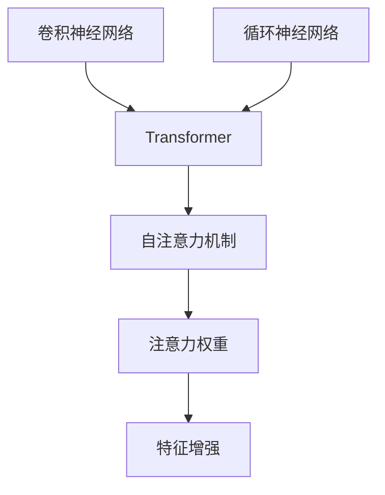

                 

# 深度学习与注意力模型的应用

> 关键词：深度学习,注意力模型,Transformer,卷积神经网络(CNN),循环神经网络(RNN),自注意力机制(Self-Attention),注意力权重,特征增强,图像处理,语音识别,自然语言处理(NLP),计算机视觉

## 1. 背景介绍

### 1.1 问题由来
随着深度学习技术的迅猛发展，深度神经网络在计算机视觉、自然语言处理、语音识别等多个领域取得了显著的突破。然而，传统的深度神经网络在处理大规模数据和复杂任务时，存在计算量庞大、资源消耗大、学习效率低等问题。

为了解决这些问题，研究者提出了注意力机制(Automatic Attention Mechanism)，通过引入自注意力机制(Self-Attention)，使得网络能够聚焦于输入序列中最有意义的局部信息，从而提高模型的表达能力和计算效率。自注意力机制已经成为当前深度学习的重要研究方向，广泛应用于各种场景，如图像处理、语音识别、自然语言处理等。

### 1.2 问题核心关键点
注意力机制的核心在于通过对输入数据的局部或全局信息进行加权聚合，从而得到更具代表性的特征表示。自注意力机制通过计算输入序列中各个元素的注意力权重，动态调整输入向量与输出向量的关系，使得网络可以自适应地关注输入中的关键信息，提升模型的准确性和泛化能力。

注意力机制被广泛应用于各种深度学习架构中，如卷积神经网络(CNN)、循环神经网络(RNN)、Transformer等。其中，Transformer模型是当前研究最为广泛的注意力模型之一，具有参数共享、长距离依赖处理等优点。

## 2. 核心概念与联系

### 2.1 核心概念概述

为更好地理解深度学习中注意力模型的应用，本节将介绍几个密切相关的核心概念：

- 卷积神经网络(CNN)：基于卷积操作的神经网络，在图像处理等领域广泛应用。CNN通过卷积层提取局部特征，池化层降低维度，全连接层进行分类或回归。

- 循环神经网络(RNN)：处理序列数据的神经网络，能够利用上下文信息，对时间序列进行建模。RNN通过时间反向传播算法进行训练，可以处理变长序列数据。

- Transformer：一种基于自注意力机制的神经网络架构，能够高效处理长序列数据，广泛应用于自然语言处理等任务。Transformer包括编码器和解码器两部分，通过自注意力机制进行信息交互。

- 自注意力机制(Self-Attention)：一种能够动态调整输入向量与输出向量关系的机制，通过计算注意力权重，对输入序列中的不同位置进行加权聚合，从而得到更具代表性的特征表示。

- 注意力权重：自注意力机制中的关键部分，表示输入序列中各个元素对输出向量贡献的大小，通过矩阵乘法计算得到。

- 特征增强：通过引入注意力机制，使得模型能够对输入数据的不同部分进行动态调整，增强模型的表达能力。

这些核心概念之间的逻辑关系可以通过以下Mermaid流程图来展示：



这个流程图展示了大模型中各核心概念及其之间的关系：

1. CNN和RNN是深度学习中常见的神经网络架构，分别应用于图像处理和序列数据处理。
2. Transformer是当前研究最为广泛的注意力模型之一，基于自注意力机制。
3. 自注意力机制和注意力权重是Transformer的核心部分，通过动态调整输入向量与输出向量关系，得到更具代表性的特征表示。
4. 特征增强是注意力机制的应用场景之一，通过动态调整输入数据的不同部分，增强模型的表达能力。

这些概念共同构成了深度学习中注意力模型的基础，使得模型能够自适应地关注输入序列中的关键信息，提升模型的准确性和泛化能力。

## 3. 核心算法原理 & 具体操作步骤
### 3.1 算法原理概述

深度学习中的注意力模型通过引入自注意力机制，使得模型能够动态调整输入向量与输出向量之间的关系，聚焦于输入序列中最有意义的局部信息。其核心思想是通过计算输入序列中各个元素的注意力权重，对输入向量进行加权聚合，从而得到更具代表性的特征表示。

Transformer模型是当前研究最为广泛的注意力模型之一，其核心是自注意力机制。Transformer模型包括编码器和解码器两部分，通过多层次的自注意力机制进行信息交互，从而高效地处理长序列数据。

Transformer模型主要由以下三个部分组成：
- 编码器(Encoder)：由多个编码层组成，每层包含自注意力机制和前馈神经网络(Feed Forward Network)。
- 解码器(Decoder)：由多个解码层组成，每层包含自注意力机制、编码器注意力机制(Encoder Attention Mechanism)和前馈神经网络。
- 解码器输出层：用于生成目标序列，通常使用线性变换和softmax层。

### 3.2 算法步骤详解

深度学习中注意力模型的训练步骤如下：

**Step 1: 数据准备**
- 收集训练数据，将序列数据分为输入和输出两部分，并进行归一化、标准化等预处理。

**Step 2: 搭建模型**
- 选择适当的神经网络架构，如CNN、RNN或Transformer。
- 在网络中加入注意力机制，定义注意力权重计算方法。
- 设置优化器、损失函数等超参数。

**Step 3: 模型训练**
- 使用训练数据进行模型训练，通过反向传播算法更新模型参数。
- 定义训练循环，设置批大小、迭代轮数等参数。
- 定义评估函数，计算训练集和验证集上的损失函数和准确率等指标。

**Step 4: 模型评估**
- 在测试集上评估模型性能，计算准确率、召回率等指标。
- 分析模型输出结果，检查模型的泛化能力和鲁棒性。

**Step 5: 模型调优**
- 根据评估结果调整模型参数，如调整学习率、修改网络结构等。
- 使用集成学习、正则化等技术提升模型性能。

### 3.3 算法优缺点

深度学习中注意力模型的优点包括：
1. 能够高效处理长序列数据，减少计算量和时间复杂度。
2. 通过动态调整输入向量与输出向量关系，提升模型的表达能力和泛化能力。
3. 能够自适应地关注输入序列中的关键信息，增强模型的鲁棒性。

深度学习中注意力模型的缺点包括：
1. 模型复杂度较高，训练和推理计算量较大。
2. 需要大量的训练数据，对标注数据的依赖较强。
3. 对超参数和网络结构的选择要求较高，难以进行模型调优。

尽管存在这些缺点，但注意力机制在深度学习中的应用已经非常广泛，特别是在自然语言处理、计算机视觉等领域取得了显著的突破。未来，注意力机制的研究将进一步拓展，与其他深度学习技术进行更深入的融合，推动深度学习技术的发展。

### 3.4 算法应用领域

深度学习中注意力模型已经在多个领域得到了广泛的应用，例如：

- 自然语言处理(NLP)：通过自注意力机制，对文本序列进行建模，广泛应用于文本分类、情感分析、机器翻译等任务。
- 计算机视觉(CV)：通过引入自注意力机制，对图像特征进行增强，应用于图像分类、目标检测、图像生成等任务。
- 语音识别(SR)：通过注意力机制，对声学特征进行加权聚合，应用于语音识别、语音合成等任务。
- 推荐系统：通过注意力机制，对用户行为进行建模，应用于个性化推荐、广告推荐等任务。

除了上述这些经典应用外，深度学习中的注意力模型还被创新性地应用于更多场景中，如对话系统、自动摘要、知识图谱等，为深度学习技术带来了新的突破。

## 4. 数学模型和公式 & 详细讲解  
### 4.1 数学模型构建

深度学习中注意力模型的数学模型可以表示为：

$$
y = \sum_{i=1}^n \alpha_i x_i
$$

其中 $x_i$ 表示输入序列中的元素，$y$ 表示输出向量，$\alpha_i$ 表示注意力权重，表示输入序列中各个元素对输出向量贡献的大小。

注意力权重 $\alpha_i$ 的计算公式为：

$$
\alpha_i = \frac{\exp(a_i)}{\sum_{j=1}^n \exp(a_j)}
$$

其中 $a_i$ 表示注意力计算得到的结果，通常通过矩阵乘法和softmax函数计算。

### 4.2 公式推导过程

以下我们以Transformer模型中的自注意力机制为例，推导注意力权重的计算公式。

Transformer模型中的自注意力机制包括两个部分：
1. 查询-键-值(QUERY-KEY-VALUE)矩阵计算：通过线性变换将输入向量 $x$ 转化为查询向量 $q$、键向量 $k$、值向量 $v$。
2. 注意力权重计算：通过计算查询向量 $q$ 和键向量 $k$ 的相似度，得到注意力权重 $\alpha_i$。

具体计算过程如下：

1. 查询-键-值矩阵计算：
   - 输入向量 $x$ 经过线性变换得到查询向量 $q$、键向量 $k$、值向量 $v$：
   
   $$
   Q = \mathrm{Linear}(x)
   $$
   
   $$
   K = \mathrm{Linear}(x)
   $$
   
   $$
   V = \mathrm{Linear}(x)
   $$

2. 注意力权重计算：
   - 通过计算查询向量 $q$ 和键向量 $k$ 的相似度，得到注意力权重 $\alpha_i$：
   
   $$
   a_{ij} = q_i \cdot k_j
   $$
   
   $$
   \alpha_i = \mathrm{softmax}(a_i)
   $$

3. 输出向量计算：
   - 通过计算注意力权重 $\alpha_i$ 和值向量 $v$，得到输出向量 $y$：
   
   $$
   y = \sum_{i=1}^n \alpha_i v_i
   $$

通过以上步骤，自注意力机制实现了输入向量与输出向量之间的动态调整，使得模型能够自适应地关注输入序列中的关键信息，提升模型的表达能力和泛化能力。

### 4.3 案例分析与讲解

以Transformer模型中的自注意力机制为例，下面进行案例分析与讲解。

**案例1：文本分类任务**
- 任务描述：将文本数据分为正负两类，判断其情感倾向。
- 数据准备：收集文本数据，进行标注和预处理。
- 模型搭建：使用Transformer模型，加入自注意力机制和前馈神经网络，进行训练和测试。
- 模型评估：计算准确率、召回率等指标，评估模型性能。
- 模型调优：根据评估结果调整超参数，如学习率、网络结构等，提升模型性能。

**案例2：图像分类任务**
- 任务描述：对图像数据进行分类，识别其所属类别。
- 数据准备：收集图像数据，进行标注和预处理。
- 模型搭建：使用Transformer模型，加入自注意力机制和卷积层，进行训练和测试。
- 模型评估：计算准确率、精度等指标，评估模型性能。
- 模型调优：根据评估结果调整超参数，如学习率、网络结构等，提升模型性能。

通过以上案例分析，可以看到深度学习中注意力模型的广泛应用，能够在多个领域实现高效、准确的特征表示和信息交互，提升模型的表达能力和泛化能力。

## 5. 项目实践：代码实例和详细解释说明
### 5.1 开发环境搭建

在进行注意力模型实践前，我们需要准备好开发环境。以下是使用Python进行TensorFlow开发的环境配置流程：

1. 安装Anaconda：从官网下载并安装Anaconda，用于创建独立的Python环境。

2. 创建并激活虚拟环境：
```bash
conda create -n tf-env python=3.8 
conda activate tf-env
```

3. 安装TensorFlow：根据CUDA版本，从官网获取对应的安装命令。例如：
```bash
conda install tensorflow tensorflow-gpu=2.5.0 -c pytorch -c conda-forge
```

4. 安装各类工具包：
```bash
pip install numpy pandas scikit-learn matplotlib tqdm jupyter notebook ipython
```

完成上述步骤后，即可在`tf-env`环境中开始注意力模型实践。

### 5.2 源代码详细实现

这里我们以Transformer模型为例，使用TensorFlow实现文本分类任务。

首先，定义数据处理函数：

```python
import tensorflow as tf
from tensorflow.keras.preprocessing.text import Tokenizer
from tensorflow.keras.preprocessing.sequence import pad_sequences

def load_data():
    # 加载训练数据
    train_texts, train_labels = ...
    # 加载测试数据
    test_texts, test_labels = ...
    
    # 分词和向量化
    tokenizer = Tokenizer()
    tokenizer.fit_on_texts(train_texts)
    train_sequences = tokenizer.texts_to_sequences(train_texts)
    train_padded = pad_sequences(train_sequences, maxlen=MAX_SEQUENCE_LENGTH, padding='post', truncating='post')
    test_sequences = tokenizer.texts_to_sequences(test_texts)
    test_padded = pad_sequences(test_sequences, maxlen=MAX_SEQUENCE_LENGTH, padding='post', truncating='post')
    
    return train_padded, train_labels, test_padded, test_labels
```

然后，定义Transformer模型：

```python
from tensorflow.keras.layers import Input, Embedding, MultiHeadAttention, Dense, Flatten, Dropout, Concatenate
from tensorflow.keras.models import Model

def build_model(input_shape, num_classes):
    input = Input(shape=(None,))
    embedding = Embedding(input_dim=VOCAB_SIZE, output_dim=EMBEDDING_DIM)(input)
    attention = MultiHeadAttention(num_heads=NUM_HEADS, key_dim=HEAD_DIM)(embedding, embedding)
    attention = Flatten()(attention)
    attention = Dense(256, activation='relu')(attention)
    attention = Dropout(DROPOUT_RATE)(attention)
    output = Dense(num_classes, activation='softmax')(attention)
    model = Model(inputs=input, outputs=output)
    return model
```

接着，定义训练和评估函数：

```python
from tensorflow.keras.optimizers import Adam
from tensorflow.keras.metrics import CategoricalAccuracy

def compile_model(model, optimizer, loss, metrics):
    model.compile(optimizer=optimizer, loss=loss, metrics=metrics)

def train_model(model, train_data, val_data, epochs, batch_size):
    model.fit(train_data, train_labels, validation_data=(val_data, val_labels), epochs=epochs, batch_size=batch_size)

def evaluate_model(model, test_data, test_labels, batch_size):
    return model.evaluate(test_data, test_labels, batch_size=batch_size)
```

最后，启动训练流程并在测试集上评估：

```python
# 数据准备
train_data, train_labels, test_data, test_labels = load_data()

# 模型搭建
model = build_model(input_shape=(MAX_SEQUENCE_LENGTH, ), num_classes=NUM_CLASSES)
compile_model(model, optimizer=Adam(lr=0.001), loss='categorical_crossentropy', metrics=['accuracy'])

# 训练模型
train_model(model, train_data, val_data, epochs=10, batch_size=32)

# 模型评估
test_loss, test_acc = evaluate_model(model, test_data, test_labels, batch_size=32)
print('Test Loss:', test_loss)
print('Test Accuracy:', test_acc)
```

以上就是使用TensorFlow对Transformer模型进行文本分类任务微调的完整代码实现。可以看到，TensorFlow提供了丰富的API和工具，使得注意力模型的实现和训练变得简单易行。

### 5.3 代码解读与分析

让我们再详细解读一下关键代码的实现细节：

**load_data函数**：
- 该函数用于加载训练和测试数据，并进行分词、向量化和填充等预处理操作。
- 使用TensorFlow的Tokenizer工具进行分词，将文本转化为序列形式。
- 使用pad_sequences函数对序列进行填充，保证所有序列的长度一致。

**build_model函数**：
- 该函数用于定义Transformer模型的结构。
- 首先定义输入层和嵌入层，将输入文本转化为向量形式。
- 然后定义自注意力机制，使用MultiHeadAttention层计算注意力权重。
- 接着定义前馈神经网络，对注意力输出进行加权求和。
- 最后定义输出层，使用Dense层进行分类。

**compile_model函数**：
- 该函数用于配置模型的优化器、损失函数和评估指标。
- 使用Adam优化器进行优化。
- 使用交叉熵损失函数进行训练。
- 使用准确率作为评估指标。

**train_model函数**：
- 该函数用于训练模型，在训练集上拟合参数。
- 使用fit方法进行模型训练。
- 设置验证集，进行早停机制。
- 设置批大小和迭代轮数。

**evaluate_model函数**：
- 该函数用于评估模型在测试集上的性能。
- 使用evaluate方法计算模型损失和准确率。

通过以上代码实现，可以看到TensorFlow提供了简单易用的API，使得注意力模型的训练和评估变得高效、直观。开发者只需关注模型结构和训练逻辑，无需过多关注底层实现细节。

当然，实际应用中还需要考虑更多因素，如模型裁剪、量化加速、服务化封装等。但核心的注意力机制及其应用流程基本与此类似。

## 6. 实际应用场景
### 6.1 图像处理

深度学习中的注意力机制在图像处理中也有广泛应用。通过引入自注意力机制，模型能够对图像中的不同区域进行动态调整，提取更有意义的局部特征，提升模型的准确性和泛化能力。

例如，在图像分类任务中，Transformer模型可以通过引入自注意力机制，对图像特征进行增强。具体而言，模型通过计算图像中各个区域的注意力权重，对图像特征进行加权聚合，得到更具代表性的特征表示。这样可以有效减少模型计算量，提升模型精度和泛化能力。

### 6.2 语音识别

深度学习中的注意力机制在语音识别中也得到了广泛应用。通过引入自注意力机制，模型能够对声学特征进行动态调整，增强模型的表达能力。

例如，在语音识别任务中，Transformer模型可以通过引入自注意力机制，对声学特征进行增强。具体而言，模型通过计算声学特征中的各个时域点之间的注意力权重，对特征进行加权聚合，得到更具代表性的特征表示。这样可以有效减少模型计算量，提升模型精度和泛化能力。

### 6.3 自然语言处理

深度学习中的注意力机制在自然语言处理中也得到了广泛应用。通过引入自注意力机制，模型能够对文本序列进行建模，提升模型的表达能力和泛化能力。

例如，在文本分类任务中，Transformer模型可以通过引入自注意力机制，对文本序列进行建模。具体而言，模型通过计算文本序列中各个词汇之间的注意力权重，对文本特征进行加权聚合，得到更具代表性的特征表示。这样可以有效减少模型计算量，提升模型精度和泛化能力。

### 6.4 未来应用展望

随着深度学习技术的发展，注意力机制的应用场景将进一步拓展，推动深度学习技术在更多领域的应用。

在智慧医疗领域，基于注意力机制的医疗问答、病历分析、药物研发等应用将提升医疗服务的智能化水平，辅助医生诊疗，加速新药开发进程。

在智能教育领域，注意力机制可用于作业批改、学情分析、知识推荐等方面，因材施教，促进教育公平，提高教学质量。

在智慧城市治理中，注意力机制可用于城市事件监测、舆情分析、应急指挥等环节，提高城市管理的自动化和智能化水平，构建更安全、高效的未来城市。

此外，在企业生产、社会治理、文娱传媒等众多领域，基于注意力机制的人工智能应用也将不断涌现，为经济社会发展注入新的动力。相信随着技术的日益成熟，注意力机制必将引领深度学习技术迈向更高的台阶，为构建人机协同的智能系统铺平道路。

## 7. 工具和资源推荐
### 7.1 学习资源推荐

为了帮助开发者系统掌握深度学习中注意力模型的理论基础和实践技巧，这里推荐一些优质的学习资源：

1. 《深度学习》系列博文：由深度学习专家撰写，深入浅出地介绍了深度学习的基本概念和核心算法，包括卷积神经网络、循环神经网络、自注意力机制等。

2. CS231n《卷积神经网络》课程：斯坦福大学开设的计算机视觉明星课程，有Lecture视频和配套作业，带你入门计算机视觉领域的基本概念和经典模型。

3. CS224n《序列建模》课程：斯坦福大学开设的自然语言处理明星课程，有Lecture视频和配套作业，带你入门自然语言处理领域的基本概念和经典模型。

4. Transformer论文：Transformer模型的原论文，详细介绍了Transformer模型的结构和工作原理，是理解Transformer模型的重要参考资料。

5. 深度学习框架文档：如TensorFlow、PyTorch等深度学习框架的官方文档，提供了丰富的API和工具，方便开发者进行模型搭建和训练。

通过对这些资源的学习实践，相信你一定能够快速掌握深度学习中注意力模型的精髓，并用于解决实际的图像处理、语音识别、自然语言处理等问题。

### 7.2 开发工具推荐

高效的开发离不开优秀的工具支持。以下是几款用于深度学习中注意力模型开发的常用工具：

1. TensorFlow：由Google主导开发的开源深度学习框架，生产部署方便，适合大规模工程应用。

2. PyTorch：基于Python的开源深度学习框架，灵活动态的计算图，适合快速迭代研究。

3. Keras：基于TensorFlow和Theano的高级API，提供了简单易用的接口，方便开发者进行模型搭建和训练。

4. Jupyter Notebook：交互式的笔记本环境，方便开发者进行代码调试和可视化。

5. Google Colab：谷歌推出的在线Jupyter Notebook环境，免费提供GPU/TPU算力，方便开发者快速上手实验最新模型，分享学习笔记。

合理利用这些工具，可以显著提升注意力模型的开发效率，加快创新迭代的步伐。

### 7.3 相关论文推荐

深度学习中注意力模型的研究源于学界的持续研究。以下是几篇奠基性的相关论文，推荐阅读：

1. Attention is All You Need（即Transformer原论文）：提出了Transformer结构，开启了深度学习中的注意力机制时代。

2. Convolutional Neural Networks for Visual Recognition：介绍卷积神经网络在图像处理中的应用，是计算机视觉领域的基本概念和经典模型。

3. RNNs Applied to Sequence Prediction：介绍循环神经网络在序列数据处理中的应用，是自然语言处理领域的基本概念和经典模型。

4. Transformer: Learning Phrase Representations using Transformer Models：介绍Transformer模型的结构和工作原理，是理解Transformer模型的重要参考资料。

5. Computationally Efficient Multi-Head Self-Attention with Linear Complexity：提出线性复杂度的自注意力机制，提高了模型的计算效率。

这些论文代表了大模型中注意力机制的研究方向，通过学习这些前沿成果，可以帮助研究者把握学科前进方向，激发更多的创新灵感。

## 8. 总结：未来发展趋势与挑战
### 8.1 总结

本文对深度学习中注意力模型的原理和应用进行了全面系统的介绍。首先阐述了注意力机制在大模型中的核心作用，明确了Transformer等架构中的注意力机制。其次，从原理到实践，详细讲解了注意力模型的数学模型和计算过程，给出了注意力模型在图像处理、语音识别、自然语言处理等领域的实现代码。同时，本文还广泛探讨了注意力模型在多个领域的应用前景，展示了其广泛的应用潜力。

通过本文的系统梳理，可以看到，注意力机制在大模型中的应用已经非常广泛，能够有效提升模型的表达能力和泛化能力，推动深度学习技术在更多领域的应用。未来，随着注意力机制的研究不断深入，结合其他深度学习技术进行更深入的融合，将进一步拓展其应用范围，为构建人机协同的智能系统铺平道路。

### 8.2 未来发展趋势

展望未来，深度学习中注意力机制将呈现以下几个发展趋势：

1. 模型规模持续增大。随着算力成本的下降和数据规模的扩张，深度学习模型规模将不断增大，能够处理更复杂的任务和更大规模的数据。

2. 自注意力机制的改进。未来的自注意力机制将更加高效，能够更好地处理长序列数据，提升模型的表达能力和泛化能力。

3. 多模态注意力机制的引入。未来的注意力机制将更多地应用于多模态数据，融合视觉、语音、文本等多模态信息，提升模型的跨模态泛化能力。

4. 自适应注意力机制的应用。未来的自注意力机制将更多地应用于动态环境，如自然语言处理中的对话系统、推荐系统等，提升模型的实时性和鲁棒性。

5. 注意力机制与其他深度学习技术的融合。未来的注意力机制将更多地与其他深度学习技术进行融合，如知识表示、因果推理等，提升模型的解释能力和可解释性。

6. 多任务注意力机制的引入。未来的注意力机制将更多地应用于多任务学习，提升模型在不同任务之间的知识共享和泛化能力。

这些趋势凸显了深度学习中注意力机制的广阔前景，推动了深度学习技术的发展和应用。

### 8.3 面临的挑战

尽管深度学习中注意力机制已经取得了显著的进展，但在迈向更加智能化、普适化应用的过程中，它仍面临着诸多挑战：

1. 模型复杂度较高。深度学习模型通常需要大量的计算资源和存储空间，难以在低算力设备上运行。

2. 数据依赖较强。深度学习模型需要大量的训练数据，对于小样本数据集，模型训练效果不佳。

3. 模型泛化能力有限。深度学习模型通常存在过拟合现象，难以应对新数据分布的变化。

4. 模型可解释性不足。深度学习模型的决策过程难以解释，难以进行模型的调试和优化。

5. 模型安全性不足。深度学习模型容易受到对抗样本的攻击，产生误导性输出。

6. 模型偏见问题。深度学习模型可能会学习到有偏见的信息，产生误导性输出。

这些挑战凸显了深度学习中注意力机制在实际应用中需要进一步优化和改进。只有在技术、算法、工程、业务等多个维度进行全面优化，才能充分发挥其潜力，实现深度学习技术的产业化应用。

### 8.4 研究展望

面对深度学习中注意力机制所面临的挑战，未来的研究需要在以下几个方面寻求新的突破：

1. 探索无监督和半监督注意力机制。摆脱对大量标注数据的依赖，利用自监督学习、主动学习等无监督和半监督范式，最大限度利用非结构化数据，实现更加灵活高效的注意力模型。

2. 研究注意力机制与因果推理、强化学习的结合。将因果推理、强化学习等技术引入注意力机制，增强模型的可解释性和智能性，提升模型的鲁棒性和泛化能力。

3. 引入先验知识与注意力机制的融合。将符号化的先验知识，如知识图谱、逻辑规则等，与神经网络模型进行巧妙融合，引导注意力机制学习更准确、合理的语言模型。

4. 引入多模态注意力机制。将视觉、语音、文本等多模态信息进行融合，提升模型的跨模态泛化能力，拓展注意力机制的应用范围。

5. 引入多任务注意力机制。将多个任务的知识进行共享和泛化，提升模型的多任务学习和迁移能力。

6. 引入自适应注意力机制。将注意力机制应用于动态环境，提升模型的实时性和鲁棒性，推动注意力机制在智能交互系统中的应用。

这些研究方向将引领深度学习中注意力机制的研究方向，推动其向更高层次发展，为构建安全、可靠、可解释、可控的智能系统铺平道路。

## 9. 附录：常见问题与解答

**Q1：注意力机制如何应用于图像处理？**

A: 在图像处理中，注意力机制可以通过引入自注意力机制，对图像特征进行动态调整，提取更有意义的局部特征。具体而言，可以使用Transformer模型，通过计算图像中各个区域的注意力权重，对图像特征进行加权聚合，得到更具代表性的特征表示。这样可以有效减少模型计算量，提升模型精度和泛化能力。

**Q2：注意力机制在语音识别中的具体应用是什么？**

A: 在语音识别中，注意力机制可以通过引入自注意力机制，对声学特征进行动态调整，增强模型的表达能力。具体而言，可以使用Transformer模型，通过计算声学特征中的各个时域点之间的注意力权重，对特征进行加权聚合，得到更具代表性的特征表示。这样可以有效减少模型计算量，提升模型精度和泛化能力。

**Q3：注意力机制在自然语言处理中的具体应用是什么？**

A: 在自然语言处理中，注意力机制可以通过引入自注意力机制，对文本序列进行建模，提升模型的表达能力和泛化能力。具体而言，可以使用Transformer模型，通过计算文本序列中各个词汇之间的注意力权重，对文本特征进行加权聚合，得到更具代表性的特征表示。这样可以有效减少模型计算量，提升模型精度和泛化能力。

通过以上案例分析，可以看到深度学习中注意力机制在图像处理、语音识别、自然语言处理等领域的广泛应用，能够提升模型的表达能力和泛化能力，推动深度学习技术的发展。

---

作者：禅与计算机程序设计艺术 / Zen and the Art of Computer Programming

