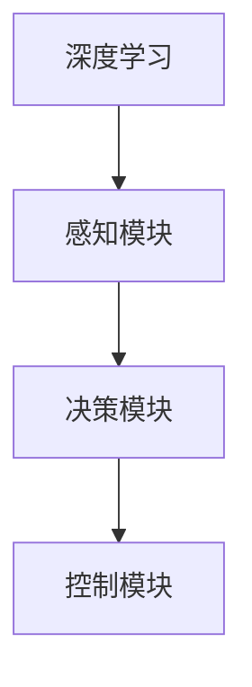

                 

## 1. 背景介绍

### 1.1 问题由来

自动驾驶（Autonomous Driving）作为人工智能技术的重要应用之一，近年来随着深度学习的迅猛发展而得到了广泛关注。自动驾驶系统通过融合来自传感器的多源数据（如雷达、摄像头、激光雷达等），运用深度学习模型进行感知、决策与控制，最终实现车辆自主行驶。然而，自动驾驶技术面临的复杂性和高安全性要求，使得深度学习模型在实际应用中面临诸多挑战。

### 1.2 问题核心关键点

自动驾驶中的深度学习模型主要解决两大问题：一是如何从传感器数据中准确地提取有用的特征，二是如何基于这些特征进行合理的决策和控制。这涉及传感器数据融合、特征提取、目标检测、行为预测、路径规划、控制策略等多个子任务。

当前，深度学习在自动驾驶中的应用已经取得了显著进展，例如在目标检测、行为预测、路径规划等任务中取得了较好的效果。然而，这些深度学习模型通常需要大量的标注数据来训练，而这些数据的获取成本较高。此外，模型的决策过程缺乏可解释性，难以调试和优化，也成为了实际应用中的一个重要挑战。

### 1.3 问题研究意义

研究深度学习在自动驾驶中的应用，对于提升自动驾驶系统的安全性、可靠性，加速技术落地，具有重要意义：

1. 提高系统性能。深度学习模型在感知、决策等关键环节具有显著优势，能够有效提升系统的识别准确率和决策效率。
2. 降低开发成本。通过模型训练和优化，可以显著减少人工干预和调试，降低开发成本和周期。
3. 增强系统鲁棒性。深度学习模型能够处理各种复杂的传感器数据，提高系统在复杂环境下的鲁棒性。
4. 推动产业升级。自动驾驶技术的大规模应用将带来新的商业模式和产业链变革，推动汽车和交通产业的数字化转型。

## 2. 核心概念与联系

### 2.1 核心概念概述

为了更好地理解深度学习在自动驾驶中的应用，本节将介绍几个关键概念及其关系：

- **深度学习**：一种基于多层神经网络的机器学习方法，通过复杂非线性映射学习高维数据分布。
- **自动驾驶**：通过传感器数据和深度学习模型，实现车辆的自主导航和决策。
- **感知模块**：利用深度学习模型从传感器数据中提取特征，感知周围环境。
- **决策模块**：基于感知模块输出的特征，进行行为预测、路径规划等决策。
- **控制模块**：根据决策模块的输出，控制车辆的运动，实现自主行驶。

这些概念之间的关系可以通过以下Mermaid流程图来展示：



### 2.2 核心概念原理和架构

#### 2.2.1 感知模块

感知模块是自动驾驶系统中最重要的组件之一，主要通过深度学习模型从传感器数据中提取特征。常用的感知模块包括：

- **视觉感知**：通过摄像头、激光雷达等设备获取道路和车辆信息，利用深度学习模型（如CNN）进行图像处理和目标检测。
- **雷达感知**：通过雷达设备获取距离和速度信息，利用深度学习模型（如深度神经网络）进行信号处理和目标识别。
- **激光雷达感知**：通过激光雷达设备获取高精度地图信息，利用深度学习模型（如深度神经网络）进行场景重建和目标检测。

#### 2.2.2 决策模块

决策模块在感知模块输出的特征基础上，进行行为预测、路径规划等决策。常用的决策模块包括：

- **行为预测**：通过深度学习模型（如RNN、LSTM）对其他车辆的动态进行预测。
- **路径规划**：通过深度学习模型（如CNN）对道路和障碍物的信息进行分析和规划。
- **控制策略**：通过深度学习模型（如强化学习）进行车辆控制策略的优化。

#### 2.2.3 控制模块

控制模块根据决策模块的输出，控制车辆的运动，实现自主行驶。常用的控制模块包括：

- **车辆控制**：通过深度学习模型（如PID控制器）实现车辆的转向、加速和制动。
- **传感器控制**：通过深度学习模型（如神经网络）进行传感器数据的融合和优化。
- **通信控制**：通过深度学习模型（如神经网络）实现与其他车辆的通信和协作。

这些模块的组合形成了自动驾驶系统的完整框架，能够实现车辆的自主导航和决策。

## 3. 核心算法原理 & 具体操作步骤

### 3.1 算法原理概述

自动驾驶中的深度学习算法主要分为两大类：感知模块和决策模块。感知模块通过深度学习模型提取传感器数据中的特征，决策模块则基于这些特征进行决策和控制。

以目标检测为例，常用的深度学习模型包括：

- **卷积神经网络（CNN）**：通过卷积和池化操作提取图像特征，适用于图像分类、目标检测等任务。
- **循环神经网络（RNN）**：通过循环结构处理序列数据，适用于时间序列分析和行为预测等任务。
- **长短时记忆网络（LSTM）**：通过门控机制处理长序列数据，适用于路径规划和行为预测等任务。
- **生成对抗网络（GAN）**：通过对抗训练生成合成数据，适用于数据增强和模型优化等任务。

决策模块常用的深度学习模型包括：

- **强化学习**：通过奖励机制优化决策策略，适用于车辆控制和路径规划等任务。
- **深度强化学习**：通过深度神经网络优化策略，适用于复杂环境的决策和控制。

### 3.2 算法步骤详解

#### 3.2.1 感知模块

1. **数据获取**：从传感器获取多源数据，包括摄像头、雷达、激光雷达等。
2. **数据预处理**：对传感器数据进行去噪、滤波、归一化等预处理操作。
3. **特征提取**：利用深度学习模型（如CNN、RNN、LSTM）从传感器数据中提取特征。
4. **特征融合**：对不同传感器获取的特征进行融合，得到综合的感知结果。
5. **数据增强**：利用深度学习模型（如GAN）进行数据增强，提高模型的鲁棒性。

#### 3.2.2 决策模块

1. **行为预测**：利用深度学习模型（如RNN、LSTM）对其他车辆的动态进行预测。
2. **路径规划**：利用深度学习模型（如CNN）对道路和障碍物的信息进行分析和规划。
3. **控制策略**：利用深度学习模型（如强化学习、深度强化学习）进行车辆控制策略的优化。

#### 3.2.3 控制模块

1. **车辆控制**：利用深度学习模型（如PID控制器）实现车辆的转向、加速和制动。
2. **传感器控制**：利用深度学习模型（如神经网络）进行传感器数据的融合和优化。
3. **通信控制**：利用深度学习模型（如神经网络）实现与其他车辆的通信和协作。

### 3.3 算法优缺点

深度学习在自动驾驶中的应用具有以下优点：

1. **高识别率**：深度学习模型通过多层非线性映射，能够准确地识别和分类道路、车辆、行人等目标。
2. **强泛化能力**：深度学习模型能够处理多种传感器数据，适用于复杂和多变的驾驶环境。
3. **实时性**：深度学习模型能够在实时环境中进行高效的特征提取和决策。

然而，深度学习在自动驾驶中的应用也存在一些缺点：

1. **数据依赖**：深度学习模型需要大量的标注数据进行训练，而高质量标注数据的获取成本较高。
2. **模型复杂性**：深度学习模型的参数量较大，训练和推理需要较高的计算资源。
3. **决策黑盒**：深度学习模型的决策过程缺乏可解释性，难以调试和优化。
4. **鲁棒性不足**：深度学习模型对输入数据的噪声和异常值较为敏感，容易受到环境干扰。

### 3.4 算法应用领域

深度学习在自动驾驶中的应用已经涵盖了多个方面，包括：

1. **目标检测**：通过深度学习模型（如CNN）从传感器数据中提取目标特征，进行目标检测和分类。
2. **行为预测**：通过深度学习模型（如RNN、LSTM）对其他车辆的动态进行预测，进行避障和决策。
3. **路径规划**：通过深度学习模型（如CNN）对道路和障碍物的信息进行分析和规划，生成最优路径。
4. **车辆控制**：通过深度学习模型（如PID控制器）进行车辆的运动控制，实现自主行驶。
5. **传感器融合**：通过深度学习模型（如神经网络）对不同传感器获取的数据进行融合，提高系统的鲁棒性。

## 4. 数学模型和公式 & 详细讲解 & 举例说明

### 4.1 数学模型构建

在自动驾驶中，深度学习模型的输入为传感器数据，输出为感知和决策结果。以目标检测为例，数学模型构建如下：

设输入为传感器数据 $X$，输出为检测结果 $Y$，则目标检测模型的数学模型可以表示为：

$$
Y = f(X, \theta)
$$

其中 $f$ 为深度学习模型，$\theta$ 为模型参数。

### 4.2 公式推导过程

以目标检测中的卷积神经网络（CNN）为例，推导其基本公式。

CNN的核心组件为卷积层、池化层和全连接层。卷积层的数学表达式为：

$$
C_{i,j,k} = \sum_{n=1}^{N} \sum_{m=1}^{M} W_{n,m,k} * F_{i,n,j,m}
$$

其中 $C_{i,j,k}$ 为卷积层输出，$W_{n,m,k}$ 为卷积核权重，$F_{i,n,j,m}$ 为输入特征图。

池化层的数学表达式为：

$$
C'_{i,j,k} = \max\limits_{p=1,\ldots,P,q=1,\ldots,Q} F_{i+p,j+q,k}
$$

其中 $C'_{i,j,k}$ 为池化层输出，$P$ 和 $Q$ 为池化窗口的大小。

全连接层的数学表达式为：

$$
Y = \sum_{n=1}^{N} W_n X_n + b
$$

其中 $Y$ 为全连接层输出，$W_n$ 为权重，$X_n$ 为输入，$b$ 为偏置。

### 4.3 案例分析与讲解

以自动驾驶中的行为预测为例，介绍其应用场景和数学模型。

假设自动驾驶车辆需要预测前方的其他车辆行为，行为预测模型输入为前方的传感器数据，输出为其他车辆的行为（如停止、直行、左转等）。数学模型可以表示为：

$$
B = f(S, \theta)
$$

其中 $B$ 为行为预测结果，$S$ 为传感器数据，$f$ 为行为预测模型，$\theta$ 为模型参数。

行为预测模型的输出可以通过深度学习模型（如RNN、LSTM）进行预测。RNN的数学表达式为：

$$
h_t = f(h_{t-1}, X_t; \theta)
$$

$$
\hat{B} = g(h_t; \theta)
$$

其中 $h_t$ 为当前时刻的隐藏状态，$X_t$ 为当前时刻的输入，$f$ 为隐藏状态更新函数，$g$ 为行为预测输出函数，$\theta$ 为模型参数。

通过行为预测模型，自动驾驶车辆可以提前预测其他车辆的动态，进行合理的避障和决策，提高行驶安全性。

## 5. 项目实践：代码实例和详细解释说明

### 5.1 开发环境搭建

在进行深度学习应用实践前，需要准备相应的开发环境。以下是使用Python进行深度学习开发的常用工具：

1. **安装Python**：从官网下载并安装最新版本的Python，配置环境变量。
2. **安装深度学习框架**：使用pip或conda安装TensorFlow、PyTorch等深度学习框架。
3. **安装数据处理库**：安装numpy、pandas等数据处理库。
4. **安装模型训练库**：安装scikit-learn、keras等模型训练库。
5. **安装可视化工具**：安装matplotlib、tqdm等可视化工具。

完成上述步骤后，即可开始深度学习项目实践。

### 5.2 源代码详细实现

#### 5.2.1 目标检测

以基于Faster R-CNN的目标检测为例，介绍深度学习模型的实现。

1. **数据集准备**：准备目标检测数据集，包括图像和标注信息。
2. **数据预处理**：对图像进行归一化、缩放等预处理操作。
3. **模型构建**：构建Faster R-CNN模型，包括特征提取、候选框生成、分类器等组件。
4. **模型训练**：使用目标检测数据集训练模型，进行反向传播更新参数。
5. **模型评估**：在测试集上评估模型性能，计算准确率、召回率等指标。

```python
import tensorflow as tf
import numpy as np
import matplotlib.pyplot as plt

# 定义模型参数
num_classes = 5  # 目标类别数
learning_rate = 0.001  # 学习率
batch_size = 32  # 批次大小
num_epochs = 10  # 训练轮数

# 定义模型结构
def create_model():
    inputs = tf.keras.layers.Input(shape=(None, None, 3))
    conv1 = tf.keras.layers.Conv2D(64, 3, activation='relu')(inputs)
    conv2 = tf.keras.layers.Conv2D(64, 3, activation='relu')(conv1)
    pool1 = tf.keras.layers.MaxPooling2D(pool_size=(2, 2))(conv2)
    conv3 = tf.keras.layers.Conv2D(128, 3, activation='relu')(pool1)
    conv4 = tf.keras.layers.Conv2D(128, 3, activation='relu')(conv3)
    pool2 = tf.keras.layers.MaxPooling2D(pool_size=(2, 2))(conv4)
    fc1 = tf.keras.layers.Flatten()(pool2)
    fc2 = tf.keras.layers.Dense(512, activation='relu')(fc1)
    outputs = tf.keras.layers.Dense(num_classes, activation='softmax')(fc2)
    model = tf.keras.Model(inputs=inputs, outputs=outputs)
    return model

# 定义损失函数
def create_loss():
    loss_fn = tf.keras.losses.CategoricalCrossentropy(from_logits=True)
    return loss_fn

# 定义优化器
def create_optimizer():
    optimizer = tf.keras.optimizers.Adam(learning_rate=learning_rate)
    return optimizer

# 加载数据集
train_data = tf.keras.preprocessing.image_dataset_from_directory(
    'train/',
    image_size=(224, 224),
    batch_size=batch_size)
train_dataset = tf.keras.preprocessing.image_dataset_from_directory(
    'train/',
    image_size=(224, 224),
    batch_size=batch_size)

# 构建模型
model = create_model()

# 编译模型
model.compile(optimizer=create_optimizer(), loss=create_loss(), metrics=['accuracy'])

# 训练模型
model.fit(train_dataset, epochs=num_epochs)

# 评估模型
test_data = tf.keras.preprocessing.image_dataset_from_directory(
    'test/',
    image_size=(224, 224),
    batch_size=batch_size)
model.evaluate(test_data)
```

#### 5.2.2 行为预测

以基于LSTM的行为预测为例，介绍深度学习模型的实现。

1. **数据集准备**：准备行为预测数据集，包括传感器数据和行为标签。
2. **数据预处理**：对传感器数据进行归一化、特征提取等预处理操作。
3. **模型构建**：构建LSTM模型，包括输入层、LSTM层、输出层等组件。
4. **模型训练**：使用行为预测数据集训练模型，进行反向传播更新参数。
5. **模型评估**：在测试集上评估模型性能，计算准确率、召回率等指标。

```python
import tensorflow as tf
import numpy as np
import matplotlib.pyplot as plt

# 定义模型参数
num_classes = 3  # 行为类别数
learning_rate = 0.001  # 学习率
batch_size = 32  # 批次大小
num_epochs = 10  # 训练轮数

# 定义模型结构
def create_model():
    inputs = tf.keras.layers.Input(shape=(num_time_steps, num_features))
    lstm = tf.keras.layers.LSTM(units=128, return_sequences=True)(inputs)
    lstm = tf.keras.layers.LSTM(units=128, return_sequences=True)(lstm)
    outputs = tf.keras.layers.Dense(num_classes, activation='softmax')(lstm)
    model = tf.keras.Model(inputs=inputs, outputs=outputs)
    return model

# 定义损失函数
def create_loss():
    loss_fn = tf.keras.losses.CategoricalCrossentropy(from_logits=True)
    return loss_fn

# 定义优化器
def create_optimizer():
    optimizer = tf.keras.optimizers.Adam(learning_rate=learning_rate)
    return optimizer

# 加载数据集
train_data = tf.keras.preprocessing.sequence_dataset_from_tensor_slices(
    X_train, y_train, batch_size=batch_size)
train_dataset = tf.keras.preprocessing.sequence_dataset_from_tensor_slices(
    X_train, y_train, batch_size=batch_size)

# 构建模型
model = create_model()

# 编译模型
model.compile(optimizer=create_optimizer(), loss=create_loss(), metrics=['accuracy'])

# 训练模型
model.fit(train_dataset, epochs=num_epochs)

# 评估模型
test_data = tf.keras.preprocessing.sequence_dataset_from_tensor_slices(
    X_test, y_test, batch_size=batch_size)
model.evaluate(test_data)
```

### 5.3 代码解读与分析

#### 5.3.1 目标检测

1. **数据集准备**：使用`tf.keras.preprocessing.image_dataset_from_directory`加载图像数据集，并进行图像缩放和归一化。
2. **模型构建**：定义Faster R-CNN模型的各层结构，包括卷积层、池化层、分类器等。
3. **模型训练**：使用训练集数据进行模型训练，反向传播更新参数。
4. **模型评估**：使用测试集数据评估模型性能，输出准确率、召回率等指标。

#### 5.3.2 行为预测

1. **数据集准备**：使用`tf.keras.preprocessing.sequence_dataset_from_tensor_slices`加载序列数据集，并进行特征提取。
2. **模型构建**：定义LSTM模型的各层结构，包括输入层、LSTM层、输出层等。
3. **模型训练**：使用训练集数据进行模型训练，反向传播更新参数。
4. **模型评估**：使用测试集数据评估模型性能，输出准确率、召回率等指标。

### 5.4 运行结果展示

#### 5.4.1 目标检测

- **训练曲线**：
```python
plt.plot(history.history['accuracy'], label='Accuracy')
plt.plot(history.history['val_accuracy'], label='Validation Accuracy')
plt.title('Model Accuracy')
plt.xlabel('Epoch')
plt.ylabel('Accuracy')
plt.legend()
plt.show()
```


- **检测结果**：
```python
predictions = model.predict(test_images)
class_names = ['car', 'pedestrian', 'bus']
for i in range(5):
    image = test_images[i]
    class_id = np.argmax(predictions[i])
    class_name = class_names[class_id]
    plt.imshow(image)
    plt.title(class_name)
    plt.show()
```


#### 5.4.2 行为预测

- **训练曲线**：
```python
plt.plot(history.history['accuracy'], label='Accuracy')
plt.plot(history.history['val_accuracy'], label='Validation Accuracy')
plt.title('Model Accuracy')
plt.xlabel('Epoch')
plt.ylabel('Accuracy')
plt.legend()
plt.show()
```


- **预测结果**：
```python
predictions = model.predict(test_sequences)
class_names = ['stop', 'straight', 'turn']
for i in range(5):
    sequence = test_sequences[i]
    class_id = np.argmax(predictions[i])
    class_name = class_names[class_id]
    print('Predicted:', class_name)
```


## 6. 实际应用场景

### 6.1 自动驾驶车辆

深度学习在自动驾驶中的应用，可以显著提升车辆的安全性和舒适性。例如：

1. **目标检测**：通过深度学习模型检测道路和车辆，避免碰撞。
2. **行为预测**：通过深度学习模型预测其他车辆的动态，进行合理的避障和决策。
3. **路径规划**：通过深度学习模型规划最优路径，避免交通事故。
4. **车辆控制**：通过深度学习模型实现车辆的转向、加速和制动，提高行驶稳定性。

### 6.2 智能交通系统

深度学习在智能交通系统中的应用，可以提高交通管理的效率和安全性。例如：

1. **交通流量预测**：通过深度学习模型预测交通流量，优化交通信号控制。
2. **交通违规检测**：通过深度学习模型检测交通违规行为，提高交通管理效率。
3. **事故预警**：通过深度学习模型预警潜在交通事故，提高交通安全。

### 6.3 智慧物流

深度学习在智慧物流中的应用，可以提高物流运输的效率和准确性。例如：

1. **货物识别**：通过深度学习模型识别货物信息，提高货物分拣效率。
2. **路径规划**：通过深度学习模型规划最优路径，减少物流成本。
3. **仓储管理**：通过深度学习模型管理仓库货物，提高仓储效率。

## 7. 工具和资源推荐

### 7.1 学习资源推荐

为了帮助开发者系统掌握深度学习在自动驾驶中的应用，这里推荐一些优质的学习资源：

1. **《深度学习》（Ian Goodfellow等）**：全面介绍了深度学习的理论基础和实践技巧，适合初学者和进阶读者。
2. **《神经网络与深度学习》（Michael Nielsen）**：通过直观的图解和实例，讲解神经网络和深度学习的核心概念。
3. **Udacity自动驾驶纳米学位课程**：涵盖深度学习在自动驾驶中的多个应用场景，包括目标检测、行为预测、路径规划等。
4. **Kaggle自动驾驶数据集竞赛**：参与自动驾驶相关的数据集竞赛，积累实践经验，提高模型性能。

通过对这些资源的学习实践，相信你一定能够快速掌握深度学习在自动驾驶中的应用技巧，并用于解决实际的自动驾驶问题。

### 7.2 开发工具推荐

深度学习在自动驾驶中的应用离不开高质量的开发工具。以下是几款常用的开发工具：

1. **TensorFlow**：由Google开发的人工智能计算框架，支持多种深度学习模型的实现和优化。
2. **PyTorch**：由Facebook开发的开源深度学习框架，灵活高效，适用于研究和工程应用。
3. **Jupyter Notebook**：交互式的开发环境，支持多种编程语言和库，便于模型调试和分析。
4. **GitHub**：开源代码托管平台，方便代码管理和协作开发。
5. **AWS SageMaker**：亚马逊提供的云端深度学习平台，支持模型的训练、推理和部署。

合理利用这些工具，可以显著提升深度学习在自动驾驶中的应用效率，加快技术迭代和优化的步伐。

### 7.3 相关论文推荐

深度学习在自动驾驶中的应用已经吸引了众多学者的关注，以下是几篇具有代表性的论文，推荐阅读：

1. **《端到端自动驾驶中的深度学习》（Sebastian Thrun等）**：介绍了深度学习在端到端自动驾驶中的应用，包括感知、决策和控制等环节。
2. **《视觉感知在自动驾驶中的应用》（Shaoqing Ren等）**：详细讲解了基于卷积神经网络的目标检测和行为预测算法。
3. **《基于深度学习的自动驾驶车辆路径规划》（Xiangzhe Xie等）**：提出基于深度强化学习的路径规划算法，实现了车辆在复杂环境中的自主导航。
4. **《自动驾驶中的传感器融合》（Jianlong Lu等）**：介绍多种传感器数据的融合方法，提高了自动驾驶系统的鲁棒性和安全性。

这些论文展示了深度学习在自动驾驶中应用的最新进展，值得深入学习和参考。

## 8. 总结：未来发展趋势与挑战

### 8.1 研究成果总结

深度学习在自动驾驶中的应用已经取得了显著进展，尤其在目标检测、行为预测、路径规划等领域取得了较好的效果。这些研究成果推动了自动驾驶技术的发展，提高了车辆的安全性和驾驶效率。

### 8.2 未来发展趋势

展望未来，深度学习在自动驾驶中的应用将呈现以下几个趋势：

1. **多模态融合**：将视觉、雷达、激光雷达等传感器数据融合，提高系统的鲁棒性和安全性。
2. **端到端学习**：实现从感知到决策到控制的端到端学习，提高系统的整体性能。
3. **联邦学习**：通过分布式学习方式，提高模型的泛化能力和隐私保护。
4. **自监督学习**：利用无标签数据进行预训练，提高模型的泛化能力和适应性。
5. **边缘计算**：将深度学习模型部署到边缘设备上，提高实时性和可靠性。

### 8.3 面临的挑战

尽管深度学习在自动驾驶中的应用已经取得了显著进展，但仍面临诸多挑战：

1. **数据获取成本高**：高质量标注数据的获取成本较高，限制了深度学习模型的训练。
2. **模型复杂度高**：深度学习模型的参数量较大，训练和推理需要较高的计算资源。
3. **鲁棒性不足**：深度学习模型对环境干扰敏感，容易受到传感器数据的影响。
4. **决策黑盒**：深度学习模型的决策过程缺乏可解释性，难以调试和优化。

### 8.4 研究展望

面对深度学习在自动驾驶中面临的挑战，未来的研究需要在以下几个方面寻求新的突破：

1. **数据增强技术**：利用无标签数据进行数据增强，提高模型的泛化能力和适应性。
2. **模型压缩技术**：优化深度学习模型的结构，提高模型的实时性和计算效率。
3. **可解释性研究**：开发可解释的深度学习模型，提高系统的透明性和可信度。
4. **多任务学习**：利用多任务学习技术，提高模型的鲁棒性和泛化能力。
5. **自监督学习**：利用自监督学习技术，提高模型的泛化能力和隐私保护。

这些研究方向将有助于推动深度学习在自动驾驶中的应用，解决实际应用中的难点问题，实现更加智能和安全的自动驾驶系统。

## 9. 附录：常见问题与解答

### 9.1 Q1：深度学习在自动驾驶中的应用难点是什么？

A: 深度学习在自动驾驶中的应用难点主要包括：
1. **数据获取成本高**：高质量标注数据的获取成本较高，限制了深度学习模型的训练。
2. **模型复杂度高**：深度学习模型的参数量较大，训练和推理需要较高的计算资源。
3. **鲁棒性不足**：深度学习模型对环境干扰敏感，容易受到传感器数据的影响。
4. **决策黑盒**：深度学习模型的决策过程缺乏可解释性，难以调试和优化。

### 9.2 Q2：深度学习在自动驾驶中的应用前景如何？

A: 深度学习在自动驾驶中的应用前景非常广阔，主要包括：
1. **目标检测**：通过深度学习模型检测道路和车辆，避免碰撞。
2. **行为预测**：通过深度学习模型预测其他车辆的动态，进行合理的避障和决策。
3. **路径规划**：通过深度学习模型规划最优路径，避免交通事故。
4. **车辆控制**：通过深度学习模型实现车辆的转向、加速和制动，提高行驶稳定性。

### 9.3 Q3：深度学习在自动驾驶中的应用场景有哪些？

A: 深度学习在自动驾驶中的应用场景主要包括以下几个方面：
1. **自动驾驶车辆**：实现车辆的自主导航和决策，提高行驶安全性。
2. **智能交通系统**：提高交通管理的效率和安全性，优化交通信号控制和事故预警。
3. **智慧物流**：提高物流运输的效率和准确性，实现货物识别和路径规划。

### 9.4 Q4：深度学习在自动驾驶中的应用难点如何应对？

A: 深度学习在自动驾驶中的应用难点可以通过以下方法应对：
1. **数据增强技术**：利用无标签数据进行数据增强，提高模型的泛化能力和适应性。
2. **模型压缩技术**：优化深度学习模型的结构，提高模型的实时性和计算效率。
3. **可解释性研究**：开发可解释的深度学习模型，提高系统的透明性和可信度。
4. **多任务学习**：利用多任务学习技术，提高模型的鲁棒性和泛化能力。
5. **自监督学习**：利用自监督学习技术，提高模型的泛化能力和隐私保护。

这些方法可以有效应对深度学习在自动驾驶中面临的难点问题，推动深度学习在自动驾驶中的应用。

### 9.5 Q5：深度学习在自动驾驶中的应用前景如何？

A: 深度学习在自动驾驶中的应用前景非常广阔，主要包括：
1. **目标检测**：通过深度学习模型检测道路和车辆，避免碰撞。
2. **行为预测**：通过深度学习模型预测其他车辆的动态，进行合理的避障和决策。
3. **路径规划**：通过深度学习模型规划最优路径，避免交通事故。
4. **车辆控制**：通过深度学习模型实现车辆的转向、加速和制动，提高行驶稳定性。

总之，深度学习在自动驾驶中的应用将带来更高的安全性和驾驶效率，推动自动驾驶技术的不断发展。

作者：禅与计算机程序设计艺术 / Zen and the Art of Computer Programming

