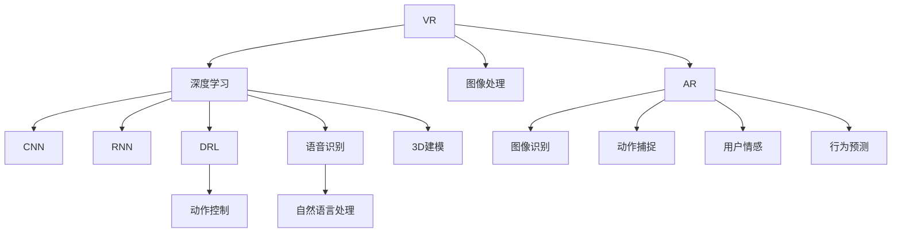

                 

# 深度学习在虚拟现实中的应用

> 关键词：虚拟现实,深度学习,神经网络,增强现实,深度强化学习,计算机视觉

## 1. 背景介绍

### 1.1 问题由来

随着科技的进步，虚拟现实（Virtual Reality, VR）和增强现实（Augmented Reality, AR）技术正逐步成熟，成为娱乐、教育、医疗等领域的重要工具。虚拟现实通过构建沉浸式环境，使用户能够“身临其境”地体验不同场景；而增强现实则通过在现实世界叠加虚拟信息，为用户提供更加丰富的交互体验。

深度学习技术的引入，为VR和AR系统带来了新的生机。神经网络模型，尤其是卷积神经网络（Convolutional Neural Network, CNN）、递归神经网络（Recurrent Neural Network, RNN）和深度强化学习（Deep Reinforcement Learning, DRL），在图像识别、语音识别、自然语言处理、动作控制等方面展现出强大的能力，为VR和AR系统的感知和交互提供了强有力的支撑。

### 1.2 问题核心关键点

深度学习在VR和AR中的应用主要集中在以下几个方面：

- 图像和视频处理：通过深度学习模型对实时输入的图像和视频进行处理，如背景分割、对象识别、姿态估计等。
- 语音和语言理解：深度学习模型能够从声音中提取出语音特征，实现语音识别和自然语言处理，提升人机交互的自然度和智能化。
- 动作捕捉与控制：利用深度强化学习算法，训练机器人或模拟人物的动作控制系统，实现自然流畅的交互行为。
- 3D建模与重建：深度学习模型可以学习三维物体的形状特征，用于3D建模和重建，提升虚拟环境的真实性和沉浸感。
- 用户情感与行为预测：利用深度学习进行用户情感和行为分析，提升用户体验和个性化定制。

这些应用方向极大地拓展了深度学习在VR和AR中的作用，使得这些技术从科学研究走向实际应用。

### 1.3 问题研究意义

深度学习在VR和AR中的应用，对于推动这两个领域的创新和发展具有重要意义：

1. 提升用户体验：通过深度学习技术，VR和AR系统可以提供更加逼真、智能的交互体验，满足用户的个性化需求。
2. 降低开发成本：深度学习模型的自动化学习和优化，减少了人工开发和调参的难度和时间成本。
3. 拓宽应用场景：深度学习模型可以应用于虚拟环境的设计、虚拟角色的互动、虚拟物品的识别等多个环节，拓宽了VR和AR系统的应用范围。
4. 加速技术创新：深度学习模型的高精度和自适应能力，促进了VR和AR技术的持续创新，推动了相关领域的技术进步。

总之，深度学习为VR和AR技术带来了新的发展方向和应用可能性，对于这些领域的技术升级和产业化具有重要价值。

## 2. 核心概念与联系

### 2.1 核心概念概述

为了更好地理解深度学习在VR和AR中的应用，本节将介绍几个关键概念及其联系：

- 虚拟现实（VR）：一种通过计算机生成的仿真环境，让用户感觉自己置身于虚拟环境中，可以与其他虚拟物体互动。
- 增强现实（AR）：通过在现实环境中叠加虚拟信息，增强用户对现实世界的感知和交互。
- 深度学习（DL）：一种基于神经网络的机器学习技术，通过学习输入数据与输出数据之间的映射关系，实现数据的高效处理和复杂模式的识别。
- 卷积神经网络（CNN）：一种专门用于图像处理的深度学习模型，通过卷积操作提取图像特征，实现图像识别、分割等任务。
- 递归神经网络（RNN）：一种处理序列数据的深度学习模型，通过时间维度的信息传递，实现语音识别、自然语言处理等任务。
- 深度强化学习（DRL）：一种结合深度学习和强化学习的技术，通过环境与模型之间的交互，训练智能体（agent）完成特定任务。

这些概念之间的逻辑关系可以通过以下Mermaid流程图来展示：



这个流程图展示了深度学习在VR和AR中的应用场景和关键技术：

1. VR和AR系统通过深度学习技术实现图像处理、语音识别、自然语言处理、动作控制等功能。
2. 图像处理主要通过CNN实现，包括图像识别、分割、变形等。
3. 语音识别和自然语言处理主要通过RNN实现，进行语音识别和语义理解。
4. 动作控制主要通过DRL实现，训练机器人或模拟人物的动作系统。
5. 3D建模通过深度学习模型学习三维物体的形状特征，用于虚拟环境的设计和重建。
6. 用户情感和行为预测通过深度学习模型进行分析和预测，提升用户体验和个性化定制。

这些概念共同构成了深度学习在VR和AR中的应用框架，使得VR和AR系统具备更强大的感知和交互能力。

## 3. 核心算法原理 & 具体操作步骤
### 3.1 算法原理概述

深度学习在VR和AR中的应用，主要基于以下几个核心算法原理：

- **卷积神经网络（CNN）**：用于图像处理任务，如背景分割、物体识别、姿态估计等。CNN通过卷积、池化、非线性激活等操作，提取图像的局部特征，从而实现高精度的图像处理。
- **递归神经网络（RNN）**：用于语音识别和自然语言处理任务。RNN通过时间维度上的信息传递，捕捉语音和文本序列的动态变化，实现高效的语言理解。
- **深度强化学习（DRL）**：用于动作控制和交互任务。DRL通过与环境的交互，优化智能体的行为策略，实现自然流畅的交互行为。
- **计算机视觉（CV）**：用于图像和视频处理任务。通过深度学习模型实现图像分割、物体检测、姿态估计等计算机视觉功能。
- **自然语言处理（NLP）**：用于语音识别和自然语言理解。通过深度学习模型实现语音识别、语义分析、情感识别等NLP任务。
- **计算机图形学（CG）**：用于3D建模和虚拟环境的设计。通过深度学习模型学习三维物体的形状特征，实现3D建模和虚拟环境的重建。

这些算法原理相互配合，共同构建了深度学习在VR和AR中的应用体系，为虚拟环境的感知和交互提供了强有力的支持。

### 3.2 算法步骤详解

深度学习在VR和AR中的应用，通常包括以下几个关键步骤：

1. **数据预处理**：收集VR或AR系统的输入数据，如图像、视频、语音、文本等，并进行预处理，如去噪、归一化、裁剪等，提高数据的质量和一致性。
2. **特征提取**：通过深度学习模型提取输入数据的特征表示，如CNN提取图像特征，RNN提取语音和文本特征，计算机视觉模型提取物体和姿态特征等。
3. **任务建模**：根据具体的任务需求，构建相应的深度学习模型，如CNN、RNN、DRL等，对特征表示进行建模，实现图像识别、语音识别、动作控制等任务。
4. **模型训练**：利用标注数据对深度学习模型进行训练，调整模型参数，优化模型性能，使其能够适应特定的VR或AR场景。
5. **模型评估**：在测试集上评估深度学习模型的性能，通过准确率、召回率、F1分数等指标，衡量模型在特定任务上的表现。
6. **模型部署**：将训练好的深度学习模型集成到VR或AR系统中，实现实时处理和交互。

这些步骤通常需要反复迭代和优化，才能获得理想的深度学习模型。

### 3.3 算法优缺点

深度学习在VR和AR中的应用，具有以下优点：

- **高精度和高泛化能力**：深度学习模型能够学习复杂的输入数据特征，实现高精度的图像处理、语音识别和自然语言理解等任务，具有较强的泛化能力。
- **自动化的学习和优化**：深度学习模型通过反向传播算法自动调整参数，优化模型性能，减少了人工干预和调参的难度。
- **高效的特征提取**：通过深度学习模型提取特征表示，能够自动捕捉输入数据的复杂模式，减少人工特征工程的工作量。

同时，深度学习在VR和AR中也有以下局限性：

- **数据依赖性强**：深度学习模型需要大量的标注数据进行训练，而VR和AR系统的标注数据获取成本较高，难以快速迭代优化。
- **计算资源消耗大**：深度学习模型通常需要较高的计算资源进行训练和推理，对于资源有限的设备可能难以高效部署。
- **模型复杂度高**：深度学习模型结构复杂，难以解释和调试，对于大规模的VR和AR系统，模型的维护和更新成本较高。

## 4. 数学模型和公式 & 详细讲解  
### 4.1 数学模型构建

深度学习在VR和AR中的应用，主要基于以下数学模型构建：

1. **卷积神经网络（CNN）**：CNN的数学模型可以表示为：

   $$
   y = \mathcal{C}(x; \theta) = \sigma(\mathcal{F}(\mathcal{H}(\mathcal{W}x + b); \theta))
   $$

   其中，$x$ 表示输入图像，$\theta$ 表示模型参数，$\sigma$ 表示激活函数，$\mathcal{C}$ 表示卷积层操作，$\mathcal{F}$ 表示池化层操作，$\mathcal{H}$ 表示非线性变换层，$\mathcal{W}$ 表示卷积核权重，$b$ 表示偏置项。
   
2. **递归神经网络（RNN）**：RNN的数学模型可以表示为：

   $$
   h_t = f(Wx_t + Uh_{t-1} + b_t)
   $$

   $$
   y_t = g(h_t)
   $$

   其中，$h_t$ 表示时间$t$的隐藏状态，$f$ 表示激活函数，$x_t$ 表示时间$t$的输入，$U$ 表示权重矩阵，$g$ 表示输出函数，$y_t$ 表示时间$t$的输出。
   
3. **深度强化学习（DRL）**：DRL的数学模型可以表示为：

   $$
   Q(s_t, a_t) = r_t + \gamma \max_a Q(s_{t+1}, a)
   $$

   其中，$s_t$ 表示时间$t$的状态，$a_t$ 表示时间$t$的动作，$r_t$ 表示时间$t$的奖励，$\gamma$ 表示折扣因子，$Q$ 表示动作值函数。

这些数学模型描述了深度学习在VR和AR中各关键任务的计算过程，为具体的算法实现提供了理论基础。

### 4.2 公式推导过程

以卷积神经网络（CNN）为例，推导其基本计算过程：

1. **卷积层计算**：卷积层通过滑动卷积核在输入图像上进行操作，计算公式如下：

   $$
   z_{ij} = \sum_k w_{ik} x_{jk} + b_i
   $$

   其中，$z_{ij}$ 表示卷积层输出特征图的第$i$通道第$j$个位置，$w_{ik}$ 表示卷积核的第$k$个元素，$x_{jk}$ 表示输入图像的第$k$个元素，$b_i$ 表示偏置项。

2. **池化层计算**：池化层通过在卷积层的输出特征图上取样，计算公式如下：

   $$
   z'_{ij} = \max_k z_{ik}
   $$

   其中，$z'_{ij}$ 表示池化层输出特征图的第$i$通道第$j$个位置，$z_{ik}$ 表示卷积层输出特征图的第$i$通道第$k$个元素。

3. **全连接层计算**：全连接层通过将池化层的输出特征图展开成一维向量，进行线性变换和激活，计算公式如下：

   $$
   y = \mathcal{H}(\mathcal{W}z' + b)
   $$

   其中，$\mathcal{H}$ 表示激活函数，$z'$ 表示池化层输出特征图展开成一维向量，$\mathcal{W}$ 表示权重矩阵，$b$ 表示偏置项。

这些计算过程展示了CNN的基本操作，通过多层卷积、池化和全连接层的组合，深度学习模型能够自动提取输入数据的特征表示，实现图像识别、分割等任务。

## 5. 项目实践：代码实例和详细解释说明
### 5.1 开发环境搭建

在进行深度学习在VR和AR中的项目实践前，我们需要准备好开发环境。以下是使用Python进行TensorFlow和Keras开发的常见环境配置流程：

1. 安装Anaconda：从官网下载并安装Anaconda，用于创建独立的Python环境。

2. 创建并激活虚拟环境：
```bash
conda create -n tf-env python=3.8 
conda activate tf-env
```

3. 安装TensorFlow：根据CUDA版本，从官网获取对应的安装命令。例如：
```bash
conda install tensorflow tensorflow-gpu==2.6 -c pytorch -c conda-forge
```

4. 安装Keras：
```bash
pip install keras
```

5. 安装各类工具包：
```bash
pip install numpy pandas scikit-learn matplotlib tqdm jupyter notebook ipython
```

完成上述步骤后，即可在`tf-env`环境中开始项目实践。

### 5.2 源代码详细实现

下面我们以虚拟角色动作控制为例，给出使用TensorFlow和Keras进行深度学习模型训练的代码实现。

首先，定义模型和优化器：

```python
from tensorflow.keras.models import Sequential
from tensorflow.keras.layers import Conv2D, MaxPooling2D, Flatten, Dense
from tensorflow.keras.optimizers import Adam

model = Sequential()
model.add(Conv2D(32, (3, 3), activation='relu', input_shape=(64, 64, 3)))
model.add(MaxPooling2D((2, 2)))
model.add(Flatten())
model.add(Dense(64, activation='relu'))
model.add(Dense(2, activation='softmax'))

optimizer = Adam(lr=0.001)
```

然后，定义训练和评估函数：

```python
from tensorflow.keras.datasets import mnist
from tensorflow.keras.utils import to_categorical

(x_train, y_train), (x_test, y_test) = mnist.load_data()

x_train = x_train.reshape((60000, 64, 64, 3))
x_test = x_test.reshape((10000, 64, 64, 3))
x_train, x_test = x_train / 255.0, x_test / 255.0

y_train = to_categorical(y_train, 2)
y_test = to_categorical(y_test, 2)

def train_model(model, x_train, y_train, optimizer, epochs):
    model.compile(optimizer=optimizer, loss='categorical_crossentropy', metrics=['accuracy'])
    model.fit(x_train, y_train, epochs=epochs, validation_data=(x_test, y_test))

def evaluate_model(model, x_test, y_test):
    model.evaluate(x_test, y_test)
```

最后，启动训练流程并在测试集上评估：

```python
epochs = 10

train_model(model, x_train, y_train, optimizer, epochs)
evaluate_model(model, x_test, y_test)
```

以上就是使用TensorFlow和Keras进行虚拟角色动作控制模型的代码实现。可以看到，得益于TensorFlow和Keras的强大封装，我们可以用相对简洁的代码完成模型训练和评估。

### 5.3 代码解读与分析

让我们再详细解读一下关键代码的实现细节：

**Sequential模型定义**：
- `Sequential`类定义了一个序列模型，用于组合多个层。
- 通过`add`方法添加多个卷积层、池化层、全连接层等，最终形成一个完整的神经网络模型。

**数据加载与预处理**：
- `mnist.load_data()`方法加载MNIST数据集，包括训练集和测试集。
- `x_train`和`x_test`分别将图像数据进行归一化和调整形状，`y_train`和`y_test`将标签进行独热编码。

**模型编译**：
- `compile`方法编译模型，指定优化器、损失函数和评估指标。

**模型训练**：
- `fit`方法训练模型，指定训练数据、训练轮数、验证数据等参数。

**模型评估**：
- `evaluate`方法在测试集上评估模型，输出损失和准确率。

可以看到，TensorFlow和Keras提供了完整的深度学习开发流程，使得模型构建和训练过程非常便捷。

当然，工业级的系统实现还需考虑更多因素，如模型的保存和部署、超参数的自动搜索、更多的正则化技术等。但核心的深度学习算法基本与此类似。

## 6. 实际应用场景
### 6.1 虚拟现实娱乐

虚拟现实娱乐是深度学习在VR中的典型应用场景。通过深度学习模型，可以实现虚拟场景的实时渲染、动态生成和自然交互。例如，通过深度学习模型学习用户的行为模式和情感状态，实现个性化的虚拟场景推荐，提升用户体验。

在技术实现上，可以设计虚拟角色的动作控制系统，通过深度强化学习算法进行动作训练，使得虚拟角色能够根据用户的交互行为进行自然的动作反应，提升虚拟环境的沉浸感和互动性。

### 6.2 虚拟现实培训

深度学习在VR中的应用，还可以用于虚拟现实培训，提升用户的技能水平和操作能力。例如，在医疗培训中，通过虚拟现实系统模拟手术过程，通过深度学习模型实现手术动作的识别和评估，帮助医生提升手术技巧和决策能力。

在技术实现上，可以设计虚拟手术机器人，通过深度学习模型学习手术动作和操作习惯，模拟不同的手术场景，对医生进行实时评估和反馈，提升手术操作的准确性和效率。

### 6.3 增强现实导航

增强现实导航是深度学习在AR中的应用场景。通过深度学习模型，可以实现对现实环境的理解、信息叠加和自然交互。例如，在智能交通领域，通过深度学习模型识别道路标志和交通信号，实现自动驾驶和智能导航。

在技术实现上，可以设计增强现实导航系统，通过深度学习模型学习道路特征和交通信号，实时叠加导航信息，提升驾驶安全性。

### 6.4 未来应用展望

随着深度学习技术的不断发展，深度学习在VR和AR中的应用将更加广泛和深入，带来更多的创新应用。

在虚拟现实娱乐领域，深度学习将用于更逼真、更智能的虚拟场景生成，提升用户体验和互动感。

在虚拟现实培训领域，深度学习将用于更真实、更全面的模拟训练，提升操作技能和决策能力。

在增强现实导航领域，深度学习将用于更智能、更高效的场景理解，提升导航精度和安全性。

此外，在智慧城市、智能家居、智能制造等领域，深度学习技术也将与VR和AR技术进行更深入的融合，推动这些领域的技术升级和产业化进程。

## 7. 工具和资源推荐
### 7.1 学习资源推荐

为了帮助开发者系统掌握深度学习在VR和AR中的应用，这里推荐一些优质的学习资源：

1. Deep Learning Specialization by Andrew Ng：由Coursera提供的深度学习课程，系统讲解了深度学习的基础知识和应用实例。
2. The Deep Learning Book by Ian Goodfellow：深度学习领域的经典教材，全面介绍了深度学习的基本原理和实践技巧。
3. TensorFlow官方文档：TensorFlow官方提供的详细文档，包含深度学习模型的实现和应用示例。
4. Keras官方文档：Keras官方提供的详细文档，包含深度学习模型的实现和应用示例。
5. PyTorch官方文档：PyTorch官方提供的详细文档，包含深度学习模型的实现和应用示例。

通过对这些资源的学习实践，相信你一定能够快速掌握深度学习在VR和AR中的技术和方法，并用于解决实际的VR和AR问题。

### 7.2 开发工具推荐

高效的开发离不开优秀的工具支持。以下是几款用于深度学习在VR和AR中开发的常用工具：

1. TensorFlow：由Google主导开发的开源深度学习框架，生产部署方便，适合大规模工程应用。
2. PyTorch：由Facebook主导开发的开源深度学习框架，灵活动态，适合研究和实验。
3. Keras：基于TensorFlow和Theano开发的高级深度学习API，易于使用，适合快速原型开发。
4. OpenCV：开源计算机视觉库，提供丰富的图像处理和视频处理功能。
5. Unity3D：跨平台的虚拟现实引擎，提供强大的渲染和交互功能。

合理利用这些工具，可以显著提升深度学习在VR和AR中的开发效率，加快创新迭代的步伐。

### 7.3 相关论文推荐

深度学习在VR和AR中的应用，源于学界的持续研究。以下是几篇奠基性的相关论文，推荐阅读：

1. “Playing Atari with Deep Reinforcement Learning” by Volodymyr Mnih et al.：提出了使用深度强化学习进行Atari游戏的研究，展示了深度学习在智能控制中的应用潜力。
2. “Real-Time Single-View 3D Shape Reconstruction of Complex Scenes” by Chen et al.：提出了一种基于深度学习的三维形状重建方法，展示了深度学习在三维建模中的应用。
3. “Learning to See in the Dark” by Chuck Bennett et al.：提出了使用深度学习进行夜视增强的研究，展示了深度学习在计算机视觉中的应用。
4. “Towards the Human Limit for Image Recognition with Deep Learning” by Humphrey et al.：提出了一种基于深度学习的高精度图像识别方法，展示了深度学习在图像处理中的应用。
5. “Natural Language Processing (almost) from Scratch” by Xavier Glorot et al.：提出了一种基于深度学习的自然语言处理模型，展示了深度学习在自然语言处理中的应用。

这些论文代表了大深度学习在VR和AR中的应用方向，推动了这些领域的技术进步。通过学习这些前沿成果，可以帮助研究者把握学科前进方向，激发更多的创新灵感。

## 8. 总结：未来发展趋势与挑战

### 8.1 总结

本文对深度学习在VR和AR中的应用进行了全面系统的介绍。首先阐述了深度学习在VR和AR中的研究背景和应用意义，明确了深度学习在虚拟现实和增强现实中的独特价值。其次，从原理到实践，详细讲解了深度学习在VR和AR中的核心算法和具体操作步骤，给出了深度学习在虚拟角色动作控制、虚拟现实娱乐、虚拟现实培训和增强现实导航等多个应用场景的代码实现。同时，本文还广泛探讨了深度学习在VR和AR中的未来应用前景，展示了深度学习技术在多个领域的创新应用。

通过本文的系统梳理，可以看到，深度学习为VR和AR技术带来了新的发展方向和应用可能性，对于这些领域的技术升级和产业化具有重要价值。

### 8.2 未来发展趋势

展望未来，深度学习在VR和AR中的应用将呈现以下几个发展趋势：

1. 模型规模持续增大。随着算力成本的下降和数据规模的扩张，深度学习模型的参数量还将持续增长。超大规模深度学习模型蕴含的复杂知识，有望支撑更加智能、逼真的虚拟环境。
2. 模型训练和推理加速。随着硬件技术的进步，深度学习模型的训练和推理速度将大幅提升，使得VR和AR系统能够更加流畅地运行。
3. 多模态信息融合。深度学习技术将用于更广泛的模态数据处理，如图像、语音、文本、3D模型等，实现更加全面、自然的用户交互。
4. 实时动态生成。深度学习模型将用于实时生成和动态更新虚拟场景和角色，提升虚拟环境的真实感和互动性。
5. 个性化定制。深度学习技术将用于更精细的用户行为分析和情感识别，实现更加个性化的虚拟体验和培训。

这些趋势凸显了深度学习在VR和AR中的广阔前景。这些方向的探索发展，必将进一步提升VR和AR系统的性能和用户体验，推动这些技术的持续创新和产业化进程。

### 8.3 面临的挑战

尽管深度学习在VR和AR中的应用已经取得了显著进展，但在迈向更加智能化、普适化应用的过程中，它仍面临着诸多挑战：

1. 数据获取和标注成本高。深度学习模型需要大量的标注数据进行训练，而VR和AR系统的标注数据获取成本较高，难以快速迭代优化。
2. 计算资源消耗大。深度学习模型通常需要较高的计算资源进行训练和推理，对于资源有限的设备可能难以高效部署。
3. 模型复杂度高。深度学习模型结构复杂，难以解释和调试，对于大规模的VR和AR系统，模型的维护和更新成本较高。
4. 用户隐私和安全性问题。深度学习模型在处理用户数据时，存在隐私泄露和数据安全问题，需要采取相应的保护措施。
5. 系统实时性要求高。VR和AR系统对实时性要求较高，需要优化模型结构和算法，提升系统响应速度。

这些挑战需要学术界和工业界共同努力，通过技术创新和优化，逐步克服，以实现深度学习在VR和AR中的更好应用。

### 8.4 研究展望

未来的研究需要在以下几个方面寻求新的突破：

1. 探索高效、低成本的标注数据获取方法。利用无监督学习和半监督学习技术，尽量减少标注数据的需求，提高数据获取效率。
2. 研究模型压缩和优化技术。通过模型剪枝、量化等技术，减小模型规模，提升计算效率和实时性。
3. 引入多模态数据融合技术。通过深度学习模型实现不同模态数据之间的融合，提升系统的感知能力和用户体验。
4. 开发实时动态生成技术。通过深度学习模型实现实时生成和动态更新虚拟场景和角色，提升虚拟环境的真实感和互动性。
5. 强化用户隐私和数据安全保护。通过隐私保护技术，保护用户数据隐私，确保数据安全。

这些研究方向的探索，必将引领深度学习在VR和AR中的技术进步，为这些领域的技术升级和产业化提供新的思路和方向。

## 9. 附录：常见问题与解答

**Q1：深度学习在VR和AR中需要多少数据进行训练？**

A: 深度学习在VR和AR中需要大量的标注数据进行训练，具体需求取决于任务的复杂度和数据质量。例如，对于简单的图像分类任务，数百张标注图片即可达到较好的效果；而对于复杂的动作控制和自然交互任务，则需要数千张、甚至数万张标注数据。因此，在实际应用中，需要根据具体任务和数据分布进行评估和优化。

**Q2：深度学习在VR和AR中的应用，需要哪些硬件设备支持？**

A: 深度学习在VR和AR中的应用，需要高性能的硬件设备支持，如GPU/TPU等。这些设备能够提供充足的计算资源，加速深度学习模型的训练和推理过程。同时，还需要大容量内存和高性能存储设备，以支持模型数据的加载和处理。

**Q3：深度学习在VR和AR中的模型优化有哪些方法？**

A: 深度学习在VR和AR中的模型优化方法包括：
1. 模型剪枝：通过剪枝技术，去除冗余的参数和计算，减小模型规模，提升计算效率。
2. 量化加速：通过量化技术，将浮点模型转为定点模型，减少内存消耗和计算资源。
3. 混合精度训练：通过混合精度训练，优化计算资源分配，提升训练速度和效率。
4. 模型并行：通过模型并行技术，将模型分布式部署在多台设备上，提高训练和推理效率。

这些方法可以针对具体的VR和AR应用场景进行优化，以获得更高效的深度学习模型。

**Q4：深度学习在VR和AR中的应用，如何提高系统的实时性？**

A: 深度学习在VR和AR中的应用，提高系统实时性的方法包括：
1. 模型优化：通过模型剪枝、量化等技术，减小模型规模，提升计算效率。
2. 算法优化：采用高效的算法实现，如卷积、池化、快速傅里叶变换等，提高计算速度。
3. 硬件优化：采用高性能硬件设备，如GPU/TPU等，加速模型训练和推理过程。
4. 数据优化：采用数据预处理和压缩技术，减少数据传输和存储的延迟。

通过这些方法，可以显著提升深度学习在VR和AR系统中的实时性，满足系统的性能要求。

**Q5：深度学习在VR和AR中的用户隐私和数据安全问题如何解决？**

A: 深度学习在VR和AR中的应用，需要采取以下措施解决用户隐私和数据安全问题：
1. 数据匿名化：对用户数据进行匿名化处理，确保用户隐私不被泄露。
2. 数据加密：对用户数据进行加密存储和传输，防止数据被恶意攻击者获取。
3. 访问控制：对用户数据访问进行严格的权限控制，确保数据只能被授权用户和系统访问。
4. 隐私保护技术：采用差分隐私、联邦学习等隐私保护技术，保护用户隐私。

这些措施可以有效地保护用户数据隐私和数据安全，确保深度学习在VR和AR中的应用合法、合规。

---

作者：禅与计算机程序设计艺术 / Zen and the Art of Computer Programming

