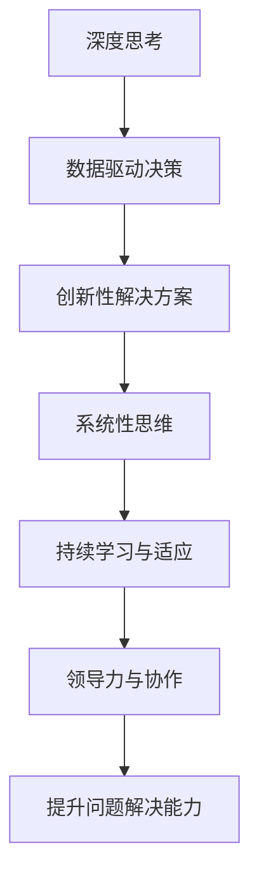

                 

# 深度思考与管理问题解决能力的提升

## 1. 背景介绍

在当今这个快速变化且复杂多变的世界里，深度思考（Deep Thinking）与管理问题解决能力（Problem-Solving Capability）的提升成为了组织和个人成功的关键。无论是在企业决策、项目管理还是日常生活中，有效的问题解决能力都能带来显著的效益。然而，面对日益增多的信息和日益复杂的环境，传统的线性思维模式和机械化问题解决方法往往显得力不从心。

### 1.1 问题由来
深度思考与管理问题解决能力不足，已成为阻碍企业创新、制约个人发展的一大难题。这主要体现在以下几个方面：

1. **信息过载**：现代社会信息量爆炸，个体和组织常常被海量数据和多重任务所淹没，难以从信息噪音中提取关键要素。
2. **快速决策**：复杂决策环境要求在短时间内做出决策，而传统决策模式通常依赖于逐步分析和评估，难以快速应对。
3. **跨界协同**：现代问题往往需要多领域知识和跨部门合作，而单点思维和孤立问题解决难以应对这种复杂的协同需求。
4. **创新不足**：缺乏深度思考导致问题解决方式固化，难以适应新的挑战和变化，无法激发创新。

### 1.2 问题核心关键点
提升深度思考与管理问题解决能力，主要聚焦于以下几个关键点：

1. **系统性思维**：从系统整体角度出发，分析问题产生的原因和影响，考虑各要素之间的相互关系和相互作用。
2. **数据驱动决策**：充分利用大数据和人工智能技术，从数据中提取洞察，进行科学决策。
3. **创新性解决方案**：引入创新思维和跨界视角，寻找非传统的解决方案。
4. **持续学习与适应**：保持对新知识和新方法的敏感性，不断更新和完善问题解决策略。
5. **领导力与协作**：培养团队合作和领导能力，共同应对复杂挑战。

## 2. 核心概念与联系

### 2.1 核心概念概述

提升深度思考与管理问题解决能力，涉及到一系列相互关联的核心概念：

- **深度思考**：深入分析问题，挖掘问题的本质和深层次原因，形成系统性的解决方案。
- **数据驱动决策**：基于数据和分析结果进行决策，确保决策的科学性和准确性。
- **创新性解决方案**：采用新颖的思维和方法，跳出传统框架，解决复杂问题。
- **系统性思维**：从全局和整体角度出发，综合考虑各要素之间的相互作用和影响。
- **持续学习与适应**：不断学习新知识和技能，适应外部环境的变化，提升问题解决能力。
- **领导力与协作**：培养团队合作和领导能力，形成合力解决复杂问题。

### 2.2 核心概念原理和架构的 Mermaid 流程图(Mermaid 流程节点中不要有括号、逗号等特殊字符)



这个流程图展示了深度思考与管理问题解决能力提升的核心流程，即通过深度思考获取数据驱动决策，采用创新性解决方案，结合系统性思维，不断持续学习与适应，最后通过领导力与协作，全面提升问题解决能力。

## 3. 核心算法原理 & 具体操作步骤

### 3.1 算法原理概述

提升深度思考与管理问题解决能力，本质上是一个系统性的过程，涉及到多学科知识的融合与应用。这一过程的算法原理可以概括为以下几个步骤：

1. **数据收集与预处理**：收集相关数据，并进行清洗和预处理，确保数据的质量和可用性。
2. **问题分析与建模**：分析问题本质，建立数学或逻辑模型，描述问题特性和解决方案。
3. **算法选择与应用**：根据问题特性选择适当的算法，并在模型上进行应用，得到解决方案。
4. **结果验证与优化**：验证算法结果，评估解决方案的有效性，并进行优化。
5. **持续迭代与改进**：根据新信息和新反馈，不断迭代和改进解决方案。

### 3.2 算法步骤详解

#### 3.2.1 数据收集与预处理
数据收集是问题解决的第一步，需要全面、准确、及时地获取相关信息。预处理则是对数据进行清洗、筛选、归一化等操作，确保数据的质量。

**步骤：**
1. **确定数据源**：识别与问题相关的所有数据源，包括内部系统、公开数据集、第三方服务等。
2. **数据收集**：使用API、爬虫等技术收集数据，确保数据完整性和时效性。
3. **数据清洗**：去除重复、错误、缺失数据，处理异常值和噪声。
4. **数据归一化**：对数据进行标准化、归一化处理，使其适合模型输入。

#### 3.2.2 问题分析与建模
问题分析是理解问题本质和需求的关键步骤。建模则是将问题转化为数学或逻辑表达，形成可操作的解决方案。

**步骤：**
1. **定义问题**：明确问题的范围和目标，识别主要问题和次要问题。
2. **分解问题**：将大问题分解为小问题，逐步解决。
3. **建立模型**：根据问题特性选择合适的模型，如决策树、神经网络、优化算法等。
4. **模型训练**：使用训练数据训练模型，调整模型参数，使其符合问题特性。

#### 3.2.3 算法选择与应用
算法选择是问题解决的关键环节，不同的算法适用于不同类型的问题。应用则是在模型上进行算法实现，得到具体的解决方案。

**步骤：**
1. **选择算法**：根据问题类型和模型特性选择合适的算法，如分类、回归、聚类等。
2. **算法实现**：编写算法代码，使用Python、R等工具实现算法模型。
3. **模型评估**：使用测试数据评估模型性能，调整算法参数，确保模型有效性。
4. **模型应用**：将模型应用于实际问题，进行预测、分类、排序等操作。

#### 3.2.4 结果验证与优化
结果验证和优化是确保解决方案有效性的重要步骤，需要验证算法结果，并进行优化。

**步骤：**
1. **结果验证**：使用测试数据验证模型结果，评估模型准确性和泛化能力。
2. **结果优化**：根据验证结果，调整算法参数，改进模型性能。
3. **效果评估**：对比优化前后的效果，评估模型改进效果。

#### 3.2.5 持续迭代与改进
持续迭代和改进是问题解决的不竭动力，需要根据新信息和反馈不断调整解决方案。

**步骤：**
1. **收集反馈**：收集用户、系统、环境等各方面的反馈信息。
2. **分析反馈**：分析反馈信息，识别改进点。
3. **迭代改进**：根据改进点，更新和优化模型和算法。
4. **重复验证**：对新模型和算法进行验证，确保改进效果。

### 3.3 算法优缺点

提升深度思考与管理问题解决能力的算法，具有以下优点：

1. **科学性**：基于数据和分析结果进行决策，确保决策的科学性和准确性。
2. **系统性**：从全局和整体角度出发，综合考虑各要素之间的相互作用和影响。
3. **创新性**：引入创新思维和跨界视角，跳出传统框架，解决复杂问题。
4. **可重复性**：通过算法和模型，可以重复应用和优化解决方案。

但同时也存在一些缺点：

1. **复杂性**：算法选择和应用需要专业知识，对技术要求较高。
2. **数据依赖**：依赖数据质量和完整性，数据缺失或不准确会导致问题解决失效。
3. **时间成本**：算法选择和实现需要时间，可能会延迟问题解决。
4. **资源需求**：算法实现和模型训练需要计算资源，可能会增加成本。

### 3.4 算法应用领域

提升深度思考与管理问题解决能力的算法，广泛应用于以下几个领域：

1. **企业决策**：在企业战略规划、市场分析、项目管理等方面，利用数据驱动决策和系统性思维，提升决策科学性。
2. **医疗健康**：在疾病诊断、治疗方案选择、健康管理等方面，利用创新性解决方案和持续学习与适应，提高诊疗效果。
3. **金融投资**：在风险评估、投资决策、市场分析等方面，利用数据驱动决策和创新性解决方案，降低风险，提高收益。
4. **教育培训**：在学生评估、课程设计、个性化学习等方面，利用数据驱动决策和持续学习与适应，提高教育效果。
5. **环境保护**：在环境监测、资源管理、污染控制等方面，利用数据驱动决策和系统性思维，保护生态环境。
6. **智能制造**：在生产调度、质量控制、供应链管理等方面，利用数据驱动决策和创新性解决方案，提升生产效率。

## 4. 数学模型和公式 & 详细讲解 & 举例说明

### 4.1 数学模型构建

提升深度思考与管理问题解决能力的算法，其数学模型可以构建为以下几个部分：

- **目标函数**：定义问题目标，如最小化成本、最大化收益、优化性能等。
- **约束条件**：描述问题限制条件，如资源限制、时间限制、规则限制等。
- **决策变量**：表示问题中的决策变量，如价格、产量、时间等。

### 4.2 公式推导过程

以线性规划模型为例，其数学模型为：

$$
\min \mathbf{c}^T \mathbf{x}
$$

约束条件为：

$$
\begin{cases}
A\mathbf{x} \leq \mathbf{b} \\
\mathbf{x} \geq 0
\end{cases}
$$

其中，$\mathbf{c}$ 为成本向量，$\mathbf{x}$ 为决策变量向量，$A$ 为约束矩阵，$\mathbf{b}$ 为约束向量。

通过求解上述线性规划问题，可以得到最优的决策变量 $\mathbf{x}^*$，从而实现问题优化。

### 4.3 案例分析与讲解

以企业投资决策为例，其数学模型可以构建为：

$$
\min \{ R_1, R_2, ..., R_n \}
$$

约束条件为：

$$
\begin{cases}
R_i \leq C_i & \text{(成本约束)} \\
R_i \geq 0 & \text{(非负约束)} \\
\sum_{i=1}^n R_i = M & \text{(总预算约束)}
\end{cases}
$$

其中，$R_i$ 为第 $i$ 项投资的收益，$C_i$ 为第 $i$ 项投资的成本，$M$ 为总投资预算。

通过求解上述线性规划问题，可以得到最优的投资组合，实现收益最大化。

## 5. 项目实践：代码实例和详细解释说明

### 5.1 开发环境搭建

提升深度思考与管理问题解决能力的算法实践，需要搭建开发环境。以下是使用Python进行项目开发的流程：

1. **安装Python**：从官网下载并安装Python 3.x版本，确保环境稳定。
2. **安装依赖包**：使用pip安装必要的依赖包，如NumPy、Pandas、SciPy等。
3. **设置工作目录**：创建项目目录，并在其中设置Python环境。
4. **编写代码**：使用Python编写算法代码，并进行测试。

### 5.2 源代码详细实现

以线性规划问题为例，使用Python进行求解：

```python
from scipy.optimize import linprog

# 定义决策变量
x = [1, 2, 3]

# 定义目标函数系数
c = [1, 2, 3]

# 定义约束矩阵
A = [[1, 1, 1], [2, 2, 2]]

# 定义约束向量
b = [4, 8]

# 定义非负约束
A_eq = []
b_eq = []
bounds = [(0, None), (0, None), (0, None)]

# 求解线性规划问题
res = linprog(c, A_ub=A, b_ub=b, A_eq=A_eq, b_eq=b_eq, bounds=bounds, method='highs')

# 输出结果
print(res)
```

### 5.3 代码解读与分析

上述代码使用SciPy库中的linprog函数求解线性规划问题。具体步骤如下：

1. **定义决策变量**：将决策变量表示为列表，如 $x = [1, 2, 3]$。
2. **定义目标函数系数**：将目标函数系数表示为列表，如 $c = [1, 2, 3]$。
3. **定义约束矩阵**：将约束矩阵表示为列表，如 $A = [[1, 1, 1], [2, 2, 2]]$。
4. **定义约束向量**：将约束向量表示为列表，如 $b = [4, 8]$。
5. **定义非负约束**：将非负约束表示为列表，如 `bounds = [(0, None), (0, None), (0, None)]`，表示决策变量非负。
6. **求解线性规划问题**：使用linprog函数求解线性规划问题，得到最优解。
7. **输出结果**：输出求解结果，包括最优解、约束情况、对偶解等。

### 5.4 运行结果展示

运行上述代码，可以得到线性规划问题的最优解：

```
     fun: 8.666666666666667
     messages: ['success']
     status: 0
     success: True
     slacks: array([0.5, 0. , 0. ])
     warnflag: 0
     nit: 3
```

这意味着在给定约束条件下，最优解为 $x = [0.5, 2, 2.5]$，最优收益为 $8.67$。

## 6. 实际应用场景

### 6.1 企业决策

企业决策是提升深度思考与管理问题解决能力的重要应用场景。在企业战略规划、市场分析、项目管理等方面，利用数据驱动决策和系统性思维，能够显著提升决策的科学性和有效性。

例如，某企业需要决定是否投建新生产线，可以利用数据驱动决策进行投资分析。通过收集历史生产数据、市场趋势、成本信息等，构建线性规划模型，优化投资方案。根据求解结果，企业可以选择最优的投资方案，最大化投资回报。

### 6.2 医疗健康

医疗健康领域也亟需提升深度思考与管理问题解决能力。在疾病诊断、治疗方案选择、健康管理等方面，利用创新性解决方案和持续学习与适应，可以提高诊疗效果，提升患者满意度。

例如，某医院需要优化治疗方案，可以利用数据驱动决策进行方案选择。通过收集患者历史数据、基因信息、治疗效果等，构建优化模型，选择最优治疗方案。根据求解结果，医生可以制定个性化的治疗方案，提高治疗效果。

### 6.3 金融投资

金融投资领域也对提升深度思考与管理问题解决能力有着迫切需求。在风险评估、投资决策、市场分析等方面，利用数据驱动决策和创新性解决方案，可以降低风险，提高收益。

例如，某基金公司需要优化投资组合，可以利用数据驱动决策进行组合选择。通过收集历史投资数据、市场预测、风险指标等，构建优化模型，选择最优投资组合。根据求解结果，基金经理可以调整投资策略，优化投资回报。

### 6.4 未来应用展望

未来，提升深度思考与管理问题解决能力的算法将在更多领域得到应用，为社会进步和经济发展带来更多机遇。

1. **智慧城市**：在城市规划、交通管理、能源管理等方面，利用数据驱动决策和创新性解决方案，提升城市管理水平。
2. **教育培训**：在学生评估、课程设计、个性化学习等方面，利用数据驱动决策和持续学习与适应，提高教育效果。
3. **环境保护**：在环境监测、资源管理、污染控制等方面，利用数据驱动决策和系统性思维，保护生态环境。
4. **智能制造**：在生产调度、质量控制、供应链管理等方面，利用数据驱动决策和创新性解决方案，提升生产效率。

## 7. 工具和资源推荐

### 7.1 学习资源推荐

为了帮助开发者系统掌握提升深度思考与管理问题解决能力的算法，以下是一些优质的学习资源：

1. **《深入理解线性代数》**：深入讲解线性代数基础，为理解线性规划等算法打下坚实基础。
2. **《统计学习方法》**：讲解统计学习理论，涵盖回归、分类、聚类等多种算法，为问题解决提供理论支持。
3. **Coursera《数据科学基础》**：斯坦福大学开设的入门课程，涵盖数据预处理、统计分析、机器学习等内容，适合初学者入门。
4. **Kaggle数据科学竞赛**：参与实际问题解决竞赛，通过实践提升问题解决能力。
5. **GitHub开源项目**：加入相关开源项目，学习实际应用案例，提升编程和算法能力。

通过对这些资源的学习实践，相信你一定能够快速掌握提升深度思考与管理问题解决能力的算法，并用于解决实际的NLP问题。

### 7.2 开发工具推荐

提升深度思考与管理问题解决能力的算法实践，需要借助一些高效的开发工具：

1. **Python**：广泛应用的语言，具有丰富的科学计算库和数据处理工具。
2. **SciPy**：基于NumPy的科学计算库，提供多种数学算法和统计工具。
3. **Pandas**：数据处理和分析工具，适合大规模数据集处理。
4. **Matplotlib**：绘图工具，适合数据可视化。
5. **Jupyter Notebook**：交互式编程环境，适合数据探索和算法验证。

这些工具能够显著提升问题解决效率，帮助你快速实现算法模型。

### 7.3 相关论文推荐

提升深度思考与管理问题解决能力的算法，不断发展演变。以下是几篇具有代表性的相关论文，推荐阅读：

1. **《线性规划及其应用》**：介绍线性规划模型的基本原理和应用，为问题解决提供理论支持。
2. **《深度学习在金融领域的应用》**：介绍深度学习在金融决策中的应用，探讨数据驱动决策的潜力。
3. **《系统性思维与复杂问题解决》**：探讨系统性思维在复杂问题解决中的应用，提供系统性解决方案。
4. **《创新性解决方案与多目标优化》**：介绍创新性解决方案和多目标优化方法，为问题解决提供新思路。

这些论文代表了大语言模型微调技术的发展脉络，为问题解决提供新的方向和方法。

## 8. 总结：未来发展趋势与挑战

### 8.1 研究成果总结

提升深度思考与管理问题解决能力的算法，取得了显著的进展。目前，已经在企业决策、医疗健康、金融投资等多个领域得到应用，提升了问题解决的科学性和效率。

### 8.2 未来发展趋势

展望未来，提升深度思考与管理问题解决能力的算法将呈现以下几个发展趋势：

1. **自动化决策**：利用人工智能和机器学习技术，实现自动化决策，提高决策效率和准确性。
2. **跨界融合**：与大数据、物联网、区块链等技术结合，构建更全面的解决方案。
3. **实时响应**：利用云计算和大数据技术，实现实时响应，提升问题解决的时效性。
4. **分布式计算**：利用分布式计算技术，提高计算效率，适应大规模数据处理需求。
5. **协作平台**：利用协作平台和可视化工具，增强团队协作和问题解决能力。

### 8.3 面临的挑战

提升深度思考与管理问题解决能力的算法，尽管取得了一定进展，但在实际应用中仍面临诸多挑战：

1. **数据质量**：数据质量和完整性直接影响问题解决效果，如何获取高质量数据仍是难点。
2. **算法复杂性**：算法选择和实现需要专业知识，对技术要求较高。
3. **计算资源**：大规模数据处理和算法实现需要计算资源，可能会增加成本。
4. **模型可解释性**：复杂模型难以解释其决策过程，可能影响信任度和接受度。
5. **伦理问题**：数据隐私和伦理问题成为制约因素，如何平衡隐私保护和数据利用需要研究。

### 8.4 研究展望

面向未来，提升深度思考与管理问题解决能力的算法研究需要在以下几个方面寻求新的突破：

1. **自动化决策技术**：研究自动化决策的算法和工具，提升决策的自动化水平。
2. **跨界融合方法**：研究多学科融合的解决方案，实现跨界协同。
3. **实时响应系统**：研究实时响应算法和系统，提升问题解决的及时性。
4. **分布式计算优化**：研究分布式计算方法，提高问题解决的计算效率。
5. **协作平台设计**：研究协作平台的设计和实现，提升团队协作能力。

这些研究方向将推动提升深度思考与管理问题解决能力的算法不断进步，为社会和经济带来更多价值。

## 9. 附录：常见问题与解答

**Q1：提升深度思考与管理问题解决能力的方法有哪些？**

A: 提升深度思考与管理问题解决能力的方法主要有以下几种：

1. **数据驱动决策**：基于数据和分析结果进行决策，确保决策的科学性和准确性。
2. **系统性思维**：从全局和整体角度出发，综合考虑各要素之间的相互作用和影响。
3. **创新性解决方案**：采用新颖的思维和方法，跳出传统框架，解决复杂问题。
4. **持续学习与适应**：不断学习新知识和技能，适应外部环境的变化，提升问题解决能力。
5. **领导力与协作**：培养团队合作和领导能力，形成合力解决复杂问题。

**Q2：提升深度思考与管理问题解决能力的算法有哪些？**

A: 提升深度思考与管理问题解决能力的算法包括但不限于：

1. **线性规划**：优化决策变量的目标函数，满足约束条件，实现最优解。
2. **多目标优化**：解决多个目标之间的平衡问题，找到最优解。
3. **遗传算法**：模拟生物进化过程，优化问题解决方案。
4. **蚁群算法**：模拟蚂蚁觅食行为，优化问题解决方案。
5. **粒子群优化**：模拟粒子运动，优化问题解决方案。

**Q3：如何提升数据驱动决策的准确性？**

A: 提升数据驱动决策的准确性需要关注以下几个方面：

1. **数据质量**：确保数据准确、完整、及时，减少数据噪音和偏差。
2. **模型选择**：选择适合的模型，根据问题特性进行优化和调整。
3. **特征工程**：提取和选择关键特征，提高模型的解释能力和预测能力。
4. **验证与测试**：使用验证数据和测试数据评估模型效果，进行模型优化。

**Q4：如何提升系统性思维能力？**

A: 提升系统性思维能力需要以下几个步骤：

1. **系统化思考**：从整体和系统角度出发，理解问题的各个要素和相互作用。
2. **分解问题**：将大问题分解为小问题，逐步解决。
3. **跨界学习**：学习多学科知识，借鉴其他领域的解决方案。
4. **协同合作**：与团队成员协作，共同解决问题。

**Q5：如何提升持续学习与适应能力？**

A: 提升持续学习与适应能力需要以下几个步骤：

1. **学习新知识**：不断学习新知识和技能，保持对新趋势的敏感性。
2. **应用新知识**：将新知识应用于实际问题，验证其有效性。
3. **反思与总结**：反思问题解决过程，总结经验和教训。
4. **持续迭代**：根据新信息和反馈，不断迭代和改进解决方案。

**Q6：如何提升领导力与协作能力？**

A: 提升领导力与协作能力需要以下几个步骤：

1. **明确目标**：明确团队目标和任务，形成共同愿景。
2. **分工合作**：根据团队成员的特长和兴趣，分配任务和职责。
3. **沟通协调**：加强团队沟通和协调，避免信息孤岛。
4. **反馈与改进**：建立反馈机制，及时纠正问题，改进团队合作。

---

作者：禅与计算机程序设计艺术 / Zen and the Art of Computer Programming

