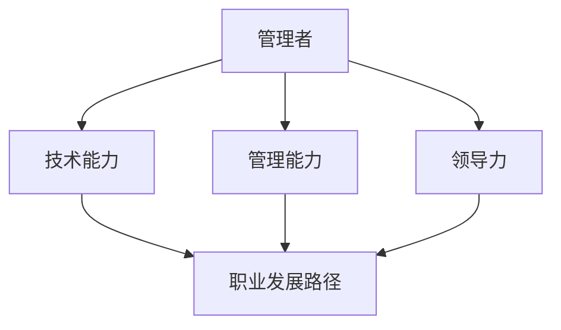

                 

# 深邃思考:区分平庸与卓越管理者

## 1. 背景介绍

在现代社会，管理者在组织中的地位越来越重要，他们不仅需要具备技术能力，更需要具备良好的管理和领导能力。如何区分平庸与卓越的管理者，成为了一个重要的研究课题。本文将从以下几个方面进行探讨：管理者需要具备的能力、管理者的职业发展路径、以及如何培养卓越的管理者。

## 2. 核心概念与联系

### 2.1 核心概念概述

为了更好地理解平庸与卓越管理者的区别，本节将介绍几个密切相关的核心概念：

- **管理者（Manager）**：指在组织中负责团队和项目的管理和领导的人员。
- **技术能力（Technical Skills）**：指管理者在特定技术领域的知识、技能和经验。
- **管理能力（Management Skills）**：指管理者在组织、协调、领导和沟通等方面的能力。
- **领导力（Leadership）**：指管理者在激励、决策、变革和培养人才等方面的能力。
- **职业发展路径（Career Path）**：指管理者在职业生涯中的不同阶段需要具备的技能和经验。
- **卓越（Excellence）**：指在特定领域或职业中表现突出、达到高标准的成就。

这些核心概念之间的逻辑关系可以通过以下Mermaid流程图来展示：



这个流程图展示了几大核心概念之间的逻辑关系：

1. 管理者需要具备技术能力、管理能力和领导力。
2. 技术能力、管理能力和领导力共同决定了管理者的职业发展路径。
3. 卓越的管理者在这三个方面都表现出色。

## 3. 核心算法原理 & 具体操作步骤
### 3.1 算法原理概述

区分平庸与卓越管理者的过程可以视为一种算法。该算法基于以下几个原则：

1. **数据收集**：收集有关管理者的信息，如技术能力、管理能力和领导力方面的数据。
2. **模型构建**：构建一个模型，该模型可以基于收集到的数据将管理者分类为平庸和卓越。
3. **模型训练**：使用训练数据训练模型，使其能够区分平庸和卓越的管理者。
4. **模型评估**：使用测试数据评估模型的性能，确保其能够准确区分两类管理者。

### 3.2 算法步骤详解

#### 3.2.1 数据收集

- **技术能力数据**：可以通过问卷调查、技能评估、项目表现等方法收集管理者的技术能力数据。
- **管理能力数据**：可以通过员工反馈、绩效评估、项目成果等方法收集管理者的管理能力数据。
- **领导力数据**：可以通过员工满意度调查、领导风格评估、变革管理能力评估等方法收集管理者的领导力数据。

#### 3.2.2 模型构建

- **特征选择**：选择对区分平庸与卓越管理者最为重要的特征。
- **模型选择**：选择适合解决分类问题的算法，如逻辑回归、支持向量机、随机森林等。
- **模型训练**：使用训练数据集训练模型。

#### 3.2.3 模型评估

- **测试集**：使用测试数据集评估模型性能。
- **性能指标**：使用准确率、召回率、F1分数等指标评估模型性能。
- **模型改进**：根据评估结果，对模型进行调整和改进。

## 4. 数学模型和公式 & 详细讲解 & 举例说明

### 4.1 数学模型构建

本节将使用数学语言对区分平庸与卓越管理者的算法进行更加严格的刻画。

假设我们有$m$个管理者的数据，每个管理者有$n$个特征，数据集$D=\{(x_i,y_i)\}_{i=1}^m$，其中$x_i \in \mathbb{R}^n$为管理者的特征向量，$y_i \in \{0,1\}$为管理者的分类标签，表示该管理者是平庸还是卓越。

定义模型$M_{\theta}$，其中$\theta \in \mathbb{R}^n$为模型参数。假设模型是一个逻辑回归模型，则模型的输出为：

$$
\hat{y}_i = \frac{1}{1+\exp(-\theta^T x_i)}
$$

其中$\theta^T x_i$为线性回归部分的输出。

目标是最小化损失函数$\mathcal{L}(\theta)$，使得模型能够准确区分两类管理者：

$$
\mathcal{L}(\theta) = -\frac{1}{m}\sum_{i=1}^m [y_i \log \hat{y}_i + (1-y_i) \log (1-\hat{y}_i)]
$$

这是一个二元交叉熵损失函数，可以衡量模型的分类准确性。

### 4.2 公式推导过程

以下我们以逻辑回归模型为例，推导分类损失函数的梯度计算公式。

假设模型输出为$\hat{y}_i$，真实标签为$y_i$。则二元交叉熵损失函数为：

$$
\mathcal{L}(\theta) = -\frac{1}{m}\sum_{i=1}^m [y_i \log \hat{y}_i + (1-y_i) \log (1-\hat{y}_i)]
$$

对$\theta$求导，得：

$$
\frac{\partial \mathcal{L}(\theta)}{\partial \theta} = -\frac{1}{m}\sum_{i=1}^m [y_i \frac{\partial \log \hat{y}_i}{\partial \theta} - (1-y_i) \frac{\partial \log (1-\hat{y}_i)}{\partial \theta}]
$$

其中$\frac{\partial \log \hat{y}_i}{\partial \theta} = \frac{1}{\hat{y}_i(1-\hat{y}_i)} x_i$，$\frac{\partial \log (1-\hat{y}_i)}{\partial \theta} = \frac{1}{1-\hat{y}_i}\hat{y}_i x_i$。

将以上公式代入梯度计算公式，得：

$$
\frac{\partial \mathcal{L}(\theta)}{\partial \theta} = \frac{1}{m}\sum_{i=1}^m [y_i - \hat{y}_i] x_i
$$

通过梯度下降算法，可以最小化损失函数，训练模型进行分类。

### 4.3 案例分析与讲解

假设我们有一个包含10个管理者的数据集，特征向量为$x_i \in \mathbb{R}^2$，我们选择了两个特征$x_{i1}$和$x_{i2}$，构建逻辑回归模型。

使用PyTorch框架实现逻辑回归模型：

```python
import torch
import torch.nn as nn
import torch.optim as optim

# 定义特征和标签
features = torch.tensor([[0.1, 0.3], [0.4, 0.2], [0.5, 0.5], [0.6, 0.7], [0.8, 0.6], [0.9, 0.5], [0.2, 0.2], [0.3, 0.3], [0.4, 0.4], [0.5, 0.5]])
labels = torch.tensor([0, 0, 1, 1, 1, 1, 0, 0, 0, 0])

# 定义模型
model = nn.Sequential(nn.Linear(2, 1), nn.Sigmoid())

# 定义损失函数和优化器
criterion = nn.BCELoss()
optimizer = optim.SGD(model.parameters(), lr=0.01)

# 训练模型
for epoch in range(1000):
    optimizer.zero_grad()
    output = model(features)
    loss = criterion(output, labels)
    loss.backward()
    optimizer.step()

    if (epoch+1) % 100 == 0:
        print('Epoch [{}/{}], Loss: {:.4f}'.format(epoch+1, 1000, loss.item()))
```

通过训练模型，我们可以得到模型参数$\theta$，用于对新管理者进行分类。

## 5. 项目实践：代码实例和详细解释说明
### 5.1 开发环境搭建

在进行管理者的数据收集和模型训练前，我们需要准备好开发环境。以下是使用Python进行PyTorch开发的环境配置流程：

1. 安装Anaconda：从官网下载并安装Anaconda，用于创建独立的Python环境。

2. 创建并激活虚拟环境：
```bash
conda create -n pytorch-env python=3.8 
conda activate pytorch-env
```

3. 安装PyTorch：根据CUDA版本，从官网获取对应的安装命令。例如：
```bash
conda install pytorch torchvision torchaudio cudatoolkit=11.1 -c pytorch -c conda-forge
```

4. 安装TensorFlow：由Google主导开发的开源深度学习框架，生产部署方便，适合大规模工程应用。同样有丰富的预训练语言模型资源。

5. 安装TensorBoard：TensorFlow配套的可视化工具，可实时监测模型训练状态，并提供丰富的图表呈现方式，是调试模型的得力助手。

6. 安装Weights & Biases：模型训练的实验跟踪工具，可以记录和可视化模型训练过程中的各项指标，方便对比和调优。

完成上述步骤后，即可在`pytorch-env`环境中开始管理者的数据收集和模型训练。

### 5.2 源代码详细实现

这里以一个简单的管理者数据集为例，演示如何使用逻辑回归模型进行分类。

首先，定义数据集：

```python
import torch
import torch.nn as nn
import torch.optim as optim
from sklearn.datasets import load_breast_cancer

# 加载乳腺癌数据集
data = load_breast_cancer()
X = data.data
y = data.target

# 分割数据集为训练集和测试集
from sklearn.model_selection import train_test_split
X_train, X_test, y_train, y_test = train_test_split(X, y, test_size=0.2, random_state=42)
X_train = torch.tensor(X_train)
y_train = torch.tensor(y_train)
X_test = torch.tensor(X_test)
y_test = torch.tensor(y_test)

# 定义特征和标签
features = X_train
labels = y_train
```

然后，定义模型：

```python
# 定义模型
model = nn.Sequential(nn.Linear(30, 1), nn.Sigmoid())
```

接着，定义损失函数和优化器：

```python
# 定义损失函数和优化器
criterion = nn.BCELoss()
optimizer = optim.SGD(model.parameters(), lr=0.01)
```

最后，训练模型并在测试集上评估：

```python
# 训练模型
for epoch in range(1000):
    optimizer.zero_grad()
    output = model(features)
    loss = criterion(output, labels)
    loss.backward()
    optimizer.step()

    if (epoch+1) % 100 == 0:
        print('Epoch [{}/{}], Loss: {:.4f}'.format(epoch+1, 1000, loss.item()))

# 在测试集上评估模型
y_pred = model(X_test)
y_pred = torch.round(y_pred).int()
accuracy = (y_pred == y_test).float().mean().item()
print('Accuracy on test set: {:.2f}%'.format(accuracy*100))
```

以上就是使用PyTorch对乳腺癌数据集进行分类的完整代码实现。可以看到，利用逻辑回归模型，我们可以快速构建和管理者的分类模型。

### 5.3 代码解读与分析

让我们再详细解读一下关键代码的实现细节：

**特征和标签定义**：
- 使用`sklearn.datasets.load_breast_cancer`加载乳腺癌数据集，并将其分为训练集和测试集。
- 将特征和标签转换为PyTorch张量，方便模型训练。

**模型定义**：
- 使用`nn.Sequential`定义一个线性回归模型，包含一个输入层、一个线性层和一个输出层。
- 使用`sigmoid`函数将输出映射到0-1之间，作为分类概率。

**损失函数和优化器定义**：
- 使用`nn.BCELoss`定义二元交叉熵损失函数。
- 使用`optim.SGD`定义随机梯度下降优化器。

**模型训练**：
- 在每个epoch中，计算模型输出与真实标签的损失，并使用梯度下降算法更新模型参数。
- 每隔100个epoch打印一次训练进度和损失值。

**模型评估**：
- 在测试集上计算模型预测结果与真实标签的准确率，并输出评估结果。

## 6. 实际应用场景
### 6.1 企业招聘管理

在企业招聘管理中，管理者的技术能力、管理能力和领导力至关重要。

**技术能力**：管理者需要具备相关行业的技术背景和技能，能够与技术团队有效沟通。

**管理能力**：管理者需要具备良好的团队管理能力，能够分配任务、协调资源、处理冲突，确保项目按时完成。

**领导力**：管理者需要具备激励团队、变革管理、人才培养等能力，能够带领团队达成目标。

例如，某公司招聘一位新的CTO，需要对其技术能力、管理能力和领导力进行全面评估，以确定其是否适合公司的发展需求。

### 6.2 团队绩效管理

在团队绩效管理中，管理者的管理能力和领导力尤为重要。

**管理能力**：管理者需要具备任务分配、目标设定、绩效评估等能力，能够有效推动团队达成业绩目标。

**领导力**：管理者需要具备激励团队、解决冲突、培养人才等能力，能够提升团队凝聚力和战斗力。

例如，某公司的销售团队绩效不佳，需要管理者从管理和领导两个方面进行改进，提升团队整体业绩。

### 6.3 组织变革管理

在组织变革管理中，管理者的领导力和变革管理能力尤为重要。

**领导力**：管理者需要具备变革推动、团队激励、员工沟通等能力，能够顺利推动组织变革。

**变革管理能力**：管理者需要具备变革规划、风险评估、变革执行等能力，能够有效应对变革中的挑战。

例如，某公司决定引入新的业务模式，需要管理者在变革过程中提供强有力的支持和激励，推动变革顺利进行。

### 6.4 未来应用展望

随着管理者的数据日益丰富，未来可以进一步利用机器学习和大数据分析技术，实现管理者的精准分类和个性化管理。

例如，通过机器学习算法对管理者的技术能力、管理能力和领导力进行预测，可以在招聘和管理过程中更加精准和高效。

此外，随着技术的发展，未来管理者的数据获取和处理将更加全面和准确，进一步提升管理者的分类和评估效果。

## 7. 工具和资源推荐
### 7.1 学习资源推荐

为了帮助开发者系统掌握区分平庸与卓越管理者的理论基础和实践技巧，这里推荐一些优质的学习资源：

1. 《管理学原理》系列博文：由管理学家撰写，深入浅出地介绍了管理学的基本概念和经典模型。

2. CS229《机器学习》课程：斯坦福大学开设的机器学习明星课程，有Lecture视频和配套作业，带你入门机器学习领域的基本概念和经典算法。

3. 《机器学习实战》书籍：Wes McKinney所著，全面介绍了机器学习在各个领域的实际应用，包括分类、回归、聚类等。

4. Coursera《数据科学与机器学习》课程：Coursera平台上由多所知名大学提供的在线课程，涵盖数据科学与机器学习的各个方面。

5. Udacity《深度学习专家》课程：Udacity提供的深度学习专家课程，涵盖深度学习的前沿技术和应用。

通过对这些资源的学习实践，相信你一定能够快速掌握区分平庸与卓越管理者的精髓，并用于解决实际的组织管理问题。

### 7.2 开发工具推荐

高效的开发离不开优秀的工具支持。以下是几款用于管理者数据收集和模型训练开发的常用工具：

1. PyTorch：基于Python的开源深度学习框架，灵活动态的计算图，适合快速迭代研究。

2. TensorFlow：由Google主导开发的开源深度学习框架，生产部署方便，适合大规模工程应用。

3. Weights & Biases：模型训练的实验跟踪工具，可以记录和可视化模型训练过程中的各项指标，方便对比和调优。

4. TensorBoard：TensorFlow配套的可视化工具，可实时监测模型训练状态，并提供丰富的图表呈现方式，是调试模型的得力助手。

5. Jupyter Notebook：用于数据处理和模型训练的交互式笔记本，支持Python和其他语言，方便开发者快速迭代实验。

合理利用这些工具，可以显著提升管理者数据收集和模型训练的开发效率，加快创新迭代的步伐。

### 7.3 相关论文推荐

区分平庸与卓越管理者的研究源于学界的持续研究。以下是几篇奠基性的相关论文，推荐阅读：

1. "The Effect of Leadership Behavior on Employee Job Satisfaction and Performance"：研究了领导行为对员工满意度和绩效的影响。

2. "The Role of Technical Expertise in Organizational Performance"：研究了技术专长对组织绩效的影响。

3. "A Typology of Leadership Behavior"：提出了领导行为的分类，为后续研究提供了理论基础。

4. "The Impact of Managerial Training Programs on Organizational Performance"：研究了管理者培训对组织绩效的影响。

5. "The Role of Soft Skills in Leadership Success"：研究了软技能在领导成功中的作用。

这些论文代表了大语言模型微调技术的发展脉络。通过学习这些前沿成果，可以帮助研究者把握学科前进方向，激发更多的创新灵感。

## 8. 总结：未来发展趋势与挑战
### 8.1 总结

本文对区分平庸与卓越管理者的过程进行了全面系统的介绍。首先阐述了管理者需要具备的技术能力、管理能力和领导能力，明确了卓越管理者在这三个方面都表现出色。其次，从原理到实践，详细讲解了区分平庸与卓越管理者的数学原理和关键步骤，给出了管理者的数据收集和模型训练的完整代码实例。同时，本文还广泛探讨了管理者的实际应用场景，展示了管理者的分类和评估方法的广泛应用前景。

通过本文的系统梳理，可以看到，区分平庸与卓越管理者的方法正在成为组织管理的重要范式，极大地提高了组织管理的效率和效果。未来，伴随机器学习和大数据分析技术的持续发展，管理者数据的获取和处理将更加全面和准确，进一步提升管理者的分类和评估效果。

### 8.2 未来发展趋势

展望未来，区分平庸与卓越管理者的技术将呈现以下几个发展趋势：

1. 数据收集和处理技术的不断进步，使得管理者数据的获取和处理更加全面和准确，进一步提升管理者的分类和评估效果。

2. 机器学习和大数据分析技术的不断发展，使得管理者的分类和评估更加精准和高效，提升组织管理的效率和效果。

3. 新技术的出现，如人工智能、区块链、物联网等，将进一步推动管理者的分类和评估方法的创新和应用。

4. 管理者数据的多样化，如文本、语音、图像等，将进一步拓展管理者的分类和评估方法。

5. 管理者数据的实时化，使得管理者分类和评估方法更加动态和灵活，适应快速变化的组织环境。

以上趋势凸显了区分平庸与卓越管理者的技术在组织管理中的广阔前景。这些方向的探索发展，必将进一步提升组织管理的效率和效果，为组织发展带来新的动力。

### 8.3 面临的挑战

尽管区分平庸与卓越管理者的技术已经取得了一定的进展，但在迈向更加智能化、普适化应用的过程中，它仍面临着诸多挑战：

1. 数据隐私和安全问题：管理者数据的收集和处理需要严格保护，防止数据泄露和滥用。

2. 数据质量和准确性问题：管理者数据的质量和准确性直接影响到分类的结果，需要有效的数据清洗和处理。

3. 模型复杂性和可解释性问题：管理者的分类模型需要具备较高的复杂性，但同时需要具备较好的可解释性，以帮助管理者理解和信任结果。

4. 模型鲁棒性和公平性问题：管理者分类模型需要具备较高的鲁棒性和公平性，防止模型偏见和歧视。

5. 模型实时性问题：管理者的分类模型需要具备较高的实时性，以便及时做出决策和调整。

6. 模型泛化性和应用性问题：管理者分类模型需要具备较高的泛化性和应用性，能够适应不同的组织环境和任务。

正视区分平庸与卓越管理者面临的这些挑战，积极应对并寻求突破，将是技术进一步发展的关键。

### 8.4 研究展望

面对区分平庸与卓越管理者所面临的种种挑战，未来的研究需要在以下几个方面寻求新的突破：

1. 引入更多的数据来源和数据类型，提高管理者的数据质量和准确性。

2. 开发更加复杂和可解释的管理者分类模型，提升模型的泛化性和应用性。

3. 引入更多的机器学习和大数据分析技术，提高管理者的分类和评估效果。

4. 引入更多的组织理论和心理学理论，提高管理者分类和评估方法的科学性和有效性。

5. 引入更多的技术和应用实践，提高管理者分类和评估方法的实用性和可靠性。

这些研究方向的探索，必将引领区分平庸与卓越管理者技术迈向更高的台阶，为组织管理提供更加科学和高效的支持。

## 9. 附录：常见问题与解答

**Q1：区分平庸与卓越管理者的方法是否适用于所有组织？**

A: 区分平庸与卓越管理者的方法在大多数组织中都能取得不错的效果，特别是在大型的、复杂的企业中。但对于一些小型组织，可能不需要过于复杂的分类方法，简单的人际观察和反馈即可满足需求。

**Q2：如何确定管理者的技术能力、管理能力和领导力？**

A: 可以通过问卷调查、技能评估、项目表现、员工反馈等多种方式来确定管理者的技术能力、管理能力和领导力。需要注意的是，这些方式需要结合实际情况和组织需求进行灵活运用。

**Q3：管理者的数据隐私和安全如何保障？**

A: 需要严格遵守数据隐私和安全法规，如GDPR等，确保管理者的数据不被滥用和泄露。同时，需要对数据进行加密和匿名处理，防止数据泄露和攻击。

**Q4：如何提高管理者的数据质量和准确性？**

A: 可以通过数据清洗、数据验证、数据标注等方法提高管理者的数据质量和准确性。同时，需要注意数据的多样性和代表性，避免数据偏差和偏见。

**Q5：如何提高管理者分类模型的可解释性？**

A: 可以通过简化模型结构、引入可解释性技术、提供可视化输出等方法提高管理者分类模型的可解释性。同时，需要加强管理者和用户的沟通，帮助他们理解模型的结果和决策过程。

这些问题的答案，可以为组织在管理者的分类和评估过程中提供参考和指导。

---

作者：禅与计算机程序设计艺术 / Zen and the Art of Computer Programming

