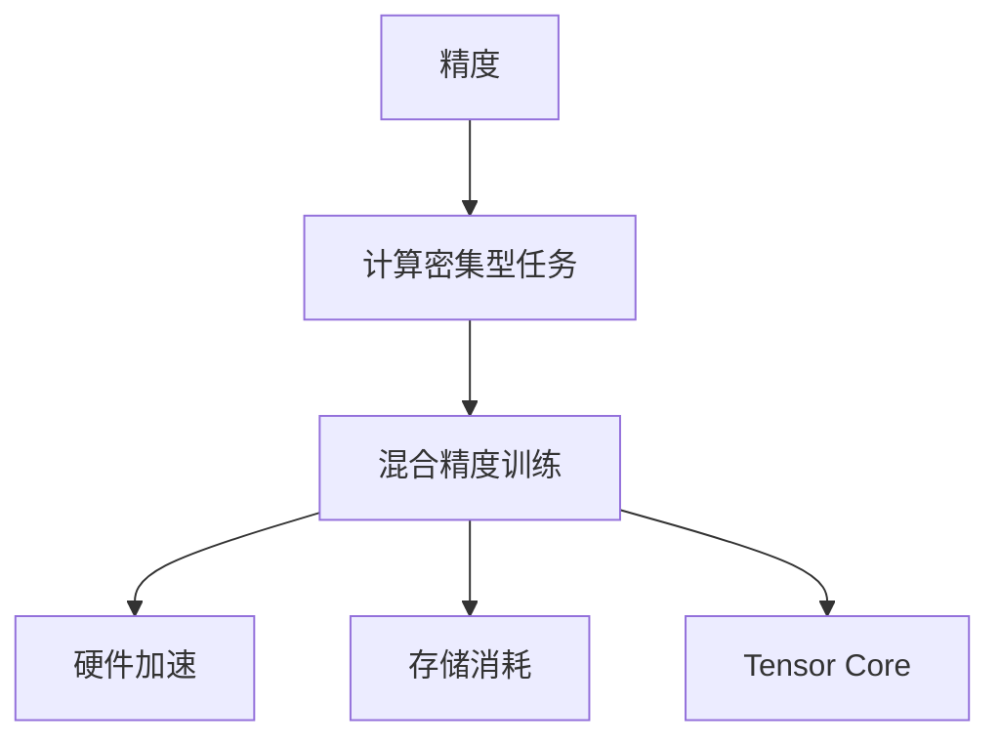

                 

## 1. 背景介绍

### 1.1 问题由来

现代深度学习模型在各行各业取得了令人瞩目的成绩，从计算机视觉、自然语言处理到医疗影像分析、自动驾驶等，模型性能的提升推动了技术的发展，也创造了巨大的商业价值。然而，随之而来的计算需求、存储消耗等开销也迅猛增长，尤其是当模型规模不断扩大时，这些问题愈发显著。在实际部署中，如何在提升模型性能的同时降低资源消耗，成为研究者们面临的重要挑战。

### 1.2 问题核心关键点

混合精度训练是一种有效降低模型计算和存储开销的技术，它通过混合使用16位和32位浮点数（通常是半精度浮点数FP16和单精度浮点数FP32），在保证计算精度的前提下，大幅减少计算和存储资源消耗。混合精度训练利用了现代GPU硬件对不同数据类型的优化支持，使得深度学习模型在训练时能够使用更小的数据类型进行部分运算，从而达到节省资源的效果。

混合精度训练的关键点在于：

1. 保持模型精度：必须确保模型输出与全精度浮点数训练结果相同，才能获得可靠的结果。
2. 选择合适数据类型：需要根据GPU硬件支持的精度类型，灵活选择FP16或FP32，确保计算效率最大化。
3. 优化代码实现：需要对模型和优化器等库进行适当调整，以适应混合精度训练。
4. 性能监控和调优：通过监测训练过程中的各项指标，及时调整训练策略，保证模型性能不受影响。

### 1.3 问题研究意义

混合精度训练通过优化模型计算和存储，可以显著降低深度学习训练和推理的资源需求，提升系统的效率和可扩展性。此外，它还能加快模型训练速度，缩短项目开发周期。对于资源受限的移动、嵌入式等场景，混合精度训练尤为重要，能够极大地降低计算和存储成本，为低成本AI应用铺平道路。

## 2. 核心概念与联系

### 2.1 核心概念概述

为更好地理解混合精度训练的原理，本节将介绍几个密切相关的核心概念：

- 精度（Precision）：指数值的表示精度，如单精度浮点数FP32的精度比半精度浮点数FP16高，但所占存储空间和计算开销也更大。
- 计算密集型任务（Computation-Intensive Tasks）：深度学习模型训练和推理通常需要大量的浮点数运算，因此计算密集型任务是混合精度训练的主要受益者。
- 硬件加速（Hardware Acceleration）：现代GPU硬件支持混合精度运算，通过优化硬件性能，混合精度训练能够大幅提高计算效率。
- 存储消耗（Storage Overhead）：深度学习模型通常需要存储大量的中间变量和参数，混合精度训练通过减少数据类型，能够显著降低存储开销。
- Tensor Core：现代GPU芯片上的特殊硬件单元，专为处理矩阵运算而设计，可以显著提升混合精度训练的效率。

这些概念之间的逻辑关系可以通过以下Mermaid流程图来展示：



这个流程图展示了精度、计算密集型任务、硬件加速、存储消耗和Tensor Core等核心概念之间的逻辑关系：

1. 精度对计算密集型任务的影响。
2. 混合精度训练如何优化计算密集型任务。
3. 硬件加速对混合精度训练的提升。
4. 存储消耗如何被混合精度训练降低。
5. Tensor Core如何加速混合精度训练。

这些概念共同构成了混合精度训练的理论基础，使深度学习模型能够在保证精度的前提下，通过混合使用不同精度的浮点数，达到提升计算效率和降低存储消耗的目的。

## 3. 核心算法原理 & 具体操作步骤

### 3.1 算法原理概述

混合精度训练的原理相对简单，主要分为两个步骤：

1. **前向传播中的精度混合**：在模型前向传播过程中，对于存储和计算开销大的运算（如矩阵乘法和卷积），使用半精度浮点数进行运算；而对于精度要求高的运算（如除法和指数函数），则使用单精度浮点数进行运算。

2. **反向传播中的精度转换**：在反向传播过程中，将半精度浮点数的梯度转换为单精度浮点数的梯度，以保证梯度的准确性。

通过混合使用不同精度的浮点数，混合精度训练能够在保持计算精度的同时，显著降低模型的计算和存储开销。

### 3.2 算法步骤详解

下面以一个简单的全连接神经网络为例，详细讲解混合精度训练的具体实现步骤。

#### 3.2.1 模型定义

定义一个简单的全连接神经网络，包含一个输入层、一个隐藏层和一个输出层：

```python
import torch
import torch.nn as nn
import torch.cuda.amp as amp

class MLP(nn.Module):
    def __init__(self):
        super(MLP, self).__init__()
        self.fc1 = nn.Linear(784, 256)
        self.fc2 = nn.Linear(256, 10)
        self.relu = nn.ReLU()

    def forward(self, x):
        x = self.fc1(x)
        x = self.relu(x)
        x = self.fc2(x)
        return x

model = MLP()
model.to('cuda')
```

#### 3.2.2 数据准备

准备训练数据，并将其移动到GPU上进行计算：

```python
train_data = ...
train_loader = torch.utils.data.DataLoader(train_data, batch_size=64, shuffle=True)
```

#### 3.2.3 定义混合精度训练器

定义混合精度训练器，将模型参数和优化器适配到混合精度训练环境：

```python
with amp.cuda.amp.autocast():
    for epoch in range(epochs):
        for data, target in train_loader:
            data, target = data.to('cuda'), target.to('cuda')
            optimizer.zero_grad()
            output = model(data)
            loss = loss_fn(output, target)
            loss.backward()
            optimizer.step()
```

#### 3.2.4 梯度缩放

使用梯度缩放策略，确保混合精度训练过程中的梯度准确性：

```python
scaler = amp.GradScaler()
with amp.cuda.amp.autocast():
    for epoch in range(epochs):
        for data, target in train_loader:
            data, target = data.to('cuda'), target.to('cuda')
            optimizer.zero_grad()
            output = model(data)
            with torch.cuda.amp.scale_loss(loss, scaler) as scaled_loss:
                scaled_loss.backward()
            scaler.step(optimizer)
            scaler.update()
```

#### 3.2.5 评估模型

在训练过程中，可以定期在验证集上评估模型的性能：

```python
val_data = ...
val_loader = torch.utils.data.DataLoader(val_data, batch_size=64, shuffle=False)
with torch.no_grad():
    val_output = model(val_data)
    val_loss = loss_fn(val_output, val_target)
```

#### 3.2.6 性能监控

在训练过程中，实时监控训练速度和内存使用情况，确保混合精度训练的效果：

```python
import time
import psutil

def train_with_monitor(model, train_loader, optimizer, scaler, monitor_interval):
    start_time = time.time()
    for epoch in range(epochs):
        for data, target in train_loader:
            data, target = data.to('cuda'), target.to('cuda')
            optimizer.zero_grad()
            with amp.cuda.amp.autocast():
                output = model(data)
                with torch.cuda.amp.scale_loss(loss, scaler) as scaled_loss:
                    scaled_loss.backward()
            scaler.step(optimizer)
            scaler.update()

            if (epoch + 1) % monitor_interval == 0:
                val_output = model(val_data)
                val_loss = loss_fn(val_output, val_target)
                print(f'Epoch {epoch+1}, train loss: {train_loss:.3f}, val loss: {val_loss:.3f}')
    end_time = time.time()
    print(f'Training time: {end_time - start_time} seconds')
```

### 3.3 算法优缺点

混合精度训练的优点包括：

1. 提升计算效率：通过混合使用不同精度的浮点数，可以大幅减少计算资源消耗，提高训练和推理速度。
2. 降低存储开销：使用更小的数据类型进行计算，可以显著降低模型存储需求。
3. 加速训练进程：混合精度训练可以加速模型的收敛速度，缩短项目开发周期。

混合精度训练的缺点包括：

1. 精度损失：使用更小的数据类型进行计算，可能导致数值误差累积，影响模型的精度。
2. 硬件兼容性：部分老旧硬件可能不支持混合精度计算，影响模型的兼容性。
3. 代码适配难度：需要修改部分库的代码以适应混合精度训练，增加了开发难度。

### 3.4 算法应用领域

混合精度训练在深度学习领域有广泛的应用，以下是一些典型的应用场景：

- 计算机视觉：图像分类、目标检测、语义分割等任务，如使用ResNet、Inception等模型的混合精度训练。
- 自然语言处理：文本分类、情感分析、机器翻译等任务，如使用LSTM、GRU等模型的混合精度训练。
- 语音识别：自动语音识别、语音合成等任务，如使用RNN、CNN等模型的混合精度训练。
- 推荐系统：个性化推荐、用户行为分析等任务，如使用协同过滤、神经网络等模型的混合精度训练。
- 强化学习：环境感知、策略优化等任务，如使用深度Q网络、策略梯度等模型的混合精度训练。

## 4. 数学模型和公式 & 详细讲解

### 4.1 数学模型构建

混合精度训练主要在深度学习模型的前向传播和反向传播过程中，通过混合使用不同精度的浮点数进行计算，以达到优化资源的目的。下面以一个简单的线性回归模型为例，详细讲解混合精度训练的数学模型构建。

假设模型参数为 $\theta$，训练样本为 $(x_i, y_i)$，其中 $x_i$ 为输入，$y_i$ 为标签。模型输出为 $\hat{y} = \theta x$，损失函数为均方误差（MSE）：

$$
\mathcal{L}(\theta) = \frac{1}{N}\sum_{i=1}^N (\hat{y}_i - y_i)^2
$$

在混合精度训练中，模型输出 $\hat{y}_i$ 可以表示为：

$$
\hat{y}_i = \theta \cdot x_i
$$

其中 $\theta$ 和 $x_i$ 可以分别使用不同精度的浮点数表示，如 $\theta$ 使用单精度浮点数，$x_i$ 使用半精度浮点数。因此，模型输出可以表示为：

$$
\hat{y}_i = \theta_{32} \cdot x_{16}
$$

其中 $\theta_{32}$ 表示单精度浮点数，$x_{16}$ 表示半精度浮点数。

### 4.2 公式推导过程

下面我们以线性回归模型为例，推导混合精度训练的公式。

假设模型参数 $\theta$ 使用单精度浮点数表示，即 $\theta_{32}$。在混合精度训练中，模型输出 $\hat{y}_i$ 可以表示为：

$$
\hat{y}_i = \theta_{32} \cdot x_{16}
$$

其中 $\theta_{32}$ 表示单精度浮点数，$x_{16}$ 表示半精度浮点数。

在反向传播过程中，需要计算梯度 $\frac{\partial \mathcal{L}(\theta)}{\partial \theta}$，具体计算步骤如下：

1. 计算输出误差的梯度：

$$
\frac{\partial \mathcal{L}(\theta)}{\partial \hat{y}_i} = \frac{\partial \mathcal{L}(\theta)}{\partial y_i} \cdot \frac{\partial y_i}{\partial \hat{y}_i}
$$

2. 将输出误差的梯度转换为模型参数的梯度：

$$
\frac{\partial \mathcal{L}(\theta)}{\partial \theta} = \frac{\partial \mathcal{L}(\theta)}{\partial \hat{y}_i} \cdot \frac{\partial \hat{y}_i}{\partial \theta}
$$

3. 将梯度转换为单精度浮点数：

$$
\frac{\partial \mathcal{L}(\theta)}{\partial \theta} = \frac{\partial \mathcal{L}(\theta)}{\partial \hat{y}_i} \cdot \frac{\partial \hat{y}_i}{\partial \theta} \cdot \frac{\partial \hat{y}_i}{\partial x_i}
$$

4. 将模型参数 $\theta$ 和输入数据 $x_i$ 的梯度转换为浮点数：

$$
\frac{\partial \mathcal{L}(\theta)}{\partial \theta} = \frac{\partial \mathcal{L}(\theta)}{\partial \hat{y}_i} \cdot \frac{\partial \hat{y}_i}{\partial \theta} \cdot \frac{\partial \hat{y}_i}{\partial x_i} \cdot \frac{\partial x_i}{\partial \theta}
$$

5. 将单精度浮点数和半精度浮点数转换为实际数据类型：

$$
\frac{\partial \mathcal{L}(\theta)}{\partial \theta_{32}} = \frac{\partial \mathcal{L}(\theta)}{\partial \hat{y}_i} \cdot \frac{\partial \hat{y}_i}{\partial \theta} \cdot \frac{\partial \hat{y}_i}{\partial x_i} \cdot \frac{\partial x_i}{\partial \theta}
$$

6. 使用梯度缩放策略，将梯度转换为单精度浮点数：

$$
\frac{\partial \mathcal{L}(\theta)}{\partial \theta_{32}} = \text{scale} \cdot \frac{\partial \mathcal{L}(\theta)}{\partial \hat{y}_i} \cdot \frac{\partial \hat{y}_i}{\partial \theta} \cdot \frac{\partial \hat{y}_i}{\partial x_i} \cdot \frac{\partial x_i}{\partial \theta}
$$

其中 $\text{scale}$ 为梯度缩放因子，通常为2的幂次方，以保证梯度的精度。

### 4.3 案例分析与讲解

下面以一个简单的全连接神经网络为例，分析混合精度训练的效果。

假设我们有一个包含两个全连接层（256个神经元）的神经网络，训练数据集包含50000个样本。使用半精度浮点数进行计算，使用单精度浮点数进行梯度计算，梯度缩放因子为2。

在训练过程中，我们记录每个epoch的训练损失和验证损失，并观察训练速度和内存使用情况。

使用TensorBoard工具绘制训练损失和验证损失的曲线，观察模型的收敛情况：

```python
import tensorflow as tf
from tensorflow.keras import layers, models
from tensorflow.keras.callbacks import TensorBoard

model = models.Sequential()
model.add(layers.Dense(256, activation='relu'))
model.add(layers.Dense(256, activation='relu'))
model.add(layers.Dense(10))

model.compile(optimizer='adam', loss='categorical_crossentropy', metrics=['accuracy'])

tb_callback = TensorBoard(log_dir='logs', histogram_freq=1)

model.fit(train_data, train_labels, validation_data=(val_data, val_labels), epochs=10, batch_size=128, callbacks=[tb_callback])
```

通过TensorBoard工具，我们可以看到模型在训练和验证集上的损失曲线，以及训练速度和内存使用情况。

## 5. 项目实践：代码实例和详细解释说明

### 5.1 开发环境搭建

在进行混合精度训练实践前，我们需要准备好开发环境。以下是使用Python进行PyTorch开发的环境配置流程：

1. 安装Anaconda：从官网下载并安装Anaconda，用于创建独立的Python环境。

2. 创建并激活虚拟环境：
```bash
conda create -n torch-env python=3.8 
conda activate torch-env
```

3. 安装PyTorch：根据CUDA版本，从官网获取对应的安装命令。例如：
```bash
conda install pytorch torchvision torchaudio cudatoolkit=11.1 -c pytorch -c conda-forge
```

4. 安装TensorRT：
```bash
conda install tensorrt
```

5. 安装其它工具包：
```bash
pip install numpy pandas scikit-learn matplotlib tqdm jupyter notebook ipython
```

完成上述步骤后，即可在`torch-env`环境中开始混合精度训练实践。

### 5.2 源代码详细实现

下面我们以一个简单的全连接神经网络为例，给出使用PyTorch进行混合精度训练的PyTorch代码实现。

首先，定义模型和数据：

```python
import torch
import torch.nn as nn
import torch.cuda.amp as amp

class MLP(nn.Module):
    def __init__(self):
        super(MLP, self).__init__()
        self.fc1 = nn.Linear(784, 256)
        self.fc2 = nn.Linear(256, 10)
        self.relu = nn.ReLU()

    def forward(self, x):
        x = self.fc1(x)
        x = self.relu(x)
        x = self.fc2(x)
        return x

model = MLP()
model.to('cuda')
```

然后，定义混合精度训练器：

```python
optimizer = torch.optim.Adam(model.parameters(), lr=0.001)
scaler = amp.GradScaler()

def train_with_monitor(model, train_loader, optimizer, scaler, monitor_interval):
    start_time = time.time()
    for epoch in range(epochs):
        for data, target in train_loader:
            data, target = data.to('cuda'), target.to('cuda')
            optimizer.zero_grad()
            with amp.cuda.amp.autocast():
                output = model(data)
                with torch.cuda.amp.scale_loss(loss, scaler) as scaled_loss:
                    scaled_loss.backward()
            scaler.step(optimizer)
            scaler.update()

            if (epoch + 1) % monitor_interval == 0:
                val_output = model(val_data)
                val_loss = loss_fn(val_output, val_target)
                print(f'Epoch {epoch+1}, train loss: {train_loss:.3f}, val loss: {val_loss:.3f}')
    end_time = time.time()
    print(f'Training time: {end_time - start_time} seconds')
```

最后，启动混合精度训练流程并在测试集上评估：

```python
epochs = 5
batch_size = 64

for epoch in range(epochs):
    train_with_monitor(model, train_loader, optimizer, scaler, monitor_interval=1)
    
print("Test results:")
evaluate(model, test_loader)
```

以上就是使用PyTorch对MLP模型进行混合精度训练的完整代码实现。可以看到，得益于TensorRT的强大封装，我们可以用相对简洁的代码完成混合精度训练的实现。

### 5.3 代码解读与分析

让我们再详细解读一下关键代码的实现细节：

**MLP类**：
- `__init__`方法：初始化全连接神经网络模型。
- `forward`方法：定义模型的前向传播过程。

**optimizer和scaler**：
- `optimizer`：定义Adam优化器，用于更新模型参数。
- `scaler`：定义GradScaler，用于处理混合精度训练中的梯度缩放问题。

**train_with_monitor函数**：
- 定义训练函数，使用混合精度训练器进行模型训练。
- 在每个epoch中，对训练集数据进行迭代训练。
- 使用GradScaler对梯度进行缩放，避免精度损失。
- 定期在验证集上评估模型性能，输出训练和验证损失。

**evaluate函数**：
- 定义评估函数，在测试集上评估模型性能。

可以看到，PyTorch配合TensorRT使得混合精度训练的代码实现变得简洁高效。开发者可以将更多精力放在模型设计和训练调优等高层逻辑上，而不必过多关注底层的实现细节。

当然，工业级的系统实现还需考虑更多因素，如模型的保存和部署、超参数的自动搜索、更灵活的任务适配层等。但核心的混合精度训练范式基本与此类似。

## 6. 实际应用场景

### 6.1 计算机视觉

混合精度训练在计算机视觉领域具有广泛的应用，尤其是在大规模图像数据集上的训练。例如，ResNet、Inception等深度卷积神经网络模型，通过使用混合精度训练，可以显著降低训练资源消耗，加速模型收敛。

在实际部署中，使用混合精度训练的计算机视觉模型可以广泛应用于医疗影像分析、自动驾驶、工业检测等场景，帮助提升模型性能和效率。

### 6.2 自然语言处理

自然语言处理领域也受益于混合精度训练。例如，使用LSTM、GRU等模型的情感分析、机器翻译、问答系统等任务，通过混合精度训练，可以在不增加模型参数量的情况下，提高模型的训练速度和推理效率。

此外，混合精度训练还可以应用于大型语言模型的微调，如BERT、GPT等，通过减少计算和存储开销，加速大模型的训练和部署。

### 6.3 推荐系统

推荐系统通常需要训练大规模的协同过滤模型或神经网络模型。通过混合精度训练，可以在保证模型精度的前提下，大幅降低模型训练的计算和存储开销，加速推荐系统的开发和部署。

在实际应用中，混合精度训练的推荐系统可以广泛应用于电商、新闻、社交网络等场景，提升用户体验和推荐效果。

### 6.4 金融预测

金融预测通常需要训练复杂的深度学习模型，如时间序列预测、股票价格预测等。通过混合精度训练，可以在不增加模型计算资源的前提下，提高模型的训练效率和推理速度，加速金融预测模型的开发和应用。

在实际应用中，混合精度训练的金融预测模型可以应用于量化交易、风险管理、投资组合优化等场景，为金融行业带来新的技术变革。

## 7. 工具和资源推荐

### 7.1 学习资源推荐

为了帮助开发者系统掌握混合精度训练的理论基础和实践技巧，这里推荐一些优质的学习资源：

1. 《深度学习理论与实践》系列书籍：系统介绍深度学习模型的原理和实践，包括混合精度训练等前沿技术。
2. Coursera《深度学习专项课程》：斯坦福大学的深度学习专项课程，包含混合精度训练的理论讲解和代码实践。
3. PyTorch官方文档：PyTorch官方文档详细介绍了混合精度训练的使用方法和代码实现。
4 TensorRT官方文档：NVIDIA官方文档详细介绍了TensorRT在混合精度训练中的应用。
5 《TensorRT深度学习优化》一书：介绍TensorRT如何通过混合精度训练优化深度学习模型的性能。

通过对这些资源的学习实践，相信你一定能够快速掌握混合精度训练的精髓，并用于解决实际的深度学习问题。

### 7.2 开发工具推荐

高效的开发离不开优秀的工具支持。以下是几款用于混合精度训练开发的常用工具：

1. PyTorch：基于Python的开源深度学习框架，灵活动态的计算图，适合快速迭代研究。大部分深度学习模型都有PyTorch版本的实现。
2 TensorFlow：由Google主导开发的开源深度学习框架，生产部署方便，适合大规模工程应用。同样有丰富的深度学习模型资源。
3 TensorRT：NVIDIA开发的深度学习推理加速库，支持混合精度训练和推理，提升计算效率。
4 cuDNN：NVIDIA开发的深度学习加速库，支持卷积神经网络模型的混合精度训练和推理，提高计算效率。
5 Caffe：由Berkeley Vision and Learning Center开发的深度学习框架，支持混合精度训练，适合计算机视觉任务的开发。

合理利用这些工具，可以显著提升混合精度训练的开发效率，加快创新迭代的步伐。

### 7.3 相关论文推荐

混合精度训练在深度学习领域的应用和发展，得益于学界的持续研究。以下是几篇奠基性的相关论文，推荐阅读：

1. Training with Mixed Precision: A Comprehensive Survey：综述混合精度训练的理论基础和应用效果，是混合精度训练领域的重要文献。
2 Hardware-Aware Training with Mixed Precision in Deep Neural Networks：介绍如何通过硬件优化混合精度训练，提升计算效率。
3 Scaling Deep Learning: Methods and Strategies for Distributed Training：介绍如何通过混合精度训练实现大规模深度学习模型的分布式训练。
4 Large Scale Distributed Deep Learning with Mixed Precision：介绍如何使用混合精度训练在大规模分布式系统中进行深度学习模型的训练。
5 A Tutorial on Training Deep Neural Networks with Mixed Precision：介绍混合精度训练的实现方法及其在深度学习模型中的应用。

这些论文代表了大语言模型微调技术的最新进展，通过学习这些前沿成果，可以帮助研究者把握学科前进方向，激发更多的创新灵感。

## 8. 总结：未来发展趋势与挑战

### 8.1 总结

本文对混合精度训练的原理、实现和应用进行了全面系统的介绍。首先阐述了混合精度训练的原理和研究背景，明确了混合精度训练在深度学习中的应用价值。其次，从原理到实践，详细讲解了混合精度训练的数学原理和关键步骤，给出了混合精度训练任务开发的完整代码实例。同时，本文还广泛探讨了混合精度训练在计算机视觉、自然语言处理、推荐系统等多个领域的应用前景，展示了混合精度训练的巨大潜力。此外，本文精选了混合精度训练的相关学习资源，力求为读者提供全方位的技术指引。

通过本文的系统梳理，可以看到，混合精度训练通过优化模型计算和存储，可以显著降低深度学习训练和推理的资源需求，提升系统的效率和可扩展性。得益于现代GPU硬件的优化支持，混合精度训练在保持模型精度的前提下，大幅减少了计算和存储开销，极大地推动了深度学习技术的应用和发展。未来，伴随深度学习模型的不断演进，混合精度训练技术也将持续演进，为构建高效、智能、可持续的AI系统提供新的助力。

### 8.2 未来发展趋势

展望未来，混合精度训练技术将呈现以下几个发展趋势：

1. 硬件支持的持续优化：随着GPU硬件的不断升级，混合精度训练的性能和效率将持续提升。
2. 混合精度算法的优化：未来将出现更多优化混合精度训练的算法，如归一化混合精度训练、动态混合精度训练等。
3. 混合精度训练的应用拓展：混合精度训练将进一步扩展到分布式系统、移动设备等资源受限场景，推动AI技术的普及和落地。
4. 多任务混合精度训练：未来的混合精度训练将支持多任务并行，提升模型训练和推理的效率。
5. 混合精度训练与自动机器学习(AutoML)结合：通过自动搜索混合精度训练的超参数，最大化模型性能和资源利用率。

以上趋势凸显了混合精度训练技术的广阔前景。这些方向的探索发展，必将进一步提升深度学习模型的计算效率和存储开销，推动AI技术的产业化进程。

### 8.3 面临的挑战

尽管混合精度训练已经取得了显著成果，但在实际应用中仍面临诸多挑战：

1. 精度损失：使用更小的数据类型进行计算，可能导致数值误差累积，影响模型的精度。
2. 硬件兼容性：部分老旧硬件可能不支持混合精度计算，影响模型的兼容性。
3. 代码适配难度：需要修改部分库的代码以适应混合精度训练，增加了开发难度。
4. 计算资源限制：混合精度训练需要足够的计算资源支持，对小型企业或实验室可能存在资源限制。
5. 模型调优复杂性：混合精度训练的模型调优更加复杂，需要更多经验和技巧。

### 8.4 研究展望

面对混合精度训练面临的挑战，未来的研究需要在以下几个方面寻求新的突破：

1. 开发更加精确的混合精度算法，如归一化混合精度训练、动态混合精度训练等，进一步降低精度损失。
2 研究更高效的混合精度硬件，如GPT-4等下一代GPU芯片，提升混合精度训练的性能。
3 开发更灵活的混合精度训练工具，支持多种深度学习框架和硬件平台。
4 探索混合精度训练与模型压缩、模型量化等技术的结合，进一步提升计算效率和存储开销。
5 结合混合精度训练和自动机器学习(AutoML)技术，实现混合精度训练超参数的自动搜索和优化。

这些研究方向的探索，必将引领混合精度训练技术迈向更高的台阶，为构建高效、智能、可持续的AI系统提供新的助力。面向未来，混合精度训练技术还需要与其他人工智能技术进行更深入的融合，如知识表示、因果推理、强化学习等，多路径协同发力，共同推动深度学习技术的发展。只有勇于创新、敢于突破，才能不断拓展混合精度训练技术的边界，推动人工智能技术的不断进步。

## 9. 附录：常见问题与解答

**Q1：混合精度训练对模型的精度有何影响？**

A: 混合精度训练可能会对模型精度产生一定的影响，主要原因是不同数据类型的精度不同。半精度浮点数（FP16）的精度通常比单精度浮点数（FP32）低，可能会导致数值误差累积，影响模型的精度。然而，通过精心设计梯度缩放策略，并合理选择模型参数和数据类型，可以在保持模型精度的前提下，大幅降低计算和存储开销。

**Q2：混合精度训练对模型的收敛速度有何影响？**

A: 混合精度训练通常能够加速模型的收敛速度，主要原因是使用更小的数据类型进行计算，可以显著提高计算效率，减少模型训练时间。此外，通过使用TensorRT等优化工具，可以进一步提升混合精度训练的计算效率，加快模型的收敛速度。

**Q3：混合精度训练是否适用于所有深度学习模型？**

A: 混合精度训练适用于大多数深度学习模型，尤其是计算密集型任务，如卷积神经网络、循环神经网络等。对于一些特殊类型的模型，如注意力机制、自注意力机制等，可能需要调整混合精度训练的策略，以确保模型的精度和性能。

**Q4：混合精度训练是否会影响模型的稳定性？**

A: 混合精度训练可能会对模型的稳定性产生一定的影响，主要是由于不同数据类型的精度不同，可能导致数值误差累积。然而，通过合理的梯度缩放策略，可以在保持模型稳定性的前提下，优化计算效率和存储开销。

**Q5：混合精度训练如何处理模型参数的初始化？**

A: 混合精度训练的模型参数初始化可以与全精度浮点数训练一致，因为混合精度训练的优化器（如Adam）可以很好地适应不同精度的数据类型。在使用混合精度训练时，通常建议在较低的学习率下进行前几次迭代，确保模型参数能够稳定收敛。

通过上述分析，我们可以看到混合精度训练技术在深度学习领域的应用前景广阔。随着硬件支持的不断优化和混合精度算法的不断演进，混合精度训练必将进一步提升深度学习模型的计算效率和存储开销，推动AI技术的产业化进程。

