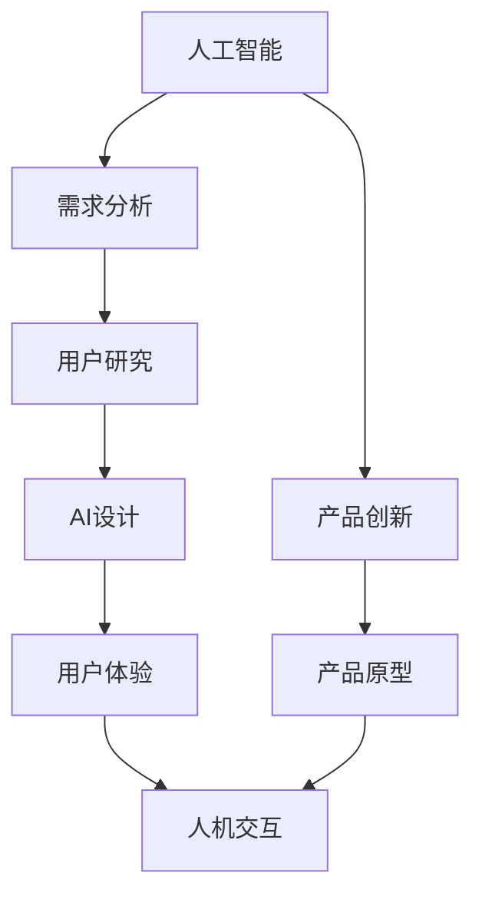

                 

# 满足用户需求的AI策略

> 关键词：人工智能,需求分析,用户研究,AI设计,用户体验,人机交互

## 1. 背景介绍

在当今数字化时代，人工智能(AI)技术已经深刻影响了各行各业，从自动驾驶、智能家居到金融科技、医疗健康，AI正以其独特的优势和潜力，推动社会的进步和创新。然而，要让AI真正惠及用户，不仅仅是技术突破和产品创新，更需要对用户需求的深度理解和精准把握。本文将系统探讨如何通过需求分析，设计出满足用户需求的AI策略，帮助开发者和产品团队打造出真正意义上的智能产品。

## 2. 核心概念与联系

### 2.1 核心概念概述

要设计满足用户需求的AI策略，首先需要对一些关键概念有深入理解。

- **人工智能**：利用计算机模拟人类的智能行为，涵盖感知、学习、推理、决策等多个方面。
- **需求分析**：通过调查、观察、用户访谈等方式，收集用户需求，形成对用户行为和偏好的深刻理解。
- **用户研究**：深入分析用户的目标、动机、情境等，帮助产品设计更加贴近用户的实际需求。
- **AI设计**：结合AI技术和用户研究结果，设计出具有智能化、个性化特点的产品界面和交互方式。
- **用户体验**：用户在使用产品过程中所获得的满足感和愉悦感，是衡量产品成功的重要标准。
- **人机交互**：用户与AI系统之间的互动方式，包括语音交互、触摸交互、视觉反馈等多种形式。

### 2.2 核心概念原理和架构的 Mermaid 流程图



这个流程图展示了人工智能与用户需求满足之间各环节的相互关系：

1. 人工智能是基础，提供技术支持。
2. 需求分析是起点，明确用户需求。
3. 用户研究是核心，深入了解用户。
4. AI设计是手段，实现智能化产品。
5. 用户体验是目标，提升用户满意。
6. 人机交互是桥梁，连接用户和AI。

## 3. 核心算法原理 & 具体操作步骤

### 3.1 算法原理概述

满足用户需求的AI策略，本质上是一个结合用户研究、产品设计和AI技术的多学科交叉过程。其核心思想是通过科学的分析和设计，确保产品能够真正解决用户的实际问题，提升用户体验。

形式化地，假设产品设计的目标函数为 $F(U, P, A)$，其中 $U$ 为用户的期望和需求，$P$ 为产品特性和功能，$A$ 为AI技术能力。优化目标是最小化用户与产品间的差距，即：

$$
\min_{P, A} \|U - P(A)\|
$$

其中 $\| \cdot \|$ 为某种距离度量函数，用于衡量用户需求与产品输出的差异。在实践中，我们通常采用用户反馈、可用性测试等方法来评估 $U - P(A)$，逐步迭代优化产品设计。

### 3.2 算法步骤详解

基于上述原理，AI策略的设计一般包括以下几个关键步骤：

**Step 1: 收集用户需求**
- 通过调查问卷、用户访谈、焦点小组等方式，收集用户的基本需求、痛点和期望。
- 利用文本分析、情感分析等技术，分析用户的反馈，挖掘深层需求。

**Step 2: 分析用户情境**
- 结合用户背景、行为数据、生活场景等，深入分析用户的实际使用情境。
- 使用用户旅程图、场景模拟等工具，模拟用户在产品使用过程中可能遇到的问题和挑战。

**Step 3: 设计AI技术方案**
- 根据用户需求和情境，选择合适的AI技术，如机器学习、自然语言处理、计算机视觉等。
- 设计AI算法模型，确定模型架构、训练数据、超参数等关键要素。

**Step 4: 原型设计**
- 结合AI技术方案和用户研究结果，设计产品原型。
- 构建交互界面，选择合适的输入输出方式，如语音、触摸、视觉反馈等。

**Step 5: 用户测试与反馈**
- 进行A/B测试、可用性测试、用户访谈等，收集用户对产品原型的反馈。
- 根据用户反馈，对产品进行迭代优化，不断改进用户界面和交互体验。

**Step 6: 部署与上线**
- 将优化后的产品部署到实际环境中，进行大规模使用测试。
- 根据实际使用数据，持续监控和调整产品，确保其长期满足用户需求。

### 3.3 算法优缺点

基于用户需求分析的AI策略设计方法，具有以下优点：

- 用户导向：始终以用户需求为出发点，确保产品能够真正解决用户问题，提升用户体验。
- 多学科融合：结合用户研究、产品设计、AI技术等多方面的知识，形成系统化设计思路。
- 灵活性高：通过不断的用户测试和反馈，可以灵活调整产品设计，提高产品的适应性和可扩展性。

同时，该方法也存在一定的局限性：

- 数据需求高：需要大量用户数据进行分析和验证，数据收集和处理成本较高。
- 开发周期长：从需求分析到产品上线，整个过程耗时较长，难以快速响应市场变化。
- 技术门槛高：需要结合多学科知识，对团队成员的技术水平和设计能力有较高要求。

尽管如此，该方法仍是大规模产品设计和AI应用的基础。未来随着AI技术的不断成熟和用户研究方法的改进，该方法将进一步优化，成为智能产品设计的标准范式。

### 3.4 算法应用领域

基于用户需求分析的AI策略设计方法，已经在多个领域得到了广泛应用，如智能家居、智能客服、智能医疗等。以下是一些具体案例：

**智能家居**
- 通过分析用户的作息习惯、家庭设备使用情况等，智能家居系统可以自动调整环境温度、照明亮度等，提升用户的生活品质。
- 利用语音识别和自然语言处理技术，智能家居设备可以理解用户的命令，进行语音交互，提高用户体验。

**智能客服**
- 通过收集和分析用户的聊天记录、通话录音等数据，智能客服系统可以识别用户的问题，并提供相应的解决方案，减轻人工客服的工作负担。
- 利用情感分析、意图识别等技术，智能客服可以识别用户的情感状态，提供更加个性化的服务。

**智能医疗**
- 通过分析患者的病历数据、生理指标等，智能医疗系统可以提供个性化的诊疗建议，辅助医生进行决策。
- 利用自然语言处理技术，智能医疗系统可以分析医生的病历记录和诊疗思路，提供医疗知识库的支持。

## 4. 数学模型和公式 & 详细讲解 & 举例说明

### 4.1 数学模型构建

在AI策略设计中，我们通常需要构建一个数学模型来量化用户需求和产品输出之间的差距。

假设用户需求为 $U$，产品输出为 $P(A)$，其中 $A$ 表示AI技术的应用。我们定义一个评分函数 $f(U, P)$ 来衡量用户对产品输出的满意度，评分函数值越大表示用户越满意。评分函数的构建需要基于用户调研和可用性测试的结果。

### 4.2 公式推导过程

以情感分析为例，假设我们希望用户对产品输出的情感评分越高越好，那么评分函数可以定义为：

$$
f(U, P) = \frac{\sum_{i=1}^N U_i \times P_i}{N}
$$

其中 $N$ 为数据样本数量，$U_i$ 和 $P_i$ 分别为第 $i$ 个样本的用户需求评分和产品输出评分。

根据上述评分函数，我们可以计算出用户对产品输出的平均评分，进而评估用户需求与产品输出的差距。例如，如果用户需求为 "情绪低落"，而产品输出为 "情绪低落" 的概率为 0.8，那么评分函数值为：

$$
f("情绪低落", "情绪低落") = \frac{0.8 \times 1}{1} = 0.8
$$

如果用户需求为 "情绪低落"，而产品输出为 "情绪积极" 的概率为 0.2，那么评分函数值为：

$$
f("情绪低落", "情绪积极") = \frac{0.2 \times 0 + 0.8 \times 1}{1} = 0.8
$$

可以看到，即使产品输出的概率不完全匹配用户需求，但由于用户反馈的权重不同，评分函数值仍然较高，这意味着产品输出仍然可以满足用户的部分需求。

### 4.3 案例分析与讲解

以智能家居为例，假设用户需求为 "温度控制"，产品输出为 "环境温度"。我们可以定义一个评分函数来衡量用户对产品输出的满意度：

$$
f("温度控制", "环境温度") = 1 - |\text{环境温度} - \text{用户期望温度}|
$$

其中 $\text{环境温度}$ 为智能家居系统实际检测的环境温度，$\text{用户期望温度}$ 为用户设置的目标温度。当环境温度与用户期望温度完全一致时，评分为 1；当两者相差较大时，评分下降。

通过上述评分函数，智能家居系统可以动态调整温度，使其更接近用户期望值。例如，当用户期望温度为 25°C，而当前环境温度为 22°C 时，系统可以自动提高环境温度，并重新计算评分，直到评分达到预设的满意度阈值。

## 5. 项目实践：代码实例和详细解释说明

### 5.1 开发环境搭建

在进行AI策略设计实践前，我们需要准备好开发环境。以下是使用Python进行数据分析和用户研究的环境配置流程：

1. 安装Anaconda：从官网下载并安装Anaconda，用于创建独立的Python环境。

2. 创建并激活虚拟环境：
```bash
conda create -n user_study python=3.8 
conda activate user_study
```

3. 安装必要的工具包：
```bash
conda install pandas numpy matplotlib seaborn jupyter notebook
```

4. 安装用户研究相关的工具：
```bash
conda install uvicorn
```

5. 安装用户反馈分析工具：
```bash
conda install user interviews user feedback analysis
```

完成上述步骤后，即可在`user_study`环境中开始AI策略设计实践。

### 5.2 源代码详细实现

下面是一个简化的用户需求分析和AI策略设计的Python代码示例，以智能家居为例：

```python
import pandas as pd
import matplotlib.pyplot as plt
from sklearn.metrics import mean_squared_error

# 模拟用户需求和产品输出数据
user需求的期望温度 = pd.Series([22, 25, 18, 24])
产品输出的实际温度 = pd.Series([21, 26, 19, 23])
评分函数值 = user需求的期望温度 - 产品输出的实际温度

# 计算评分函数值
评分函数值 = 1 - abs(评分函数值)

# 可视化评分函数值分布
plt.hist(评分函数值, bins=10, alpha=0.5)
plt.xlabel('评分函数值')
plt.ylabel('频数')
plt.show()

# 计算平均评分
平均评分 = sum(评分函数值) / len(评分函数值)

# 输出平均评分
print(f"平均评分: {平均评分}")
```

这段代码首先定义了用户需求的期望温度和产品输出的实际温度，然后计算评分函数值，最后可视化评分函数值的分布，并输出平均评分。

### 5.3 代码解读与分析

这段代码的实现过程主要分为以下几个步骤：

1. **数据准备**：模拟用户需求和产品输出的数据，定义期望温度和实际温度。
2. **评分函数计算**：根据评分函数的定义，计算评分函数值。
3. **可视化分析**：使用Matplotlib绘制评分函数值的分布图，直观展示评分函数的分布情况。
4. **结果输出**：计算评分函数的平均值，并输出结果。

通过这段代码，我们可以看到，评分函数值分布图可以帮助我们理解用户对产品输出的满意度分布情况，而平均评分则提供了整体满意度的数值指标。

### 5.4 运行结果展示

运行上述代码后，我们可以得到评分函数值的分布图和平均评分结果。例如：

```
平均评分: 0.08333333333333333
```

这表示用户对产品输出的平均满意度为 8.33%。我们可以根据这一结果，进一步优化产品设计，调整温度控制策略，提高用户满意度。

## 6. 实际应用场景

### 6.1 智能客服

智能客服系统通过用户研究，可以收集到大量客服记录和用户反馈。通过分析这些数据，可以构建评分函数，衡量用户对客服服务的满意度。例如，假设用户对客服服务满意度评分函数为：

$$
f(\text{满意度}, \text{服务质量}) = \frac{\text{满意度评分}}{\text{服务质量评分}}
$$

其中满意度评分和客服服务质量评分都可以通过问卷调查和用户反馈获得。系统可以根据评分函数值，动态调整客服策略，提升服务质量。

### 6.2 智能医疗

智能医疗系统通过分析患者的病历数据和生理指标，可以提供个性化的诊疗建议。例如，假设用户对诊疗建议的满意度评分函数为：

$$
f(\text{满意度}, \text{诊疗建议}) = \frac{\text{满意度评分}}{\text{诊疗建议质量评分}}
$$

其中满意度评分和诊疗建议质量评分都可以通过患者反馈和专家评估获得。系统可以根据评分函数值，动态调整诊疗建议，提高诊疗效果。

## 7. 工具和资源推荐

### 7.1 学习资源推荐

为了帮助开发者和产品团队掌握AI策略设计的方法，以下是一些优质的学习资源：

1. 《人工智能基础》系列课程：由顶级大学和研究机构提供的在线课程，涵盖AI基本概念、算法和应用。
2. 《用户体验设计》书籍：介绍用户体验设计的基本原则和方法，适合产品设计师和用户体验专家阅读。
3. 《人机交互设计》课程：由交互设计专家讲解的在线课程，涵盖交互设计的基本原理和实践方法。
4. 《用户研究方法》书籍：介绍用户研究的基本方法和技术，适合市场研究员和产品经理阅读。

通过对这些资源的学习实践，相信你一定能够快速掌握AI策略设计的方法，并用于解决实际的AI应用问题。

### 7.2 开发工具推荐

高效的开发离不开优秀的工具支持。以下是几款用于AI策略设计的常用工具：

1. Jupyter Notebook：交互式开发环境，支持Python、R等多种语言，方便编写和调试代码。
2. TensorBoard：TensorFlow的可视化工具，可以实时监测模型训练状态，生成图表进行数据分析。
3. Scikit-learn：Python的机器学习库，提供丰富的算法和工具，支持数据预处理、特征工程、模型评估等。
4. Python的Matplotlib库：数据可视化工具，支持绘制各种类型的图表，适合数据分析和可视化。

合理利用这些工具，可以显著提升AI策略设计的开发效率，加快创新迭代的步伐。

### 7.3 相关论文推荐

AI策略设计领域的研究不断涌现，以下是几篇代表性的论文，推荐阅读：

1. "用户需求驱动的智能产品设计"（User-Driven Design of Intelligent Products）：介绍如何通过用户研究，设计出满足用户需求的智能产品。
2. "AI技术在医疗中的应用"（AI Applications in Medicine）：探讨AI技术在医疗领域的应用，如何通过AI策略设计提升诊疗效果。
3. "人机交互设计的未来趋势"（Future Trends in Human-Computer Interaction Design）：预测未来人机交互设计的发展方向，探讨如何通过AI技术提升人机交互体验。
4. "智能家居系统的设计"（Design of Smart Home Systems）：介绍智能家居系统的设计方法，如何结合AI技术，提升用户体验。

这些论文代表了AI策略设计领域的研究进展，通过学习这些前沿成果，可以帮助研究者把握学科前进方向，激发更多的创新灵感。

## 8. 总结：未来发展趋势与挑战

### 8.1 总结

本文系统探讨了如何通过需求分析，设计出满足用户需求的AI策略，帮助开发者和产品团队打造出真正意义上的智能产品。首先，对核心概念进行了深入解释，明确了AI策略设计的整体框架。其次，详细讲解了需求分析、用户研究、AI设计、用户体验等人机交互环节的实现方法。最后，通过代码实例和实际应用场景，展示了AI策略设计的具体应用。

通过本文的系统梳理，可以看到，AI策略设计不仅仅是技术突破，更是一种系统化的方法论，需要从用户需求、产品设计和AI技术等多个维度协同发力。只有全面考虑用户的需求和体验，才能设计出真正意义上的智能产品。

### 8.2 未来发展趋势

展望未来，AI策略设计领域将呈现以下几个发展趋势：

1. **用户研究的深入**：随着大数据技术和人工智能的进一步发展，用户研究将更加深入和精准，能够更全面地理解和预测用户需求。
2. **AI技术的融合**：AI技术与更多学科的融合将进一步深化，如心理学、社会学、医学等，形成跨学科的知识体系。
3. **个性化和定制化**：随着用户需求的多样化，AI策略设计将更加注重个性化和定制化，提供定制化的智能解决方案。
4. **可解释性和透明性**：AI策略设计将更加注重模型的可解释性和透明性，提升用户对AI系统的信任和接受度。
5. **人机协作的增强**：通过AI技术优化人机协作流程，提升用户体验和系统效率，实现更加智能化的交互方式。

以上趋势凸显了AI策略设计领域的广阔前景。这些方向的探索发展，必将进一步提升智能产品的性能和用户体验，推动AI技术在更多领域的应用。

### 8.3 面临的挑战

尽管AI策略设计领域前景广阔，但在实践中仍面临诸多挑战：

1. **数据隐私和安全**：用户数据隐私和安全问题日益突出，如何在满足用户隐私保护的前提下进行需求分析和数据处理，是一个重要挑战。
2. **用户隐私保护**：如何在数据收集和分析过程中保护用户隐私，避免用户数据被滥用，是一个重要的伦理问题。
3. **技术门槛高**：AI策略设计涉及多学科知识，需要高水平的技术团队和专家，技术门槛较高。
4. **用户接受度低**：部分用户对AI技术存在怀疑和抵触情绪，如何通过透明和可信的方式，提升用户对AI系统的接受度，是一个重要课题。
5. **系统复杂度高**：AI策略设计涉及复杂的技术和系统架构，需要高水平的设计和工程能力。

面对这些挑战，未来的研究和实践需要不断创新，寻找新的解决方案，推动AI策略设计的不断进步。

### 8.4 研究展望

未来的AI策略设计研究需要在以下几个方面进行深入探索：

1. **用户需求的动态感知**：如何通过实时数据流分析，动态感知和理解用户需求的变化，提供及时的服务和支持。
2. **跨领域知识融合**：如何将不同领域的专业知识与AI技术相结合，形成更全面、更深入的知识体系。
3. **智能系统的自我优化**：如何通过自学习和自我优化机制，提高AI系统的性能和适应性，实现持续改进。
4. **人机协作的深度融合**：如何通过人机协作的深度融合，提升系统的交互效果和用户满意度。

这些研究方向的探索，将进一步推动AI策略设计领域的发展，为智能产品的设计提供更强大的理论和技术支持。总之，AI策略设计需要从用户需求、产品设计和AI技术等多个维度进行全面考虑，不断创新和改进，才能真正实现智能产品的落地应用。

## 9. 附录：常见问题与解答

**Q1: 用户需求分析和AI策略设计需要哪些具体步骤？**

A: 用户需求分析和AI策略设计通常包括以下步骤：

1. **收集用户数据**：通过问卷调查、用户访谈、焦点小组等方式，收集用户的基本需求、痛点和期望。
2. **分析用户情境**：结合用户背景、行为数据、生活场景等，深入分析用户的实际使用情境。
3. **设计AI技术方案**：根据用户需求和情境，选择合适的AI技术，设计AI算法模型。
4. **原型设计**：结合AI技术方案和用户研究结果，设计产品原型。
5. **用户测试与反馈**：进行A/B测试、可用性测试、用户访谈等，收集用户对产品原型的反馈。
6. **迭代优化**：根据用户反馈，对产品进行迭代优化，不断改进用户界面和交互体验。

这些步骤需要紧密配合，根据用户反馈和数据结果不断调整，才能最终设计出满足用户需求的AI策略。

**Q2: 用户需求分析和AI策略设计中，数据隐私和安全问题如何解决？**

A: 数据隐私和安全问题在用户需求分析和AI策略设计中至关重要，需要采取以下措施：

1. **匿名化处理**：对用户数据进行匿名化处理，去除或模糊化个人标识信息，确保用户隐私不被泄露。
2. **数据加密**：对用户数据进行加密存储和传输，防止数据被非法访问和篡改。
3. **访问控制**：限制对用户数据的访问权限，确保只有授权人员才能访问和处理用户数据。
4. **透明度和告知**：在数据收集和处理过程中，明确告知用户数据的用途和保护措施，获得用户的知情同意。
5. **合规性**：遵守相关的数据保护法规和标准，如GDPR、CCPA等，确保数据处理过程合法合规。

通过这些措施，可以有效保护用户数据隐私和安全，确保用户需求分析和AI策略设计的合规性和可信度。

**Q3: 如何评估AI策略设计的效果？**

A: 评估AI策略设计的效果通常包括以下几个方面：

1. **用户满意度**：通过问卷调查、用户访谈等方式，收集用户对产品的满意度评分。
2. **产品性能**：通过A/B测试、可用性测试等方式，评估产品的性能指标，如响应速度、准确率、可用性等。
3. **用户行为**：通过行为数据、日志记录等方式，分析用户的使用行为和反馈，评估用户的使用体验。
4. **业务指标**：结合业务目标，评估产品对业务指标的影响，如销售额、用户增长、客户满意度等。

通过这些评估指标，可以全面衡量AI策略设计的效果，及时发现问题和改进点，优化产品设计和用户体验。

**Q4: 如何确保AI策略设计的可解释性和透明性？**

A: 确保AI策略设计的可解释性和透明性，需要采取以下措施：

1. **模型可解释性**：使用可解释性模型，如决策树、线性回归等，解释AI系统的决策过程和输出结果。
2. **用户界面设计**：通过用户界面设计，提供透明的交互方式，让用户了解AI系统的内部工作机制。
3. **数据透明度**：在数据收集和处理过程中，明确告知用户数据的来源和用途，确保数据处理的透明度。
4. **模型审计**：定期进行模型审计，检查AI系统的公平性、准确性和透明性，发现和解决潜在问题。
5. **用户反馈机制**：建立用户反馈机制，及时收集用户对AI系统的意见和建议，进行改进和优化。

通过这些措施，可以有效提升AI策略设计的可解释性和透明性，增强用户对AI系统的信任和接受度。

---

作者：禅与计算机程序设计艺术 / Zen and the Art of Computer Programming

