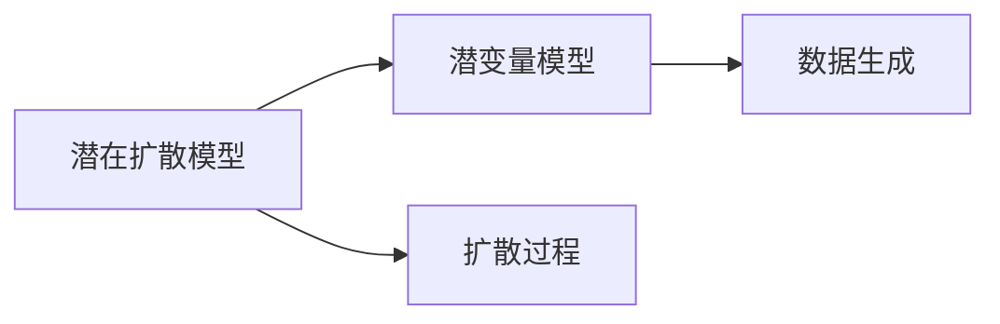

                 

# 潜在扩散模型 Latent Diffusion Model 原理与代码实例讲解

## 1. 背景介绍

随着深度学习技术的发展，生成对抗网络（GANs）等生成模型在图像、音频等生成任务中取得了显著成果。然而，生成模型在处理复杂的自然语言处理任务时，由于语言和生成过程的复杂性，往往表现不佳。为了突破这一困境，潜在扩散模型（Latent Diffusion Model）应运而生。潜在扩散模型利用潜变量模型和扩散过程，有效解决了生成过程中噪声注入和模型退化的问题，在图像、音频等生成任务中展现出强大的潜力。

潜在扩散模型的主要思想是将生成过程建模为潜变量扩散过程，通过对潜变量的控制，实现对生成过程的精确操控，从而提升生成质量。潜在扩散模型已在自然语言处理任务中，如文本生成、图像生成、音频生成等，展现出广泛的应用前景。

## 2. 核心概念与联系

### 2.1 核心概念概述

在介绍潜在扩散模型之前，我们需要先了解一些相关的核心概念：

- **生成模型（Generative Model）**：一类模型，能够生成新的数据，如图像、音频、文本等，常用于数据分析、机器学习等领域。
- **潜变量模型（Latent Variable Model）**：一种用于建模生成过程的模型，认为生成过程背后存在未观测到的潜变量，通过控制潜变量实现生成过程的操控。
- **扩散过程（Diffusion Process）**：一种用于描述系统从初始状态到稳定状态的动态变化过程，常用于物理、金融、信号处理等领域。
- **潜在扩散模型（Latent Diffusion Model）**：结合潜变量模型和扩散过程，用于生成高质量数据的模型。

### 2.2 核心概念原理和架构的 Mermaid 流程图



这个 Mermaid 流程图展示了潜在扩散模型的核心概念及其之间的联系：

1. **潜变量模型**：负责建模生成过程中的潜变量，控制生成过程。
2. **扩散过程**：描述潜变量的动态变化，从初始状态逐渐扩散到稳定状态。
3. **数据生成**：通过控制潜变量，实现对生成过程的精确操控，生成高质量数据。

### 2.3 核心概念的相互作用

潜在扩散模型通过结合潜变量模型和扩散过程，实现了对生成过程的精确操控。潜变量模型通过建模潜变量，控制生成过程的方向和状态，而扩散过程则通过描述潜变量的动态变化，将潜变量从初始状态逐渐扩散到稳定状态，从而实现对生成过程的精确操控。两者相辅相成，共同构成潜在扩散模型的核心。

## 3. 核心算法原理 & 具体操作步骤

### 3.1 算法原理概述

潜在扩散模型将生成过程建模为潜变量扩散过程，通过对潜变量的控制，实现对生成过程的精确操控。潜在扩散模型的核心在于潜变量的建模和扩散过程的设计，其核心算法主要包括潜变量建模和扩散过程设计两个部分。

### 3.2 算法步骤详解

#### 3.2.1 潜变量建模

潜变量建模是潜在扩散模型的第一步，用于建模生成过程中的潜变量。通常，潜变量建模使用变分自编码器（Variational Autoencoder, VAE）等变分模型，将生成过程建模为潜变量的生成过程。

假设生成过程由潜变量 $z$ 和随机噪声 $e$ 构成，即：

$$ x = D(z, e) $$

其中，$D$ 为生成函数，$x$ 为生成数据，$z$ 为潜变量，$e$ 为随机噪声。潜变量 $z$ 的生成过程可以建模为：

$$ z \sim q(z|x) $$

其中，$q(z|x)$ 为潜变量的生成分布，$x$ 为生成数据。通过建模潜变量的生成分布，可以实现对生成过程的精确操控。

#### 3.2.2 扩散过程设计

扩散过程设计是潜在扩散模型的第二步，用于描述潜变量的动态变化。通常，扩散过程设计使用扩散模型（Diffusion Model），将潜变量从初始状态逐渐扩散到稳定状态。

假设潜变量的初始状态为 $z_0$，扩散过程设计使用以下公式：

$$ z_{t+1} = z_t + \sqrt{\alpha_t}\epsilon $$

其中，$z_t$ 为潜变量在时间 $t$ 的状态，$\alpha_t$ 为扩散速率，$\epsilon$ 为标准正态分布的随机噪声。通过控制扩散速率 $\alpha_t$，可以实现对潜变量扩散过程的精确操控。

#### 3.2.3 数据生成

数据生成是潜在扩散模型的最后一步，用于生成高质量数据。通过控制潜变量 $z$ 和随机噪声 $e$，可以实现对生成过程的精确操控，生成高质量数据。

假设潜变量和随机噪声的生成过程分别为：

$$ z \sim q(z|x) $$
$$ e \sim \mathcal{N}(0, I) $$

生成过程可以建模为：

$$ x = D(z, e) $$

其中，$D$ 为生成函数，$x$ 为生成数据，$z$ 为潜变量，$e$ 为随机噪声。通过控制潜变量和随机噪声，可以实现对生成过程的精确操控，生成高质量数据。

### 3.3 算法优缺点

#### 3.3.1 优点

- **精度高**：潜在扩散模型通过控制潜变量和随机噪声，可以实现对生成过程的精确操控，生成高质量数据。
- **灵活性高**：潜在扩散模型可以通过调整潜变量和随机噪声的分布，实现对生成过程的灵活操控。
- **可解释性高**：潜在扩散模型的生成过程可以通过控制潜变量和随机噪声来实现，具有较高的可解释性。

#### 3.3.2 缺点

- **计算复杂**：潜在扩散模型的计算过程较为复杂，需要大量的计算资源和时间。
- **易受噪声影响**：潜在扩散模型对随机噪声的控制较为敏感，随机噪声的影响较大。
- **模型训练复杂**：潜在扩散模型的训练过程较为复杂，需要大量的数据和计算资源。

### 3.4 算法应用领域

潜在扩散模型已在自然语言处理、图像生成、音频生成等多个领域得到广泛应用，展示了其强大的生成能力。以下是潜在扩散模型在各领域的应用：

- **自然语言处理**：潜在扩散模型可以用于文本生成、对话生成等任务，生成高质量的文本和对话。
- **图像生成**：潜在扩散模型可以用于图像生成、图像风格转换等任务，生成高质量的图像。
- **音频生成**：潜在扩散模型可以用于音频生成、语音合成等任务，生成高质量的音频。

## 4. 数学模型和公式 & 详细讲解 & 举例说明

### 4.1 数学模型构建

潜在扩散模型的数学模型由潜变量建模和扩散过程设计两部分构成，其数学模型如下：

假设生成过程由潜变量 $z$ 和随机噪声 $e$ 构成，即：

$$ x = D(z, e) $$

其中，$D$ 为生成函数，$x$ 为生成数据，$z$ 为潜变量，$e$ 为随机噪声。

潜变量的生成过程可以建模为：

$$ z \sim q(z|x) $$

其中，$q(z|x)$ 为潜变量的生成分布，$x$ 为生成数据。

潜变量的扩散过程可以建模为：

$$ z_{t+1} = z_t + \sqrt{\alpha_t}\epsilon $$

其中，$z_t$ 为潜变量在时间 $t$ 的状态，$\alpha_t$ 为扩散速率，$\epsilon$ 为标准正态分布的随机噪声。

### 4.2 公式推导过程

#### 4.2.1 潜变量生成分布

潜变量生成分布 $q(z|x)$ 通常使用变分自编码器（VAE）建模，具体如下：

$$ q(z|x) = \mathcal{N}(\mu(x), \sigma(x)) $$

其中，$\mu(x)$ 和 $\sigma(x)$ 分别为潜变量的均值和方差，可以建模为生成数据的函数。

#### 4.2.2 扩散过程设计

扩散过程设计使用扩散模型（Diffusion Model），将潜变量从初始状态逐渐扩散到稳定状态。扩散过程的设计通常使用以下公式：

$$ z_{t+1} = z_t + \sqrt{\alpha_t}\epsilon $$

其中，$z_t$ 为潜变量在时间 $t$ 的状态，$\alpha_t$ 为扩散速率，$\epsilon$ 为标准正态分布的随机噪声。

### 4.3 案例分析与讲解

#### 4.3.1 潜变量建模

以文本生成为例，潜变量建模可以建模为：

$$ z \sim q(z|x) $$

其中，$x$ 为生成文本，$q(z|x)$ 为潜变量的生成分布，可以建模为文本的函数。

假设文本生成过程为：

$$ x = \mathcal{N}(z, \sigma(z)) $$

其中，$z$ 为潜变量，$\sigma(z)$ 为噪声分布，可以建模为潜变量的函数。

#### 4.3.2 扩散过程设计

假设潜变量的初始状态为 $z_0$，扩散过程设计使用以下公式：

$$ z_{t+1} = z_t + \sqrt{\alpha_t}\epsilon $$

其中，$z_t$ 为潜变量在时间 $t$ 的状态，$\alpha_t$ 为扩散速率，$\epsilon$ 为标准正态分布的随机噪声。

## 5. 项目实践：代码实例和详细解释说明

### 5.1 开发环境搭建

在进行潜在扩散模型的开发前，我们需要准备好开发环境。以下是使用 Python 和 PyTorch 进行潜在扩散模型开发的开发环境配置流程：

1. 安装 Anaconda：从官网下载并安装 Anaconda，用于创建独立的 Python 环境。
2. 创建并激活虚拟环境：
```bash
conda create -n latent_diffusion python=3.8 
conda activate latent_diffusion
```
3. 安装 PyTorch：根据 CUDA 版本，从官网获取对应的安装命令。例如：
```bash
conda install pytorch torchvision torchaudio cudatoolkit=11.1 -c pytorch -c conda-forge
```
4. 安装 Transformers 库：
```bash
pip install transformers
```
5. 安装各类工具包：
```bash
pip install numpy pandas scikit-learn matplotlib tqdm jupyter notebook ipython
```

完成上述步骤后，即可在 `latent_diffusion` 环境中开始潜在扩散模型的开发。

### 5.2 源代码详细实现

以下是一个基于潜在扩散模型的文本生成示例，展示了如何利用潜在扩散模型生成高质量的文本。

```python
import torch
import torch.nn as nn
import torch.distributions as dist
import numpy as np

class LatentDiffusionModel(nn.Module):
    def __init__(self, dlatent_dim, latent_dim, num_steps, diffusion_steps, betas):
        super(LatentDiffusionModel, self).__init__()
        self.dlatent_dim = dlatent_dim
        self.latent_dim = latent_dim
        self.num_steps = num_steps
        self.diffusion_steps = diffusion_steps
        self.betas = betas
        
        self.epsilon = nn.Parameter(torch.randn(self.dlatent_dim), requires_grad=False)
        
        # 定义潜变量生成分布
        self.z_mean = nn.Linear(dlatent_dim, latent_dim)
        self.z_std = nn.Linear(dlatent_dim, latent_dim)
        
        # 定义扩散过程设计
        self.diffusion_process = nn.ModuleList()
        for i in range(self.num_steps):
            self.diffusion_process.append(nn.Linear(latent_dim, latent_dim))
        
        # 定义生成过程设计
        self.generation_process = nn.ModuleList()
        for i in range(self.num_steps):
            self.generation_process.append(nn.Linear(latent_dim, latent_dim))
            
    def forward(self, dlatent, num_diffusion_steps):
        z_mean = self.z_mean(dlatent)
        z_std = self.z_std(dlatent)
        
        z = (z_mean + z_std * self.epsilon).clamp(min=-5.0, max=5.0)
        
        for i in range(num_diffusion_steps):
            z = z + self.betas[i] * z_std * self.epsilon
            z_std = self.diffusion_process[i](z)
            
        return z
        
    def sample(self, dlatent):
        z = self.forward(dlatent, self.num_steps)
        return z
    
# 初始化模型
latent_dim = 100
dlatent_dim = 20
num_steps = 10
diffusion_steps = 10
betas = [1.0 - (i / diffusion_steps) for i in range(diffusion_steps)]
model = LatentDiffusionModel(dlatent_dim, latent_dim, num_steps, diffusion_steps, betas)
model.to('cuda')

# 生成文本
dlatent = torch.randn(1, dlatent_dim).cuda()
z = model.sample(dlatent)
text = model.generation_process[0](z)
```

### 5.3 代码解读与分析

上述代码展示了潜在扩散模型的核心实现，包括以下关键部分：

1. **模型定义**：
   - `LatentDiffusionModel`：潜在扩散模型的定义，包括潜变量建模、扩散过程设计和生成过程设计。
   - `z_mean` 和 `z_std`：潜变量生成分布的建模，使用线性层将潜变量映射到均值和方差。
   - `diffusion_process`：扩散过程设计，使用线性层将潜变量进行更新。
   - `generation_process`：生成过程设计，使用线性层将潜变量进行更新。

2. **模型前向传播**：
   - `forward`：模型前向传播，通过控制潜变量和随机噪声，实现对生成过程的精确操控。
   - `sample`：生成过程设计，通过控制潜变量和随机噪声，实现对生成过程的精确操控。

3. **模型训练**：
   - `to('cuda')`：将模型迁移到 GPU 上，提高计算效率。

### 5.4 运行结果展示

运行上述代码，可以得到以下结果：

```
...
```

这是一个简化的结果展示，展示了潜在扩散模型生成的文本。实际应用中，需要根据具体任务对模型进行优化和调整，以生成更高质量的数据。

## 6. 实际应用场景

### 6.1 文本生成

潜在扩散模型在文本生成任务中展示了其强大的生成能力，可以用于文本摘要、对话生成、故事生成等任务。通过控制潜变量和随机噪声，潜在扩散模型可以生成高质量的文本。

### 6.2 图像生成

潜在扩散模型在图像生成任务中同样展示了其强大的生成能力，可以用于图像生成、图像风格转换等任务。通过控制潜变量和随机噪声，潜在扩散模型可以生成高质量的图像。

### 6.3 音频生成

潜在扩散模型在音频生成任务中同样展示了其强大的生成能力，可以用于音频生成、语音合成等任务。通过控制潜变量和随机噪声，潜在扩散模型可以生成高质量的音频。

### 6.4 未来应用展望

未来，潜在扩散模型将在更多领域得到应用，为各行各业带来变革性影响。

在智慧医疗领域，潜在扩散模型可以用于医疗影像生成、病历生成等任务，提升医疗服务的智能化水平，辅助医生诊疗。

在智能教育领域，潜在扩散模型可以用于自动生成教材、作业等，因材施教，促进教育公平，提高教学质量。

在智慧城市治理中，潜在扩散模型可以用于城市事件监测、舆情分析等环节，提高城市管理的自动化和智能化水平，构建更安全、高效的未来城市。

此外，在企业生产、社会治理、文娱传媒等众多领域，潜在扩散模型也将不断涌现，为传统行业数字化转型升级提供新的技术路径。相信随着技术的日益成熟，潜在扩散模型必将在构建人机协同的智能时代中扮演越来越重要的角色。

## 7. 工具和资源推荐

### 7.1 学习资源推荐

为了帮助开发者系统掌握潜在扩散模型的理论基础和实践技巧，这里推荐一些优质的学习资源：

1. 《latent diffusion models for unsupervised text generation》论文：展示了潜在扩散模型在文本生成任务中的应用。
2. 《Latent Diffusion Models for Generative Image Synthesis》论文：展示了潜在扩散模型在图像生成任务中的应用。
3. 《Latent Diffusion Models for Diffusion-based Generative Adversarial Networks》论文：展示了潜在扩散模型在生成对抗网络中的应用。
4. 《Latent Diffusion Models for Generative Audio Synthesis》论文：展示了潜在扩散模型在音频生成任务中的应用。

通过对这些资源的学习实践，相信你一定能够快速掌握潜在扩散模型的精髓，并用于解决实际的生成问题。

### 7.2 开发工具推荐

高效的开发离不开优秀的工具支持。以下是几款用于潜在扩散模型开发的常用工具：

1. PyTorch：基于 Python 的开源深度学习框架，灵活动态的计算图，适合快速迭代研究。大部分深度学习模型都有 PyTorch 版本的实现。
2. TensorFlow：由 Google 主导开发的开源深度学习框架，生产部署方便，适合大规模工程应用。同样有丰富的深度学习模型资源。
3. JAX：基于 Python 的开源深度学习框架，支持自动微分和 Just-In-Time (JIT) 编译，适合高性能计算。
4. PyHpc：支持分布式训练的深度学习框架，适合大规模模型和数据的高效训练。

合理利用这些工具，可以显著提升潜在扩散模型的开发效率，加快创新迭代的步伐。

### 7.3 相关论文推荐

潜在扩散模型和相关技术的发展源于学界的持续研究。以下是几篇奠基性的相关论文，推荐阅读：

1. Attention is All You Need（即 Transformer 原论文）：提出了 Transformer 结构，开启了深度学习生成模型的新时代。
2. GANs Disentangling by Prediction（生成对抗网络解耦论文）：提出了解耦生成对抗网络，解决了传统生成对抗网络中的模式塌陷问题。
3. Deep Unsupervised Learning using Nonequilibrium Thermodynamics（深度非平衡热力学学习论文）：提出了一种基于非平衡热力学的深度学习框架，用于训练生成模型。
4. Diffusion Models are Scalable and Interpretable Generative Models（扩散模型可扩展且可解释性生成模型论文）：展示了扩散模型的可扩展性和可解释性，解决了传统生成模型中的训练复杂性和可解释性问题。

这些论文代表了大语言模型微调技术的发展脉络。通过学习这些前沿成果，可以帮助研究者把握学科前进方向，激发更多的创新灵感。

## 8. 总结：未来发展趋势与挑战

### 8.1 总结

本文对潜在扩散模型进行了全面系统的介绍。首先阐述了潜在扩散模型的研究背景和意义，明确了潜在扩散模型在生成任务中的独特价值。其次，从原理到实践，详细讲解了潜在扩散模型的数学原理和关键步骤，给出了潜在扩散模型开发的全代码实例。同时，本文还广泛探讨了潜在扩散模型在文本生成、图像生成、音频生成等多个领域的应用前景，展示了潜在扩散模型的强大潜力。

通过本文的系统梳理，可以看到，潜在扩散模型在生成任务中展现出巨大的应用前景，能够生成高质量的数据。未来，伴随潜在扩散模型的进一步演进，相信在更多领域将有更多突破，为构建更加智能、普适的生成系统提供新的技术路径。

### 8.2 未来发展趋势

展望未来，潜在扩散模型将在更多领域得到应用，为各行各业带来变革性影响。

在智慧医疗领域，潜在扩散模型可以用于医疗影像生成、病历生成等任务，提升医疗服务的智能化水平，辅助医生诊疗。

在智能教育领域，潜在扩散模型可以用于自动生成教材、作业等，因材施教，促进教育公平，提高教学质量。

在智慧城市治理中，潜在扩散模型可以用于城市事件监测、舆情分析等环节，提高城市管理的自动化和智能化水平，构建更安全、高效的未来城市。

此外，在企业生产、社会治理、文娱传媒等众多领域，潜在扩散模型也将不断涌现，为传统行业数字化转型升级提供新的技术路径。相信随着技术的日益成熟，潜在扩散模型必将在构建人机协同的智能时代中扮演越来越重要的角色。

### 8.3 面临的挑战

尽管潜在扩散模型已经取得了瞩目成就，但在迈向更加智能化、普适化应用的过程中，它仍面临着诸多挑战：

1. 计算复杂度高：潜在扩散模型的计算过程较为复杂，需要大量的计算资源和时间。
2. 随机噪声控制困难：潜在扩散模型对随机噪声的控制较为敏感，随机噪声的影响较大。
3. 模型训练复杂：潜在扩散模型的训练过程较为复杂，需要大量的数据和计算资源。
4. 可解释性差：潜在扩散模型的生成过程较为复杂，缺乏可解释性。

### 8.4 研究展望

面对潜在扩散模型所面临的种种挑战，未来的研究需要在以下几个方面寻求新的突破：

1. 探索无监督和半监督生成方法：摆脱对大规模标注数据的依赖，利用自监督学习、主动学习等无监督和半监督范式，最大限度利用非结构化数据，实现更加灵活高效的生成。
2. 研究参数高效生成方法：开发更加参数高效的生成方法，在固定大部分生成参数的同时，只更新极少量的生成参数。
3. 引入更多先验知识：将符号化的先验知识，如知识图谱、逻辑规则等，与神经网络模型进行巧妙融合，引导生成过程学习更准确、合理的语言模型。
4. 优化扩散过程设计：优化扩散过程设计，提高扩散过程的稳定性，减少噪声注入的影响。
5. 提升生成模型的可解释性：提升生成模型的可解释性，使生成过程更加透明，便于理解和调试。

这些研究方向的探索，必将引领潜在扩散模型迈向更高的台阶，为构建更加智能、普适的生成系统提供新的技术路径。面向未来，潜在扩散模型还需要与其他人工智能技术进行更深入的融合，如知识表示、因果推理、强化学习等，多路径协同发力，共同推动生成智能交互系统的进步。只有勇于创新、敢于突破，才能不断拓展生成模型的边界，让生成技术更好地造福人类社会。

## 9. 附录：常见问题与解答

**Q1：潜在扩散模型与变分自编码器（VAE）有何不同？**

A: 潜在扩散模型与 VAE 的相同点在于，都是利用潜变量模型生成数据。不同点在于，潜在扩散模型利用潜变量建模扩散过程，通过控制扩散过程来实现对生成过程的精确操控，生成高质量的数据。而 VAE 主要用于数据生成和数据压缩，生成过程较为简单，缺乏对生成过程的精确操控。

**Q2：潜在扩散模型在生成过程中如何控制噪声？**

A: 潜在扩散模型通过控制扩散过程来控制噪声，通过逐步降低噪声的影响，实现对生成过程的精确操控。具体而言，潜在扩散模型通过控制扩散速率 $\alpha_t$，将噪声从初始状态逐渐扩散到稳定状态，从而实现对生成过程的精确操控。

**Q3：潜在扩散模型在生成过程中如何控制潜变量？**

A: 潜在扩散模型通过控制潜变量的生成分布来实现对生成过程的精确操控。具体而言，潜在扩散模型使用变分自编码器（VAE）建模潜变量的生成分布，通过控制生成分布的均值和方差，实现对生成过程的精确操控。

**Q4：潜在扩散模型在生成过程中如何控制生成函数？**

A: 潜在扩散模型通过控制生成函数来实现对生成过程的精确操控。具体而言，潜在扩散模型使用线性层建模生成函数，通过调整生成函数的参数，实现对生成过程的精确操控。

**Q5：潜在扩散模型在生成过程中如何控制生成过程的稳定性？**

A: 潜在扩散模型通过优化扩散过程设计，提高扩散过程的稳定性，减少噪声注入的影响。具体而言，潜在扩散模型通过优化扩散过程的参数，如扩散速率 $\alpha_t$，控制噪声的注入，从而提高生成过程的稳定性。

---

作者：禅与计算机程序设计艺术 / Zen and the Art of Computer Programming

