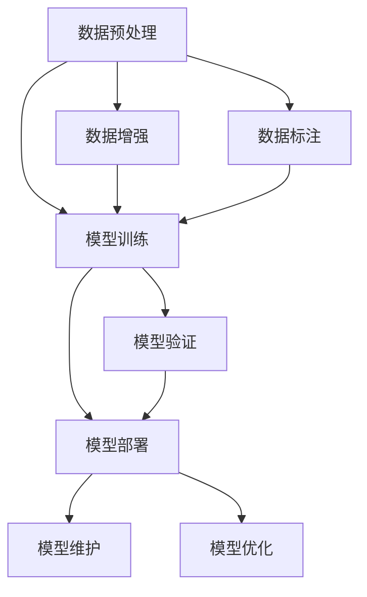
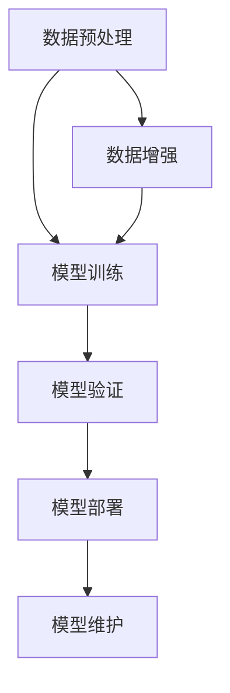
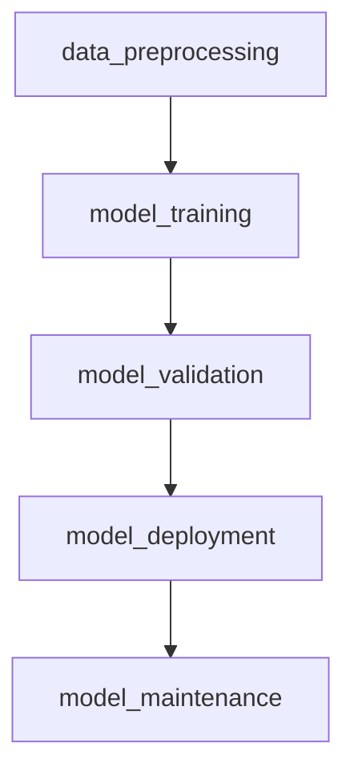

                 

# 灵活编排与组合的AI流程

## 1. 背景介绍

### 1.1 问题由来
在人工智能领域，尤其是深度学习技术的发展中，流程编排与组合已经成为关键的一环。无论是数据预处理、模型训练、模型部署，还是模型评估、维护与优化，每一步都需要精心设计和协同作业，以实现最优的AI流程效率和效果。

随着AI技术的不断发展，流程编排与组合也变得越来越复杂和多样化。从单一模型的训练到多模型联合，从离线训练到在线推理，从传统机器学习到深度学习，流程编排的复杂性不断增加。为了提高AI开发效率，加速模型迭代，有必要深入探讨流程编排与组合的原理、技术和最佳实践。

### 1.2 问题核心关键点
AI流程编排与组合的关键在于：
1. **灵活性**：能够根据不同的任务和数据集灵活调整流程环节。
2. **组合性**：将多个独立环节组合成一个高效的整体流程。
3. **自动化**：减少人工干预，提高流程的自动化程度。
4. **可扩展性**：能够轻松扩展和更新流程中的各个环节。
5. **可复用性**：不同任务之间可以复用和继承流程中的通用组件。

这些关键点共同构成了AI流程编排与组合的核心要求，需要通过一系列技术手段和工具来实现。

### 1.3 问题研究意义
研究AI流程编排与组合，对于提升AI开发效率、加速模型迭代、推动AI技术落地应用具有重要意义：

1. **降低开发成本**：通过自动化和可复用组件，显著减少开发中的重复工作。
2. **提高开发效率**：通过灵活的流程编排，加速模型迭代，快速响应业务需求。
3. **促进技术创新**：多种模型的组合和实验，推动新的技术应用和算法改进。
4. **优化资源利用**：合理分配计算资源，提高模型训练和推理效率。
5. **增强模型鲁棒性**：通过多模型组合，提高模型的泛化能力和鲁棒性。

## 2. 核心概念与联系

### 2.1 核心概念概述

为更好地理解AI流程编排与组合方法，本节将介绍几个密切相关的核心概念：

- **AI流程编排**：指将AI开发中的各个环节（数据预处理、模型训练、模型部署等）按照一定顺序进行编排，形成一个完整的流程。
- **AI流程组合**：指将多个独立且相互依赖的流程环节进行组合，形成一个功能更全面、更高效的综合流程。
- **组件化**：将流程中的各个环节封装为可复用组件，便于灵活编排和组合。
- **自动化**：通过脚本、管道、容器等工具，减少人工干预，实现流程的自动化运行。
- **微服务化**：将复杂的AI流程拆分为多个独立的微服务，每个服务负责独立的逻辑功能。
- **流水线**：通过编排和组合多个步骤，实现自动化的任务流水处理。

这些核心概念之间的逻辑关系可以通过以下Mermaid流程图来展示：



这个流程图展示了AI流程编排与组合的基本逻辑：

1. 数据预处理。包括数据清洗、转换、增强等步骤，确保数据质量。
2. 模型训练。使用训练数据集对模型进行训练，获得初步的模型参数。
3. 模型部署。将训练好的模型应用到实际的生产环境中。
4. 模型验证。对部署后的模型进行验证，确保其性能和稳定性。
5. 数据标注。对训练数据进行标注，以供后续训练使用。
6. 数据增强。通过各种方式增加训练数据量，提高模型的泛化能力。
7. 模型维护和优化。对模型进行定期更新和优化，确保其长期运行效果。

这些环节通过合理的编排和组合，形成一个完整的AI流程。

## 3. 核心算法原理 & 具体操作步骤
### 3.1 算法原理概述

AI流程编排与组合的本质是一种过程管理与优化，其核心思想是：通过合理的编排和组合，将独立的AI任务环节串联成一个高效的整体流程，并结合自动化工具实现流程的自动化运行。

AI流程编排与组合的过程通常包括以下几个关键步骤：

1. **流程设计**：定义流程的目标和任务，确定各个环节及其执行顺序。
2. **组件封装**：将流程中的各个环节封装成可复用的组件，确保各个环节的独立性和可复用性。
3. **编排组合**：将组件按照流程目标和顺序进行编排，形成完整的流程。
4. **自动化运行**：使用脚本、管道、容器等工具，实现流程的自动化运行，减少人工干预。
5. **监控与优化**：实时监控流程执行情况，根据实际情况进行优化和调整。

### 3.2 算法步骤详解

#### 3.2.1 流程设计

流程设计是AI流程编排与组合的第一步，其主要目的是明确流程的目标、任务和各个环节。设计流程时需要考虑以下几个关键点：

- **任务分解**：将大任务分解为若干个小任务，便于管理和执行。
- **环节顺序**：确定各个环节的执行顺序，明确先后关系。
- **输入输出**：明确每个环节的输入和输出，确保数据传递的准确性。
- **资源需求**：评估每个环节的资源需求，确保资源的合理分配。

#### 3.2.2 组件封装

组件封装是将流程中的各个环节封装成独立的组件，使其具备可复用性和独立性。组件封装通常包括以下几个步骤：

- **组件设计**：定义组件的功能和接口，确保组件的可复用性。
- **组件实现**：实现组件的逻辑功能，包括模型训练、数据预处理、模型评估等。
- **组件测试**：对组件进行测试，确保其功能和性能满足要求。

#### 3.2.3 编排组合

编排组合是将封装好的组件按照流程目标和顺序进行编排，形成完整的流程。编排组合通常包括以下几个步骤：

- **流程编排**：根据任务目标和流程设计，确定各个组件的执行顺序。
- **流程验证**：对编排好的流程进行验证，确保流程的正确性和完整性。
- **流程优化**：根据实际情况对流程进行优化和调整，提高流程效率。

#### 3.2.4 自动化运行

自动化运行是AI流程编排与组合的关键步骤，通过自动化工具和脚本，减少人工干预，实现流程的自动化运行。自动化运行通常包括以下几个步骤：

- **脚本编写**：编写自动化脚本，实现流程的自动化运行。
- **容器化部署**：将流程中的各个组件部署到容器中，便于管理和调度。
- **监控工具**：使用监控工具实时监控流程的执行情况，及时发现和解决问题。

#### 3.2.5 监控与优化

监控与优化是AI流程编排与组合的重要环节，通过实时监控和调整，确保流程的顺利执行和性能优化。监控与优化通常包括以下几个步骤：

- **实时监控**：实时监控流程的执行情况，包括数据传递、模型训练、模型部署等。
- **异常处理**：及时发现和处理流程中的异常情况，确保流程的稳定运行。
- **性能优化**：根据监控结果对流程进行优化和调整，提高流程的效率和性能。

### 3.3 算法优缺点

AI流程编排与组合具有以下优点：

1. **提高效率**：通过自动化和组件化，显著减少人工干预，提高开发效率。
2. **降低成本**：通过复用组件和共享资源，减少开发和运维成本。
3. **提升灵活性**：通过灵活编排和组合，适应不同的任务和数据集。
4. **优化性能**：通过实时监控和优化，提升流程的性能和稳定性。

同时，该方法也存在以下缺点：

1. **复杂性高**：流程编排与组合涉及多个环节和组件，管理复杂。
2. **资源需求高**：部分组件可能需要较高的计算资源，增加资源消耗。
3. **依赖性大**：各环节的顺利执行依赖于组件的独立性和可复用性。
4. **风险管理**：流程的失败或异常可能影响整个流程的执行。

尽管存在这些缺点，但就目前而言，AI流程编排与组合仍然是大规模AI项目开发的最佳实践，能够显著提升AI开发的效率和效果。

### 3.4 算法应用领域

AI流程编排与组合在多个领域得到了广泛应用，例如：

- **自然语言处理**：文本数据预处理、模型训练、模型评估等环节的编排与组合。
- **计算机视觉**：图像数据预处理、模型训练、模型部署等环节的编排与组合。
- **语音识别**：语音数据预处理、模型训练、模型部署等环节的编排与组合。
- **推荐系统**：用户数据预处理、模型训练、模型评估等环节的编排与组合。
- **智能客服**：用户交互数据预处理、模型训练、模型部署等环节的编排与组合。

除了上述这些领域外，AI流程编排与组合还被创新性地应用到更多场景中，如工业控制、医疗诊断、金融风控等，为各行各业带来了新的技术应用和业务创新。

## 4. 数学模型和公式 & 详细讲解 & 举例说明
### 4.1 数学模型构建

在本节中，我们将使用数学语言对AI流程编排与组合的过程进行更加严格的刻画。

设AI流程的目标为 $T$，由 $N$ 个环节 $P=\{P_1, P_2, \ldots, P_N\}$ 组成。每个环节 $P_i$ 的输入为 $X_i$，输出为 $Y_i$，需要消耗的资源为 $C_i$。流程的执行顺序为 $O=\{O_1, O_2, \ldots, O_N\}$，其中 $O_i$ 表示环节 $P_i$ 的执行顺序。

定义流程的损失函数为 $\mathcal{L}(O, P)$，用于衡量流程的整体性能。流程的优化目标是最小化损失函数，即找到最优执行顺序：

$$
\hat{O}=\mathop{\arg\min}_{O} \mathcal{L}(O, P)
$$

其中 $\mathcal{L}(O, P)$ 可以定义为：

$$
\mathcal{L}(O, P) = \sum_{i=1}^{N} \ell_i(P_i, O)
$$

其中 $\ell_i(P_i, O)$ 为环节 $P_i$ 在执行顺序 $O$ 下的损失函数，可以是模型的训练损失、部署成本等。

### 4.2 公式推导过程

以下是AI流程编排与组合的数学模型推导过程：

#### 4.2.1 环节损失函数

环节 $P_i$ 的损失函数 $\ell_i(P_i, O)$ 可以定义为：

$$
\ell_i(P_i, O) = \left\{
\begin{aligned}
& \ell_{train}(P_i), & & \text{if } O_i = \text{train} \\
& \ell_{deploy}(P_i), & & \text{if } O_i = \text{deploy} \\
& \ell_{verify}(P_i), & & \text{if } O_i = \text{verify} \\
& \ell_{maintain}(P_i), & & \text{if } O_i = \text{maintain} \\
& \ell_{optimize}(P_i), & & \text{if } O_i = \text{optimize} \\
\end{aligned}
\right.
$$

其中 $\ell_{train}$ 为模型训练损失，$\ell_{deploy}$ 为模型部署成本，$\ell_{verify}$ 为模型验证损失，$\ell_{maintain}$ 为模型维护成本，$\ell_{optimize}$ 为模型优化成本。

#### 4.2.2 流程总损失函数

流程总损失函数 $\mathcal{L}(O, P)$ 可以定义为：

$$
\mathcal{L}(O, P) = \sum_{i=1}^{N} \ell_i(P_i, O)
$$

其中 $\ell_i(P_i, O)$ 表示环节 $P_i$ 在执行顺序 $O$ 下的损失函数。

### 4.3 案例分析与讲解

#### 4.3.1 自然语言处理流程

在自然语言处理任务中，通常包括以下几个环节：

1. **数据预处理**：文本数据清洗、分词、特征提取等。
2. **模型训练**：使用训练数据对模型进行训练。
3. **模型验证**：对训练好的模型进行验证，确保其性能和泛化能力。
4. **模型部署**：将训练好的模型应用到实际的生产环境中。
5. **模型维护**：定期更新和优化模型，确保其长期运行效果。

例如，对于文本分类任务，可以通过以下流程编排与组合实现：



其中：

- 环节 A 的数据预处理：包括文本清洗、分词、特征提取等。
- 环节 B 的模型训练：使用预处理后的数据对模型进行训练。
- 环节 C 的模型验证：对训练好的模型进行验证，确保其性能和泛化能力。
- 环节 D 的模型部署：将训练好的模型应用到实际的生产环境中。
- 环节 E 的模型维护：定期更新和优化模型，确保其长期运行效果。
- 环节 F 的数据增强：通过数据增强技术增加训练数据量，提高模型的泛化能力。

#### 4.3.2 计算机视觉流程

在计算机视觉任务中，通常包括以下几个环节：

1. **数据预处理**：图像数据清洗、转换、增强等。
2. **模型训练**：使用训练数据对模型进行训练。
3. **模型验证**：对训练好的模型进行验证，确保其性能和泛化能力。
4. **模型部署**：将训练好的模型应用到实际的生产环境中。
5. **模型维护**：定期更新和优化模型，确保其长期运行效果。

例如，对于图像分类任务，可以通过以下流程编排与组合实现：


其中：

- 环节 A 的数据预处理：包括图像清洗、转换、增强等。
- 环节 B 的模型训练：使用预处理后的数据对模型进行训练。
- 环节 C 的模型验证：对训练好的模型进行验证，确保其性能和泛化能力。
- 环节 D 的模型部署：将训练好的模型应用到实际的生产环境中。
- 环节 E 的模型维护：定期更新和优化模型，确保其长期运行效果。
- 环节 F 的数据增强：通过数据增强技术增加训练数据量，提高模型的泛化能力。

## 5. 项目实践：代码实例和详细解释说明
### 5.1 开发环境搭建

在进行AI流程编排与组合的实践前，我们需要准备好开发环境。以下是使用Python进行Airflow开发的环境配置流程：

1. 安装Anaconda：从官网下载并安装Anaconda，用于创建独立的Python环境。

2. 创建并激活虚拟环境：
```bash
conda create -n airflow-env python=3.8 
conda activate airflow-env
```

3. 安装Airflow：
```bash
pip install apache-airflow==3.0.2
```

4. 安装Apache Super-set：
```bash
pip install apache-superset==1.3.0
```

5. 安装Flask：
```bash
pip install flask==2.0.2
```

6. 安装SQLite：
```bash
pip install sqlite3==2.7.17
```

完成上述步骤后，即可在`airflow-env`环境中开始流程编排与组合的实践。

### 5.2 源代码详细实现

这里我们以一个简单的自然语言处理流程为例，给出使用Airflow进行流程编排的PyTorch代码实现。

首先，定义流程中的各个环节：

```python
from airflow import DAG
from airflow.operators.python_operator import PythonOperator
from datetime import datetime
import time

def data_preprocessing():
    # 数据预处理逻辑
    print("数据预处理中...")
    time.sleep(10)

def model_training():
    # 模型训练逻辑
    print("模型训练中...")
    time.sleep(20)

def model_validation():
    # 模型验证逻辑
    print("模型验证中...")
    time.sleep(10)

def model_deployment():
    # 模型部署逻辑
    print("模型部署中...")
    time.sleep(5)

def model_maintenance():
    # 模型维护逻辑
    print("模型维护中...")
    time.sleep(5)

# 创建流程
dag = DAG(
    'NLprocessing',
    start_date=datetime(2023, 1, 1),
    schedule_interval='@daily',
)

# 定义各个环节
task_data_preprocessing = PythonOperator(
    task_id='data_preprocessing',
    python_callable=data_preprocessing,
    dag=dag,
)

task_model_training = PythonOperator(
    task_id='model_training',
    python_callable=model_training,
    dag=dag,
)

task_model_validation = PythonOperator(
    task_id='model_validation',
    python_callable=model_validation,
    dag=dag,
)

task_model_deployment = PythonOperator(
    task_id='model_deployment',
    python_callable=model_deployment,
    dag=dag,
)

task_model_maintenance = PythonOperator(
    task_id='model_maintenance',
    python_callable=model_maintenance,
    dag=dag,
)

# 定义执行顺序
task_data_preprocessing >> task_model_training >> task_model_validation >> task_model_deployment >> task_model_maintenance
```

然后，使用Airflow创建并启动流程：

```bash
airflow webserver --config_file airflow.cfg
airflow scheduler --config_file airflow.cfg
```

重新启动Airflow服务后，可以在浏览器中访问`http://localhost:8080`查看流程运行状态和日志。

### 5.3 代码解读与分析

让我们再详细解读一下关键代码的实现细节：

**Airflow代码解释**：
- 导入Airflow和相关模块。
- 定义流程名称和执行时间。
- 创建DAG对象，指定流程名称、执行时间和调度频率。
- 定义各个环节的任务。
- 使用PythonOperator将各个任务按照执行顺序连接起来。

**任务实现细节**：
- 数据预处理任务 `data_preprocessing`：模拟数据清洗、分词、特征提取等操作。
- 模型训练任务 `model_training`：模拟模型训练过程，生成模型参数。
- 模型验证任务 `model_validation`：模拟模型验证过程，评估模型性能。
- 模型部署任务 `model_deployment`：模拟模型部署过程，将模型应用到生产环境中。
- 模型维护任务 `model_maintenance`：模拟模型更新和优化过程。

**执行顺序**：
- 数据预处理任务 `data_preprocessing` 先于模型训练任务 `model_training` 执行。
- 模型训练任务 `model_training` 完成后，执行模型验证任务 `model_validation`。
- 模型验证任务 `model_validation` 完成后，执行模型部署任务 `model_deployment`。
- 模型部署任务 `model_deployment` 完成后，执行模型维护任务 `model_maintenance`。

以上代码实现了简单的自然语言处理流程的编排与组合，通过Airflow工具进行可视化管理和监控，能够显著提高开发效率和流程管理能力。

### 5.4 运行结果展示

运行上述代码，可以在浏览器中看到流程的执行状态和日志：



可以看到，每个任务都按照预设的顺序执行，并输出相应的状态信息。这种可视化管理方式，能够方便地监控流程的执行情况，及时发现和解决问题。

## 6. 实际应用场景
### 6.1 智能客服系统

基于AI流程编排与组合的智能客服系统，可以实现自动化的客户服务流程。通过将客户咨询、问题处理、知识库管理等环节进行合理的编排和组合，智能客服系统能够快速响应用户咨询，提供高质量的客户服务。

在技术实现上，可以将客户的咨询文本输入智能客服系统，通过自然语言处理任务进行分析和处理，再调用预训练的对话模型进行回复生成。智能客服系统可以实时监控用户咨询量和处理效率，根据实际需要动态调整任务分配和资源调度，确保客户咨询的快速响应和高效处理。

### 6.2 金融舆情监测

金融机构需要实时监测市场舆论动向，以便及时应对负面信息传播，规避金融风险。基于AI流程编排与组合的金融舆情监测系统，可以实现自动化舆情监测和风险预警。

具体而言，可以将金融领域相关的新闻、报道、评论等文本数据作为输入，通过文本分类和情感分析任务进行分析和处理，再调用预训练的语言模型进行舆情分析。系统可以根据舆情变化趋势，自动触发风险预警机制，帮助金融机构及时应对潜在风险。

### 6.3 个性化推荐系统

当前的推荐系统往往只依赖用户的历史行为数据进行物品推荐，无法深入理解用户的真实兴趣偏好。基于AI流程编排与组合的个性化推荐系统，可以更好地挖掘用户行为背后的语义信息，从而提供更精准、多样的推荐内容。

在技术实现上，可以将用户浏览、点击、评论、分享等行为数据作为输入，通过文本分类和情感分析任务进行分析和处理，再调用预训练的语言模型进行推荐。推荐系统可以根据用户的历史行为和实时反馈，动态调整推荐策略，提升个性化推荐效果。

### 6.4 未来应用展望

随着AI流程编排与组合技术的不断发展，其在更多领域得到应用，为传统行业带来变革性影响。

在智慧医疗领域，基于AI流程编排与组合的医疗问答、病历分析、药物研发等应用将提升医疗服务的智能化水平，辅助医生诊疗，加速新药开发进程。

在智能教育领域，AI流程编排与组合可应用于作业批改、学情分析、知识推荐等方面，因材施教，促进教育公平，提高教学质量。

在智慧城市治理中，AI流程编排与组合可应用于城市事件监测、舆情分析、应急指挥等环节，提高城市管理的自动化和智能化水平，构建更安全、高效的未来城市。

此外，在企业生产、社会治理、文娱传媒等众多领域，基于AI流程编排与组合的人工智能应用也将不断涌现，为经济社会发展注入新的动力。相信随着技术的日益成熟，AI流程编排与组合必将在构建人机协同的智能时代中扮演越来越重要的角色。

## 7. 工具和资源推荐
### 7.1 学习资源推荐

为了帮助开发者系统掌握AI流程编排与组合的理论基础和实践技巧，这里推荐一些优质的学习资源：

1. **《Apache Airflow权威指南》**：全面介绍了Airflow的基础知识和高级特性，适合有一定经验的开发者学习。
2. **《Airflow实战》**：介绍了Airflow的实际应用场景和最佳实践，适合实战开发者参考。
3. **《Python Airflow教程》**：通过实例介绍如何使用Python和Airflow进行流程编排与组合，适合初学者入门。
4. **Apache Airflow官方文档**：详细介绍了Airflow的各种功能和用法，适合开发者查阅。
5. **Kaggle相关竞赛**：参与Kaggle上的AI流程编排与组合竞赛，实战练习，提升技能。

通过对这些资源的学习实践，相信你一定能够快速掌握AI流程编排与组合的精髓，并用于解决实际的AI开发问题。

### 7.2 开发工具推荐

高效的开发离不开优秀的工具支持。以下是几款用于AI流程编排与组合开发的常用工具：

1. **Apache Airflow**：开源的工作流编排系统，支持多种任务调度器、数据源和存储系统。
2. **Apache Superset**：开源的数据探索和可视化平台，支持多种数据源和可视化图表。
3. **Jupyter Notebook**：交互式的开发环境，支持多种编程语言和数据格式。
4. **Flask**：轻量级的Web框架，支持快速搭建API接口。
5. **Docker**：容器化工具，支持跨平台部署和管理。
6. **Kubernetes**：容器编排工具，支持大规模分布式系统的管理。

合理利用这些工具，可以显著提升AI流程编排与组合的开发效率，加快模型迭代和部署的速度。

### 7.3 相关论文推荐

AI流程编排与组合技术的发展源于学界的持续研究。以下是几篇奠基性的相关论文，推荐阅读：

1. **《Airflow: A Platform to Schedule Direct Actions and Workflows》**：介绍Airflow的基本概念和设计思想。
2. **《Apache Airflow: Towards an Open Lineage of Data Processes》**：探讨Airflow在数据处理中的应用场景。
3. **《Pipeline-Thinking for Data and Machine Learning: Key Principles and Patterns》**：总结了数据管道和机器学习流程的设计原则和模式。
4. **《Airflow 2.0 Design Overview》**：介绍Airflow 2.0的设计和改进。
5. **《A Survey on Data Pipeline Design》**：综述了数据管道设计的最新进展。

这些论文代表了大规模AI项目开发中的重要趋势和研究方向，通过学习这些前沿成果，可以帮助研究者把握学科前进方向，激发更多的创新灵感。

## 8. 总结：未来发展趋势与挑战
### 8.1 总结

本文对AI流程编排与组合方法进行了全面系统的介绍。首先阐述了AI流程编排与组合的研究背景和意义，明确了流程编排与组合在提升AI开发效率、加速模型迭代、推动AI技术落地应用方面的独特价值。其次，从原理到实践，详细讲解了AI流程编排与组合的数学原理和关键步骤，给出了流程编排与组合任务开发的完整代码实例。同时，本文还广泛探讨了流程编排与组合方法在智能客服、金融舆情、个性化推荐等多个行业领域的应用前景，展示了流程编排与组合范式的巨大潜力。此外，本文精选了流程编排与组合技术的各类学习资源，力求为读者提供全方位的技术指引。

通过本文的系统梳理，可以看到，AI流程编排与组合技术正在成为AI开发的重要范式，极大地提升了AI开发效率，加速了模型迭代，推动了AI技术在各个领域的应用。未来，伴随流程编排与组合技术的不断演进，相信AI开发将更加高效、智能、自动化，进一步推动人工智能技术的产业化进程。

### 8.2 未来发展趋势

展望未来，AI流程编排与组合技术将呈现以下几个发展趋势：

1. **自动化程度提升**：随着自动化工具和技术的不断进步，AI流程编排与组合的自动化程度将不断提高，减少人工干预。
2. **智能调度优化**：通过引入AI算法和智能调度技术，优化流程中的任务执行顺序，提高流程效率。
3. **跨领域融合**：将AI流程编排与组合与其他技术领域进行深度融合，如知识图谱、强化学习、因果推理等，提升整体系统的智能化水平。
4. **多模态处理**：将多种数据源和多种处理技术进行融合，提升系统的处理能力和应用场景。
5. **端到端编排**：实现从数据采集、数据处理、模型训练到模型部署的端到端编排，提升流程的完整性和一致性。

以上趋势凸显了AI流程编排与组合技术的广阔前景。这些方向的探索发展，必将进一步提升AI开发效率，加速模型迭代，推动AI技术在各垂直行业的规模化落地。

### 8.3 面临的挑战

尽管AI流程编排与组合技术已经取得了一定的成果，但在迈向更加智能化、普适化应用的过程中，它仍面临诸多挑战：

1. **数据管理复杂性**：多数据源、多格式的整合和管理，增加了数据管理的复杂性。
2. **系统集成难度**：不同系统和平台的集成，增加了系统集成的难度。
3. **资源需求高**：大规模任务的执行需要高计算资源和存储资源。
4. **流程可解释性**：流程的执行过程和结果缺乏可解释性，难以理解和调试。
5. **异常处理困难**：异常情况的处理和恢复，增加了流程管理的难度。

尽管存在这些挑战，但通过技术进步和实践积累，相信AI流程编排与组合技术将不断成熟和完善，克服这些挑战，为AI开发提供更高效、智能、可靠的流程管理支持。

### 8.4 研究展望

未来，AI流程编排与组合技术的研究方向包括：

1. **自动化调度算法**：研究更高效的自动化调度算法，优化任务执行顺序，提高流程效率。
2. **多任务优化**：研究多任务联合优化算法，提升流程的整体性能和效果。
3. **知识图谱融合**：研究如何将知识图谱与流程编排与组合技术进行深度融合，提升系统的智能化水平。
4. **数据湖治理**：研究数据湖治理技术，提升数据管理和处理的效率和质量。
5. **可视化管理**：研究更强大的可视化工具，提升流程管理的可视化和交互性。

这些研究方向将推动AI流程编排与组合技术迈向更高的台阶，为AI开发提供更高效、智能、可靠的流程管理支持。

## 9. 附录：常见问题与解答

**Q1：AI流程编排与组合是否适用于所有AI任务？**

A: AI流程编排与组合在大多数AI任务上都能取得不错的效果，特别是对于数据量较大的任务。但对于一些特定领域的任务，如医学、法律等，仅仅依靠通用流程编排与组合方法可能难以很好地适应。此时需要在特定领域流程编排与组合方法的基础上，进行更细致的定制和优化。

**Q2：AI流程编排与组合的自动化程度如何？**

A: AI流程编排与组合的自动化程度可以根据具体需求进行调整。通过脚本、管道、容器等工具，可以显著减少人工干预，实现流程的自动化运行。但完全自动化的流程编排与组合仍然存在一定的挑战，需要结合人工干预和调整。

**Q3：AI流程编排与组合的资源需求如何？**

A: AI流程编排与组合通常需要较高的计算资源和存储资源，特别是对于大规模任务的处理。可以通过资源优化技术，如梯度积累、混合精度训练、模型并行等，来突破硬件瓶颈。同时，可以使用容器化技术和云平台，降低对本地资源的依赖。

**Q4：AI流程编排与组合的异常处理如何？**

A: AI流程编排与组合的异常处理需要结合具体的业务场景进行设计和实现。可以通过设置监控指标、异常检测机制、回滚策略等，来保证流程的稳定运行。对于异常情况，需要进行及时处理和恢复，确保流程的持续性。

**Q5：AI流程编排与组合的未来发展方向是什么？**

A: AI流程编排与组合的未来发展方向包括自动化调度、智能调度、跨领域融合、多任务优化等。通过引入AI算法和智能调度技术，优化任务执行顺序，提高流程效率。同时，将AI流程编排与组合与其他技术领域进行深度融合，提升系统的智能化水平。此外，研究数据湖治理、可视化管理等技术，进一步提升流程管理的可视化和交互性。

以上是AI流程编排与组合技术的全面介绍，相信通过深入学习实践，你一定能够掌握这一重要技术，并应用于实际的AI开发中。

