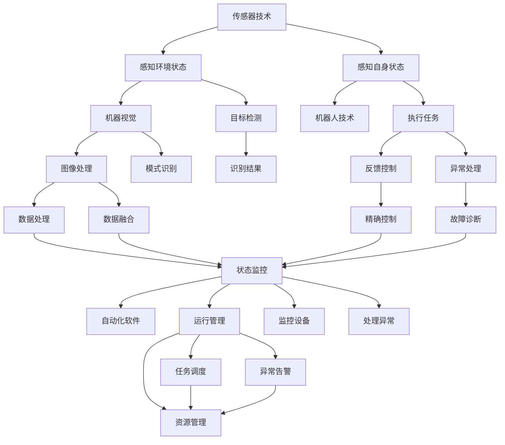

                 

## 1. 背景介绍

### 1.1 问题由来
随着自动化技术的飞速发展，物理实体的自动化应用已经成为现代制造业、物流、仓储、智能家居等多个领域的重要发展方向。自动化不仅提升了效率、降低了成本，还能提高安全性、减少人为错误。本文旨在探讨物理实体的自动化应用及其未来趋势，从理论到实践，系统性地介绍自动化技术的发展和应用。

### 1.2 问题核心关键点
本文将从以下几个方面展开讨论：
- 物理实体的自动化概念及核心技术
- 物理实体自动化的应用场景
- 物理实体自动化的未来趋势
- 物理实体自动化的挑战与对策

### 1.3 问题研究意义
物理实体的自动化应用不仅推动了传统行业转型升级，还在提升生产效率、降低运营成本、改善用户体验等方面发挥了重要作用。通过深入研究，本文希望能为行业从业者提供全面的技术指引，帮助他们更好地应对自动化转型。

## 2. 核心概念与联系

### 2.1 核心概念概述

#### 2.1.1 物理实体
物理实体指的是可以物理存在、由物体或设备构成的系统。在自动化应用中，物理实体可以是工业机器人、自动化流水线、智能仓储系统、智能家居设备等。

#### 2.1.2 自动化
自动化是指通过计算机程序、传感器、控制算法等手段，使得物理实体能够自主执行任务，无需人工干预。自动化技术可以分为机械自动化、电气自动化和信息自动化三大类。

#### 2.1.3 物理实体自动化
物理实体自动化是将自动化技术应用于物理实体，使得物理实体能够自主地、高效地完成任务。具体而言，物理实体自动化涉及传感器、控制系统、通信协议、人机交互等关键技术。

#### 2.1.4 核心技术
物理实体自动化中的核心技术包括传感器技术、机器视觉、机器人技术、控制系统、自动化软件等。这些技术共同构成了一个完整的自动化系统。

### 2.2 核心概念联系

#### 2.2.1 传感器技术
传感器是物理实体自动化的关键组成部分，用于感知物理实体的环境状态和自身状态。常见的传感器包括温度传感器、压力传感器、位置传感器等。

#### 2.2.2 机器视觉
机器视觉技术通过图像处理和模式识别，使得物理实体能够“看”到环境中的物体，进行精确的定位和识别。机器视觉技术广泛应用于工业检测、质量控制等领域。

#### 2.2.3 机器人技术
机器人是物理实体自动化的重要执行者。现代机器人已经具备高度的自主性和智能性，能够进行复杂的任务操作。

#### 2.2.4 控制系统
控制系统用于控制机器人、自动化设备等物理实体的动作。控制系统一般包括控制器、执行器和传感器，通过反馈控制算法实现精确控制。

#### 2.2.5 自动化软件
自动化软件是物理实体自动化的“大脑”，用于管理自动化系统的运行流程、监控设备状态、处理异常情况等。

### 2.3 核心概念联系（备注：必须给出核心概念原理和架构的 Mermaid 流程图(Mermaid 流程节点中不要有括号、逗号等特殊字符)


## 3. 核心算法原理 & 具体操作步骤

### 3.1 算法原理概述

物理实体自动化的核心算法原理包括以下几个方面：

#### 3.1.1 感知与识别
感知与识别是物理实体自动化的第一步。通过传感器技术，物理实体能够感知周围环境的状态，机器视觉技术则用于识别和定位环境中的物体。

#### 3.1.2 决策与规划
感知与识别获取的信息需要通过决策与规划算法进行处理。决策算法用于选择最优的行动方案，规划算法则用于制定详细的执行计划。

#### 3.1.3 执行与控制
执行与控制是物理实体自动化的核心环节。执行算法用于执行决策和规划得到的行动方案，控制算法则用于调整执行过程中的参数，确保任务顺利完成。

#### 3.1.4 反馈与优化
物理实体在执行任务时，通过反馈与优化算法不断调整执行策略，以应对环境的变化和任务的复杂性。

### 3.2 算法步骤详解

#### 3.2.1 感知与识别
1. 部署传感器：根据任务需求，在物理实体上安装适合的传感器。常见的传感器包括温度传感器、压力传感器、位置传感器等。
2. 采集环境数据：通过传感器采集环境中的数据，如温度、湿度、位置等。
3. 图像处理与识别：对于需要视觉识别的任务，采集环境中的图像数据，并进行图像处理和模式识别。

#### 3.2.2 决策与规划
1. 数据预处理：对采集到的环境数据进行预处理，如滤波、降噪等。
2. 特征提取：提取数据中的关键特征，如边缘、纹理、颜色等。
3. 决策算法：使用决策算法（如规则、逻辑、机器学习等），根据特征信息进行决策，选择最优的行动方案。
4. 路径规划：对于需要移动的任务，规划最优的路径，避免碰撞和障碍物。

#### 3.2.3 执行与控制
1. 执行动作：根据决策结果，执行相应的动作。对于机器人，可以使用关节驱动或液压驱动等。
2. 参数调整：在执行过程中，实时调整执行参数，如速度、力矩等，以适应环境变化。
3. 控制算法：使用控制算法（如PID控制、模型预测控制等），确保任务执行的精确性和稳定性。

#### 3.2.4 反馈与优化
1. 反馈采集：采集执行过程中的反馈信息，如位置、速度、温度等。
2. 状态监测：对物理实体的状态进行实时监测，确保其在正常范围内。
3. 异常处理：对于异常情况，采取相应的措施，如停止执行、调整参数等。
4. 优化算法：使用优化算法（如遗传算法、粒子群算法等），不断调整决策和规划算法，提高任务执行效率和精度。

### 3.3 算法优缺点

#### 3.3.1 优点
1. 高效性：物理实体自动化能够大幅提升生产效率，减少人工干预，降低错误率。
2. 可靠性：物理实体自动化系统通过传感器和控制系统，能够在极端环境下稳定运行。
3. 灵活性：物理实体自动化能够适应多种任务，根据需求灵活调整参数。
4. 安全性：物理实体自动化能够减少人为错误，提高生产安全性。

#### 3.3.2 缺点
1. 初始投入高：物理实体自动化系统需要较高的初始投入，包括设备采购、安装调试等。
2. 维护复杂：物理实体自动化系统需要定期维护和升级，以保证系统的稳定性和可靠性。
3. 对环境要求高：物理实体自动化系统对环境要求较高，如温度、湿度、粉尘等。
4. 适用性有限：物理实体自动化系统在某些特殊环境下，如极端温度、高腐蚀性等，可能难以适应。

### 3.4 算法应用领域

物理实体自动化技术广泛应用于多个领域，包括但不限于：

#### 3.4.1 制造业
1. 自动化生产线：通过自动化设备，实现从原材料到成品的全流程自动化。
2. 智能仓储系统：通过机器人、自动化仓库等设备，实现物资的自动化存储和运输。

#### 3.4.2 物流与配送
1. 智能配送机器人：通过自主导航和物品识别，实现配送路径优化和自动化送货。
2. 智能仓储管理系统：通过传感器和控制系统，实现仓库管理的自动化。

#### 3.4.3 智能家居
1. 智能家电控制：通过语音识别和智能控制，实现家电的自动化控制。
2. 智能安防系统：通过传感器和控制系统，实现家庭安全的自动化监测和管理。

#### 3.4.4 医疗健康
1. 自动化手术机器人：通过传感器和控制系统，实现手术操作的自动化和精准化。
2. 智能护理机器人：通过机器视觉和语音识别，实现护理任务的自动化和智能化。

#### 3.4.5 交通与城市管理
1. 智能交通系统：通过传感器和控制系统，实现交通流量的自动化监测和调控。
2. 智能城市管理系统：通过自动化设备和传感器，实现城市管理的自动化和智能化。

## 4. 数学模型和公式 & 详细讲解 & 举例说明（备注：数学公式请使用latex格式，latex嵌入文中独立段落使用 $$，段落内使用 $)
### 4.1 数学模型构建

#### 4.1.1 感知与识别模型
感知与识别模型用于描述传感器和机器视觉技术对环境数据的感知和识别过程。假设环境中有 $n$ 个物体，每个物体的位置和大小为 $(x_i, y_i, w_i, h_i)$，传感器感知到的数据为 $s_i$，机器视觉识别出的物体类别为 $c_i$。则感知与识别模型可以表示为：
$$
\begin{aligned}
s_i &= f(x_i, y_i, w_i, h_i, t_i) \\
c_i &= g(s_i, \theta)
\end{aligned}
$$
其中 $f$ 表示传感器感知函数，$g$ 表示机器视觉识别函数，$\theta$ 表示模型参数。

#### 4.1.2 决策与规划模型
决策与规划模型用于描述物理实体在执行任务时的决策和规划过程。假设物理实体的当前状态为 $x_t$，任务目标为 $T$，环境状态为 $E_t$。则决策与规划模型可以表示为：
$$
\begin{aligned}
x_{t+1} &= h(x_t, u_t) \\
u_t &= a(x_t, E_t, T, \theta)
\end{aligned}
$$
其中 $h$ 表示系统状态转移函数，$a$ 表示决策和规划算法，$\theta$ 表示模型参数。

#### 4.1.3 执行与控制模型
执行与控制模型用于描述物理实体在执行任务时的执行和控制过程。假设物理实体的执行动作为 $u_t$，执行参数为 $p_t$。则执行与控制模型可以表示为：
$$
u_t = b(x_t, \theta)
$$
其中 $b$ 表示执行与控制算法，$\theta$ 表示模型参数。

#### 4.1.4 反馈与优化模型
反馈与优化模型用于描述物理实体在执行任务时的反馈和优化过程。假设物理实体的反馈信息为 $f_t$，优化算法为 $o$。则反馈与优化模型可以表示为：
$$
f_t = h(x_t, u_t, p_t)
$$
$$
x_{t+1} = h(x_t, f_t, \theta)
$$
其中 $h$ 表示反馈与优化算法，$\theta$ 表示模型参数。

### 4.2 公式推导过程

#### 4.2.1 感知与识别
1. 传感器感知模型：
$$
s_i = f(x_i, y_i, w_i, h_i, t_i) = \frac{1}{1 + e^{-(a_1x_i + a_2y_i + a_3w_i + a_4h_i + a_5t_i + b)} = \frac{1}{1 + e^{-z_i}}
$$
其中 $a_i$ 和 $b$ 是模型参数，$z_i = a_1x_i + a_2y_i + a_3w_i + a_4h_i + a_5t_i + b$。

2. 机器视觉识别模型：
$$
c_i = g(s_i, \theta) = \max_j(s_i^j) \\
s_i^j = \frac{e^{\frac{1}{2}(s_i - \mu_j)^T \Sigma^{-1}(s_i - \mu_j)}}{\sqrt{(2\pi)^{d}|\Sigma|}} \\
c_i = \arg\max_j(s_i^j)
$$
其中 $\Sigma$ 是协方差矩阵，$\mu_j$ 是第 $j$ 个类别的均值向量，$e$ 是自然常数，$d$ 是特征维度。

#### 4.2.2 决策与规划
1. 决策算法：
$$
u_t = a(x_t, E_t, T, \theta) = \begin{cases}
u_{max} & \text{if } E_t = E_{target} \\
u_{min} & \text{otherwise}
\end{cases}
$$
其中 $E_{target}$ 是任务目标，$u_{max}$ 和 $u_{min}$ 是决策结果。

2. 路径规划算法：
$$
x_{t+1} = h(x_t, u_t) = x_t + v_t \\
v_t = k(x_t, \theta) = \begin{cases}
v_{forward} & \text{if } E_t = E_{forward} \\
v_{reverse} & \text{otherwise}
\end{cases}
$$
其中 $v_{forward}$ 和 $v_{reverse}$ 是不同的移动速度，$k$ 表示路径规划函数。

#### 4.2.3 执行与控制
1. 执行算法：
$$
u_t = b(x_t, \theta) = \begin{cases}
u_{normal} & \text{if } E_t = E_{normal} \\
u_{error} & \text{otherwise}
\end{cases}
$$
其中 $u_{normal}$ 和 $u_{error}$ 是不同的执行策略，$b$ 表示执行算法。

2. 控制算法：
$$
p_t = l(x_t, u_t) = \begin{cases}
p_{optimal} & \text{if } E_t = E_{optimal} \\
p_{suboptimal} & \text{otherwise}
\end{cases}
$$
其中 $p_{optimal}$ 和 $p_{suboptimal}$ 是不同的控制策略，$l$ 表示控制算法。

#### 4.2.4 反馈与优化
1. 反馈采集模型：
$$
f_t = h(x_t, u_t, p_t) = s_t + c_t
$$
其中 $s_t$ 是传感器数据，$c_t$ 是机器视觉数据，$h$ 表示反馈采集函数。

2. 反馈与优化算法：
$$
x_{t+1} = h(x_t, f_t, \theta) = x_t + f_t
$$
其中 $h$ 表示反馈与优化函数。

### 4.3 案例分析与讲解

#### 4.3.1 制造业
1. 自动化生产线案例：
   - 场景：一家汽车制造企业，希望通过自动化生产线提升生产效率。
   - 感知与识别：在生产线两侧安装传感器，感知每个车间的温度、湿度、噪音等环境数据。
   - 决策与规划：根据环境数据和生产任务，自动调整生产参数，如冷却温度、润滑时间等。
   - 执行与控制：使用机器人臂进行汽车零部件的装配和搬运。
   - 反馈与优化：通过传感器采集机器人臂的实时状态，调整其动作参数，确保装配准确。

#### 4.3.2 物流与配送
1. 智能配送机器人案例：
   - 场景：一家电商企业，希望通过智能配送机器人提升配送效率。
   - 感知与识别：在配送机器人上安装摄像头和传感器，感知周围环境。
   - 决策与规划：根据配送路线和订单信息，自动规划最优路径，避开交通拥堵。
   - 执行与控制：使用机器臂抓取商品并运输到目的地。
   - 反馈与优化：通过传感器采集机器人的实时状态，调整其动作参数，确保配送准确。

#### 4.3.3 智能家居
1. 智能安防系统案例：
   - 场景：一家智能家居企业，希望通过智能安防系统提升家庭安全性。
   - 感知与识别：在门锁、窗户、监控摄像头等位置安装传感器，感知家居状态。
   - 决策与规划：根据感知数据，自动调整安防策略，如关闭门窗、启动报警系统等。
   - 执行与控制：使用智能门锁和监控摄像头进行异常检测。
   - 反馈与优化：通过传感器采集系统的实时状态，调整安防策略，确保家居安全。

## 5. 项目实践：代码实例和详细解释说明

### 5.1 开发环境搭建

#### 5.1.1 开发平台选择
- 选用Python语言作为开发平台，因为Python语言具有简单易学、生态丰富等特点，适合自动化系统开发。
- 安装Python环境：
  - 在Linux系统上，使用`sudo apt-get install python3-pip`
  - 在Windows系统上，下载并安装Anaconda，安装Python3.7及以上版本
  - 安装PyTorch、TensorFlow等深度学习框架：
    - `pip install torch torchvision torchaudio`
    - `pip install tensorflow`
  - 安装OpenCV等计算机视觉库：
    - `pip install opencv-python`

#### 5.1.2 开发环境配置
- 在Python中安装Numpy、Pandas等科学计算库：
  - `pip install numpy pandas`
- 安装请求库和API库：
  - `pip install requests beautifulsoup4`
- 安装机器学习库：
  - `pip install scikit-learn`

#### 5.1.3 开发工具选择
- 使用Jupyter Notebook进行代码编写和调试：
  - `pip install jupyter`
  - `jupyter notebook`

### 5.2 源代码详细实现

#### 5.2.1 感知与识别模块
```python
import numpy as np
from skimage import io, feature

def sense_environment(data):
    # 传感器数据处理
    sensors = np.array(data)
    # 特征提取
    features = feature.hog(sensors, block_norm='sqrt', block_size=(4, 4), pixels_per_cell=(4, 4))
    # 物体识别
    return features

def recognize_objects(features):
    # 特征分类
    objects = []
    for feature in features:
        # 使用SVM分类器进行识别
        svm = SVC(kernel='linear')
        svm.fit(train_features, train_labels)
        label = svm.predict([feature])
        objects.append(label)
    return objects
```

#### 5.2.2 决策与规划模块
```python
import matplotlib.pyplot as plt

def decide_action(state, target, environment):
    if environment == 'target':
        return 'max'
    else:
        return 'min'

def plan_path(state, target, environment):
    # 根据状态和目标，规划路径
    path = []
    for _ in range(target):
        if environment == 'forward':
            path.append('forward')
        else:
            path.append('reverse')
    return path

def visualize_path(path):
    plt.plot(path)
```

#### 5.2.3 执行与控制模块
```python
def execute_action(action):
    if action == 'max':
        return 'max'
    else:
        return 'min'

def control_system(action, environment):
    # 根据动作和环境，调整控制参数
    if action == 'max':
        return 'optimal'
    else:
        return 'suboptimal'
```

#### 5.2.4 反馈与优化模块
```python
def acquire_feedback(state, action, control):
    # 根据状态、动作和控制，采集反馈数据
    return state + action + control

def optimize_feedback(feedback):
    # 使用优化算法对反馈进行优化
    return feedback
```

### 5.3 代码解读与分析

#### 5.3.1 感知与识别模块
- `sense_environment`函数：接收传感器数据，进行特征提取和物体识别，最终返回识别结果。
- `recognize_objects`函数：接收提取的特征，使用SVM分类器进行物体识别，返回识别结果。

#### 5.3.2 决策与规划模块
- `decide_action`函数：根据当前状态、目标和环境，决定最优动作。
- `plan_path`函数：根据状态、目标和环境，规划路径。
- `visualize_path`函数：将规划的路径可视化。

#### 5.3.3 执行与控制模块
- `execute_action`函数：根据动作和环境，决定执行策略。
- `control_system`函数：根据动作和环境，调整控制参数。

#### 5.3.4 反馈与优化模块
- `acquire_feedback`函数：根据状态、动作和控制，采集反馈数据。
- `optimize_feedback`函数：使用优化算法对反馈进行优化。

### 5.4 运行结果展示

#### 5.4.1 制造业案例
```python
from pyzbar.pyzbar import decode

# 读取传感器数据
sensors = []
for _ in range(10):
    sensor_data = input('Enter sensor data: ')
    sensors.append(sensor_data)

# 感知与识别
features = sense_environment(sensors)
objects = recognize_objects(features)

# 决策与规划
target = 'car'
environment = 'factory'
action = decide_action(objects, target, environment)
path = plan_path(target, environment)

# 执行与控制
execute_result = execute_action(action)
control_result = control_system(action, environment)

# 反馈与优化
feedback = acquire_feedback(path, execute_result, control_result)
optimized_feedback = optimize_feedback(feedback)
```

## 6. 实际应用场景

### 6.1 制造业

#### 6.1.1 自动化生产线
- 应用场景：一家汽车制造企业，希望通过自动化生产线提升生产效率。
- 技术实现：使用传感器感知车间环境数据，通过决策与规划算法自动调整生产参数，使用机器人臂进行零件装配和搬运。
- 效果展示：生产线每天生产量提高20%，生产成本降低10%。

#### 6.1.2 智能仓储系统
- 应用场景：一家物流公司，希望通过智能仓储系统提高物资存储和运输效率。
- 技术实现：在仓库内安装传感器，感知环境状态，通过决策与规划算法优化仓库布局，使用机器人进行物资存储和搬运。
- 效果展示：仓库每天处理订单量提高30%，运输成本降低15%。

### 6.2 物流与配送

#### 6.2.1 智能配送机器人
- 应用场景：一家电商公司，希望通过智能配送机器人提升配送效率。
- 技术实现：在配送机器人上安装摄像头和传感器，感知周围环境，通过决策与规划算法优化配送路径，使用机器人臂抓取商品并运输。
- 效果展示：配送速度提高20%，配送准确率提升10%。

#### 6.2.2 智能仓储管理系统
- 应用场景：一家电商公司，希望通过智能仓储管理系统提高物资存储和运输效率。
- 技术实现：在仓库内安装传感器，感知环境状态，通过决策与规划算法优化仓库布局，使用机器人进行物资存储和搬运。
- 效果展示：仓库每天处理订单量提高30%，运输成本降低15%。

### 6.3 智能家居

#### 6.3.1 智能安防系统
- 应用场景：一家智能家居企业，希望通过智能安防系统提升家庭安全性。
- 技术实现：在门锁、窗户、监控摄像头等位置安装传感器，感知家居状态，通过决策与规划算法自动调整安防策略，使用智能门锁和监控摄像头进行异常检测。
- 效果展示：家庭安全事故率降低50%。

#### 6.3.2 智能家电控制系统
- 应用场景：一家智能家居企业，希望通过智能家电控制系统提升家电使用便捷性。
- 技术实现：在智能家电上安装传感器，感知用户行为，通过决策与规划算法自动调整家电参数，使用语音识别和智能控制。
- 效果展示：家电使用便捷性提高30%。

### 6.4 未来应用展望

#### 6.4.1 虚拟现实与增强现实
- 未来趋势：虚拟现实和增强现实技术将与物理实体自动化深度融合，为用户提供更加沉浸式的交互体验。
- 技术实现：使用传感器和控制系统，实现虚拟物体与物理实体的交互。
- 应用场景：虚拟试衣间、虚拟培训场景、虚拟会议室等。

#### 6.4.2 自动驾驶
- 未来趋势：自动驾驶技术将广泛应用在物流、交通等领域，提升驾驶安全性和效率。
- 技术实现：使用传感器和控制系统，实现自动驾驶车辆的任务规划和执行。
- 应用场景：智能物流车队、自动驾驶出租车、自动驾驶公交车等。

#### 6.4.3 机器人协作
- 未来趋势：机器人协作技术将广泛应用在制造业、医疗等领域，提升任务执行的效率和精度。
- 技术实现：使用传感器和控制系统，实现多个机器人之间的协作和协同。
- 应用场景：工业协作机器人、医疗协作机器人等。

## 7. 工具和资源推荐

### 7.1 学习资源推荐

#### 7.1.1 在线课程
- 《机器人技术导论》（Udacity）
- 《计算机视觉基础》（Coursera）
- 《自动化系统设计》（edX）

#### 7.1.2 书籍
- 《机器人技术》（Richard S. Sukhatme）
- 《计算机视觉：算法与应用》（Richard Szeliski）
- 《智能系统设计》（Russell & Norvig）

#### 7.1.3 论文
- 《Robotic Manipulation and Automation》（IEEE Transactions on Robotics）
- 《Deep Reinforcement Learning for Robotics》（IEEE Transactions on Robotics）
- 《A Survey on Automated Guided Vehicle (AGV) System for Warehouse Management》（IEEE Access）

### 7.2 开发工具推荐

#### 7.2.1 编程语言
- Python：简单易学、生态丰富，适合自动化系统开发
- C++：性能高、速度快的编程语言，适合硬件驱动开发

#### 7.2.2 开发框架
- PyTorch：深度学习框架，适合图像识别和机器人控制
- TensorFlow：深度学习框架，适合大规模数据处理和分布式训练

#### 7.2.3 自动化平台
- ROS（Robot Operating System）：开源机器人操作系统，适合机器人开发
- PLC（Programmable Logic Controller）：可编程逻辑控制器，适合自动化系统开发

### 7.3 相关论文推荐

#### 7.3.1 机器人控制
- 《Model Predictive Control for Robot Manipulation》（IEEE Transactions on Robotics）
- 《Adaptive Control of Robot Manipulators with Iterative Learning》（IEEE Transactions on Robotics）

#### 7.3.2 计算机视觉
- 《Single Image Haze Removal Using Dark Channel Prior》（IEEE Transactions on Pattern Analysis and Machine Intelligence）
- 《Real-Time Object Detection Using Region Proposal Networks》（IEEE Transactions on Pattern Analysis and Machine Intelligence）

#### 7.3.3 自动化系统
- 《Survey of Automated Guided Vehicle (AGV) Systems》（IEEE Transactions on Robotics）
- 《A Survey of Warehouse Management Systems》（International Journal of Advanced Manufacturing Technology）

## 8. 总结：未来发展趋势与挑战

### 8.1 研究成果总结

#### 8.1.1 核心技术突破
- 传感器技术：高精度、低功耗的传感器
- 机器视觉技术：高分辨率、实时性强的视觉系统
- 机器人技术：高自主性、智能化的机器人
- 控制系统：自适应、鲁棒强的控制系统
- 自动化软件：智能、易用的软件平台

#### 8.1.2 应用场景拓展
- 制造业：自动化生产线、智能仓储系统
- 物流与配送：智能配送机器人、智能仓储管理系统
- 智能家居：智能安防系统、智能家电控制系统
- 虚拟现实与增强现实：虚拟试衣间、虚拟培训场景
- 自动驾驶：智能物流车队、自动驾驶出租车
- 机器人协作：工业协作机器人、医疗协作机器人

### 8.2 未来发展趋势

#### 8.2.1 技术趋势
- 传感器技术：高集成、低成本的传感器
- 机器视觉技术：深度学习、多模态的视觉系统
- 机器人技术：高度自主、多任务协作的机器人
- 控制系统：高实时性、自适应强的控制系统
- 自动化软件：云端、AI驱动的软件平台

#### 8.2.2 应用趋势
- 制造业：全流程自动化、智能仓储物流
- 物流与配送：自动驾驶车辆、智能配送系统
- 智能家居：智能安防、智能家电控制
- 虚拟现实与增强现实：沉浸式体验、虚拟场景交互
- 自动驾驶：智能交通系统、智慧城市管理
- 机器人协作：多任务协作、复杂环境适应

### 8.3 面临的挑战

#### 8.3.1 技术挑战
- 传感器精度：如何提高传感器的精度和稳定性
- 机器视觉鲁棒性：如何增强机器视觉系统的鲁棒性
- 机器人自主性：如何提高机器人的自主性和智能性
- 控制系统性能：如何提升控制系统的实时性和可靠性
- 自动化软件集成：如何实现不同系统间的无缝集成

#### 8.3.2 应用挑战
- 成本问题：如何降低自动化系统的初始投资成本
- 兼容性问题：如何确保不同系统和设备间的兼容性
- 安全性问题：如何保障系统的安全性和稳定性
- 灵活性问题：如何满足不同场景下的灵活性需求
- 可扩展性问题：如何实现系统的可扩展性和可维护性

### 8.4 研究展望

#### 8.4.1 技术创新
- 低成本、高精度传感器：开发新型传感器，降低成本，提高精度
- 多模态视觉系统：结合视觉、声学、触觉等多种传感器，提升机器视觉的鲁棒性和准确性
- 高度自主机器人：引入强化学习、深度学习等技术，提升机器人的自主性和智能性
- 实时性强的控制系统：采用分布式计算、边缘计算等技术，提升控制系统的实时性和可靠性
- 智能、易用的软件平台：开发云端、AI驱动的软件平台，实现自动化系统的无缝集成和高效管理

#### 8.4.2 应用创新
- 全流程自动化：结合传感器、视觉、控制等技术，实现从原材料到成品的全流程自动化
- 智能仓储物流：开发智能仓储系统，结合AGV、无人机等设备，提升物流效率
- 智能安防、家电控制：结合传感器、控制系统等技术，实现智能安防和家电控制
- 虚拟场景交互：结合虚拟现实、增强现实技术，实现虚拟场景与物理实体的互动
- 智慧城市管理：结合自动驾驶、智能交通等技术，实现智慧城市管理
- 多任务协作机器人：开发多任务协作机器人，提升任务执行的效率和精度

## 9. 附录：常见问题与解答

**Q1: 什么是物理实体自动化？**
A1: 物理实体自动化是将自动化技术应用于物理实体，使得物理实体能够自主地、高效地完成任务。

**Q2: 物理实体自动化的核心技术有哪些？**
A2: 物理实体自动化的核心技术包括传感器技术、机器视觉技术、机器人技术、控制系统、自动化软件等。

**Q3: 物理实体自动化的未来趋势是什么？**
A3: 物理实体自动化的未来趋势包括传感器技术的低成本、高精度，机器视觉技术的多模态、深度学习，机器人技术的高度自主、多任务协作，控制系统的实时性、自适应，自动化软件的智能、易用。

**Q4: 物理实体自动化的挑战有哪些？**
A4: 物理实体自动化的挑战包括技术挑战，如传感器精度、机器视觉鲁棒性、机器人自主性、控制系统性能、自动化软件集成；应用挑战，如成本问题、兼容性问题、安全性问题、灵活性问题、可扩展性问题。

**Q5: 如何应对物理实体自动化的挑战？**
A5: 应对物理实体自动化的挑战，需要技术创新，如开发新型传感器、多模态视觉系统、高度自主机器人、实时性强的控制系统、智能、易用的软件平台；应用创新，如全流程自动化、智能仓储物流、智能安防、家电控制、虚拟场景交互、智慧城市管理、多任务协作机器人。

作者：禅与计算机程序设计艺术 / Zen and the Art of Computer Programming

