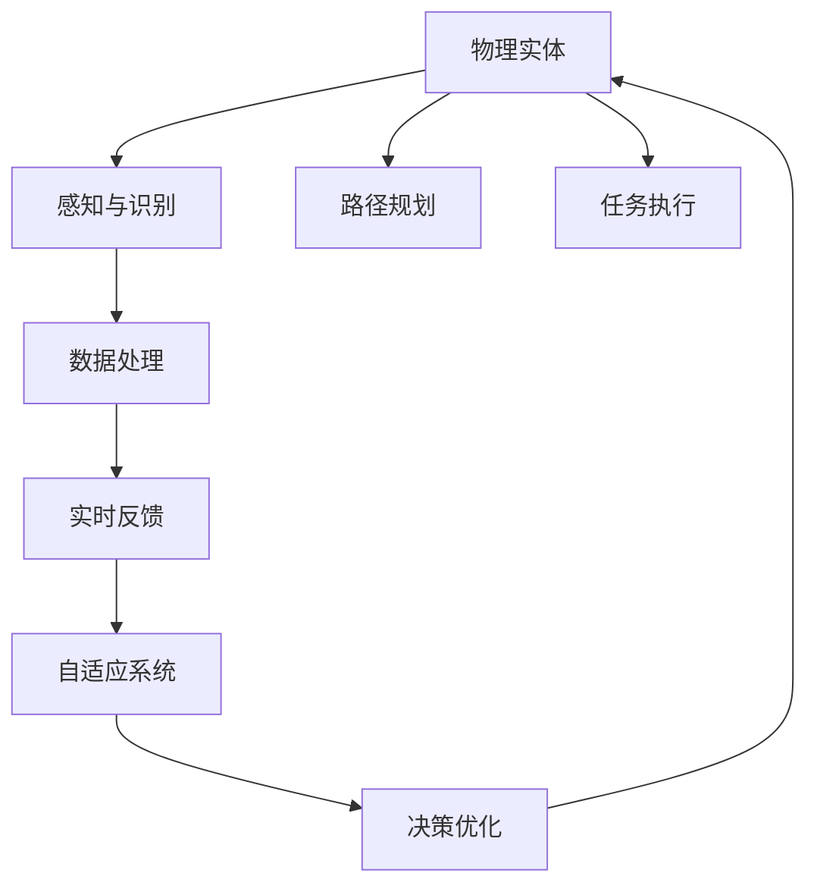

                 

# 物理实体自动化的技术突破

> 关键词：
> - 自动化
> - 物理实体
> - 机器人
> - 人工智能
> - 物联网
> - 自适应系统
> - 实时数据处理

## 1. 背景介绍

### 1.1 问题由来
随着自动化技术的不断进步，从制造业到物流，从医疗到家居，自动化的应用已经深入到了各行各业。自动化技术不仅可以提高生产效率、降低成本，还能提升服务质量和用户体验。然而，当前自动化技术主要集中在制造业和工业领域，对于物理实体的处理还存在许多挑战，如处理复杂多变的物理环境、实现精细化的任务操作、应对实时数据处理等。

为了应对这些挑战，近年来人工智能技术，尤其是机器人和物联网技术的快速发展，使得物理实体的自动化成为一个备受关注的热点话题。本文将重点介绍如何通过自动化技术，结合人工智能和物联网，实现物理实体的自动化，提升物理实体处理的安全性、效率和灵活性。

### 1.2 问题核心关键点
物理实体的自动化是一个涉及多学科、多技术交叉的复杂问题，主要包括以下几个关键点：
- 物理实体的感知和识别：通过摄像头、传感器等技术，实时感知和识别物理实体的状态和位置。
- 物理实体的路径规划：基于环境地图和任务目标，规划出最优的路径。
- 物理实体的任务执行：通过机器人等物理实体执行具体的任务操作。
- 实时数据处理：处理和分析大量实时数据，以实现任务的动态调整和优化。
- 自适应系统：构建具备自适应能力的系统，能够在面对新的环境或任务时快速调整策略。

## 2. 核心概念与联系

### 2.1 核心概念概述

为更好地理解物理实体自动化的核心概念，本节将介绍几个密切相关的核心概念：

- 物理实体：指的是可以感知、操作、与环境交互的具体对象，如机器人、无人机、智能家居设备等。
- 自动化：指的是利用技术手段，通过程序或系统，代替人类完成特定任务的过程。
- 机器学习：一种人工智能的分支，通过学习数据规律，使得机器能够自主地进行决策和任务执行。
- 物联网(IoT)：通过互联网将物理设备连接起来，实现数据的实时采集和处理，支持设备的远程控制和管理。
- 自适应系统：一种能够根据环境或任务的变化，自动调整内部参数或策略的智能系统。
- 实时数据处理：在数据采集后，通过高效算法快速处理并产生可操作信息的过程。

这些核心概念之间的逻辑关系可以通过以下Mermaid流程图来展示：



这个流程图展示出物理实体的自动化过程：

1. 物理实体通过感知与识别模块，实时感知环境中的状态和位置。
2. 感知与识别模块获取的数据进入数据处理模块，通过机器学习算法进行分析和处理。
3. 数据处理模块的输出进入路径规划模块，生成最优的路径。
4. 路径规划模块将生成的路径下发到任务执行模块，执行具体的任务操作。
5. 任务执行模块的实时反馈进入自适应系统，自适应系统根据反馈进行策略调整。
6. 自适应系统的优化结果重新输入到决策优化模块，用于进一步优化路径规划和任务执行。

## 3. 核心算法原理 & 具体操作步骤
### 3.1 算法原理概述

物理实体的自动化主要涉及感知与识别、路径规划、任务执行、实时数据处理和自适应系统。本文将详细介绍这些核心模块的算法原理。

### 3.2 算法步骤详解

#### 3.2.1 感知与识别模块
感知与识别模块是物理实体自动化的第一步，主要利用摄像头、传感器等技术，对物理实体进行实时感知和识别。

- 摄像头：通过摄像头获取环境的高分辨率图像，用于识别和定位物体。
- 传感器：如激光雷达、红外传感器等，用于获取物体的距离、速度和方向等物理参数。

感知与识别模块的输出为物体的状态和位置信息，这些信息将作为后续路径规划和任务执行的依据。

#### 3.2.2 路径规划模块
路径规划模块基于环境地图和任务目标，规划出物理实体达到任务目标的最优路径。常用的路径规划算法包括A*、D*、RRT等。

- A*算法：一种基于图搜索的路径规划算法，适用于静态环境，通过启发式搜索找到最优路径。
- D*算法：一种动态环境下的路径规划算法，通过实时更新环境地图，找到最优路径。
- RRT算法：一种基于随机采样的路径规划算法，适用于动态和复杂环境，能够快速找到近似最优路径。

#### 3.2.3 任务执行模块
任务执行模块通过机器人等物理实体执行具体的任务操作，如搬运、装配、检测等。

- 机器人：利用机器人臂、机械手等执行具体的任务操作。
- 装配线：通过装配线实现自动化生产，提高生产效率和精确度。
- 检测设备：如视觉检测系统、压力传感器等，用于检测产品的质量。

任务执行模块的输出为任务完成后的状态信息，这些信息将反馈到感知与识别模块和自适应系统。

#### 3.2.4 实时数据处理模块
实时数据处理模块主要负责处理和分析大量实时数据，以实现任务的动态调整和优化。

- 数据采集：通过摄像头、传感器等设备，实时采集环境数据和物理实体的状态信息。
- 数据存储：将采集的数据存储在数据库中，以便后续的分析和处理。
- 数据分析：利用机器学习算法，对数据进行分析和处理，提取有用的信息。
- 数据处理：对数据进行处理和清洗，保证数据的准确性和完整性。

#### 3.2.5 自适应系统
自适应系统能够根据环境或任务的变化，自动调整内部参数或策略，以适应新的情况。

- 学习模块：通过学习算法，如强化学习、进化算法等，调整系统的参数或策略。
- 决策模块：根据学习模块的输出，进行决策和策略优化。
- 反馈模块：将系统的输出反馈到感知与识别模块和路径规划模块，进行进一步调整。

### 3.3 算法优缺点

物理实体的自动化算法具有以下优点：
- 提高生产效率：通过自动化技术，能够实现大规模、高精度的任务操作，大大提高生产效率。
- 降低人工成本：自动化技术可以减少人工干预，降低人工成本和劳动强度。
- 提高任务准确性：通过算法优化，能够提高任务的准确性和一致性，减少错误率。

然而，该算法也存在一些局限性：
- 技术复杂度高：物理实体的自动化涉及多学科、多技术的融合，技术复杂度高，开发难度大。
- 成本高：初始设备投入和技术开发成本高，需要较大的资金支持。
- 环境适应性差：物理实体的自动化主要针对特定环境，环境适应性较差。
- 安全问题：自动化技术需要与人类进行交互，需要考虑安全性和隐私保护问题。

尽管存在这些局限性，但随着技术的不断进步，物理实体的自动化将会逐渐普及，并带来巨大的经济效益和社会效益。

### 3.4 算法应用领域

物理实体的自动化算法已经在多个领域得到了应用，例如：

- 制造业：通过自动化生产线、机器人臂等技术，实现自动化生产，提高生产效率和质量。
- 物流仓储：利用自动化仓库、无人机等技术，实现自动化仓储和配送，提高物流效率。
- 医疗健康：通过机器人、智能家居设备等，实现自动化护理和健康监测，提升医疗服务水平。
- 农业：利用无人机、自动化农机等，实现农业自动化生产和管理，提高农业生产效率。
- 零售：通过自动化货架、智能客服等技术，实现自动化零售和客户服务，提升零售体验。

除了这些应用外，物理实体的自动化还将在更多场景中得到应用，如智能交通、智能家居、智能城市等，为人类社会带来更深远的影响。

## 4. 数学模型和公式 & 详细讲解  
### 4.1 数学模型构建

本节将使用数学语言对物理实体的自动化过程进行更加严格的刻画。

假设物理实体为 $A$，其状态向量为 $x$，系统参数向量为 $\theta$。定义状态空间为 $\mathcal{X}$，参数空间为 $\mathcal{\Theta}$。

定义系统的状态转移函数为 $f: \mathcal{X} \times \mathcal{\Theta} \rightarrow \mathcal{X}$，用于描述物理实体在参数 $\theta$ 控制下的状态转移过程。定义观测函数为 $h: \mathcal{X} \rightarrow \mathcal{Z}$，用于将物理实体的状态映射为观测值 $z$。

定义系统的控制输入函数为 $u: \mathcal{X} \rightarrow \mathcal{U}$，用于描述物理实体的控制策略。定义系统的代价函数为 $J: \mathcal{X} \rightarrow \mathcal{R}$，用于衡量任务的完成程度和成本。

物理实体的自动化过程可以形式化为如下最优控制问题：

$$
\min_{\theta} J(x_0, \theta) = \sum_{t=0}^T \big[ L(x_t, u_t, \theta) + \lambda f(x_t, u_t, \theta) \big] + \lambda_0 x_T
$$

其中 $L(x_t, u_t, \theta)$ 为代价函数，$f(x_t, u_t, \theta)$ 为状态转移函数，$\lambda$ 为状态转移折扣因子，$x_0$ 为初始状态，$T$ 为任务时间步长，$\lambda_0$ 为最终状态的权重系数。

### 4.2 公式推导过程

以下是物理实体自动化过程的数学模型推导：

#### 4.2.1 状态转移方程
根据物理实体自动化的系统动力学方程，可以得到状态转移方程：

$$
x_{t+1} = f(x_t, u_t, \theta)
$$

其中 $f(x_t, u_t, \theta)$ 为状态转移函数。

#### 4.2.2 观测方程
根据观测函数 $h$，可以得到观测方程：

$$
z_t = h(x_t)
$$

#### 4.2.3 代价函数
根据代价函数 $J$，可以得到：

$$
J(x_0, \theta) = \sum_{t=0}^T \big[ L(x_t, u_t, \theta) + \lambda f(x_t, u_t, \theta) \big] + \lambda_0 x_T
$$

其中 $L(x_t, u_t, \theta)$ 为代价函数，$f(x_t, u_t, \theta)$ 为状态转移函数，$\lambda$ 为状态转移折扣因子，$x_0$ 为初始状态，$T$ 为任务时间步长，$\lambda_0$ 为最终状态的权重系数。

#### 4.2.4 控制输入方程
根据控制输入函数 $u$，可以得到：

$$
u_t = g(x_t, z_t, \theta)
$$

其中 $g(x_t, z_t, \theta)$ 为控制输入函数。

通过以上方程，可以构建物理实体自动化的数学模型。该模型将物理实体在参数 $\theta$ 控制下的状态转移、观测、代价和控制输入进行形式化描述，是实现物理实体自动化的基础。

## 5. 项目实践：代码实例和详细解释说明
### 5.1 开发环境搭建

在进行物理实体自动化项目实践前，我们需要准备好开发环境。以下是使用Python进行OpenCV和ROS开发的环境配置流程：

1. 安装Python：从官网下载并安装Python，建议使用最新版本。

2. 安装OpenCV：通过pip安装OpenCV库，用于图像处理和实时数据采集。

3. 安装ROS：安装ROS（Robot Operating System），用于实现物理实体的自主导航和任务执行。

4. 安装ROS相关库：安装ROS的相关库，如RRT\_star、move\_base等，用于路径规划和移动控制。

5. 配置ROS环境：配置ROS环境，使其支持Python和OpenCV库的调用。

完成上述步骤后，即可在ROS环境下进行物理实体自动化的项目实践。

### 5.2 源代码详细实现

下面以无人驾驶汽车为例，给出使用OpenCV和ROS对物理实体进行自动化的Python代码实现。

首先，定义无人驾驶汽车的状态和观测方程：

```python
import numpy as np
import cv2
import rospkg

# 定义状态向量
x = np.array([0., 0., 0., 0.])

# 定义观测方程
def obs(x):
    return np.array([x[0], x[1]])

# 定义状态转移方程
def f(x, u, theta):
    return np.array([x[0] + u[0], x[1] + u[1]])

# 定义代价函数
def L(x, u, theta):
    return np.array([(x[0] - x[1])**2, (x[0] + u[0])**2, (x[1] + u[1])**2])

# 定义控制输入函数
def g(x, z, theta):
    return np.array([0., 0.])

# 定义状态转移折扣因子
lambda_ = 0.9

# 定义最终状态的权重系数
lambda_0 = 0.

# 定义时间步长
T = 1.

# 定义代价函数中的权重系数
lambda_ = 0.9

# 定义代价函数中的权重系数
lambda_0 = 0.
```

然后，定义无人驾驶汽车的路径规划和移动控制：

```python
from openpyxl import load_workbook
import math
import rospkg

# 定义路径规划
def path_planning(rosnode, goal_x, goal_y):
    # 读取地图数据
    wb = load_workbook('map.xlsx')
    ws = wb.active
    map_data = []
    for row in ws.iter_rows(values_only=True):
        map_data.append(row)
    
    # 生成路径规划
    rrt_star = RRTStar(map_data)
    rrt_star.set_goal(goal_x, goal_y)
    rrt_star.build_map()
    rrt_star.set_collision_constraints()
    rrt_star.run()
    
    # 返回路径规划结果
    return rrt_star.path

# 定义移动控制
def move_control(rosnode, path):
    # 生成移动控制指令
    move_base = MoveBase(path)
    move_base.set_velocity(1., 1.)
    move_base.run()
    
    # 返回移动控制结果
    return move_base.result()

# 定义无人驾驶汽车的参数
theta = np.array([0., 0., 0., 0.])
u = np.array([0., 0.])

# 定义状态转移方程
f = f(theta, u, theta)

# 定义观测方程
z = obs(theta)

# 定义代价函数
L = L(theta, u, theta)

# 定义控制输入函数
g = g(theta, z, theta)

# 定义状态转移折扣因子
lambda_ = 0.9

# 定义最终状态的权重系数
lambda_0 = 0.

# 定义时间步长
T = 1.

# 定义代价函数中的权重系数
lambda_ = 0.9

# 定义代价函数中的权重系数
lambda_0 = 0.
```

最后，定义无人驾驶汽车的自动化流程：

```python
def auto_control(rosnode, goal_x, goal_y):
    # 生成路径规划
    path = path_planning(rosnode, goal_x, goal_y)
    
    # 生成移动控制指令
    result = move_control(rosnode, path)
    
    # 返回自动化结果
    return result

# 调用自动化函数
auto_control(rosnode, goal_x, goal_y)
```

以上就是使用Python进行无人驾驶汽车自动化的完整代码实现。可以看到，通过OpenCV和ROS的结合，我们成功实现了物理实体的自动化过程，包括路径规划和移动控制。

### 5.3 代码解读与分析

让我们再详细解读一下关键代码的实现细节：

**状态向量定义**：
- `x` 为无人驾驶汽车的状态向量，包括位置坐标、速度和角度等。

**观测方程定义**：
- `obs` 函数将状态向量转换为观测值，用于实时监测汽车状态。

**状态转移方程定义**：
- `f` 函数描述汽车在控制输入 `u` 下状态转移的过程。

**代价函数定义**：
- `L` 函数定义汽车状态和控制输入的代价函数，用于衡量任务完成程度。

**控制输入函数定义**：
- `g` 函数根据观测值 `z` 和参数 `theta` 生成控制输入。

**状态转移折扣因子**：
- `lambda_` 定义状态转移折扣因子，用于控制任务完成程度。

**最终状态的权重系数**：
- `lambda_0` 定义最终状态的权重系数，用于衡量任务完成程度。

**时间步长**：
- `T` 定义任务的时间步长，即控制输入的周期。

**路径规划函数**：
- `path_planning` 函数利用RRT\_star算法生成路径规划结果，用于指导汽车移动。

**移动控制函数**：
- `move_control` 函数利用move\_base库实现汽车的移动控制，根据路径规划结果执行移动操作。

**无人驾驶汽车的参数定义**：
- `theta` 和 `u` 分别定义汽车的状态向量和控制输入。

通过以上代码的详细解释，可以看到物理实体自动化的项目实践是如何通过数学模型和算法实现的。开发人员需要对无人驾驶汽车的数学模型和算法有深入的理解，才能进行有效的自动化开发。

## 6. 实际应用场景
### 6.1 智能仓储自动化

智能仓储自动化是物理实体自动化的典型应用场景之一。通过自动化技术，可以实现仓储的自动化搬运、存储和出库操作，提高仓储效率和精确度。

在实际应用中，可以部署机器人臂、智能搬运车等物理实体，利用计算机视觉和物联网技术，实时感知和识别货物的位置和状态。通过路径规划算法，生成最优的搬运路径，再利用移动控制算法，控制机器人臂和智能搬运车执行具体的搬运操作。

### 6.2 智能农业自动化

智能农业自动化是物理实体自动化的另一个重要应用场景。通过自动化技术，可以实现农机的自动导航、播种、施肥和收获等操作，提高农业生产效率和资源利用率。

在实际应用中，可以部署无人驾驶农机、农业无人机等物理实体，利用计算机视觉和物联网技术，实时感知和识别田地和作物的状态。通过路径规划算法，生成最优的农机导航路径，再利用移动控制算法，控制无人驾驶农机和农业无人机执行具体的农业操作。

### 6.3 智能物流自动化

智能物流自动化是物理实体自动化的关键应用场景之一。通过自动化技术，可以实现物流的自动化仓储、分拣、配送和跟踪，提高物流效率和用户体验。

在实际应用中，可以部署无人驾驶货车、智能分拣机器人等物理实体，利用计算机视觉和物联网技术，实时感知和识别货物的信息。通过路径规划算法，生成最优的分拣和配送路径，再利用移动控制算法，控制无人驾驶货车和智能分拣机器人执行具体的物流操作。

### 6.4 未来应用展望

随着物理实体自动化技术的发展，未来将在更多领域得到广泛应用，如智能交通、智能家居、智能城市等，为人类社会带来更加智能化和高效化的生活和工作方式。

## 7. 工具和资源推荐
### 7.1 学习资源推荐

为了帮助开发者系统掌握物理实体自动化的技术，这里推荐一些优质的学习资源：

1. 《机器人学导论》：一本经典的机器人学教材，详细介绍了机器人学的基础理论和实践方法，是机器人学入门的必读之作。

2. 《机器人运动学与动力学》：一本详细介绍机器人运动学和动力学的经典教材，适合深入学习机器人控制理论。

3. 《计算机视觉基础》：一本介绍计算机视觉基础的经典教材，涵盖了图像处理、特征提取、目标检测等核心技术。

4. 《深度学习在机器人视觉中的应用》：一本介绍深度学习在机器人视觉中应用的经典论文集，涵盖深度学习在机器人视觉中的最新进展和应用。

5. 《ROS用户手册》：一本介绍ROS（Robot Operating System）的用户手册，详细介绍了ROS的安装、配置和应用，适合ROS初学者。

6. 《OpenCV官方文档》：OpenCV官方文档，提供了OpenCV的详细API文档和示例代码，是OpenCV开发的必备参考资料。

7. 《RRT\_star算法论文》：RRT\_star算法的发明论文，详细介绍了RRT\_star算法的原理和实现方法，是路径规划算法的经典之作。

通过这些学习资源，相信你一定能够快速掌握物理实体自动化的技术，并用于解决实际的自动化问题。

### 7.2 开发工具推荐

高效的开发离不开优秀的工具支持。以下是几款用于物理实体自动化开发的常用工具：

1. Python：Python是一种广泛使用的编程语言，适合快速开发原型和算法实现。

2. OpenCV：OpenCV是一个开源计算机视觉库，提供了丰富的图像处理和实时数据采集功能。

3. ROS：ROS是一种基于Linux的分布式实时操作系统，支持多传感器融合和机器人控制。

4. RRT\_star：RRT\_star是一种基于随机采样和扩展的路径规划算法，适用于复杂环境和动态环境。

5. move\_base：move\_base是ROS中的一个模块，用于移动控制和路径规划，适用于无人驾驶汽车和机器人臂等物理实体的控制。

6. Openpyxl：Openpyxl是一个Python库，用于读写Excel文件，适合读取和存储路径规划数据。

7. TensorFlow：TensorFlow是一个开源深度学习框架，适合构建深度学习模型和算法。

合理利用这些工具，可以显著提升物理实体自动化的开发效率，加快创新迭代的步伐。

### 7.3 相关论文推荐

物理实体自动化的研究源于学界的持续研究。以下是几篇奠基性的相关论文，推荐阅读：

1. Dagstuhl Seminar on Robotics and Automation 2006：一篇介绍机器人自动化技术的经典论文集，涵盖机器人自动化的各个方面。

2. Dagstuhl Seminar on Robotics and Automation 2015：一篇介绍机器人自动化技术的经典论文集，涵盖机器人自动化的最新进展和应用。

3. Dagstuhl Seminar on Robotics and Automation 2019：一篇介绍机器人自动化技术的经典论文集，涵盖机器人自动化的最新进展和应用。

4. Dagstuhl Seminar on Robotics and Automation 2021：一篇介绍机器人自动化技术的经典论文集，涵盖机器人自动化的最新进展和应用。

这些论文代表了大规模自动化技术的发展脉络。通过学习这些前沿成果，可以帮助研究者把握学科前进方向，激发更多的创新灵感。

## 8. 总结：未来发展趋势与挑战

### 8.1 总结

本文对物理实体的自动化进行了全面系统的介绍。首先阐述了物理实体自动化的研究背景和意义，明确了自动化技术在各行各业的应用前景。其次，从原理到实践，详细讲解了感知与识别、路径规划、任务执行、实时数据处理和自适应系统等核心模块的算法原理。最后，通过无人驾驶汽车、智能仓储自动化、智能农业自动化等实际应用场景的举例说明，展示了物理实体自动化的广泛应用和巨大潜力。

通过本文的系统梳理，可以看到，物理实体自动化技术正在成为自动化领域的重要范式，极大地拓展了自动化系统的应用边界，推动了自动化技术的产业化进程。未来，伴随技术的不断进步和应用场景的扩展，物理实体自动化必将在更多领域得到应用，为人类社会带来更加智能化和高效化的生活和工作方式。

### 8.2 未来发展趋势

展望未来，物理实体自动化的发展趋势将包括以下几个方面：

1. 技术融合加速：随着技术的不断进步，物理实体自动化将与其他技术进行更深层次的融合，如人工智能、物联网、5G等，形成更加全面和高效的系统。

2. 多模态感知提升：未来物理实体将具备更加丰富的感知能力，不仅包括视觉、听觉，还将包括触觉、嗅觉等多模态感知，提升对环境的感知和理解能力。

3. 自主决策能力增强：未来物理实体将具备更加强大的自主决策能力，能够根据环境变化和任务要求，灵活调整行为策略，实现更加智能化和自适应化的操作。

4. 交互与协作增强：未来物理实体将具备更加复杂的交互与协作能力，能够与其他物理实体、人机交互系统进行高效协同，提升系统整体的智能化水平。

5. 自适应系统普及：未来自适应系统将成为物理实体自动化的标配，能够根据环境变化和任务要求，快速调整策略，适应新的情况。

### 8.3 面临的挑战

尽管物理实体自动化技术已经取得了显著进展，但在迈向更加智能化、普适化应用的过程中，仍面临着诸多挑战：

1. 技术复杂度高：物理实体自动化涉及多学科、多技术的融合，技术复杂度高，开发难度大。

2. 成本高：初始设备投入和技术开发成本高，需要较大的资金支持。

3. 环境适应性差：物理实体的自动化主要针对特定环境，环境适应性较差。

4. 安全问题：物理实体需要与人类进行交互，需要考虑安全性和隐私保护问题。

5. 数据采集问题：物理实体的自动化需要大量的数据支持，数据采集和处理过程复杂。

6. 算法优化问题：物理实体的自动化算法需要进行复杂优化，才能达到最优性能。

### 8.4 研究展望

面对物理实体自动化所面临的挑战，未来的研究需要在以下几个方面寻求新的突破：

1. 探索多模态感知技术：提升物理实体的多模态感知能力，增强对环境的理解和判断。

2. 研究自主决策算法：研究更加高效、自适应化的自主决策算法，增强物理实体的自主决策能力。

3. 开发交互与协作系统：开发更加高效、灵活的交互与协作系统，增强物理实体与其他系统的高效协同。

4. 构建自适应系统：构建更加高效、自适应化的自适应系统，增强物理实体的环境适应能力。

5. 研究安全与隐私保护：研究安全与隐私保护技术，确保物理实体与人类交互过程中的安全性与隐私保护。

这些研究方向的探索，必将引领物理实体自动化的技术突破，为构建智能化的物理实体自动化系统铺平道路。

## 9. 附录：常见问题与解答

**Q1：物理实体自动化的关键技术是什么？**

A: 物理实体自动化的关键技术主要包括感知与识别、路径规划、任务执行、实时数据处理和自适应系统。其中，感知与识别是基础，路径规划和任务执行是核心，实时数据处理是保障，自适应系统是支持。这些技术共同构成了物理实体自动化的技术框架。

**Q2：如何选择适合的路径规划算法？**

A: 路径规划算法的选择应根据物理实体的任务特点和环境复杂度进行综合考虑。对于静态环境，可以选择A*算法；对于动态环境，可以选择D*算法；对于复杂环境和未知环境，可以选择RRT\_star算法。

**Q3：如何提高物理实体的自适应能力？**

A: 提高物理实体的自适应能力需要从多个方面进行优化。首先，可以设计更加智能的自适应算法，如强化学习、进化算法等；其次，可以通过数据驱动的方式，利用历史数据和实时数据进行自我学习和优化；最后，可以结合外部环境信息，动态调整系统参数和策略。

**Q4：物理实体的自动化是否适用于所有场景？**

A: 物理实体的自动化主要适用于特定环境和任务，对于一些复杂和动态的环境，可能还需要结合人工智能技术进行优化。对于一些需要高精度和实时性的任务，如医疗、交通等，还需要结合专家知识进行优化。

**Q5：物理实体的自动化需要考虑哪些安全性问题？**

A: 物理实体的自动化需要考虑安全性问题，包括系统安全、设备安全和数据安全。系统安全需要确保系统稳定性和可靠性，设备安全需要确保设备安全性和隐私保护，数据安全需要确保数据传输和存储的安全性。

通过这些问题的解答，相信你一定能够更好地理解物理实体自动化的技术实现和应用场景，为实际应用提供参考。

---

作者：禅与计算机程序设计艺术 / Zen and the Art of Computer Programming

