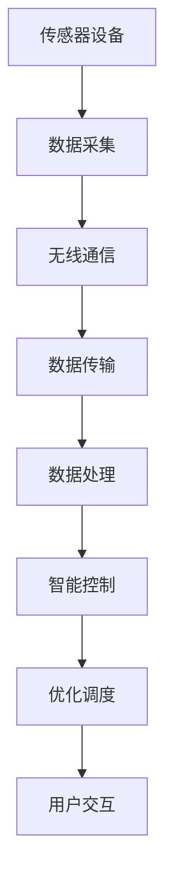

                 

# 物联网(IoT)技术和各种传感器设备的集成：物联网在能源管理中的角色

## 1. 背景介绍

### 1.1 问题由来

随着工业4.0和智能社会的到来，物联网（IoT）技术在各行业中扮演着越来越重要的角色。尤其在能源管理领域，物联网与传感器设备的大规模集成为能源的智能监控、优化调度、环保节能提供了前所未有的可能性。通过实时采集环境数据，物联网能实现智能家居、智慧城市等应用，为公众提供高效便捷的能源使用服务。

### 1.2 问题核心关键点

物联网在能源管理中的应用，核心在于将物理世界的各种传感器设备接入互联网，实时收集数据，并进行分析、处理和反馈，以实现能源的高效管理。具体关键点包括：

- **传感器设备的选择与应用**：选择合适的传感器，并接入物联网平台，实现数据的精准采集。
- **数据传输与处理**：通过无线网络传输数据，进行实时监测和数据分析。
- **控制与优化**：根据数据分析结果，实现能源的智能控制与优化调度。
- **用户界面与服务**：构建友好的用户界面和交互服务，方便用户实时查看和调控能源使用情况。

### 1.3 问题研究意义

物联网在能源管理中的应用，对于提升能源利用效率、优化能源结构、降低能源消耗具有重要意义。通过物联网技术的集成，可以大大提高能源管理的安全性、准确性和灵活性，推动智能城市的建设，实现可持续发展。

## 2. 核心概念与联系

### 2.1 核心概念概述

为更好地理解物联网在能源管理中的应用，本节将介绍几个密切相关的核心概念：

- **物联网（IoT）**：通过互联网将物理世界的物体连接到一起，实现数据的实时采集和交换。
- **传感器设备**：用于收集物理环境数据的设备，包括温湿度、光照、气体、水位、压力等。
- **无线通信技术**：如Wi-Fi、蓝牙、Zigbee、LoRa等，用于数据传输。
- **数据处理平台**：云平台或本地处理设备，用于数据的存储、处理和分析。
- **智能控制系统**：基于数据分析结果，实现能源的自动化控制与优化调度。
- **用户交互服务**：通过手机应用、网页、语音助手等形式，与用户进行互动。

这些概念之间的逻辑关系可以通过以下Mermaid流程图来展示：



这个流程图展示物联网在能源管理中的应用流程：

1. 传感器设备采集物理世界的数据。
2. 数据通过无线网络传输至数据处理平台。
3. 平台对数据进行处理和分析。
4. 基于分析结果，实现能源的智能控制和优化调度。
5. 用户通过友好的交互服务，实时查看和调控能源使用情况。

## 3. 核心算法原理 & 具体操作步骤
### 3.1 算法原理概述

物联网在能源管理中的应用，主要依赖于传感器数据的实时采集、传输和处理，以及基于数据分析的智能控制和优化调度。其核心算法包括：

1. **数据融合与预处理**：将不同传感器采集的数据进行融合与预处理，提升数据质量。
2. **数据存储与管理**：通过数据库或数据仓库，对数据进行存储和管理。
3. **数据分析与模型训练**：利用机器学习算法对数据进行分析，建立预测模型。
4. **智能控制与优化**：基于预测模型和实时数据，实现能源的智能控制与优化调度。
5. **用户界面设计**：构建用户友好的界面，实现数据的实时显示和交互。

### 3.2 算法步骤详解

物联网在能源管理中的应用步骤主要包括以下几个方面：

**Step 1: 传感器设备接入与数据采集**
- 选择合适的传感器设备，如温度传感器、湿度传感器、光线传感器等，并确保其稳定运行。
- 将传感器设备接入物联网平台，并确保数据传输的稳定性和可靠性。

**Step 2: 数据传输与处理**
- 利用无线网络技术，如Wi-Fi、蓝牙、Zigbee等，将传感器采集的数据实时传输至数据处理平台。
- 数据处理平台对数据进行清洗、过滤、转换等预处理，提升数据质量。

**Step 3: 数据分析与模型训练**
- 利用机器学习算法，如回归分析、时间序列分析等，对数据进行分析，建立预测模型。
- 通过历史数据对模型进行训练和优化，提高模型的准确性和泛化能力。

**Step 4: 智能控制与优化调度**
- 根据模型预测结果和实时数据，实现能源的智能控制和优化调度，如自动调节温度、湿度等。
- 实时监控能源使用情况，动态调整能源消耗和供应。

**Step 5: 用户界面设计与服务**
- 构建友好的用户界面，如手机应用、网页等，方便用户实时查看和调控能源使用情况。
- 提供用户友好的交互服务，如语音助手、文字聊天等。

### 3.3 算法优缺点

物联网在能源管理中的应用，具有以下优点：

1. **实时性和准确性**：通过传感器实时采集数据，实现能源的智能监控和优化调度。
2. **灵活性**：可以根据不同场景需求，灵活选择传感器类型和采集频率。
3. **智能化**：通过数据分析和智能控制，实现能源的高效利用。

同时，该方法也存在一定的局限性：

1. **成本较高**：传感器设备和大规模数据传输设备的成本较高。
2. **隐私和安全问题**：数据采集和传输可能涉及用户隐私，存在安全风险。
3. **技术复杂度**：涉及传感器设备选择、数据采集传输、数据分析和智能控制等多个环节，技术实现较为复杂。

尽管存在这些局限性，但物联网在能源管理中的应用，仍是大势所趋，具有广阔的发展前景。

### 3.4 算法应用领域

物联网在能源管理中的应用，涵盖了以下几个主要领域：

1. **智能家居**：通过传感器设备采集家庭能源使用情况，实现智能家电控制和节能管理。
2. **智慧城市**：在城市基础设施中集成传感器设备，实现能源的高效管理和优化调度。
3. **工业能效管理**：在工业生产过程中，实时监控和优化能源使用，提升能效。
4. **建筑能效管理**：在大型建筑中集成传感器设备，实现节能减排和优化调度。
5. **可再生能源管理**：利用传感器设备实时监测可再生能源（如太阳能、风能）的使用情况，优化能源结构。

以上领域展示了物联网在能源管理中的应用潜力和广阔前景。

## 4. 数学模型和公式 & 详细讲解  
### 4.1 数学模型构建

在本节中，我们将对物联网在能源管理中的应用进行数学建模。

记传感器采集的数据为 $D=\{x_i\}_{i=1}^N$，其中 $x_i=(x_{i1},x_{i2},\cdots,x_{im})$ 为第 $i$ 个传感器在时间 $t_i$ 采集的 $m$ 维数据向量。

假设能源使用量为 $Y$，则可以通过时间序列分析建立以下数学模型：

$$
Y = f(D) + \epsilon
$$

其中 $f$ 为模型函数，$\epsilon$ 为随机误差项。

### 4.2 公式推导过程

根据上述模型，我们可以利用最小二乘法对数据进行回归分析，求得模型参数 $\theta$：

$$
\hat{\theta} = \arg\min_{\theta} \sum_{i=1}^N (y_i - f(x_i,\theta))^2
$$

其中 $y_i$ 为第 $i$ 个时间点的能源使用量，$f(x_i,\theta)$ 为模型函数，$\theta$ 为模型参数。

根据最小二乘法，可以得到模型参数 $\theta$ 的计算公式：

$$
\hat{\theta} = (X^TX)^{-1}X^TY
$$

其中 $X$ 为数据矩阵，$Y$ 为能源使用量向量。

### 4.3 案例分析与讲解

以某城市的智能电网为例，通过传感器设备采集电网数据 $D=\{x_i\}_{i=1}^N$，其中 $x_i$ 包括电力负荷、温度、湿度等数据。

假设能源使用量为 $Y$，我们可以通过时间序列分析建立以下模型：

$$
Y = f(D) + \epsilon = \alpha + \beta_1x_{i1} + \beta_2x_{i2} + \cdots + \beta_mx_{im} + \epsilon
$$

其中 $\alpha$ 为常数项，$\beta_1,\beta_2,\cdots,\beta_m$ 为模型参数，$x_{i1},x_{i2},\cdots,x_{im}$ 为第 $i$ 个传感器采集的数据。

通过最小二乘法求解模型参数 $\hat{\theta}$，即可实现对电网能源使用情况的预测和控制。

## 5. 项目实践：代码实例和详细解释说明
### 5.1 开发环境搭建

在进行物联网项目实践前，我们需要准备好开发环境。以下是使用Python进行物联网开发的环境配置流程：

1. 安装Python：从官网下载并安装最新版本的Python，配置环境变量。
2. 安装物联网开发库：如paho-mqtt、pyserial、Raspberry Pi IO等。
3. 安装数据库：如MySQL、PostgreSQL等，用于数据存储和管理。
4. 安装数据分析工具：如Pandas、NumPy等，用于数据处理和分析。
5. 安装机器学习库：如scikit-learn、TensorFlow、PyTorch等，用于模型训练和预测。

完成上述步骤后，即可在本地环境中启动物联网项目。

### 5.2 源代码详细实现

以下是使用Python进行物联网项目开发的示例代码：

```python
import paho.mqtt.client as mqtt
import numpy as np
import pandas as pd
from sklearn.linear_model import LinearRegression
from io import BytesIO

# MQTT客户端连接
def on_connect(client, userdata, flags, rc):
    print("Connected with result code "+str(rc))
    client.subscribe("sensor/data")

# 传感器数据处理
def on_message(client, userdata, message):
    data = message.payload.decode("utf-8").split(",")
    # 将数据转换为数组
    data_array = np.array([float(x) for x in data])
    # 将数据存储到数据库
    store_data(data_array)

# 数据存储与处理
def store_data(data):
    # 将数据存储到数据库
    # ...

# 数据分析与模型训练
def analyze_data():
    # 从数据库中读取数据
    # 数据预处理
    # 建立线性回归模型
    # 模型训练与预测
    # ...

# 主程序
def main():
    # 初始化MQTT客户端
    client = mqtt.Client()
    client.on_connect = on_connect
    client.on_message = on_message
    client.connect("broker.example.com", 1883, 60)
    client.loop_forever()

if __name__ == "__main__":
    main()
```

以上代码实现了通过MQTT协议采集传感器数据，并进行数据处理和模型训练的基本流程。具体实现细节如下：

1. **MQTT客户端连接**：通过paho-mqtt库建立MQTT客户端，订阅传感器数据主题。
2. **传感器数据处理**：定义数据接收回调函数，将传感器数据转换为数组，并存储到数据库。
3. **数据存储与处理**：通过MySQL等数据库存储传感器数据，并进行预处理。
4. **数据分析与模型训练**：利用Pandas、NumPy、scikit-learn等库进行数据分析和模型训练。

### 5.3 代码解读与分析

让我们再详细解读一下关键代码的实现细节：

**MQTT客户端连接**：
- 使用paho-mqtt库建立MQTT客户端，并设置连接参数。
- 通过回调函数on_connect和on_message处理客户端连接和消息接收事件。

**传感器数据处理**：
- 定义on_message回调函数，处理传感器数据接收事件。
- 将传感器数据转换为数组，并存储到数据库。

**数据存储与处理**：
- 通过MySQL等数据库存储传感器数据。
- 对数据进行预处理，如缺失值填充、归一化等。

**数据分析与模型训练**：
- 从数据库中读取数据，并进行预处理。
- 利用线性回归模型进行数据分析和预测。

**主程序**：
- 初始化MQTT客户端，并进行循环接收消息处理。

通过以上代码，可以看到物联网项目开发的基本流程和实现细节。开发者可以根据具体需求，进一步优化和扩展代码。

## 6. 实际应用场景
### 6.1 智能家居

智能家居是物联网在能源管理中的典型应用场景。通过在家庭中集成各种传感器设备，可以实现智能家电控制和节能管理。

例如，在智能家居中集成温度传感器、湿度传感器、光照传感器等，实时采集室内环境数据。通过无线传输技术，将数据传输至云端平台，进行数据分析和智能控制。根据分析结果，智能家电可以自动调节温度、湿度、灯光等，实现节能减排。

### 6.2 智慧城市

智慧城市是物联网在能源管理中的重要应用领域。通过在城市基础设施中集成传感器设备，可以实现能源的高效管理和优化调度。

例如，在智慧城市中集成路灯、交通灯、环境监测设备等，实时采集城市数据。通过物联网平台，将数据传输至云端，进行数据分析和智能控制。根据分析结果，智能路灯可以自动调节亮度，智能交通灯可以优化交通流量，环境监测设备可以实时监测空气质量、水质等，实现能源的高效利用和环保节能。

### 6.3 工业能效管理

在工业生产过程中，通过物联网技术实现能源的实时监控和优化调度，可以有效提升能效。

例如，在工业生产中集成温度传感器、湿度传感器、压力传感器等，实时采集生产数据。通过物联网平台，将数据传输至云端，进行数据分析和智能控制。根据分析结果，智能控制系统可以自动调节生产设备参数，优化生产流程，实现节能减排。

### 6.4 建筑能效管理

在大型建筑中集成传感器设备，实现能源的高效管理和优化调度，可以有效提升建筑能效。

例如，在建筑中集成温度传感器、湿度传感器、能耗监测设备等，实时采集能源使用情况。通过物联网平台，将数据传输至云端，进行数据分析和智能控制。根据分析结果，智能控制系统可以自动调节空调、照明等设备参数，优化能源使用，实现节能减排。

### 6.5 可再生能源管理

在可再生能源管理中，通过物联网技术实时监测太阳能、风能等数据，可以有效提升能源结构，实现环保节能。

例如，在太阳能电站中集成光伏板、风力发电机、环境监测设备等，实时采集能源数据。通过物联网平台，将数据传输至云端，进行数据分析和智能控制。根据分析结果，智能控制系统可以自动调节设备参数，优化能源结构，实现环保节能。

## 7. 工具和资源推荐
### 7.1 学习资源推荐

为了帮助开发者系统掌握物联网技术，这里推荐一些优质的学习资源：

1. **《物联网核心技术与应用》**：介绍了物联网的基本概念、关键技术、典型应用等，是入门物联网的必读书籍。
2. **《Python与物联网编程实战》**：详细介绍了Python在物联网开发中的应用，包含各种传感器、无线通信等技术实现。
3. **《智慧城市：构建新型城市基础设施》**：介绍了智慧城市的基本概念、建设思路、技术框架等，是智慧城市建设的参考书籍。
4. **Coursera的《物联网与物联网应用》课程**：由斯坦福大学开设，介绍了物联网的基本原理和应用场景，涵盖传感器、数据处理、智能控制等技术。
5. **IEEE的《物联网技术综述》文章**：全面介绍了物联网的基本技术、应用场景和挑战，是物联网领域的权威文献。

通过对这些资源的学习实践，相信你一定能够快速掌握物联网技术的精髓，并用于解决实际的能源管理问题。
###  7.2 开发工具推荐

高效的开发离不开优秀的工具支持。以下是几款用于物联网项目开发的常用工具：

1. **MQTT开发工具**：如MQTT.fx、Home Assistant等，用于MQTT协议的开发和调试。
2. **数据库管理工具**：如MySQL Workbench、phpMyAdmin等，用于数据库的创建、管理和维护。
3. **数据分析工具**：如Pandas、NumPy、Scikit-learn等，用于数据的处理和分析。
4. **机器学习框架**：如TensorFlow、PyTorch、Keras等，用于模型的训练和预测。
5. **IOT平台**：如ThingWorx、ThingSpeak等，用于物联网设备的部署和管理。

合理利用这些工具，可以显著提升物联网项目的开发效率，加快创新迭代的步伐。

### 7.3 相关论文推荐

物联网技术的发展源于学界的持续研究。以下是几篇奠基性的相关论文，推荐阅读：

1. **《物联网技术框架：现状与展望》**：全面介绍了物联网的基本技术框架、应用场景和挑战，是物联网领域的经典文献。
2. **《物联网环境下能源管理技术研究》**：介绍了物联网在能源管理中的应用，涵盖传感器选择、数据传输、智能控制等技术。
3. **《基于物联网的智慧城市研究》**：介绍了智慧城市的基本概念、建设思路、技术框架等，是智慧城市建设的参考文献。
4. **《物联网技术在工业能效管理中的应用》**：介绍了物联网在工业能效管理中的应用，涵盖传感器选择、数据传输、智能控制等技术。
5. **《基于物联网的可再生能源管理研究》**：介绍了物联网在可再生能源管理中的应用，涵盖传感器选择、数据传输、智能控制等技术。

这些论文代表了大物联网技术的发展脉络。通过学习这些前沿成果，可以帮助研究者把握学科前进方向，激发更多的创新灵感。

## 8. 总结：未来发展趋势与挑战
### 8.1 总结

本文对物联网在能源管理中的应用进行了全面系统的介绍。首先阐述了物联网和传感器设备的选择与应用、数据传输与处理、控制与优化调度、用户界面与服务等核心概念，明确了物联网在能源管理中的角色。其次，从原理到实践，详细讲解了物联网在能源管理中的应用步骤和数学模型，给出了完整的代码实例和解释分析。同时，本文还广泛探讨了物联网在智能家居、智慧城市、工业能效管理、建筑能效管理、可再生能源管理等多个领域的应用前景，展示了物联网技术的广阔前景。最后，本文精选了物联网技术的各类学习资源，力求为读者提供全方位的技术指引。

通过本文的系统梳理，可以看到，物联网在能源管理中的应用已经成为大势所趋，具有广阔的发展前景。物联网技术通过实时采集、传输和处理传感器数据，实现能源的智能监控和优化调度，推动了智能城市、智能家居等应用的发展，为能源的高效利用和环保节能提供了有力支持。未来，伴随物联网技术的不断进步，其在能源管理中的应用将更加广泛和深入，为构建可持续发展的智能社会奠定坚实基础。

### 8.2 未来发展趋势

展望未来，物联网在能源管理中的应用将呈现以下几个发展趋势：

1. **技术标准化**：随着物联网技术的普及，将逐步形成统一的技术标准和协议，促进各系统间的互联互通。
2. **设备智能化**：未来设备将具备更高的智能性，能够实现自主学习和自适应控制，提升系统效率。
3. **数据集成化**：通过大数据技术，将各传感器设备采集的数据进行集成分析，提升数据的质量和利用效率。
4. **应用场景多样化**：物联网在能源管理中的应用场景将更加多样化，涵盖智能家居、智慧城市、工业能效管理等多个领域。
5. **安全与隐私保护**：随着物联网设备的普及，数据安全和隐私保护将成为重要课题，需采取更严格的安全措施。

以上趋势凸显了物联网在能源管理中的应用前景和挑战，需要研究者和技术开发者共同应对。

### 8.3 面临的挑战

尽管物联网在能源管理中的应用取得了一定的成效，但在迈向更加智能化、普适化应用的过程中，它仍面临着诸多挑战：

1. **技术复杂度**：物联网涉及传感器选择、数据传输、智能控制等多个环节，技术实现较为复杂。
2. **数据处理能力**：大量传感器的数据采集和处理，需要强大的数据处理能力，对硬件和软件资源提出了较高要求。
3. **安全与隐私问题**：数据采集和传输可能涉及用户隐私，存在安全风险。
4. **系统互联互通**：各系统之间的互联互通存在一定的困难，需要建立统一的标准和协议。

尽管存在这些挑战，但物联网在能源管理中的应用，仍是大势所趋，具有广阔的发展前景。通过技术创新和协同合作，物联网技术将在能源管理中发挥更加重要的作用。

### 8.4 研究展望

面向未来，物联网在能源管理中的应用，还需要在以下几个方面进行进一步的研究和探索：

1. **边缘计算**：将计算任务分解到边缘设备上，实现更高效的数据处理和分析。
2. **人工智能与物联网结合**：利用人工智能技术，提升物联网系统的智能化水平，实现更精准的数据分析和智能控制。
3. **多模态数据融合**：将物联网与视觉、听觉、触觉等多元数据融合，实现更全面的环境监测和智能控制。
4. **智能合约**：利用区块链技术，建立智能合约，实现自动化的能源交易和优化调度。
5. **用户界面与体验**：构建更友好、更直观的用户界面，提升用户的能源使用体验。

这些研究方向和探索方向，将为物联网在能源管理中的应用提供新的思路和方法，推动物联网技术的发展和应用。

## 9. 附录：常见问题与解答

**Q1：传感器设备的选择与应用需要注意哪些方面？**

A: 传感器设备的选择与应用，需要注意以下几个方面：
1. 传感器类型的选择：根据应用场景需求，选择适合的传感器类型，如温度传感器、湿度传感器、光线传感器等。
2. 传感器的安装位置：传感器应安装在易于数据采集的位置，如室内空调、灯具、室外温度计等。
3. 传感器的精度和稳定性：选择精度高、稳定性好的传感器，确保数据的准确性和可靠性。
4. 传感器的功耗：选择低功耗传感器，延长电池寿命，减少维护成本。

**Q2：物联网数据传输过程中需要注意哪些问题？**

A: 物联网数据传输过程中，需要注意以下几个问题：
1. 数据传输协议：选择适合的数据传输协议，如MQTT、HTTP、CoAP等，确保数据传输的稳定性和可靠性。
2. 数据传输速率：根据应用场景需求，选择合适的传输速率，平衡数据传输速度和带宽占用。
3. 数据加密和安全性：采用加密技术，确保数据传输的安全性，防止数据泄露和篡改。

**Q3：数据存储与管理需要注意哪些问题？**

A: 数据存储与管理，需要注意以下几个问题：
1. 数据存储格式：选择适合的数据存储格式，如CSV、JSON等，方便数据的读取和处理。
2. 数据存储容量：选择容量大的存储设备，如HDD、SSD等，确保数据存储的稳定性和可靠性。
3. 数据备份与恢复：定期备份数据，确保数据的完整性和可恢复性。

**Q4：数据分析与模型训练需要注意哪些问题？**

A: 数据分析与模型训练，需要注意以下几个问题：
1. 数据预处理：对数据进行清洗、去噪、归一化等预处理，提升数据质量。
2. 模型选择与调参：选择合适的模型，并进行调参，确保模型的准确性和泛化能力。
3. 模型评估与优化：通过评估指标，如准确率、召回率、F1值等，评估模型性能，并进行优化。

**Q5：智能控制与优化调度需要注意哪些问题？**

A: 智能控制与优化调度，需要注意以下几个问题：
1. 控制策略设计：根据应用场景需求，设计合理的控制策略，如PID控制、模糊控制等。
2. 系统稳定性：确保控制策略的稳定性，避免系统震荡和失控。
3. 实时性要求：确保控制策略的实时性，满足用户需求。

通过以上常见问题的解答，相信你一定能够更好地掌握物联网技术，并在能源管理中实现更好的应用效果。

---

作者：禅与计算机程序设计艺术 / Zen and the Art of Computer Programming

