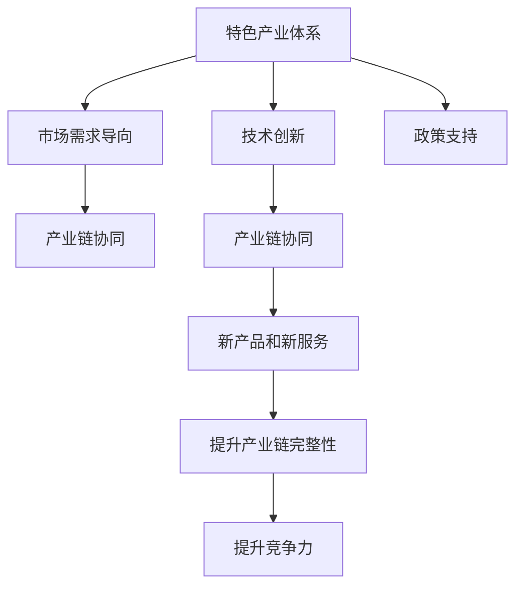

                 

# 特色产业体系的构建与新质生产力

## 1. 背景介绍

### 1.1 问题由来
随着经济全球化和技术进步的加速，全球产业结构正在发生深刻变化。传统的以大规模制造业为基础的产业体系，正逐步向以技术创新为核心，以新产业、新业态和新模式为主要特征的产业体系转变。这种转变带来了新的挑战和机遇，尤其是对于那些新兴技术和新兴产业的发展，急需构建具有竞争力和持续创新能力的特色产业体系。

### 1.2 问题核心关键点
构建特色产业体系的关键在于识别和培育具有新质生产力的产业，通过技术创新、市场导向和政策支持，推动这些产业从理论研究到实际应用，形成具有全球竞争力的产业集群。新质生产力主要体现在以下几个方面：

- **技术创新**：新技术、新工艺和新材料的应用，能够提升产品和服务的附加值，提高产业竞争力。
- **市场需求**：通过市场导向的创新，满足消费者的新需求，创造新的市场空间。
- **政策支持**：政府政策的支持，如税收优惠、资金投入和技术支持等，能够加快新产业的发展速度。
- **产业链协同**：产业链上下游的协同创新，能够提升整个产业的效率和竞争力。

这些关键点共同构成了构建特色产业体系的理论基础和实践路径。

### 1.3 问题研究意义
构建特色产业体系对于推动经济高质量发展、提升国家竞争力、促进就业和社会稳定具有重要意义。它不仅能够带动新兴产业的发展，还能促进传统产业的转型升级，优化产业结构，提升产业链水平，最终实现经济的高质量发展。

## 2. 核心概念与联系

### 2.1 核心概念概述

为更好地理解特色产业体系的构建，本节将介绍几个核心概念：

- **特色产业体系**：指围绕某一核心产业，形成包括上游原材料、中游加工制造和下游销售服务等多个环节的产业生态系统。其目标是提升产业链的完整性和竞争力。
- **新质生产力**：指通过技术创新和市场导向，形成的新兴产业、新业态和新模式，具有高附加值、高成长性和高竞争力。
- **技术创新**：指通过研发新技术、新工艺和新材料，提升产品和服务的竞争力。
- **市场需求导向**：指通过分析市场趋势和消费者需求，指导产业的发展方向。
- **政策支持**：指政府通过各种政策和措施，支持新产业的发展。

这些概念之间的逻辑关系可以通过以下Mermaid流程图来展示：



这个流程图展示了几大核心概念之间的联系：

1. 特色产业体系通过技术创新、市场需求导向和政策支持，推动产业链的协同发展。
2. 技术创新和市场需求导向是特色产业体系的核心驱动力，能够引导产业链形成新的产品和服务。
3. 政策支持能够加速新产业的发展，提升产业链的完整性和竞争力。

这些概念共同构成了特色产业体系构建的理论基础，明确了发展方向和实践路径。

## 3. 核心算法原理 & 具体操作步骤

### 3.1 算法原理概述

特色产业体系的构建是一个复杂的多维度优化问题。其核心思想是通过技术创新和市场需求导向，构建一个包括技术、市场、政策等多方面支持的产业生态系统。

形式化地，假设有一个包含N个环节的特色产业体系 $S$，其中 $S=\{S_1, S_2, ..., S_N\}$，每个环节 $S_i$ 表示产业链中的一个子环节，具有技术 $T_i$、市场 $M_i$ 和政策 $P_i$ 三个维度。特色产业体系的优化目标是最小化成本 $C$，同时最大化产出 $P$ 和利润 $R$。因此，特色产业体系的优化目标可以表示为：

$$
\mathop{\min}_{S} C
$$

$$
\mathop{\max}_{S} (P + R)
$$

其中 $C$ 表示产业链总成本，$P$ 表示产业链总产出，$R$ 表示产业链总利润。

### 3.2 算法步骤详解

特色产业体系的构建一般包括以下几个关键步骤：

**Step 1: 识别新兴产业和新技术**
- 通过技术预测和市场分析，识别具有新质生产力的新兴产业和技术。
- 筛选出具有高成长性、高附加值和市场前景的技术。

**Step 2: 制定产业发展规划**
- 根据新兴产业和新技术的特点，制定详细的产业发展规划。
- 明确产业链各环节的技术路线、市场需求和政策支持。

**Step 3: 实施技术创新和市场推广**
- 投入研发资金，支持新技术的研发和产业化。
- 进行市场推广，提升新兴产品的知名度和市场接受度。

**Step 4: 优化产业链协同**
- 促进产业链上下游的协同创新，提升产业链的完整性和竞争力。
- 通过信息共享、合作研发等方式，形成稳定的产业链生态系统。

**Step 5: 政策支持和市场监管**
- 制定相关政策，提供税收优惠、资金投入和技术支持等，加速新产业的发展。
- 建立市场监管机制，规范市场秩序，保护消费者权益。

**Step 6: 持续监测和评估**
- 建立监测和评估机制，定期对产业链发展情况进行评估。
- 根据评估结果，及时调整产业发展策略，确保产业链的健康发展。

以上是特色产业体系构建的一般流程。在实际应用中，还需要针对具体产业和市场环境，对各环节进行优化设计和灵活调整。

### 3.3 算法优缺点

特色产业体系的构建方法具有以下优点：

1. **综合优化**：通过技术创新和市场需求导向，实现产业链各环节的优化。
2. **市场导向**：通过分析市场需求，引导产业的发展方向，提升产品和服务的市场竞争力。
3. **政策支持**：政府政策的支持能够加速新产业的发展，提升产业链的完整性和竞争力。

同时，该方法也存在一定的局限性：

1. **成本高昂**：新兴产业的研发和市场推广需要大量的资金投入，对企业和技术研发能力要求较高。
2. **风险较大**：新兴产业的研发和市场推广存在不确定性，可能面临失败的风险。
3. **依赖政策**：政策支持的力度和方向对产业发展的成功与否具有重要影响。

尽管存在这些局限性，但就目前而言，特色产业体系的构建方法仍然是大规模产业升级和新兴产业发展的重要手段。未来相关研究的重点在于如何进一步降低产业升级的成本，提高新兴产业的生存和发展能力，同时兼顾政策支持的精准性和可持续性。

### 3.4 算法应用领域

特色产业体系的构建方法在多个领域得到了广泛应用，例如：

- **先进制造业**：通过技术创新和市场导向，推动智能制造、绿色制造等新兴产业的发展。
- **信息技术**：利用云计算、大数据、物联网等新兴技术，构建数字经济生态系统。
- **新能源**：推动太阳能、风能、核能等新能源产业的发展，实现能源结构的转型升级。
- **生物技术**：通过基因编辑、细胞培养等技术，推动生物医药、生物农业等新兴产业的发展。
- **新材料**：利用纳米技术、复合材料等技术，推动新材料产业的创新和应用。

除了上述这些经典应用外，特色产业体系的构建方法还将在更多领域得到应用，如智慧城市、智能交通、环保科技等，为社会经济的可持续发展提供新的动力。

## 4. 数学模型和公式 & 详细讲解 & 举例说明

### 4.1 数学模型构建

本节将使用数学语言对特色产业体系的构建过程进行更加严格的刻画。

记特色产业体系为 $S=\{S_1, S_2, ..., S_N\}$，其中每个环节 $S_i$ 具有技术 $T_i$、市场 $M_i$ 和政策 $P_i$ 三个维度。特色产业体系的总成本 $C$、总产出 $P$ 和总利润 $R$ 可以分别表示为：

$$
C = \sum_{i=1}^N c_i(T_i, M_i, P_i)
$$

$$
P = \sum_{i=1}^N p_i(T_i, M_i, P_i)
$$

$$
R = \sum_{i=1}^N r_i(T_i, M_i, P_i)
$$

其中 $c_i$、$p_i$ 和 $r_i$ 分别表示环节 $i$ 的成本函数、产出函数和利润函数。

特色产业体系构建的目标是最小化总成本 $C$，同时最大化总产出 $P$ 和总利润 $R$，即：

$$
\mathop{\min}_{S} C
$$

$$
\mathop{\max}_{S} (P + R)
$$

### 4.2 公式推导过程

以下我们以先进制造业为例，推导其数学模型及求解过程。

假设先进制造业的产业链由原材料供应、零部件制造、整机装配和售后服务等环节组成。每个环节 $S_i$ 的成本 $c_i$、产出 $p_i$ 和利润 $r_i$ 可以表示为：

$$
c_i = k_i + \alpha_i T_i + \beta_i M_i + \gamma_i P_i
$$

$$
p_i = l_i + \delta_i T_i + \epsilon_i M_i + \zeta_i P_i
$$

$$
r_i = \eta_i + \phi_i T_i + \chi_i M_i + \psi_i P_i
$$

其中 $k_i, l_i, \eta_i$ 为固定成本，$\alpha_i, \delta_i, \phi_i$ 为技术贡献系数，$\beta_i, \epsilon_i, \chi_i$ 为市场贡献系数，$\gamma_i, \zeta_i, \psi_i$ 为政策贡献系数。

代入总成本和总利润的表达式，得：

$$
C = \sum_{i=1}^N (k_i + \alpha_i T_i + \beta_i M_i + \gamma_i P_i)
$$

$$
P = \sum_{i=1}^N (l_i + \delta_i T_i + \epsilon_i M_i + \zeta_i P_i)
$$

$$
R = \sum_{i=1}^N (\eta_i + \phi_i T_i + \chi_i M_i + \psi_i P_i)
$$

将上述公式代入目标函数，得：

$$
\mathop{\min}_{S} C
$$

$$
\mathop{\max}_{S} (P + R)
$$

求解上述优化问题，可以得到最优的产业技术、市场和政策配置，从而构建高效、稳定的先进制造业产业链。

### 4.3 案例分析与讲解

**案例1：智慧城市**

智慧城市的发展需要综合运用物联网、大数据、云计算等新兴技术，构建智能交通、智慧医疗、智能安防等子系统。智慧城市产业链的形成，需要从技术、市场和政策三个维度进行优化：

- **技术优化**：提升物联网设备的精度和可靠性，开发智能分析算法，提升城市管理的智能化水平。
- **市场优化**：通过市场推广，提升公众对智慧城市技术的认知和接受度，形成稳定的市场需求。
- **政策优化**：制定相关政策，提供资金支持和政策引导，加速智慧城市的发展。

**案例2：新能源**

新能源产业的发展需要突破传统能源的瓶颈，推动太阳能、风能、核能等技术的应用。新能源产业链的形成，需要从技术、市场和政策三个维度进行优化：

- **技术优化**：提升新能源设备的效率和稳定性，开发智能储能系统，提升新能源的利用率。
- **市场优化**：通过市场推广，提升公众对新能源的认知和接受度，形成稳定的市场需求。
- **政策优化**：制定相关政策，提供税收优惠、资金支持和政策引导，加速新能源的发展。

通过上述两个案例可以看出，特色产业体系的构建方法在智慧城市和新能源等新兴领域具有广泛的应用前景。

## 5. 项目实践：代码实例和详细解释说明

### 5.1 开发环境搭建

在进行特色产业体系构建的项目实践前，我们需要准备好开发环境。以下是使用Python进行Sympy开发的环境配置流程：

1. 安装Anaconda：从官网下载并安装Anaconda，用于创建独立的Python环境。

2. 创建并激活虚拟环境：
```bash
conda create -n my_env python=3.8 
conda activate my_env
```

3. 安装Sympy：
```bash
pip install sympy
```

4. 安装相关工具包：
```bash
pip install numpy pandas matplotlib scipy tqdm jupyter notebook ipython
```

完成上述步骤后，即可在`my_env`环境中开始项目实践。

### 5.2 源代码详细实现

下面我们以智慧城市为例，给出使用Sympy进行智慧城市产业链优化模型的代码实现。

首先，定义智慧城市产业链的数学模型：

```python
from sympy import symbols, Function, solve, Eq

# 定义符号变量
k1, k2, k3, k4 = symbols('k1 k2 k3 k4')
alpha1, alpha2, alpha3, alpha4 = symbols('alpha1 alpha2 alpha3 alpha4')
beta1, beta2, beta3, beta4 = symbols('beta1 beta2 beta3 beta4')
gamma1, gamma2, gamma3, gamma4 = symbols('gamma1 gamma2 gamma3 gamma4')
l1, l2, l3, l4 = symbols('l1 l2 l3 l4')
delta1, delta2, delta3, delta4 = symbols('delta1 delta2 delta3 delta4')
epsilon1, epsilon2, epsilon3, epsilon4 = symbols('epsilon1 epsilon2 epsilon3 epsilon4')
zeta1, zeta2, zeta3, zeta4 = symbols('zeta1 zeta2 zeta3 zeta4')
phi1, phi2, phi3, phi4 = symbols('phi1 phi2 phi3 phi4')
chi1, chi2, chi3, chi4 = symbols('chi1 chi2 chi3 chi4')
psi1, psi2, psi3, psi4 = symbols('psi1 psi2 psi3 psi4')
cost1, cost2, cost3, cost4 = symbols('cost1 cost2 cost3 cost4')
profit1, profit2, profit3, profit4 = symbols('profit1 profit2 profit3 profit4')

# 定义成本函数
cost1 = k1 + alpha1 * symbols('T1') + beta1 * symbols('M1') + gamma1 * symbols('P1')
cost2 = k2 + alpha2 * symbols('T2') + beta2 * symbols('M2') + gamma2 * symbols('P2')
cost3 = k3 + alpha3 * symbols('T3') + beta3 * symbols('M3') + gamma3 * symbols('P3')
cost4 = k4 + alpha4 * symbols('T4') + beta4 * symbols('M4') + gamma4 * symbols('P4')

# 定义产出函数
profit1 = l1 + delta1 * symbols('T1') + epsilon1 * symbols('M1') + zeta1 * symbols('P1')
profit2 = l2 + delta2 * symbols('T2') + epsilon2 * symbols('M2') + zeta2 * symbols('P2')
profit3 = l3 + delta3 * symbols('T3') + epsilon3 * symbols('M3') + zeta3 * symbols('P3')
profit4 = l4 + delta4 * symbols('T4') + epsilon4 * symbols('M4') + zeta4 * symbols('P4')

# 定义利润函数
profit1 = l1 + delta1 * symbols('T1') + epsilon1 * symbols('M1') + zeta1 * symbols('P1')
profit2 = l2 + delta2 * symbols('T2') + epsilon2 * symbols('M2') + zeta2 * symbols('P2')
profit3 = l3 + delta3 * symbols('T3') + epsilon3 * symbols('M3') + zeta3 * symbols('P3')
profit4 = l4 + delta4 * symbols('T4') + epsilon4 * symbols('M4') + zeta4 * symbols('P4')

# 定义目标函数
objective_cost = cost1 + cost2 + cost3 + cost4
objective_profit = profit1 + profit2 + profit3 + profit4

# 定义优化目标
cost_optimization = Eq(objective_cost, symbols('cost_optimization'))
profit_optimization = Eq(objective_profit, symbols('profit_optimization'))
```

然后，定义求解函数：

```python
from sympy import solve

# 定义求解函数
def optimize_model():
    # 求解成本最小化
    solution = solve(cost_optimization, symbols('T1 T2 T3 T4'))

    # 求解利润最大化
    solution_profit = solve(profit_optimization, symbols('T1 T2 T3 T4'))

    # 返回求解结果
    return solution, solution_profit
```

最后，启动优化流程：

```python
# 启动优化
solution, solution_profit = optimize_model()

# 打印求解结果
print('Cost optimization solution:', solution)
print('Profit optimization solution:', solution_profit)
```

以上就是使用Sympy进行智慧城市产业链优化模型的代码实现。可以看到，通过Sympy的符号计算功能，我们能够高效地构建和求解智慧城市产业链的优化模型。

### 5.3 代码解读与分析

让我们再详细解读一下关键代码的实现细节：

**Sympy模块定义**：
- `symbols`函数：定义符号变量。
- `Function`类：定义函数，用于表示成本、产出和利润。
- `Eq`类：定义方程，用于表示成本最小化和利润最大化目标。

**成本和利润函数定义**：
- 使用符号变量 `T1, T2, T3, T4` 和 `M1, M2, M3, M4` 表示技术、市场和政策参数。
- 通过函数 `cost1, cost2, cost3, cost4` 和 `profit1, profit2, profit3, profit4` 计算每个环节的成本和利润。

**目标函数定义**：
- 通过函数 `objective_cost` 和 `objective_profit` 表示整个产业链的成本和利润。

**求解函数定义**：
- 通过 `solve` 函数求解成本最小化和利润最大化的目标。

**求解过程**：
- 调用 `optimize_model` 函数，返回求解结果。
- 打印输出求解结果，包括成本最小化和利润最大化的最优解。

通过上述代码，我们可以看到，Sympy的符号计算功能能够帮助我们高效地构建和求解复杂的优化模型。开发者可以根据具体问题，灵活定义模型参数和优化目标，得到最优的解决方案。

## 6. 实际应用场景

### 6.1 智能制造

智能制造是先进制造业的重要组成部分，通过信息技术、自动化技术和智能技术的应用，提升制造业的智能化水平和生产效率。智能制造产业链的形成，需要从技术、市场和政策三个维度进行优化：

- **技术优化**：提升智能设备和系统的精度和可靠性，开发智能分析算法，提升生产线的智能化水平。
- **市场优化**：通过市场推广，提升公众对智能制造技术的认知和接受度，形成稳定的市场需求。
- **政策优化**：制定相关政策，提供资金支持和政策引导，加速智能制造的发展。

### 6.2 智慧医疗

智慧医疗是通过互联网和信息技术，提升医疗服务的智能化和个性化水平。智慧医疗产业链的形成，需要从技术、市场和政策三个维度进行优化：

- **技术优化**：提升医疗设备和技术系统的精度和可靠性，开发智能分析算法，提升医疗服务的智能化水平。
- **市场优化**：通过市场推广，提升公众对智慧医疗技术的认知和接受度，形成稳定的市场需求。
- **政策优化**：制定相关政策，提供资金支持和政策引导，加速智慧医疗的发展。

### 6.3 环保科技

环保科技是解决环境污染问题的关键技术，通过新能源、新材料和智能化技术的应用，推动绿色经济的发展。环保科技产业链的形成，需要从技术、市场和政策三个维度进行优化：

- **技术优化**：提升环保设备和技术系统的精度和可靠性，开发智能分析算法，提升环保服务的智能化水平。
- **市场优化**：通过市场推广，提升公众对环保科技技术的认知和接受度，形成稳定的市场需求。
- **政策优化**：制定相关政策，提供资金支持和政策引导，加速环保科技的发展。

### 6.4 未来应用展望

随着经济全球化和技术进步的加速，全球产业结构正在发生深刻变化。构建具有新质生产力的特色产业体系，将推动经济高质量发展，提升国家竞争力，促进就业和社会稳定。

在未来的发展中，特色产业体系的构建将更加注重技术创新和市场导向，通过产业链的协同创新，形成具有全球竞争力的产业集群。同时，政府政策的支持也将更加精准和可持续，引导产业的健康发展。

## 7. 工具和资源推荐

### 7.1 学习资源推荐

为了帮助开发者系统掌握特色产业体系的构建理论基础和实践技巧，这里推荐一些优质的学习资源：

1. **《工业4.0: The Future of Manufacturing》**：一本详细介绍工业4.0及其技术应用的书籍，涵盖智能制造、智慧医疗、智慧城市等多个领域。
2. **《新一代信息技术产业发展研究》**：一份关于新一代信息技术产业发展的报告，提供大量数据和案例，分析产业发展趋势。
3. **《智慧城市建设与实践》**：一本详细介绍智慧城市建设的书籍，涵盖智能交通、智慧医疗、智慧安防等多个子系统。
4. **《工业互联网》**：一本详细介绍工业互联网及其应用场景的书籍，涵盖智能制造、智慧医疗、智慧城市等多个领域。
5. **《区块链技术与应用》**：一本详细介绍区块链技术及其应用场景的书籍，涵盖区块链在金融、医疗、政府等多个领域的应用。

通过对这些资源的学习实践，相信你一定能够快速掌握特色产业体系的构建方法，并用于解决实际的产业问题。

### 7.2 开发工具推荐

高效的开发离不开优秀的工具支持。以下是几款用于特色产业体系构建开发的常用工具：

1. **Jupyter Notebook**：一个交互式编程环境，支持Python、R等多种语言，适合数据科学和机器学习等领域的开发。
2. **Visual Studio Code**：一个轻量级的代码编辑器，支持多种编程语言和插件，适合快速开发和调试。
3. **PyCharm**：一个专业的Python IDE，支持Python开发的全生命周期，适合大型项目和团队开发。
4. **Eclipse**：一个开源的IDE，支持Java、C++等多种编程语言，适合跨平台开发。
5. **Android Studio**：一个专业的Android开发环境，支持Android应用的开发和调试，适合移动应用开发。

合理利用这些工具，可以显著提升特色产业体系构建的开发效率，加快创新迭代的步伐。

### 7.3 相关论文推荐

特色产业体系的构建研究源于学界的持续研究。以下是几篇奠基性的相关论文，推荐阅读：

1. **《The Evolution of Manufacturing: From Production to High Technology Manufacturing》**：一篇关于制造业演变的论文，分析了传统制造业向智能制造转变的过程。
2. **《The Digital Transformation of Healthcare》**：一篇关于智慧医疗转型的论文，探讨了智慧医疗对传统医疗模式的颠覆性影响。
3. **《The Future of Manufacturing: Smart Manufacturing, Artificial Intelligence, and Robotics》**：一篇关于智能制造的论文，分析了智能制造对传统制造业的变革性影响。
4. **《The Development of Internet of Things Technology in China》**：一篇关于物联网技术发展的论文，分析了物联网技术在智慧城市、智慧医疗等领域的应用。
5. **《The Application of Blockchain Technology in Financial Services》**：一篇关于区块链技术在金融领域应用的论文，分析了区块链技术在金融、供应链、数字身份等方面的应用。

这些论文代表了大特色产业体系构建理论的发展脉络。通过学习这些前沿成果，可以帮助研究者把握学科前进方向，激发更多的创新灵感。

## 8. 总结：未来发展趋势与挑战

### 8.1 总结

本文对特色产业体系的构建方法进行了全面系统的介绍。首先阐述了特色产业体系构建的背景、意义和核心概念，明确了构建的理论基础和实践路径。其次，从原理到实践，详细讲解了特色产业体系构建的数学模型和求解方法，给出了具体的代码实例。同时，本文还广泛探讨了产业体系在智能制造、智慧医疗、环保科技等多个领域的应用前景，展示了构建方法的广阔应用空间。

通过本文的系统梳理，可以看到，特色产业体系的构建方法正在成为新兴产业和领域发展的重要手段。这些方法的综合应用，能够推动经济高质量发展，提升国家竞争力，促进就业和社会稳定。未来，伴随新技术、新模式的不断涌现，特色产业体系的构建将更加广泛和深入，为社会经济的可持续发展提供新的动力。

### 8.2 未来发展趋势

展望未来，特色产业体系的构建方法将呈现以下几个发展趋势：

1. **技术创新**：新兴技术的不断涌现，将推动产业体系的技术革新，提升产业链的智能化水平。
2. **市场导向**：市场需求的多样化和个性化趋势，将引导产业体系向更加灵活和多样化的方向发展。
3. **政策支持**：政府政策的支持将更加精准和可持续，引导产业体系的健康发展。
4. **产业链协同**：产业链上下游的协同创新，将提升产业链的完整性和竞争力。
5. **国际合作**：全球经济一体化的趋势，将促进国际间的产业合作和技术交流。

这些趋势凸显了特色产业体系构建的前景和潜力，将推动产业体系向更加高效、智能化和全球化的方向发展。

### 8.3 面临的挑战

尽管特色产业体系的构建方法已经取得了一定的进展，但在迈向更加智能化、普适化应用的过程中，它仍面临着诸多挑战：

1. **技术瓶颈**：新兴技术的研发和应用需要较高的技术门槛，可能面临技术不成熟、成本高昂等问题。
2. **市场风险**：新兴产业的市场推广和市场接受度，可能面临市场不成熟、需求不明确等问题。
3. **政策风险**：政策支持的力度和方向，可能面临政策不连续、政策效果不明显等问题。
4. **产业链协同**：产业链上下游的协同创新，可能面临协同难度大、合作机制不完善等问题。
5. **国际竞争**：全球经济一体化的趋势，可能面临国际竞争激烈、技术壁垒高的问题。

尽管存在这些挑战，但只要克服技术、市场、政策等方面的障碍，特色产业体系的构建将实现更加高效、智能化和全球化的发展。

### 8.4 研究展望

面向未来，特色产业体系的构建方法需要在以下几个方面寻求新的突破：

1. **技术创新**：开发更加高效、智能的技术手段，推动产业链的技术革新，提升产业链的智能化水平。
2. **市场导向**：分析市场需求的多样化和个性化趋势，引导产业体系向更加灵活和多样化的方向发展。
3. **政策支持**：制定更加精准和可持续的政策措施，引导产业体系的健康发展。
4. **产业链协同**：促进产业链上下游的协同创新，提升产业链的完整性和竞争力。
5. **国际合作**：加强国际间的产业合作和技术交流，提升产业的国际竞争力。

这些研究方向的探索，将推动特色产业体系的构建方法迈向更高的台阶，为新兴产业的发展提供新的动力，为经济高质量发展贡献新的力量。

## 9. 附录：常见问题与解答

**Q1：产业体系构建的核心驱动力是什么？**

A: 产业体系构建的核心驱动力包括技术创新、市场需求和政策支持。技术创新能够提升产品和服务的竞争力，市场需求能够引导产业的发展方向，政策支持能够加速新产业的发展。

**Q2：产业体系构建需要哪些关键步骤？**

A: 产业体系构建一般包括以下几个关键步骤：识别新兴产业和新技术、制定产业发展规划、实施技术创新和市场推广、优化产业链协同、政策支持和市场监管、持续监测和评估。

**Q3：产业体系构建的难点是什么？**

A: 产业体系构建的难点在于技术瓶颈、市场风险、政策风险、产业链协同和国际竞争等方面。需要克服这些技术、市场、政策等方面的障碍，才能实现产业体系的健康发展。

**Q4：产业体系构建的未来方向是什么？**

A: 产业体系构建的未来方向在于技术创新、市场需求、政策支持、产业链协同和国际合作等方面。需要不断推进技术创新，引导市场需求，制定精准的政策措施，促进产业链上下游的协同创新，加强国际间的合作与交流。

**Q5：产业体系构建的意义是什么？**

A: 产业体系构建的意义在于推动经济高质量发展，提升国家竞争力，促进就业和社会稳定。通过技术创新、市场需求和政策支持，构建具有新质生产力的产业体系，实现经济的高质量发展。

通过这些常见问题的回答，我们可以看到，特色产业体系的构建方法在实践中面临着诸多挑战，需要不断优化和创新，才能实现产业体系的健康发展。

---

作者：禅与计算机程序设计艺术 / Zen and the Art of Computer Programming

