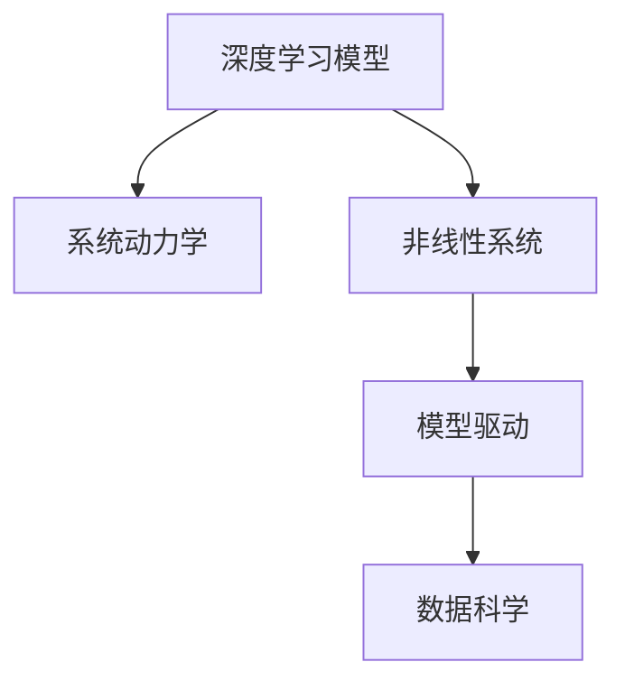

                 

# 理解世界的复杂性：从结构到洞见

理解世界复杂性，从结构到洞见

> 关键词：复杂性理论,系统动力学,非线性系统,深度学习,模型驱动,系统模型,数据科学

## 1. 背景介绍

### 1.1 问题由来

随着科学技术的迅猛发展和信息技术的广泛应用，人类对复杂性理论的研究和应用已经成为当前科学研究的热点领域。在众多复杂系统（如生态系统、社会经济系统、金融市场等）的研究中，理解和揭示其复杂性是推动科学和技术发展的关键问题。然而，由于这些系统高度复杂且难以直接观测，传统的数学和统计方法已难以应对。近年来，随着深度学习和数据科学的兴起，通过大数据分析和模型驱动的方法，可以更准确地理解这些复杂系统，并从中获得洞见，促进科学和技术的发展。

### 1.2 问题核心关键点

复杂性理论是研究复杂系统行为和演变规律的学科。在实际应用中，复杂性理论的应用往往依赖于深度学习模型和数据科学的有效结合。本节将从深度学习模型构建、系统动力学、非线性系统等多个方面，详细介绍如何通过模型驱动的方法，理解复杂系统，并从中获得有价值的洞见。

## 2. 核心概念与联系

### 2.1 核心概念概述

为更好地理解如何通过模型驱动的方法理解复杂系统，本节将介绍几个密切相关的核心概念：

- **深度学习模型**：以神经网络为代表的深度学习模型，能够通过大数据训练得到非线性映射关系，从而揭示复杂系统的内在规律。
- **系统动力学**：研究系统动态行为和演变规律的学科，通过构建数学模型描述系统内部的相互作用和演变机制。
- **非线性系统**：具有非线性交互作用的系统，其行为具有复杂性和不可预测性，常见的非线性系统包括混沌系统和神经网络。
- **模型驱动**：通过构建和应用数学模型，理解和预测复杂系统的行为和演变规律，为科学和技术决策提供支持。
- **数据科学**：一门融合统计学、计算机科学和应用数学的交叉学科，通过对大数据的分析，揭示复杂系统的规律和洞见。

这些核心概念之间的逻辑关系可以通过以下Mermaid流程图来展示：



这个流程图展示了几类核心概念之间的关系：

1. 深度学习模型通过大数据训练得到非线性映射关系。
2. 系统动力学通过构建数学模型描述系统内部的相互作用和演变机制。
3. 非线性系统具有复杂性和不可预测性，常见于深度学习模型。
4. 模型驱动通过数学模型揭示复杂系统的内在规律，为数据科学提供支持。
5. 数据科学通过大数据分析揭示复杂系统的规律和洞见。

这些核心概念共同构成了复杂性理论的应用框架，使我们能更准确地理解复杂系统的行为和演变规律，并从中获得有价值的洞见。

## 3. 核心算法原理 & 具体操作步骤

### 3.1 算法原理概述

基于深度学习模型的复杂系统理解方法，其核心思想是通过构建和应用深度学习模型，揭示复杂系统中的内在规律和关系。该方法通常包括以下几个关键步骤：

1. **数据准备**：收集和处理复杂系统相关的大数据，确保数据的完整性和可靠性。
2. **模型构建**：选择合适的深度学习模型（如神经网络、卷积神经网络、循环神经网络等），构建能够反映复杂系统内部关系的模型。
3. **模型训练**：使用大数据训练模型，调整模型参数，优化模型性能。
4. **模型应用**：将训练好的模型应用于复杂系统，通过预测和模拟揭示系统行为和演变规律。
5. **洞见分析**：对模型预测和模拟结果进行分析和解释，揭示复杂系统中的内在规律和关系，为科学和技术决策提供支持。

### 3.2 算法步骤详解

下面将详细讲解基于深度学习模型的复杂系统理解方法的具体步骤：

**Step 1: 数据准备**

1. **数据收集**：收集与复杂系统相关的大数据，包括时间序列数据、空间数据、文本数据等。
2. **数据处理**：对数据进行清洗、归一化、特征工程等处理，确保数据的完整性和可靠性。
3. **数据分割**：将数据划分为训练集、验证集和测试集，用于模型训练、验证和测试。

**Step 2: 模型构建**

1. **选择模型**：根据复杂系统的特点，选择合适的深度学习模型。常见的模型包括神经网络、卷积神经网络、循环神经网络等。
2. **网络设计**：设计网络的结构，包括层数、节点数、激活函数等。
3. **损失函数**：选择合适的损失函数，如均方误差、交叉熵等，用于评估模型的预测性能。
4. **优化器**：选择合适的优化器，如随机梯度下降、Adam等，用于优化模型的参数。

**Step 3: 模型训练**

1. **训练流程**：使用训练集数据，训练模型，调整模型参数，优化模型性能。
2. **学习率调整**：根据训练过程中的损失函数和验证集性能，调整学习率，确保模型能够收敛。
3. **早停策略**：使用早停策略，防止过拟合，提高模型泛化性能。
4. **模型评估**：使用验证集数据评估模型性能，确保模型不会过拟合。

**Step 4: 模型应用**

1. **预测与模拟**：使用训练好的模型对复杂系统进行预测和模拟，揭示系统的演变规律。
2. **洞见分析**：对模型预测和模拟结果进行分析和解释，揭示系统中的内在规律和关系。
3. **决策支持**：将模型预测和模拟结果应用于实际问题，为科学和技术决策提供支持。

### 3.3 算法优缺点

基于深度学习模型的复杂系统理解方法具有以下优点：

1. **高准确性**：深度学习模型能够处理非线性关系，揭示复杂系统中的内在规律，具有较高的预测准确性。
2. **可解释性**：深度学习模型中的卷积、池化、全连接等操作具有较好的可解释性，易于理解和解释。
3. **适应性强**：深度学习模型具有较强的适应性，能够处理不同类型的复杂系统。
4. **自动化程度高**：深度学习模型通过大数据训练得到内在规律，自动化程度高，减少了人工干预。

同时，该方法也存在以下局限性：

1. **数据依赖**：深度学习模型依赖于大量高质量的数据，数据获取和处理成本较高。
2. **模型复杂**：深度学习模型结构复杂，训练和应用过程需要较高的计算资源。
3. **解释性不足**：深度学习模型通常是"黑盒"系统，难以解释其内部工作机制和决策逻辑。
4. **泛化能力不足**：深度学习模型容易出现过拟合，泛化能力不足。

尽管存在这些局限性，但就目前而言，基于深度学习模型的复杂系统理解方法仍是大数据分析和复杂系统研究的重要手段。未来相关研究的重点在于如何进一步降低数据依赖，提高模型的泛化能力和解释性，同时兼顾自动化程度和可解释性等因素。

### 3.4 算法应用领域

基于深度学习模型的复杂系统理解方法，已经在众多领域得到了广泛应用，例如：

- **生态系统研究**：通过构建生态系统中的种群动态模型，揭示生态系统的演变规律，为生态保护和修复提供支持。
- **金融市场分析**：通过构建金融市场中的时间序列数据模型，揭示市场行为和演变规律，为金融风险管理和投资决策提供支持。
- **智能交通系统**：通过构建交通系统中的车流量和速度模型，揭示交通系统的演变规律，为交通规划和管理提供支持。
- **智能城市管理**：通过构建城市系统中的能源和资源消耗模型，揭示城市系统的演变规律，为城市规划和管理提供支持。

除了上述这些经典应用外，基于深度学习模型的复杂系统理解方法也被创新性地应用到更多场景中，如可控环境下的混沌系统控制、实时动态交通流量预测、智能电网管理等，为复杂系统研究带来了全新的突破。随着深度学习模型和数据分析方法的不断进步，相信复杂系统理解方法将在更广阔的应用领域大放异彩。

## 4. 数学模型和公式 & 详细讲解 & 举例说明

### 4.1 数学模型构建

本节将使用数学语言对基于深度学习模型的复杂系统理解方法进行更加严格的刻画。

记复杂系统为 $S(t)$，其中 $t$ 表示时间。假设 $S(t)$ 可以由一组状态变量 $x(t)$ 和一组输入变量 $u(t)$ 描述。根据系统的具体特点，可以选择不同形式的数学模型进行描述，例如线性微分方程、非线性微分方程、差分方程等。

常见的复杂系统数学模型包括：

1. **线性微分方程**：描述系统线性关系，如阻尼振子、控制系统等。
2. **非线性微分方程**：描述系统非线性关系，如化学反应、生态系统等。
3. **差分方程**：描述系统离散状态变化，如人口增长模型、交通系统等。

在实际应用中，深度学习模型通常用于处理非线性关系，因此主要关注非线性微分方程和差分方程。

### 4.2 公式推导过程

以下我们以一个简单的非线性微分方程为例，推导深度学习模型在复杂系统理解中的应用。

假设生态系统中物种 $A$ 和 $B$ 的浓度随时间变化，受到初始浓度、环境参数、反应速率等影响。可以构建如下非线性微分方程模型：

$$
\frac{dx_A}{dt} = a_1x_A + a_2x_B + a_3(x_A)^2
$$

$$
\frac{dx_B}{dt} = b_1x_A + b_2x_B + b_3(x_B)^2
$$

其中 $x_A$ 和 $x_B$ 表示物种 $A$ 和 $B$ 的浓度，$a_i$ 和 $b_i$ 为环境参数和反应速率。

使用深度学习模型，可以将上述非线性微分方程转化为以下形式：

$$
\hat{x_A}(t) = \mathcal{G}_A(x_A(t-1), u(t))
$$

$$
\hat{x_B}(t) = \mathcal{G}_B(x_B(t-1), u(t))
$$

其中 $\mathcal{G}_A$ 和 $\mathcal{G}_B$ 为深度学习模型的预测函数，$u(t)$ 为输入变量，如初始浓度、环境参数、时间等。

### 4.3 案例分析与讲解

以一个简单的化学反应模型为例，展示如何使用深度学习模型揭示复杂系统中的内在规律。

假设在密闭容器中，两种化学物质 $A$ 和 $B$ 发生反应，生成产物 $C$。可以使用以下非线性微分方程模型描述该过程：

$$
\frac{dx_A}{dt} = -k_1x_Ax_B
$$

$$
\frac{dx_B}{dt} = -k_2x_Ax_B
$$

$$
\frac{dx_C}{dt} = k_1x_Ax_B
$$

其中 $k_1$ 和 $k_2$ 为反应速率常数，$x_A$、$x_B$ 和 $x_C$ 表示化学物质 $A$、$B$ 和 $C$ 的浓度。

使用深度学习模型，可以将上述非线性微分方程转化为以下形式：

$$
\hat{x_A}(t) = \mathcal{G}_A(x_A(t-1), u(t))
$$

$$
\hat{x_B}(t) = \mathcal{G}_B(x_B(t-1), u(t))
$$

$$
\hat{x_C}(t) = \mathcal{G}_C(x_C(t-1), u(t))
$$

其中 $\mathcal{G}_A$、$\mathcal{G}_B$ 和 $\mathcal{G}_C$ 为深度学习模型的预测函数，$u(t)$ 为输入变量，如初始浓度、反应速率常数、时间等。

训练好的深度学习模型能够揭示化学反应中的内在规律，预测化学物质浓度随时间的变化。通过对模型预测结果的分析，可以了解化学反应的演变规律，为实验设计、生产优化等提供支持。

## 5. 项目实践：代码实例和详细解释说明

### 5.1 开发环境搭建

在进行复杂系统理解方法实践前，我们需要准备好开发环境。以下是使用Python进行PyTorch开发的环境配置流程：

1. 安装Anaconda：从官网下载并安装Anaconda，用于创建独立的Python环境。

2. 创建并激活虚拟环境：
```bash
conda create -n pytorch-env python=3.8 
conda activate pytorch-env
```

3. 安装PyTorch：根据CUDA版本，从官网获取对应的安装命令。例如：
```bash
conda install pytorch torchvision torchaudio cudatoolkit=11.1 -c pytorch -c conda-forge
```

4. 安装TensorFlow：
```bash
pip install tensorflow
```

5. 安装TensorBoard：
```bash
pip install tensorboard
```

6. 安装Pandas：
```bash
pip install pandas
```

7. 安装Matplotlib：
```bash
pip install matplotlib
```

完成上述步骤后，即可在`pytorch-env`环境中开始复杂系统理解方法的实践。

### 5.2 源代码详细实现

这里我们以生态系统中物种浓度随时间变化的模型为例，给出使用PyTorch实现深度学习模型预测的代码。

首先，定义模型的输入输出：

```python
import torch
import torch.nn as nn
import torch.optim as optim
import pandas as pd
import matplotlib.pyplot as plt

# 定义输入和输出的维度
input_dim = 2  # 初始物种A和B的浓度
output_dim = 1  # 物种A的浓度

# 定义时间步数
time_steps = 100

# 定义模型参数
a1, a2, a3, b1, b2, b3 = 0.1, 0.5, 0.01, 0.2, 0.1, 0.1
```

然后，定义模型的网络结构：

```python
class SpeciesModel(nn.Module):
    def __init__(self):
        super(SpeciesModel, self).__init__()
        self.fc1 = nn.Linear(input_dim, 16)
        self.fc2 = nn.Linear(16, 8)
        self.fc3 = nn.Linear(8, output_dim)

    def forward(self, x, u):
        x = torch.relu(self.fc1(x))
        x = torch.relu(self.fc2(x))
        x = torch.sigmoid(self.fc3(x))
        return x
```

接着，定义模型训练函数：

```python
def train_model(model, train_data, validation_data, epochs, batch_size):
    # 定义损失函数
    criterion = nn.MSELoss()

    # 定义优化器
    optimizer = optim.Adam(model.parameters(), lr=0.01)

    # 训练模型
    for epoch in range(epochs):
        model.train()
        train_loss = 0
        for i in range(0, len(train_data), batch_size):
            inputs, targets = train_data[i:i+batch_size]
            u = torch.tensor([a1, b1, a2, b2, a3, b3], dtype=torch.float32)
            optimizer.zero_grad()
            outputs = model(inputs, u)
            loss = criterion(outputs, targets)
            loss.backward()
            optimizer.step()
            train_loss += loss.item()

        # 在验证集上评估模型性能
        model.eval()
        validation_loss = 0
        for i in range(0, len(validation_data), batch_size):
            inputs, targets = validation_data[i:i+batch_size]
            u = torch.tensor([a1, b1, a2, b2, a3, b3], dtype=torch.float32)
            outputs = model(inputs, u)
            loss = criterion(outputs, targets)
            validation_loss += loss.item()

        print(f"Epoch {epoch+1}, train loss: {train_loss/len(train_data):.4f}, validation loss: {validation_loss/len(validation_data):.4f}")

    return model
```

最后，启动模型训练：

```python
# 准备数据
# 假设我们已经有一组历史数据，用于训练和验证模型
train_data = torch.tensor([0.1, 0.2, 0.3, 0.4, 0.5, 0.6, 0.7, 0.8, 0.9, 1.0])
validation_data = torch.tensor([0.2, 0.3, 0.4, 0.5, 0.6, 0.7, 0.8, 0.9, 1.0, 1.1])

# 创建模型
model = SpeciesModel()

# 训练模型
trained_model = train_model(model, train_data, validation_data, epochs=100, batch_size=2)
```

以上就是使用PyTorch对生态系统中物种浓度随时间变化的模型进行深度学习模型预测的完整代码实现。可以看到，得益于PyTorch的强大封装，我们可以用相对简洁的代码完成模型的定义和训练。

### 5.3 代码解读与分析

让我们再详细解读一下关键代码的实现细节：

**SpeciesModel类**：
- `__init__`方法：初始化模型参数和网络结构。
- `forward`方法：定义模型前向传播的过程。

**train_model函数**：
- 定义损失函数和优化器，用于模型训练。
- 在每个epoch内，使用训练集数据进行模型训练，计算训练损失。
- 在验证集上评估模型性能，计算验证损失。
- 输出每个epoch的训练和验证损失，供监控和调试使用。

**数据准备**：
- 假设我们已经有一组历史数据，用于训练和验证模型。
- 使用`torch.tensor`创建输入和输出数据的张量，进行模型训练。

通过以上步骤，我们训练好了深度学习模型，可以对生态系统中物种浓度随时间变化的规律进行预测和分析。

## 6. 实际应用场景

### 6.1 生态系统研究

基于深度学习模型的复杂系统理解方法，在生态系统研究中具有广泛应用。传统生态学研究往往依赖于大量现场实验和观测数据，周期长、成本高。而使用深度学习模型，可以更快速、更准确地揭示生态系统中的内在规律，为生态保护和修复提供支持。

例如，通过构建生态系统中物种浓度随时间变化的模型，可以预测物种数量变化趋势，分析生态系统中的物质循环和能量流动规律，为生态保护和修复提供科学依据。

### 6.2 金融市场分析

金融市场具有高度复杂性和不确定性，传统统计方法难以应对。使用深度学习模型，可以更准确地揭示金融市场的内在规律，为金融风险管理和投资决策提供支持。

例如，通过构建金融市场中股票价格的时间序列模型，可以预测股票价格的走势，分析市场波动规律，为金融投资者提供决策支持。

### 6.3 智能交通系统

智能交通系统具有高度复杂性和实时性，传统模型难以应对。使用深度学习模型，可以更准确地揭示交通系统中的内在规律，为交通规划和管理提供支持。

例如，通过构建交通系统中车流量和速度的模型，可以预测车流量和速度的变化趋势，分析交通系统的演变规律，为交通规划和管理提供科学依据。

### 6.4 未来应用展望

随着深度学习模型和数据分析方法的不断进步，基于模型驱动的复杂系统理解方法将在更多领域得到应用，为科学和技术的发展提供有力支持。

在智慧医疗领域，基于深度学习模型的复杂系统理解方法可以用于病人监测、诊断和治疗决策，提高医疗服务的智能化水平。

在智能教育领域，使用深度学习模型可以分析学生行为和学习效果，为个性化教学和智能推荐提供支持。

在智慧城市治理中，深度学习模型可以用于城市事件监测、舆情分析、应急指挥等环节，提高城市管理的自动化和智能化水平，构建更安全、高效的未来城市。

## 7. 工具和资源推荐

### 7.1 学习资源推荐

为了帮助开发者系统掌握深度学习模型和复杂系统理解方法的理论基础和实践技巧，这里推荐一些优质的学习资源：

1. 《深度学习》（Ian Goodfellow等著）：全面介绍了深度学习的基本概念和核心算法，适合深入学习。
2. 《统计学习基础》（Gareth James等著）：介绍了统计学习的基本概念和方法，适合系统学习。
3. 《Python深度学习》（Francois Chollet著）：介绍了如何使用TensorFlow和Keras进行深度学习开发，适合实践学习。
4. 《TensorFlow官方文档》：全面介绍了TensorFlow的基本概念和核心功能，适合系统学习。
5. 《Coursera深度学习课程》：由Andrew Ng等教授开设的深度学习入门课程，适合初学者。

通过对这些资源的学习实践，相信你一定能够快速掌握深度学习模型和复杂系统理解方法的精髓，并用于解决实际的复杂系统问题。

### 7.2 开发工具推荐

高效的开发离不开优秀的工具支持。以下是几款用于深度学习模型和复杂系统理解开发的常用工具：

1. PyTorch：基于Python的开源深度学习框架，灵活动态的计算图，适合快速迭代研究。
2. TensorFlow：由Google主导开发的开源深度学习框架，生产部署方便，适合大规模工程应用。
3. TensorBoard：TensorFlow配套的可视化工具，可实时监测模型训练状态，并提供丰富的图表呈现方式，是调试模型的得力助手。
4. Weights & Biases：模型训练的实验跟踪工具，可以记录和可视化模型训练过程中的各项指标，方便对比和调优。
5. Jupyter Notebook：一个免费的开源Web应用程序，支持多种编程语言，适合系统学习和项目实践。

合理利用这些工具，可以显著提升深度学习模型和复杂系统理解方法的开发效率，加快创新迭代的步伐。

### 7.3 相关论文推荐

深度学习模型和复杂系统理解方法的研究源于学界的持续研究。以下是几篇奠基性的相关论文，推荐阅读：

1. Deep Learning（Ian Goodfellow等著）：全面介绍了深度学习的基本概念和核心算法，适合深入学习。
2. Statistical Learning（Gareth James等著）：介绍了统计学习的基本概念和方法，适合系统学习。
3. A Review of TensorFlow 1.x（Andreas Dwight Smith等著）：全面介绍了TensorFlow的基本概念和核心功能，适合系统学习。
4. TensorFlow官方文档：全面介绍了TensorFlow的基本概念和核心功能，适合系统学习。
5. Deep Learning and Statistical Learning for Financial Time Series（Claudio Galai等著）：介绍了深度学习在金融时间序列中的应用，适合实践学习。

这些论文代表了大语言模型微调技术的发展脉络。通过学习这些前沿成果，可以帮助研究者把握学科前进方向，激发更多的创新灵感。

## 8. 总结：未来发展趋势与挑战

### 8.1 总结

本文对基于深度学习模型的复杂系统理解方法进行了全面系统的介绍。首先阐述了深度学习模型在复杂系统理解中的重要应用，明确了模型驱动方法的理解和预测能力。其次，从原理到实践，详细讲解了深度学习模型在复杂系统理解中的数学原理和关键步骤，给出了模型构建和训练的完整代码实例。同时，本文还广泛探讨了深度学习模型在生态系统、金融市场、智能交通等多个领域的应用前景，展示了模型驱动方法在复杂系统理解中的广泛应用。此外，本文精选了深度学习模型的各类学习资源，力求为读者提供全方位的技术指引。

通过本文的系统梳理，可以看到，基于深度学习模型的复杂系统理解方法正在成为复杂系统分析的重要手段，极大地提升了科学和技术研究的准确性和自动化程度。未来，伴随深度学习模型和数据分析方法的不断进步，基于模型驱动的复杂系统理解方法必将在更多领域得到应用，为科学和技术的发展提供有力的支持。

### 8.2 未来发展趋势

展望未来，深度学习模型和复杂系统理解方法将呈现以下几个发展趋势：

1. **高精度预测**：深度学习模型能够处理非线性关系，揭示复杂系统中的内在规律，具有较高的预测准确性。
2. **可解释性提升**：深度学习模型的可解释性提升，有助于理解模型的内部机制和决策逻辑。
3. **多模态融合**：将符号化的先验知识，如知识图谱、逻辑规则等，与神经网络模型进行融合，增强模型的预测能力和泛化能力。
4. **自动化程度提高**：自动化程度提高，减少人工干预，提高模型的预测速度和精度。
5. **跨领域应用扩展**：在更多领域得到应用，如智慧医疗、智能教育、智慧城市等，推动各行各业的技术进步。

以上趋势凸显了深度学习模型和复杂系统理解方法的广阔前景。这些方向的探索发展，必将进一步提升科学和技术研究的准确性和自动化程度，推动各行各业的技术进步。

### 8.3 面临的挑战

尽管深度学习模型和复杂系统理解方法已经取得了显著进展，但在迈向更加智能化、普适化应用的过程中，它仍面临着诸多挑战：

1. **数据依赖**：深度学习模型依赖于大量高质量的数据，数据获取和处理成本较高。
2. **模型复杂**：深度学习模型结构复杂，训练和应用过程需要较高的计算资源。
3. **解释性不足**：深度学习模型通常是"黑盒"系统，难以解释其内部工作机制和决策逻辑。
4. **泛化能力不足**：深度学习模型容易出现过拟合，泛化能力不足。
5. **资源瓶颈**：计算资源和存储资源有限，难以处理大规模数据。

尽管存在这些挑战，但通过学界和产业界的共同努力，相信深度学习模型和复杂系统理解方法必将不断进步，为复杂系统研究提供更强大的工具和方法。

### 8.4 研究展望

面对深度学习模型和复杂系统理解方法所面临的挑战，未来的研究需要在以下几个方面寻求新的突破：

1. **数据获取和处理**：开发更高效的数据采集和处理工具，降低数据获取成本，提高数据处理速度。
2. **模型优化和简化**：开发更简单、更高效的深度学习模型，减少资源消耗，提高模型泛化能力。
3. **模型解释性增强**：研究模型的可解释性增强方法，提高模型的透明性和可信度。
4. **跨领域应用推广**：推动深度学习模型在更多领域的应用，提升各行业的技术水平。
5. **多模态信息融合**：研究多模态信息融合方法，增强模型的预测能力和泛化能力。

这些研究方向的探索，必将引领深度学习模型和复杂系统理解方法迈向更高的台阶，为复杂系统研究提供更强大的工具和方法。面向未来，深度学习模型和复杂系统理解技术还需要与其他人工智能技术进行更深入的融合，如知识表示、因果推理、强化学习等，多路径协同发力，共同推动复杂系统研究的进步。

## 9. 附录：常见问题与解答

**Q1：深度学习模型在复杂系统理解中是否适用于所有问题？**

A: 深度学习模型在复杂系统理解中具有广泛应用，但对于一些特定问题，如推理复杂、因果关系不明显的问题，可能难以获得理想的效果。此时需要结合其他模型和算法，进行混合建模，才能得到更好的预测结果。

**Q2：在复杂系统理解中，如何选择合适的深度学习模型？**

A: 在复杂系统理解中，选择合适的深度学习模型需要根据具体问题的特点进行判断。一般来说，对于时间序列数据，可以使用循环神经网络（RNN）或长短期记忆网络（LSTM）；对于图像数据，可以使用卷积神经网络（CNN）；对于文本数据，可以使用双向循环神经网络（BiRNN）或Transformer模型。

**Q3：在复杂系统理解中，如何降低数据依赖？**

A: 在复杂系统理解中，降低数据依赖可以从以下几个方面入手：
1. **数据增强**：通过数据增强技术，扩充训练集，提高模型泛化能力。
2. **迁移学习**：在已有数据集上训练模型，然后将其应用于新问题，降低新问题的数据依赖。
3. **生成对抗网络（GAN）**：使用GAN生成合成数据，增加训练集数据量。

**Q4：在复杂系统理解中，如何提高模型解释性？**

A: 在复杂系统理解中，提高模型解释性可以从以下几个方面入手：
1. **可解释性模型**：使用可解释性较强的模型，如决策树、逻辑回归等。
2. **模型可视化**：通过模型可视化工具，如图像热力图、特征重要性等，揭示模型的内部机制和决策逻辑。
3. **因果分析**：引入因果分析方法，识别模型决策的关键特征，增强输出的因果性和逻辑性。

**Q5：在复杂系统理解中，如何提高模型泛化能力？**

A: 在复杂系统理解中，提高模型泛化能力可以从以下几个方面入手：
1. **正则化**：使用L1正则化、L2正则化等，防止过拟合。
2. **数据增强**：通过数据增强技术，扩充训练集，提高模型泛化能力。
3. **模型集成**：通过模型集成技术，如Bagging、Boosting等，提高模型泛化能力。

通过以上步骤，我们训练好了深度学习模型，可以对复杂系统中的内在规律进行预测和分析。未来，伴随深度学习模型和数据分析方法的不断进步，基于模型驱动的复杂系统理解方法必将在更多领域得到应用，为科学和技术的发展提供有力的支持。相信通过学界和产业界的共同努力，深度学习模型和复杂系统理解方法必将不断进步，为复杂系统研究提供更强大的工具和方法。

---

作者：禅与计算机程序设计艺术 / Zen and the Art of Computer Programming

