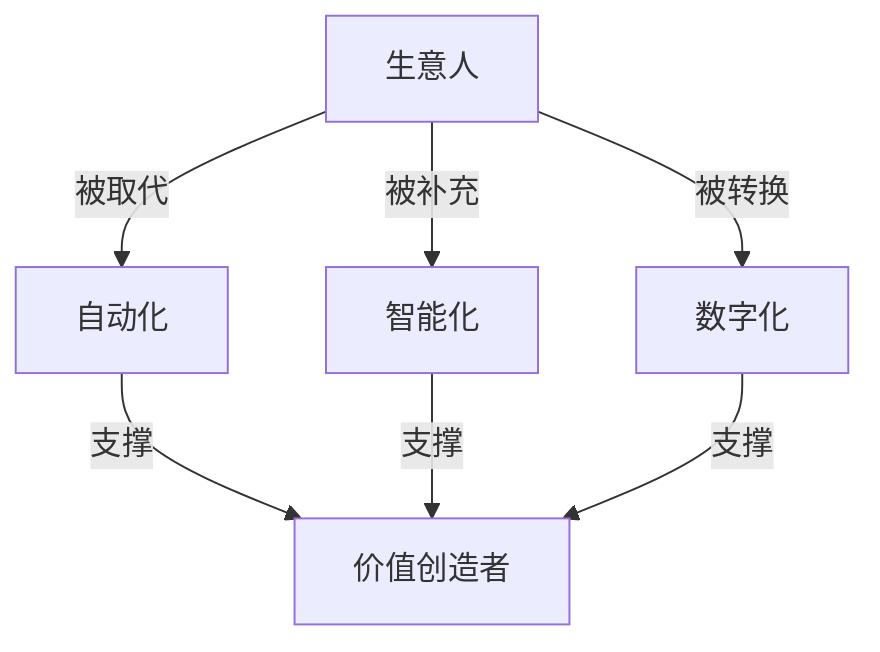

                 

# 生意人消失：价值创造者的时代来临

## 1. 背景介绍

### 1.1 问题由来

在过去几十年间，“生意人”一直是社会经济活动的核心。他们承担了商品生产、市场交易、财务管理的重任，为经济增长提供了巨大推动力。但随着信息技术的迅猛发展，特别是互联网、大数据和人工智能的兴起，传统的“生意人”角色正在发生深刻变化。自动化、智能化和数字化进程加速，导致许多重复性、低价值的工作逐渐被机器取代，从而引发了人们对于未来商业模式的重新思考。

### 1.2 问题核心关键点

这一转变中，核心问题在于：

- 技术进步对传统“生意人”角色的冲击
- 新的价值创造者（如数据分析师、产品经理、AI工程师）的崛起
- 企业如何适应数字化转型，重塑商业模式

## 2. 核心概念与联系

### 2.1 核心概念概述

理解这一变化，我们需要引入几个关键概念：

- **生意人（商人）**：指在传统经济模式下，以买卖商品或服务为核心活动的人群。
- **价值创造者**：在数字化、智能化的新时代，利用数据、算法和技术手段，创造和分配价值的新型职业群体。
- **自动化**：通过机器人、AI等技术实现自动化的生产、管理和决策过程。
- **智能化**：借助机器学习、深度学习等技术，实现更智能的决策和行动。
- **数字化**：将传统的商业模式、产品和服务，转换为数字形式，便于数据收集、分析和管理。

这些概念之间的关系可以用以下的Mermaid流程图表示：



### 2.2 核心概念原理和架构的 Mermaid 流程图

这一图表示商业角色在自动化、智能化和数字化背景下的演变路径，揭示了它们之间的内在联系。

## 3. 核心算法原理 & 具体操作步骤

### 3.1 算法原理概述

这一转变中，核心在于算法的演进和应用。

- **监督学习算法**：如分类、回归、聚类等，用于数据分析和建模。
- **强化学习算法**：如Q-learning、SARSA等，用于优化决策过程。
- **生成对抗网络（GAN）**：用于生成高质量的图像、文本等数据。
- **深度学习算法**：如卷积神经网络（CNN）、循环神经网络（RNN）、Transformer等，用于复杂数据的处理和分析。

这些算法的发展，推动了数据驱动决策、个性化推荐、智能客服等新商业模式的实现。

### 3.2 算法步骤详解

一个典型的价值创造者工作流程包括数据收集、预处理、分析、建模、验证、优化和应用。具体步骤如下：

1. **数据收集**：使用爬虫、API等技术，从各种数据源中收集相关信息。
2. **数据预处理**：清洗、转换、归一化数据，使其适合后续分析。
3. **数据分析**：利用统计学、机器学习等技术，进行特征提取、降维、聚类等操作。
4. **模型构建**：选择合适的算法，构建预测、分类、生成等模型。
5. **模型验证**：使用交叉验证、混淆矩阵等方法，评估模型效果。
6. **模型优化**：调整模型参数、选择合适的正则化方法、优化算法等。
7. **模型应用**：将模型集成到实际应用中，实现智能推荐、自动化决策等。

### 3.3 算法优缺点

算法带来了一系列好处：

- **效率提升**：自动化处理大量数据，大幅提升工作效率。
- **决策智能化**：利用数据驱动的模型，提高决策的科学性和准确性。
- **服务个性化**：通过数据分析，提供更加个性化的产品和服务。

但同时也存在缺点：

- **技术门槛高**：需要掌握各种技术和算法，学习成本高。
- **数据隐私问题**：大量数据收集和处理，可能侵犯用户隐私。
- **算法偏见**：模型可能因为训练数据有偏见，导致输出结果不公正。

### 3.4 算法应用领域

这些算法在多个领域得到了广泛应用，包括：

- **金融**：利用算法进行风险评估、投资组合优化、智能投顾等。
- **零售**：实现个性化推荐、库存管理、价格优化等。
- **医疗**：用于疾病预测、治疗方案推荐、医疗影像分析等。
- **制造业**：实现预测性维护、生产调度优化、质量控制等。
- **物流**：优化运输路径、配送时间、仓储管理等。

## 4. 数学模型和公式 & 详细讲解 & 举例说明

### 4.1 数学模型构建

构建数学模型，首先定义输入和输出变量，然后建立模型结构，最后选择合适的损失函数和优化算法。以线性回归模型为例：

设输入变量为 $x$，输出变量为 $y$，线性回归模型为 $y = wx + b$，其中 $w$ 为权重向量，$b$ 为偏置项。

### 4.2 公式推导过程

线性回归的目标是最小化预测值与实际值之间的平方误差：

$$
\min_{w,b} \frac{1}{n} \sum_{i=1}^n (y_i - (wx_i + b))^2
$$

通过梯度下降法，计算损失函数的梯度：

$$
\frac{\partial \mathcal{L}}{\partial w} = -\frac{2}{n} \sum_{i=1}^n (y_i - wx_i - b)x_i
$$
$$
\frac{\partial \mathcal{L}}{\partial b} = -\frac{2}{n} \sum_{i=1}^n (y_i - wx_i - b)
$$

### 4.3 案例分析与讲解

以医疗影像分类为例，通过卷积神经网络（CNN）模型对肿瘤进行分类：

输入为 $256 \times 256$ 的灰度图像，输出为肿瘤是否存在的二分类标签。模型通过多层的卷积和池化操作，提取图像特征，最终使用softmax函数输出预测概率。

## 5. 项目实践：代码实例和详细解释说明

### 5.1 开发环境搭建

**环境要求**：

- Python 3.7+
- TensorFlow 2.0+
- Keras
- Jupyter Notebook 或 Google Colab
- GPU支持（推荐使用NVIDIA GPU）

**安装步骤**：

1. 安装Python环境。
2. 安装TensorFlow和Keras。
3. 安装Jupyter Notebook或Google Colab。
4. 配置GPU环境（如果有的话）。

### 5.2 源代码详细实现

以下是一个简单的股票价格预测的代码实现。

```python
import tensorflow as tf
from tensorflow.keras.models import Sequential
from tensorflow.keras.layers import Dense, LSTM
import numpy as np
import pandas as pd

# 读取数据
df = pd.read_csv('stock_prices.csv')

# 数据预处理
x = df['Open'].shift(10).values.reshape(-1, 1)
y = df['Close'].values[10:]

# 构建模型
model = Sequential()
model.add(LSTM(50, return_sequences=True, input_shape=(x.shape[1], 1)))
model.add(LSTM(50))
model.add(Dense(1))

# 编译模型
model.compile(loss='mean_squared_error', optimizer='adam')

# 训练模型
model.fit(x, y, epochs=100, batch_size=32)

# 预测价格
x_test = np.array([df['Open'].values[-10:]])
x_test = x_test.reshape(1, -1, 1)
y_pred = model.predict(x_test)
```

### 5.3 代码解读与分析

**数据处理**：将数据分为训练集和测试集，使用历史价格作为预测未来价格的输入。

**模型构建**：使用LSTM层构建时间序列模型，通过多层的LSTM和全连接层，实现股票价格预测。

**训练和评估**：使用均方误差损失函数和Adam优化器训练模型，评估模型预测效果。

**结果展示**：对新输入的10个价格进行预测，输出预测结果。

## 6. 实际应用场景

### 6.1 智能客服系统

智能客服系统通过聊天机器人处理用户咨询，结合自然语言处理、机器学习等技术，实现自动回复和问题解答。系统可以处理大量用户请求，缩短响应时间，提高客户满意度。

### 6.2 金融风控

金融风控系统利用数据挖掘、机器学习等技术，对用户行为进行风险评估。系统可以实时监控交易行为，识别异常交易，预防欺诈和风险，保护用户资产安全。

### 6.3 医疗影像诊断

医疗影像诊断系统通过图像处理、深度学习等技术，对X光片、CT等影像数据进行分析，识别病变区域，辅助医生诊断。系统可以提高诊断准确性，减少误诊漏诊。

### 6.4 未来应用展望

未来，这些技术将进一步普及和深化，推动更多行业数字化转型：

- **工业**：实现预测性维护、智能制造、供应链优化等。
- **交通**：实现智能交通管理、自动驾驶、车联网等。
- **教育**：实现个性化学习、智能评估、智能辅助教学等。
- **农业**：实现精准农业、智能灌溉、智能农机等。
- **能源**：实现智能电网、智能调度、能效优化等。

## 7. 工具和资源推荐

### 7.1 学习资源推荐

- **在线课程**：如Coursera、Udacity上的机器学习课程。
- **书籍**：如《Python机器学习》、《深度学习》。
- **论文**：arXiv、IEEE Xplore等平台上的最新研究成果。

### 7.2 开发工具推荐

- **Jupyter Notebook**：一个交互式编程环境，支持Python、R等多种语言。
- **Google Colab**：Google提供的免费云平台，方便进行大规模数据处理和模型训练。
- **TensorFlow**：Google开源的深度学习框架，支持多种语言和平台。
- **Keras**：高层次的神经网络API，支持TensorFlow等后端。
- **PyTorch**：Facebook开源的深度学习框架，具有动态计算图特性。

### 7.3 相关论文推荐

- **《Deep Learning》**：Ian Goodfellow、Yoshua Bengio和Aaron Courville合著，深度学习领域的经典教材。
- **《Python机器学习》**：Sebastian Raschka和Vahid Mirjalili合著，介绍了机器学习的Python实现。
- **《Hands-On Machine Learning with Scikit-Learn, Keras, and TensorFlow》**：Aurélien Géron著，介绍使用Scikit-Learn、Keras和TensorFlow进行机器学习的实战技巧。

## 8. 总结：未来发展趋势与挑战

### 8.1 研究成果总结

- **技术进步**：算法和技术手段的不断演进，使得商业模式的变革成为可能。
- **数据驱动**：大数据和智能算法的应用，为价值创造者提供了更多决策依据。
- **智能决策**：利用数据驱动的模型，提升决策的科学性和准确性。
- **个性化服务**：通过数据分析，实现更个性化的产品和服务。

### 8.2 未来发展趋势

未来，商业模式的变革将加速，主要趋势包括：

- **自动化**：通过机器人、AI等技术，实现自动化的生产、管理和决策过程。
- **智能化**：借助机器学习、深度学习等技术，实现更智能的决策和行动。
- **数字化**：将传统的商业模式、产品和服务，转换为数字形式，便于数据收集、分析和管理。
- **全球化**：利用数据和算法，实现跨国界的业务整合和协同。
- **可持续发展**：通过智能化和数字化，实现资源的有效利用和环境的保护。

### 8.3 面临的挑战

这一变革也带来了诸多挑战：

- **技术门槛高**：需要掌握各种技术和算法，学习成本高。
- **数据隐私问题**：大量数据收集和处理，可能侵犯用户隐私。
- **算法偏见**：模型可能因为训练数据有偏见，导致输出结果不公正。
- **数据安全**：数据泄露和网络攻击的风险增加。
- **法律和伦理问题**：AI技术的广泛应用，带来了法律和伦理方面的新问题。

### 8.4 研究展望

未来，需要在以下几个方面进行深入研究：

- **算法优化**：开发更高效、更稳定的算法，提高模型的性能和可靠性。
- **数据隐私保护**：研究如何保护用户隐私，防止数据泄露。
- **模型公平性**：研究如何消除模型中的偏见，确保公平性和公正性。
- **人机协作**：研究如何实现人机协作，提升人机交互体验。
- **可持续发展**：研究如何实现可持续发展的商业模型，减少对环境的负面影响。

## 9. 附录：常见问题与解答

### Q1: 什么是价值创造者？

**A:** 价值创造者是指利用数据、算法和技术手段，创造和分配价值的新型职业群体。与传统的“生意人”不同，他们更注重数据的驱动和决策的科学性。

### Q2: 机器学习与人工智能的区别是什么？

**A:** 机器学习是人工智能的一部分，专注于让机器从数据中学习规律，自动提高性能。而人工智能则更广泛，包括知识表示、推理、规划等多个方面。

### Q3: 机器学习算法有哪些应用场景？

**A:** 机器学习算法可以应用于数据挖掘、智能推荐、金融分析、医疗诊断、自然语言处理等多个领域，具有广泛的应用前景。

### Q4: 如何评估机器学习模型的效果？

**A:** 评估机器学习模型的效果，通常使用交叉验证、混淆矩阵、ROC曲线等方法。具体评估指标包括准确率、召回率、F1分数等。

### Q5: 未来人工智能技术会取代人类吗？

**A:** 人工智能技术可以辅助人类工作，提高效率，但并不会完全取代人类。人类的创造力、情感、伦理判断等能力，是目前AI难以替代的。未来，人机协作将成为新的主流模式。

---

作者：禅与计算机程序设计艺术 / Zen and the Art of Computer Programming

