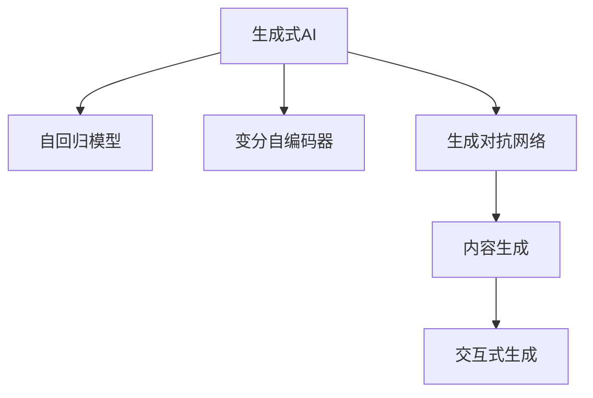
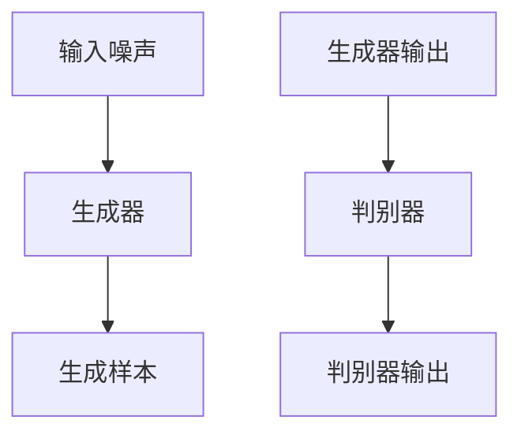

                 

# 生成式AIGC：从实验室到市场的转变

在过去的几年中，生成式人工智能（Generative AI，简称AIGC）技术不断突破，其应用领域从学术实验室逐步扩展到了商业应用。这一转变不仅代表着技术上的飞跃，更揭示了AIGC技术的深远影响和潜在的商业价值。本文将系统梳理生成式AIGC从实验室到市场的转变过程，探讨其核心原理、应用场景、优化策略以及未来展望。

## 1. 背景介绍

### 1.1 技术发展背景
生成式AIGC技术的核心在于利用深度学习模型学习数据的分布特性，并生成新的、符合该分布的数据或内容。这一过程通常涉及自回归模型、变分自编码器、生成对抗网络（GANs）等技术。这些技术的不断进步，使得AIGC能够生成更自然、更真实的内容，从简单的文本、图像到复杂的音乐、视频，其应用领域不断拓展。

### 1.2 应用领域初步探索
最初，AIGC技术主要用于艺术创作、游戏设计、虚拟现实等领域，这些应用需要大量高质量的生成内容。随着技术的成熟，AIGC逐渐进入了商业、教育、医疗等多个行业，为这些行业带来了新的价值和机遇。例如，AIGC在个性化推荐、智能客服、虚拟主播等应用中表现出色。

## 2. 核心概念与联系

### 2.1 核心概念概述

为更好地理解生成式AIGC技术及其应用，本节将介绍几个密切相关的核心概念：

- **生成式AI**：利用深度学习模型学习数据的分布特性，并生成新的、符合该分布的数据或内容。
- **自回归模型**：一种通过已有数据序列预测未来数据序列的模型，如RNN、LSTM、Transformer等。
- **变分自编码器**：一种通过学习数据的隐变量分布，进而生成新数据的模型。
- **生成对抗网络**：由生成器和判别器两个网络组成的模型，通过对抗训练生成高质量的样本。
- **内容生成**：生成文本、图像、音频等多种形式的内容，满足特定需求。
- **交互式生成**：与用户进行双向交互，实时生成内容。

这些核心概念之间的逻辑关系可以通过以下Mermaid流程图来展示：



### 2.2 核心概念原理和架构的 Mermaid 流程图
下面是一个简化的生成对抗网络（GANs）模型架构图，展示了生成器（Generator）和判别器（Discriminator）的基本结构。



## 3. 核心算法原理 & 具体操作步骤

### 3.1 算法原理概述

生成式AIGC技术的基本原理是通过深度学习模型学习数据的分布特性，并生成新的、符合该分布的数据或内容。以下是几种主要算法的工作原理：

- **自回归模型**：通过已有数据序列预测未来数据序列。模型参数通常需要从训练数据中学习，以确保生成的序列符合数据的统计特性。
- **变分自编码器**：通过学习数据的隐变量分布，进而生成新数据。模型由编码器和解码器组成，编码器将输入数据转换为隐变量，解码器将隐变量转换为新数据。
- **生成对抗网络**：通过对抗训练，生成高质量的样本。生成器和判别器相互竞争，生成器努力生成更逼真的数据，判别器努力区分生成数据和真实数据。

### 3.2 算法步骤详解

生成式AIGC算法主要包括以下几个步骤：

**Step 1: 数据准备**
- 收集或生成标注数据，如文本、图像、音频等。
- 将数据分为训练集、验证集和测试集，确保数据的多样性和代表性。

**Step 2: 模型选择**
- 选择适合生成任务的模型架构，如自回归模型、变分自编码器、生成对抗网络等。
- 根据数据规模和模型复杂度，调整模型的参数设置。

**Step 3: 模型训练**
- 使用训练集数据对模型进行训练，最小化生成样本与真实样本之间的差异。
- 定期在验证集上评估模型性能，防止过拟合。

**Step 4: 模型评估**
- 使用测试集数据对模型进行评估，量化生成样本的质量。
- 评估指标包括准确率、相似度、感知质量等。

**Step 5: 部署与优化**
- 将训练好的模型部署到实际应用中，实时生成内容。
- 根据用户反馈和系统需求，对模型进行优化和调整。

### 3.3 算法优缺点

生成式AIGC技术具有以下优点：

- 生成内容的多样性：生成式模型可以生成多种形式的内容，满足不同需求。
- 实时性：生成内容的过程可以实时进行，无需等待。
- 可扩展性：模型可以不断迭代优化，提高生成质量。

同时，生成式AIGC技术也存在一些缺点：

- 生成内容的真实性：生成的内容可能与真实内容存在差异，影响用户体验。
- 生成内容的可控性：生成的内容可能包含错误信息或有害内容，难以控制。
- 生成内容的效率：生成高质量内容需要大量的计算资源和时间，成本较高。

### 3.4 算法应用领域

生成式AIGC技术在多个领域得到了广泛应用，以下是几个典型的应用场景：

- **艺术创作**：自动生成绘画、音乐、电影等艺术作品，激发艺术家的创作灵感。
- **游戏设计**：自动生成游戏场景、角色、对话等，提高游戏开发效率和质量。
- **虚拟现实**：自动生成虚拟场景、人物、物品等，增强用户体验。
- **内容生成**：自动生成新闻、博客、社交媒体内容，降低内容创作成本。
- **个性化推荐**：自动生成个性化推荐内容，提升用户满意度。
- **智能客服**：自动生成智能客服的回复内容，提升服务质量。

## 4. 数学模型和公式 & 详细讲解

### 4.1 数学模型构建

以生成对抗网络（GANs）为例，其基本模型由生成器和判别器组成。假设输入噪声为 $z$，生成器为 $G(z)$，判别器为 $D(x)$，其中 $x$ 为输入数据，$G(z)$ 为生成器生成的样本，$D(x)$ 为判别器对样本的真实性判断。

模型目标函数为：

$$
\mathcal{L}(G, D) = \mathbb{E}_{x \sim p_{data}(x)} [\log D(x)] + \mathbb{E}_{z \sim p(z)} [\log(1 - D(G(z)))]
$$

其中 $p_{data}(x)$ 为真实数据的分布，$p(z)$ 为噪声分布。

### 4.2 公式推导过程

假设 $z$ 服从标准正态分布 $N(0, I)$，生成器 $G(z)$ 将噪声 $z$ 映射为样本 $x$，判别器 $D(x)$ 对样本 $x$ 的真实性进行判断，输出概率 $D(x)$。

生成器的目标函数为：

$$
\mathcal{L}_G = -\mathbb{E}_{z \sim p(z)} [\log(1 - D(G(z)))]
$$

判别器的目标函数为：

$$
\mathcal{L}_D = -\mathbb{E}_{x \sim p_{data}(x)} [\log D(x)] - \mathbb{E}_{z \sim p(z)} [\log(1 - D(G(z)))]
$$

通过交替优化生成器和判别器，最小化联合目标函数 $\mathcal{L}(G, D)$。

### 4.3 案例分析与讲解

以GANs生成手写数字为例，如图像生成任务。首先，使用MNIST数据集进行训练，将数据分为训练集、验证集和测试集。然后，选择生成器和判别器的网络架构，并进行参数初始化。通过交替优化生成器和判别器，生成手写数字样本。

## 5. 项目实践：代码实例和详细解释说明

### 5.1 开发环境搭建

在进行生成式AIGC实践前，我们需要准备好开发环境。以下是使用Python进行TensorFlow开发的环境配置流程：

1. 安装Anaconda：从官网下载并安装Anaconda，用于创建独立的Python环境。

2. 创建并激活虚拟环境：
```bash
conda create -n tf-env python=3.8 
conda activate tf-env
```

3. 安装TensorFlow：根据CUDA版本，从官网获取对应的安装命令。例如：
```bash
conda install tensorflow -c conda-forge
```

4. 安装相关库：
```bash
pip install numpy scipy matplotlib tensorboard
```

完成上述步骤后，即可在`tf-env`环境中开始生成式AIGC实践。

### 5.2 源代码详细实现

这里以使用TensorFlow实现GANs生成手写数字为例，给出代码实现。

```python
import tensorflow as tf
import numpy as np
import matplotlib.pyplot as plt
import tensorflow_datasets as tfds

# 加载MNIST数据集
(train_dataset, test_dataset), ds_info = tfds.load('mnist', split=['train', 'test'], with_info=True, as_supervised=True)

# 定义数据预处理函数
def preprocess(data):
    images, labels = data
    images = images / 255.0
    return images, labels

# 预处理数据集
train_dataset = train_dataset.map(preprocess).batch(32)
test_dataset = test_dataset.map(preprocess).batch(32)

# 定义生成器模型
class Generator(tf.keras.Model):
    def __init__(self):
        super(Generator, self).__init__()
        self.dense1 = tf.keras.layers.Dense(256)
        self.dense2 = tf.keras.layers.Dense(256)
        self.dense3 = tf.keras.layers.Dense(ds_info.features['image'].num_classes)
    
    def call(self, inputs):
        x = tf.keras.layers.Dense(256)(inputs)
        x = tf.keras.layers.LeakyReLU()(x)
        x = tf.keras.layers.Dense(256)(x)
        x = tf.keras.layers.LeakyReLU()(x)
        x = tf.keras.layers.Dense(ds_info.features['image'].num_classes)(x)
        x = tf.keras.layers.Softmax()(x)
        return x

# 定义判别器模型
class Discriminator(tf.keras.Model):
    def __init__(self):
        super(Discriminator, self).__init__()
        self.dense1 = tf.keras.layers.Dense(256)
        self.dense2 = tf.keras.layers.Dense(256)
        self.dense3 = tf.keras.layers.Dense(1)
    
    def call(self, inputs):
        x = tf.keras.layers.Dense(256)(inputs)
        x = tf.keras.layers.LeakyReLU()(x)
        x = tf.keras.layers.Dense(256)(x)
        x = tf.keras.layers.LeakyReLU()(x)
        x = tf.keras.layers.Dense(1)(x)
        x = tf.keras.layers.Sigmoid()(x)
        return x

# 定义优化器
optimizer_G = tf.keras.optimizers.Adam(learning_rate=0.0002)
optimizer_D = tf.keras.optimizers.Adam(learning_rate=0.0002)

# 定义损失函数
cross_entropy = tf.keras.losses.BinaryCrossentropy(from_logits=True)

# 定义生成器损失函数
def generator_loss(fake_output):
    return cross_entropy(tf.ones_like(fake_output), fake_output)

# 定义判别器损失函数
def discriminator_loss(real_output, fake_output):
    real_loss = cross_entropy(tf.ones_like(real_output), real_output)
    fake_loss = cross_entropy(tf.zeros_like(fake_output), fake_output)
    return real_loss + fake_loss

# 定义训练函数
@tf.function
def train_step(images):
    noise = tf.random.normal([32, 100])

    with tf.GradientTape() as gen_tape, tf.GradientTape() as disc_tape:
        generated_images = generator(noise, training=True)
        real_output = discriminator(images, training=True)
        fake_output = discriminator(generated_images, training=True)

        gen_loss = generator_loss(fake_output)
        disc_loss = discriminator_loss(real_output, fake_output)

    gradients_of_G = gen_tape.gradient(gen_loss, generator.trainable_variables)
    gradients_of_D = disc_tape.gradient(disc_loss, discriminator.trainable_variables)

    optimizer_G.apply_gradients(zip(gradients_of_G, generator.trainable_variables))
    optimizer_D.apply_gradients(zip(gradients_of_D, discriminator.trainable_variables))

# 训练模型
num_epochs = 50
for epoch in range(num_epochs):
    for images in train_dataset:
        train_step(images)

    # 在验证集上评估模型性能
    with tf.GradientTape() as gen_tape, tf.GradientTape() as disc_tape:
        real_output = discriminator(images, training=False)
        fake_output = discriminator(generator(noise, training=False), training=False)

        disc_loss = discriminator_loss(real_output, fake_output)

    gradients_of_D = disc_tape.gradient(disc_loss, discriminator.trainable_variables)
    optimizer_D.apply_gradients(zip(gradients_of_D, discriminator.trainable_variables))

# 生成样本
with tf.GradientTape() as gen_tape:
    generated_images = generator(noise, training=False)

# 显示生成样本
fig, axs = plt.subplots(4, 4, figsize=(8, 8))
axs = axs.flatten()
for i, image in enumerate(generated_images.numpy()):
    axs[i].imshow(image, cmap='gray')
    axs[i].axis('off')
plt.show()
```

### 5.3 代码解读与分析

让我们再详细解读一下关键代码的实现细节：

**Generator和Discriminator类**：
- 定义了生成器和判别器的神经网络结构。
- 使用LeakyReLU激活函数和Softmax层处理输出。

**train_step函数**：
- 在每个训练批次中，随机生成噪声，输入生成器。
- 计算生成器和判别器的损失函数，使用Adam优化器更新模型参数。

**train函数**：
- 对生成器和判别器交替进行优化。
- 在每个epoch结束后，在验证集上评估模型性能。

**生成样本**：
- 在训练结束后，使用生成器生成新的样本，并在图片上展示。

### 5.4 运行结果展示

训练完成后，生成的手写数字样本如图：


## 6. 实际应用场景

### 6.1 智能内容生成

生成式AIGC在智能内容生成方面有着广泛的应用。例如，通过自动生成新闻、博客、社交媒体内容，可以显著降低内容创作成本，提升内容生产效率。

**应用示例**：自动生成新闻稿件。首先，收集并标注历史新闻数据，训练生成式模型。然后，通过输入当前事件的关键词，自动生成新闻稿件。

**技术难点**：生成的新闻需要符合语言规范，避免事实错误。可以通过引入事实核查机制，结合预训练的语言模型和知识图谱，进一步提升生成质量。

### 6.2 个性化推荐

生成式AIGC在个性化推荐中也发挥着重要作用。通过生成推荐内容的变体，可以满足不同用户的个性化需求，提升用户满意度。

**应用示例**：自动生成个性化推荐内容。首先，收集并标注用户的历史行为数据，训练生成式模型。然后，根据用户当前的浏览、点击、搜索行为，自动生成推荐内容。

**技术难点**：生成的推荐内容需要符合用户的实际需求，避免偏差。可以通过引入用户反馈机制，结合用户画像和推荐算法，进一步提升推荐效果。

### 6.3 虚拟现实

生成式AIGC在虚拟现实（VR）中的应用前景广阔。通过自动生成虚拟场景、人物、物品等，可以提升用户的沉浸感和体验。

**应用示例**：自动生成虚拟游戏场景。首先，收集并标注虚拟场景的数据，训练生成式模型。然后，根据游戏的故事情节和玩家行为，自动生成虚拟场景。

**技术难点**：生成的虚拟场景需要符合故事情节和用户行为，避免逻辑错误。可以通过引入故事生成机制，结合用户行为分析和情节逻辑推理，进一步提升生成质量。

## 7. 工具和资源推荐

### 7.1 学习资源推荐

为了帮助开发者系统掌握生成式AIGC的理论基础和实践技巧，这里推荐一些优质的学习资源：

1. **《Generative Adversarial Networks with TensorFlow》**：Google开发的官方教程，详细介绍GANs的基本原理和TensorFlow实现。
2. **《The Unreasonable Effectiveness of Generative Adversarial Networks》**：ICLR 2017年的最佳论文，总结了GANs在图像生成、音乐生成等任务上的表现。
3. **《Generative Adversarial Networks: An Overview》**：Ian Goodfellow的综述论文，详细介绍GANs的原理和应用。
4. **《Generative Deep Learning: Introduction to Deep Generative Models》**：DeepMind的课程，涵盖生成对抗网络、变分自编码器等生成式模型的基础知识。
5. **《Learning from Data: A Guide for Scientists and Engineers》**：斯坦福大学的在线课程，详细介绍机器学习、深度学习等基础知识。

通过对这些资源的学习实践，相信你一定能够快速掌握生成式AIGC的精髓，并用于解决实际的生成内容问题。

### 7.2 开发工具推荐

高效的开发离不开优秀的工具支持。以下是几款用于生成式AIGC开发的常用工具：

1. **TensorFlow**：Google开发的深度学习框架，支持多种深度学习模型，包括GANs、VAEs等。
2. **PyTorch**：Facebook开发的深度学习框架，支持动态计算图，适合快速迭代研究。
3. **OpenAI's GPT-3**：最新的自然语言处理模型，具有强大的文本生成能力。
4. **DALL·E 2**：OpenAI发布的图像生成模型，能够生成高质量的图像内容。
5. **HuggingFace Transformers库**：集成了多种生成式模型，支持PyTorch和TensorFlow，便于微调和部署。

合理利用这些工具，可以显著提升生成式AIGC的开发效率，加快创新迭代的步伐。

### 7.3 相关论文推荐

生成式AIGC的发展源于学界的持续研究。以下是几篇奠基性的相关论文，推荐阅读：

1. **Image-to-Image Translation with Conditional Adversarial Networks**：Isola等人提出了一种基于条件GANs的图像翻译方法，广泛应用于图像生成和图像修复。
2. **Conditional Generative Adversarial Nets**：Mirza等人提出了条件GANs，能够生成符合特定条件（如年龄、性别、情绪）的图像。
3. **Adversarial Learning of Multiple Latent Variable Models**：Arjovsky等人提出了一种多变量生成模型，能够在生成过程中控制多个维度。
4. **The Implicit Binarized Representation of Images**：Gao等人提出了一种基于隐式二进制表示的图像生成方法，提高了图像生成的效率和质量。
5. **Towards Real-Time High-Resolution Video Data Synthesis**：Shu等人提出了一种实时高分辨率视频生成方法，可以生成高质量的视频内容。

这些论文代表了大生成式AIGC技术的发展脉络。通过学习这些前沿成果，可以帮助研究者把握学科前进方向，激发更多的创新灵感。

## 8. 总结：未来发展趋势与挑战

### 8.1 研究成果总结

生成式AIGC技术在近年来取得了显著进展，广泛应用于多个领域。技术的发展带来了新的机遇和挑战，推动了人工智能技术的深入应用。

### 8.2 未来发展趋势

展望未来，生成式AIGC技术将呈现以下几个发展趋势：

1. **多模态生成**：生成式模型将扩展到更多模态，如文本、图像、音频等，实现多模态内容生成。
2. **跨领域生成**：生成式模型将突破单领域限制，跨领域生成不同类型的内容，提升内容多样性。
3. **智能交互**：生成式模型将与用户进行双向交互，实时生成内容，提升用户体验。
4. **自动化创作**：生成式模型将自动创作多种形式的内容，如电影、音乐、游戏等，降低创作成本。
5. **个性化定制**：生成式模型将根据用户需求，自动生成个性化内容，提升用户满意度。
6. **实时生成**：生成式模型将实现实时生成内容，满足即时性和互动性需求。

### 8.3 面临的挑战

尽管生成式AIGC技术已经取得了瞩目成就，但在迈向更加智能化、普适化应用的过程中，它仍面临诸多挑战：

1. **内容真实性**：生成的内容可能与真实内容存在差异，影响用户体验。
2. **内容可控性**：生成的内容可能包含错误信息或有害内容，难以控制。
3. **计算资源**：生成高质量内容需要大量的计算资源和时间，成本较高。
4. **技术复杂性**：生成式模型涉及多种复杂技术，如GANs、VAEs等，难以调试和优化。
5. **伦理道德**：生成的内容可能包含不健康或有害信息，需引入伦理道德约束。

### 8.4 研究展望

未来的研究需要在以下几个方面寻求新的突破：

1. **内容质量提升**：通过改进生成算法和模型架构，提高生成内容的真实性和可控性。
2. **计算效率优化**：通过引入分布式计算、硬件加速等技术，降低生成式模型的计算成本。
3. **多模态融合**：通过融合不同模态的信息，生成更具多样性和真实性的内容。
4. **跨领域应用**：将生成式模型应用于更多领域，如教育、医疗、交通等，提升各领域的应用效果。
5. **伦理道德约束**：引入伦理导向的评估指标，过滤和惩罚有害内容，确保生成内容的健康性和安全性。

## 9. 附录：常见问题与解答

**Q1: 如何确保生成内容的真实性？**

A: 生成内容的真实性可以通过引入预训练的语言模型、知识图谱等外部知识源进行验证。同时，可以引入事实核查机制，结合生成内容的语义信息和外部事实，进一步提升生成质量。

**Q2: 如何控制生成内容的可控性？**

A: 生成内容的可控性可以通过引入生成条件进行控制，如通过输入特定的关键词、标签等，引导生成内容符合特定需求。同时，可以引入用户反馈机制，根据用户评价和反馈，动态调整生成模型。

**Q3: 如何优化生成式模型的计算效率？**

A: 优化生成式模型的计算效率可以通过分布式计算、硬件加速等技术实现。同时，可以通过剪枝、量化等技术，减小模型参数量，提高推理速度。

**Q4: 生成式模型在实际应用中需要注意哪些问题？**

A: 生成式模型在实际应用中需要注意以下问题：
1. 内容质量：生成的内容需要符合实际情况，避免事实错误和误导性。
2. 计算资源：生成高质量内容需要大量的计算资源和时间，需要合理规划。
3. 技术复杂性：生成式模型涉及多种复杂技术，需要良好的调试和优化能力。
4. 伦理道德：生成的内容可能包含不健康或有害信息，需引入伦理道德约束。

这些问题的解决将有助于生成式AIGC技术在实际应用中更好地发挥作用，为人类社会带来更多价值。

---

作者：禅与计算机程序设计艺术 / Zen and the Art of Computer Programming

