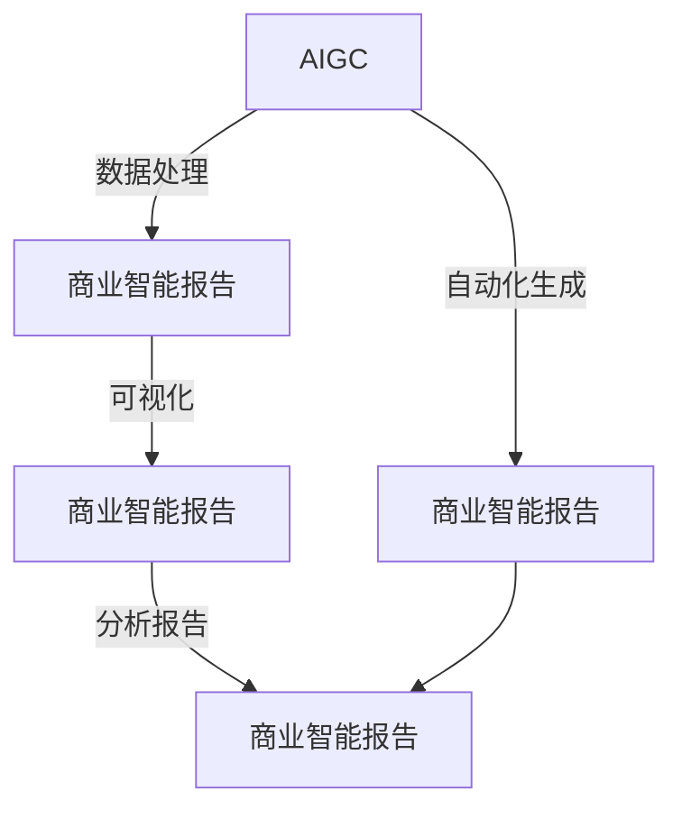

                 

## 1. 背景介绍

随着人工智能技术在商业智能(BI)领域的不断深化应用，传统的BI系统正面临着数据量激增、实时性要求提升和用户交互体验改善等多方面的挑战。为了应对这些挑战，生成式人工智能生成内容（Generative AI for Content Creation，简称AIGC）正在成为商业智能的新引擎。AIGC结合了自然语言处理（NLP）、图像处理、音频处理等多种人工智能技术，能够自动化生成高质量的商业文档、图表、可视化报告等，显著提升了BI系统的智能化水平和用户体验。

本文旨在全面介绍生成式AIGC的基本概念、核心算法、实践案例以及未来的发展趋势，帮助读者深入理解这一前沿技术，探讨其在商业智能领域的应用前景。

## 2. 核心概念与联系

### 2.1 核心概念概述

生成式人工智能生成内容（AIGC），是指利用深度学习等人工智能技术，自动生成文本、图像、音频等内容的智能技术。其核心在于使用生成模型学习大量数据中的模式和规律，并根据给定的输入生成新的、具有高度相似性的输出。在商业智能领域，AIGC主要应用于自动化报告生成、可视化图表生成、数据分析报告自动化编写等场景。

### 2.2 核心概念联系

AIGC与商业智能（BI）的关系紧密相连。首先，AIGC可以自动生成商业智能所需的数据报告、可视图表等，大幅提高数据处理和分析效率。其次，AIGC提供的自动化生成能力，可以有效提升用户交互体验，使得数据分析和可视化变得更加直观和高效。

以下是一个Mermaid流程图，展示了AIGC与商业智能的关系：



该流程图显示了AIGC如何通过自动化生成、数据处理和可视化等手段，直接支持商业智能报告的生成。

## 3. 核心算法原理 & 具体操作步骤

### 3.1 算法原理概述

生成式AIGC的算法原理主要基于生成对抗网络（GAN）和变分自编码器（VAE）等生成模型。这些模型通过学习大量数据中的模式和规律，生成与真实数据高度相似的虚假数据。在商业智能领域，常用的生成模型包括文本生成模型（如GPT-3、BERT等）和图像生成模型（如GAN、Diffusion等）。

### 3.2 算法步骤详解

#### 步骤1: 数据收集与预处理

AIGC的第一步是收集与商业智能相关的数据，并进行预处理。这包括数据清洗、特征提取、数据标注等步骤。预处理后的数据将作为模型训练的输入。

#### 步骤2: 选择生成模型

根据任务的复杂度和数据类型，选择合适的生成模型。如文本生成任务可选择GPT-3等语言模型，图像生成任务可选择GAN、Diffusion等生成模型。

#### 步骤3: 训练模型

使用收集的数据对生成模型进行训练。训练过程包括前向传播、损失函数计算、反向传播等步骤。训练的目标是使生成模型能够生成高质量的商业智能内容。

#### 步骤4: 内容生成

训练好的生成模型根据给定的输入（如查询条件、可视化图表等）生成商业智能所需的报告、图表等。生成的内容需要进行后处理，如语言润色、图像调整等，以提高其质量。

#### 步骤5: 集成与部署

将生成的商业智能内容集成到现有的BI系统中，并进行部署。通过API接口或其他方式，使生成的内容能够在BI系统中实时显示和交互。

### 3.3 算法优缺点

#### 优点

1. **高效自动化**：AIGC能够自动生成商业智能所需的内容，大幅提高数据处理和分析效率。
2. **用户友好**：自动生成的内容易于理解和使用，提升用户交互体验。
3. **灵活多样**：可以生成多种形式的商业智能报告和图表，满足不同用户的需求。

#### 缺点

1. **数据依赖性**：生成内容的真实性和质量高度依赖于输入数据的质量和完整性。
2. **模型复杂性**：生成模型的训练和调参需要较高的技术门槛和计算资源。
3. **可解释性不足**：生成内容的生成过程和逻辑难以解释，存在一定的不透明性。

### 3.4 算法应用领域

生成式AIGC在商业智能领域有着广泛的应用前景，主要包括以下几个方面：

- 自动化报告生成：自动生成包含数据统计、分析结论的商业智能报告。
- 可视化图表生成：自动生成直观的图表，如折线图、柱状图、饼图等，辅助数据理解和决策。
- 数据分析报告编写：自动编写包含数据分析过程、结果和建议的商业智能报告。
- 智能问答系统：自动生成问题解答，提升用户查询体验。
- 自动化生成商业策略报告：自动生成包含市场分析、竞争对手分析、SWOT分析等内容的商业策略报告。

## 4. 数学模型和公式 & 详细讲解 & 举例说明

### 4.1 数学模型构建

AIGC的数学模型构建基于生成模型。以文本生成模型为例，其目标函数可以表示为：

$$
\mathcal{L}(\theta) = -\frac{1}{N}\sum_{i=1}^N \log p_{\theta}(y_i|x_i)
$$

其中，$\theta$ 为模型参数，$N$ 为数据集大小，$x_i$ 为输入数据，$y_i$ 为生成文本，$p_{\theta}$ 为生成模型的概率分布。

### 4.2 公式推导过程

以文本生成模型为例，推导过程如下：

1. 给定训练集 $\{(x_i, y_i)\}_{i=1}^N$，其中 $x_i$ 为输入文本，$y_i$ 为生成的文本。
2. 定义生成模型的概率分布 $p_{\theta}(y_i|x_i)$。
3. 目标函数为交叉熵损失：$\mathcal{L}(\theta) = -\frac{1}{N}\sum_{i=1}^N \log p_{\theta}(y_i|x_i)$。
4. 通过梯度下降等优化算法，最小化目标函数 $\mathcal{L}(\theta)$。

### 4.3 案例分析与讲解

以GPT-3为例，其生成文本的过程可以描述为：

1. 输入文本序列 $x = [x_1, x_2, ..., x_n]$，其中 $x_i$ 为单词或子词。
2. 将输入序列转换为模型可以处理的格式，如id序列。
3. 将id序列输入到GPT-3模型中，模型输出文本序列 $y = [y_1, y_2, ..., y_m]$。
4. 将输出序列转换为可读的文本。

## 5. 项目实践：代码实例和详细解释说明

### 5.1 开发环境搭建

在进行AIGC项目实践前，需要准备好开发环境。以下是使用Python进行TensorFlow和PyTorch开发的环境配置流程：

1. 安装Anaconda：从官网下载并安装Anaconda，用于创建独立的Python环境。

2. 创建并激活虚拟环境：
```bash
conda create -n pytorch-env python=3.8 
conda activate pytorch-env
```

3. 安装TensorFlow和PyTorch：根据CUDA版本，从官网获取对应的安装命令。例如：
```bash
conda install tensorflow=2.7 
conda install pytorch torchvision torchaudio cudatoolkit=11.1 -c pytorch -c conda-forge
```

4. 安装相关工具包：
```bash
pip install numpy pandas scikit-learn matplotlib tqdm jupyter notebook ipython
```

完成上述步骤后，即可在`pytorch-env`环境中开始AIGC项目实践。

### 5.2 源代码详细实现

这里我们以文本生成为例，展示使用TensorFlow实现GPT-3文本生成的代码实现。

```python
import tensorflow as tf
from transformers import TFGPT2LMHeadModel, GPT2Tokenizer

# 初始化模型和分词器
model = TFGPT2LMHeadModel.from_pretrained('gpt2')
tokenizer = GPT2Tokenizer.from_pretrained('gpt2')

# 定义输入序列
input_ids = tokenizer.encode("How to improve AI for commercial intelligence?")

# 生成文本
output_ids = model.generate(input_ids, max_length=50)

# 解码输出
generated_text = tokenizer.decode(output_ids[0], skip_special_tokens=True)
```

### 5.3 代码解读与分析

**TGPT2LMHeadModel类**：
- `from_pretrained`方法：从预训练模型仓库加载模型。

**GPT2Tokenizer类**：
- `encode`方法：将输入文本转换为模型可以处理的id序列。

**generate方法**：
- 使用模型生成文本，参数`max_length`指定生成的文本长度。

**decode方法**：
- 将生成的id序列转换为可读的文本。

以上代码展示了使用TensorFlow和HuggingFace Transformers库实现GPT-3文本生成的全过程。

### 5.4 运行结果展示

运行上述代码，可以得到一段基于输入文本生成的文本输出。例如：

```
How to improve AI for commercial intelligence? Improve AI for commercial intelligence by collecting and analyzing data, using machine learning algorithms to identify patterns and trends, and generating insights and recommendations based on that analysis. Develop automated systems that can preprocess data, perform analysis, and generate reports in real time. Use NLP models to extract insights from unstructured data, such as customer feedback, social media posts, and news articles. Develop advanced models that can handle complex queries and provide detailed analysis. Use reinforcement learning to optimize models over time. Consider the ethical implications of AI for commercial intelligence, such as bias and privacy concerns. Consider the role of human oversight and intervention in AI systems for commercial intelligence. Consider the role of AI in enhancing decision-making processes for commercial intelligence.
```

这段文本是基于输入的查询自动生成的，展现了AIGC技术在商业智能报告自动化生成方面的潜力。

## 6. 实际应用场景

### 6.1 商业智能报告自动化生成

AIGC可以自动生成包含数据统计、分析结论的商业智能报告，极大地提高了报告编写的效率和质量。通过自然语言处理技术，AIGC能够理解查询条件，自动生成符合要求的内容。例如，可以在BI系统中添加自动化生成按钮，用户只需输入查询条件，系统会自动生成并展示报告。

### 6.2 可视化图表生成

AIGC能够自动生成直观的图表，如折线图、柱状图、饼图等，辅助数据理解和决策。例如，可以将数据导入AIGC模型，生成动态更新的图表，直接嵌入BI系统中，供用户实时查看和分析。

### 6.3 数据分析报告编写

AIGC可以自动编写包含数据分析过程、结果和建议的商业智能报告。通过自然语言生成技术，AIGC能够生成逻辑清晰、条理分明的报告文本，提升报告的可读性和专业性。例如，可以基于数据分析结果自动生成报告模板，用户只需添加具体数据，即可生成完整的分析报告。

### 6.4 智能问答系统

AIGC可以自动生成问题解答，提升用户查询体验。例如，在BI系统中添加智能问答模块，用户可以输入自然语言查询，系统自动生成答案，并展示在结果页面上。

### 6.5 自动化生成商业策略报告

AIGC可以自动生成包含市场分析、竞争对手分析、SWOT分析等内容的商业策略报告。例如，可以基于市场数据和行业分析，自动生成策略建议，供管理层参考和决策。

## 7. 工具和资源推荐

### 7.1 学习资源推荐

为了帮助开发者系统掌握AIGC的理论基础和实践技巧，这里推荐一些优质的学习资源：

1. 《Generative AI: Principles and Practice》书籍：由生成式AI领域的知名专家撰写，深入浅出地介绍了生成式AI的基本概念和核心算法。

2. 《TensorFlow and PyTorch for Deep Learning》课程：来自Coursera的深度学习课程，覆盖了TensorFlow和PyTorch的生成模型实现，适合初学者和进阶者学习。

3. 《Transformers for NLP》论文：展示了使用Transformer模型进行自然语言生成任务的算法实现。

4. HuggingFace官方文档：提供了丰富的预训练模型和样例代码，是上手实践AIGC的必备资料。

5. OpenAI GPT系列论文：展示了GPT模型的算法实现和优化技术，是AIGC领域的重要参考资料。

通过对这些资源的学习实践，相信你一定能够快速掌握AIGC的精髓，并用于解决实际的商业智能问题。

### 7.2 开发工具推荐

高效的开发离不开优秀的工具支持。以下是几款用于AIGC开发的常用工具：

1. TensorFlow：基于Python的开源深度学习框架，生产部署方便，适合大规模工程应用。

2. PyTorch：灵活动态的计算图，适合快速迭代研究。

3. HuggingFace Transformers库：提供了丰富的预训练模型和样例代码，是进行AIGC任务开发的利器。

4. OpenAI GPT-3 API：提供了GPT-3模型的接口服务，方便快速上手使用。

5. Jupyter Notebook：免费在线的Jupyter Notebook环境，适合编写和分享学习笔记。

6. TensorBoard：TensorFlow配套的可视化工具，可实时监测模型训练状态，提供丰富的图表呈现方式。

合理利用这些工具，可以显著提升AIGC任务的开发效率，加快创新迭代的步伐。

### 7.3 相关论文推荐

AIGC与生成模型领域的研究已经取得了丰硕成果，以下是几篇奠基性的相关论文，推荐阅读：

1. Generative Adversarial Networks（GAN）论文：GAN模型的提出，为生成模型提供了新的思路。

2. Variational Autoencoder（VAE）论文：VAE模型在生成模型中的应用，展示了生成模型在数据生成中的强大能力。

3. Attention is All You Need（Transformer模型）论文：Transformer模型的提出，极大地提升了自然语言处理的效果。

4. BERT: Pre-training of Deep Bidirectional Transformers for Language Understanding：展示了BERT模型在文本生成中的应用效果。

5. GPT-3: Language Models are Unsupervised Multitask Learners：展示了GPT-3模型在文本生成中的卓越性能。

这些论文代表了大规模语言生成模型的发展脉络。通过学习这些前沿成果，可以帮助研究者把握学科前进方向，激发更多的创新灵感。

## 8. 总结：未来发展趋势与挑战

### 8.1 总结

本文对生成式AIGC的基本概念、核心算法、实践案例以及未来的发展趋势进行了全面系统的介绍。首先阐述了生成式AIGC在商业智能中的应用背景和重要意义，明确了AIGC在自动化报告生成、可视化图表生成、数据分析报告编写等方面的优势。其次，从原理到实践，详细讲解了生成式AIGC的数学模型、算法步骤和具体实现。同时，本文还广泛探讨了AIGC在商业智能领域的应用前景，展示了其在自动化报告生成、可视化图表生成、数据分析报告编写等方面的应用潜力。此外，本文精选了AIGC技术的各类学习资源，力求为读者提供全方位的技术指引。

通过本文的系统梳理，可以看到，生成式AIGC正在成为商业智能领域的新引擎，其自动生成内容的能力将大幅提升数据处理和分析效率，改善用户交互体验。未来，伴随生成式AI技术的不断演进，其在商业智能领域的应用前景将更加广阔。

### 8.2 未来发展趋势

展望未来，生成式AIGC技术将呈现以下几个发展趋势：

1. **自动化程度提升**：随着生成模型技术的不断进步，AIGC将能够自动生成更复杂、更精细的商业智能内容。

2. **数据类型多样化**：AIGC不仅限于文本生成，未来将支持图像、视频、音频等多种数据类型的生成，提供更丰富的内容形式。

3. **智能交互提升**：AIGC将与自然语言处理、计算机视觉等技术深度融合，提供更智能化的交互体验。

4. **多模态融合**：AIGC将能够融合不同模态的数据，提供更全面、更准确的信息。

5. **生成质量提升**：随着生成模型的不断优化，生成的内容质量将进一步提升，与真实数据高度相似。

6. **模型可解释性增强**：AIGC将提供更强的可解释性，帮助用户理解生成内容的原因和逻辑。

这些趋势凸显了生成式AIGC技术在商业智能领域的应用前景。这些方向的探索发展，必将进一步提升商业智能系统的智能化水平，为商业决策提供更准确、全面的支持。

### 8.3 面临的挑战

尽管生成式AIGC技术已经取得了显著进展，但在迈向更加智能化、普适化应用的过程中，仍面临诸多挑战：

1. **数据依赖性**：生成内容的质量高度依赖于输入数据的质量和多样性。数据不足或数据质量不高，将直接影响生成内容的真实性和准确性。

2. **模型复杂性**：生成模型的训练和调参需要较高的技术门槛和计算资源，难以在大规模数据集上高效训练。

3. **可解释性不足**：生成内容的生成过程和逻辑难以解释，存在一定的不透明性，影响用户信任。

4. **伦理和安全问题**：生成内容可能包含误导性、有害的信息，生成模型可能学习到偏见，影响决策的公正性和安全性。

5. **计算资源消耗**：生成模型在生成高质量内容时，需要大量的计算资源和时间，难以满足实时性要求。

6. **多模态融合难度**：不同模态的数据融合难度较大，生成内容的一致性和连贯性难以保证。

这些挑战需要进一步解决，才能使生成式AIGC技术在商业智能领域得到更广泛的应用。

### 8.4 研究展望

面对生成式AIGC技术面临的挑战，未来的研究需要在以下几个方面寻求新的突破：

1. **多模态生成**：开发支持多种数据类型融合的生成模型，提升内容的一致性和连贯性。

2. **模型压缩与加速**：开发更高效的生成模型和算法，优化计算资源消耗，提升实时性。

3. **生成质量提升**：进一步提升生成模型的训练效果，使生成内容更加接近真实数据。

4. **可解释性增强**：提供更强的生成内容可解释性，帮助用户理解生成内容的原因和逻辑。

5. **多模态融合**：开发支持多模态数据融合的生成模型，提升生成内容的丰富性和多样性。

6. **智能交互提升**：结合自然语言处理、计算机视觉等技术，提升生成内容的智能化水平，提供更智能化的交互体验。

7. **伦理与安全保障**：引入伦理导向的评估指标，过滤和惩罚有偏见、有害的输出倾向，确保生成内容的公正性和安全性。

这些研究方向将引领生成式AIGC技术迈向更高的台阶，为商业智能领域提供更加强大、可靠的智能工具。面向未来，生成式AIGC技术还需要与其他人工智能技术进行更深入的融合，如知识表示、因果推理、强化学习等，多路径协同发力，共同推动商业智能系统的进步。

## 9. 附录：常见问题与解答

**Q1：生成式AIGC技术在商业智能中的应用场景有哪些？**

A: 生成式AIGC技术在商业智能领域的应用场景包括：
1. 自动化报告生成：自动生成包含数据统计、分析结论的商业智能报告。
2. 可视化图表生成：自动生成直观的图表，如折线图、柱状图、饼图等，辅助数据理解和决策。
3. 数据分析报告编写：自动编写包含数据分析过程、结果和建议的商业智能报告。
4. 智能问答系统：自动生成问题解答，提升用户查询体验。
5. 自动化生成商业策略报告：自动生成包含市场分析、竞争对手分析、SWOT分析等内容的商业策略报告。

**Q2：生成式AIGC技术如何提高商业智能报告的质量？**

A: 生成式AIGC技术可以通过以下方式提高商业智能报告的质量：
1. 自动化生成报告：自动生成包含数据统计、分析结论的商业智能报告，减少人工编写的时间和工作量。
2. 数据清洗和预处理：自动清洗和预处理数据，确保生成报告的数据质量。
3. 数据分析和可视化：自动分析数据并生成直观的图表，帮助用户更好地理解数据。
4. 生成结论和建议：根据分析结果自动生成结论和建议，提高报告的实用性和可操作性。
5. 提供多语言支持：自动生成多语言的报告，满足不同用户和区域的需求。

**Q3：生成式AIGC技术的优点和缺点是什么？**

A: 生成式AIGC技术的优点包括：
1. 自动化程度高：自动生成商业智能报告、图表和建议，提升工作效率。
2. 数据处理能力强：能够处理大量数据，提供快速的数据分析和报告。
3. 交互体验好：提供直观的可视化图表和智能问答系统，提升用户交互体验。

生成式AIGC技术的缺点包括：
1. 数据依赖性强：生成的内容高度依赖于输入数据的质量和多样性。
2. 模型复杂度高：训练和调参需要较高的技术门槛和计算资源。
3. 可解释性不足：生成内容的原因和逻辑难以解释，存在一定的不透明性。

**Q4：如何训练生成式AIGC模型？**

A: 训练生成式AIGC模型需要以下步骤：
1. 数据收集和预处理：收集与商业智能相关的数据，并进行预处理，包括数据清洗、特征提取、数据标注等。
2. 选择生成模型：根据任务的复杂度和数据类型，选择合适的生成模型，如GPT-3、GAN、VAE等。
3. 模型训练：使用收集的数据对生成模型进行训练。训练过程包括前向传播、损失函数计算、反向传播等步骤。
4. 模型评估：在验证集上评估模型性能，调整模型参数和训练策略。
5. 模型微调：根据评估结果，对模型进行微调，优化模型参数和结构。

**Q5：生成式AIGC技术的未来发展趋势是什么？**

A: 生成式AIGC技术的未来发展趋势包括：
1. 自动化程度提升：生成式AIGC技术将能够自动生成更复杂、更精细的商业智能内容。
2. 数据类型多样化：支持图像、视频、音频等多种数据类型的生成。
3. 智能交互提升：结合自然语言处理、计算机视觉等技术，提供更智能化的交互体验。
4. 多模态融合：支持不同模态的数据融合，提升生成内容的一致性和连贯性。
5. 生成质量提升：生成模型的训练效果将进一步提升，生成的内容将更加接近真实数据。
6. 可解释性增强：生成内容的可解释性将进一步增强，帮助用户理解生成内容的原因和逻辑。

**Q6：如何优化生成式AIGC模型？**

A: 生成式AIGC模型的优化方法包括：
1. 数据增强：通过数据增强技术，增加训练数据的数量和多样性。
2. 模型压缩与加速：开发更高效的生成模型和算法，优化计算资源消耗。
3. 超参数调优：通过超参数调优，找到最优的模型参数和训练策略。
4. 多任务学习：使用多任务学习技术，提升模型的泛化能力和应用范围。
5. 模型融合：结合不同的生成模型，提升模型的综合性能。

这些优化方法将进一步提升生成式AIGC模型的性能和应用效果。

---

作者：禅与计算机程序设计艺术 / Zen and the Art of Computer Programming

