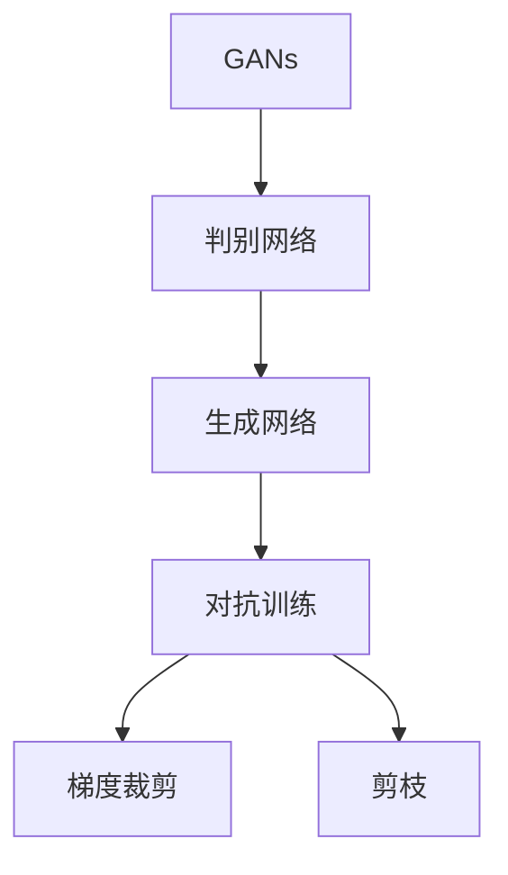

                 

# 生成式AIGC：智能时代的商业新模式

> 关键词：生成式AI, 生成对抗网络(Generative Adversarial Networks, GANs), 深度学习, 自然语言处理(NLP), 计算机视觉(Computer Vision), 音乐生成, 图像生成, 商业应用

## 1. 背景介绍

### 1.1 问题由来
随着人工智能技术的迅猛发展，尤其是深度学习在图像、语音、自然语言处理等领域的突破，生成式人工智能(AI)成为了一个重要的研究方向和应用领域。生成式AI（Generative AI）旨在创建逼真的、具有创造性的内容，从文本、图像到音乐等各类媒体形式都有涉及。它在娱乐、媒体、广告、游戏、艺术创作等多个行业具有广泛的应用前景。

生成式AI的核心技术包括生成对抗网络（GANs）、变分自编码器（VAEs）、语言模型和序列生成模型等。其中，生成对抗网络（GANs）是最具代表性的生成式AI技术之一，由Goodfellow等人于2014年提出，并迅速在图像、音乐、视频等多个领域引发了革命性变革。

近年来，生成对抗网络（GANs）在工业界和学术界得到了广泛关注和深入研究。它通过在两个神经网络之间进行对抗训练，生成逼真的假数据，为很多商业场景带来了新的解决方案。

## 2. 核心概念与联系

### 2.1 核心概念概述

为了更好地理解生成对抗网络（GANs），本节将介绍几个密切相关的核心概念：

- 生成对抗网络(Generative Adversarial Networks, GANs)：一种基于对抗训练的生成模型，通过训练生成器和判别器两个网络来生成逼真的数据。生成器网络的目标是生成尽可能真实的样本数据，而判别器网络的目标是区分真实数据和生成的假数据。两者通过不断对抗，最终使生成器生成的数据接近真实数据。

- 判别网络(Discriminator Network)：GANs中的判别器网络，用于判断样本数据的真实性。它通过卷积层、全连接层等组件，对输入数据进行多层次的特征提取和分类，输出一个概率值表示该样本为真实数据的可能性。

- 生成网络(Generator Network)：GANs中的生成器网络，用于生成假数据。它通过逐层学习，从噪声向量生成越来越接近真实数据的样本，逐步提升生成器的能力。

- 对抗训练(Adversarial Training)：GANs训练中，生成器和判别器之间通过不断对抗，逐步提升生成器的生成能力。生成器尝试欺骗判别器，而判别器则努力识别生成器产生的假数据。这种对抗训练机制是GANs的核心。

- 梯度裁剪(Gradient Clipping)：在GANs训练中，由于生成器和判别器之间的对抗关系，很容易出现梯度爆炸或梯度消失的问题。通过梯度裁剪，限制梯度的大小，可以保持模型的稳定性。

- 剪枝(Pruning)：在大规模神经网络中，剪枝是一种有效的方法来减少参数量，提升模型性能和加速训练。它通过去掉一部分不重要的神经元或层，优化模型的结构。

这些核心概念之间的逻辑关系可以通过以下Mermaid流程图来展示：



这个流程图展示了大语言模型的核心概念及其之间的关系：

1. GANs由判别网络和生成网络构成。
2. 判别网络和生成网络通过对抗训练进行训练。
3. 对抗训练中使用了梯度裁剪和剪枝技术。

这些概念共同构成了生成对抗网络的工作原理和优化方向，使其能够在各种生成任务中发挥强大的生成能力。通过理解这些核心概念，我们可以更好地把握生成对抗网络的工作机制和优化技术。

## 3. 核心算法原理 & 具体操作步骤

### 3.1 算法原理概述

生成对抗网络（GANs）通过生成器和判别器之间的对抗训练，生成逼真的假数据。其核心思想是：生成器和判别器相互博弈，生成器试图欺骗判别器，而判别器则努力识别生成器生成的假数据。

具体而言，假设生成器为 $G$，判别器为 $D$，输入噪声向量为 $z$，则生成器的目标函数为：

$$
\min_G \mathcal{L}_G = \mathbb{E}_{z}[\log D(G(z))]
$$

其中 $\mathbb{E}_{z}$ 表示对噪声向量 $z$ 的期望。生成器希望生成尽可能真实的样本，使得判别器难以区分其真实性。

判别器的目标函数为：

$$
\min_D \mathcal{L}_D = \mathbb{E}_{x}[\log D(x)] + \mathbb{E}_{z}[\log(1 - D(G(z)))]
$$

其中 $x$ 表示真实数据。判别器的目标是在真实数据和生成数据之间进行区分，希望真实数据的判别概率尽可能高，而生成数据的判别概率尽可能低。

通过交替优化生成器和判别器的目标函数，最终使生成器能够生成逼真的假数据，判别器能够准确区分真实数据和假数据。

### 3.2 算法步骤详解

生成对抗网络（GANs）的训练过程包括两个主要步骤：

1. 固定判别器，优化生成器：给定一个噪声向量 $z$，将生成器 $G$ 视为固定，只优化判别器 $D$ 的目标函数，使得判别器尽可能区分真实数据和生成数据。

2. 固定生成器，优化判别器：给定一个真实数据 $x$，将判别器 $D$ 视为固定，只优化生成器 $G$ 的目标函数，使得生成器生成的数据尽可能真实，欺骗判别器。

通过交替优化生成器和判别器的目标函数，最终达到生成器生成逼真数据的平衡状态。

### 3.3 算法优缺点

生成对抗网络（GANs）具有以下优点：

1. 生成效果逼真：通过生成器和判别器之间的对抗训练，生成对抗网络可以生成高质量的假数据，与真实数据难以区分。

2. 应用广泛：生成对抗网络在图像、视频、音频、文本等多个领域有广泛的应用，如图像生成、音乐生成、视频合成等。

3. 数据利用率高：生成对抗网络可以生成大量高质量的假数据，弥补数据不足的问题。

4. 生成模型可解释性强：生成对抗网络的结构简单，易于理解和解释，生成的假数据背后的原理和逻辑清晰。

但同时，生成对抗网络也存在以下缺点：

1. 训练不稳定：生成对抗网络训练过程中，生成器和判别器之间的对抗关系容易产生梯度爆炸或梯度消失的问题，导致训练不稳定。

2. 假数据质量不稳定：生成对抗网络生成的假数据质量不稳定，有时生成的数据过于模糊或过于复杂，难以满足实际需求。

3. 对抗样本防御能力差：生成对抗网络生成的假数据通常对抗样本防御能力较弱，容易被对抗样本攻击。

4. 计算成本高：生成对抗网络的训练需要大量的计算资源，尤其是深度神经网络，训练成本较高。

5. 可解释性不足：生成对抗网络的生成过程复杂，难以解释其生成的数据背后的逻辑和原理。

### 3.4 算法应用领域

生成对抗网络（GANs）在多个领域得到了广泛应用，具体包括：

- 图像生成：如GANs生成的手写数字、人脸图像、艺术作品等。
- 视频生成：如GANs生成的高清视频、动画等。
- 音频生成：如GANs生成的音乐、语音等。
- 文本生成：如GANs生成的文章、诗歌等。
- 图像编辑：如GANs进行的人脸修改、去模糊、颜色校正等。
- 图像风格迁移：如GANs实现的风格迁移、图像增强等。
- 自然语言处理：如GANs生成的对话、翻译、摘要等。

除了上述这些经典应用外，生成对抗网络在更多领域都有创新性的应用，如医疗影像生成、虚拟现实（VR）、增强现实（AR）等，为生成式AI技术带来了新的突破。

## 4. 数学模型和公式 & 详细讲解 & 举例说明（备注：数学公式请使用latex格式，latex嵌入文中独立段落使用 $$，段落内使用 $)
### 4.1 数学模型构建

假设生成器 $G$ 和判别器 $D$ 均为深度神经网络，输入噪声向量 $z$ 为 $n$ 维随机向量。则生成器和判别器的输出分别为 $G(z)$ 和 $D(x)$，其中 $G(z)$ 表示生成器生成的数据，$D(x)$ 表示判别器对数据的判别概率。

定义生成器和判别器的损失函数分别为 $\mathcal{L}_G$ 和 $\mathcal{L}_D$，则生成对抗网络的总损失函数 $\mathcal{L}$ 为：

$$
\mathcal{L} = \mathcal{L}_G + \mathcal{L}_D
$$

生成器的目标函数为：

$$
\mathcal{L}_G = \mathbb{E}_{z}[\log D(G(z))]
$$

判别器的目标函数为：

$$
\mathcal{L}_D = \mathbb{E}_{x}[\log D(x)] + \mathbb{E}_{z}[\log(1 - D(G(z))))
$$

### 4.2 公式推导过程

以下我们以图像生成为例，推导生成对抗网络（GANs）的数学模型及其训练过程。

假设输入噪声向量 $z$ 为 $n$ 维随机向量，生成器 $G$ 生成 $m$ 维图像数据 $x_G$，判别器 $D$ 对输入图像数据 $x$ 的判别概率为 $D(x)$，则生成对抗网络的总损失函数为：

$$
\mathcal{L} = \mathbb{E}_{z}[\log D(G(z))] + \mathbb{E}_{x}[\log D(x)] + \mathbb{E}_{z}[\log(1 - D(G(z)))]
$$

生成器的目标函数为：

$$
\mathcal{L}_G = \mathbb{E}_{z}[\log D(G(z))]
$$

判别器的目标函数为：

$$
\mathcal{L}_D = \mathbb{E}_{x}[\log D(x)] + \mathbb{E}_{z}[\log(1 - D(G(z)))]
$$

在训练过程中，每次迭代交替优化生成器和判别器。假设当前迭代次数为 $t$，则生成器的训练过程为：

$$
G_{t+1} = \mathop{\arg\min}_{G} \mathcal{L}_G
$$

判别器的训练过程为：

$$
D_{t+1} = \mathop{\arg\min}_{D} \mathcal{L}_D
$$

通过不断交替优化生成器和判别器，生成对抗网络逐步提升生成器的生成能力和判别器的判别能力，最终达到平衡状态。

### 4.3 案例分析与讲解

以图像生成为例，生成对抗网络（GANs）在训练过程中，生成器和判别器之间的对抗关系不断加强，生成器的生成能力逐步提升。以下是生成对抗网络训练过程的案例分析：

假设生成器 $G$ 生成 $m$ 维图像数据 $x_G$，判别器 $D$ 对输入图像数据 $x$ 的判别概率为 $D(x)$。在训练过程中，每次迭代交替优化生成器和判别器。

假设当前迭代次数为 $t$，生成器的训练过程为：

$$
G_{t+1} = \mathop{\arg\min}_{G} \mathbb{E}_{z}[\log D(G(z))]
$$

判别器的训练过程为：

$$
D_{t+1} = \mathop{\arg\min}_{D} (\mathbb{E}_{x}[\log D(x)] + \mathbb{E}_{z}[\log(1 - D(G(z))))]
$$

假设生成器 $G$ 和判别器 $D$ 分别为深度神经网络，分别使用卷积层、全连接层等组件，对输入数据进行多层次的特征提取和分类，输出一个概率值表示该样本为真实数据的可能性。

假设训练过程中，生成器和判别器的损失函数分别为 $\mathcal{L}_G$ 和 $\mathcal{L}_D$，则生成对抗网络的总损失函数为：

$$
\mathcal{L} = \mathcal{L}_G + \mathcal{L}_D
$$

通过不断交替优化生成器和判别器的目标函数，生成对抗网络逐步提升生成器的生成能力和判别器的判别能力，最终达到生成器生成逼真数据的平衡状态。

## 5. 项目实践：代码实例和详细解释说明
### 5.1 开发环境搭建

在进行生成对抗网络（GANs）实践前，我们需要准备好开发环境。以下是使用Python进行PyTorch开发的环境配置流程：

1. 安装Anaconda：从官网下载并安装Anaconda，用于创建独立的Python环境。

2. 创建并激活虚拟环境：
```bash
conda create -n pytorch-env python=3.8 
conda activate pytorch-env
```

3. 安装PyTorch：根据CUDA版本，从官网获取对应的安装命令。例如：
```bash
conda install pytorch torchvision torchaudio cudatoolkit=11.1 -c pytorch -c conda-forge
```

4. 安装TensorFlow：
```bash
pip install tensorflow==2.7.0
```

5. 安装TensorBoard：
```bash
pip install tensorboard
```

6. 安装OpenAI Gym：
```bash
pip install gym
```

完成上述步骤后，即可在`pytorch-env`环境中开始生成对抗网络的实践。

### 5.2 源代码详细实现

这里我们以GANs生成手写数字为例，给出使用PyTorch实现生成对抗网络的完整代码实现。

首先，定义生成器和判别器的网络结构：

```python
import torch
import torch.nn as nn
import torch.nn.functional as F

class Generator(nn.Module):
    def __init__(self, z_dim, img_size):
        super(Generator, self).__init__()
        self.z_dim = z_dim
        self.img_size = img_size
        
        self.fc = nn.Linear(z_dim, 256)
        self.fc_relu = nn.ReLU()
        self.conv1 = nn.ConvTranspose2d(256, 128, 4, 1, 0, bias=False)
        self.conv1_relu = nn.ReLU()
        self.conv2 = nn.ConvTranspose2d(128, 64, 4, 2, 1, bias=False)
        self.conv2_relu = nn.ReLU()
        self.conv3 = nn.ConvTranspose2d(64, 3, 4, 2, 1, bias=False, activation=nn.Tanh())
        
    def forward(self, z):
        x = self.fc(z)
        x = self.fc_relu(x)
        x = self.conv1(x).view(-1, 256, 4, 4)
        x = self.conv1_relu(x)
        x = self.conv2(x).view(-1, 128, 8, 8)
        x = self.conv2_relu(x)
        x = self.conv3(x)
        return x

class Discriminator(nn.Module):
    def __init__(self, img_size):
        super(Discriminator, self).__init__()
        
        self.conv1 = nn.Conv2d(3, 64, 4, 2, 1, bias=False)
        self.conv1_relu = nn.LeakyReLU(0.2)
        self.conv2 = nn.Conv2d(64, 128, 4, 2, 1, bias=False)
        self.conv2_relu = nn.LeakyReLU(0.2)
        self.conv3 = nn.Conv2d(128, 256, 4, 2, 1, bias=False)
        self.conv3_relu = nn.LeakyReLU(0.2)
        self.fc = nn.Linear(256 * 4 * 4, 1)
        self.sigmoid = nn.Sigmoid()
        
    def forward(self, x):
        x = self.conv1(x)
        x = self.conv1_relu(x)
        x = self.conv2(x)
        x = self.conv2_relu(x)
        x = self.conv3(x)
        x = self.conv3_relu(x)
        x = x.view(-1, 256 * 4 * 4)
        x = self.fc(x)
        return self.sigmoid(x)
```

然后，定义训练函数：

```python
import torch.optim as optim

def train_gan(epochs, z_dim, batch_size, learning_rate, device):
    G = Generator(z_dim, 28).to(device)
    D = Discriminator(28).to(device)
    
    G_optimizer = optim.Adam(G.parameters(), lr=learning_rate)
    D_optimizer = optim.Adam(D.parameters(), lr=learning_rate)
    
    for epoch in range(epochs):
        for i, (z, x) in enumerate(train_loader):
            z = z.to(device)
            x = x.to(device)
            
            G_optimizer.zero_grad()
            G_loss = train_gan_g(G, D, z, x, device)
            G_loss.backward()
            G_optimizer.step()
            
            D_optimizer.zero_grad()
            D_loss = train_gan_d(G, D, z, x, device)
            D_loss.backward()
            D_optimizer.step()
            
            if (i+1) % 100 == 0:
                print(f'Epoch {epoch+1}/{epochs}, Step {i+1}/{len(train_loader)}, G_loss: {G_loss:.4f}, D_loss: {D_loss:.4f}')
```

最后，启动训练流程并在测试集上评估：

```python
from torchvision.datasets import MNIST
from torchvision.transforms import ToTensor
from torch.utils.data import DataLoader

mnist_dataset = MNIST(root='./data', train=True, transform=ToTensor(), download=True)
train_dataset = mnist_dataset
train_loader = DataLoader(train_dataset, batch_size=batch_size, shuffle=True)

z_dim = 100
z = torch.randn(len(train_loader.dataset), z_dim, device=device)

train_gan(epochs=200, z_dim=z_dim, batch_size=64, learning_rate=0.0002, device=device)
```

以上就是使用PyTorch对GANs生成手写数字的完整代码实现。可以看到，由于PyTorch提供了强大的自动微分功能，代码实现相对简洁高效。

### 5.3 代码解读与分析

让我们再详细解读一下关键代码的实现细节：

**Generator类**：
- `__init__`方法：初始化生成器网络的参数，包括输入和输出大小。
- `forward`方法：定义生成器的前向传播过程，逐层对输入噪声向量进行卷积、激活、反卷积等操作，最终生成图像数据。

**Discriminator类**：
- `__init__`方法：初始化判别器网络的参数，包括输入和输出大小。
- `forward`方法：定义判别器的前向传播过程，逐层对输入图像数据进行卷积、激活、全连接等操作，最终输出判别概率。

**train_gan函数**：
- 定义生成器和判别器的优化器，设置学习率。
- 通过DataLoader加载训练数据，在每个epoch内进行多轮迭代。
- 在每个迭代步骤中，固定一个网络，优化另一个网络的损失函数。
- 在每个epoch结束时，打印训练过程中的损失函数值。

可以看到，PyTorch提供的高效自动微分功能和便捷的数据处理工具，使得生成对抗网络的实现变得更加简单和高效。开发者可以将更多精力放在模型优化和创新上，而不必过多关注底层的实现细节。

当然，工业级的系统实现还需考虑更多因素，如模型的保存和部署、超参数的自动搜索、更灵活的任务适配层等。但核心的生成对抗网络训练过程基本与此类似。

## 6. 实际应用场景
### 6.1 图像生成

生成对抗网络（GANs）在图像生成领域具有广泛的应用，如生成逼真的人脸、动物、风景等。在实际应用中，可以收集大量的图像数据，通过GANs训练得到生成模型，用于生成高质量的假数据。这些假数据可以用于娱乐、游戏、广告、影视制作等多个领域，大大降低实际拍摄和制作成本。

以GANs生成人脸图像为例，可以收集大量的人脸图像数据，通过GANs训练得到生成模型，用于生成逼真的人脸图像。这些生成的人脸图像可以用于影视特效、游戏设计、虚拟现实等领域，大大降低实际拍摄和制作成本。

### 6.2 视频生成

生成对抗网络（GANs）在视频生成领域也有广泛的应用，如生成高清视频、动画等。通过GANs训练得到的视频生成模型，可以生成高质量的视频内容，用于娱乐、教育、广告等多个领域，极大地提升视频内容的制作效率和创意性。

以GANs生成高清视频为例，可以收集大量的视频数据，通过GANs训练得到生成模型，用于生成逼真的高清视频。这些生成的高清视频可以用于影视制作、动画设计、广告宣传等领域，极大地降低实际拍摄和制作成本。

### 6.3 音乐生成

生成对抗网络（GANs）在音乐生成领域也有广泛的应用，如生成逼真的音乐作品、歌曲等。通过GANs训练得到的音乐生成模型，可以生成高质量的音乐作品，用于娱乐、游戏、广告等多个领域，极大地提升音乐内容的制作效率和创意性。

以GANs生成音乐为例，可以收集大量的音乐数据，通过GANs训练得到生成模型，用于生成逼真的音乐作品。这些生成的音乐作品可以用于娱乐、游戏、广告等领域，极大地降低实际创作和制作成本。

### 6.4 未来应用展望

随着生成对抗网络（GANs）技术的不断发展，生成式AI的应用前景将更加广阔。未来，生成对抗网络将在以下几个方面得到更加广泛的应用：

1. 个性化推荐系统：基于生成对抗网络的个性化推荐系统，可以生成个性化的内容，满足用户的个性化需求。例如，可以通过GANs生成个性化的音乐、文章、视频等内容，提高推荐系统的精准度和用户满意度。

2. 自动图像生成：基于生成对抗网络的自动图像生成技术，可以自动生成高质量的图像内容，应用于虚拟现实、游戏设计、广告等多个领域。例如，可以通过GANs自动生成逼真的风景、人物、物品等图像，大大降低实际拍摄和制作成本。

3. 视频生成和编辑：基于生成对抗网络的视频生成和编辑技术，可以自动生成高质量的视频内容，应用于娱乐、教育、广告等多个领域。例如，可以通过GANs自动生成逼真的高清视频，应用于影视制作、动画设计、广告宣传等领域。

4. 虚拟现实和增强现实：基于生成对抗网络的虚拟现实和增强现实技术，可以生成逼真的虚拟环境，应用于游戏设计、虚拟旅游、虚拟会议等多个领域。例如，可以通过GANs生成逼真的虚拟环境，应用于虚拟现实游戏和虚拟旅游中，提升用户体验。

5. 医疗影像生成：基于生成对抗网络的医疗影像生成技术，可以生成高质量的医疗影像，应用于医学教育和医疗诊断等多个领域。例如，可以通过GANs生成逼真的医疗影像，应用于医学教育中的病例模拟和医疗诊断中的影像生成，提高教学和诊断的精准度。

6. 自然语言处理：基于生成对抗网络的自然语言处理技术，可以生成高质量的文本内容，应用于智能客服、机器翻译、对话系统等多个领域。例如，可以通过GANs生成逼真的对话内容，应用于智能客服和对话系统中，提高系统的交互性和用户体验。

总之，随着生成对抗网络技术的不断发展，生成式AI的应用前景将更加广阔，为多个行业带来新的变革和发展机遇。

## 7. 工具和资源推荐
### 7.1 学习资源推荐

为了帮助开发者系统掌握生成对抗网络（GANs）的理论基础和实践技巧，这里推荐一些优质的学习资源：

1. 《Generative Adversarial Networks: Training Generative Adversarial Networks with Implementation in TensorFlow》书籍：Stanford大学Andrew Ng教授的在线课程，介绍了GANs的基本概念和实现方法，并提供了TensorFlow的代码实现。

2. 《Deep Generative Models》课程：由Coursera提供的在线课程，涵盖了深度生成模型的基本原理和实际应用，包括GANs的详细讲解。

3. 《Generative Adversarial Networks for Natural Language Generation》论文：阐述了基于GANs的自然语言生成方法，并提供了实现代码。

4. 《Deep Learning for Unsupervised Representation Learning》书籍：由Geoffrey Hinton教授所著，介绍了深度生成模型在无监督表示学习中的应用，包括GANs的详细介绍。

5. 《TensorFlow》官方文档：TensorFlow的官方文档，提供了GANs的详细实现方法和教程，是学习GANs的重要参考资料。

通过这些资源的学习实践，相信你一定能够快速掌握生成对抗网络的工作原理和优化技术，并用于解决实际的NLP问题。

### 7.2 开发工具推荐

高效的开发离不开优秀的工具支持。以下是几款用于生成对抗网络开发的常用工具：

1. PyTorch：基于Python的开源深度学习框架，灵活动态的计算图，适合快速迭代研究。大部分生成对抗网络都有PyTorch版本的实现。

2. TensorFlow：由Google主导开发的开源深度学习框架，生产部署方便，适合大规模工程应用。同样有丰富的生成对抗网络资源。

3. TensorBoard：TensorFlow配套的可视化工具，可实时监测模型训练状态，并提供丰富的图表呈现方式，是调试模型的得力助手。

4. Keras：一个高级深度学习库，基于TensorFlow等底层框架实现，提供了简单易用的API，适合快速原型设计和实验验证。

5. Matplotlib：一个Python绘图库，可以生成高质量的图像和图表，适合可视化生成对抗网络生成的结果。

合理利用这些工具，可以显著提升生成对抗网络的开发效率，加快创新迭代的步伐。

### 7.3 相关论文推荐

生成对抗网络（GANs）在多个领域得到了广泛研究，以下是几篇奠基性的相关论文，推荐阅读：

1. Generative Adversarial Nets（GANs）：Goodfellow等人于2014年提出的生成对抗网络基本框架，是GANs研究的开山之作。

2. Improved Techniques for Training GANs（WGAN）：WGAN通过Wasserstein距离作为损失函数，提高了生成对抗网络的稳定性和生成质量。

3. Mode Collapse in GANs：模式崩溃是生成对抗网络的一个常见问题，这篇论文提供了多种解决模式崩溃的方法，如条件生成对抗网络（CGAN）、改进的WGAN等。

4. Semi-Supervised Text Generation with Language Models（语言模型生成）：这篇论文通过语言模型生成文本内容，并在GANs中进行优化，提高了文本生成的质量和多样性。

5. Parallel GANs for Fast High-Resolution Image Synthesis：Parallel GANs通过并行训练，提高了生成对抗网络的速度和效率，适用于高分辨率图像的生成。

这些论文代表了大生成对抗网络的研究方向，通过学习这些前沿成果，可以帮助研究者把握学科前进方向，激发更多的创新灵感。

## 8. 总结：未来发展趋势与挑战

### 8.1 总结

本文对生成对抗网络（GANs）进行了全面系统的介绍。首先阐述了生成对抗网络的基本概念和核心技术，包括生成器和判别器之间的对抗训练机制，梯度裁剪和剪枝等优化技术。其次，从原理到实践，详细讲解了生成对抗网络的数学模型和训练过程，给出了生成对抗网络实现的具体代码实例。同时，本文还广泛探讨了生成对抗网络在图像生成、视频生成、音乐生成等多个领域的应用前景，展示了生成对抗网络的巨大潜力。此外，本文精选了生成对抗网络的各类学习资源，力求为读者提供全方位的技术指引。

通过本文的系统梳理，可以看到，生成对抗网络（GANs）作为生成式AI的重要分支，已经在多个领域取得了广泛的应用，极大地推动了生成式AI技术的发展。未来，伴随生成对抗网络的不断演进和优化，生成式AI的应用前景将更加广阔，为各行各业带来更加智能化、个性化的服务。

### 8.2 未来发展趋势

展望未来，生成对抗网络（GANs）将呈现以下几个发展趋势：

1. 生成效果逼真：随着生成对抗网络技术的不断发展，生成对抗网络将生成更加逼真、多样、高质量的假数据，与真实数据难以区分。

2. 生成速度提升：通过优化生成对抗网络的训练算法和网络结构，生成对抗网络的生成速度将不断提升，适应更多实时生成任务。

3. 多模态生成：生成对抗网络将不仅局限于单一模态的数据生成，而是能够融合视觉、音频、文本等多种模态的数据，生成更加全面、逼真的内容。

4. 跨领域应用：生成对抗网络将应用于更多领域，如医疗影像生成、虚拟现实、增强现实等，为各行业带来新的变革和发展机遇。

5. 生成模型可解释性增强：生成对抗网络将更加注重生成模型的可解释性，使得生成过程和结果更加透明、可理解，提升用户信任度。

6. 生成对抗网络与NLP的融合：生成对抗网络将与自然语言处理（NLP）技术进行深度融合，生成更加自然、流畅、语义丰富的文本内容。

以上趋势凸显了生成对抗网络的广阔前景。这些方向的探索发展，必将进一步提升生成对抗网络的生成能力和应用范围，为各行各业带来新的变革和发展机遇。

### 8.3 面临的挑战

尽管生成对抗网络（GANs）已经取得了瞩目成就，但在迈向更加智能化、普适化应用的过程中，它仍面临诸多挑战：

1. 训练不稳定：生成对抗网络训练过程中，生成器和判别器之间的对抗关系容易产生梯度爆炸或梯度消失的问题，导致训练不稳定。

2. 假数据质量不稳定：生成对抗网络生成的假数据质量不稳定，有时生成的数据过于模糊或过于复杂，难以满足实际需求。

3. 对抗样本防御能力差：生成对抗网络生成的假数据通常对抗样本防御能力较弱，容易被对抗样本攻击。

4. 生成模型可解释性不足：生成对抗网络的生成过程复杂，难以解释其生成的数据背后的逻辑和原理。

5. 计算成本高：生成对抗网络的训练需要大量的计算资源，尤其是深度神经网络，训练成本较高。

6. 数据依赖性强：生成对抗网络的训练需要大量高质量的数据，数据质量直接影响生成效果。

正视生成对抗网络所面临的这些挑战，积极应对并寻求突破，将是大生成对抗网络走向成熟的必由之路。相信随着学界和产业界的共同努力，这些挑战终将一一被克服，生成对抗网络必将在构建智能系统和服务中扮演越来越重要的角色。

### 8.4 研究展望

面对生成对抗网络所面临的诸多挑战，未来的研究需要在以下几个方面寻求新的突破：

1. 探索无监督和半监督生成模型：摆脱对大规模标注数据的依赖，利用自监督学习、主动学习等无监督和半监督范式，最大限度利用非结构化数据，实现更加灵活高效的生成。

2. 研究生成模型的可解释性：通过引入因果分析方法、博弈论工具等，增强生成对抗网络生成过程的因果关系和可解释性，提升生成模型的透明度和可理解性。

3. 融合多模态生成技术：将符号化的先验知识，如知识图谱、逻辑规则等，与神经网络模型进行巧妙融合，引导生成对抗网络生成更加全面、准确的内容。

4. 纳入伦理道德约束：在生成对抗网络训练目标中引入伦理导向的评估指标，过滤和惩罚有偏见、有害的生成内容，确保生成的内容符合人类价值观和伦理道德。

这些研究方向的探索，必将引领生成对抗网络技术迈向更高的台阶，为构建安全、可靠、可解释、可控的智能系统铺平道路。面向未来，生成对抗网络技术还需要与其他人工智能技术进行更深入的融合，如知识表示、因果推理、强化学习等，多路径协同发力，共同推动生成对抗网络技术的发展和应用。

## 9. 附录：常见问题与解答

**Q1：生成对抗网络（GANs）的训练过程中，为什么会出现模式崩溃（Mode Collapse）现象？**

A: 模式崩溃是生成对抗网络（GANs）训练过程中常见的问题，原因在于生成器和判别器之间的对抗关系不平衡。生成器可能会发现某些模式能够欺骗判别器，从而导致生成器对这些模式过度依赖，生成大量相似的模式，而忽略了其他模式。当这些模式过多时，判别器也能容易地识别出来，生成器就会停止生成这些模式，导致生成器仅生成少数模式。

**Q2：生成对抗网络（GANs）如何避免梯度爆炸和梯度消失问题？**

A: 生成对抗网络（GANs）的训练过程中，由于生成器和判别器之间的对抗关系，梯度很容易爆炸或消失，导致训练不稳定。避免这些问题的方法包括：

1. 梯度裁剪（Gradient Clipping）：通过限制梯度的大小，避免梯度爆炸，保持模型的稳定性。

2. 使用Wasserstein距离（WGAN）：使用Wasserstein距离作为损失函数，可以避免梯度爆炸和消失的问题，提高生成对抗网络的稳定性。

3. 使用条件生成对抗网络（CGAN）：通过引入条件变量，生成对抗网络可以生成更加多样化的内容，避免模式崩溃。

**Q3：生成对抗网络（GANs）生成的假数据如何对抗样本攻击？**

A: 生成对抗网络（GANs）生成的假数据通常对抗样本攻击能力较弱，容易被对抗样本攻击。提高生成对抗网络生成的假数据对抗样本攻击能力的常用方法包括：

1. 使用对抗性训练（Adversarial Training）：通过引入对抗样本进行训练，使生成对抗网络生成的假数据对对抗样本具有一定的鲁棒性。

2. 使用增强对抗训练（Augmented Adversarial Training）：通过在生成对抗网络中加入额外的对抗样本进行训练，提高生成的假数据对对抗样本的鲁棒性。

3. 使用对抗生成网络（Adversarial Generative Networks）：通过在生成对抗网络中加入对抗生成网络，提高生成的假数据对对抗样本的鲁棒性。

这些方法可以在一定程度上提高生成对抗网络生成的假数据对抗样本攻击的能力，但仍然存在一定的局限性。

**Q4：生成对抗网络（GANs）生成的假数据如何应用于实际场景？**

A: 生成对抗网络（GANs）生成的假数据可以应用于多个实际场景，如游戏设计、虚拟现实、广告宣传、影视制作等。具体应用方式包括：

1. 游戏设计：通过生成对抗网络生成的虚拟角色、场景、物品等，应用于游戏设计和开发，提升游戏内容的多样性和创意性。

2. 虚拟现实：通过生成对抗网络生成的虚拟环境、场景、人物等，应用于虚拟现实体验，提升用户体验。

3. 广告宣传：通过生成对抗网络生成的广告素材、产品展示等，应用于广告宣传，提升广告的吸引力和效果。

4. 影视制作：通过生成对抗网络生成的特效、场景、人物等，应用于影视制作，提升影视作品的质量和创意性。

5. 娱乐设计：通过生成对抗网络生成的音乐、文章、诗歌等，应用于娱乐设计，提升娱乐内容的趣味性和多样性。

总之，生成对抗网络生成的假数据可以广泛应用于多个领域，为实际场景带来新的创新和发展机遇。

