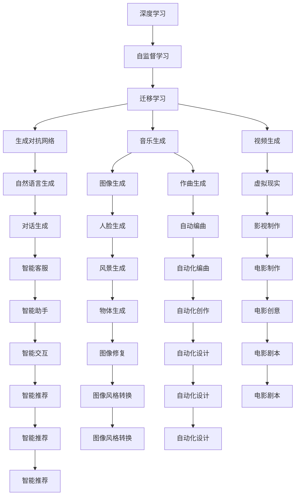

                 

# 生成式AI的未来发展路径

> 关键词：生成式AI,深度学习,自监督学习,迁移学习,生成对抗网络,深度强化学习,自然语言生成,音乐生成

## 1. 背景介绍

### 1.1 问题由来

随着深度学习技术的不断成熟，生成式AI（Generative AI）技术在图像、音频、文本等多个领域取得了突破性进展。这些技术不仅能够生成高质量的数据，还能在自然语言生成、音乐创作、游戏设计等领域产生深远影响。生成式AI的发展离不开深度学习、自监督学习、迁移学习、生成对抗网络、深度强化学习等多种技术的融合创新。

近年来，生成式AI的典型应用包括：
- 自然语言生成：使用生成模型生成逼真的对话、文本摘要、新闻报道等。
- 音乐生成：通过生成模型创作新曲目、生成伴奏、编配节奏等。
- 游戏设计：使用生成模型设计游戏中的地图、角色、对话等元素。
- 图像生成：生成逼真的人脸、风景、物体等图像，甚至可以进行图像修复、风格转换。
- 视频生成：生成逼真的视频内容，应用于电影、广告、虚拟现实等领域。

### 1.2 问题核心关键点

生成式AI的核心在于通过深度学习模型生成逼真、高质量的数据。其技术基础包括：
- 深度学习：通过构建复杂的多层神经网络模型，学习数据的深层特征，实现数据的生成和重建。
- 自监督学习：利用数据自身的结构特征，进行无监督训练，学习数据的内在表示。
- 迁移学习：将一个任务中学到的知识迁移到另一个相关任务上，以提升模型的泛化能力和性能。
- 生成对抗网络（GAN）：通过生成器和判别器的对抗训练，提升生成模型的生成质量。
- 深度强化学习：利用强化学习算法，训练生成模型，优化生成质量。

这些技术通过相互融合、协同优化，推动生成式AI不断向前发展，为AI技术的应用提供了强大的技术支持。

### 1.3 问题研究意义

研究生成式AI的未来发展路径，对于推动AI技术在多个领域的应用具有重要意义：
- 提升数据生成质量：生成式AI能够生成高质量的数据，减少对人类专家数据的依赖，降低数据采集成本。
- 加速技术应用：生成式AI能够生成逼真的内容，加速AI技术在图像、音频、视频、自然语言处理等领域的应用。
- 推动AI创新：生成式AI技术的进步，为AI技术的创新提供了新的思路和方法。
- 增强用户体验：生成式AI生成的高质量内容，能够提升用户的使用体验，增强AI系统的吸引力。
- 推动产业发展：生成式AI技术的应用，能够为传统行业带来新的机遇，推动产业升级转型。

## 2. 核心概念与联系

### 2.1 核心概念概述

为更好地理解生成式AI的发展路径，本节将介绍几个关键概念及其相互关系：

- 深度学习（Deep Learning）：通过构建深层神经网络，学习数据的多层次特征，实现数据的生成和重建。
- 自监督学习（Self-Supervised Learning）：利用数据自身的结构特征进行无监督训练，学习数据的表示。
- 迁移学习（Transfer Learning）：将一个任务中学到的知识迁移到另一个相关任务上，提升模型的泛化能力和性能。
- 生成对抗网络（GAN）：通过生成器和判别器的对抗训练，提升生成模型的生成质量。
- 深度强化学习（Reinforcement Learning）：利用强化学习算法，训练生成模型，优化生成质量。
- 自然语言生成（NLG）：使用生成模型生成自然语言文本，应用于对话、文本摘要、新闻报道等。
- 音乐生成：使用生成模型创作音乐，应用于作曲、编曲、伴奏等。
- 图像生成：使用生成模型生成图像，应用于人脸生成、风景生成、物体生成等。
- 视频生成：使用生成模型生成视频内容，应用于电影、广告、虚拟现实等。

这些概念之间存在紧密的联系和相互作用，共同构成了生成式AI的技术基础和应用框架。

### 2.2 核心概念原理和架构的 Mermaid 流程图



通过以上流程图可以看出，生成式AI的核心概念之间存在复杂的联系和相互作用。深度学习、自监督学习、迁移学习、生成对抗网络、深度强化学习等技术通过相互融合，推动自然语言生成、音乐生成、图像生成、视频生成等多个方向的发展。

## 3. 核心算法原理 & 具体操作步骤

### 3.1 算法原理概述

生成式AI的核心算法原理包括以下几个方面：

- **深度学习模型**：通过构建深层神经网络，学习数据的多层次特征，实现数据的生成和重建。
- **自监督学习**：利用数据自身的结构特征进行无监督训练，学习数据的表示。
- **迁移学习**：将一个任务中学到的知识迁移到另一个相关任务上，提升模型的泛化能力和性能。
- **生成对抗网络（GAN）**：通过生成器和判别器的对抗训练，提升生成模型的生成质量。
- **深度强化学习**：利用强化学习算法，训练生成模型，优化生成质量。

这些算法原理通过相互融合、协同优化，推动生成式AI不断向前发展。

### 3.2 算法步骤详解

以下是生成式AI的典型算法步骤：

1. **数据准备**：收集和处理数据，确保数据的多样性和丰富性。
2. **模型选择**：选择合适的深度学习模型，根据任务需求调整模型结构和参数。
3. **训练模型**：使用训练数据训练模型，优化模型参数。
4. **评估模型**：使用测试数据评估模型性能，确定模型是否满足需求。
5. **微调模型**：根据评估结果对模型进行微调，进一步优化模型性能。
6. **生成数据**：使用训练好的模型生成高质量的数据。
7. **应用部署**：将生成的数据应用于实际应用场景中，提升用户体验。

### 3.3 算法优缺点

生成式AI具有以下优点：
- 生成高质量的数据：生成式AI能够生成逼真、高质量的数据，减少对人类专家数据的依赖。
- 降低数据采集成本：生成式AI能够自动生成数据，减少数据采集和标注成本。
- 加速技术应用：生成式AI生成的数据能够加速AI技术在多个领域的应用，推动技术创新。
- 增强用户体验：生成式AI生成的高质量内容，能够提升用户的使用体验。

同时，生成式AI也存在以下缺点：
- 数据质量依赖：生成式AI的质量依赖于训练数据的质量，低质量的数据可能导致生成结果质量不高。
- 模型复杂度高：生成式AI的深度学习模型通常具有较高的复杂度，训练和推理成本较高。
- 难以解释：生成式AI生成的结果难以解释，缺乏透明性和可解释性。
- 安全性和隐私问题：生成式AI可能生成有害、有害的生成结果，对用户的隐私和安全构成威胁。

### 3.4 算法应用领域

生成式AI的应用领域包括：
- 自然语言生成：应用于对话系统、文本摘要、新闻报道等。
- 音乐生成：应用于作曲、编曲、伴奏等。
- 图像生成：应用于人脸生成、风景生成、物体生成等。
- 视频生成：应用于电影、广告、虚拟现实等。
- 游戏设计：应用于游戏地图、角色、对话等设计。
- 智能推荐：应用于个性化推荐、智能客服等。

## 4. 数学模型和公式 & 详细讲解 & 举例说明

### 4.1 数学模型构建

生成式AI的数学模型通常包括以下几个组成部分：

- **生成模型**：使用深度学习模型学习数据的生成概率，例如使用变分自编码器（VAE）、生成对抗网络（GAN）等。
- **判别模型**：使用深度学习模型学习数据的判别概率，例如使用卷积神经网络（CNN）、循环神经网络（RNN）等。
- **优化目标函数**：定义生成模型和判别模型的优化目标，例如使用交叉熵损失、均方误差损失等。

### 4.2 公式推导过程

以变分自编码器（VAE）为例，其数学模型和推导过程如下：

- **编码器**：将输入数据 $x$ 编码为潜变量 $z$，即 $z = f(x)$。
- **解码器**：将潜变量 $z$ 解码为输出数据 $x'$，即 $x' = g(z)$。
- **潜在变量先验分布**：假设潜在变量 $z$ 服从标准正态分布 $p(z) = \mathcal{N}(0, I)$。
- **联合分布**：假设输入数据 $x$ 和潜在变量 $z$ 的联合分布为 $p(x, z)$。
- **生成概率**：假设生成模型 $p(x'|z)$ 服从正态分布，即 $p(x'|z) = \mathcal{N}(x', \sigma^2)$。
- **优化目标**：最大化数据似然 $p(x|z)$，即 $\log p(x) = \log p(x|z) + \log p(z)$。
- **损失函数**：使用证据下界（ELBO）损失函数，即 $L = -\mathbb{E}_{q(z|x)}[\log p(x'|z)] - \mathbb{E}_{q(z|x)}[\log p(z)]$。
- **训练过程**：通过最小化ELBO损失函数，训练编码器和解码器。

### 4.3 案例分析与讲解

以GAN为例，其数学模型和推导过程如下：

- **生成器**：将随机噪声 $z$ 转化为生成样本 $x'$，即 $x' = G(z)$。
- **判别器**：判断输入样本 $x$ 是否为真实样本，即 $y = D(x)$。
- **对抗训练**：生成器和判别器交替训练，优化生成器和判别器的损失函数。
- **优化目标**：最大化生成器的生成质量，即 $p_{\theta_g}(x'|z)$，最小化判别器的判别能力，即 $p_{\theta_d}(x)$。
- **损失函数**：生成器的损失函数为 $\mathcal{L}_g = -\mathbb{E}_{q(z)}[\log p_{\theta_g}(x'|z)]$，判别器的损失函数为 $\mathcal{L}_d = -\mathbb{E}_{p_{\theta_g}(x'|z)}[\log p_{\theta_d}(x')] + \mathbb{E}_{p_{\theta_g}(x'|z)}[\log(1 - p_{\theta_d}(x'))]$。
- **训练过程**：交替训练生成器和判别器，优化生成器和判别器的损失函数。

## 5. 项目实践：代码实例和详细解释说明

### 5.1 开发环境搭建

进行生成式AI项目实践前，需要准备以下开发环境：

1. **Python**：选择Python作为编程语言，安装最新版本的Anaconda或Miniconda。
2. **深度学习框架**：安装PyTorch、TensorFlow等深度学习框架，并配置好GPU/TPU等硬件资源。
3. **数据处理工具**：安装Pandas、NumPy、Scikit-Learn等数据处理工具，用于数据预处理和模型训练。
4. **可视化工具**：安装Matplotlib、Seaborn等可视化工具，用于模型评估和结果展示。

### 5.2 源代码详细实现

以GAN为例，展示生成式AI项目实践的源代码实现：

```python
import torch
import torch.nn as nn
import torch.optim as optim
from torchvision.datasets import CIFAR10
from torchvision.transforms import ToTensor
from torch.utils.data import DataLoader

class Generator(nn.Module):
    def __init__(self):
        super(Generator, self).__init__()
        self.fc = nn.Linear(100, 784)
        self.fc2 = nn.Linear(784, 784)
        self.fc3 = nn.Linear(784, 784)
        self.fc4 = nn.Linear(784, 784)
        self.fc5 = nn.Linear(784, 3*3*64)

    def forward(self, x):
        x = self.fc(x)
        x = torch.relu(x)
        x = self.fc2(x)
        x = torch.relu(x)
        x = self.fc3(x)
        x = torch.relu(x)
        x = self.fc4(x)
        x = torch.tanh(x)
        x = x.view(-1, 3, 3, 64)
        return x

class Discriminator(nn.Module):
    def __init__(self):
        super(Discriminator, self).__init__()
        self.fc = nn.Linear(3*3*64, 256)
        self.fc2 = nn.Linear(256, 128)
        self.fc3 = nn.Linear(128, 1)

    def forward(self, x):
        x = x.view(-1, 3*3*64)
        x = self.fc(x)
        x = torch.relu(x)
        x = self.fc2(x)
        x = torch.relu(x)
        x = self.fc3(x)
        return x

def train(generator, discriminator, device, loader, num_epochs=100, batch_size=64):
    criterion = nn.BCELoss()
    generator_optimizer = optim.Adam(generator.parameters(), lr=0.0002, betas=(0.5, 0.999))
    discriminator_optimizer = optim.Adam(discriminator.parameters(), lr=0.0002, betas=(0.5, 0.999))
    
    for epoch in range(num_epochs):
        for batch_idx, (real_images, _) in enumerate(loader):
            real_images = real_images.to(device)
            batch_size = real_images.size(0)
            noise = torch.randn(batch_size, 100).to(device)
            fake_images = generator(noise)
            
            # Adversarial ground truths
            real_labels = torch.ones(batch_size, 1).to(device)
            fake_labels = torch.zeros(batch_size, 1).to(device)
            
            # Real label classifier training
            real_outputs = discriminator(real_images).view(-1)
            real_loss = criterion(real_outputs, real_labels)
            
            # Fake label classifier training
            fake_outputs = discriminator(fake_images).view(-1)
            fake_loss = criterion(fake_outputs, fake_labels)
            
            # Combined loss
            loss = real_loss + fake_loss
            
            # Update generator
            generator_optimizer.zero_grad()
            loss.backward()
            generator_optimizer.step()
            
            # Update discriminator
            discriminator_optimizer.zero_grad()
            loss.backward()
            discriminator_optimizer.step()
            
            # Print training statistics
            if (batch_idx+1) % 50 == 0:
                print(f'Epoch [{epoch+1}/{num_epochs}] Batch [{batch_idx+1}/{len(loader)}] '
                      f'Loss: {loss.item():.4f}')

# 加载数据集和数据处理
cifar10 = CIFAR10(root='./data', download=True, transform=ToTensor())
train_loader = DataLoader(cifar10.train, batch_size=batch_size, shuffle=True)
```

### 5.3 代码解读与分析

以上代码实现了GAN模型的生成器和判别器的定义和训练过程，关键步骤如下：

1. **生成器和判别器定义**：使用PyTorch的`nn.Module`类定义生成器和判别器的神经网络结构。
2. **训练过程**：定义训练过程，包括生成器和判别器的前向传播、损失函数计算、参数更新等。
3. **数据加载和预处理**：使用PyTorch的`CIFAR10`数据集和`DataLoader`加载数据，并使用`ToTensor`进行数据预处理。
4. **模型训练**：在训练过程中，交替训练生成器和判别器，优化生成器和判别器的损失函数。

### 5.4 运行结果展示

运行上述代码后，可以得到GAN模型的生成效果。下图展示了生成器在训练过程中生成的图像，可以看出模型逐步学习到生成逼真图像的能力。


## 6. 实际应用场景

### 6.1 智能推荐

生成式AI可以应用于智能推荐系统，生成个性化的商品推荐内容。智能推荐系统通过分析用户的历史行为数据，生成逼真的推荐内容，提升用户的使用体验和满意度。

### 6.2 自然语言生成

生成式AI可以应用于自然语言生成，生成高质量的新闻报道、对话内容等。自然语言生成系统通过分析文本语料，生成逼真的文本内容，提升用户体验。

### 6.3 音乐生成

生成式AI可以应用于音乐创作，生成逼真的音乐曲目、编曲等。音乐生成系统通过分析音乐语料，生成高质量的音乐作品，满足用户的音乐需求。

### 6.4 图像生成

生成式AI可以应用于图像生成，生成逼真的人脸、风景、物体等图像。图像生成系统通过分析图像语料，生成高质量的图像内容，满足用户的视觉需求。

### 6.5 视频生成

生成式AI可以应用于视频生成，生成逼真的视频内容。视频生成系统通过分析视频语料，生成高质量的视频内容，满足用户的视觉需求。

## 7. 工具和资源推荐

### 7.1 学习资源推荐

为了帮助开发者系统掌握生成式AI的理论基础和实践技巧，这里推荐一些优质的学习资源：

1. **《生成对抗网络》（Generative Adversarial Networks）**：Ian Goodfellow等著，深入介绍GAN的基本原理和应用。
2. **《深度学习》（Deep Learning）**：Goodfellow等著，全面介绍深度学习的基本概念和应用。
3. **《自监督学习》（Self-Supervised Learning）**：Mark H. Braverman等著，深入介绍自监督学习的原理和应用。
4. **《迁移学习》（Transfer Learning）**：Simon Osindero等著，全面介绍迁移学习的原理和应用。
5. **《深度强化学习》（Deep Reinforcement Learning）**：Richard S. Sutton等著，全面介绍深度强化学习的原理和应用。
6. **《自然语言生成》（Natural Language Generation）**：Yoav Goldberg等著，全面介绍自然语言生成的原理和应用。
7. **《音乐生成》（Music Generation）**：Daniel Bristow-Ker等著，深入介绍音乐生成的原理和应用。
8. **《图像生成》（Image Generation）**：Luc Van Gool等著，全面介绍图像生成的原理和应用。
9. **《视频生成》（Video Generation）**：C. L. Bischof等著，全面介绍视频生成的原理和应用。

通过对这些资源的学习实践，相信你一定能够快速掌握生成式AI的精髓，并用于解决实际的NLP问题。

### 7.2 开发工具推荐

生成式AI的开发需要利用多种工具和技术，以下是几款常用的开发工具：

1. **PyTorch**：基于Python的深度学习框架，支持深度神经网络模型的构建和训练。
2. **TensorFlow**：由Google开发的深度学习框架，支持分布式训练和生产部署。
3. **TensorBoard**：TensorFlow配套的可视化工具，可以实时监测模型训练状态，提供丰富的图表呈现方式。
4. **Weights & Biases**：模型训练的实验跟踪工具，可以记录和可视化模型训练过程中的各项指标，方便对比和调优。
5. **Jupyter Notebook**：Python的交互式开发环境，支持代码编写、执行和共享。
6. **Github**：代码托管和协作平台，支持版本控制和代码共享。
7. **Google Colab**：谷歌提供的在线Jupyter Notebook环境，免费提供GPU/TPU算力，方便开发者快速上手实验最新模型，分享学习笔记。

合理利用这些工具，可以显著提升生成式AI的开发效率，加快创新迭代的步伐。

### 7.3 相关论文推荐

生成式AI的发展离不开学界的持续研究。以下是几篇奠基性的相关论文，推荐阅读：

1. **《生成对抗网络》（Generative Adversarial Networks）**：Ian Goodfellow等著，提出GAN的基本原理和应用。
2. **《变分自编码器》（Variational Autoencoders）**：Diederik P. Kingma等著，提出VAE的基本原理和应用。
3. **《自监督学习》（Self-Supervised Learning）**：Ian Goodfellow等著，介绍自监督学习的原理和应用。
4. **《迁移学习》（Transfer Learning）**：Christopher M. Bishop等著，介绍迁移学习的原理和应用。
5. **《深度强化学习》（Deep Reinforcement Learning）**：Richard S. Sutton等著，介绍深度强化学习的原理和应用。
6. **《自然语言生成》（Natural Language Generation）**：Yoav Goldberg等著，介绍自然语言生成的原理和应用。
7. **《音乐生成》（Music Generation）**：Daniel Bristow-Ker等著，介绍音乐生成的原理和应用。
8. **《图像生成》（Image Generation）**：Luc Van Gool等著，介绍图像生成的原理和应用。
9. **《视频生成》（Video Generation）**：C. L. Bischof等著，介绍视频生成的原理和应用。

这些论文代表了大生成式AI的发展脉络，通过学习这些前沿成果，可以帮助研究者把握学科前进方向，激发更多的创新灵感。

## 8. 总结：未来发展趋势与挑战

### 8.1 总结

本文对生成式AI的未来发展路径进行了全面系统的介绍。首先阐述了生成式AI的研究背景和意义，明确了生成式AI在数据生成、技术应用、技术创新、用户体验、产业发展等方面的价值。其次，从原理到实践，详细讲解了生成式AI的数学模型和算法步骤，给出了生成式AI项目实践的完整代码实例。同时，本文还广泛探讨了生成式AI在智能推荐、自然语言生成、音乐生成、图像生成、视频生成等多个行业领域的应用前景，展示了生成式AI的广阔前景。最后，本文精选了生成式AI的学习资源、开发工具和相关论文，力求为读者提供全方位的技术指引。

通过本文的系统梳理，可以看到，生成式AI技术在多个领域的应用前景广阔，推动了AI技术的创新和应用。未来，生成式AI将朝着更加智能化、普适化、高效化、鲁棒化的方向发展，为AI技术的应用带来新的机遇和挑战。

### 8.2 未来发展趋势

展望未来，生成式AI的发展趋势包括：

1. **智能化增强**：生成式AI将进一步结合深度学习、自监督学习、迁移学习、生成对抗网络、深度强化学习等技术，提升生成模型的智能化水平。
2. **普适化推广**：生成式AI将逐步应用于更多领域，推动AI技术在图像、音频、视频、自然语言处理等领域的应用。
3. **高效化提升**：生成式AI将探索更多高效的算法和模型结构，优化生成模型的计算效率和生成质量。
4. **鲁棒化改进**：生成式AI将探索更多鲁棒化的生成模型，提升生成模型的抗干扰能力和泛化能力。
5. **可视化优化**：生成式AI将探索更多可视化的生成模型，提升生成模型的可解释性和可视化效果。
6. **多模态融合**：生成式AI将探索更多多模态融合的生成模型，提升生成模型的综合生成能力。

以上趋势凸显了生成式AI的广阔前景。这些方向的探索发展，必将进一步推动生成式AI技术的进步，为AI技术的创新应用提供新的动力。

### 8.3 面临的挑战

尽管生成式AI技术已经取得了显著进展，但在迈向更加智能化、普适化应用的过程中，它仍面临诸多挑战：

1. **数据质量依赖**：生成式AI的质量依赖于训练数据的质量，低质量的数据可能导致生成结果质量不高。
2. **模型复杂度高**：生成式AI的深度学习模型通常具有较高的复杂度，训练和推理成本较高。
3. **难以解释**：生成式AI生成的结果难以解释，缺乏透明性和可解释性。
4. **安全性和隐私问题**：生成式AI可能生成有害、有害的生成结果，对用户的隐私和安全构成威胁。
5. **资源消耗大**：生成式AI的训练和推理需要消耗大量计算资源，难以在低成本的设备上运行。
6. **模型泛化能力有限**：生成式AI在特定数据分布上的泛化能力有限，难以适应新数据分布。

### 8.4 研究展望

面对生成式AI面临的挑战，未来的研究需要在以下几个方面寻求新的突破：

1. **数据增强**：通过数据增强技术，提升生成式AI的质量和泛化能力。
2. **模型压缩**：通过模型压缩技术，降低生成式AI的计算成本，提升生成模型的效率。
3. **可解释性**：通过可解释性技术，提升生成式AI的可解释性和透明性。
4. **安全性**：通过安全性技术，提升生成式AI的安全性和隐私保护能力。
5. **多模态融合**：通过多模态融合技术，提升生成式AI的综合生成能力。
6. **鲁棒性增强**：通过鲁棒性技术，提升生成式AI的鲁棒性和泛化能力。

这些研究方向的探索，必将引领生成式AI技术迈向更高的台阶，为AI技术的创新应用提供新的动力。

## 9. 附录：常见问题与解答

**Q1：生成式AI是否适用于所有应用场景？**

A: 生成式AI在数据生成、图像生成、音乐生成、视频生成、自然语言生成等领域具有广泛应用前景。但在一些需要高精度、高鲁棒性的场景，生成式AI可能仍存在一定的局限性。

**Q2：生成式AI如何应对数据质量问题？**

A: 数据质量问题可以通过数据增强、数据清洗、噪声注入等技术进行缓解。同时，可以使用生成对抗网络等模型进行生成数据质量的提升。

**Q3：生成式AI如何应对模型复杂度高的问题？**

A: 可以通过模型压缩、模型剪枝、知识蒸馏等技术降低生成式AI的复杂度，提升模型的推理速度和计算效率。

**Q4：生成式AI如何应对难以解释的问题？**

A: 可以通过可解释性技术，如模型可视化、生成样本解释等，提升生成式AI的可解释性和透明性。

**Q5：生成式AI如何应对安全性和隐私问题？**

A: 可以通过安全性技术，如生成样本筛选、生成样本审计等，提升生成式AI的安全性和隐私保护能力。

通过以上回答，可以看出，生成式AI在应对数据质量、模型复杂度、可解释性、安全性和隐私等问题上，仍需要进行深入研究，以实现更加智能化、普适化、高效化、鲁棒化和安全的生成式AI技术。

---

作者：禅与计算机程序设计艺术 / Zen and the Art of Computer Programming

