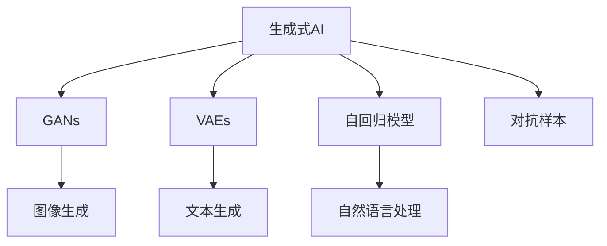

                 

# 生成式AI：如何应对技术发展带来的挑战？

## 1. 背景介绍

### 1.1 问题由来
生成式人工智能（Generative AI）是指能够生成新数据（如文本、图像、音频等）的AI模型，是近年来深度学习和机器学习领域的重要研究方向。生成式AI技术在图像生成、自然语言处理、音乐创作等领域展示了强大的应用潜力，极大地拓展了AI模型的工作范围和应用场景。然而，随着生成式AI技术的不断发展和普及，技术本身也面临着诸多挑战。

### 1.2 问题核心关键点
生成式AI的挑战主要集中在以下几个方面：
1. 模型的多样性和复杂性：生成式AI需要处理高度非结构化、多模态的数据，如自然语言、图像和音频等，这给模型的设计和优化带来了巨大难度。
2. 数据隐私和安全：生成式AI模型通常依赖大量的训练数据，如何确保数据隐私和安全是一个重要的挑战。
3. 模型的可解释性：生成式AI模型通常被视为"黑盒"系统，难以解释其内部工作机制和决策逻辑。
4. 模型的鲁棒性和泛化能力：生成式AI模型容易受到输入噪声、对抗样本等干扰，模型的鲁棒性和泛化能力需要进一步提升。
5. 计算资源的消耗：生成式AI模型通常需要高计算资源，如何在保证性能的同时降低资源消耗是亟待解决的问题。

这些挑战不仅影响生成式AI技术的进步，也制约了其在实际应用中的广泛落地。本文将深入探讨生成式AI的核心概念、关键算法及其在实际应用中的挑战和应对策略。

## 2. 核心概念与联系

### 2.1 核心概念概述

为更好地理解生成式AI的技术体系和挑战，本节将介绍几个关键概念：

- **生成式AI**：指能够生成新数据的AI模型，包括生成对抗网络（GANs）、变分自编码器（VAEs）、自回归模型（如Transformer）等。这些模型通过学习数据的统计特征，生成与真实数据相似的新样本。

- **对抗样本**：指在模型输入中加入微小的扰动，使得模型生成错误的输出结果，从而揭示模型的弱点。对抗样本常用于模型鲁棒性测试和防御。

- **生成对抗网络（GANs）**：由生成器（Generator）和判别器（Discriminator）两个组件组成，通过对抗训练生成逼真的新样本。GANs在图像生成、音频生成等任务上取得了显著效果。

- **变分自编码器（VAEs）**：一种基于概率生成模型的生成方法，通过学习数据的潜在分布生成新样本。VAEs在图像生成、文本生成等任务上有广泛应用。

- **自回归模型**：如Transformer，通过递归计算生成序列中的每个位置，具有较强的生成能力。Transformer在自然语言处理领域表现优异。

这些概念之间的逻辑关系可以通过以下Mermaid流程图来展示：



这个流程图展示生成式AI的核心概念及其之间的关系：

1. 生成式AI通过不同方法生成新数据。
2. GANs、VAEs和自回归模型是生成式AI的三大代表，分别在图像生成、文本生成和自然语言处理等方面发挥重要作用。
3. 对抗样本揭示了生成模型的弱点，用于模型鲁棒性测试和防御。

## 3. 核心算法原理 & 具体操作步骤
### 3.1 算法原理概述

生成式AI的核心算法主要包括生成对抗网络（GANs）、变分自编码器（VAEs）和自回归模型（如Transformer）等。这些算法通过学习数据的统计特征或概率分布，生成逼真的新数据。

### 3.2 算法步骤详解

#### 3.2.1 GANs算法

GANs由生成器（Generator）和判别器（Discriminator）两个组件组成，通过对抗训练生成逼真的新样本。GANs的基本步骤如下：

1. **生成器训练**：生成器接收随机噪声作为输入，输出一个与真实数据分布相似的新样本。
2. **判别器训练**：判别器接收一个新样本和一个真实样本，输出其真实性概率。
3. **对抗训练**：生成器和判别器交替训练，生成器试图生成能够欺骗判别器的样本，而判别器试图正确识别这些样本。

GANs的损失函数通常包括生成器的损失和判别器的损失，通过联合优化这两个损失函数，使生成器生成逼真的新样本，同时使判别器能够准确区分真实样本和生成样本。

#### 3.2.2 VAEs算法

VAEs是一种基于概率生成模型的生成方法，通过学习数据的潜在分布生成新样本。VAEs的基本步骤如下：

1. **编码器训练**：编码器接收真实数据作为输入，输出一个潜在分布的编码向量。
2. **解码器训练**：解码器接收编码向量作为输入，生成逼真的新样本。
3. **联合训练**：通过最小化生成数据和真实数据的重构误差，联合优化编码器和解码器。

VAEs的损失函数通常包括重构误差和潜在变分分布的KL散度，通过联合优化这两个损失函数，使VAEs生成逼真的新样本，同时学习数据的潜在分布。

#### 3.2.3 自回归模型

自回归模型如Transformer，通过递归计算生成序列中的每个位置，具有较强的生成能力。Transformer的基本步骤如下：

1. **编码器训练**：将序列中的每个位置作为输入，通过编码器输出一个向量表示。
2. **解码器训练**：将向量表示作为输入，通过解码器生成新序列。
3. **联合训练**：通过最小化新序列和真实序列的损失，联合优化编码器和解码器。

自回归模型的损失函数通常包括交叉熵损失，通过最小化新序列和真实序列的损失，使Transformer生成逼真的新序列。

### 3.3 算法优缺点

生成式AI的主要优点包括：
1. 生成数据的多样性：生成式AI能够生成各种类型的数据，如文本、图像和音频等。
2. 生成数据的高质量：生成式AI生成的数据与真实数据相似度高，能够用于多种应用场景。
3. 数据的无标签需求：生成式AI不需要大量标注数据，可以应用于数据稀缺的场景。

生成式AI的主要缺点包括：
1. 模型的复杂性：生成式AI模型通常较为复杂，训练和推理需要大量的计算资源。
2. 模型的可解释性：生成式AI模型通常被视为"黑盒"系统，难以解释其内部工作机制和决策逻辑。
3. 模型的鲁棒性：生成式AI模型容易受到对抗样本和噪声的干扰，模型的鲁棒性有待提升。
4. 数据隐私和安全：生成式AI模型依赖大量的训练数据，如何确保数据隐私和安全是一个重要问题。

### 3.4 算法应用领域

生成式AI技术在多个领域都有广泛应用，例如：

- **图像生成**：GANs在图像生成领域取得了显著效果，可以用于生成逼真的人脸图像、风景图像等。
- **文本生成**：VAEs和自回归模型在文本生成领域表现优异，可以用于生成新闻报道、诗歌等。
- **音乐生成**：生成式AI可以用于音乐创作，生成各种风格的音乐作品。
- **自然语言处理**：Transformer在自然语言处理领域应用广泛，可以用于机器翻译、文本摘要、对话系统等。

## 4. 数学模型和公式 & 详细讲解 & 举例说明

### 4.1 数学模型构建

生成式AI的数学模型通常包括生成器、判别器和潜在分布等概念。

- **生成器**：接收随机噪声作为输入，输出逼真的新样本。
- **判别器**：接收一个新样本和一个真实样本，输出其真实性概率。
- **潜在分布**：通过学习数据的潜在分布生成新样本。

### 4.2 公式推导过程

#### 4.2.1 GANs公式推导

GANs的生成器（Generator）和判别器（Discriminator）的损失函数分别如下：

$$
\mathcal{L}_{G} = \mathbb{E}_{z \sim p_{z}(z)} [D(G(z))] - \mathbb{E}_{x \sim p_{x}(x)} [D(G(x))]
$$

$$
\mathcal{L}_{D} = \mathbb{E}_{x \sim p_{x}(x)} [D(x)] + \mathbb{E}_{z \sim p_{z}(z)} [D(G(z))]
$$

其中，$G(z)$ 表示生成器接收随机噪声 $z$ 生成的新样本，$D(x)$ 表示判别器接收样本 $x$ 输出其真实性概率。

#### 4.2.2 VAEs公式推导

VAEs的编码器（Encoder）和解码器（Decoder）的损失函数分别如下：

$$
\mathcal{L}_{\text{recon}} = \mathbb{E}_{x \sim p_{x}(x)} \| x - G(\mu(z)) \|_{2}^{2} + \mathbb{E}_{z \sim p(z)} \| z - \mu(z) \|_{2}^{2}
$$

$$
\mathcal{L}_{\text{KL}} = \mathbb{E}_{z \sim p(z)} D_{\text{KL}} [p(z) || q(z | \mu(z), \sigma(z))]
$$

其中，$\mu(z)$ 表示编码器输出的潜在分布均值，$\sigma(z)$ 表示编码器输出的潜在分布方差，$q(z | \mu(z), \sigma(z))$ 表示解码器输出的潜在分布，$p(z)$ 表示真实数据的潜在分布。

#### 4.2.3 自回归模型公式推导

Transformer的编码器（Encoder）和解码器（Decoder）的损失函数分别如下：

$$
\mathcal{L}_{\text{loss}} = \frac{1}{N} \sum_{i=1}^{N} -y_i \log p(y_i | x_i, h)
$$

其中，$x_i$ 表示输入序列，$h$ 表示编码器输出的向量表示，$y_i$ 表示目标序列，$p(y_i | x_i, h)$ 表示解码器输出的概率分布。

### 4.3 案例分析与讲解

以GANs在图像生成中的应用为例，展示生成式AI的实际应用。假设我们要生成逼真的猫脸图像，可以按以下步骤进行操作：

1. **数据准备**：收集大量的猫脸图像作为训练数据。
2. **模型构建**：构建GANs模型，包括生成器和判别器两个组件。
3. **模型训练**：通过对抗训练，使生成器生成逼真的猫脸图像，判别器能够准确区分真实猫脸图像和生成猫脸图像。
4. **结果展示**：使用训练好的生成器生成新猫脸图像，并与真实图像进行比较，评估生成图像的质量。

### 5. 项目实践：代码实例和详细解释说明

#### 5.1 开发环境搭建

在进行生成式AI项目实践前，我们需要准备好开发环境。以下是使用Python进行TensorFlow开发的环境配置流程：

1. 安装Anaconda：从官网下载并安装Anaconda，用于创建独立的Python环境。

2. 创建并激活虚拟环境：
```bash
conda create -n tf-env python=3.8 
conda activate tf-env
```

3. 安装TensorFlow：根据CUDA版本，从官网获取对应的安装命令。例如：
```bash
conda install tensorflow
```

4. 安装其他必要库：
```bash
pip install numpy matplotlib scikit-learn
```

完成上述步骤后，即可在`tf-env`环境中开始生成式AI项目的开发。

#### 5.2 源代码详细实现

下面以GANs在图像生成中的应用为例，给出使用TensorFlow实现GANs的代码实现。

首先，定义GANs模型的生成器和判别器：

```python
import tensorflow as tf
from tensorflow.keras import layers

class Generator(tf.keras.Model):
    def __init__(self):
        super(Generator, self).__init__()
        self.dense1 = layers.Dense(256, input_dim=100)
        self.dense2 = layers.Dense(256)
        self.dense3 = layers.Dense(784, activation='tanh')
        
    def call(self, x):
        x = tf.reshape(x, [-1, 100])
        x = self.dense1(x)
        x = layers.LeakyReLU(alpha=0.2)(x)
        x = self.dense2(x)
        x = layers.LeakyReLU(alpha=0.2)(x)
        x = self.dense3(x)
        return x

class Discriminator(tf.keras.Model):
    def __init__(self):
        super(Discriminator, self).__init__()
        self.dense1 = layers.Dense(256, input_dim=784)
        self.dense2 = layers.Dense(128)
        self.dense3 = layers.Dense(1, activation='sigmoid')
        
    def call(self, x):
        x = self.dense1(x)
        x = layers.LeakyReLU(alpha=0.2)(x)
        x = self.dense2(x)
        x = layers.LeakyReLU(alpha=0.2)(x)
        x = self.dense3(x)
        return x

# 构建GANs模型
gan = tf.keras.Sequential()
gan.add(Generator())
gan.add(Discriminator())
```

然后，定义损失函数和优化器：

```python
def binary_crossentropy(y_true, y_pred):
    return tf.reduce_mean(tf.nn.sigmoid_cross_entropy_with_logits(labels=y_true, logits=y_pred))

def combined_loss(gan, x):
    g_loss = binary_crossentropy(tf.zeros_like(y), gan.discriminator(x))
    d_loss_real = binary_crossentropy(y, gan.discriminator(x))
    d_loss_fake = binary_crossentropy(tf.ones_like(y), gan.discriminator(gan.g(x)))
    d_loss = d_loss_real + d_loss_fake
    return g_loss, d_loss

def combined_optimizer(gan, x):
    g_optimizer = tf.keras.optimizers.Adam(learning_rate=0.0002)
    d_optimizer = tf.keras.optimizers.Adam(learning_rate=0.0002)
    g_optimizer.minimize(combined_loss(gan, x)[0], var_list=gan.trainable_variables)
    d_optimizer.minimize(combined_loss(gan, x)[1], var_list=gan.discriminator.trainable_variables)
    return g_optimizer, d_optimizer

# 准备训练数据
(x_train, y_train) = tf.keras.datasets.mnist.load_data()
x_train = x_train.reshape(-1, 784).astype('float32') / 255.0

# 准备优化器和损失函数
g_optimizer, d_optimizer = combined_optimizer(gan, x_train)
loss_fn = tf.keras.losses.BinaryCrossentropy()
```

接着，定义训练函数：

```python
@tf.function
def train_step(x):
    with tf.GradientTape() as tape:
        g_loss, d_loss = combined_loss(gan, x)
    g_optimizer, d_optimizer = combined_optimizer(gan, x)
    gradients_of_generator = tape.gradient(g_loss, gan.trainable_variables)
    gradients_of_discriminator = tape.gradient(d_loss, gan.discriminator.trainable_variables)
    g_optimizer.apply_gradients(zip(gradients_of_generator, gan.trainable_variables))
    d_optimizer.apply_gradients(zip(gradients_of_discriminator, gan.discriminator.trainable_variables))
    return g_loss, d_loss

# 训练模型
for epoch in range(100):
    batch_size = 32
    total_loss = 0
    for i in range(0, x_train.shape[0], batch_size):
        batch_x = x_train[i:i+batch_size]
        losses = train_step(batch_x)
        total_loss += losses[0] + losses[1]
    print("Epoch %d/%d, loss: %f" % (epoch+1, 100, total_loss))
    if epoch % 10 == 0:
        save_image(gan, epoch)
```

最后，将训练好的模型用于生成新图像：

```python
@tf.function
def generate_images(model, noise):
    return model(noise)

# 生成新图像
noise = tf.random.normal([10, 100])
generated_images = generate_images(gan, noise)
```

以上就是使用TensorFlow实现GANs图像生成任务的完整代码实现。可以看到，TensorFlow的Keras API使得模型的构建和训练变得简洁高效。

#### 5.3 代码解读与分析

让我们再详细解读一下关键代码的实现细节：

**GANs模型定义**：
- `Generator`类：定义生成器的神经网络结构，包括两个全连接层和一个输出层。
- `Discriminator`类：定义判别器的神经网络结构，包括两个全连接层和一个输出层。

**损失函数和优化器定义**：
- `binary_crossentropy`函数：自定义二元交叉熵损失函数，用于计算生成器和判别器的损失。
- `combined_loss`函数：计算GANs模型的联合损失。
- `combined_optimizer`函数：定义优化器，联合优化生成器和判别器的损失。

**训练函数定义**：
- `train_step`函数：定义每个训练步骤的具体操作，包括计算损失、更新参数等。
- `train`函数：定义整个训练过程，循环迭代训练步骤。

**生成新图像**：
- `generate_images`函数：定义生成新图像的操作，接收噪声向量作为输入，生成新图像。

可以看到，TensorFlow提供了完整的Keras API，使得GANs模型的构建和训练变得异常简单。开发者只需要关注模型结构和训练细节，而不必过多考虑底层实现。

## 6. 实际应用场景

### 6.1 智能推荐系统

生成式AI在智能推荐系统中有着广泛应用。传统的推荐系统依赖用户的历史行为数据进行推荐，但无法充分挖掘用户的潜在兴趣和偏好。生成式AI可以通过生成虚拟用户行为数据，模拟不同用户对物品的偏好，从而实现更加个性化和精准的推荐。

例如，电商网站可以通过生成式AI生成虚拟用户行为数据，模拟用户对商品的浏览、点击和购买行为，预测用户的潜在需求。生成式AI还可以用于生成新商品图片，吸引用户关注和购买。

### 6.2 图像生成和编辑

生成式AI在图像生成和编辑领域表现优异。GANs等生成式模型可以生成逼真的新图像，广泛应用于图像生成、人脸换脸、图像修复等任务。

例如，GANs可以生成逼真的人脸图像，应用于视频游戏中的角色制作、电影特效等领域。人脸换脸技术可以帮助用户快速生成自己或者名人的合成图像，用于社交媒体等场景。图像修复技术可以用于照片修复、历史图像修复等应用，提升图像质量。

### 6.3 文本生成和编辑

生成式AI在文本生成和编辑领域也有广泛应用。VAEs和自回归模型可以用于生成自然语言，应用于文本摘要、自动生成新闻报道、自动生成对话等任务。

例如，VAEs可以生成新闻报道和诗歌，用于自动生成新闻摘要和内容生成。自回归模型可以用于自动生成对话，应用于智能客服、聊天机器人等场景。

## 7. 工具和资源推荐

### 7.1 学习资源推荐

为了帮助开发者系统掌握生成式AI的理论基础和实践技巧，这里推荐一些优质的学习资源：

1. **《生成式深度学习》书籍**：该书系统介绍了生成式深度学习的理论基础和实际应用，适合深入学习生成式AI技术的读者。
2. **Coursera《深度学习基础》课程**：由斯坦福大学开设，涵盖了深度学习的基本概念和常见模型，为学习生成式AI奠定基础。
3. **Google AI博客**：Google AI团队定期发布深度学习领域的最新研究成果和技术动态，涵盖生成式AI在内的多个方向。
4. **arXiv预印本网站**：该网站收录了大量的深度学习研究论文，包括生成式AI领域的最新进展。
5. **Kaggle竞赛**：Kaggle是一个数据科学和机器学习竞赛平台，涵盖多个生成式AI方向的竞赛，有助于提升实际应用能力。

通过对这些资源的学习实践，相信你一定能够快速掌握生成式AI的核心技术和应用方法。

### 7.2 开发工具推荐

高效的开发离不开优秀的工具支持。以下是几款用于生成式AI开发的常用工具：

1. **TensorFlow**：由Google开发的开源深度学习框架，适合构建和训练生成式AI模型。
2. **PyTorch**：由Facebook开发的开源深度学习框架，支持动态图和静态图，灵活高效。
3. **Keras**：Keras是一个高层次的深度学习框架，适合快速原型设计和模型验证。
4. **Jupyter Notebook**：一个交互式的Python环境，方便开发者进行模型训练和调试。
5. **Google Colab**：Google提供的免费GPU/TPU算力环境，方便开发者快速测试和调试模型。

合理利用这些工具，可以显著提升生成式AI项目的开发效率，加快创新迭代的步伐。

### 7.3 相关论文推荐

生成式AI技术的发展源于学界的持续研究。以下是几篇奠基性的相关论文，推荐阅读：

1. **《生成对抗网络》论文**：由Ian Goodfellow等人发表，介绍GANs的基本原理和算法，是生成式AI领域的经典之作。
2. **《变分自编码器》论文**：由Ian Goodfellow等人发表，介绍VAEs的基本原理和算法，是生成式AI领域的另一经典之作。
3. **《自回归模型》论文**：由Andrej Karpathy等人发表，介绍自回归模型如Transformer的基本原理和算法。
4. **《自回归语言模型》论文**：由Yoshua Bengio等人发表，介绍自回归语言模型的应用和性能。
5. **《生成对抗网络和图像生成》论文**：由Tero Karras等人发表，介绍GANs在图像生成中的应用和最新进展。

这些论文代表了大生成式AI技术的发展脉络。通过学习这些前沿成果，可以帮助研究者把握学科前进方向，激发更多的创新灵感。

## 8. 总结：未来发展趋势与挑战

### 8.1 总结

本文对生成式AI的核心概念、关键算法及其在实际应用中的挑战和应对策略进行了全面系统的介绍。首先阐述了生成式AI的挑战和重要性，明确了其在图像生成、文本生成和自然语言处理等领域的应用前景。其次，从原理到实践，详细讲解了GANs、VAEs和自回归模型等生成式AI的关键算法及其具体操作步骤。同时，本文还广泛探讨了生成式AI在智能推荐系统、图像生成和编辑、文本生成和编辑等实际应用中的挑战和优化策略。

通过本文的系统梳理，可以看到，生成式AI技术正在成为深度学习和机器学习领域的重要方向，其应用前景广阔。未来，伴随生成式AI技术的不断演进，其在实际应用中的落地将进一步加速。

### 8.2 未来发展趋势

展望未来，生成式AI技术将呈现以下几个发展趋势：

1. **多样化的生成任务**：生成式AI将广泛应用于更多领域，如医学、法律、金融等，生成文本、图像、音频等多种类型的信息。
2. **更高的生成质量**：生成式AI模型将通过更加复杂的算法和更大的数据集进行训练，生成更高质量的数据。
3. **更加个性化的推荐**：生成式AI将用于生成虚拟用户行为数据，实现更加个性化和精准的推荐。
4. **更加智能的交互**：生成式AI将应用于智能客服、聊天机器人等场景，提供更加智能的交互体验。
5. **更加鲁棒的模型**：生成式AI模型将通过对抗样本和对抗训练等技术，提升模型的鲁棒性和泛化能力。
6. **更加高效的应用**：生成式AI模型将通过模型压缩、稀疏化存储等技术，降低计算资源消耗，提升应用效率。

这些趋势凸显了生成式AI技术的广阔前景。这些方向的探索发展，必将进一步提升生成式AI技术的应用价值，为人类认知智能的进化带来深远影响。

### 8.3 面临的挑战

尽管生成式AI技术已经取得了显著进展，但在迈向更加智能化、普适化应用的过程中，它仍面临着诸多挑战：

1. **模型的复杂性**：生成式AI模型通常较为复杂，训练和推理需要大量的计算资源。如何简化模型结构，提升模型的训练和推理效率，是一个重要挑战。
2. **数据隐私和安全**：生成式AI模型依赖大量的训练数据，如何确保数据隐私和安全，是一个重要问题。
3. **模型的可解释性**：生成式AI模型通常被视为"黑盒"系统，难以解释其内部工作机制和决策逻辑。如何提升模型的可解释性，是一个重要挑战。
4. **模型的鲁棒性**：生成式AI模型容易受到对抗样本和噪声的干扰，模型的鲁棒性需要进一步提升。
5. **数据多样性**：生成式AI模型通常依赖数据的多样性，如何获取多样化的训练数据，是一个重要问题。

这些挑战需要学术界和工业界的共同努力，通过技术创新和政策保障，推动生成式AI技术的发展和应用。

### 8.4 研究展望

面对生成式AI所面临的种种挑战，未来的研究需要在以下几个方面寻求新的突破：

1. **简化模型结构**：通过模型压缩、稀疏化存储等技术，简化生成式AI模型的结构，降低计算资源消耗，提升模型的训练和推理效率。
2. **提升模型鲁棒性**：通过对抗样本和对抗训练等技术，提升生成式AI模型的鲁棒性和泛化能力，使其能够应对各种数据和环境变化。
3. **增强模型可解释性**：通过因果分析和博弈论工具，增强生成式AI模型的可解释性和可控性，使其能够提供更加透明和可信的输出。
4. **保护数据隐私和安全**：通过差分隐私、联邦学习等技术，保护生成式AI模型的数据隐私和安全，确保数据不被滥用。
5. **增强模型多样性**：通过多模态融合、知识图谱等技术，增强生成式AI模型的多样性和应用场景，使其能够应用于更多领域。

这些研究方向的探索，必将引领生成式AI技术迈向更高的台阶，为人类认知智能的进化带来深远影响。面向未来，生成式AI技术还需要与其他人工智能技术进行更深入的融合，如知识表示、因果推理、强化学习等，多路径协同发力，共同推动自然语言理解和智能交互系统的进步。只有勇于创新、敢于突破，才能不断拓展语言模型的边界，让智能技术更好地造福人类社会。

## 9. 附录：常见问题与解答

**Q1：生成式AI的计算资源消耗是否过高？**

A: 生成式AI模型通常需要高计算资源，尤其是大型GANs模型。为了降低计算资源消耗，可以采用模型压缩、稀疏化存储等技术，简化模型结构。此外，使用GPU/TPU等高性能设备，也可以显著提升模型的训练和推理效率。

**Q2：生成式AI模型的可解释性不足怎么办？**

A: 生成式AI模型通常被视为"黑盒"系统，难以解释其内部工作机制和决策逻辑。为了提升模型的可解释性，可以引入因果分析和博弈论工具，增强模型的可解释性和可控性。同时，也可以采用模型蒸馏、解释性生成等技术，提供更加透明和可信的输出。

**Q3：生成式AI模型容易受到对抗样本干扰怎么办？**

A: 生成式AI模型容易受到对抗样本和噪声的干扰，模型的鲁棒性需要进一步提升。可以通过对抗样本和对抗训练等技术，增强模型的鲁棒性和泛化能力。同时，也可以采用模型融合、模型蒸馏等技术，降低对抗样本的干扰。

**Q4：生成式AI模型在特定领域的应用效果不佳怎么办？**

A: 生成式AI模型在特定领域的应用效果不佳，通常是因为数据分布差异较大。可以通过在特定领域语料上进一步预训练模型，或者在模型中引入领域特定的特征，提升模型在特定领域的应用效果。

**Q5：生成式AI模型是否依赖大量标注数据？**

A: 生成式AI模型通常依赖大量的训练数据，但不需要标注数据。通过生成虚拟数据，可以极大地降低对标注数据的依赖。但在某些特定应用场景下，如医疗、法律等领域，标注数据仍然是不可或缺的。

通过这些常见问题的解答，相信你能够更好地理解生成式AI技术的核心原理和实际应用。面向未来，生成式AI技术将伴随着人工智能技术的不断演进，进一步拓展其应用范围，带来更加智能和普适的解决方案。

