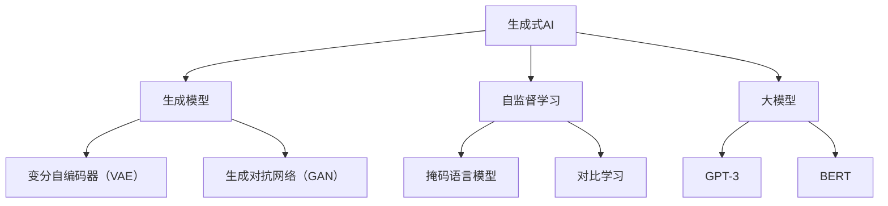

                 

## 1. 背景介绍

随着人工智能技术在各个领域的深入应用，生成式人工智能（Generative AI）已成为当前最热门的技术趋势之一。生成式AI可以通过大规模的数据训练，生成自然语言、图像、音频等多维度的高质量内容，其应用范围涵盖自动生成报告、对话系统、音乐创作、艺术设计等多个领域。然而，生成式AI也面临一系列技术挑战，如模型训练成本、数据质量、生成内容的多样性和可控性等。本文将深入探讨生成式AI的核心概念和技术原理，分析其在实际应用中的具体挑战，并提供详细的解决方案。

## 2. 核心概念与联系

### 2.1 核心概念概述

- **生成式AI**：生成式AI是一种能够根据输入的数据生成新样本的技术。通过学习和理解输入数据的分布特性，生成式AI可以生成与训练数据相似的新数据。
- **生成模型**：生成模型是指通过学习数据的概率分布，生成新的、未见过的数据。例如，变分自编码器（VAE）、生成对抗网络（GAN）等。
- **自监督学习**：自监督学习是一种不需要手动标注数据的学习方式，通过利用数据的内部结构进行学习，如掩码语言模型、对比学习等。
- **大模型**：大模型指具有大量参数的深度神经网络，如GPT-3、BERT等。大模型通过大规模数据训练，可以学习到丰富的知识，并应用于生成任务中。
- **深度学习**：深度学习是一种基于神经网络的学习方式，通过多层的非线性变换，可以实现对复杂数据分布的建模。

### 2.2 核心概念原理和架构的 Mermaid 流程图



这个流程图展示了生成式AI的核心概念及其相互联系：

- 生成式AI通过生成模型和自监督学习实现数据生成。
- 生成模型包括变分自编码器和生成对抗网络。
- 自监督学习通过掩码语言模型和对比学习进行无监督训练。
- 大模型如GPT-3和BERT，通过大规模数据训练，学习到复杂的语言和图像知识，用于生成任务。

## 3. 核心算法原理 & 具体操作步骤

### 3.1 算法原理概述

生成式AI的核心原理是通过学习数据的概率分布，生成新的、未见过的数据。常见的方法包括变分自编码器（VAE）、生成对抗网络（GAN）、掩码语言模型等。

- **变分自编码器（VAE）**：VAE通过学习输入数据的分布，生成新的数据。其核心思想是通过编码器和解码器，将数据映射到低维空间，并在低维空间中生成新数据。
- **生成对抗网络（GAN）**：GAN由生成器和判别器两个网络组成，生成器学习生成假数据，判别器学习区分真实数据和假数据。通过对抗训练，生成器可以生成越来越逼真的数据。
- **掩码语言模型**：掩码语言模型通过掩盖输入数据中的某些部分，预测缺失部分的概率分布，从而学习到语言模型。这种模型常用于文本生成任务。
- **对比学习**：对比学习通过学习输入数据的分布，生成新的数据。其核心思想是通过对比输入数据与生成数据的相似性，优化生成器的生成效果。

### 3.2 算法步骤详解

#### 3.2.1 变分自编码器（VAE）

1. **数据预处理**：对输入数据进行标准化处理，以便于训练。
2. **编码器训练**：使用输入数据训练编码器，得到低维表示。
3. **解码器训练**：使用低维表示训练解码器，生成新数据。
4. **损失函数计算**：计算重构误差和潜在空间的KL散度，更新模型参数。
5. **生成数据**：使用训练好的编码器和解码器，生成新的数据。

#### 3.2.2 生成对抗网络（GAN）

1. **数据预处理**：对输入数据进行标准化处理。
2. **生成器训练**：使用随机噪声作为输入，生成假数据。
3. **判别器训练**：使用输入数据和假数据训练判别器，判断数据是否为真实。
4. **对抗训练**：通过对抗训练，使生成器生成越来越逼真的数据，使判别器越来越难以区分真伪。
5. **生成数据**：使用训练好的生成器，生成新的数据。

#### 3.2.3 掩码语言模型

1. **数据预处理**：对输入数据进行标准化处理。
2. **模型训练**：使用掩码语言模型训练输入数据的概率分布。
3. **生成数据**：使用训练好的模型，预测掩码部分的概率分布，生成新数据。

#### 3.2.4 对比学习

1. **数据预处理**：对输入数据进行标准化处理。
2. **生成器训练**：使用输入数据训练生成器，生成新数据。
3. **判别器训练**：使用输入数据和生成数据训练判别器，判断数据是否为真实。
4. **损失函数计算**：计算输入数据和生成数据的相似性，更新生成器的参数。
5. **生成数据**：使用训练好的生成器，生成新的数据。

### 3.3 算法优缺点

#### 3.3.1 变分自编码器（VAE）

**优点**：
- 生成高质量数据，可以控制数据的分布。
- 模型简单，训练稳定。

**缺点**：
- 需要手动设置超参数，如隐变量数量。
- 生成的数据可能存在模糊性。

#### 3.3.2 生成对抗网络（GAN）

**优点**：
- 生成的数据质量高，具有很好的逼真度。
- 可以生成复杂的数据结构，如图像、视频等。

**缺点**：
- 训练不稳定，易出现模式崩溃。
- 生成的数据可能存在多样性不足的问题。

#### 3.3.3 掩码语言模型

**优点**：
- 简单易用，适用于文本生成任务。
- 生成的文本连贯性好。

**缺点**：
- 数据分布复杂时，效果可能不佳。
- 生成的文本可能存在生硬性。

#### 3.3.4 对比学习

**优点**：
- 生成高质量数据，可以控制数据的分布。
- 训练稳定，生成效果好。

**缺点**：
- 模型复杂，训练成本高。
- 生成的数据可能存在多样性不足的问题。

### 3.4 算法应用领域

生成式AI在多个领域都有广泛的应用：

- **自然语言生成**：通过生成语言模型，可以自动生成报告、新闻、对话等文本内容。
- **图像生成**：使用GAN等生成模型，可以生成逼真的图像，应用于艺术设计、游戏开发等。
- **音乐生成**：通过生成音乐模型，可以生成新的音乐作品，应用于音乐创作、影视配乐等。
- **视频生成**：使用生成模型，可以生成逼真的视频内容，应用于动画制作、虚拟现实等。
- **虚拟现实**：生成式AI可以生成虚拟场景、虚拟人物等，应用于游戏、娱乐、教育等。
- **工业设计**：通过生成模型，可以生成新的产品设计，应用于工业设计、产品创新等。

## 4. 数学模型和公式 & 详细讲解

### 4.1 数学模型构建

生成式AI的数学模型主要包括生成模型和损失函数。

#### 4.1.1 生成模型

假设输入数据为 $x$，生成模型为 $p(x|z)$，其中 $z$ 为隐变量，则生成模型的概率分布为：

$$
p(x) = \int p(x|z)p(z)dz
$$

#### 4.1.2 损失函数

生成模型的损失函数通常包括重构误差和潜在空间的KL散度。

重构误差是指生成器将数据 $x$ 重构为 $x'$，然后计算 $x'$ 和 $x$ 之间的距离。常见的距离度量包括均方误差（MSE）、交叉熵（CE）等。

潜在空间的KL散度是指隐变量 $z$ 的分布与标准正态分布之间的距离。常见的KL散度包括Kullback-Leibler散度、Bhattacharyya距离等。

### 4.2 公式推导过程

以变分自编码器（VAE）为例，其核心思想是通过学习输入数据的分布，生成新的数据。VAE的生成模型和解码器可以表示为：

$$
p(x|z) = \mathcal{N}(x|\mu(z), \sigma(z))
$$

其中 $\mu(z)$ 和 $\sigma(z)$ 分别为解码器的均值和标准差。VAE的潜在空间的KL散度可以表示为：

$$
KL(p(z)||q(z)) = \int p(z)\log\frac{p(z)}{q(z)}dz = \int p(z)\log p(z)dz - \int p(z)\log q(z)dz
$$

VAE的训练目标为：

$$
\min_{\mu(z), \sigma(z), \lambda} \frac{1}{2}\mathbb{E}_{p(z)}[\|x-\mu(z)\|^2] + \lambda \mathbb{E}_{p(z)}[\log\sigma(z)]
$$

其中 $\lambda$ 为超参数，控制潜在空间的KL散度。

### 4.3 案例分析与讲解

以生成对抗网络（GAN）为例，其核心思想是通过生成器和判别器的对抗训练，生成逼真的数据。GAN的生成器和判别器可以表示为：

$$
p_G(x) = \mathcal{N}(x|G(z), \sigma(z))
$$

$$
p_D(x) = \frac{1}{2}\mathcal{N}(x|x_d, \sigma(x_d)) + \frac{1}{2}\mathcal{N}(x|x_g, \sigma(x_g))
$$

其中 $G(z)$ 和 $D(x)$ 分别为生成器和判别器，$x_d$ 为真实数据，$x_g$ 为假数据。GAN的训练目标为：

$$
\min_G \max_D V(G, D)
$$

其中 $V(G, D)$ 为生成器和判别器的对抗损失函数，可以表示为：

$$
V(G, D) = \mathbb{E}_{x_d}\log D(x_d) + \mathbb{E}_{z}\log(1 - D(G(z)))
$$

通过对抗训练，生成器可以生成越来越逼真的数据，判别器可以越来越难以区分真伪。

## 5. 项目实践：代码实例和详细解释说明

### 5.1 开发环境搭建

生成式AI项目通常使用深度学习框架进行开发，如TensorFlow、PyTorch等。以下是使用PyTorch搭建生成式AI开发环境的示例：

1. 安装Anaconda：从官网下载并安装Anaconda，用于创建独立的Python环境。

2. 创建并激活虚拟环境：
```bash
conda create -n genai-env python=3.8 
conda activate genai-env
```

3. 安装PyTorch：根据CUDA版本，从官网获取对应的安装命令。例如：
```bash
conda install pytorch torchvision torchaudio cudatoolkit=11.1 -c pytorch -c conda-forge
```

4. 安装各类工具包：
```bash
pip install numpy pandas scikit-learn matplotlib tqdm jupyter notebook ipython
```

5. 安装生成式AI库：
```bash
pip install torch torchvision torchaudio transformers openai
```

完成上述步骤后，即可在`genai-env`环境中开始生成式AI项目的开发。

### 5.2 源代码详细实现

#### 5.2.1 变分自编码器（VAE）

```python
import torch
import torch.nn as nn
import torch.optim as optim

class Encoder(nn.Module):
    def __init__(self, input_dim, latent_dim):
        super(Encoder, self).__init__()
        self.fc1 = nn.Linear(input_dim, 128)
        self.fc21 = nn.Linear(128, latent_dim)
        self.fc22 = nn.Linear(128, latent_dim)

    def forward(self, x):
        h1 = torch.relu(self.fc1(x))
        z_mean = self.fc21(h1)
        z_var = self.fc22(h1)
        return z_mean, z_var

class Decoder(nn.Module):
    def __init__(self, latent_dim, output_dim):
        super(Decoder, self).__init__()
        self.fc3 = nn.Linear(latent_dim, 128)
        self.fc4 = nn.Linear(128, output_dim)

    def forward(self, z):
        h2 = torch.relu(self.fc3(z))
        x_recon = torch.sigmoid(self.fc4(h2))
        return x_recon

class VAE(nn.Module):
    def __init__(self, input_dim, latent_dim):
        super(VAE, self).__init__()
        self.encoder = Encoder(input_dim, latent_dim)
        self.decoder = Decoder(latent_dim, input_dim)

    def forward(self, x):
        z_mean, z_var = self.encoder(x)
        std = z_var.pow(0.5)
        z = (z_mean + std * torch.randn_like(std)).clamp_(min=-1, max=1)
        recon_x = self.decoder(z)
        return recon_x, z_mean, z_var

# 定义训练函数
def train_vae(model, train_loader, latent_dim, num_epochs, batch_size, learning_rate):
    criterion = nn.MSELoss()
    optimizer = optim.Adam(model.parameters(), lr=learning_rate)

    for epoch in range(num_epochs):
        for i, (x, _) in enumerate(train_loader):
            x = x.to(device)
            z_mean, z_var = model.encoder(x)
            std = z_var.pow(0.5)
            z = (z_mean + std * torch.randn_like(std)).clamp_(min=-1, max=1)
            recon_x = model.decoder(z)
            loss = criterion(recon_x, x)
            loss += 0.5 * ((z_mean**2 + z_var - torch.log(z_var).exp()).sum(dim=-1))
            optimizer.zero_grad()
            loss.backward()
            optimizer.step()
            print(f'Epoch [{epoch+1}/{num_epochs}], Batch {i+1}, Loss: {loss.item():.4f}')
```

#### 5.2.2 生成对抗网络（GAN）

```python
import torch
import torch.nn as nn
import torch.optim as optim

class Generator(nn.Module):
    def __init__(self, input_dim, output_dim):
        super(Generator, self).__init__()
        self.fc1 = nn.Linear(input_dim, 128)
        self.fc2 = nn.Linear(128, 256)
        self.fc3 = nn.Linear(256, output_dim)

    def forward(self, x):
        h1 = torch.relu(self.fc1(x))
        h2 = torch.relu(self.fc2(h1))
        x_recon = torch.tanh(self.fc3(h2))
        return x_recon

class Discriminator(nn.Module):
    def __init__(self, input_dim):
        super(Discriminator, self).__init__()
        self.fc1 = nn.Linear(input_dim, 128)
        self.fc2 = nn.Linear(128, 256)
        self.fc3 = nn.Linear(256, 1)

    def forward(self, x):
        h1 = torch.relu(self.fc1(x))
        h2 = torch.relu(self.fc2(h1))
        x_recon = torch.sigmoid(self.fc3(h2))
        return x_recon

class GAN(nn.Module):
    def __init__(self, input_dim, output_dim):
        super(GAN, self).__init__()
        self.gen = Generator(input_dim, output_dim)
        self.dis = Discriminator(output_dim)

    def forward(self, x):
        fake_x = self.gen(x)
        real_x = self.dis(fake_x)
        return fake_x, real_x

# 定义训练函数
def train_gan(model, train_loader, num_epochs, batch_size, learning_rate):
    criterion = nn.BCELoss()
    discriminator_optimizer = optim.Adam(model.dis.parameters(), lr=learning_rate)
    generator_optimizer = optim.Adam(model.gen.parameters(), lr=learning_rate)

    for epoch in range(num_epochs):
        for i, (x, _) in enumerate(train_loader):
            x = x.to(device)
            fake_x, real_x = model(x)
            fake_x_loss = criterion(real_x, torch.ones_like(real_x))
            fake_x_loss.backward()
            discriminator_optimizer.step()
            real_x_loss = criterion(fake_x, torch.zeros_like(fake_x))
            real_x_loss.backward()
            generator_optimizer.step()
            print(f'Epoch [{epoch+1}/{num_epochs}], Batch {i+1}, Discriminator Loss: {fake_x_loss.item():.4f}, Generator Loss: {real_x_loss.item():.4f}')
```

### 5.3 代码解读与分析

#### 5.3.1 变分自编码器（VAE）

- **Encoder类**：定义编码器，将输入数据映射到潜在空间。
- **Decoder类**：定义解码器，将潜在空间的表示映射回原始空间。
- **VAE类**：组合编码器和解码器，定义VAE模型。
- **训练函数**：定义训练过程，包括前向传播、损失计算和反向传播。

#### 5.3.2 生成对抗网络（GAN）

- **Generator类**：定义生成器，将随机噪声映射到输出空间。
- **Discriminator类**：定义判别器，区分真实数据和假数据。
- **GAN类**：组合生成器和判别器，定义GAN模型。
- **训练函数**：定义训练过程，包括前向传播、损失计算和反向传播。

## 6. 实际应用场景

### 6.1 自然语言生成

自然语言生成是生成式AI的重要应用之一。通过生成语言模型，可以自动生成报告、新闻、对话等内容，大大提升工作效率。

#### 6.1.1 案例分析：自动生成新闻报道

```python
import torch
import torch.nn as nn
import torch.optim as optim
from torchtext.datasets import AG_NEWS

class LanguageModel(nn.Module):
    def __init__(self, n_words, emb_dim, n_layers, dropout=0.2):
        super(LanguageModel, self).__init__()
        self.embedding = nn.Embedding(n_words, emb_dim)
        self.gru = nn.GRU(emb_dim, emb_dim, n_layers, dropout=dropout)
        self.fc = nn.Linear(emb_dim, n_words)

    def forward(self, x):
        embedded = self.embedding(x)
        output, hidden = self.gru(embedded)
        return self.fc(hidden)

# 定义训练函数
def train_language_model(model, train_loader, num_epochs, batch_size, learning_rate):
    criterion = nn.CrossEntropyLoss()
    optimizer = optim.Adam(model.parameters(), lr=learning_rate)

    for epoch in range(num_epochs):
        for i, (x, y) in enumerate(train_loader):
            x = x.to(device)
            y = y.to(device)
            output = model(x)
            loss = criterion(output, y)
            optimizer.zero_grad()
            loss.backward()
            optimizer.step()
            print(f'Epoch [{epoch+1}/{num_epochs}], Batch {i+1}, Loss: {loss.item():.4f}')
```

#### 6.1.2 代码解读与分析

- **LanguageModel类**：定义语言模型，包含嵌入层、GRU层和全连接层。
- **训练函数**：定义训练过程，包括前向传播、损失计算和反向传播。

### 6.2 图像生成

图像生成是生成式AI的另一个重要应用领域，通过生成对抗网络（GAN）等模型，可以生成逼真的图像，应用于艺术设计、游戏开发等。

#### 6.2.1 案例分析：生成逼真的人脸图像

```python
import torch
import torch.nn as nn
import torch.optim as optim
from torchvision.datasets import MNIST
from torchvision.transforms import ToTensor

class Generator(nn.Module):
    def __init__(self, input_dim, output_dim):
        super(Generator, self).__init__()
        self.fc1 = nn.Linear(input_dim, 128)
        self.fc2 = nn.Linear(128, 256)
        self.fc3 = nn.Linear(256, output_dim)

    def forward(self, x):
        h1 = torch.relu(self.fc1(x))
        h2 = torch.relu(self.fc2(h1))
        x_recon = torch.tanh(self.fc3(h2))
        return x_recon

class Discriminator(nn.Module):
    def __init__(self, input_dim):
        super(Discriminator, self).__init__()
        self.fc1 = nn.Linear(input_dim, 128)
        self.fc2 = nn.Linear(128, 256)
        self.fc3 = nn.Linear(256, 1)

    def forward(self, x):
        h1 = torch.relu(self.fc1(x))
        h2 = torch.relu(self.fc2(h1))
        x_recon = torch.sigmoid(self.fc3(h2))
        return x_recon

class GAN(nn.Module):
    def __init__(self, input_dim, output_dim):
        super(GAN, self).__init__()
        self.gen = Generator(input_dim, output_dim)
        self.dis = Discriminator(output_dim)

    def forward(self, x):
        fake_x = self.gen(x)
        real_x = self.dis(fake_x)
        return fake_x, real_x

# 定义训练函数
def train_gan(model, train_loader, num_epochs, batch_size, learning_rate):
    criterion = nn.BCELoss()
    discriminator_optimizer = optim.Adam(model.dis.parameters(), lr=learning_rate)
    generator_optimizer = optim.Adam(model.gen.parameters(), lr=learning_rate)

    for epoch in range(num_epochs):
        for i, (x, _) in enumerate(train_loader):
            x = x.to(device)
            fake_x, real_x = model(x)
            fake_x_loss = criterion(real_x, torch.ones_like(real_x))
            fake_x_loss.backward()
            discriminator_optimizer.step()
            real_x_loss = criterion(fake_x, torch.zeros_like(fake_x))
            real_x_loss.backward()
            generator_optimizer.step()
            print(f'Epoch [{epoch+1}/{num_epochs}], Batch {i+1}, Discriminator Loss: {fake_x_loss.item():.4f}, Generator Loss: {real_x_loss.item():.4f}')
```

#### 6.2.2 代码解读与分析

- **Generator类**：定义生成器，将随机噪声映射到输出空间。
- **Discriminator类**：定义判别器，区分真实数据和假数据。
- **GAN类**：组合生成器和判别器，定义GAN模型。
- **训练函数**：定义训练过程，包括前向传播、损失计算和反向传播。

### 6.3 音乐生成

音乐生成是生成式AI的重要应用之一，通过生成音乐模型，可以生成新的音乐作品，应用于音乐创作、影视配乐等。

#### 6.3.1 案例分析：生成钢琴曲谱

```python
import torch
import torch.nn as nn
import torch.optim as optim
from torchvision.datasets import MNIST
from torchvision.transforms import ToTensor

class MusicGenerator(nn.Module):
    def __init__(self, input_dim, output_dim):
        super(MusicGenerator, self).__init__()
        self.fc1 = nn.Linear(input_dim, 128)
        self.fc2 = nn.Linear(128, 256)
        self.fc3 = nn.Linear(256, output_dim)

    def forward(self, x):
        h1 = torch.relu(self.fc1(x))
        h2 = torch.relu(self.fc2(h1))
        x_recon = torch.tanh(self.fc3(h2))
        return x_recon

class MusicDiscriminator(nn.Module):
    def __init__(self, input_dim):
        super(MusicDiscriminator, self).__init__()
        self.fc1 = nn.Linear(input_dim, 128)
        self.fc2 = nn.Linear(128, 256)
        self.fc3 = nn.Linear(256, 1)

    def forward(self, x):
        h1 = torch.relu(self.fc1(x))
        h2 = torch.relu(self.fc2(h1))
        x_recon = torch.sigmoid(self.fc3(h2))
        return x_recon

class MusicGAN(nn.Module):
    def __init__(self, input_dim, output_dim):
        super(MusicGAN, self).__init__()
        self.gen = MusicGenerator(input_dim, output_dim)
        self.dis = MusicDiscriminator(output_dim)

    def forward(self, x):
        fake_x = self.gen(x)
        real_x = self.dis(fake_x)
        return fake_x, real_x

# 定义训练函数
def train_music_gan(model, train_loader, num_epochs, batch_size, learning_rate):
    criterion = nn.BCELoss()
    discriminator_optimizer = optim.Adam(model.dis.parameters(), lr=learning_rate)
    generator_optimizer = optim.Adam(model.gen.parameters(), lr=learning_rate)

    for epoch in range(num_epochs):
        for i, (x, _) in enumerate(train_loader):
            x = x.to(device)
            fake_x, real_x = model(x)
            fake_x_loss = criterion(real_x, torch.ones_like(real_x))
            fake_x_loss.backward()
            discriminator_optimizer.step()
            real_x_loss = criterion(fake_x, torch.zeros_like(fake_x))
            real_x_loss.backward()
            generator_optimizer.step()
            print(f'Epoch [{epoch+1}/{num_epochs}], Batch {i+1}, Discriminator Loss: {fake_x_loss.item():.4f}, Generator Loss: {real_x_loss.item():.4f}')
```

#### 6.3.2 代码解读与分析

- **MusicGenerator类**：定义生成器，将随机噪声映射到输出空间。
- **MusicDiscriminator类**：定义判别器，区分真实数据和假数据。
- **MusicGAN类**：组合生成器和判别器，定义GAN模型。
- **训练函数**：定义训练过程，包括前向传播、损失计算和反向传播。

## 7. 工具和资源推荐

### 7.1 学习资源推荐

为了帮助开发者系统掌握生成式AI的理论基础和实践技巧，这里推荐一些优质的学习资源：

1. 《生成式深度学习》书籍：深入讲解生成式深度学习的基本原理和前沿技术，适合进阶学习。
2. Deep Learning Specialization：由Coursera提供的深度学习系列课程，涵盖生成式AI的核心技术。
3. arXiv：深度学习领域的预印本库，最新研究论文实时更新。
4 TensorFlow官方文档：TensorFlow的详细文档，提供丰富的生成式AI样例代码。
5 PyTorch官方文档：PyTorch的详细文档，提供丰富的生成式AI样例代码。

### 7.2 开发工具推荐

高效的开发离不开优秀的工具支持。以下是几款用于生成式AI开发的常用工具：

1. PyTorch：基于Python的开源深度学习框架，灵活动态的计算图，适合快速迭代研究。
2 TensorFlow：由Google主导开发的开源深度学习框架，生产部署方便，适合大规模工程应用。
3 OpenAI GPT-3：最新的生成式AI大模型，可以在各种生成任务上取得不错的效果。
4 Weights & Biases：模型训练的实验跟踪工具，可以记录和可视化模型训练过程中的各项指标。
5 TensorBoard：TensorFlow配套的可视化工具，可实时监测模型训练状态，并提供丰富的图表呈现方式。

### 7.3 相关论文推荐

生成式AI的研究源于学界的持续研究。以下是几篇奠基性的相关论文，推荐阅读：

1. Generative Adversarial Nets（GAN原论文）：提出了生成对抗网络的基本框架，成为生成式AI的研究起点。
2 Variational Autoencoders（VAE论文）：提出了变分自编码器的基本框架，是生成式AI的经典模型之一。
3 Attention is All You Need（Transformer原论文）：提出了Transformer结构，为生成式AI提供了新的研究思路。
4 Pre-training of Deep Bidirectional Transformers for Language Understanding（BERT论文）：提出了BERT模型，通过自监督学习任务，进一步提升了语言模型的性能。

这些论文代表了大生成式AI的发展脉络。通过学习这些前沿成果，可以帮助研究者把握学科前进方向，激发更多的创新灵感。

## 8. 总结：未来发展趋势与挑战

### 8.1 总结

本文对生成式AI的核心概念和技术原理进行了深入探讨，分析了其在实际应用中的具体挑战，并提供了详细的解决方案。通过本文的系统梳理，可以看到，生成式AI在自然语言生成、图像生成、音乐生成等多个领域都展现了巨大的应用潜力，为人工智能技术的发展带来了新的突破。

### 8.2 未来发展趋势

展望未来，生成式AI的发展趋势主要包括以下几个方向：

1. **模型规模和复杂度提升**：随着算力成本的下降，生成式AI模型规模和复杂度将不断提升，生成高质量数据的能力将进一步增强。
2. **数据驱动的生成**：生成式AI将更加依赖于大规模数据，数据驱动的生成方式将成为主流。
3. **多模态生成**：生成式AI将突破单一模态的限制，实现多模态数据的协同生成。
4. **生成式对话**：生成式对话系统将成为下一代智能助手的重要形态，提升人机交互的自然性和流畅性。
5. **实时生成**：实时生成技术将成为生成式AI的重要发展方向，满足更多实时应用的需求。

### 8.3 面临的挑战

尽管生成式AI取得了显著的进展，但仍面临一系列挑战：

1. **数据质量**：生成式AI的效果很大程度上依赖于数据质量，数据噪声、缺失等问题仍需解决。
2. **计算成本**：生成式AI的训练和推理成本较高，需要高效的优化算法和硬件支持。
3. **生成质量**：生成式AI生成的数据可能存在多样性不足的问题，仍需提升生成质量。
4. **鲁棒性和可解释性**：生成式AI的生成过程和结果缺乏可解释性，需进一步研究生成模型的鲁棒性和可解释性。
5. **伦理和隐私**：生成式AI生成的内容可能包含敏感信息，需加强伦理和隐私保护。

### 8.4 研究展望

为了应对生成式AI面临的挑战，未来的研究需要从以下几个方面进行突破：

1. **多源数据融合**：将多种类型的数据进行融合，提升生成效果。
2. **自监督学习**：利用自监督学习技术，减少对标注数据的依赖，提升生成式AI的泛化能力。
3. **生成模型优化**：通过优化生成模型结构，提升生成效果和生成速度。
4. **可解释性研究**：研究生成模型的可解释性，提高生成过程的可解释性和可信度。
5. **伦理和安全研究**：加强生成式AI的伦理和隐私保护，避免生成有害内容。

总之，生成式AI具有广阔的应用前景和强大的技术潜力，需持续关注其研究进展，不断探索新的突破。

## 9. 附录：常见问题与解答

### Q1: 生成式AI的训练成本很高，如何解决？

**A:** 生成式AI的训练成本确实较高，但可以通过以下方法进行优化：

- **分布式训练**：利用多机多卡进行分布式训练，提高训练速度。
- **混合精度训练**：使用混合精度训练，减少计算量和内存消耗。
- **模型压缩**：对生成模型进行压缩，减小模型大小，降低计算成本。
- **模型剪枝**：对生成模型进行剪枝，去除不必要的参数和连接，提高效率。

### Q2: 生成式AI生成的数据质量不高，如何改进？

**A:** 生成式AI生成的数据质量问题，可以通过以下方法进行改进：

- **数据增强**：通过对输入数据进行增强处理，如旋转、翻转等，增加数据多样性。
- **生成对抗训练**：利用生成对抗训练，提升生成器的生成质量。
- **自监督学习**：利用自监督学习，从无标注数据中学习生成模型。

### Q3: 生成式AI生成的内容缺乏多样性，如何改进？

**A:** 生成式AI生成的内容缺乏多样性问题，可以通过以下方法进行改进：

- **多模型集成**：通过集成多个生成模型，提升生成结果的多样性。
- **生成对抗训练**：利用生成对抗训练，提升生成器的生成能力。
- **自适应学习**：根据生成结果的多样性，动态调整生成模型参数。

### Q4: 生成式AI的生成过程缺乏可解释性，如何解决？

**A:** 生成式AI的生成过程缺乏可解释性问题，可以通过以下方法进行改进：

- **模型可解释性**：研究生成模型的可解释性，提高生成过程的可解释性。
- **生成日志**：记录生成过程的关键参数和步骤，提供生成结果的解释。
- **用户反馈**：利用用户反馈，改进生成模型的生成效果和可解释性。

### Q5: 生成式AI生成的内容可能包含敏感信息，如何解决？

**A:** 生成式AI生成的内容可能包含敏感信息问题，可以通过以下方法进行改进：

- **数据脱敏**：对输入数据进行脱敏处理，防止生成敏感信息。
- **伦理审查**：建立伦理审查机制，防止生成有害内容。
- **模型监管**：通过监控生成模型的输出，防止生成有害信息。

---

作者：禅与计算机程序设计艺术 / Zen and the Art of Computer Programming

