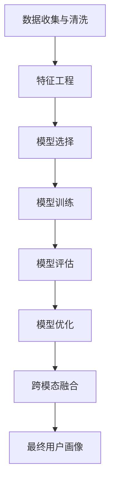

                 

## 1. 背景介绍

### 1.1 问题由来
在数字化时代的背景下，互联网平台和应用程序正通过收集和分析用户数据来优化用户体验和提升业务效率。用户画像(User Persona)是其中的一种重要工具，它帮助企业理解用户的行为特征、需求和偏好，从而制定更加精准的市场策略和产品改进方案。构建和优化用户画像，已经成为了各大互联网公司竞争的核心优势之一。

### 1.2 问题核心关键点
用户画像的构建与优化，是数据驱动决策的重要基础。如何从海量数据中提取有价值的特征，设计合理的模型，并进行有效的分析，是当前研究的热点。本文将系统性地介绍用户画像的构建与优化方法，涵盖从数据收集、特征工程、模型选择到结果评估的全过程。

### 1.3 问题研究意义
构建和优化用户画像，对于企业提升用户体验、优化营销策略、个性化推荐、客户服务等方面具有重要意义：

- **提升用户体验**：通过深入理解用户行为和偏好，可以更好地设计产品和界面，提高用户满意度和粘性。
- **优化营销策略**：基于用户画像的精准定位，能够提高广告和推广的效率和效果。
- **个性化推荐**：利用用户画像推荐个性化的产品和服务，增强用户黏性和购买意愿。
- **客户服务改进**：通过分析用户画像，针对性地提升客户服务质量，减少客户流失率。

## 2. 核心概念与联系

### 2.1 核心概念概述

为了深入理解用户画像的构建与优化方法，本节将介绍几个关键概念：

- **用户画像(User Persona)**：通过收集和分析用户数据，构建出反映用户特征的虚拟人物模型，用于指导产品设计和市场策略。
- **特征工程(Feature Engineering)**：从原始数据中提取、构造和选择最具代表性的特征，提高模型的预测能力和泛化能力。
- **模型选择(Model Selection)**：从多种机器学习算法中选择最合适的模型，以获得最优的预测效果。
- **评估指标(Evaluation Metrics)**：用于衡量模型预测性能的指标，如准确率、召回率、F1值等。
- **模型优化(Model Optimization)**：通过调整模型参数、特征选择、正则化等手段，进一步提升模型性能。
- **跨模态特征融合(Cross-modal Feature Fusion)**：将不同模态的数据（如图像、文本、音频）融合在一起，构建更加全面的用户画像。

这些核心概念之间存在密切联系，共同构成了用户画像构建与优化的框架：

1. **数据收集与清洗**：获取用户数据并进行初步处理，是构建用户画像的第一步。
2. **特征工程**：从原始数据中提取和构造特征，构建用户特征向量。
3. **模型选择与训练**：选择合适的机器学习模型，并利用用户特征向量进行训练。
4. **模型评估**：使用评估指标衡量模型的预测性能。
5. **模型优化**：调整模型参数和特征选择，进一步提升模型效果。
6. **跨模态融合**：将不同模态的数据融合在一起，构建更全面的用户画像。

通过理解这些核心概念，我们可以更好地把握用户画像构建与优化的技术原理和方法。

### 2.2 核心概念原理和架构的 Mermaid 流程图



这个流程图展示了用户画像构建与优化的核心步骤：

1. 数据收集与清洗：从多个渠道获取用户数据，并进行初步清洗和预处理。
2. 特征工程：提取和构造用户特征，构建特征向量。
3. 模型选择：选择合适的机器学习模型，进行模型训练。
4. 模型评估：使用评估指标衡量模型性能，识别模型问题。
5. 模型优化：调整模型参数和特征选择，进一步提升模型效果。
6. 跨模态融合：将不同模态的数据融合在一起，构建更全面的用户画像。

这些步骤环环相扣，共同构成了用户画像构建与优化的完整流程。

## 3. 核心算法原理 & 具体操作步骤

### 3.1 算法原理概述

用户画像的构建与优化，本质上是一个有监督的机器学习问题。其核心思想是：通过构建用户特征向量，利用机器学习模型对用户行为进行预测，从而构建出反映用户特征的虚拟人物模型。

形式化地，假设用户特征向量为 $X \in \mathbb{R}^d$，用户标签为 $Y \in \{0,1\}$，表示用户是否具有某种特征。训练数据集为 $D = \{(X_i, Y_i)\}_{i=1}^N$。我们的目标是最小化损失函数 $\mathcal{L}(\theta)$，其中 $\theta$ 为模型的参数。常见的损失函数包括交叉熵损失、均方误差损失等。

通过梯度下降等优化算法，最小化损失函数 $\mathcal{L}(\theta)$，得到最优模型参数 $\hat{\theta}$。

### 3.2 算法步骤详解

用户画像的构建与优化一般包括以下几个关键步骤：

**Step 1: 数据收集与清洗**

- 从多个渠道（如网站日志、用户行为数据、问卷调查等）收集用户数据。
- 数据清洗：处理缺失值、异常值、重复记录等问题，保证数据质量。

**Step 2: 特征工程**

- 特征选择：选择最具代表性的特征，减少噪声和冗余。
- 特征构造：通过组合、变换等方式构造新的特征，提高模型性能。
- 特征归一化：将特征值映射到一定范围内，便于算法处理。

**Step 3: 模型选择**

- 选择合适的机器学习算法，如逻辑回归、决策树、随机森林、神经网络等。
- 根据数据特征和任务需求，进行模型调参。

**Step 4: 模型训练**

- 将用户特征向量 $X$ 和用户标签 $Y$ 输入模型进行训练。
- 调整模型参数 $\theta$，最小化损失函数 $\mathcal{L}(\theta)$。

**Step 5: 模型评估**

- 使用测试集对模型进行评估，计算评估指标如准确率、召回率、F1值等。
- 根据评估结果，识别模型问题，进行改进。

**Step 6: 模型优化**

- 调整模型参数、特征选择等，进一步提升模型性能。
- 进行交叉验证，防止过拟合。

**Step 7: 跨模态融合**

- 将不同模态的数据（如图像、文本、音频）融合在一起，构建更加全面的用户画像。
- 选择合适的融合方法，如拼接、联合嵌入等。

**Step 8: 最终用户画像**

- 根据模型训练结果，构建出反映用户特征的虚拟人物模型。
- 可视化用户画像，帮助业务人员理解用户行为和偏好。

以上是用户画像构建与优化的主要步骤，在实际应用中，还需要针对具体任务进行优化设计，如改进训练目标函数、引入更多的正则化技术、搜索最优的超参数组合等，以进一步提升模型性能。

### 3.3 算法优缺点

用户画像的构建与优化方法具有以下优点：

1. **准确性高**：通过机器学习模型，可以高效地从大量数据中提取用户特征，提高预测的准确性。
2. **灵活性高**：根据具体任务需求，选择和调整模型参数和特征选择，适应不同的业务场景。
3. **泛化能力强**：利用大规模训练数据，可以构建出更具一般性的用户画像，提高模型泛化能力。
4. **可扩展性好**：可以轻松地加入新的特征和数据源，不断扩展和优化用户画像。

同时，该方法也存在一些局限性：

1. **数据依赖性强**：用户画像的构建依赖于高质量的数据，数据质量差会影响模型效果。
2. **算法复杂度高**：构建用户画像需要大量的特征工程和模型调参工作，对数据科学家的要求较高。
3. **隐私和安全问题**：用户画像涉及敏感信息，需要严格的数据保护措施，防止信息泄露和滥用。
4. **解释性不足**：机器学习模型的黑盒特性，使得用户画像的决策过程缺乏可解释性，难以调试和审计。

尽管存在这些局限性，但就目前而言，用户画像的构建与优化方法在NLP、推荐系统、广告投放等领域仍具有广泛应用，并取得了显著的效果。未来相关研究的重点在于如何进一步降低用户画像构建对数据量的依赖，提高模型的少样本学习和跨领域迁移能力，同时兼顾可解释性和伦理安全性等因素。

### 3.4 算法应用领域

用户画像的构建与优化方法已经在多个领域得到了广泛应用，例如：

- **个性化推荐系统**：通过用户画像推荐个性化的产品和服务，增强用户黏性和购买意愿。
- **广告投放优化**：基于用户画像的精准定位，提高广告的投放效果和转化率。
- **客户细分管理**：将用户分为不同的细分群体，针对性地制定营销策略，提高客户满意度。
- **内容推荐与分发**：根据用户画像推荐适合的内容，提升用户的阅读体验和粘性。
- **社交网络分析**：分析用户画像，挖掘社交网络中的关键节点和影响因素，优化社交网络结构。

除了上述这些经典应用外，用户画像的构建与优化方法还在更多场景中得到应用，如情感分析、舆情监控、用户行为预测等，为业务决策提供数据支持。

## 4. 数学模型和公式 & 详细讲解 & 举例说明

### 4.1 数学模型构建

本节将使用数学语言对用户画像的构建与优化过程进行更加严格的刻画。

假设用户特征向量为 $X \in \mathbb{R}^d$，用户标签为 $Y \in \{0,1\}$，表示用户是否具有某种特征。训练数据集为 $D = \{(X_i, Y_i)\}_{i=1}^N$。

定义模型 $M_{\theta}$ 在用户特征向量 $X$ 上的输出为 $\hat{Y}=M_{\theta}(X) \in [0,1]$，表示用户具有某种特征的概率。则二分类交叉熵损失函数定义为：

$$
\ell(M_{\theta}(X),Y) = -[y\log M_{\theta}(X) + (1-y)\log (1-M_{\theta}(X))]
$$

将其代入经验风险公式，得：

$$
\mathcal{L}(\theta) = -\frac{1}{N}\sum_{i=1}^N [Y_i\log M_{\theta}(X_i)+(1-Y_i)\log(1-M_{\theta}(X_i))]
$$

通过梯度下降等优化算法，最小化损失函数 $\mathcal{L}(\theta)$，得到最优模型参数 $\hat{\theta}$。

### 4.2 公式推导过程

以下我们以二分类任务为例，推导交叉熵损失函数及其梯度的计算公式。

假设模型 $M_{\theta}$ 在用户特征向量 $X$ 上的输出为 $\hat{Y}=M_{\theta}(X) \in [0,1]$，表示用户具有某种特征的概率。真实标签 $Y \in \{0,1\}$。则二分类交叉熵损失函数定义为：

$$
\ell(M_{\theta}(X),Y) = -[y\log M_{\theta}(X) + (1-y)\log (1-M_{\theta}(X))]
$$

将其代入经验风险公式，得：

$$
\mathcal{L}(\theta) = -\frac{1}{N}\sum_{i=1}^N [Y_i\log M_{\theta}(X_i)+(1-Y_i)\log(1-M_{\theta}(X_i))]
$$

根据链式法则，损失函数对参数 $\theta_k$ 的梯度为：

$$
\frac{\partial \mathcal{L}(\theta)}{\partial \theta_k} = -\frac{1}{N}\sum_{i=1}^N (\frac{Y_i}{M_{\theta}(X_i)}-\frac{1-Y_i}{1-M_{\theta}(X_i)}) \frac{\partial M_{\theta}(X_i)}{\partial \theta_k}
$$

其中 $\frac{\partial M_{\theta}(X_i)}{\partial \theta_k}$ 可进一步递归展开，利用自动微分技术完成计算。

在得到损失函数的梯度后，即可带入参数更新公式，完成模型的迭代优化。重复上述过程直至收敛，最终得到适应特定用户画像任务的最优模型参数 $\hat{\theta}$。

## 5. 项目实践：代码实例和详细解释说明

### 5.1 开发环境搭建

在进行用户画像构建与优化实践前，我们需要准备好开发环境。以下是使用Python进行Scikit-learn开发的环境配置流程：

1. 安装Anaconda：从官网下载并安装Anaconda，用于创建独立的Python环境。

2. 创建并激活虚拟环境：
```bash
conda create -n user_profile python=3.8 
conda activate user_profile
```

3. 安装Scikit-learn：
```bash
pip install scikit-learn
```

4. 安装NumPy、Pandas、Matplotlib等辅助库：
```bash
pip install numpy pandas matplotlib seaborn
```

5. 安装相关的数据处理和可视化库：
```bash
pip install sklearn-eda
```

完成上述步骤后，即可在`user_profile`环境中开始用户画像构建与优化的实践。

### 5.2 源代码详细实现

下面我们以用户情感分析为例，给出使用Scikit-learn对用户特征向量进行二分类微调的Python代码实现。

首先，定义数据处理函数：

```python
import pandas as pd
from sklearn.model_selection import train_test_split
from sklearn.preprocessing import StandardScaler
from sklearn.feature_selection import SelectKBest, chi2
from sklearn.ensemble import RandomForestClassifier

# 读取数据
data = pd.read_csv('user_data.csv', encoding='utf-8')

# 数据清洗
data = data.dropna()

# 特征工程
X = data.drop('label', axis=1)
Y = data['label']

# 特征选择
selector = SelectKBest(chi2, k=10)
X_selected = selector.fit_transform(X, Y)

# 数据分割
X_train, X_test, Y_train, Y_test = train_test_split(X_selected, Y, test_size=0.2, random_state=42)

# 数据归一化
scaler = StandardScaler()
X_train = scaler.fit_transform(X_train)
X_test = scaler.transform(X_test)

# 模型训练
clf = RandomForestClassifier(n_estimators=100, random_state=42)
clf.fit(X_train, Y_train)

# 模型评估
y_pred = clf.predict(X_test)
print('Accuracy:', metrics.accuracy_score(Y_test, y_pred))
```

然后，定义模型评估函数：

```python
from sklearn.metrics import accuracy_score, classification_report

def evaluate(clf, X_test, Y_test):
    y_pred = clf.predict(X_test)
    print('Accuracy:', accuracy_score(Y_test, y_pred))
    print(classification_report(Y_test, y_pred))
```

最后，启动训练流程并在测试集上评估：

```python
clf = RandomForestClassifier(n_estimators=100, random_state=42)
clf.fit(X_train, Y_train)

evaluate(clf, X_test, Y_test)
```

以上就是使用Scikit-learn对用户特征向量进行二分类微调的完整代码实现。可以看到，借助Scikit-learn的强大封装，我们可以快速构建和优化用户画像。

### 5.3 代码解读与分析

让我们再详细解读一下关键代码的实现细节：

**数据处理函数**：
- 读取用户数据文件，并进行初步清洗，去除缺失值和重复记录。
- 选择最具代表性的特征，使用卡方检验进行特征选择。
- 进行数据分割，将数据集划分为训练集和测试集。
- 对特征向量进行归一化，提高模型性能。

**模型训练函数**：
- 选择合适的随机森林分类器，进行模型训练。
- 利用训练集数据拟合模型。

**模型评估函数**：
- 使用测试集对模型进行评估，计算准确率等指标。
- 输出评估结果，帮助业务人员了解模型效果。

**训练流程**：
- 定义随机森林分类器，并进行模型训练。
- 在测试集上评估模型效果，输出评估结果。

可以看到，Scikit-learn提供了一整套完整的数据处理和模型评估流程，极大地方便了用户画像构建与优化任务的开发。

当然，工业级的系统实现还需考虑更多因素，如模型的保存和部署、超参数的自动搜索、更灵活的任务适配层等。但核心的微调范式基本与此类似。

## 6. 实际应用场景

### 6.1 智能客服系统

用户画像在智能客服系统中的应用非常广泛。通过收集用户的历史交互数据，构建用户画像，智能客服系统可以更加精准地识别用户需求，提供个性化服务。

例如，在用户咨询常见问题时，智能客服系统可以迅速识别用户的意图，给出相应的回答。在用户提出复杂问题时，系统可以调用更高级别的服务，进行问题转接或进一步分析。通过用户画像，智能客服系统能够不断学习和优化，提高服务的智能水平和用户体验。

### 6.2 个性化推荐系统

用户画像在个性化推荐系统中的应用同样非常重要。通过分析用户的浏览、点击、购买等行为数据，构建用户画像，推荐系统可以更加精准地推荐产品和服务，提高用户的满意度和购买意愿。

例如，用户在电商平台浏览某款商品时，推荐系统可以根据用户画像，推荐类似商品、相关商品、热门商品等，提高用户的购物体验。在用户进行购买后，推荐系统可以根据用户的购买历史和画像特征，推荐更多相关商品，提升用户的重复购买率。通过用户画像，个性化推荐系统能够更好地满足用户需求，提高用户黏性。

### 6.3 客户细分管理

用户画像在客户细分管理中也有重要应用。通过分析用户画像，可以将用户分为不同的细分群体，针对性地制定营销策略，提高客户满意度和忠诚度。

例如，在银行信用卡业务中，可以通过用户画像将客户分为高价值客户、潜在客户、流失客户等细分群体，针对性地设计优惠活动、提供专属服务，提高客户留存率和忠诚度。在保险公司中，可以通过用户画像分析客户的健康风险、保险需求等，设计更符合客户需求的保险产品，提升客户的购买意愿。通过用户画像，客户细分管理能够更好地实现差异化营销和精准营销，提高客户满意度和公司收益。

### 6.4 未来应用展望

随着用户画像构建与优化方法的不断进步，其在更多领域的应用前景将更加广阔。

在智慧医疗领域，通过构建用户画像，可以更好地理解用户的健康状况和需求，提供个性化的医疗服务和建议。在智能教育领域，用户画像可以用于学生的行为分析和个性化推荐，提高学习效果和教学质量。在智能交通领域，用户画像可以用于用户的出行习惯分析，优化交通管理和规划。在智能家居领域，用户画像可以用于用户的偏好分析和行为预测，提升家庭生活的智能化水平。

未来，用户画像的应用将不断拓展，成为更多行业数字化转型的重要工具，为构建智能化的产品和服务提供强有力的支持。

## 7. 工具和资源推荐

### 7.1 学习资源推荐

为了帮助开发者系统掌握用户画像的构建与优化理论基础和实践技巧，这里推荐一些优质的学习资源：

1. 《Python数据科学手册》（The Python Data Science Handbook）：介绍Python在数据科学领域的应用，包含数据处理、特征工程、机器学习等各个方面，适合新手入门。

2. Coursera《机器学习》课程：由斯坦福大学提供的经典课程，涵盖机器学习的基本概念和算法，包括分类、回归、聚类等任务，适合进一步学习和深造。

3. Kaggle数据科学竞赛：通过参与Kaggle比赛，可以实战练手，积累经验，了解最新的数据科学应用趋势。

4. Scikit-learn官方文档：Scikit-learn提供的详细文档和教程，包含丰富的案例和实例，适合学习和参考。

5. Jupyter Notebook：开源的交互式编程环境，支持多种语言，方便数据科学项目的学习和开发。

通过对这些资源的学习实践，相信你一定能够快速掌握用户画像构建与优化的精髓，并用于解决实际的业务问题。

### 7.2 开发工具推荐

高效的开发离不开优秀的工具支持。以下是几款用于用户画像构建与优化开发的常用工具：

1. Scikit-learn：Python数据挖掘和机器学习库，提供了丰富的机器学习算法和工具，适合数据科学家进行模型开发和调参。

2. TensorFlow：Google开发的开源深度学习框架，支持分布式训练和大规模模型部署，适合高并发和大型数据集的应用场景。

3. Keras：基于TensorFlow的高层API，提供简洁的接口，适合快速原型设计和实验验证。

4. H2O.ai：开源的机器学习平台，支持分布式训练和自动调参，适合大数据和分布式应用场景。

5. Tableau：数据可视化工具，支持多种数据源和图表类型，适合数据探索和报告分析。

6. RapidMiner：数据科学平台，提供数据准备、模型训练、业务分析等功能，适合数据科学项目的全面管理。

合理利用这些工具，可以显著提升用户画像构建与优化的开发效率，加快创新迭代的步伐。

### 7.3 相关论文推荐

用户画像构建与优化技术的发展得益于学界的持续研究。以下是几篇奠基性的相关论文，推荐阅读：

1. Understanding User Behavior: A Survey of User Modeling in Web Applications（《理解用户行为：Web应用用户建模综述》）：提供用户行为建模的全面综述，涵盖多种建模方法和应用场景。

2. User Profiling for Recommendation Systems: A Survey（《推荐系统用户画像：综述》）：介绍用户画像在推荐系统中的应用，包含多种用户画像构建和推荐算法。

3. Mining User Behavior Patterns: An Overview（《挖掘用户行为模式：综述》）：提供用户行为模式挖掘的全面综述，涵盖多种挖掘方法和应用场景。

4. User Profiling with Collaborative Filtering（《基于协同过滤的用户画像》）：探讨协同过滤在用户画像中的应用，提出多种协同过滤算法和优化方法。

5. Social Computing, Analytics, and Knowledge Discovery（《社会计算、分析和知识发现》）：介绍社会计算在用户画像中的应用，涵盖多种社会计算方法和应用场景。

这些论文代表了大用户画像构建与优化的发展脉络。通过学习这些前沿成果，可以帮助研究者把握学科前进方向，激发更多的创新灵感。

## 8. 总结：未来发展趋势与挑战

### 8.1 总结

本文对用户画像的构建与优化方法进行了全面系统的介绍。首先阐述了用户画像的构建与优化方法的理论基础和实践技巧，明确了用户画像在提升用户体验、优化营销策略、个性化推荐、客户服务等方面的重要性。其次，从原理到实践，详细讲解了用户画像构建与优化的数学模型和算法步骤，给出了用户画像构建与优化的完整代码实例。同时，本文还广泛探讨了用户画像在智能客服、个性化推荐、客户细分管理等各个领域的应用前景，展示了用户画像构建与优化的巨大潜力。最后，本文精选了用户画像构建与优化的学习资源和开发工具，力求为读者提供全方位的技术指引。

通过本文的系统梳理，可以看到，用户画像的构建与优化方法已经成为数据驱动决策的重要工具，极大地拓展了企业理解和应用用户行为的可能性。未来，随着数据的积累和算法的进步，用户画像构建与优化技术将进一步提升企业的智能化水平，带来更加个性化和高效的用户体验。

### 8.2 未来发展趋势

展望未来，用户画像构建与优化技术将呈现以下几个发展趋势：

1. **数据驱动决策**：随着数据量的增加，用户画像构建将更加依赖数据驱动，利用大数据分析和机器学习模型，深入挖掘用户行为特征和需求。

2. **多模态融合**：用户画像将越来越多地融合不同模态的数据（如图像、文本、音频），构建更加全面和准确的用户画像，提升决策的精准性。

3. **实时性增强**：用户画像的构建将更加注重实时性和时效性，利用流式数据处理技术，实现对用户行为的实时分析和预测。

4. **自动化和智能化**：用户画像的构建将逐渐自动化和智能化，利用自动化工具和算法，减少人工干预，提高效率和准确性。

5. **隐私保护和安全**：随着用户画像涉及的敏感信息增多，隐私保护和安全将更加重要，用户画像的构建将更加注重隐私保护和数据安全。

6. **跨领域应用**：用户画像的应用将更加广泛，涵盖多个行业和领域，如智慧医疗、智能交通、智慧城市等，为各行各业的数字化转型提供支持。

以上趋势凸显了用户画像构建与优化技术的广阔前景。这些方向的探索发展，必将进一步提升用户画像的精确性和实用性，为数据驱动的决策提供更加坚实的基础。

### 8.3 面临的挑战

尽管用户画像构建与优化技术已经取得了显著进展，但在迈向更加智能化、普适化应用的过程中，仍面临诸多挑战：

1. **数据质量问题**：用户画像的构建依赖于高质量的数据，数据质量差会影响模型效果。如何从多种数据源获取高质量数据，是当前面临的重要挑战。

2. **算法复杂度高**：构建用户画像需要大量的特征工程和模型调参工作，对数据科学家的要求较高。如何降低算法复杂度，提高构建效率，是亟待解决的问题。

3. **隐私和安全问题**：用户画像涉及敏感信息，需要严格的数据保护措施，防止信息泄露和滥用。如何平衡数据利用和隐私保护，是当前面临的重要挑战。

4. **解释性和可解释性不足**：机器学习模型的黑盒特性，使得用户画像的决策过程缺乏可解释性，难以调试和审计。如何增强用户画像的透明性和可解释性，是亟待解决的问题。

5. **多模态融合难度大**：将不同模态的数据融合在一起，构建更加全面的用户画像，涉及多种数据格式和特征表示的统一，难度较大。

6. **实时性需求高**：用户画像的构建需要实时性和时效性，利用流式数据处理技术，实现对用户行为的实时分析和预测，技术难度较高。

这些挑战需要跨学科的合作和不断的研究，才能逐步克服。相信随着技术的进步，用户画像构建与优化技术将不断提升，成为构建智能化的产品和服务的重要工具。

### 8.4 研究展望

面对用户画像构建与优化所面临的种种挑战，未来的研究需要在以下几个方面寻求新的突破：

1. **无监督和半监督学习**：探索无监督和半监督用户画像构建方法，摆脱对大量标注数据的依赖，利用自监督学习、主动学习等方法，最大限度利用非结构化数据，实现更加灵活高效的用户画像构建。

2. **参数高效和多模态融合**：开发参数高效和多模态融合用户画像构建方法，在固定大部分预训练参数的情况下，只更新极少量的任务相关参数，同时融合不同模态的数据，构建更加全面的用户画像。

3. **跨领域和跨模态应用**：探索跨领域和跨模态的用户画像构建方法，将用户画像应用于不同行业和不同模态的数据源，构建更加通用的用户画像模型。

4. **隐私保护和安全性**：引入隐私保护技术，如差分隐私、联邦学习等，保护用户数据的隐私和安全。同时引入安全机制，确保用户画像的合法使用。

5. **实时性和自动化**：利用流式数据处理技术，实现对用户行为的实时分析和预测。开发自动化工具和算法，减少人工干预，提高效率和准确性。

6. **跨学科研究**：与心理学、社会学、经济学等学科进行交叉研究，深入理解用户的心理和社会行为，提高用户画像的科学性和实用性。

这些研究方向将引领用户画像构建与优化技术迈向更高的台阶，为构建智能化的产品和服务提供强有力的支持。面向未来，用户画像构建与优化技术还需要与其他人工智能技术进行更深入的融合，如知识表示、因果推理、强化学习等，多路径协同发力，共同推动自然语言理解和智能交互系统的进步。只有勇于创新、敢于突破，才能不断拓展用户画像的边界，让智能技术更好地造福人类社会。

## 9. 附录：常见问题与解答

**Q1：用户画像的构建与优化是否适用于所有业务场景？**

A: 用户画像的构建与优化方法具有广泛的应用前景，但需要根据具体业务场景进行调整和优化。例如，在金融领域，用户画像需要考虑用户收入、信用等金融属性，而在电商领域，用户画像需要考虑用户的购物行为、偏好等。因此，构建用户画像时需要充分考虑业务特性和数据特性，选择适当的特征和算法。

**Q2：如何选择合适的用户画像特征？**

A: 选择合适的用户画像特征是构建用户画像的关键步骤。一般来说，可以从以下几个方面考虑：
1. 相关性：选择与业务目标相关的特征，提高模型的预测能力。
2. 重要性：选择对业务影响大的特征，如用户购买行为、浏览记录等。
3. 可解释性：选择易于解释和理解的用户特征，方便业务人员理解和使用。
4. 可获取性：选择数据获取成本低、质量高的特征，避免数据质量问题。

**Q3：用户画像的构建与优化过程中，如何处理缺失数据和异常数据？**

A: 在用户画像的构建与优化过程中，缺失数据和异常数据是常见的问题。处理缺失数据和异常数据的方法包括：
1. 数据插补：利用均值、中位数等方法填补缺失值。
2. 异常值检测：使用统计方法或机器学习算法检测和处理异常值。
3. 数据变换：将缺失值和异常值转换为更加合理的数值，如用0表示缺失值，用异常值表示特殊的用户行为等。

**Q4：用户画像的构建与优化过程中，如何避免过拟合？**

A: 避免过拟合是用户画像构建与优化的重要问题。常用的方法包括：
1. 数据增强：通过数据扩充、增强等手段，提高模型的泛化能力。
2. 正则化：使用L1正则、L2正则等方法，防止模型过度拟合。
3. 早停法：根据模型在验证集上的表现，提前停止训练，防止过拟合。
4. 特征选择：选择最具代表性的特征，减少噪声和冗余，提高模型的泛化能力。

**Q5：用户画像的构建与优化过程中，如何评估模型性能？**

A: 评估用户画像模型性能的方法包括：
1. 准确率：计算模型预测正确的样本数占总样本数的比例。
2. 召回率：计算模型正确预测的正样本数占真实正样本数的比例。
3. F1值：综合考虑准确率和召回率，计算模型的综合性能。
4. ROC曲线和AUC值：通过绘制ROC曲线和计算AUC值，评估模型的分类性能。
5. 混淆矩阵：通过混淆矩阵，分析模型的预测结果和真实标签的关系，识别模型的优点和不足。

**Q6：用户画像的构建与优化过程中，如何选择机器学习算法？**

A: 选择合适的机器学习算法是构建用户画像的重要步骤。一般来说，可以从以下几个方面考虑：
1. 任务类型：选择适合任务类型的算法，如分类任务可以使用逻辑回归、随机森林等算法。
2. 数据特性：根据数据特征和分布，选择适合的算法，如高维稀疏数据可以使用基于树结构的算法。
3. 模型复杂度：根据模型的复杂度和泛化能力，选择适合的算法，如小规模数据可以使用简单的算法，大规模数据可以使用复杂的算法。

以上是用户画像构建与优化的常见问题及其解答，希望这些信息能够帮助您更好地理解和应用用户画像构建与优化技术。

---

作者：禅与计算机程序设计艺术 / Zen and the Art of Computer Programming

